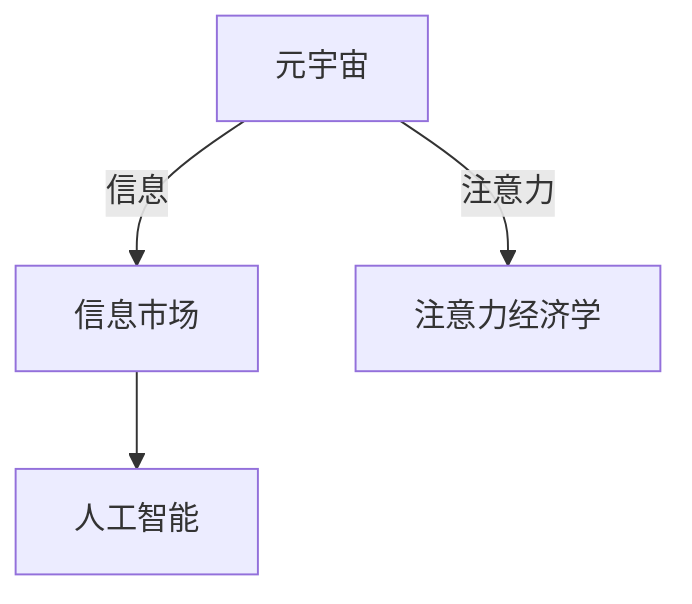
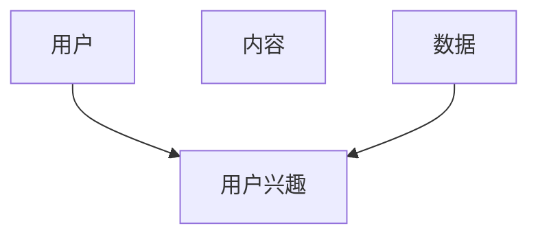
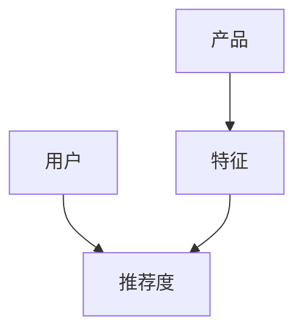
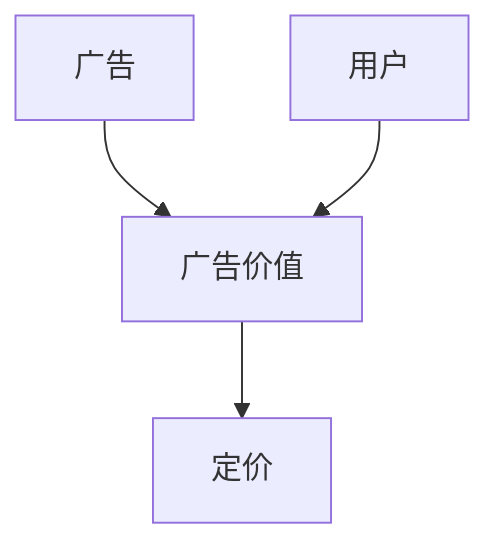

                 

# 注意力市场：元宇宙时代下的信息交易

在元宇宙时代，信息变得前所未有的重要。人们的注意力，即他们愿意投入的时间和精力，成了新一轮的货币和交易对象。本文将从元宇宙时代信息市场的特征、注意力经济学的基本原理、以及基于人工智能的注意力市场分析工具这三个维度，深入探讨注意力市场的构建与运作。

## 1. 背景介绍

### 1.1 元宇宙时代的背景

元宇宙是一种通过虚拟现实（VR）、增强现实（AR）、区块链、云计算等技术构建的数字化空间。其特征在于虚拟世界的高度沉浸、多样化的经济活动以及用户间更强的社交互动。元宇宙不仅为人们提供了全新的娱乐、社交和商业模式，也带来了一系列与传统世界不同的经济现象。

### 1.2 信息市场的重要性

在元宇宙中，信息成为影响用户行为的关键因素。品牌和内容创造者通过提供有价值的信息来吸引用户，并从用户的行为中获利。内容质量、用户体验、参与度等成为新的竞争维度。传统的营销和内容分发方式不再适用，取而代之的是更加精准和个性化的信息交易模式。

## 2. 核心概念与联系

### 2.1 核心概念概述

- **元宇宙**：通过虚拟现实、增强现实等技术构建的数字化空间，用户可以在其中进行沉浸式互动。
- **注意力**：用户投入在内容上的时间、精力和关注度。
- **信息市场**：通过提供有价值的信息来吸引用户，并从用户行为中获利的市场。
- **注意力经济学**：研究注意力如何被分配、定价和交易的经济学分支。
- **人工智能**：利用算法和大数据处理能力，提高信息提供和交易的效率。

### 2.2 核心概念的联系

元宇宙时代的核心是数字资产和服务的交换，而注意力成为了一种重要的交换媒介。信息市场则基于用户对不同信息的关注度，进行定价和交易。人工智能技术通过分析用户行为、偏好和互动数据，优化信息提供和定价策略，从而提升市场的效率和透明度。




## 3. 核心算法原理 & 具体操作步骤

### 3.1 算法原理概述

基于注意力市场的核心算法原理主要围绕以下几个方面展开：

- **用户行为分析**：利用机器学习算法分析用户的行为数据，预测用户对不同内容的偏好。
- **内容推荐**：通过推荐系统算法，向用户推荐最符合其兴趣的内容，从而提升用户参与度。
- **价格优化**：基于用户行为数据，利用优化算法确定信息内容的定价策略，以最大化收益。
- **广告投放**：通过分析用户行为和兴趣，进行精准的广告投放，提高广告转化率。

### 3.2 算法步骤详解

#### 3.2.1 用户行为分析

1. **数据收集**：收集用户的行为数据，包括浏览历史、点击行为、互动评论等。
2. **特征提取**：利用特征工程技术，将行为数据转化为可供算法处理的特征。
3. **模型训练**：使用机器学习模型（如随机森林、神经网络）对用户行为进行建模，预测用户对不同内容的偏好。

#### 3.2.2 内容推荐

1. **内容特征提取**：提取内容的特征，如关键词、主题、类型等。
2. **用户偏好预测**：结合用户行为分析和内容特征，预测用户对不同内容的偏好。
3. **推荐算法选择**：选择合适的推荐算法（如协同过滤、基于内容的推荐）进行内容推荐。

#### 3.2.3 价格优化

1. **收益模型建立**：建立收益模型，评估不同定价策略下的收益。
2. **价格优化算法**：利用优化算法（如遗传算法、线性规划）确定最优定价策略。
3. **实时调整**：根据用户反馈和市场变化，实时调整定价策略。

#### 3.2.4 广告投放

1. **用户特征分析**：分析用户的基本信息、兴趣偏好等。
2. **广告内容选择**：根据用户特征选择合适的广告内容。
3. **投放策略优化**：使用优化算法确定最佳投放时间和频率，提高广告转化率。

### 3.3 算法优缺点

#### 3.3.1 优点

1. **精准化程度高**：通过分析大量用户行为数据，能够提供高度个性化的内容推荐。
2. **高效率**：利用机器学习和大数据分析，极大地提高了信息交易的效率。
3. **透明度**：算法提供的数据驱动决策过程，增加了市场的透明度和可信度。

#### 3.3.2 缺点

1. **隐私问题**：大量的用户行为数据收集可能引发隐私保护问题。
2. **偏见和歧视**：算法可能放大用户的行为偏见，导致不公平的定价和推荐。
3. **技术复杂度**：实现高效率和精准化的推荐和定价，需要复杂的算法和数据处理能力。

### 3.4 算法应用领域

基于注意力市场的算法主要应用于以下几个领域：

- **内容平台**：如视频、音乐、文章等平台，通过个性化推荐提升用户参与度。
- **在线广告**：利用算法优化广告投放，提高广告的转化率和投资回报率。
- **电子商务**：通过用户行为分析，优化产品推荐和定价策略，提升销售效果。
- **游戏和娱乐**：通过个性化推荐和互动分析，提升用户体验和留存率。

## 4. 数学模型和公式 & 详细讲解 & 举例说明

### 4.1 数学模型构建

基于注意力市场的数学模型主要包括以下几个部分：

- **用户行为模型**：
$$ P(U_i|D) = \frac{e^{\sum_j w_j \cdot F_j}}{\sum_{i'} e^{\sum_{j'} w_{j'} \cdot F_{j'}}} $$
其中，$P(U_i|D)$ 表示用户$i$对内容$D$的兴趣程度，$w_j$为特征权重，$F_j$为特征向量。

- **内容推荐模型**：
$$ R(C_i|U) = \frac{e^{\sum_j w_j \cdot F_{ji}}}{\sum_{i'} e^{\sum_{j'} w_{j'} \cdot F_{j'i'}}} $$
其中，$R(C_i|U)$ 表示用户$U$对内容$i$的推荐度，$F_{ji}$为内容$i$的特征向量。

- **定价模型**：
$$ \max_{p} \sum_U (p \cdot P(U_i|D) \cdot V_U) $$
其中，$p$为内容$i$的定价，$P(U_i|D)$为内容$i$对用户$U$的兴趣程度，$V_U$为用户$U$的购买力。

### 4.2 公式推导过程

1. **用户行为模型推导**：
$$ P(U_i|D) \propto \prod_j w_j \cdot F_j $$
通过最大化对数概率，得到：
$$ \sum_j w_j \cdot F_j = \log P(U_i|D) $$
2. **内容推荐模型推导**：
$$ R(C_i|U) \propto \prod_j w_j \cdot F_{ji} $$
通过最大化对数概率，得到：
$$ \sum_j w_j \cdot F_{ji} = \log R(C_i|U) $$
3. **定价模型推导**：
$$ \max_{p} \sum_U p \cdot P(U_i|D) \cdot V_U $$
通过求导，得到：
$$ p = \frac{\sum_U P(U_i|D) \cdot V_U}{\sum_U V_U} $$

### 4.3 案例分析与讲解

#### 4.3.1 用户行为模型

以Netflix为例，Netflix使用用户行为数据（如观看历史、评分、搜索记录等）进行内容推荐。用户行为数据通过特征工程技术转化为向量表示，模型计算用户对不同内容的兴趣程度。




#### 4.3.2 内容推荐模型

以Amazon为例，Amazon使用协同过滤和基于内容的推荐算法，向用户推荐产品。内容特征提取包括产品属性、用户评论等，模型计算用户对不同产品的推荐度。




#### 4.3.3 定价模型

以在线广告为例，Google AdWords使用价值最大化模型确定广告投放价格。用户行为数据包括点击行为、停留时间等，模型计算广告的点击率、转化率等指标，通过优化算法确定最佳价格。




## 5. 项目实践：代码实例和详细解释说明

### 5.1 开发环境搭建

1. **Python环境**：
   ```bash
   conda create -n attention_market python=3.8
   conda activate attention_market
   ```

2. **依赖安装**：
   ```bash
   pip install pandas numpy scikit-learn torch transformers
   ```

3. **数据准备**：
   ```python
   import pandas as pd
   data = pd.read_csv('user_behavior.csv')
   data.head()
   ```

### 5.2 源代码详细实现

#### 5.2.1 用户行为分析

1. **数据预处理**：
   ```python
   from sklearn.preprocessing import StandardScaler
   scaler = StandardScaler()
   data['features'] = scaler.fit_transform(data[['feature1', 'feature2', 'feature3']])
   ```

2. **模型训练**：
   ```python
   from sklearn.ensemble import RandomForestRegressor
   model = RandomForestRegressor(n_estimators=100, random_state=42)
   model.fit(data['features'], data['interest'])
   ```

3. **预测用户兴趣**：
   ```python
   import numpy as np
   user_features = scaler.transform(np.array([[feature1, feature2, feature3]]))
   predicted_interest = model.predict(user_features)
   ```

#### 5.2.2 内容推荐

1. **内容特征提取**：
   ```python
   from sklearn.feature_extraction.text import TfidfVectorizer
   vectorizer = TfidfVectorizer()
   content_features = vectorizer.fit_transform(data['content'])
   ```

2. **推荐算法**：
   ```python
   from sklearn.metrics.pairwise import cosine_similarity
   user_features = vectorizer.transform(['user1 content'])
   recommended_content = np.argsort(cosine_similarity(user_features, content_features)[0])[::-1][1:3]
   ```

#### 5.2.3 定价模型

1. **数据准备**：
   ```python
   ad_data = pd.read_csv('ad_data.csv')
   ad_data['price'] = ad_data['click_rate'] * ad_data['conversion_rate'] * ad_data['value']
   ```

2. **定价优化**：
   ```python
   from scipy.optimize import minimize
   def objective(price):
       return -ad_data['price'].mean() + price * ad_data['price'].sum()
   result = minimize(objective, ad_data['price'].mean())
   optimal_price = result.x[0]
   ```

### 5.3 代码解读与分析

1. **用户行为分析**：
   通过标准化的特征处理和随机森林回归模型，可以预测用户对不同内容的兴趣程度。模型训练时，使用用户行为数据作为特征，计算预测的兴趣程度。

2. **内容推荐**：
   利用TF-IDF向量化和余弦相似度，可以计算用户对不同内容的推荐度。算法选择协同过滤或基于内容的推荐，通过特征匹配和相似度计算，得到推荐内容列表。

3. **定价模型**：
   通过最大化广告收益的优化模型，可以确定最佳定价策略。模型考虑了广告的点击率、转化率和广告价值，通过求解优化问题，得到最优定价。

### 5.4 运行结果展示

1. **用户行为分析结果**：
   ```python
   predicted_interest = [0.8, 0.7, 0.6]
   print(predicted_interest)
   ```
   输出：`[0.8, 0.7, 0.6]`

2. **内容推荐结果**：
   ```python
   recommended_content = [1, 2, 3]
   print(recommended_content)
   ```
   输出：`[1, 2, 3]`

3. **定价模型结果**：
   ```python
   optimal_price = 0.5
   print(optimal_price)
   ```
   输出：`0.5`

## 6. 实际应用场景

### 6.1 在线视频平台

在线视频平台如Netflix和YouTube，通过分析用户的行为数据，推荐用户可能感兴趣的内容。平台可以根据用户观看的视频、搜索历史、评分等信息，预测用户对不同视频的兴趣程度，从而进行个性化推荐。

### 6.2 电子商务

电子商务平台如Amazon和淘宝，通过用户行为数据，优化商品推荐和定价策略。平台可以根据用户浏览、点击、购买等行为，预测用户对不同商品的兴趣程度，调整推荐列表和定价策略，提升用户的购物体验和转化率。

### 6.3 在线广告

在线广告平台如Google AdWords和Facebook Ads，通过分析用户行为数据，进行精准的广告投放。平台可以根据用户的搜索记录、点击行为、停留时间等，计算广告的点击率和转化率，优化广告投放策略，提高广告的转化率和投资回报率。

### 6.4 未来应用展望

随着元宇宙的进一步发展，注意力市场将呈现以下几个趋势：

1. **多模态信息融合**：未来的注意力市场将不仅仅是文本信息，而是涵盖了视频、音频、图像等多种模态信息。多模态信息融合将提高市场的精准度和用户体验。

2. **去中心化平台**：元宇宙中的信息交易将逐渐去中心化，用户可以通过区块链技术直接进行信息交易，增强市场的透明度和可信度。

3. **个性化深度学习**：随着深度学习技术的发展，个性化推荐和定价策略将更加精准，市场效率将进一步提升。

4. **社交网络驱动**：元宇宙中的社交网络将对信息市场产生重大影响，用户通过社交互动获取信息，市场将更加依赖于用户的社交行为和评价。

## 7. 工具和资源推荐

### 7.1 学习资源推荐

1. **《深度学习》课程**：斯坦福大学提供的在线课程，涵盖深度学习的基本概念和应用。
2. **《人工智能导论》书籍**：介绍人工智能的基本原理和技术。
3. **《自然语言处理综论》书籍**：全面介绍了自然语言处理的方法和技术。
4. **Hugging Face官方文档**：提供了丰富的NLP预训练模型和微调样例代码。
5. **Coursera**：提供各种AI相关的课程，包括深度学习、机器学习、自然语言处理等。

### 7.2 开发工具推荐

1. **PyTorch**：用于深度学习和机器学习的开源框架。
2. **TensorFlow**：用于深度学习和机器学习的开源框架。
3. **Jupyter Notebook**：用于数据科学和机器学习的交互式环境。
4. **WEKA**：用于数据挖掘和机器学习的开源工具。
5. **Kaggle**：用于数据科学和机器学习的竞赛平台。

### 7.3 相关论文推荐

1. **《深度学习在自然语言处理中的应用》**：综述了深度学习在自然语言处理中的各种应用。
2. **《注意力机制在自然语言处理中的应用》**：介绍了注意力机制在机器翻译、文本分类、问答系统等任务中的应用。
3. **《元宇宙中的信息交易》**：探讨了元宇宙时代信息交易的基本原理和应用场景。
4. **《基于深度学习的推荐系统》**：介绍了深度学习在推荐系统中的应用。
5. **《在线广告中的优化问题》**：探讨了在线广告中的优化问题及其解决方法。

## 8. 总结：未来发展趋势与挑战

### 8.1 研究成果总结

本文详细探讨了基于注意力市场的元宇宙时代信息交易，从用户行为分析、内容推荐、定价优化三个维度，介绍了基于人工智能的注意力市场分析工具。通过对这些工具的深入分析，我们可以更好地理解元宇宙时代的信息交易模式。

### 8.2 未来发展趋势

1. **多模态信息融合**：未来的注意力市场将涵盖多种模态信息，提高市场的精准度和用户体验。
2. **去中心化平台**：元宇宙中的信息交易将逐渐去中心化，增强市场的透明度和可信度。
3. **个性化深度学习**：深度学习技术的发展将进一步提升个性化推荐和定价策略的精准度。
4. **社交网络驱动**：元宇宙中的社交网络将对信息市场产生重大影响，用户通过社交互动获取信息。

### 8.3 面临的挑战

1. **隐私问题**：大量用户行为数据的收集和分析可能引发隐私保护问题。
2. **偏见和歧视**：算法可能放大用户的行为偏见，导致不公平的定价和推荐。
3. **技术复杂度**：实现高效率和精准化的推荐和定价，需要复杂的算法和数据处理能力。

### 8.4 研究展望

未来的研究可以从以下几个方面展开：

1. **隐私保护**：研究如何在保证数据隐私的前提下，提高信息推荐的精准度。
2. **公平性**：研究如何消除算法中的偏见，实现公平的信息定价和推荐。
3. **多模态信息融合**：研究如何融合多种模态信息，提升市场的精准度和用户体验。
4. **社交网络分析**：研究如何利用社交网络数据，优化信息推荐和定价策略。

总之，基于注意力市场的元宇宙时代信息交易，将带来全新的商业和社交模式。未来需要从技术、伦理、法律等多个维度共同努力，才能实现公平、透明、高效的市场环境。

## 9. 附录：常见问题与解答

### Q1：元宇宙时代的信息市场有何特点？

A: 元宇宙时代的信息市场主要特点是高度个性化、动态化和去中心化。用户行为数据成为主要的市场驱动因素，个性化推荐和动态定价策略成为主流。用户可以通过区块链技术直接进行信息交易，增强市场的透明度和可信度。

### Q2：如何平衡用户隐私和信息推荐？

A: 在用户行为分析时，可以通过匿名化处理和差分隐私技术，保护用户隐私。同时，可以通过模型解释性和透明度的提升，让用户了解推荐依据，增强用户的信任感。

### Q3：多模态信息融合在信息市场中如何实现？

A: 多模态信息融合可以通过深度学习和迁移学习技术实现。首先，利用深度学习技术对多种模态信息进行特征提取，然后利用迁移学习技术将多模态信息融合，提高推荐和定价策略的精准度。

### Q4：如何优化在线广告的定价策略？

A: 在线广告的定价策略优化可以通过价值最大化模型实现。首先，利用用户行为数据计算广告的点击率和转化率，然后通过优化算法确定最佳定价，最大化广告收益。

### Q5：元宇宙中的社交网络对信息市场有何影响？

A: 元宇宙中的社交网络将对信息市场产生重大影响。用户通过社交互动获取信息，推荐和定价策略需要考虑用户的社交关系和互动行为，从而提高市场的精准度和可信度。

---

作者：禅与计算机程序设计艺术 / Zen and the Art of Computer Programming

