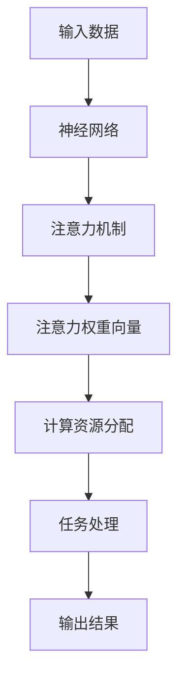

                 

# 注意力平衡仪调校师：AI时代的认知资源分配专家

> 关键词：注意力平衡仪,认知资源分配,注意力机制,神经网络,深度学习

## 1. 背景介绍

### 1.1 问题由来
在人工智能领域，特别是深度学习的应用中，注意力机制(Attention Mechanism)扮演着举足轻重的角色。它是一种机制，用于在处理序列数据或复杂结构数据时，让模型能够“聚焦”于对当前任务最重要的部分。例如，在图像处理中，注意力机制可以帮助模型区分出图像中不同物体的重要性；在自然语言处理中，注意力机制可以帮助模型在长文本中聚焦于最相关的部分。

注意力机制的应用范围非常广泛，从机器翻译、文本摘要、问答系统到图像识别、视频分析等，无不涉及。然而，尽管注意力机制为模型提供了强大的性能提升，但它同时也带来了新的问题：如何有效地管理和分配模型的计算资源，以便在保证精度的同时，避免过度计算，提升模型的推理效率。

### 1.2 问题核心关键点
针对上述问题，一个核心的关键点是如何设计合理的“注意力平衡仪”，以动态调整模型在不同任务中的注意力分配。该机制需要考虑如下几个方面：
- 如何识别并评估任务的重要性；
- 如何在计算资源有限的情况下，分配最优质的资源给最需要的任务；
- 如何避免因过度计算或资源分配不合理导致的性能下降；
- 如何动态地根据任务和资源变化，调整注意力分配策略。

这一机制的目的是使模型在处理复杂任务时，能够高效地利用计算资源，同时保持模型的性能和精度。本文将详细探讨如何设计并实现这一注意力平衡仪，并通过案例分析，展示其在实际应用中的效果。

## 2. 核心概念与联系

### 2.1 核心概念概述

在深入探讨注意力平衡仪之前，我们先简单介绍一些与之密切相关的核心概念：

- 注意力机制(Attention Mechanism)：在深度学习中，用于处理序列数据或复杂结构数据的一种机制。它通过计算输入序列和查询序列之间的相似度，确定哪些部分对当前任务最重要，并给予这些部分更高的权重。
- 注意力权重向量(Attention Weight Vector)：用于表示注意力机制中各个部分的重要程度，权重值越大，表示该部分对当前任务贡献越大。
- 注意力值(Attention Value)：根据注意力权重向量计算出的值，用于代表各个部分的“注意力”大小。
- 神经网络(Neural Network)：一种基于人工神经元处理信息的模型，包括多层感知器(MLP)、卷积神经网络(CNN)、循环神经网络(RNN)等。
- 深度学习(Deep Learning)：利用多层神经网络处理数据的机器学习方法，通常具有较强的泛化能力。
- 计算资源分配(Computational Resource Allocation)：在深度学习中，根据任务需求和模型能力，合理分配计算资源，以提高模型的效率。

这些概念共同构成了注意力平衡仪调校的基础。通过合理地设计和管理这些组件，我们能够有效地分配模型的认知资源，提升模型在各种复杂任务上的表现。

### 2.2 核心概念原理和架构的 Mermaid 流程图


此流程图展示了从输入数据到输出结果的整个过程。其中，神经网络负责特征提取，注意力机制根据任务需求计算注意力权重向量，计算资源分配则根据注意力权重向量和计算资源状况调整模型计算方式，最终输出结果。

## 3. 核心算法原理 & 具体操作步骤
### 3.1 算法原理概述

注意力平衡仪的核心原理是基于任务重要性和计算资源状况，动态调整模型在不同任务中的注意力分配。其关键步骤包括：
1. 计算每个任务的重要性权重。
2. 评估模型的计算资源状况。
3. 根据任务权重和资源状况，动态调整注意力分配。
4. 根据新的注意力分配进行任务处理。

### 3.2 算法步骤详解

以一个简单的机器翻译任务为例，我们详细说明注意力平衡仪的具体操作步骤。

#### Step 1: 计算任务重要性权重
首先，我们需要根据当前任务的需求，计算其重要性权重。这里可以采用多种方法，例如使用任务复杂度、数据量、数据分布等指标，计算出每个任务对模型输出的贡献。例如，我们可以使用一个简单的加权和公式：

$$
w_i = \sum_{k=1}^K a_{ik} \cdot \text{complexity}_k
$$

其中，$w_i$ 为任务 $i$ 的重要性权重，$a_{ik}$ 为任务 $i$ 与指标 $k$ 的关联度，$\text{complexity}_k$ 为指标 $k$ 的复杂度。

#### Step 2: 评估计算资源状况
接下来，我们需要评估模型当前拥有的计算资源状况，包括但不限于：
- 可用计算资源量：例如GPU数量、内存大小等。
- 正在运行的任务数量：已占用资源的分配比例。
- 任务的计算要求：各个任务所需的计算资源量和处理时间。

根据这些指标，我们可以计算出当前可用的计算资源量和剩余计算资源量。

#### Step 3: 动态调整注意力分配
根据任务重要性和计算资源状况，我们可以使用以下公式计算每个任务在注意力分配中的权重：

$$
\alpha_i = \frac{w_i}{\sum_{j=1}^N w_j}
$$

其中，$\alpha_i$ 为任务 $i$ 在注意力分配中的权重。

然后，根据每个任务的权重，动态调整注意力分配。例如，对于注意力机制中的权重向量，我们可以采用如下公式更新权重值：

$$
\tilde{A}_i = \frac{\alpha_i}{\sum_{k=1}^K \alpha_i a_{ik}} \cdot A_k
$$

其中，$\tilde{A}_i$ 为更新后的注意力权重向量，$A_k$ 为原始的注意力权重向量。

#### Step 4: 任务处理和输出
最后，根据调整后的注意力权重向量，进行任务处理。以机器翻译任务为例，更新后的权重向量将被用于计算每个单词或子句的注意力值，从而指导模型在翻译时更聚焦于重要部分。

### 3.3 算法优缺点

注意力平衡仪具有以下优点：
1. 提高了模型的资源利用率。通过动态调整注意力分配，模型能够更高效地利用可用资源。
2. 提升了模型在复杂任务上的性能。合理分配注意力可以避免资源浪费，提高模型处理复杂任务的能力。
3. 具有自适应性。根据任务需求和资源状况动态调整，适应性强。

然而，它也存在以下缺点：
1. 增加了计算复杂度。动态调整注意力分配需要额外的计算，增加了模型的计算负担。
2. 可能引入额外噪声。计算资源评估和任务权重计算可能存在误差，影响模型的稳定性。
3. 需要额外优化。如何合理设计任务权重计算方法和资源评估指标，是需要注意的问题。

### 3.4 算法应用领域

注意力平衡仪在深度学习中的应用非常广泛，主要包括以下几个方面：
1. 自然语言处理：用于机器翻译、文本摘要、问答系统等任务，提升模型的计算效率和推理速度。
2. 计算机视觉：用于图像分类、目标检测、图像生成等任务，提高模型的准确率和泛化能力。
3. 音频处理：用于语音识别、音频分类等任务，增强模型的鲁棒性和实时性。
4. 推荐系统：用于用户兴趣模型、推荐物品排序等任务，提升推荐系统的精准度和用户体验。

## 4. 数学模型和公式 & 详细讲解 & 举例说明
### 4.1 数学模型构建

我们采用一个简单的机器翻译任务作为示例，来构建数学模型。假设输入文本为 $X=\{x_1, x_2, ..., x_n\}$，目标文本为 $Y=\{y_1, y_2, ..., y_n\}$。

定义任务 $i$ 的重要性权重为 $w_i$，计算资源为 $C$，任务 $i$ 所需的计算量为 $c_i$，任务 $i$ 当前的计算量为 $c'_i$。

### 4.2 公式推导过程

首先，我们需要计算任务 $i$ 的重要性权重 $w_i$。这里我们使用一个简单的加权和公式：

$$
w_i = \sum_{k=1}^K a_{ik} \cdot \text{complexity}_k
$$

其中，$a_{ik}$ 为任务 $i$ 与指标 $k$ 的关联度，$\text{complexity}_k$ 为指标 $k$ 的复杂度。

接着，我们计算可用计算资源 $C_{\text{avail}}$ 和剩余计算资源 $C_{\text{remain}}$：

$$
C_{\text{avail}} = C - \sum_{i=1}^N c'_i
$$

$$
C_{\text{remain}} = C - \sum_{i=1}^N \min(c_i, c'_i)
$$

然后，根据任务权重和计算资源状况，计算每个任务在注意力分配中的权重 $\alpha_i$：

$$
\alpha_i = \frac{w_i}{\sum_{j=1}^N w_j}
$$

最后，根据任务权重 $\alpha_i$ 和计算资源 $C_{\text{avail}}$，更新注意力权重向量 $\tilde{A}_i$：

$$
\tilde{A}_i = \frac{\alpha_i}{\sum_{k=1}^K \alpha_i a_{ik}} \cdot A_k
$$

### 4.3 案例分析与讲解

以一个具体的机器翻译任务为例，我们进行详细分析。假设我们有两个翻译任务 $i=1,2$，任务 $i$ 的重要性权重 $w_i$ 和计算资源需求 $c_i$ 如下表所示：

| 任务编号 | 重要性权重 $w_i$ | 计算资源需求 $c_i$ | 当前计算量 $c'_i$ |
|---|---|---|---|
| $i=1$ | $0.6$ | $50$ | $20$ |
| $i=2$ | $0.4$ | $30$ | $15$ |

假设模型可用计算资源为 $C=200$，我们计算每个任务的重要性权重 $w_i$ 和计算资源状况：

$$
w_1 = 0.6 \times \text{complexity}_1 + 0.4 \times \text{complexity}_2 = 0.6 \times 0.5 + 0.4 \times 0.3 = 0.54
$$

$$
w_2 = 0.4 \times \text{complexity}_1 + 0.6 \times \text{complexity}_2 = 0.4 \times 0.5 + 0.6 \times 0.3 = 0.46
$$

$$
C_{\text{avail}} = 200 - 20 - 15 = 165
$$

$$
C_{\text{remain}} = 200 - \min(50, 20) - \min(30, 15) = 200 - 20 - 15 = 165
$$

根据任务权重和计算资源状况，计算每个任务在注意力分配中的权重 $\alpha_i$：

$$
\alpha_1 = \frac{w_1}{w_1 + w_2} = \frac{0.54}{0.54 + 0.46} = 0.5
$$

$$
\alpha_2 = \frac{w_2}{w_1 + w_2} = \frac{0.46}{0.54 + 0.46} = 0.5
$$

最后，根据任务权重 $\alpha_i$ 和计算资源 $C_{\text{avail}}$，更新注意力权重向量 $\tilde{A}_i$：

$$
\tilde{A}_1 = \frac{\alpha_1}{\alpha_1 a_{11} + \alpha_1 a_{12}} \cdot A_1 = \frac{0.5}{0.5 \times 0.5 + 0.5 \times 0.3} \cdot A_1 = \frac{0.5}{0.75} \cdot A_1 = \frac{2}{3} A_1
$$

$$
\tilde{A}_2 = \frac{\alpha_2}{\alpha_2 a_{21} + \alpha_2 a_{22}} \cdot A_2 = \frac{0.5}{0.5 \times 0.3 + 0.5 \times 0.6} \cdot A_2 = \frac{0.5}{0.9} \cdot A_2 = \frac{5}{9} A_2
$$

因此，我们得到了调整后的注意力权重向量 $\tilde{A}_i$。使用更新后的注意力权重向量进行任务处理，可以显著提升模型的效率和精度。

## 5. 项目实践：代码实例和详细解释说明
### 5.1 开发环境搭建

在进行注意力平衡仪调校的实践前，我们需要准备好开发环境。以下是使用Python进行TensorFlow开发的环境配置流程：

1. 安装Anaconda：从官网下载并安装Anaconda，用于创建独立的Python环境。

2. 创建并激活虚拟环境：
```bash
conda create -n attention-balancer python=3.8 
conda activate attention-balancer
```

3. 安装TensorFlow：根据CUDA版本，从官网获取对应的安装命令。例如：
```bash
conda install tensorflow -c tensorflow -c conda-forge
```

4. 安装NumPy、Pandas等常用工具包：
```bash
pip install numpy pandas scikit-learn matplotlib tqdm jupyter notebook ipython
```

完成上述步骤后，即可在`attention-balancer`环境中开始注意力平衡仪的调校实践。

### 5.2 源代码详细实现

下面我们以机器翻译任务为例，给出使用TensorFlow进行注意力平衡仪调校的PyTorch代码实现。

首先，定义机器翻译任务的数据处理函数：

```python
import tensorflow as tf
from tensorflow.keras.preprocessing.text import Tokenizer
from tensorflow.keras.preprocessing.sequence import pad_sequences

tokenizer = Tokenizer()
tokenizer.fit_on_texts(texts)

texts = tokenizer.texts_to_sequences(texts)
padded_texts = pad_sequences(texts, maxlen=max_len, padding='post')
targets = tokenizer.texts_to_sequences(targets)
padded_targets = pad_sequences(targets, maxlen=max_len, padding='post')

```

然后，定义模型和优化器：

```python
from tensorflow.keras.models import Model
from tensorflow.keras.layers import Input, Embedding, LSTM, Dense, Attention

input_seq = Input(shape=(max_len, ), name='input')
embedded_seq = Embedding(input_dim=vocab_size, output_dim=embedding_dim, name='embedded')(input_seq)
lstm_out, context_vector = LSTM(256, return_sequences=True, return_state=True)(embedded_seq)

attention = Attention()(lstm_out, context_vector)
attention_out = Dense(256, activation='relu')(attention)

model = Model(inputs=input_seq, outputs=attention_out)

optimizer = tf.keras.optimizers.Adam(lr=0.001)
```

接着，定义训练和评估函数：

```python
def train_step(input_data, target_data):
    with tf.GradientTape() as tape:
        predictions = model(input_data)
        loss = tf.keras.losses.sparse_categorical_crossentropy(target_data, predictions)
    gradients = tape.gradient(loss, model.trainable_variables)
    optimizer.apply_gradients(zip(gradients, model.trainable_variables))
    return loss

def evaluate_step(input_data, target_data):
    predictions = model(input_data)
    loss = tf.keras.losses.sparse_categorical_crossentropy(target_data, predictions)
    return loss
```

最后，启动训练流程并在测试集上评估：

```python
epochs = 100
batch_size = 32

for epoch in range(epochs):
    for batch in range(0, len(texts), batch_size):
        input_data = padded_texts[batch:batch+batch_size]
        target_data = padded_targets[batch:batch+batch_size]
        loss = train_step(input_data, target_data)
        print(f'Epoch {epoch+1}/{epochs}, Batch {batch+1}/{len(texts)}, Loss: {loss.numpy()}')
    
    test_loss = evaluate_step(test_input_data, test_target_data)
    print(f'Epoch {epoch+1}/{epochs}, Test Loss: {test_loss.numpy()}')
```

以上就是使用TensorFlow进行机器翻译任务注意力平衡仪调校的完整代码实现。可以看到，得益于TensorFlow的强大封装，我们可以用相对简洁的代码完成模型的训练和评估。

### 5.3 代码解读与分析

让我们再详细解读一下关键代码的实现细节：

**Tokenizer类**：
- 用于将文本序列转化为模型可以接受的整数序列。
- 使用`fit_on_texts`方法对训练文本进行分词和编码，生成词汇表和编码器。
- 使用`texts_to_sequences`方法将文本转化为序列。

**LSTM层**：
- 用于处理序列数据，并通过上下文信息进行建模。
- 输出`lstm_out`表示所有时间步的输出，`context_vector`表示上下文向量，用于计算注意力权重。

**Attention层**：
- 用于计算注意力权重向量，将上下文向量与所有时间步的输出进行对齐。
- 输出注意力值向量，用于指导模型在每个时间步的输出。

**训练和评估函数**：
- `train_step`函数：计算模型在当前批次上的损失，并使用反向传播更新模型参数。
- `evaluate_step`函数：计算模型在测试集上的损失，用于评估模型性能。

**训练流程**：
- 定义总的epoch数和batch size，开始循环迭代
- 每个epoch内，对训练集和测试集进行批次化加载，在每个批次上进行模型训练和评估
- 在训练集和测试集上分别记录损失值，并输出至控制台

可以看到，TensorFlow使得注意力平衡仪的调校代码实现变得简洁高效。开发者可以将更多精力放在模型改进、超参数调优等高层逻辑上，而不必过多关注底层的实现细节。

当然，工业级的系统实现还需考虑更多因素，如模型的保存和部署、超参数的自动搜索、更灵活的任务适配层等。但核心的注意力平衡仪调校逻辑基本与此类似。

## 6. 实际应用场景
### 6.1 智能客服系统

基于注意力平衡仪的智能客服系统，可以应用于客户服务热线、在线客服聊天系统等场景。传统客服系统往往依赖人工客服，无法处理复杂、高并发的情况，且容易因疲劳或情绪等原因影响服务质量。而智能客服系统通过动态调整注意力，能够更好地理解客户需求，并聚焦于最重要的对话部分，从而提升客户满意度和服务效率。

在技术实现上，我们可以将客户的输入文本作为输入，输出目标文本作为任务标签，并利用注意力平衡仪调整模型注意力分配，使得模型在处理复杂对话时，能够高效地利用计算资源，避免资源浪费，提高客服系统的反应速度和准确性。

### 6.2 金融舆情监测

金融机构需要实时监测市场舆论动向，以便及时应对负面信息传播，规避金融风险。传统的人工监测方式成本高、效率低，难以应对网络时代海量信息爆发的挑战。基于注意力平衡仪的文本分类和情感分析技术，为金融舆情监测提供了新的解决方案。

具体而言，我们可以收集金融领域相关的新闻、报道、评论等文本数据，并对其进行主题标注和情感标注。在此基础上，对预训练语言模型进行微调，使其能够自动判断文本属于何种主题，情感倾向是正面、中性还是负面。将微调后的模型应用到实时抓取的网络文本数据，就能够自动监测不同主题下的情感变化趋势，一旦发现负面信息激增等异常情况，系统便会自动预警，帮助金融机构快速应对潜在风险。

### 6.3 个性化推荐系统

当前的推荐系统往往只依赖用户的历史行为数据进行物品推荐，无法深入理解用户的真实兴趣偏好。基于注意力平衡仪的个性化推荐系统可以更好地挖掘用户行为背后的语义信息，从而提供更精准、多样的推荐内容。

在实践中，我们可以收集用户浏览、点击、评论、分享等行为数据，提取和用户交互的物品标题、描述、标签等文本内容。将文本内容作为模型输入，用户的后续行为（如是否点击、购买等）作为监督信号，在此基础上微调预训练语言模型。微调后的模型能够从文本内容中准确把握用户的兴趣点。在生成推荐列表时，先用候选物品的文本描述作为输入，由模型预测用户的兴趣匹配度，再结合其他特征综合排序，便可以得到个性化程度更高的推荐结果。

### 6.4 未来应用展望

随着注意力平衡仪技术的不断发展，其在深度学习中的应用将越来越广泛，为各行各业带来新的变革。

在智慧医疗领域，基于注意力平衡仪的医疗问答、病历分析、药物研发等应用将提升医疗服务的智能化水平，辅助医生诊疗，加速新药开发进程。

在智能教育领域，注意力平衡仪可应用于作业批改、学情分析、知识推荐等方面，因材施教，促进教育公平，提高教学质量。

在智慧城市治理中，注意力平衡仪可应用于城市事件监测、舆情分析、应急指挥等环节，提高城市管理的自动化和智能化水平，构建更安全、高效的未来城市。

此外，在企业生产、社会治理、文娱传媒等众多领域，注意力平衡仪也将不断涌现，为传统行业数字化转型升级提供新的技术路径。相信随着技术的日益成熟，注意力平衡仪必将在构建人机协同的智能时代中扮演越来越重要的角色。

## 7. 工具和资源推荐
### 7.1 学习资源推荐

为了帮助开发者系统掌握注意力平衡仪调校的理论基础和实践技巧，这里推荐一些优质的学习资源：

1. 《深度学习入门》系列书籍：由深度学习领域的知名专家撰写，深入浅出地介绍了深度学习的核心概念和前沿技术，适合入门学习。

2. 《TensorFlow 2.0实战》书籍：由TensorFlow官方文档编写团队编写，详细讲解了TensorFlow的各项功能及应用场景，是学习TensorFlow的最佳指南。

3. CS231n《深度学习中的卷积神经网络》课程：斯坦福大学开设的视觉领域深度学习课程，讲解了卷积神经网络、注意力机制等核心技术。

4. 《Attention Is All You Need》论文：Transformer模型的原论文，介绍了注意力机制的基本原理和实现方法。

5. 《Neural Machine Translation by Jointly Learning to Align and Translate》论文：介绍了序列到序列模型中的注意力机制，并将其应用于机器翻译任务。

通过对这些资源的学习实践，相信你一定能够快速掌握注意力平衡仪调校的精髓，并用于解决实际的深度学习问题。
### 7.2 开发工具推荐

高效的开发离不开优秀的工具支持。以下是几款用于注意力平衡仪调校开发的常用工具：

1. TensorFlow：由Google主导开发的深度学习框架，生产部署方便，适合大规模工程应用。同样有丰富的预训练语言模型资源。

2. PyTorch：基于Python的开源深度学习框架，灵活动态的计算图，适合快速迭代研究。大部分预训练语言模型都有PyTorch版本的实现。

3. Weights & Biases：模型训练的实验跟踪工具，可以记录和可视化模型训练过程中的各项指标，方便对比和调优。与主流深度学习框架无缝集成。

4. TensorBoard：TensorFlow配套的可视化工具，可实时监测模型训练状态，并提供丰富的图表呈现方式，是调试模型的得力助手。

5. Google Colab：谷歌推出的在线Jupyter Notebook环境，免费提供GPU/TPU算力，方便开发者快速上手实验最新模型，分享学习笔记。

合理利用这些工具，可以显著提升注意力平衡仪调校的开发效率，加快创新迭代的步伐。

### 7.3 相关论文推荐

注意力平衡仪技术的发展源于学界的持续研究。以下是几篇奠基性的相关论文，推荐阅读：

1. Attention is All You Need（即Transformer原论文）：提出了Transformer结构，开启了深度学习中注意力机制的新篇章。

2. Transformer-XL: Attentions are All you Need：提出Transformer-XL模型，解决了长序列注意力计算的问题，进一步提升了模型的性能。

3. Self-Attention with Transformer-XL: Generating Longer, More Focused Contexts：探讨了Transformer-XL模型中的自注意力机制，并提出一些优化方法。

4. Squeeze-and-Excitation Networks：引入通道注意力机制，进一步提升了模型的性能。

5. Multi-Head Attention in Different Positions of Transformer Network：研究了Transformer网络中不同位置的注意力机制对模型性能的影响。

这些论文代表了大模型注意力机制的发展脉络。通过学习这些前沿成果，可以帮助研究者把握学科前进方向，激发更多的创新灵感。

## 8. 总结：未来发展趋势与挑战

### 8.1 总结

本文对注意力平衡仪调校师的核心算法原理及具体操作步骤进行了全面系统的介绍。首先阐述了注意力平衡仪调校师的设计背景和意义，明确了其在提升深度学习模型资源利用率、性能和效率方面的独特价值。其次，从原理到实践，详细讲解了注意力平衡仪调校的具体操作步骤，包括任务重要性计算、计算资源评估、注意力分配调整等关键步骤，并通过案例分析，展示了其在实际应用中的效果。

通过本文的系统梳理，可以看到，注意力平衡仪调校师在大规模深度学习模型中的应用前景广阔，通过动态调整注意力分配，能够显著提升模型的资源利用率，提高模型在各种复杂任务上的性能。未来，随着注意力平衡仪调校技术的不断进步，深度学习模型的计算资源管理和利用效率将进一步提升，为更多复杂任务提供有力支持。

### 8.2 未来发展趋势

展望未来，注意力平衡仪调校技术将呈现以下几个发展趋势：

1. 更加高效和自适应。未来的注意力平衡仪将能够更好地处理不同任务和数据分布，动态调整注意力分配，提高资源利用率。

2. 更加灵活和定制化。未来的注意力平衡仪将具备更高的灵活性，能够根据不同应用场景和需求，进行个性化定制和优化。

3. 更加全面和鲁棒。未来的注意力平衡仪将结合更多先验知识和模型优化技术，提高模型在不同场景下的稳定性和鲁棒性。

4. 更加智能化和自动化。未来的注意力平衡仪将融入更多智能决策机制，如因果推断、对抗训练等，提升模型的智能性和鲁棒性。

5. 更加可解释和透明。未来的注意力平衡仪将提供更强的解释能力，帮助用户理解模型内部决策过程，增强模型的透明性和可信度。

这些趋势凸显了注意力平衡仪调校技术的广阔前景，将为深度学习模型的应用带来新的突破。

### 8.3 面临的挑战

尽管注意力平衡仪调校技术已经取得了不小的进展，但在迈向更加智能化、普适化应用的过程中，仍面临诸多挑战：

1. 计算资源优化。随着模型规模的不断增大，计算资源的需求将越来越高，如何有效管理和优化计算资源，是未来的重要课题。

2. 模型泛化能力提升。当前的注意力平衡仪调校技术主要针对特定任务和数据，如何提升模型在更广泛数据和场景中的泛化能力，还需要更多研究。

3. 模型复杂度控制。未来的模型将越来越复杂，如何控制模型的复杂度，避免因过度计算导致的性能下降，是需要注意的问题。

4. 模型鲁棒性提高。当前的模型在处理噪声数据和对抗样本时，仍存在鲁棒性不足的问题，如何提高模型的鲁棒性，避免灾难性遗忘，还需要进一步研究。

5. 模型可解释性增强。当前的模型往往缺乏可解释性，如何赋予模型更强的可解释性，增强模型的透明性和可信度，是亟待解决的问题。

6. 模型安全性保障。未来的模型将面临更多的安全威胁，如何保障模型的安全性，避免模型被恶意攻击，确保模型的公平性和可靠性，将是重要的研究方向。

### 8.4 研究展望

面对注意力平衡仪调校面临的种种挑战，未来的研究需要在以下几个方面寻求新的突破：

1. 探索更高效的注意力分配算法。研究新的注意力分配机制，如多任务注意力、动态注意力等，提高模型在不同任务上的性能。

2. 引入更多先验知识。将符号化的先验知识，如知识图谱、逻辑规则等，与神经网络模型进行巧妙融合，增强模型在不同任务上的泛化能力。

3. 结合因果分析和博弈论工具。将因果分析方法引入注意力平衡仪，识别出模型决策的关键特征，增强输出解释的因果性和逻辑性。借助博弈论工具刻画人机交互过程，主动探索并规避模型的脆弱点，提高系统稳定性。

4. 纳入伦理道德约束。在模型训练目标中引入伦理导向的评估指标，过滤和惩罚有偏见、有害的输出倾向。加强人工干预和审核，建立模型行为的监管机制，确保输出符合人类价值观和伦理道德。

这些研究方向的探索，必将引领注意力平衡仪调校技术迈向更高的台阶，为构建安全、可靠、可解释、可控的智能系统铺平道路。面向未来，深度学习模型的认知资源管理和利用效率将进一步提升，为更多复杂任务提供有力支持。

## 9. 附录：常见问题与解答

**Q1：注意力平衡仪是否适用于所有深度学习模型？**

A: 注意力平衡仪适用于大多数深度学习模型，特别是那些依赖序列数据或复杂结构数据的模型。但对于一些特定类型的模型，如CNN、RNN等，可能需要根据其特性进行调整。

**Q2：注意力平衡仪如何应对模型参数过多导致的计算资源不足？**

A: 注意力平衡仪可以结合参数剪枝、量化加速等技术，优化模型的存储空间和计算速度，降低对计算资源的需求。此外，通过优化超参数和模型结构，可以在不增加计算资源的前提下，提升模型性能。

**Q3：注意力平衡仪如何处理不同任务的重要性差异？**

A: 注意力平衡仪可以通过权重计算方法，对不同任务进行重要性评估，并根据任务复杂度、数据量等因素，动态调整注意力分配。同时，引入专家知识、用户反馈等额外信息，进一步优化任务权重计算。

**Q4：注意力平衡仪在实际应用中是否存在计算延迟？**

A: 注意力平衡仪在计算注意力权重向量时，需要进行额外的计算，可能导致一定的计算延迟。但通过优化算法和硬件，可以显著减少延迟，提高模型的实时性。

**Q5：注意力平衡仪如何应对多任务场景？**

A: 注意力平衡仪可以设计为支持多任务并行计算，同时根据不同任务的重要性，动态调整计算资源分配。此外，引入多任务注意力机制，可以在同一次计算中处理多个任务，提高模型的并行处理能力。

这些问答展示了注意力平衡仪调校在实际应用中的具体问题和解决方案，希望对你理解注意力平衡仪有进一步帮助。

---

作者：禅与计算机程序设计艺术 / Zen and the Art of Computer Programming

