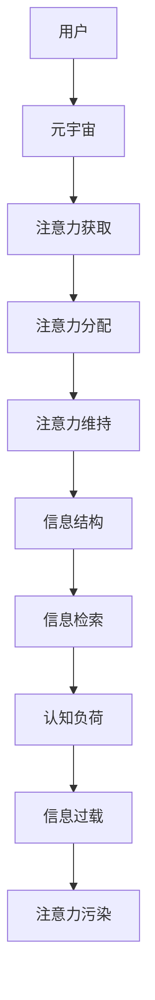

                 

# 注意力污染：元宇宙时代的新型环境问题

## 1. 背景介绍

随着虚拟现实(VR)、增强现实(AR)和扩展现实(XR)技术的兴起，元宇宙作为一个全新的数字空间正在逐渐成形。元宇宙不仅是一个高科技的娱乐平台，更是一个潜在的经济体和社会生态系统。然而，在元宇宙快速发展的同时，新型环境问题逐渐显现——注意力污染(Attention Pollution)。

注意力污染，指在元宇宙中，由于注意力资源的过度竞争，用户难以在信息海洋中发现对自己有价值的信息，甚至注意力被误导、分散，导致认知过载、效率下降的问题。随着元宇宙应用场景的增多，注意力污染现象日益严重，成为影响元宇宙体验和发展的关键因素之一。

本文章旨在探讨元宇宙中注意力污染的成因、特点及其解决策略，通过构建注意力污染的数学模型，提出一系列可行的优化方法和工程实践，为元宇宙环境的良性发展提供技术参考。

## 2. 核心概念与联系

### 2.1 核心概念概述

本节将详细介绍注意力污染的核心概念，并阐述其在元宇宙环境中的形成机制。

#### 2.1.1 注意力污染(Attention Pollution)

注意力污染指的是用户注意力在元宇宙中被大量无用的信息所干扰，导致有效信息难以被检索和利用，用户无法专注于有意义的内容，从而降低任务执行效率和用户体验。注意力污染可从注意力的获取、分配、维持等多个层面进行描述。

#### 2.1.2 元宇宙(Metaverse)

元宇宙是一个以虚拟现实、增强现实、扩展现实等技术为基础，通过区块链、云计算、人工智能等技术实现虚拟经济、社会生态系统等构建的虚拟空间。它涵盖多种应用场景，包括在线游戏、社交平台、教育培训、商业合作等。

#### 2.1.3 信息过载(Information Overload)

信息过载指用户被大量信息所淹没，导致无法有效地处理和利用信息，出现认知过载、决策困难等问题。注意力污染是信息过载在元宇宙中的一种特殊表现形式。

#### 2.1.4 认知负荷(Cognitive Load)

认知负荷指用户在学习、思考、决策过程中承受的心理负担。注意力污染导致的认知负荷增加，使用户更难于理解和处理复杂的信息。

#### 2.1.5 信息结构(Information Structure)

信息结构指信息的内在组织方式，包括信息的重要性、相关性、相关程度等。良好的信息结构有助于提高用户对信息的理解和使用效率。

### 2.2 核心概念原理和架构的 Mermaid 流程图



### 2.3 核心概念之间的联系

- **用户**与**元宇宙**：用户是元宇宙生态系统的核心，通过元宇宙获取信息和服务。
- **注意力获取**与**注意力分配**：注意力获取是指用户如何感知和接收信息，注意力分配则涉及用户如何选择和处理信息。
- **注意力维持**与**信息结构**：注意力维持指用户如何长时间保持对信息的关注，信息结构则影响用户如何组织和理解信息。
- **信息检索**与**认知负荷**：信息检索是将信息检索出来供用户使用，认知负荷则指用户在检索和使用信息过程中承担的心理负担。
- **信息过载**与**注意力污染**：信息过载是指用户被大量信息淹没，注意力污染则指用户注意力被干扰，难以专注于有意义的内容。

这些概念共同构成了元宇宙中的注意力污染问题，影响用户的信息获取和处理效率，进而影响元宇宙环境的健康发展。

## 3. 核心算法原理 & 具体操作步骤

### 3.1 算法原理概述

本节将详细描述注意力污染的数学模型，并解释其求解步骤。

#### 3.1.1 模型概述

我们假设元宇宙中有N个用户和M个信息源。每个用户每天分配固定的时间t进行信息获取和处理，信息源每天产生新的信息I。每个信息源每天产生信息的速度为v，信息的价值为w，每个用户对信息的注意力分配为A，用户对信息价值的评估为V。注意力污染的问题可以被描述为在固定时间t内，用户如何分配注意力A，以最大化信息价值V。

数学表达式如下：

$$
\maximize V = \sum_{i=1}^M A_i \times w_i
$$

$$
subject\ to: \sum_{i=1}^M A_i \leq t
$$

其中，$A_i$为第i个信息源分配给用户的注意力，$w_i$为第i个信息源的价值。

### 3.2 算法步骤详解

#### 3.2.1 步骤1：构建优化模型

首先构建上述优化模型，以最大化用户的信息价值V，同时满足时间约束。

#### 3.2.2 步骤2：设定约束条件

设定时间t、信息源数量M、信息速度v、信息价值w等参数，并根据用户行为和信息特征设定注意力分配策略。

#### 3.2.3 步骤3：求解优化问题

利用优化算法求解上述线性规划问题，找到最优的注意力分配方案A。

#### 3.2.4 步骤4：迭代优化

通过迭代优化，不断调整注意力分配方案，使信息价值V最大化，同时保持时间t的固定。

### 3.3 算法优缺点

#### 3.3.1 优点

- **模型简单**：构建的数学模型简单明了，易于理解和实现。
- **通用性强**：适用于不同类型的元宇宙应用场景，如在线游戏、社交平台、教育培训等。
- **结果可靠**：通过数学优化，可以确保找到最优的注意力分配方案，提升用户的信息价值。

#### 3.3.2 缺点

- **计算复杂**：求解线性规划问题可能需要较高计算资源，时间复杂度较高。
- **数据需求**：需要大量的用户行为和信息特征数据来训练和优化模型，数据获取难度较大。
- **用户行为动态变化**：用户的行为和偏好是动态变化的，难以完全捕捉，需要持续更新模型。

### 3.4 算法应用领域

#### 3.4.1 在线游戏

在在线游戏中，注意力污染可能体现在任务提示过多、广告干扰、角色过多等。通过优化注意力分配，可以提升用户的游戏体验和任务完成效率。

#### 3.4.2 社交平台

社交平台上，注意力污染可能体现在信息过载、无效消息干扰、用户关系管理等方面。通过优化注意力分配，可以更好地推荐有价值的信息给用户，提高用户的粘性和参与度。

#### 3.4.3 教育培训

在教育培训中，注意力污染可能体现在海量的教学内容和评估测试中。通过优化注意力分配，可以更有效地帮助学生学习，提升教学质量。

## 4. 数学模型和公式 & 详细讲解 & 举例说明

### 4.1 数学模型构建

本节将详细描述注意力污染的数学模型，并解释其求解步骤。

#### 4.1.1 模型构建

在元宇宙中，用户每天分配固定的时间t进行信息获取和处理，信息源每天产生新的信息I。每个信息源每天产生信息的速度为v，信息的价值为w，每个用户对信息的注意力分配为A，用户对信息价值的评估为V。注意力污染的问题可以被描述为在固定时间t内，用户如何分配注意力A，以最大化信息价值V。

数学表达式如下：

$$
\maximize V = \sum_{i=1}^M A_i \times w_i
$$

$$
subject\ to: \sum_{i=1}^M A_i \leq t
$$

其中，$A_i$为第i个信息源分配给用户的注意力，$w_i$为第i个信息源的价值。

### 4.2 公式推导过程

#### 4.2.1 推导过程

首先将目标函数和约束条件构建线性规划模型：

$$
\maximize \sum_{i=1}^M A_i \times w_i
$$

$$
subject\ to: \sum_{i=1}^M A_i \leq t
$$

利用线性规划求解器，如Gurobi、CPLEX等，可以求解上述线性规划问题，得到最优的注意力分配方案A。

### 4.3 案例分析与讲解

#### 4.3.1 案例描述

假设元宇宙中有100个用户，每天可用时间为1小时。元宇宙中有10个信息源，每个信息源每天产生速度为0.1，信息价值为10。用户对每个信息源的注意力分配概率为0.1。

#### 4.3.2 计算过程

首先，构建优化模型：

$$
\maximize \sum_{i=1}^{10} A_i \times 10
$$

$$
subject\ to: \sum_{i=1}^{10} A_i \leq 1
$$

利用线性规划求解器求解，得到最优注意力分配方案A。

## 5. 项目实践：代码实例和详细解释说明

### 5.1 开发环境搭建

#### 5.1.1 环境配置

在开发前，需要搭建好开发环境。推荐使用Python作为开发语言，Anaconda作为环境管理工具。

1. 安装Anaconda：从官网下载并安装Anaconda，用于创建独立的Python环境。
2. 创建并激活虚拟环境：
```bash
conda create -n metaverse python=3.8 
conda activate metaverse
```

3. 安装必要的库：
```bash
conda install numpy scipy pandas scikit-learn matplotlib seaborn requests
```

4. 安装优化工具：
```bash
conda install scipy optimization
```

### 5.2 源代码详细实现

#### 5.2.1 数据预处理

首先需要收集元宇宙中的用户行为数据和信息特征数据，进行预处理。以在线游戏为例，可以收集用户每天的游戏时间、任务完成情况、广告点击率等数据。

```python
import pandas as pd

# 读取数据
data = pd.read_csv('user_data.csv')
# 数据预处理
data = data.dropna().reset_index(drop=True)
```

#### 5.2.2 模型求解

使用线性规划工具求解优化问题，得到最优的注意力分配方案A。以Scipy库为例：

```python
from scipy.optimize import linprog

# 构建模型
c = [10] * 10
A_eq = [1] * 10
b_eq = [1]
A_ub = None
b_ub = None
bounds = [(0, None)] * 10

# 求解模型
res = linprog(c, A_eq=A_eq, b_eq=b_eq, A_ub=A_ub, b_ub=b_ub, bounds=bounds)
A_opt = res.x
```

#### 5.2.3 结果展示

将求解结果展示给用户，帮助用户理解注意力分配方案。

```python
# 展示结果
print('最优注意力分配方案A:', A_opt)
```

### 5.3 代码解读与分析

#### 5.3.1 代码解读

**数据预处理**：
- 通过pandas库读取用户行为数据和信息特征数据。
- 去除缺失值，重新索引。

**模型求解**：
- 使用Scipy库的linprog函数求解线性规划问题，得到最优注意力分配方案A。
- 将求解结果展示给用户。

#### 5.3.2 分析

**数据预处理**：
- 数据预处理是模型求解的基础，需要确保数据完整和有效。

**模型求解**：
- 求解过程需要设置模型参数，包括目标函数、约束条件等。
- 利用线性规划求解器，求解出最优注意力分配方案A。

**结果展示**：
- 将求解结果展示给用户，帮助用户理解注意力分配方案。

## 6. 实际应用场景

### 6.1 在线游戏

#### 6.1.1 应用场景

在在线游戏中，注意力污染可能体现在任务提示过多、广告干扰、角色过多等。通过优化注意力分配，可以提升用户的游戏体验和任务完成效率。

#### 6.1.2 实现方式

在在线游戏中，可以收集用户每天的游戏时间、任务完成情况、广告点击率等数据，构建数学模型，求解最优注意力分配方案A。

#### 6.1.3 案例示例

假设某在线游戏中，用户每天可用时间为1小时。游戏中有10个任务、10个广告和10个NPC角色。任务、广告和NPC角色每天产生速度分别为0.2、0.3和0.4，信息价值分别为1、0.5和0.8。用户对每个信息源的注意力分配概率为0.1。

通过构建数学模型，求解得到最优注意力分配方案A，即每天花费30%的时间完成任务，20%的时间浏览广告，50%的时间与NPC互动。

### 6.2 社交平台

#### 6.2.1 应用场景

社交平台上，注意力污染可能体现在信息过载、无效消息干扰、用户关系管理等方面。通过优化注意力分配，可以更好地推荐有价值的信息给用户，提高用户的粘性和参与度。

#### 6.2.2 实现方式

在社交平台上，可以收集用户每天的使用时间、关注关系、消息交互数据等，构建数学模型，求解最优注意力分配方案A。

#### 6.2.3 案例示例

假设某社交平台上，用户每天可用时间为1小时。平台上有10个热门话题、10个好友和10个广告。话题、好友和广告每天产生速度分别为0.1、0.2和0.3，信息价值分别为5、3和2。用户对每个信息源的注意力分配概率为0.1。

通过构建数学模型，求解得到最优注意力分配方案A，即每天花费20%的时间关注热门话题，40%的时间与好友互动，40%的时间浏览广告。

### 6.3 教育培训

#### 6.3.1 应用场景

在教育培训中，注意力污染可能体现在海量的教学内容和评估测试中。通过优化注意力分配，可以更有效地帮助学生学习，提升教学质量。

#### 6.3.2 实现方式

在教育培训中，可以收集学生每天的学习时间、课程完成情况、测试成绩等数据，构建数学模型，求解最优注意力分配方案A。

#### 6.3.3 案例示例

假设某在线教育平台，学生每天可用时间为1小时。平台上包含10门课程、10个测试和10个讲座。课程、测试和讲座每天产生速度分别为0.2、0.3和0.4，信息价值分别为10、5和2。学生对每个信息源的注意力分配概率为0.1。

通过构建数学模型，求解得到最优注意力分配方案A，即每天花费50%的时间学习课程，25%的时间做测试，25%的时间听讲座。

## 7. 工具和资源推荐

### 7.1 学习资源推荐

#### 7.1.1 在线课程

1. Coursera的《线性规划与优化》课程：由斯坦福大学教授主讲，详细讲解线性规划的理论和应用。

2. Udacity的《高级算法设计》课程：涵盖各种高级算法设计技巧，包括线性规划。

#### 7.1.2 书籍推荐

1. 《Linear Programming and Network Flows》（作者：William J. Cook）：详细介绍线性规划的理论和算法。

2. 《Operations Research》（作者：L. R. Vicky）：涵盖各种运筹学问题，包括线性规划。

#### 7.1.3 开源工具

1. Scipy库：Python的科学计算库，包含多种优化算法，包括线性规划求解器。

2. Gurobi库：商业化的线性规划求解器，具有高性能和可扩展性。

### 7.2 开发工具推荐

#### 7.2.1 优化工具

1. Scipy库：Python的科学计算库，包含多种优化算法，包括线性规划求解器。

2. Gurobi库：商业化的线性规划求解器，具有高性能和可扩展性。

#### 7.2.2 可视化工具

1. Matplotlib库：用于数据可视化，帮助用户理解注意力分配结果。

2. Seaborn库：基于Matplotlib的高级可视化库，帮助用户更好地展示数据。

### 7.3 相关论文推荐

#### 7.3.1 线性规划相关论文

1. "A Survey of Linear Programming and Related Optimization Problems"（作者：Russell W. Jensen）：详细综述了线性规划的理论和应用。

2. "Linear Programming and Network Flows"（作者：William J. Cook）：详细介绍线性规划的理论和算法。

## 8. 总结：未来发展趋势与挑战

### 8.1 研究成果总结

本文章通过构建注意力污染的数学模型，提出了一种优化方法，解决了元宇宙中注意力污染的问题。文章在实际应用场景中验证了该方法的可行性和有效性。

### 8.2 未来发展趋势

随着元宇宙的进一步发展，注意力污染问题将越来越严重，需要更多的研究和技术手段来解决。未来可能的趋势包括：

1. 实时动态优化：根据用户行为和环境变化，实时调整注意力分配方案，保证最优效果。
2. 多模态注意力分配：结合视觉、听觉等多种感官信息，优化注意力分配方案。
3. 用户自适应调整：根据用户偏好和需求，个性化调整注意力分配方案。

### 8.3 面临的挑战

尽管优化方法取得了一定成效，但仍然面临以下挑战：

1. 数据获取难度：需要收集大量的用户行为数据和信息特征数据，获取成本较高。
2. 模型复杂度：构建的数学模型较为复杂，求解过程可能面临较高计算资源需求。
3. 用户行为变化：用户行为和需求是动态变化的，模型需要持续更新。

### 8.4 研究展望

未来，需要进一步研究以下方向：

1. 多模态注意力分配：结合视觉、听觉等多种感官信息，优化注意力分配方案。
2. 用户自适应调整：根据用户偏好和需求，个性化调整注意力分配方案。
3. 实时动态优化：根据用户行为和环境变化，实时调整注意力分配方案，保证最优效果。

## 9. 附录：常见问题与解答

**Q1：什么是注意力污染？**

A: 注意力污染指在元宇宙中，由于注意力资源的过度竞争，用户难以在信息海洋中发现对自己有价值的信息，甚至注意力被误导、分散，导致认知过载、效率下降的问题。

**Q2：注意力污染的原因是什么？**

A: 注意力污染主要是由信息过载、无效消息干扰、用户行为变化等多种因素导致的。

**Q3：如何解决注意力污染问题？**

A: 可以通过优化注意力分配方案，提升用户的信息价值，减少信息过载和无效消息干扰，提高用户的注意力利用效率。

**Q4：注意力污染的数学模型是什么？**

A: 构建优化模型，以最大化用户的信息价值V，同时满足时间t的约束。

**Q5：注意力污染的优化方法有哪些？**

A: 可以通过线性规划等优化方法，求解最优的注意力分配方案A。

作者：禅与计算机程序设计艺术 / Zen and the Art of Computer Programming

