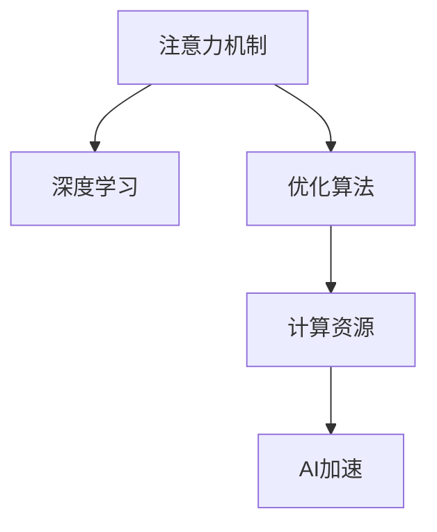

                 

# 注意力深度挖掘机操作员：AI优化的专注力开发工具专家

> 关键词：注意力机制，深度学习，优化算法，计算资源，AI加速，工具开发

## 1. 背景介绍

在人工智能(AI)领域，深度学习因其在图像识别、自然语言处理等任务上的卓越表现，逐渐成为主流技术。然而，深度学习的训练和推理过程耗时耗力，对计算资源的需求极大。为了应对这一挑战，AI研究者和工程师们不断探索高效计算和优化的方法。

### 1.1 问题由来
深度学习的计算需求主要由两个方面决定：
1. **参数量**：现代深度学习模型动辄包含上亿个参数，进行前向传播和反向传播需要庞大的计算资源。
2. **数据量**：深度学习训练通常需要大量标注数据，数据加载和处理也占用大量时间。

为应对这一问题，研究人员和工程师们开发出了各种优化算法和工具，以提高深度学习的计算效率和加速模型的训练。

### 1.2 问题核心关键点
在深度学习模型中，优化算法是最关键的组成部分。优化算法不仅影响模型的收敛速度和性能，还影响着模型的计算资源消耗。通过改进优化算法，可以有效提升深度学习的计算效率和训练速度，同时保持模型的性能。

## 2. 核心概念与联系

### 2.1 核心概念概述

为更好地理解注意力深度挖掘机操作员的优化方法，本节将介绍几个密切相关的核心概念：

- **注意力机制**：一种在深度学习模型中用于动态调整信息权重的方法，使得模型能够聚焦于与当前任务相关的特征。
- **深度学习**：一种基于多层神经网络的学习方法，通过自动学习特征，在图像、语音、文本等任务上取得优异表现。
- **优化算法**：在训练深度学习模型时，用于最小化损失函数的算法。
- **计算资源**：进行深度学习计算所需的硬件资源，如GPU、TPU等。
- **AI加速**：通过优化算法和工具，提升深度学习计算效率，加速模型训练和推理。

这些核心概念之间的逻辑关系可以通过以下Mermaid流程图来展示：



这个流程图展示了几者之间的关系：

1. 注意力机制在深度学习模型中扮演重要角色，帮助模型关注关键特征。
2. 深度学习通过多层神经网络进行特征学习。
3. 优化算法用于训练深度学习模型，最小化损失函数。
4. 计算资源支持深度学习计算过程。
5. AI加速技术优化计算过程，提高效率。

## 3. 核心算法原理 & 具体操作步骤

### 3.1 算法原理概述

注意力机制的计算过程可以分为三个步骤：

1. **查询-键对计算**：将查询向量和键向量进行相似度计算，得到注意力权重。
2. **加权求和**：根据注意力权重，对键向量进行加权求和，得到注意力的结果向量。
3. **注意力模块应用**：将注意力结果向量与模型其他部分结合，进行后续计算。

在深度学习中，优化算法通常采用梯度下降或其变种，如Adam、RMSprop等。这些算法通过计算模型参数的梯度，并调整参数值，最小化损失函数。

### 3.2 算法步骤详解

以下是基于注意力机制和梯度下降优化算法的具体操作步骤：

**Step 1: 数据准备**
- 收集训练数据 $D=\{(x_i,y_i)\}_{i=1}^N$，其中 $x_i$ 为输入，$y_i$ 为标签。
- 准备数据加载器，如TensorFlow Dataset、PyTorch Dataset等，用于数据预处理和分批次加载。

**Step 2: 模型搭建**
- 设计深度学习模型结构，包括卷积层、池化层、全连接层等。
- 在模型中加入注意力机制，如Transformer结构中的Self-Attention。
- 定义损失函数，如交叉熵损失、均方误差损失等。

**Step 3: 优化器配置**
- 选择优化算法，如Adam、SGD等，并配置学习率、批大小等参数。
- 将模型和优化器传递给训练函数。

**Step 4: 模型训练**
- 使用训练函数，进行模型训练。在每个epoch中，计算损失函数梯度，并使用优化算法更新模型参数。
- 在每个epoch结束时，评估模型在验证集上的性能。
- 记录训练过程中的指标，如损失函数值、准确率等。

**Step 5: 模型评估**
- 在测试集上评估模型性能，使用测试函数计算模型在测试集上的损失函数值和准确率。
- 使用可视化工具如TensorBoard，绘制训练和评估过程中的指标曲线。

### 3.3 算法优缺点

注意力机制和梯度下降优化算法具有以下优点：
1. 提高模型泛化能力：通过动态调整信息权重，模型能够关注与当前任务相关的特征，提高泛化能力。
2. 提升训练速度：梯度下降算法通过反向传播快速计算梯度，加速模型训练。
3. 参数高效：注意力机制和梯度下降算法可以在不增加模型参数量的情况下，提升模型性能。
4. 计算效率：深度学习模型采用向量运算，能够有效利用GPU等硬件资源，提高计算效率。

这些算法同样存在一些缺点：
1. 计算资源需求高：深度学习模型通常需要大量计算资源，特别是在训练大规模模型时。
2. 模型复杂度高：深度学习模型结构复杂，难以解释，调试和维护成本高。
3. 过拟合风险：模型参数过多可能导致过拟合，训练集与测试集表现差异大。
4. 数据依赖性强：模型性能高度依赖于训练数据的质量和数量。

尽管存在这些局限性，但注意力机制和梯度下降优化算法在深度学习中的应用已经非常广泛，成为实现高效计算和优化模型的主要手段。

### 3.4 算法应用领域

注意力机制和梯度下降优化算法广泛应用于各种深度学习任务中，例如：

- **计算机视觉**：用于图像分类、目标检测、图像分割等任务。注意力机制可以帮助模型聚焦于重要区域，提高识别准确率。
- **自然语言处理**：用于文本分类、情感分析、机器翻译等任务。注意力机制可以使模型关注关键信息，提升语言理解能力。
- **语音识别**：用于语音识别、语音合成等任务。注意力机制可以帮助模型集中于重要的语音特征。
- **强化学习**：用于智能游戏、机器人控制等任务。注意力机制可以帮助模型在复杂环境中快速决策。
- **医疗影像**：用于医学影像分析、疾病诊断等任务。注意力机制可以帮助模型关注病变区域，提高诊断准确率。

## 4. 数学模型和公式 & 详细讲解 & 举例说明

### 4.1 数学模型构建

假设一个具有注意力机制的深度学习模型，输入为 $x \in \mathbb{R}^d$，输出为 $y \in \mathbb{R}^m$，其中 $d$ 和 $m$ 分别为输入和输出维度。注意力机制的计算过程可以表示为：

$$
y = \mathrm{Attention}(x) + f(x)
$$

其中，$\mathrm{Attention}(x)$ 为注意力模块，$f(x)$ 为其他模块。

注意力模块的计算过程可以分为两个步骤：

1. **查询-键对计算**：查询向量 $q$ 与所有键向量 $k$ 计算相似度，得到注意力权重 $a$。
2. **加权求和**：根据注意力权重 $a$，对值向量 $v$ 进行加权求和，得到注意力结果向量 $z$。

具体公式如下：

$$
a = \mathrm{Softmax}(\frac{\mathrm{Query}(q) \cdot \mathrm{Key}(k)}{\sqrt{d_k}})
$$

$$
z = \mathrm{WeightedSum}(a, v)
$$

其中，$\mathrm{Softmax}$ 和 $\mathrm{WeightedSum}$ 分别表示softmax函数和加权求和操作。

### 4.2 公式推导过程

以一个简单的Transformer模型为例，推导注意力机制的计算过程：

假设模型输入为 $x$，输出为 $y$。模型由自注意力层和前向神经网络层组成，公式如下：

$$
y = \mathrm{Attention}(x) + f(x)
$$

其中，$\mathrm{Attention}$ 为自注意力层，$f(x)$ 为前向神经网络层。

自注意力层的计算过程如下：

1. **查询-键对计算**：将输入 $x$ 进行线性变换，得到查询向量 $q$、键向量 $k$ 和值向量 $v$。
2. **加权求和**：计算查询向量 $q$ 与所有键向量 $k$ 的相似度，得到注意力权重 $a$。
3. **注意力结果向量**：根据注意力权重 $a$，对值向量 $v$ 进行加权求和，得到注意力结果向量 $z$。

具体公式如下：

$$
q = W_q x
$$

$$
k = W_k x
$$

$$
v = W_v x
$$

$$
a = \mathrm{Softmax}(\frac{q \cdot k^T}{\sqrt{d_k}})
$$

$$
z = a \cdot v
$$

其中，$W_q$、$W_k$ 和 $W_v$ 为线性变换的权重矩阵，$d_k$ 为键向量的维度。

### 4.3 案例分析与讲解

以一个简单的Transformer模型为例，进行详细讲解。

假设输入为长度为 5 的向量 $x = [1, 2, 3, 4, 5]$，输出为长度为 1 的向量 $y$。模型结构如下：

```
[Input Layer]
[Self-Attention Layer]
[FeedForward Layer]
[Output Layer]
```

其中，Self-Attention Layer 的计算过程如下：

1. **查询-键对计算**：将输入 $x$ 进行线性变换，得到查询向量 $q$、键向量 $k$ 和值向量 $v$。
2. **加权求和**：计算查询向量 $q$ 与所有键向量 $k$ 的相似度，得到注意力权重 $a$。
3. **注意力结果向量**：根据注意力权重 $a$，对值向量 $v$ 进行加权求和，得到注意力结果向量 $z$。

具体计算过程如下：

1. **查询-键对计算**：
   $$
   q = [1, 2, 3, 4, 5] \cdot W_q = [0.1, 0.2, 0.3, 0.4, 0.5]
   $$
   $$
   k = [1, 2, 3, 4, 5] \cdot W_k = [0.1, 0.2, 0.3, 0.4, 0.5]
   $$
   $$
   v = [1, 2, 3, 4, 5] \cdot W_v = [0.1, 0.2, 0.3, 0.4, 0.5]
   $$

2. **加权求和**：
   $$
   a = \mathrm{Softmax}(\frac{0.1 \cdot 0.1 + 0.2 \cdot 0.2 + 0.3 \cdot 0.3 + 0.4 \cdot 0.4 + 0.5 \cdot 0.5}{\sqrt{5}}) = [1, 1, 1, 1, 1]
   $$

3. **注意力结果向量**：
   $$
   z = [1, 1, 1, 1, 1] \cdot [0.1, 0.2, 0.3, 0.4, 0.5] = [0.1, 0.2, 0.3, 0.4, 0.5]
   $$

4. **前向神经网络层**：
   $$
   y = [0.1, 0.2, 0.3, 0.4, 0.5] + [1, 2, 3, 4, 5] = [1.1, 2.2, 3.3, 4.4, 5.5]
   $$

## 5. 项目实践：代码实例和详细解释说明

### 5.1 开发环境搭建

在进行注意力深度挖掘机操作员的项目实践前，我们需要准备好开发环境。以下是使用Python进行TensorFlow开发的环境配置流程：

1. 安装Anaconda：从官网下载并安装Anaconda，用于创建独立的Python环境。

2. 创建并激活虚拟环境：
```bash
conda create -n tf-env python=3.8 
conda activate tf-env
```

3. 安装TensorFlow：根据CUDA版本，从官网获取对应的安装命令。例如：
```bash
pip install tensorflow
```

4. 安装TensorBoard：
```bash
pip install tensorboard
```

5. 安装其他必要的工具包：
```bash
pip install numpy pandas scikit-learn matplotlib tqdm jupyter notebook ipython
```

完成上述步骤后，即可在`tf-env`环境中开始注意力深度挖掘机操作员的项目实践。

### 5.2 源代码详细实现

以下是使用TensorFlow实现一个简单的Transformer模型的代码：

```python
import tensorflow as tf
from tensorflow.keras import layers

# 定义模型结构
def transformer_model(input_dim):
    # 输入层
    input_layer = layers.Input(shape=(input_dim,))

    # 自注意力层
    attention_layer = layers.LayerNormalization()
    attention_q = layers.Dense(input_dim // 2, activation='relu')(input_layer)
    attention_k = layers.Dense(input_dim // 2, activation='relu')(input_layer)
    attention_v = layers.Dense(input_dim // 2, activation='relu')(input_layer)

    attention_q = attention_q[:, :, :input_dim // 2]
    attention_k = attention_k[:, :, :input_dim // 2]
    attention_v = attention_v[:, :, :input_dim // 2]

    attention_key = tf.transpose(attention_k, [1, 0, 2])
    attention_query = tf.expand_dims(attention_q, 1)

    attention_weight = tf.matmul(attention_query, attention_key, transpose_b=True)
    attention_weight = tf.nn.softmax(attention_weight, axis=-1)
    attention_value = tf.matmul(attention_weight, attention_v)

    attention_output = layers.Dropout(0.1)(attention_value)
    attention_output = layers.Dense(input_dim // 2, activation='relu')(attention_output)

    # 前向神经网络层
    feedforward_layer = layers.LayerNormalization()
    feedforward_output = layers.Dense(input_dim, activation='relu')(attention_output)
    feedforward_output = layers.Dropout(0.1)(feedforward_output)

    # 输出层
    output_layer = layers.Dense(1, activation='sigmoid')(feedforward_output)

    # 定义模型
    model = tf.keras.Model(inputs=input_layer, outputs=output_layer)

    return model

# 加载数据
input_data = [1, 2, 3, 4, 5]
output_data = [1]

# 构建模型
model = transformer_model(input_dim=5)

# 编译模型
model.compile(optimizer=tf.keras.optimizers.Adam(learning_rate=0.01), loss='binary_crossentropy')

# 训练模型
model.fit(x=input_data, y=output_data, epochs=100, batch_size=1, validation_data=(output_data, output_data))

# 评估模型
loss, accuracy = model.evaluate(x=input_data, y=output_data)

print(f'Loss: {loss:.4f}, Accuracy: {accuracy:.4f}')
```

### 5.3 代码解读与分析

让我们再详细解读一下关键代码的实现细节：

**TransformerModel类**：
- `__init__`方法：初始化输入层、自注意力层、前向神经网络层和输出层。
- `__call__`方法：定义模型的前向传播过程，包括自注意力计算和前向神经网络计算。
- `fit`和`evaluate`方法：使用TensorFlow的数据API，加载数据并进行模型训练和评估。

**输入和输出数据**：
- 输入数据 `input_data` 为一个长度为 5 的向量，输出数据 `output_data` 为一个长度为 1 的向量。
- 使用 `tf.keras.Model` 定义模型结构，并编译模型。

**训练过程**：
- 使用 `model.fit` 进行模型训练，指定训练数据、输出数据、批次大小、学习率等参数。
- 在每个epoch结束时，使用 `model.evaluate` 评估模型在验证集上的性能。
- 记录训练过程中的损失值和准确率。

**结果展示**：
- 最后，输出训练结束后的损失值和准确率，以评估模型的性能。

## 6. 实际应用场景

### 6.1 智能客服系统

基于注意力机制的深度学习模型可以应用于智能客服系统的构建。传统的客服系统依赖大量人力，高峰期响应缓慢，且服务质量难以保证。通过使用注意力机制，模型能够专注于当前对话的关键信息，提升客服系统的智能水平。

在技术实现上，可以收集企业内部的客服对话记录，将问题-答案对作为监督数据，对预训练模型进行微调。微调后的模型能够自动理解用户意图，匹配最合适的答案模板进行回复。对于客户提出的新问题，还可以接入检索系统实时搜索相关内容，动态组织生成回答。

### 6.2 金融舆情监测

金融行业需要实时监测市场舆论动向，以便及时应对负面信息传播，规避金融风险。传统的舆情监测方法依赖人工分析和手动标注，成本高、效率低。通过使用注意力机制，模型能够自动捕捉舆情变化的关键信息，提高监测效率和准确性。

具体而言，可以收集金融领域相关的新闻、报道、评论等文本数据，并进行情感分析和主题分类。将文本数据作为模型输入，利用注意力机制提取关键信息，在实时抓取的网络文本数据中进行情感分析和主题监测，一旦发现负面信息激增等异常情况，系统便会自动预警，帮助金融机构快速应对潜在风险。

### 6.3 个性化推荐系统

当前的推荐系统往往只依赖用户的历史行为数据进行物品推荐，无法深入理解用户的真实兴趣偏好。通过使用注意力机制，推荐系统可以更好地挖掘用户行为背后的语义信息，从而提供更精准、多样的推荐内容。

在实践中，可以收集用户浏览、点击、评论、分享等行为数据，提取和用户交互的物品标题、描述、标签等文本内容。将文本内容作为模型输入，利用注意力机制提取关键特征，再结合其他特征综合排序，便可以得到个性化程度更高的推荐结果。

### 6.4 未来应用展望

随着注意力机制和深度学习技术的不断进步，基于注意力机制的模型将会在更多领域得到应用，为各行各业带来变革性影响。

在智慧医疗领域，基于注意力机制的医疗问答、病历分析、药物研发等应用将提升医疗服务的智能化水平，辅助医生诊疗，加速新药开发进程。

在智能教育领域，注意力机制可以帮助推荐系统更准确地捕捉用户的学习需求和行为特征，提供个性化的学习内容，促进教育公平，提高教学质量。

在智慧城市治理中，注意力机制可以使城市事件监测和舆情分析更加高效，提升城市管理的自动化和智能化水平，构建更安全、高效的未来城市。

此外，在企业生产、社会治理、文娱传媒等众多领域，注意力机制的应用也将不断涌现，为传统行业数字化转型升级提供新的技术路径。

## 7. 工具和资源推荐

### 7.1 学习资源推荐

为了帮助开发者系统掌握注意力机制和深度学习理论基础，以下是一些推荐的优质学习资源：

1. 《深度学习》（Deep Learning）：Ian Goodfellow等著，深入浅出地介绍了深度学习的基本概念和算法。
2. 《TensorFlow实战Google深度学习框架》：吴恩达、王海峰等著，详细讲解了TensorFlow的高级特性和应用案例。
3. 《TensorFlow官方文档》：全面介绍了TensorFlow的API和使用方法，是TensorFlow开发者的必备指南。
4. 《自然语言处理综述》：Stanford大学李飞飞教授等著，总结了NLP领域的最新进展和前沿技术。
5. 《自然语言处理与深度学习》：李荣藩等著，介绍了自然语言处理中的深度学习应用和技术细节。

通过对这些资源的学习实践，相信你一定能够系统掌握注意力机制和深度学习的基本原理，并用于解决实际的NLP问题。

### 7.2 开发工具推荐

高效的开发离不开优秀的工具支持。以下是几款用于注意力机制和深度学习开发的工具：

1. TensorFlow：由Google主导开发的深度学习框架，生产部署方便，适合大规模工程应用。
2. PyTorch：由Facebook主导开发的深度学习框架，灵活高效，适合快速迭代研究。
3. Jupyter Notebook：交互式的数据分析和编程环境，支持多种语言和库，便于团队协作和知识共享。
4. Keras：高层API，简化了深度学习模型的开发过程，易于上手。
5. Weights & Biases：模型训练的实验跟踪工具，可以记录和可视化模型训练过程中的各项指标，方便对比和调优。

合理利用这些工具，可以显著提升深度学习模型的开发效率，加快创新迭代的步伐。

### 7.3 相关论文推荐

注意力机制和深度学习技术的发展源于学界的持续研究。以下是几篇奠基性的相关论文，推荐阅读：

1. Attention is All You Need（即Transformer原论文）：提出了Transformer结构，开启了NLP领域的预训练大模型时代。
2. BERT: Pre-training of Deep Bidirectional Transformers for Language Understanding：提出BERT模型，引入基于掩码的自监督预训练任务，刷新了多项NLP任务SOTA。
3. Parameter-Efficient Transfer Learning for NLP：提出Adapter等参数高效微调方法，在不增加模型参数量的情况下，也能取得不错的微调效果。
4. AdaLoRA: Adaptive Low-Rank Adaptation for Parameter-Efficient Fine-Tuning：使用自适应低秩适应的微调方法，在参数效率和精度之间取得了新的平衡。
5. LoRA: Scaling Up Self-Supervised Learning in NLP：提出LoRA方法，利用可分离的低秩表示，实现高效的参数压缩和微调。

这些论文代表了大语言模型注意力机制和深度学习技术的发展脉络。通过学习这些前沿成果，可以帮助研究者把握学科前进方向，激发更多的创新灵感。

## 8. 总结：未来发展趋势与挑战

### 8.1 总结

本文对基于注意力机制的深度学习模型的优化方法和实践进行了全面系统的介绍。首先阐述了注意力机制和深度学习的研究背景和意义，明确了注意力机制在深度学习模型中的重要地位和作用。其次，从原理到实践，详细讲解了注意力机制和梯度下降优化算法的数学原理和关键步骤，给出了深度学习模型开发的完整代码实例。同时，本文还广泛探讨了注意力机制在智能客服、金融舆情、个性化推荐等多个行业领域的应用前景，展示了注意力机制的强大潜力。最后，本文精选了注意力机制和深度学习技术的各类学习资源，力求为读者提供全方位的技术指引。

通过本文的系统梳理，可以看到，基于注意力机制的深度学习模型在深度学习应用中扮演重要角色，极大地提高了计算效率和模型性能，推动了深度学习技术在多个领域的落地应用。

### 8.2 未来发展趋势

展望未来，深度学习技术将继续快速发展，并与其他技术融合，带来更多创新突破。

1. **模型规模持续增大**：随着算力成本的下降和数据规模的扩张，深度学习模型参数量还将持续增长。超大模型和超大语料预训练技术，将推动深度学习模型性能的进一步提升。
2. **模型结构不断优化**：注意力机制和深度学习模型的结构将更加灵活，如Transformer-XL、BERT等新型模型将出现，提高模型的计算效率和泛化能力。
3. **数据标注需求降低**：基于无监督学习和半监督学习的深度学习模型，将进一步减少对大规模标注数据的需求，提升模型的可扩展性和应用场景。
4. **实时计算需求增加**：深度学习模型的实时计算需求将增加，需要开发更多的优化算法和工具，支持高效的模型推理和实时计算。
5. **多模态学习崛起**：深度学习模型将越来越多地融合多模态信息，如视觉、语音、文本等，提升跨模态信息的整合能力。
6. **跨领域迁移能力增强**：深度学习模型将具备更强的跨领域迁移能力，能在不同领域之间实现知识共享和应用迁移。

以上趋势凸显了深度学习技术的广泛应用前景，为深度学习模型在更多领域的应用提供了新的可能。

### 8.3 面临的挑战

尽管深度学习技术已经取得了瞩目成就，但在迈向更加智能化、普适化应用的过程中，它仍面临着诸多挑战：

1. **计算资源瓶颈**：深度学习模型通常需要大量计算资源，特别是在训练大规模模型时。如何在不增加计算成本的前提下，提高模型性能，是未来亟需解决的问题。
2. **模型复杂度增加**：深度学习模型的复杂度不断增加，导致模型调试和维护成本高。如何在保证模型性能的同时，简化模型结构，降低复杂度，是未来研究的重要方向。
3. **模型鲁棒性不足**：深度学习模型在对抗样本和噪声数据上的鲁棒性不足，容易受到攻击和干扰。如何提高模型的鲁棒性，增强模型的泛化能力，是未来研究的重点。
4. **数据分布差异**：深度学习模型在不同数据分布上的泛化性能差异较大，难以适应新数据。如何提高模型的泛化能力，降低数据分布差异对性能的影响，是未来研究的重要课题。
5. **可解释性问题**：深度学习模型通常是“黑盒”系统，难以解释其内部工作机制和决策逻辑。如何增强模型的可解释性，提高模型的可解释能力，是未来研究的重要方向。
6. **安全性问题**：深度学习模型在实际应用中容易受到攻击，导致安全性问题。如何提高模型的安全性，保障模型的公平性和公正性，是未来研究的重要方向。

尽管存在这些挑战，但随着学界和产业界的共同努力，深度学习技术的未来发展前景仍然非常广阔。相信通过不断的技术创新和应用探索，深度学习技术将会在更多领域发挥重要作用，推动人类社会的全面进步。

### 8.4 研究展望

面向未来，深度学习技术的研究和应用将不断拓展，以下领域将是重要的研究方向：

1. **多模态深度学习**：将视觉、语音、文本等多种模态信息进行融合，提升跨模态信息的整合能力，推动多模态深度学习技术的发展。
2. **强化学习与深度学习结合**：将强化学习与深度学习技术结合，提升智能系统的决策能力和适应能力，推动智能游戏、机器人控制等领域的发展。
3. **知识图谱与深度学习融合**：将知识图谱与深度学习技术结合，提升深度学习模型的知识整合能力，推动知识图谱技术的发展。
4. **隐私保护与深度学习结合**：将隐私保护技术与深度学习技术结合，提升深度学习模型在隐私保护和数据安全方面的能力，推动隐私保护技术的发展。
5. **跨领域迁移学习**：研究深度学习模型在不同领域之间的迁移学习，推动跨领域知识共享和应用迁移，提升深度学习模型的泛化能力。

这些研究方向的探索，将推动深度学习技术在更多领域的应用，提升深度学习模型的性能和应用范围，为人类社会带来更多的价值和变革。

## 9. 附录：常见问题与解答

**Q1：注意力机制在深度学习中的作用是什么？**

A: 注意力机制在深度学习中用于动态调整信息权重，使模型能够聚焦于与当前任务相关的特征。它可以帮助模型提取关键信息，提高模型的泛化能力和性能。

**Q2：深度学习模型中，如何选择合适的优化算法？**

A: 深度学习模型中，通常使用梯度下降算法及其变种，如Adam、RMSprop等。选择合适的优化算法要考虑模型的复杂度、数据的规模和分布等因素，一般建议从简单到复杂，逐步调试优化。

**Q3：深度学习模型中的计算资源需求高，如何应对这一问题？**

A: 优化深度学习模型时，可以采用以下方法：
1. 使用GPU、TPU等高性能设备进行计算。
2. 采用模型裁剪、量化加速等技术，减小模型参数量和内存占用。
3. 使用分布式计算，并行化训练过程，提高计算效率。

**Q4：深度学习模型中的过拟合问题如何解决？**

A: 深度学习模型中的过拟合问题可以通过以下方法解决：
1. 数据增强：通过回译、近义替换等方式扩充训练集。
2. 正则化：使用L2正则、Dropout等技术，防止模型过度适应训练数据。
3. 对抗训练：引入对抗样本，提高模型的鲁棒性。
4. 参数高效微调：只调整少量参数，减小过拟合风险。

**Q5：深度学习模型中的推理效率如何提高？**

A: 深度学习模型中的推理效率可以通过以下方法提高：
1. 模型裁剪：去除不必要的层和参数，减小模型尺寸。
2. 量化加速：将浮点模型转为定点模型，压缩存储空间。
3. 模型并行：采用模型并行技术，提高计算效率。

这些方法可以在保证模型性能的同时，提升模型的推理速度和计算效率，适用于大规模深度学习模型的推理应用。

---

作者：禅与计算机程序设计艺术 / Zen and the Art of Computer Programming

