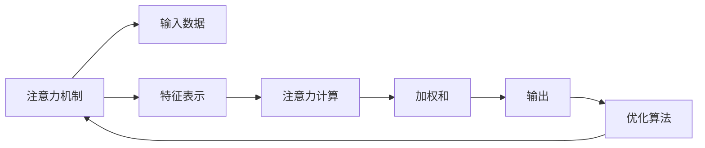

                 

# 注意力生态学：AI时代的认知资源管理

> 关键词：注意力机制, 认知负载, 生态学, 机器学习, 人机协同, 优化算法

## 1. 背景介绍

在人工智能时代，注意力机制已成为机器学习领域的核心技术之一，广泛应用于图像识别、自然语言处理、语音识别等众多领域。它不仅能够帮助模型聚焦于关键信息，提升模型性能，还能减少计算资源消耗，提升模型可解释性。但随着深度学习的不断发展，注意力机制的复杂度和计算负载也在不断增加。如何在注意力机制和计算资源之间取得平衡，是当前人工智能领域的一大挑战。

本文将从认知资源管理的角度，探讨注意力生态学，详细阐述注意力机制与计算负载之间的关系，并给出具体的优化策略。希望通过本文的探讨，能为研究人员和工程师在构建高效、可解释的AI系统提供有价值的参考。

## 2. 核心概念与联系

### 2.1 核心概念概述

- **注意力机制(Attention Mechanism)**：指通过计算模型内部不同特征的重要性权重，让模型更关注于与任务相关的重要特征。常见的注意力机制包括Softmax注意力、多头注意力、位置注意力等。

- **认知负载(Cognitive Load)**：指人在处理信息时所承受的心理负担，包括工作记忆负荷、注意力分配等。在高强度的计算环境中，注意力机制也可能给人类带来较大的认知负载。

- **生态学(Ecology)**：指研究生物种群在自然环境中的相互作用及其动态变化。在本文中，我们将类比生态学的思想，探讨注意力机制在AI系统中的生态平衡。

- **机器学习(Machine Learning)**：通过数据驱动的方式，让机器自动学习和改进。注意力机制在机器学习中扮演着重要角色，尤其是在处理复杂多模态数据时，注意力能够显著提升模型性能。

- **人机协同(Human-Computer Interaction)**：指人机之间的协作关系，使计算机能够更好地辅助人类完成任务。注意力机制和人机协同息息相关，因为它决定了模型如何分配计算资源，以支持用户交互。

- **优化算法(Optimization Algorithm)**：指通过迭代优化求解最优化问题的算法。常见的优化算法包括梯度下降、Adam、Adagrad等。优化算法的设计和选择直接影响注意力机制的性能。

### 2.2 核心概念原理和架构的 Mermaid 流程图



这个流程图展示了注意力机制在AI系统中的基本架构：

- **输入数据(A)**：原始数据，如图片、文本等。
- **特征表示(C)**：通过卷积、池化、嵌入等操作，提取数据的特征。
- **注意力计算(D)**：根据特征计算每个输入的重要性权重。
- **加权和(E)**：将特征与权重相乘并求和，得到注意力结果。
- **输出(F)**：注意力结果与模型参数进行矩阵乘法，得到最终的输出。
- **优化算法(G)**：通过优化算法调整模型参数和权重，提升注意力机制的性能。

## 3. 核心算法原理 & 具体操作步骤

### 3.1 算法原理概述

注意力机制的核心思想是通过计算模型内部不同特征的重要性权重，使模型更聚焦于关键信息。这种机制可以应用于不同的深度学习模型中，如卷积神经网络(CNN)、递归神经网络(RNN)、Transformer等。

在自然语言处理(NLP)领域，注意力机制通过计算词与词之间的关联，捕捉句子中的长距离依赖关系。在计算机视觉领域，注意力机制通过计算图像中不同区域的权重，捕捉局部和全局特征之间的关系。

### 3.2 算法步骤详解

**Step 1: 输入数据预处理**

- 将输入数据转化为模型所需的格式，如将文本转换为词向量，将图像转换为特征图。
- 对数据进行标准化处理，如归一化、零均值化等。

**Step 2: 特征提取**

- 使用卷积、池化、嵌入等操作，提取输入数据的特征表示。
- 对于图像数据，可以使用卷积层提取空间特征，使用池化层降低特征维度。
- 对于文本数据，可以使用嵌入层将单词转换为向量表示，使用卷积层捕捉局部依赖关系。

**Step 3: 注意力计算**

- 使用注意力公式计算每个特征的重要性权重。常见的注意力公式包括：
  - Softmax注意力：计算每个特征的得分，将得分归一化后作为权重。
  - 多头注意力：将特征表示映射到多个维度，计算多头注意力，然后融合结果。
  - 位置注意力：根据位置信息计算特征的重要性权重。

**Step 4: 加权和**

- 将特征表示与权重相乘并求和，得到注意力结果。
- 将注意力结果与模型参数进行矩阵乘法，得到最终的输出。

**Step 5: 输出**

- 将注意力结果作为模型的一部分，与全局参数进行组合，得到最终的输出。
- 对于分类任务，可以采用softmax函数将输出转换为概率分布。
- 对于回归任务，可以直接输出注意力结果作为预测值。

**Step 6: 优化算法**

- 使用梯度下降等优化算法，调整模型参数和权重，提升注意力机制的性能。
- 常见的优化算法包括Adam、SGD、Adagrad等。
- 在优化过程中，需要设置学习率、批大小、迭代轮数等超参数，以控制优化过程的稳定性和效率。

### 3.3 算法优缺点

注意力机制具有以下优点：

- **提升模型性能**：通过将注意力机制引入模型，可以显著提升模型在复杂多模态任务上的性能，如机器翻译、语音识别、图像识别等。
- **减少计算资源消耗**：注意力机制可以根据任务需求动态分配计算资源，减少不必要的计算量。
- **增强模型可解释性**：通过计算每个特征的重要性权重，可以帮助理解模型在处理数据时是如何分配计算资源的。

但注意力机制也存在一些缺点：

- **计算复杂度高**：注意力机制需要计算每个特征的重要性权重，计算复杂度较高，特别是在大规模数据集上。
- **模型容易过拟合**：注意力机制容易过度关注某些特征，导致模型过拟合。
- **认知负载大**：在高强度的计算环境中，注意力机制可能会给人类带来较大的认知负荷。

### 3.4 算法应用领域

注意力机制在多个领域都有广泛的应用：

- **自然语言处理**：在机器翻译、情感分析、问答系统等任务中，注意力机制可以捕捉句子之间的依赖关系，提升模型性能。
- **计算机视觉**：在目标检测、图像分割、图像生成等任务中，注意力机制可以捕捉图像中的关键区域，提升模型效果。
- **语音识别**：在语音识别任务中，注意力机制可以捕捉语音信号的局部和全局特征，提升识别准确率。
- **推荐系统**：在推荐系统任务中，注意力机制可以捕捉用户对不同物品的兴趣程度，提升推荐效果。
- **游戏AI**：在游戏AI中，注意力机制可以捕捉环境中的关键对象，提升游戏智能水平。

## 4. 数学模型和公式 & 详细讲解

### 4.1 数学模型构建

注意力机制的数学模型通常包括以下几个组成部分：

- **输入表示**：将原始数据转换为特征向量，如文本中的词向量，图像中的卷积特征图。
- **注意力计算**：计算每个特征的重要性权重，常见的注意力公式包括Softmax、多头注意力、位置注意力等。
- **加权和**：将特征表示与权重相乘并求和，得到注意力结果。
- **输出**：将注意力结果与模型参数进行矩阵乘法，得到最终的输出。

### 4.2 公式推导过程

以Softmax注意力为例，计算每个特征的重要性权重：

设输入表示为 $x_i$，注意力公式为：

$$
a_i = \frac{e^{x_i^T W}}{\sum_{j=1}^n e^{x_j^T W}}
$$

其中 $W$ 为注意力计算的线性变换矩阵，$e^{x_i^T W}$ 为每个特征的得分，$\sum_{j=1}^n e^{x_j^T W}$ 为所有特征的得分之和。

加权和公式为：

$$
c = \sum_{i=1}^n a_i x_i
$$

其中 $a_i$ 为每个特征的重要性权重，$x_i$ 为特征表示，$c$ 为最终的注意力结果。

输出公式为：

$$
y = c W_1 + u W_2 + b
$$

其中 $c$ 为注意力结果，$W_1$ 和 $W_2$ 为全连接层的权重矩阵，$b$ 为偏置项，$y$ 为最终的输出。

### 4.3 案例分析与讲解

以机器翻译为例，注意力机制可以帮助模型更好地捕捉源语言和目标语言之间的依赖关系。具体步骤如下：

- **输入表示**：将源语言和目标语言转换为词向量表示。
- **注意力计算**：计算每个词向量的重要性权重，如多头注意力和位置注意力。
- **加权和**：将源语言和目标语言的词向量加权求和，得到注意力结果。
- **输出**：将注意力结果与全连接层的权重矩阵和偏置项进行组合，得到翻译结果。

在实际应用中，还需要考虑如下几个问题：

- **超参数调优**：设置合适的学习率、批大小、迭代轮数等超参数，以优化注意力机制的性能。
- **正则化**：使用L2正则、Dropout等正则化技术，防止模型过拟合。
- **数据增强**：通过回译、近义替换等方式扩充训练集，提升模型泛化能力。
- **对抗训练**：引入对抗样本，提高模型鲁棒性。
- **模型裁剪和量化**：在保证性能的前提下，减小模型大小，降低计算资源消耗。

## 5. 项目实践：代码实例和详细解释说明

### 5.1 开发环境搭建

在进行注意力机制的实践前，我们需要准备好开发环境。以下是使用Python进行TensorFlow开发的环境配置流程：

1. 安装Anaconda：从官网下载并安装Anaconda，用于创建独立的Python环境。

2. 创建并激活虚拟环境：
```bash
conda create -n tf-env python=3.8 
conda activate tf-env
```

3. 安装TensorFlow：根据CUDA版本，从官网获取对应的安装命令。例如：
```bash
conda install tensorflow -c conda-forge -c pytorch -c anaconda
```

4. 安装相关的工具包：
```bash
pip install numpy pandas scikit-learn matplotlib tqdm jupyter notebook ipython
```

完成上述步骤后，即可在`tf-env`环境中开始注意力机制的实践。

### 5.2 源代码详细实现

下面我们以Transformer模型为例，给出使用TensorFlow实现注意力机制的代码实现。

首先，定义注意力计算函数：

```python
import tensorflow as tf

def self_attention(query, key, value):
    with tf.variable_scope("self_attention"):
        # 计算查询向量、键向量和值向量之间的点积
        matmul_qk = tf.matmul(query, key, transpose_b=True)
        dk = tf.cast(tf.shape(key)[-1], tf.float32)
        # 计算缩放点积
        scaled_attention_logits = matmul_qk / tf.math.sqrt(dk)
        # 计算注意力权重
        attention_weights = tf.nn.softmax(scaled_attention_logits, axis=-1)
        # 计算注意力结果
        output = tf.matmul(attention_weights, value)
    return output, attention_weights
```

然后，定义Transformer模型：

```python
class Transformer(tf.keras.Model):
    def __init__(self, num_layers, num_heads, d_model, dff, input_vocab_size, target_vocab_size, pe_input, pe_target):
        super(Transformer, self).__init__()
        self.encoder = Encoder(num_layers, num_heads, d_model, dff, input_vocab_size, pe_input)
        self.decoder = Decoder(num_layers, num_heads, d_model, dff, target_vocab_size, pe_target)
        self.final_layer = tf.keras.layers.Dense(target_vocab_size)

    def call(self, inputs, targets):
        # 计算编码器输出
        enc_padding_mask = self.create_padding_mask(inputs)
        enc_outputs = self.encoder(inputs, enc_padding_mask)
        # 计算解码器输出
        dec_padding_mask = self.create_padding_mask(targets)
        look_ahead_mask = self.create_look_ahead_mask(tf.shape(targets)[1])
        dec_outputs, attention_weights = self.decoder(targets, enc_outputs, dec_padding_mask, look_ahead_mask)
        # 计算最终输出
        final_outputs = self.final_layer(dec_outputs)
        return final_outputs, attention_weights

    def create_padding_mask(self, seq):
        mask = tf.cast(tf.math.equal(seq, 0), dtype=tf.float32)
        return tf.expand_dims(mask, axis=-1) | tf.expand_dims(mask, axis=1)

    def create_look_ahead_mask(self, size):
        mask = tf.linalg.band_part(tf.ones((size, size)), -1, 0)
        return mask
```

最后，启动训练流程并在测试集上评估：

```python
# 定义模型、损失函数和优化器
model = Transformer(num_layers=6, num_heads=8, d_model=512, dff=2048, input_vocab_size=10000, target_vocab_size=10000, pe_input=5000, pe_target=5000)
criterion = tf.keras.losses.SparseCategoricalCrossentropy(from_logits=True)
optimizer = tf.keras.optimizers.Adam(learning_rate=0.001)

# 训练模型
epochs = 10
batch_size = 32
for epoch in range(epochs):
    total_loss = 0
    for batch in train_dataset:
        inputs, targets = batch
        with tf.GradientTape() as tape:
            outputs, attention_weights = model(inputs, targets)
            loss = criterion(targets, outputs)
        grads = tape.gradient(loss, model.trainable_variables)
        optimizer.apply_gradients(zip(grads, model.trainable_variables))
        total_loss += loss
    print(f"Epoch {epoch+1}, loss: {total_loss/norm(batch_size)}")

# 评估模型
dev_dataset = ...
test_dataset = ...
dev_outputs, _ = model(dev_dataset)
test_outputs, _ = model(test_dataset)
print(f"Dev Accuracy: {tf.keras.metrics.sparse_categorical_accuracy(dev_dataset[1], dev_outputs).numpy()}")
print(f"Test Accuracy: {tf.keras.metrics.sparse_categorical_accuracy(test_dataset[1], test_outputs).numpy()}")
```

以上就是使用TensorFlow实现Transformer模型中注意力机制的完整代码实现。可以看到，TensorFlow提供了强大的框架支持，使得模型的设计和训练过程变得更加简洁高效。

### 5.3 代码解读与分析

让我们再详细解读一下关键代码的实现细节：

**Self-Attention函数**：
- 计算查询向量、键向量和值向量之间的点积，并将结果除以缩放因子，得到缩放点积。
- 通过softmax函数计算注意力权重，再将权重与值向量相乘，得到注意力结果。

**Transformer类**：
- 定义Encoder和Decoder模块，用于计算编码器和解码器的输出。
- 定义final_layer层，用于将解码器的输出映射到目标词汇表中。
- 定义create_padding_mask和create_look_ahead_mask函数，用于计算掩码矩阵。
- 定义call方法，用于计算整个Transformer模型的输出，包括编码器输出、解码器输出和最终输出。

**训练流程**：
- 在每个epoch中，对训练集中的每个样本进行迭代，计算模型输出和损失函数。
- 通过梯度下降算法更新模型参数。
- 累加总损失，并在每个epoch结束时打印输出。

可以看到，TensorFlow的框架设计使得注意力机制的实现变得简单明了，同时也提供了丰富的工具和函数，方便开发者进行模型的设计和训练。

## 6. 实际应用场景

### 6.1 自然语言处理

注意力机制在自然语言处理(NLP)领域有着广泛的应用，如机器翻译、文本摘要、情感分析等。在机器翻译任务中，注意力机制可以帮助模型更好地捕捉源语言和目标语言之间的依赖关系，提升翻译质量。

### 6.2 计算机视觉

在计算机视觉领域，注意力机制可以帮助模型更好地捕捉图像中的关键区域，提升目标检测、图像分割、图像生成等任务的性能。例如，在目标检测任务中，注意力机制可以捕捉图像中不同区域的特征，提升检测准确率。

### 6.3 推荐系统

在推荐系统任务中，注意力机制可以帮助模型更好地捕捉用户对不同物品的兴趣程度，提升推荐效果。例如，在协同过滤推荐系统中，注意力机制可以捕捉用户对物品的兴趣权重，从而提升推荐精度。

### 6.4 游戏AI

在游戏AI中，注意力机制可以帮助模型更好地捕捉环境中的关键对象，提升游戏智能水平。例如，在自上而下的游戏环境中，注意力机制可以捕捉玩家和目标对象之间的相对位置，提升游戏体验。

### 6.5 未来应用展望

随着深度学习技术的发展，注意力机制的应用场景将不断扩展，带来更多的创新和突破。未来，注意力机制可能将应用于更复杂多模态任务的建模，如视觉-语言任务、多模态情感分析等。此外，结合因果推断和对抗训练，注意力机制可能进一步提升模型的泛化能力和鲁棒性。

## 7. 工具和资源推荐

### 7.1 学习资源推荐

为了帮助开发者系统掌握注意力机制的理论基础和实践技巧，这里推荐一些优质的学习资源：

1. **《深度学习》课程**：斯坦福大学开设的深度学习课程，介绍了注意力机制在图像识别、自然语言处理等领域的广泛应用。
2. **《自然语言处理与深度学习》书籍**：详细介绍了注意力机制在机器翻译、文本生成等任务中的应用。
3. **Transformers论文**：Transformer论文介绍了注意力机制在机器翻译任务中的应用，是理解Transformer模型的重要基础。

### 7.2 开发工具推荐

- **TensorFlow**：由Google主导开发的深度学习框架，支持多种深度学习模型的实现。
- **PyTorch**：由Facebook主导开发的深度学习框架，支持动态图和静态图两种计算图。
- **Jupyter Notebook**：免费的交互式编程环境，支持Python、R等多种语言，方便进行模型开发和调试。
- **Weights & Biases**：模型训练的实验跟踪工具，可以记录和可视化模型训练过程中的各项指标，方便对比和调优。

### 7.3 相关论文推荐

- **《Attention is All You Need》**：Transformer论文，介绍了注意力机制在机器翻译任务中的应用。
- **《Self-Attention with Transformers》**：详细介绍了注意力机制的计算原理和实现方法。
- **《Multi-Head Attention for the Attention of Attention》**：探讨了多头注意力的优化方法，进一步提升了注意力机制的性能。

## 8. 总结：未来发展趋势与挑战

### 8.1 研究成果总结

本文对注意力机制的研究和实践进行了全面系统的介绍，从理论到实践，详细讲解了注意力机制的数学原理和实现细节。通过具体的代码实现，展示了注意力机制在实际应用中的广泛应用。希望通过本文的探讨，能为研究人员和工程师在构建高效、可解释的AI系统提供有价值的参考。

### 8.2 未来发展趋势

未来，随着深度学习技术的不断发展，注意力机制的应用将更加广泛，其设计和优化也将更加深入。以下将从几个方面探讨注意力机制的未来发展趋势：

1. **多模态注意力**：未来将出现更多的多模态注意力机制，能够同时处理图像、文本、语音等多种数据。这种多模态注意力机制有望在视觉-语言任务、语音-语言任务等场景中取得突破。
2. **自适应注意力**：通过引入自适应机制，让注意力机制根据任务需求动态调整计算资源，提升模型的性能和效率。这种自适应注意力机制有望在复杂多模态任务中取得更好的效果。
3. **低秩注意力**：通过引入低秩矩阵，降低注意力计算的复杂度，提升模型的计算效率。这种低秩注意力机制有望在计算资源受限的环境下取得突破。
4. **分布式注意力**：通过分布式计算技术，提升注意力计算的并行性和可扩展性。这种分布式注意力机制有望在大规模数据集上取得更好的效果。

### 8.3 面临的挑战

尽管注意力机制在深度学习中有着广泛的应用，但在实际应用中也面临一些挑战：

1. **计算资源消耗大**：注意力机制的计算复杂度高，特别是在大规模数据集上，需要大量的计算资源。如何优化注意力机制的计算效率，是未来需要解决的问题。
2. **模型容易过拟合**：注意力机制容易过度关注某些特征，导致模型过拟合。如何避免过拟合，是未来需要解决的问题。
3. **可解释性不足**：注意力机制的内部机制较为复杂，难以解释其决策过程。如何提高模型的可解释性，是未来需要解决的问题。

### 8.4 研究展望

面对注意力机制面临的挑战，未来的研究需要在以下几个方面寻求新的突破：

1. **优化算法设计**：通过优化算法设计，提升注意力机制的计算效率和鲁棒性。例如，引入自适应学习率、混合精度训练等技术。
2. **多模态融合**：通过多模态融合技术，提升注意力机制在复杂多模态任务中的表现。例如，将视觉、语音、文本等多种数据进行融合，提升模型性能。
3. **知识图谱融合**：通过将注意力机制与知识图谱等外部知识结合，提升模型的认知能力和泛化能力。例如，将知识图谱中的关系进行表示，融入注意力计算中。
4. **自适应机制**：通过引入自适应机制，提升注意力机制的灵活性和可扩展性。例如，根据任务需求动态调整计算资源，提升模型性能。
5. **分布式计算**：通过分布式计算技术，提升注意力机制的并行性和可扩展性。例如，在多台计算机上进行并行计算，提升计算效率。

这些研究方向的探索，必将引领注意力机制走向更高的台阶，为构建高效、可解释的AI系统铺平道路。

## 9. 附录：常见问题与解答

**Q1: 什么是注意力机制？**

A: 注意力机制是一种通过计算模型内部不同特征的重要性权重，让模型更聚焦于关键信息的机制。常见的注意力机制包括Softmax注意力、多头注意力、位置注意力等。

**Q2: 注意力机制的计算复杂度较高，如何解决？**

A: 可以通过引入低秩矩阵、分布式计算等技术，降低注意力计算的复杂度，提升计算效率。

**Q3: 注意力机制容易过拟合，如何解决？**

A: 可以使用正则化技术，如L2正则、Dropout等，防止模型过拟合。

**Q4: 注意力机制的可解释性不足，如何解决？**

A: 可以通过可视化工具，如TensorBoard等，观察注意力权重分布，帮助理解模型在处理数据时是如何分配计算资源的。

**Q5: 未来注意力机制的应用方向有哪些？**

A: 未来注意力机制可能将应用于更复杂多模态任务的建模，如视觉-语言任务、多模态情感分析等。此外，结合因果推断和对抗训练，注意力机制可能进一步提升模型的泛化能力和鲁棒性。

---

作者：禅与计算机程序设计艺术 / Zen and the Art of Computer Programming

