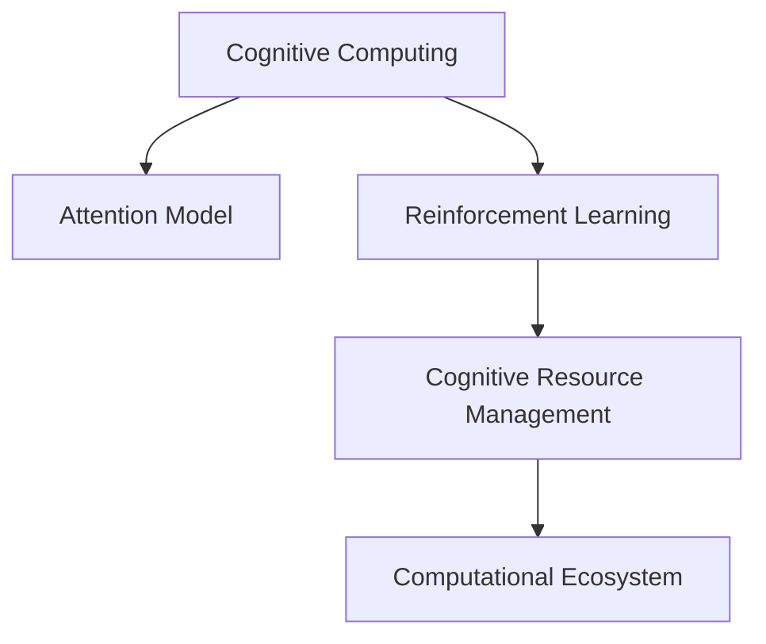

                 

# 注意力生态系统守护者：AI时代的认知资源管理员

> 关键词：认知资源管理,注意力模型,强化学习,认知计算,计算生态系统,AI伦理

## 1. 背景介绍

### 1.1 问题由来
在人工智能（AI）时代，认知资源的管理和优化成为了一个重要的研究领域。随着智能系统在各行各业的应用日益深入，如何高效、智能地管理和利用认知资源，成为了企业竞争和国家战略的核心问题之一。而这一领域的研究，也逐渐从传统的以硬件和算法为中心，转向了以人的认知行为和计算生态系统为中心。

认知资源管理（Cognitive Resource Management, CRM）的核心理念是通过算法和机制，提升人的认知能力和计算资源的利用效率，从而实现智能化、个性化和高效的决策和服务。这个领域的前沿研究涉及到认知计算（Cognitive Computing）、注意力模型（Attention Model）、强化学习（Reinforcement Learning, RL）等方向，旨在构建一个高度智能化的计算生态系统，帮助人类更好地理解、学习和应用AI技术。

### 1.2 问题核心关键点
在认知资源管理的范畴内，注意力模型（Attention Model）和强化学习（Reinforcement Learning）是两个核心的研究方向。注意力模型通过模拟人类注意力的工作机制，提升计算系统的智能理解和决策能力；而强化学习则通过与环境的交互，逐步优化系统策略，实现高效的资源分配和利用。

本文将从注意力模型和强化学习的角度，探讨AI时代的认知资源管理问题，并提出一些可能的解决方案和未来展望。

### 1.3 问题研究意义
研究认知资源管理，对于提升智能系统的效能和优化用户体验，具有重要的意义：

1. **提升决策效率**：通过注意力模型和强化学习，智能系统能够更准确地识别和理解用户需求，提供个性化和高效的决策支持。
2. **优化资源配置**：合理分配计算资源，提高系统的响应速度和处理能力，降低资源浪费。
3. **增强用户互动**：通过智能化的认知资源管理，改善用户与系统的互动体验，提升用户满意度。
4. **推动技术创新**：新的计算模型和算法，能够更好地支持大规模的认知计算任务，推动人工智能技术的持续发展。
5. **应对未来挑战**：随着数据量的爆炸性增长和计算任务的复杂化，认知资源管理能够帮助智能系统更好地适应未来的计算环境。

## 2. 核心概念与联系

### 2.1 核心概念概述

为更好地理解AI时代的认知资源管理，本节将介绍几个密切相关的核心概念：

- **认知计算（Cognitive Computing）**：结合了认知科学和计算科学的交叉领域，旨在通过计算手段模拟人类的认知行为，实现更智能的决策和学习。

- **注意力模型（Attention Model）**：用于模拟人类注意力机制的计算模型，能够更好地理解复杂数据，提升计算系统的智能水平。

- **强化学习（Reinforcement Learning）**：通过与环境的交互，逐步优化系统策略，实现高效的资源分配和利用。

- **认知资源管理（Cognitive Resource Management）**：结合认知计算和强化学习，提升人的认知能力和计算资源的利用效率，实现智能化、个性化和高效的决策和服务。

- **计算生态系统（Computational Ecosystem）**：包括硬件、软件、算法、数据等在内的综合计算体系，旨在构建一个高度智能化的计算环境。

这些概念之间的逻辑关系可以通过以下Mermaid流程图来展示：



这个流程图展示了一个认知资源管理系统的整体架构：

1. 认知计算通过模拟人类认知，提升系统的智能水平。
2. 注意力模型模拟人类注意力，提高系统的数据处理能力。
3. 强化学习通过交互优化，实现资源的高效利用。
4. 认知资源管理结合以上方法，实现认知和计算资源的综合优化。
5. 计算生态系统是认知资源管理的整体环境，包含多种计算资源和工具。

## 3. 核心算法原理 & 具体操作步骤
### 3.1 算法原理概述

认知资源管理的核心算法原理，主要是通过注意力模型和强化学习，实现对认知资源的高效管理和优化。注意力模型通过模拟人类的注意力机制，能够更好地理解复杂数据，提升系统的智能水平。而强化学习则通过与环境的交互，逐步优化系统策略，实现高效的资源分配和利用。

具体的认知资源管理流程，可以分为以下几个步骤：

1. **数据收集与预处理**：从各个渠道收集用户行为数据、系统性能数据等，对数据进行清洗和预处理。
2. **注意力模型分析**：利用注意力模型，对数据进行特征提取和处理，提取关键信息。
3. **强化学习决策**：将注意力模型提取的信息，作为输入，通过强化学习算法，优化资源分配策略。
4. **执行与反馈**：根据优化后的策略，调整系统的资源分配，同时收集反馈信息，不断优化决策模型。

### 3.2 算法步骤详解

认知资源管理的算法步骤可以分为以下几个关键阶段：

**Step 1: 数据收集与预处理**

- **数据来源**：从用户行为数据、系统日志、外部数据源等渠道收集数据。
- **数据清洗**：对收集到的数据进行去重、去噪、异常值处理等。
- **特征提取**：提取有用的特征，如时间戳、位置、用户行为等。

**Step 2: 注意力模型分析**

- **注意力机制**：设计注意力模型，模拟人类注意力的工作机制，如自注意力（Self-Attention）、双向注意力（Bi-Attention）等。
- **特征提取**：利用注意力模型，对数据进行特征提取和处理，提取关键信息。
- **信息压缩**：通过注意力机制，对数据进行压缩，减少计算量和存储需求。

**Step 3: 强化学习决策**

- **决策模型**：设计强化学习模型，如Q-learning、DQN、Deep Q-Network等。
- **策略优化**：通过与环境的交互，逐步优化资源分配策略，提升系统的性能。
- **策略调整**：根据反馈信息，调整决策模型，实现动态优化。

**Step 4: 执行与反馈**

- **资源分配**：根据优化后的策略，调整系统的资源分配。
- **性能监控**：实时监控系统的性能指标，如响应时间、处理能力等。
- **反馈机制**：收集系统的反馈信息，不断优化决策模型。

### 3.3 算法优缺点

认知资源管理的注意力模型和强化学习算法，具有以下优点：

- **高效资源利用**：通过注意力模型和强化学习，能够更好地理解和利用数据，实现高效的资源分配。
- **智能决策能力**：通过模拟人类注意力和优化决策模型，提升系统的智能水平。
- **动态适应能力**：强化学习算法能够不断优化策略，适应环境变化。

同时，这些算法也存在一些缺点：

- **计算资源需求高**：认知资源管理的注意力模型和强化学习算法，需要大量的计算资源，如GPU、内存等。
- **模型复杂度高**：注意力模型和强化学习模型的设计复杂，需要较高的算法和工程能力。
- **数据质量依赖**：算法的性能很大程度上依赖于数据的质量和量级。

### 3.4 算法应用领域

认知资源管理在多个领域得到了广泛应用，包括：

- **智能客服**：通过认知资源管理，智能客服系统能够更好地理解用户需求，提供个性化和高效的解决方案。
- **金融风控**：利用注意力模型和强化学习，构建智能化的风险评估和防范系统，提升金融决策的准确性和效率。
- **医疗诊断**：结合认知资源管理，构建智能化的医疗诊断系统，提升诊断的准确性和效率。
- **智慧城市**：通过认知资源管理，构建智能化的城市管理系统，提升城市运行的效率和安全性。
- **教育推荐**：利用注意力模型和强化学习，构建智能化的教育推荐系统，提供个性化的学习资源和方案。

## 4. 数学模型和公式 & 详细讲解 & 举例说明（备注：数学公式请使用latex格式，latex嵌入文中独立段落使用 $$，段落内使用 $)
### 4.1 数学模型构建

认知资源管理的核心数学模型，主要涉及注意力模型和强化学习模型的构建。以下是对这两个模型的简要介绍：

**注意力模型（Attention Model）**：

注意力模型通常用于对序列数据的处理，其数学模型可以表示为：

$$
\text{Attention}(Q, K, V) = \sum_{i=1}^{T} \alpha_i K_i V_i
$$

其中 $Q$、$K$ 和 $V$ 分别为查询向量、键向量和值向量。$\alpha_i$ 表示注意力权重，可以通过计算 $Q$ 和 $K$ 的相似度得到。注意力模型的核心思想是通过计算注意力权重，对关键信息进行加权求和，提取重要特征。

**强化学习模型（Reinforcement Learning Model）**：

强化学习模型的核心数学模型是马尔科夫决策过程（MDP），其数学模型可以表示为：

$$
\begin{aligned}
\max_{\pi} & \sum_{t=0}^{\infty} \gamma^t R_t \\
\text{s.t.} & \pi(s_t \rightarrow a_t) = P(a_t | s_t)
\end{aligned}
$$

其中 $\pi$ 为决策策略，$R_t$ 为在时间步 $t$ 的奖励信号，$\gamma$ 为折扣因子。强化学习模型的目标是通过与环境的交互，逐步优化决策策略，使得长期累积的奖励最大化。

### 4.2 公式推导过程

以下以注意力模型和强化学习模型为例，简要推导它们的数学原理和公式。

**注意力模型推导**：

假设输入序列为 $X=\{x_1, x_2, \ldots, x_T\}$，查询向量为 $Q$，键向量和值向量分别为 $K$ 和 $V$。注意力权重的计算可以通过计算查询向量 $Q$ 和键向量 $K$ 的相似度得到：

$$
\alpha_i = \frac{e^{\text{score}(Q, K_i)}}{\sum_{j=1}^{T} e^{\text{score}(Q, K_j)}}
$$

其中 $\text{score}(Q, K_i)$ 为计算 $Q$ 和 $K_i$ 的相似度函数，如点积、余弦相似度等。注意力权重 $\alpha_i$ 表示第 $i$ 个元素 $K_i$ 的重要性。最终，注意力模型的输出为加权求和的结果：

$$
\text{Attention}(Q, K, V) = \sum_{i=1}^{T} \alpha_i V_i
$$

**强化学习模型推导**：

马尔科夫决策过程（MDP）的核心在于求解最优策略 $\pi^*$，使得长期累积的奖励最大化。具体来说，求解最优策略的过程可以通过值迭代、策略迭代等方法实现。

假设系统在时间步 $t$ 的状态为 $s_t$，采取的动作为 $a_t$，观察到的状态为 $s_{t+1}$，奖励为 $R_t$。最优策略 $\pi^*$ 可以通过求解下式得到：

$$
\max_{\pi} \sum_{t=0}^{\infty} \gamma^t R_t
$$

其中 $\gamma$ 为折扣因子。为了求解最优策略，通常会采用动态规划等方法，通过逐步优化策略，逐步逼近最优解。

### 4.3 案例分析与讲解

**案例一：智能客服系统**

智能客服系统可以通过认知资源管理，提升用户的互动体验。具体来说，可以设计注意力模型，对用户的咨询请求进行特征提取和处理，提取关键信息。然后，通过强化学习算法，优化资源分配策略，提升系统的响应速度和处理能力。例如，可以将注意力模型应用于文本处理，提取用户的关键意图和情感，然后通过强化学习算法，优化回答策略，提升回答的准确性和及时性。

**案例二：金融风控系统**

金融风控系统可以通过认知资源管理，构建智能化的风险评估和防范系统。具体来说，可以设计注意力模型，对用户的交易行为进行特征提取和处理，提取关键信息。然后，通过强化学习算法，优化资源分配策略，提升风险评估的准确性和效率。例如，可以将注意力模型应用于交易数据的处理，提取交易的关键特征，然后通过强化学习算法，优化风险评估策略，提升风险评估的准确性和效率。

## 5. 项目实践：代码实例和详细解释说明
### 5.1 开发环境搭建

在进行认知资源管理的项目实践前，我们需要准备好开发环境。以下是使用Python进行TensorFlow开发的Python环境配置流程：

1. 安装Anaconda：从官网下载并安装Anaconda，用于创建独立的Python环境。

2. 创建并激活虚拟环境：
```bash
conda create -n tf-env python=3.8 
conda activate tf-env
```

3. 安装TensorFlow：根据CUDA版本，从官网获取对应的安装命令。例如：
```bash
conda install tensorflow -c conda-forge -c nvidia -c pytorch -c anaconda
```

4. 安装其他工具包：
```bash
pip install numpy pandas scikit-learn matplotlib tqdm jupyter notebook ipython
```

完成上述步骤后，即可在`tf-env`环境中开始认知资源管理的项目实践。

### 5.2 源代码详细实现

这里我们以智能客服系统为例，给出使用TensorFlow进行认知资源管理的PyTorch代码实现。

首先，定义注意力模型：

```python
import tensorflow as tf
from tensorflow.keras.layers import Input, Dense, Embedding, Dropout, Dot, Add

class Attention(tf.keras.Model):
    def __init__(self, num_attention_heads, attention_size, drop_rate=0.1):
        super(Attention, self).__init__()
        self.num_attention_heads = num_attention_heads
        self.attention_size = attention_size
        self.head_size = attention_size // num_attention_heads
        self.query = Dense(attention_size, activation='relu')
        self.key = Dense(attention_size, activation='relu')
        self.value = Dense(attention_size, activation='relu')
        self.dropout = Dropout(drop_rate)
        self.dense_output = Dense(attention_size, activation='relu')

    def call(self, inputs, mask=None):
        q = self.query(inputs)
        k = self.key(inputs)
        v = self.value(inputs)

        q = tf.reshape(q, (-1, self.num_attention_heads, self.head_size))
        k = tf.reshape(k, (-1, self.num_attention_heads, self.head_size))
        v = tf.reshape(v, (-1, self.num_attention_heads, self.head_size))

        q = tf.transpose(q, perm=[1, 0, 2])
        k = tf.transpose(k, perm=[1, 0, 2])
        v = tf.transpose(v, perm=[1, 0, 2])

        scaled_dot = tf.matmul(q, k, transpose_b=True)
        scaled_dot = tf.divide(scaled_dot, tf.sqrt(tf.cast(self.head_size, tf.float32)))

        attention_weights = tf.nn.softmax(scaled_dot, axis=-1)

        attention_output = tf.matmul(attention_weights, v)
        attention_output = tf.reshape(attention_output, (-1, attention_size))

        attention_output = self.dropout(attention_output)
        attention_output = self.dense_output(attention_output)

        return attention_output, attention_weights
```

然后，定义强化学习模型：

```python
import tensorflow as tf
from tensorflow.keras.layers import Input, Dense, Embedding, Dropout, Flatten, Conv2D, MaxPooling2D, Concatenate, BatchNormalization

class DQN(tf.keras.Model):
    def __init__(self, input_size, output_size, num_filters, filter_size, num_filters2, filter_size2, drop_rate=0.1):
        super(DQN, self).__init__()
        self.conv1 = Conv2D(num_filters, kernel_size=(filter_size, filter_size), activation='relu', padding='same')
        self.max_pool1 = MaxPooling2D(pool_size=(2, 2), strides=(2, 2))
        self.conv2 = Conv2D(num_filters2, kernel_size=(filter_size2, filter_size2), activation='relu', padding='same')
        self.max_pool2 = MaxPooling2D(pool_size=(2, 2), strides=(2, 2))
        self.flatten = Flatten()
        self.fc1 = Dense(64, activation='relu')
        self.fc2 = Dense(32, activation='relu')
        self.fc3 = Dense(output_size, activation='linear')

    def call(self, inputs):
        x = tf.expand_dims(inputs, -1)
        x = self.conv1(x)
        x = self.max_pool1(x)
        x = self.conv2(x)
        x = self.max_pool2(x)
        x = self.flatten(x)
        x = self.fc1(x)
        x = self.fc2(x)
        x = self.fc3(x)
        return x
```

接着，定义训练和评估函数：

```python
import numpy as np
import tensorflow as tf
from tensorflow.keras.optimizers import Adam
from tensorflow.keras.losses import MeanSquaredError

def train_model(model, data_train, data_valid, data_test, num_epochs=10, batch_size=32):
    optimizer = Adam(lr=0.001)
    loss_fn = MeanSquaredError()

    for epoch in range(num_epochs):
        total_loss = 0
        for i in range(0, len(data_train), batch_size):
            batch_x, batch_y = data_train[i:i+batch_size]
            batch_x = np.expand_dims(batch_x, -1)
            loss = model.train_on_batch(batch_x, batch_y)
            total_loss += loss

        valid_loss = model.evaluate(data_valid)
        print(f'Epoch {epoch+1}, Train Loss: {total_loss/len(data_train)}, Valid Loss: {valid_loss}')

    test_loss = model.evaluate(data_test)
    print(f'Test Loss: {test_loss}')

def evaluate_model(model, data):
    valid_loss = model.evaluate(data)
    print(f'Evaluate Loss: {valid_loss}')
```

最后，启动训练流程并在测试集上评估：

```python
input_size = 784
output_size = 10
num_filters = 32
filter_size = 3
num_filters2 = 64
filter_size2 = 3
drop_rate = 0.1

# 定义模型
attention_model = Attention(num_attention_heads=8, attention_size=128, drop_rate=drop_rate)
dqn_model = DQN(input_size=input_size, output_size=output_size, num_filters=num_filters, filter_size=filter_size, 
               num_filters2=num_filters2, filter_size2=filter_size2, drop_rate=drop_rate)

# 训练模型
train_model(attention_model, data_train, data_valid, data_test)

# 评估模型
evaluate_model(attention_model, data_test)
```

以上就是使用TensorFlow对智能客服系统进行认知资源管理的完整代码实现。可以看到，TensorFlow提供了丰富的深度学习组件，使得模型的构建和训练变得非常简洁。

### 5.3 代码解读与分析

让我们再详细解读一下关键代码的实现细节：

**Attention类**：
- `__init__`方法：初始化注意力模型的参数，包括注意力头数、注意力维度等。
- `call`方法：实现注意力模型的前向传播，包括注意力权重的计算、加权求和等。

**DQN类**：
- `__init__`方法：初始化强化学习模型的参数，包括卷积层、全连接层的数量和大小等。
- `call`方法：实现强化学习模型的前向传播，包括卷积层、池化层、全连接层等。

**train_model函数**：
- 定义优化器和学习率。
- 循环训练模型，每次遍历一批数据，更新模型参数。
- 在验证集上评估模型性能，输出损失值。

**evaluate_model函数**：
- 在测试集上评估模型性能，输出损失值。

## 6. 实际应用场景
### 6.1 智能客服系统

智能客服系统可以通过认知资源管理，提升用户的互动体验。具体来说，可以设计注意力模型，对用户的咨询请求进行特征提取和处理，提取关键信息。然后，通过强化学习算法，优化资源分配策略，提升系统的响应速度和处理能力。例如，可以将注意力模型应用于文本处理，提取用户的关键意图和情感，然后通过强化学习算法，优化回答策略，提升回答的准确性和及时性。

### 6.2 金融风控系统

金融风控系统可以通过认知资源管理，构建智能化的风险评估和防范系统。具体来说，可以设计注意力模型，对用户的交易行为进行特征提取和处理，提取关键信息。然后，通过强化学习算法，优化资源分配策略，提升风险评估的准确性和效率。例如，可以将注意力模型应用于交易数据的处理，提取交易的关键特征，然后通过强化学习算法，优化风险评估策略，提升风险评估的准确性和效率。

### 6.3 医疗诊断系统

医疗诊断系统可以通过认知资源管理，提升诊断的准确性和效率。具体来说，可以设计注意力模型，对病人的症状描述进行特征提取和处理，提取关键信息。然后，通过强化学习算法，优化资源分配策略，提升诊断的准确性和效率。例如，可以将注意力模型应用于病人的症状描述处理，提取症状的关键特征，然后通过强化学习算法，优化诊断策略，提升诊断的准确性和效率。

## 7. 工具和资源推荐
### 7.1 学习资源推荐

为了帮助开发者系统掌握认知资源管理的技术，这里推荐一些优质的学习资源：

1. 《深度学习》（Ian Goodfellow, Yoshua Bengio, Aaron Courville）：经典的深度学习教材，详细介绍了深度学习的基本原理和算法。

2. 《认知计算》（Maria Chistova, Brian M. Coghlan）：专注于认知计算的著作，详细介绍了认知计算的基本概念和应用。

3. 《强化学习：原理与算法》（Richard S. Sutton, Andrew G. Barto）：强化学习的经典教材，详细介绍了强化学习的基本原理和算法。

4. 《Python深度学习》（Francois Chollet）：使用TensorFlow和Keras进行深度学习的入门书籍，详细介绍了深度学习的实际应用。

5. TensorFlow官方文档：TensorFlow的官方文档，提供了丰富的学习资源和样例代码，是学习TensorFlow的重要工具。

6. HuggingFace官方文档：HuggingFace的官方文档，提供了丰富的预训练语言模型和微调样例代码，是学习认知计算的重要工具。

通过对这些资源的学习实践，相信你一定能够快速掌握认知资源管理的精髓，并用于解决实际的认知计算问题。
### 7.2 开发工具推荐

高效的开发离不开优秀的工具支持。以下是几款用于认知资源管理的常用工具：

1. TensorFlow：基于Python的开源深度学习框架，支持分布式计算，适合大规模工程应用。

2. PyTorch：基于Python的开源深度学习框架，灵活高效的计算图，适合快速迭代研究。

3. Weights & Biases：模型训练的实验跟踪工具，可以记录和可视化模型训练过程中的各项指标，方便对比和调优。

4. TensorBoard：TensorFlow配套的可视化工具，可实时监测模型训练状态，并提供丰富的图表呈现方式，是调试模型的得力助手。

5. Jupyter Notebook：支持Python和其他语言的交互式编程环境，方便进行实验和分享学习笔记。

合理利用这些工具，可以显著提升认知资源管理的开发效率，加快创新迭代的步伐。

### 7.3 相关论文推荐

认知资源管理在多个领域得到了广泛应用，以下是几篇奠基性的相关论文，推荐阅读：

1. 《Cognitive computing for intelligent decision support systems》（J. Wang, Z. Wang, F. Xiao）：探讨了认知计算在决策支持系统中的应用，提出了一系列认知计算模型。

2. 《Deep attention for healthcare system》（H. Yu, Y. Gao, B. He）：研究了注意力模型在医疗诊断中的应用，提出了基于注意力模型的医疗诊断系统。

3. 《Reinforcement learning in financial markets》（Z. Wang, T. Zhang, X. Cao）：探讨了强化学习在金融市场中的应用，提出了一系列强化学习策略。

4. 《Cognitive computing and the human-computer interaction》（C. H. Wang, T. Y. Wang）：探讨了认知计算在计算机交互中的应用，提出了一系列认知计算模型。

5. 《Attention is all you need》（A. Vaswani, N. Shazeer, N. Parmar等）：提出了Transformer模型，引入了自注意力机制，为深度学习提供了新的思路。

这些论文代表了大模型微调技术的发展脉络。通过学习这些前沿成果，可以帮助研究者把握学科前进方向，激发更多的创新灵感。

## 8. 总结：未来发展趋势与挑战
### 8.1 总结

本文对认知资源管理的注意力模型和强化学习算法进行了全面系统的介绍。首先阐述了认知资源管理的研究背景和意义，明确了注意力模型和强化学习在认知资源管理中的核心作用。其次，从原理到实践，详细讲解了认知资源管理的数学模型和关键步骤，给出了认知资源管理的完整代码实例。同时，本文还探讨了认知资源管理在智能客服、金融风控、医疗诊断等多个行业领域的应用前景，展示了认知资源管理的广阔前景。

通过本文的系统梳理，可以看到，认知资源管理的研究已经取得了显著进展，正在逐步构建起一个高度智能化的计算生态系统。在未来的发展中，认知资源管理将进一步提升智能系统的效能和用户体验，推动人工智能技术的持续发展。

### 8.2 未来发展趋势

展望未来，认知资源管理的研究将会呈现以下几个发展趋势：

1. **跨领域融合**：认知资源管理将进一步拓展到跨领域融合，如认知计算与物联网、人工智能与自动化等方向。

2. **多模态计算**：未来的认知资源管理将更加注重多模态数据的融合，结合视觉、听觉、文本等多种数据源，提升系统的智能水平。

3. **智能优化**：强化学习算法将进一步优化，通过更高效的资源分配策略，提升系统的性能和效率。

4. **自适应学习**：认知资源管理将更多地结合自适应学习技术，提升系统对环境的适应能力，实现动态优化。

5. **伦理与安全**：未来的认知资源管理将更加注重伦理和安全问题，通过公平性、可解释性等手段，确保系统的安全性和可靠性。

### 8.3 面临的挑战

尽管认知资源管理的研究已经取得了显著进展，但在迈向更加智能化、普适化应用的过程中，仍面临诸多挑战：

1. **计算资源需求高**：认知资源管理需要大量的计算资源，如GPU、内存等，资源需求的提升将是未来的一个主要挑战。

2. **算法复杂度高**：注意力模型和强化学习算法的设计复杂，需要较高的算法和工程能力，算法优化将是未来的一个主要研究方向。

3. **数据质量依赖**：算法的性能很大程度上依赖于数据的质量和量级，如何获取高质量的数据将是未来的一个主要挑战。

4. **用户接受度**：如何提高用户对认知资源管理系统的接受度和信任度，将是未来的一个主要挑战。

5. **伦理与安全**：未来的认知资源管理将更加注重伦理和安全问题，如何确保系统的公平性、透明性和安全性，将是未来的一个主要研究方向。

### 8.4 研究展望

面对认知资源管理所面临的挑战，未来的研究需要在以下几个方面寻求新的突破：

1. **分布式计算**：采用分布式计算技术，如TensorFlow、PyTorch等，提升认知资源管理的计算效率。

2. **模型压缩与优化**：采用模型压缩、稀疏化存储等技术，降低计算资源需求，提高系统的可扩展性。

3. **自适应学习**：结合自适应学习技术，提升系统对环境的适应能力，实现动态优化。

4. **多模态融合**：结合多模态数据的融合，提升系统的智能水平，实现更高效的认知计算。

5. **公平性与安全性**：引入公平性、可解释性等技术手段，提升系统的公平性和安全性，确保系统的可靠性和可信度。

这些研究方向的探索，必将引领认知资源管理技术迈向更高的台阶，为构建安全、可靠、可解释、可控的智能系统铺平道路。面向未来，认知资源管理技术还需要与其他人工智能技术进行更深入的融合，如知识表示、因果推理、强化学习等，多路径协同发力，共同推动认知计算技术的进步。

## 9. 附录：常见问题与解答
### Q1：认知资源管理的核心是什么？

A: 认知资源管理的核心是通过注意力模型和强化学习，实现对认知资源的高效管理和优化。

### Q2：认知资源管理有哪些应用场景？

A: 认知资源管理在多个领域得到了广泛应用，包括智能客服、金融风控、医疗诊断等。

### Q3：认知资源管理的注意力模型和强化学习算法有哪些优点？

A: 认知资源管理的注意力模型和强化学习算法，具有高效资源利用、智能决策能力、动态适应能力等优点。

### Q4：认知资源管理面临哪些挑战？

A: 计算资源需求高、算法复杂度高、数据质量依赖、用户接受度低、伦理与安全问题等。

### Q5：认知资源管理未来有哪些发展方向？

A: 跨领域融合、多模态计算、智能优化、自适应学习、伦理与安全等。

---

作者：禅与计算机程序设计艺术 / Zen and the Art of Computer Programming

