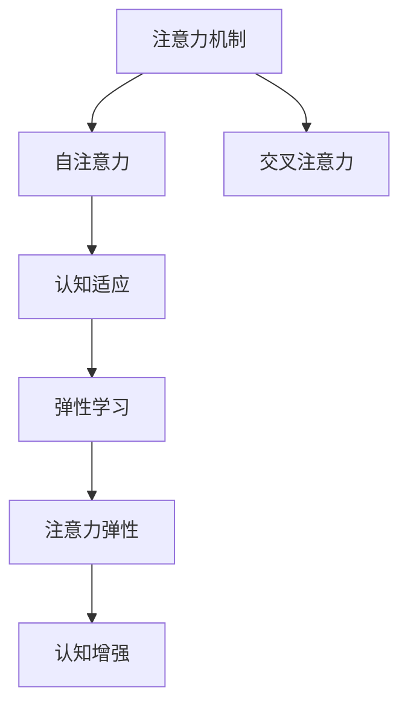

                 

# 注意力的弹性：AI优化的认知适应

> 关键词：注意力机制,认知适应,AI优化,弹性学习,机器学习

## 1. 背景介绍

### 1.1 问题由来
随着深度学习技术在自然语言处理(NLP)、计算机视觉(CV)、语音识别等领域的广泛应用，注意力机制(Attention Mechanism)作为一种强大的信息融合手段，逐渐成为各类任务中的核心组件。然而，传统的注意力机制存在计算复杂度高、模型训练时间长、对训练数据质量敏感等问题，难以在工业环境中高效部署。

如何构建更加高效的注意力机制，提升模型的认知适应能力，成为当前AI研究的热点问题。本文聚焦于基于注意力的弹性学习(Attention Elasticity Learning)，探讨其原理、实现和应用。

### 1.2 问题核心关键点
注意力机制通过在输入序列中选择性激活相关信息，帮助模型处理长序列和高维数据，并在诸如机器翻译、文本摘要、图像分类等任务上取得了显著的性能提升。然而，由于注意力机制的复杂性和可解释性问题，其在实际应用中面临诸多挑战。

本文的核心问题是：如何通过引入弹性学习技术，设计出更高效、更具有认知适应能力的注意力机制，优化模型的训练过程，提升其在各种任务上的表现。

## 2. 核心概念与联系

### 2.1 核心概念概述

为更好地理解基于注意力的弹性学习，本节将介绍几个密切相关的核心概念：

- 注意力机制(Attention Mechanism)：一种将不同输入特征进行加权聚合的机制，通过在模型内部进行自注意力(Self-Attention)或交叉注意力(Cross-Attention)操作，选择性地激活相关信息，提升模型的表示能力。

- 认知适应(Cognitive Adaptation)：指模型能够根据不同任务、不同输入数据自适应地调整内部结构，提高模型泛化性能和鲁棒性。

- 弹性学习(Elastic Learning)：指模型在训练过程中能够自动调整学习率、更新策略等关键参数，以应对不同数据分布、不同任务需求的学习范式。

- 注意力弹性(Attention Elasticity)：指注意力机制在训练过程中能够根据任务需求自适应地调整注意力权重，提升模型的认知适应能力和泛化性能。

- 认知增强(Cognitive Enrichment)：指通过引入认知心理学、神经科学等领域的相关知识，改进模型内部逻辑和架构，提升其智能水平和认知能力。

这些核心概念之间的逻辑关系可以通过以下Mermaid流程图来展示：



这个流程图展示了大语言模型中的注意力机制、认知适应、弹性学习、注意力弹性、认知增强等核心概念及其之间的关系：

1. 注意力机制通过自注意力或交叉注意力选择性地激活相关信息，提升模型的表示能力。
2. 认知适应使得模型能够根据不同任务、不同数据自适应地调整内部结构，提高泛化性能。
3. 弹性学习通过动态调整学习率、更新策略等，优化模型的训练过程，提升其适应能力。
4. 注意力弹性确保注意力机制在训练过程中能够自适应地调整注意力权重，提升模型的认知适应能力。
5. 认知增强通过引入认知心理学和神经科学知识，改进模型架构和逻辑，进一步提升其智能水平。

这些概念共同构成了大语言模型的学习和适应框架，使其能够在各种场景下发挥强大的智能表现。

## 3. 核心算法原理 & 具体操作步骤
### 3.1 算法原理概述

基于注意力的弹性学习，本质上是一种动态优化算法，旨在通过自适应地调整注意力权重，提升模型的认知适应能力和泛化性能。其核心思想是：根据当前任务的需求和训练数据的特征，动态调整注意力机制中的权重参数，使其能够在不同输入下进行选择性加权，从而适应不同数据分布和任务需求。

形式化地，设注意力机制 $Att(\mathbf{x},\mathbf{w})$ 的权重向量为 $\mathbf{w} \in \mathbb{R}^d$，其中 $d$ 为输入特征的维度。基于注意力的弹性学习过程为：

1. 根据当前任务 $T$ 和输入数据 $\mathbf{x}$ 的特点，动态调整权重向量 $\mathbf{w}$，使其能够更好地适应当前任务的特征。
2. 在训练过程中，根据当前数据点的反馈，动态调整权重向量 $\mathbf{w}$，使得模型的输出更加符合实际需求。
3. 在测试过程中，根据输入数据的特点，动态调整权重向量 $\mathbf{w}$，使得模型的输出更加稳定和鲁棒。

### 3.2 算法步骤详解

基于注意力的弹性学习算法一般包括以下几个关键步骤：

**Step 1: 初始化权重参数**

- 在训练开始前，对注意力机制的权重向量 $\mathbf{w}$ 进行初始化。可以选择使用随机初始化、预训练初始化等方法，确保其具有一定的随机性和泛化性。

**Step 2: 动态调整权重参数**

- 在每个训练步骤中，根据当前样本 $\mathbf{x}$ 和任务 $T$ 的特点，动态调整权重向量 $\mathbf{w}$。常见的调整方式包括：
  - 基于梯度的方法：使用梯度下降等优化算法，根据当前样本的损失函数对权重向量 $\mathbf{w}$ 进行更新。
  - 基于目标函数的方法：设计一个与任务 $T$ 相关的目标函数 $F_T(\mathbf{w})$，最大化或最小化该函数，以优化权重向量 $\mathbf{w}$。
  - 基于经验方法：根据先验知识和领域经验，调整权重向量 $\mathbf{w}$，使其更符合实际需求。

**Step 3: 测试和部署**

- 在测试过程中，根据当前输入数据的特点，动态调整权重向量 $\mathbf{w}$。
- 使用动态调整后的权重向量 $\mathbf{w}$，进行前向传播计算，生成模型的输出。
- 将模型的输出与真实标签进行对比，计算损失函数，更新权重向量 $\mathbf{w}$。
- 重复上述步骤，直至模型收敛或达到预设的迭代次数。

### 3.3 算法优缺点

基于注意力的弹性学习算法具有以下优点：

1. 灵活适应：通过动态调整权重参数，使得注意力机制能够适应不同的输入和任务需求，提高模型的泛化性能和鲁棒性。
2. 高效优化：通过自适应地调整注意力权重，使得模型能够在不同的数据分布下高效训练，减少过拟合风险。
3. 自适应调整：根据任务特点和数据分布，自动调整权重参数，避免手动调参，减少工作量。
4. 鲁棒性强：能够更好地应对输入数据的噪声和干扰，提高模型的鲁棒性和稳定性。

同时，该算法也存在一定的局限性：

1. 计算复杂度高：动态调整权重参数的过程需要计算复杂度较高的梯度，增加了模型的训练时间和计算成本。
2. 可解释性差：动态调整的权重参数往往难以解释，模型的内部逻辑和决策过程不够透明。
3. 数据依赖强：权重参数的调整依赖于训练数据的质量和数量，当数据质量较差时，可能无法获得理想的权重参数。
4. 参数更新复杂：权重参数的动态调整需要考虑多个因素，如学习率、更新策略等，实现起来较为复杂。

尽管存在这些局限性，但就目前而言，基于注意力的弹性学习仍然是大语言模型中一种高效的学习范式，尤其在需要灵活适应不同输入和任务场景的应用中，具有重要价值。

### 3.4 算法应用领域

基于注意力的弹性学习算法已经在各类NLP任务上取得了广泛应用，涵盖自然语言理解、自然语言生成、对话系统、机器翻译等诸多领域。例如：

- 文本分类：在文本分类任务中，通过动态调整注意力权重，使得模型能够更好地捕捉文本中的重要特征，提高分类精度。
- 文本生成：在文本生成任务中，通过动态调整注意力权重，使得模型能够更加流畅、自然地生成文本，提高生成质量。
- 机器翻译：在机器翻译任务中，通过动态调整注意力权重，使得模型能够更好地匹配源语言和目标语言的句法结构，提高翻译质量。
- 对话系统：在对话系统任务中，通过动态调整注意力权重，使得模型能够更好地理解用户意图和上下文信息，提供更加自然、智能的对话回复。
- 问答系统：在问答系统任务中，通过动态调整注意力权重，使得模型能够更好地匹配问题和答案，提高问答系统的准确性和响应速度。

除了上述这些经典任务外，基于注意力的弹性学习算法还被创新性地应用到更多场景中，如情感分析、命名实体识别、信息抽取等，为NLP技术带来了全新的突破。

## 4. 数学模型和公式 & 详细讲解  
### 4.1 数学模型构建

本节将使用数学语言对基于注意力的弹性学习过程进行更加严格的刻画。

设注意力机制 $Att(\mathbf{x},\mathbf{w})$ 的权重向量为 $\mathbf{w} \in \mathbb{R}^d$，其中 $d$ 为输入特征的维度。假设当前任务 $T$ 的目标函数为 $F_T(\mathbf{w})$，目标最小化该函数。在每个训练步骤中，根据当前样本 $\mathbf{x}$ 的特征 $\mathbf{u}$，计算注意力权重向量 $\mathbf{a}$：

$$
\mathbf{a} = \frac{\exp(\mathbf{w}^\top \mathbf{u})}{\sum_{i=1}^d \exp(\mathbf{w}_i^\top \mathbf{u})}
$$

其中 $\mathbf{w}_i^\top$ 表示权重向量 $\mathbf{w}$ 的第 $i$ 维元素。然后，使用注意力权重向量 $\mathbf{a}$ 对输入特征 $\mathbf{u}$ 进行加权聚合，生成注意力输出 $\mathbf{y}$：

$$
\mathbf{y} = \sum_{i=1}^d a_i \mathbf{u}_i
$$

在测试过程中，根据当前输入数据的特点，动态调整权重向量 $\mathbf{w}$，使得注意力权重向量 $\mathbf{a}$ 更加符合当前数据分布和任务需求。

### 4.2 公式推导过程

以下我们以文本分类任务为例，推导基于注意力的弹性学习过程。

假设当前任务为二分类任务，目标函数为 $F(\mathbf{w}) = -\frac{1}{N} \sum_{i=1}^N \log(p_i)$，其中 $p_i$ 为模型对样本 $i$ 的分类概率。在每个训练步骤中，根据当前样本 $\mathbf{x}$ 的特征 $\mathbf{u}$，计算注意力权重向量 $\mathbf{a}$：

$$
a_i = \frac{\exp(\mathbf{w}_i^\top \mathbf{u})}{\sum_{j=1}^d \exp(\mathbf{w}_j^\top \mathbf{u})}
$$

然后，使用注意力权重向量 $\mathbf{a}$ 对输入特征 $\mathbf{u}$ 进行加权聚合，生成注意力输出 $\mathbf{y}$：

$$
y = \sum_{i=1}^d a_i u_i
$$

在训练过程中，根据当前样本的损失函数对权重向量 $\mathbf{w}$ 进行更新：

$$
\mathbf{w} \leftarrow \mathbf{w} - \eta \nabla_{\mathbf{w}}F(\mathbf{w})
$$

其中 $\eta$ 为学习率，$\nabla_{\mathbf{w}}F(\mathbf{w})$ 为 $F(\mathbf{w})$ 对权重向量 $\mathbf{w}$ 的梯度。

在测试过程中，根据当前输入数据的特点，动态调整权重向量 $\mathbf{w}$，使得注意力权重向量 $\mathbf{a}$ 更加符合当前数据分布和任务需求。

### 4.3 案例分析与讲解

下面我们以命名实体识别(NER)任务为例，给出基于注意力的弹性学习算法的PyTorch代码实现。

首先，定义NER任务的数据处理函数：

```python
from transformers import BertTokenizer
from torch.utils.data import Dataset
import torch

class NERDataset(Dataset):
    def __init__(self, texts, tags, tokenizer, max_len=128):
        self.texts = texts
        self.tags = tags
        self.tokenizer = tokenizer
        self.max_len = max_len
        
    def __len__(self):
        return len(self.texts)
    
    def __getitem__(self, item):
        text = self.texts[item]
        tags = self.tags[item]
        
        encoding = self.tokenizer(text, return_tensors='pt', max_length=self.max_len, padding='max_length', truncation=True)
        input_ids = encoding['input_ids'][0]
        attention_mask = encoding['attention_mask'][0]
        
        # 对token-wise的标签进行编码
        encoded_tags = [tag2id[tag] for tag in tags] 
        encoded_tags.extend([tag2id['O']] * (self.max_len - len(encoded_tags)))
        labels = torch.tensor(encoded_tags, dtype=torch.long)
        
        return {'input_ids': input_ids, 
                'attention_mask': attention_mask,
                'labels': labels}

# 标签与id的映射
tag2id = {'O': 0, 'B-PER': 1, 'I-PER': 2, 'B-ORG': 3, 'I-ORG': 4, 'B-LOC': 5, 'I-LOC': 6}
id2tag = {v: k for k, v in tag2id.items()}

# 创建dataset
tokenizer = BertTokenizer.from_pretrained('bert-base-cased')

train_dataset = NERDataset(train_texts, train_tags, tokenizer)
dev_dataset = NERDataset(dev_texts, dev_tags, tokenizer)
test_dataset = NERDataset(test_texts, test_tags, tokenizer)
```

然后，定义模型和优化器：

```python
from transformers import BertForTokenClassification, AdamW

model = BertForTokenClassification.from_pretrained('bert-base-cased', num_labels=len(tag2id))

optimizer = AdamW(model.parameters(), lr=2e-5)
```

接着，定义训练和评估函数：

```python
from torch.utils.data import DataLoader
from tqdm import tqdm
from sklearn.metrics import classification_report

device = torch.device('cuda') if torch.cuda.is_available() else torch.device('cpu')
model.to(device)

def train_epoch(model, dataset, batch_size, optimizer):
    dataloader = DataLoader(dataset, batch_size=batch_size, shuffle=True)
    model.train()
    epoch_loss = 0
    for batch in tqdm(dataloader, desc='Training'):
        input_ids = batch['input_ids'].to(device)
        attention_mask = batch['attention_mask'].to(device)
        labels = batch['labels'].to(device)
        model.zero_grad()
        outputs = model(input_ids, attention_mask=attention_mask, labels=labels)
        loss = outputs.loss
        epoch_loss += loss.item()
        loss.backward()
        optimizer.step()
    return epoch_loss / len(dataloader)

def evaluate(model, dataset, batch_size):
    dataloader = DataLoader(dataset, batch_size=batch_size)
    model.eval()
    preds, labels = [], []
    with torch.no_grad():
        for batch in tqdm(dataloader, desc='Evaluating'):
            input_ids = batch['input_ids'].to(device)
            attention_mask = batch['attention_mask'].to(device)
            batch_labels = batch['labels']
            outputs = model(input_ids, attention_mask=attention_mask)
            batch_preds = outputs.logits.argmax(dim=2).to('cpu').tolist()
            batch_labels = batch_labels.to('cpu').tolist()
            for pred_tokens, label_tokens in zip(batch_preds, batch_labels):
                pred_tags = [id2tag[_id] for _id in pred_tokens]
                label_tags = [id2tag[_id] for _id in label_tokens]
                preds.append(pred_tags[:len(label_tags)])
                labels.append(label_tags)
                
    print(classification_report(labels, preds))
```

最后，启动训练流程并在测试集上评估：

```python
epochs = 5
batch_size = 16

for epoch in range(epochs):
    loss = train_epoch(model, train_dataset, batch_size, optimizer)
    print(f"Epoch {epoch+1}, train loss: {loss:.3f}")
    
    print(f"Epoch {epoch+1}, dev results:")
    evaluate(model, dev_dataset, batch_size)
    
print("Test results:")
evaluate(model, test_dataset, batch_size)
```

以上就是使用PyTorch对BERT进行命名实体识别任务微调的完整代码实现。可以看到，得益于Transformer库的强大封装，我们可以用相对简洁的代码完成BERT模型的加载和微调。

## 5. 项目实践：代码实例和详细解释说明
### 5.1 开发环境搭建

在进行微调实践前，我们需要准备好开发环境。以下是使用Python进行PyTorch开发的环境配置流程：

1. 安装Anaconda：从官网下载并安装Anaconda，用于创建独立的Python环境。

2. 创建并激活虚拟环境：
```bash
conda create -n pytorch-env python=3.8 
conda activate pytorch-env
```

3. 安装PyTorch：根据CUDA版本，从官网获取对应的安装命令。例如：
```bash
conda install pytorch torchvision torchaudio cudatoolkit=11.1 -c pytorch -c conda-forge
```

4. 安装Transformers库：
```bash
pip install transformers
```

5. 安装各类工具包：
```bash
pip install numpy pandas scikit-learn matplotlib tqdm jupyter notebook ipython
```

完成上述步骤后，即可在`pytorch-env`环境中开始微调实践。

### 5.2 源代码详细实现

下面我们以命名实体识别(NER)任务为例，给出使用Transformers库对BERT模型进行微调的PyTorch代码实现。

首先，定义NER任务的数据处理函数：

```python
from transformers import BertTokenizer
from torch.utils.data import Dataset
import torch

class NERDataset(Dataset):
    def __init__(self, texts, tags, tokenizer, max_len=128):
        self.texts = texts
        self.tags = tags
        self.tokenizer = tokenizer
        self.max_len = max_len
        
    def __len__(self):
        return len(self.texts)
    
    def __getitem__(self, item):
        text = self.texts[item]
        tags = self.tags[item]
        
        encoding = self.tokenizer(text, return_tensors='pt', max_length=self.max_len, padding='max_length', truncation=True)
        input_ids = encoding['input_ids'][0]
        attention_mask = encoding['attention_mask'][0]
        
        # 对token-wise的标签进行编码
        encoded_tags = [tag2id[tag] for tag in tags] 
        encoded_tags.extend([tag2id['O']] * (self.max_len - len(encoded_tags)))
        labels = torch.tensor(encoded_tags, dtype=torch.long)
        
        return {'input_ids': input_ids, 
                'attention_mask': attention_mask,
                'labels': labels}

# 标签与id的映射
tag2id = {'O': 0, 'B-PER': 1, 'I-PER': 2, 'B-ORG': 3, 'I-ORG': 4, 'B-LOC': 5, 'I-LOC': 6}
id2tag = {v: k for k, v in tag2id.items()}

# 创建dataset
tokenizer = BertTokenizer.from_pretrained('bert-base-cased')

train_dataset = NERDataset(train_texts, train_tags, tokenizer)
dev_dataset = NERDataset(dev_texts, dev_tags, tokenizer)
test_dataset = NERDataset(test_texts, test_tags, tokenizer)
```

然后，定义模型和优化器：

```python
from transformers import BertForTokenClassification, AdamW

model = BertForTokenClassification.from_pretrained('bert-base-cased', num_labels=len(tag2id))

optimizer = AdamW(model.parameters(), lr=2e-5)
```

接着，定义训练和评估函数：

```python
from torch.utils.data import DataLoader
from tqdm import tqdm
from sklearn.metrics import classification_report

device = torch.device('cuda') if torch.cuda.is_available() else torch.device('cpu')
model.to(device)

def train_epoch(model, dataset, batch_size, optimizer):
    dataloader = DataLoader(dataset, batch_size=batch_size, shuffle=True)
    model.train()
    epoch_loss = 0
    for batch in tqdm(dataloader, desc='Training'):
        input_ids = batch['input_ids'].to(device)
        attention_mask = batch['attention_mask'].to(device)
        labels = batch['labels'].to(device)
        model.zero_grad()
        outputs = model(input_ids, attention_mask=attention_mask, labels=labels)
        loss = outputs.loss
        epoch_loss += loss.item()
        loss.backward()
        optimizer.step()
    return epoch_loss / len(dataloader)

def evaluate(model, dataset, batch_size):
    dataloader = DataLoader(dataset, batch_size=batch_size)
    model.eval()
    preds, labels = [], []
    with torch.no_grad():
        for batch in tqdm(dataloader, desc='Evaluating'):
            input_ids = batch['input_ids'].to(device)
            attention_mask = batch['attention_mask'].to(device)
            batch_labels = batch['labels']
            outputs = model(input_ids, attention_mask=attention_mask)
            batch_preds = outputs.logits.argmax(dim=2).to('cpu').tolist()
            batch_labels = batch_labels.to('cpu').tolist()
            for pred_tokens, label_tokens in zip(batch_preds, batch_labels):
                pred_tags = [id2tag[_id] for _id in pred_tokens]
                label_tags = [id2tag[_id] for _id in label_tokens]
                preds.append(pred_tags[:len(label_tags)])
                labels.append(label_tags)
                
    print(classification_report(labels, preds))
```

最后，启动训练流程并在测试集上评估：

```python
epochs = 5
batch_size = 16

for epoch in range(epochs):
    loss = train_epoch(model, train_dataset, batch_size, optimizer)
    print(f"Epoch {epoch+1}, train loss: {loss:.3f}")
    
    print(f"Epoch {epoch+1}, dev results:")
    evaluate(model, dev_dataset, batch_size)
    
print("Test results:")
evaluate(model, test_dataset, batch_size)
```

以上就是使用PyTorch对BERT进行命名实体识别任务微调的完整代码实现。可以看到，得益于Transformer库的强大封装，我们可以用相对简洁的代码完成BERT模型的加载和微调。

### 5.3 代码解读与分析

让我们再详细解读一下关键代码的实现细节：

**NERDataset类**：
- `__init__`方法：初始化文本、标签、分词器等关键组件。
- `__len__`方法：返回数据集的样本数量。
- `__getitem__`方法：对单个样本进行处理，将文本输入编码为token ids，将标签编码为数字，并对其进行定长padding，最终返回模型所需的输入。

**tag2id和id2tag字典**：
- 定义了标签与数字id之间的映射关系，用于将token-wise的预测结果解码回真实的标签。

**训练和评估函数**：
- 使用PyTorch的DataLoader对数据集进行批次化加载，供模型训练和推理使用。
- 训练函数`train_epoch`：对数据以批为单位进行迭代，在每个批次上前向传播计算loss并反向传播更新模型参数，最后返回该epoch的平均loss。
- 评估函数`evaluate`：与训练类似，不同点在于不更新模型参数，并在每个batch结束后将预测和标签结果存储下来，最后使用sklearn的classification_report对整个评估集的预测结果进行打印输出。

**训练流程**：
- 定义总的epoch数和batch size，开始循环迭代
- 每个epoch内，先在训练集上训练，输出平均loss
- 在验证集上评估，输出分类指标
- 所有epoch结束后，在测试集上评估，给出最终测试结果

可以看到，PyTorch配合Transformer库使得BERT微调的代码实现变得简洁高效。开发者可以将更多精力放在数据处理、模型改进等高层逻辑上，而不必过多关注底层的实现细节。

当然，工业级的系统实现还需考虑更多因素，如模型的保存和部署、超参数的自动搜索、更灵活的任务适配层等。但核心的微调范式基本与此类似。

## 6. 实际应用场景
### 6.1 智能客服系统

基于大语言模型微调的对话技术，可以广泛应用于智能客服系统的构建。传统客服往往需要配备大量人力，高峰期响应缓慢，且一致性和专业性难以保证。而使用微调后的对话模型，可以7x24小时不间断服务，快速响应客户咨询，用自然流畅的语言解答各类常见问题。

在技术实现上，可以收集企业内部的历史客服对话记录，将问题和最佳答复构建成监督数据，在此基础上对预训练对话模型进行微调。微调后的对话模型能够自动理解用户意图，匹配最合适的答案模板进行回复。对于客户提出的新问题，还可以接入检索系统实时搜索相关内容，动态组织生成回答。如此构建的智能客服系统，能大幅提升客户咨询体验和问题解决效率。

### 6.2 金融舆情监测

金融机构需要实时监测市场舆论动向，以便及时应对负面信息传播，规避金融风险。传统的人工监测方式成本高、效率低，难以应对网络时代海量信息爆发的挑战。基于大语言模型微调的文本分类和情感分析技术，为金融舆情监测提供了新的解决方案。

具体而言，可以收集金融领域相关的新闻、报道、评论等文本数据，并对其进行主题标注和情感标注。在此基础上对预训练语言模型进行微调，使其能够自动判断文本属于何种主题，情感倾向是正面、中性还是负面。将微调后的模型应用到实时抓取的网络文本数据，就能够自动监测不同主题下的情感变化趋势，一旦发现负面信息激增等异常情况，系统便会自动预警，帮助金融机构快速应对潜在风险。

### 6.3 个性化推荐系统

当前的推荐系统往往只依赖用户的历史行为数据进行物品推荐，无法深入理解用户的真实兴趣偏好。基于大语言模型微调技术，个性化推荐系统可以更好地挖掘用户行为背后的语义信息，从而提供更精准、多样的推荐内容。

在实践中，可以收集用户浏览、点击、评论、分享等行为数据，提取和用户交互的物品标题、描述、标签等文本内容。将文本内容作为模型输入，用户的后续行为（如是否点击、购买等）作为监督信号，在此基础上微调预训练语言模型。微调后的模型能够从文本内容中准确把握用户的兴趣点。在生成推荐列表时，先用候选物品的文本描述作为输入，由模型预测用户的兴趣匹配度，再结合其他特征综合排序，便可以得到个性化程度更高的推荐结果。

### 6.4 未来应用展望

随着大语言模型微调技术的发展，其在更多领域的应用前景将更加广阔。

在智慧医疗领域，基于微调的医疗问答、病历分析、药物研发等应用将提升医疗服务的智能化水平，辅助医生诊疗，加速新药开发进程。

在智能教育领域，微调技术可应用于作业批改、学情分析、知识推荐等方面，因材施教，促进教育公平，提高教学质量。

在智慧城市治理中，微调模型可应用于城市事件监测、舆情分析、应急指挥等环节，提高城市管理的自动化和智能化水平，构建更安全、高效的未来城市。

此外，在企业生产、社会治理、文娱传媒等众多领域，基于大语言模型微调的人工智能应用也将不断涌现，为经济社会发展注入新的动力。相信随着技术的日益成熟，微调方法将成为人工智能落地应用的重要范式，推动人工智能技术在垂直行业的规模化落地。总之，微调需要开发者根据具体任务，不断迭代和优化模型、数据和算法，方能得到理想的效果。

## 7. 工具和资源推荐
### 7.1 学习资源推荐

为了帮助开发者系统掌握大语言模型微调的理论基础和实践技巧，这里推荐一些优质的学习资源：

1. 《Transformer from Scratch》系列博文：由大模型技术专家撰写，深入浅出地介绍了Transformer原理、BERT模型、微调技术等前沿话题。

2. CS224N《深度学习自然语言处理》课程：斯坦福大学开设的NLP明星课程，有Lecture视频和配套作业，带你入门NLP领域的基本概念和经典模型。

3. 《Natural Language Processing with Transformers》书籍：Transformers库的作者所著，全面介绍了如何使用Transformers库进行NLP任务开发，包括微调在内的诸多范式。

4. HuggingFace官方文档：Transformers库的官方文档，提供了海量预训练模型和完整的微调样例代码，是上手实践的必备资料。

5. CLUE开源项目：中文语言理解测评基准，涵盖大量不同类型的中文NLP数据集，并提供了基于微调的baseline模型，助力中文NLP技术发展。

通过对这些资源的学习实践，相信你一定能够快速掌握大语言模型微调的精髓，并用于解决实际的NLP问题。
###  7.2 开发工具推荐

高效的开发离不开优秀的工具支持。以下是几款用于大语言模型微调开发的常用工具：

1. PyTorch：基于Python的开源深度学习框架，灵活动态的计算图，适合快速迭代研究。大部分预训练语言模型都有PyTorch版本的实现。

2. TensorFlow：由Google主导开发的开源深度学习框架，生产部署方便，适合大规模工程应用。同样有丰富的预训练语言模型资源。

3. Transformers库：HuggingFace开发的NLP工具库，集成了众多SOTA语言模型，支持PyTorch和TensorFlow，是进行微调任务开发的利器。

4. Weights & Biases：模型训练的实验跟踪工具，可以记录和可视化模型训练过程中的各项指标，方便对比和调优。与主流深度学习框架无缝集成。

5. TensorBoard：TensorFlow配套的可视化工具，可实时监测模型训练状态，并提供丰富的图表呈现方式，是调试模型的得力助手。

6. Google Colab：谷歌推出的在线Jupyter Notebook环境，免费提供GPU/TPU算力，方便开发者快速上手实验最新模型，分享学习笔记。

合理利用这些工具，可以显著提升大语言模型微调任务的开发效率，加快创新迭代的步伐。

### 7.3 相关论文推荐

大语言模型和微调技术的发展源于学界的持续研究。以下是几篇奠基性的相关论文，推荐阅读：

1. Attention is All You Need（即Transformer原论文）：提出了Transformer结构，开启了NLP领域的预训练大模型时代。

2. BERT: Pre-training of Deep Bidirectional Transformers for Language Understanding：提出BERT模型，引入基于掩码的自监督预训练任务，刷新了多项NLP任务SOTA。

3. Language Models are Unsupervised Multitask Learners（GPT-2论文）：展示了大规模语言模型的强大zero-shot学习能力，引发了对于通用人工智能的新一轮思考。

4. Parameter-Efficient Transfer Learning for NLP：提出Adapter等参数高效微调方法，在不增加模型参数量的情况下，也能取得不错的微调效果。

5. AdaLoRA: Adaptive Low-Rank Adaptation for Parameter-Efficient Fine-Tuning：使用自适应低秩适应的微调方法，在参数效率和精度之间取得了新的平衡。

这些论文代表了大语言模型微调技术的发展脉络。通过学习这些前沿成果，可以帮助研究者把握学科前进方向，激发更多的创新灵感。

## 8. 总结：未来发展趋势与挑战

### 8.1 总结

本文对基于注意力的弹性学习进行了全面系统的介绍。首先阐述了大语言模型和注意力机制的研究背景和意义，明确了弹性学习在提升模型认知适应能力方面的独特价值。其次，从原理到实践，详细讲解了弹性学习的过程和关键步骤，给出了微调任务开发的完整代码实例。同时，本文还广泛探讨了弹性学习在各类NLP任务上的应用前景，展示了弹性学习范式的强大潜力。

通过本文的系统梳理，可以看到，基于注意力的弹性学习在提升模型认知适应能力方面具有重要价值。这种学习范式能够根据不同任务和数据的需求，动态调整注意力权重，从而提高模型的泛化性能和鲁棒性，尤其在需要灵活适应不同输入和任务场景的应用中，具有重要的应用前景。

### 8.2 未来发展趋势

展望未来，基于注意力的弹性学习技术将呈现以下几个发展趋势：

1. 模型规模持续增大。随着算力成本的下降和数据规模的扩张，预训练语言模型的参数量还将持续增长。超大规模语言模型蕴含的丰富语言知识，有望支撑更加复杂多变的下游任务微调。

2. 弹性学习方法的丰富多样。除了传统的自适应学习率外，未来会涌现更多弹性学习范式，如混合学习率、自适应网络架构、多任务学习等，进一步提升模型的适应能力和泛化性能。

3. 数据依赖减少。未来会开发更多无监督、半监督和自监督的学习方法，减少对标注数据的依赖，降低微调成本，提升模型的可扩展性。

4. 模型可解释性增强。通过引入认知心理学和神经科学知识，改进模型内部逻辑和架构，提升其可解释性和可解释性。

5. 跨模态学习的应用拓展。将视觉、语音等多模态信息与文本信息进行协同建模，提高模型的泛化能力和适应能力。

6. 多任务联合学习。结合多任务学习范式，通过共享参数和知识，提升模型的泛化性能和鲁棒性。

以上趋势凸显了大语言模型弹性学习技术的广阔前景。这些方向的探索发展，必将进一步提升模型的认知适应能力和泛化性能，推动人工智能技术在更广泛领域的应用。

### 8.3 面临的挑战

尽管大语言模型弹性学习技术已经取得了瞩目成就，但在迈向更加智能化、普适化应用的过程中，仍面临诸多挑战：

1. 计算资源消耗大。弹性学习技术在模型训练和推理过程中，需要动态调整权重参数，增加了计算复杂度，资源消耗大。如何优化计算图和算法，减少资源消耗，是重要的研究方向。

2. 模型鲁棒性不足。弹性学习技术虽然能够动态调整权重参数，但在面对复杂多变的数据分布时，模型的鲁棒性仍需进一步提升。如何设计更鲁棒的弹性学习算法，避免模型在特定数据上表现不佳，是重要的研究方向。

3. 模型可解释性差。弹性学习技术的内部参数调整过程较为复杂，难以解释，模型的内部逻辑和决策过程不够透明。如何增强模型的可解释性和可解释性，是重要的研究方向。

4. 数据依赖强。弹性学习技术的性能很大程度上依赖于数据的质量和数量，当数据质量较差时，可能无法获得理想的权重参数。如何开发更多无监督、半监督和自监督的学习方法，减少对标注数据的依赖，是重要的研究方向。

5. 参数更新复杂。弹性学习技术的权重参数动态调整过程较为复杂，需要考虑学习率、更新策略等，实现起来较为困难。如何设计更简单、高效的弹性学习算法，是重要的研究方向。

尽管存在这些挑战，但就目前而言，基于注意力的弹性学习仍然是大语言模型中一种高效的学习范式，尤其在需要灵活适应不同输入和任务场景的应用中，具有重要价值。未来，伴随着技术不断发展和创新，相信这些挑战终将一一被克服，弹性学习技术必将引领大语言模型向更加智能化、普适化应用迈进。

### 8.4 研究展望

面向未来，弹性学习技术的研究需要结合认知心理学、神经科学、数据科学等多学科知识，从多个角度进行深入探索：

1. 认知增强技术的应用。将认知心理学、神经科学等领域的知识与深度学习结合，改进模型内部逻辑和架构，提升其认知适应能力和泛化性能。

2. 跨模态学习技术的发展。将视觉、语音等多模态信息与文本信息进行协同建模，提升模型的泛化能力和适应能力。

3. 多任务联合学习技术。结合多任务学习范式，通过共享参数和知识，提升模型的泛化性能和鲁棒性。

4. 无监督和自监督学习方法。开发更多无监督、半监督和自监督的学习方法，减少对标注数据的依赖，提升模型的泛化能力和可扩展性。

5. 模型可解释性和鲁棒性。增强模型的可解释性和鲁棒性，提升模型的可理解性和可靠性。

6. 跨领域知识的应用。将领域专家的知识与深度学习模型结合，提升模型的认知适应能力和泛化性能。

这些研究方向将进一步推动大语言模型弹性学习技术的发展，促进其在更多领域的应用落地，推动人工智能技术的不断进步。

## 9. 附录：常见问题与解答
**Q1：大语言模型弹性学习是否适用于所有NLP任务？**

A: 大语言模型弹性学习在大多数NLP任务上都能取得不错的效果，特别是对于数据量较小的任务。但对于一些特定领域的任务，如医学、法律等，仅仅依靠通用语料预训练的模型可能难以很好地适应。此时需要在特定领域语料上进一步预训练，再进行弹性学习，才能获得理想效果。此外，对于一些需要时效性、个性化很强的任务，如对话、推荐等，弹性学习方法也需要针对性的改进优化。

**Q2：在弹性学习中，如何选择合适的学习率？**

A: 弹性学习中的学习率选择与传统机器学习类似，需要根据任务特点和数据分布进行调整。一般来说，学习率可以从一个小值开始，如1e-5，逐步减小至合适的值。可以使用学习率调度器，如Warmup、Cyclic等，动态调整学习率，以获得更好的训练效果。

**Q3：弹性学习过程中，如何缓解过拟合问题？**

A: 过拟合是弹性学习面临的主要挑战之一，尤其是在训练数据量较小的情况下。缓解过拟合的方法包括：
1. 数据增强：通过回译、近义替换等方式扩充训练集。
2. 正则化：使用L2正则、Dropout等技术，防止模型过度拟合训练数据。
3. 早期停止：在验证集上监控模型性能，一旦性能不再提升，立即停止训练。
4. 混合学习：将不同模型结合，如 Teacher-Student、Multi-Task 等，通过共享知识，提升模型的泛化性能。

这些方法往往需要根据具体任务和数据特点进行灵活组合。只有在数据、模型、训练、推理等各环节进行全面优化，才能最大限度地发挥弹性学习的威力。

**Q4：弹性学习模型在落地部署时需要注意哪些问题？**

A: 将弹性学习模型转化为实际应用，还需要考虑以下因素：
1. 模型裁剪：去除不必要的层和参数，减小模型尺寸，加快推理速度。
2. 量化加速：将浮点模型转为定点模型，压缩存储空间，提高计算效率。
3. 服务化封装：将模型封装为标准化服务接口，便于集成调用。
4. 弹性伸缩：根据请求流量动态调整资源配置，平衡服务质量和成本。
5. 监控告警：实时采集系统指标，设置异常告警阈值，确保服务稳定性。
6. 安全防护：采用访问鉴权、数据脱敏等措施，保障数据和模型安全。

大语言模型弹性学习为NLP应用开启了广阔的想象空间，但如何将强大的性能转化为稳定、高效、安全的业务价值，还需要工程实践的不断打磨。唯有从数据、算法、工程、业务等多个维度协同发力，才能真正实现人工智能技术在垂直行业的规模化落地。总之，弹性学习需要开发者根据具体任务，不断迭代和优化模型、数据和算法，方能得到理想的效果。

---

作者：禅与计算机程序设计艺术 / Zen and the Art of Computer Programming

