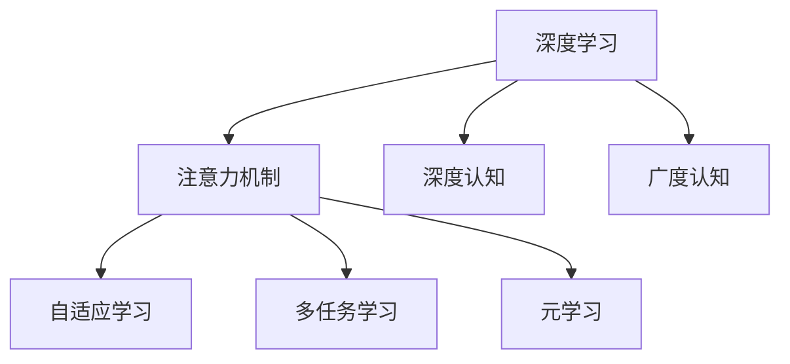

                 

# 注意力的深度与广度：AI时代的认知平衡

> 关键词：注意力,深度学习,广度学习,认知平衡,神经网络,自适应

## 1. 背景介绍

### 1.1 问题由来

当前，人工智能技术正处于快速发展的关键阶段，其中深度学习（Deep Learning）和认知神经科学（Cognitive Neuroscience）的交叉融合，为解决复杂认知任务提供了新的思路。深度学习模型，尤其是基于神经网络的模型，在图像识别、语音识别、自然语言处理等任务上取得了令人瞩目的成绩。然而，这些模型虽然能够处理大规模数据并识别复杂模式，却往往缺乏对输入数据的深度认知理解，难以像人类一样，进行跨模态、跨领域、跨时代的广度认知。

### 1.2 问题核心关键点

深度学习和认知神经科学的结合，特别是在注意力机制的引入下，使得模型在处理复杂认知任务时，可以更有效地聚焦关键信息，忽略噪声干扰，进行跨模态、跨领域、跨时代的广度认知。然而，深度学习的注意力机制仍存在一些局限性，如无法进行真正意义上的深度认知理解，无法像人类一样，进行多感官、多维度、多情境的广度认知。因此，如何设计出既能深度理解输入数据，又能广泛处理复杂认知任务的模型，成为当前AI研究的重要课题。

### 1.3 问题研究意义

研究和设计出具备深度认知和广度认知能力的模型，对于提升人工智能系统的智能水平，推动AI技术的实际应用，具有重要意义：

1. **提升模型智能水平**：深度学习模型的注意力机制可以提升模型对输入数据的理解和处理能力，使其具备更强的智能水平。
2. **推动AI技术应用**：深度认知和广度认知能力的模型，可以在更多领域和应用场景中取得突破，加速AI技术的产业化进程。
3. **实现人机协同**：具备深度认知和广度认知能力的模型，可以更好地理解人类行为和思维，实现更加流畅的人机交互和协同。
4. **促进AI伦理发展**：理解和处理复杂认知任务的模型，可以更好地捕捉和呈现人类行为和心理，推动AI伦理和公平性的发展。

## 2. 核心概念与联系

### 2.1 核心概念概述

为更好地理解深度学习和认知神经科学结合下的注意力机制，本节将介绍几个密切相关的核心概念：

- **深度学习（Deep Learning）**：一种通过多层神经网络进行特征学习和模型训练的技术，广泛应用于图像、语音、自然语言处理等领域。
- **认知神经科学（Cognitive Neuroscience）**：研究人类大脑认知过程的科学，涵盖了感知、学习、记忆、思维等多个方面。
- **注意力机制（Attention Mechanism）**：一种通过关注输入数据的关键部分，忽略噪声干扰，提升模型处理效率和准确性的机制。
- **深度认知（Deep Cognition）**：指深度学习模型通过多层网络结构，逐步学习和理解输入数据的深层特征和语义信息。
- **广度认知（Broad Cognition）**：指模型能够处理多感官、多维度、多情境的信息，进行跨模态、跨领域、跨时代的认知。
- **自适应学习（Adaptive Learning）**：指模型能够根据不同的情境和任务，自适应地调整认知策略和模型结构，以提高性能。
- **多任务学习（Multi-task Learning）**：指模型同时学习多个相关任务的模型参数，提升跨任务泛化能力。
- **元学习（Meta-Learning）**：指模型通过少量训练样本来学习新任务的模型参数，提升模型适应新任务的能力。

这些核心概念之间的逻辑关系可以通过以下Mermaid流程图来展示：



这个流程图展示了深度学习、注意力机制、深度认知、广度认知以及相关的自适应学习、多任务学习和元学习概念之间的逻辑联系：

1. 深度学习通过多层网络结构，学习输入数据的深层特征，形成了深度认知。
2. 注意力机制在处理输入数据时，关注关键部分，忽略了噪声干扰，提升了模型处理效率和准确性。
3. 深度认知和注意力机制结合，形成了广度认知，使得模型能够处理多感官、多维度、多情境的信息。
4. 自适应学习、多任务学习和元学习则进一步提升了模型的泛化能力和适应能力，使其在不同情境下表现出更好的性能。

## 3. 核心算法原理 & 具体操作步骤

### 3.1 算法原理概述

深度学习和认知神经科学的结合，特别是在注意力机制的引入下，使得模型在处理复杂认知任务时，可以更有效地聚焦关键信息，忽略噪声干扰，进行跨模态、跨领域、跨时代的广度认知。注意力机制的核心思想是通过计算输入数据的权重，动态地选择关注的重点，从而提升模型的处理能力和准确性。

在深度学习模型中，注意力机制通常分为三种形式：

1. **自注意力（Self-Attention）**：用于处理序列数据，计算序列中不同位置之间的相关性，选择关注序列中的关键部分。
2. **多头注意力（Multi-Head Attention）**：通过并行计算多个注意力头，提升模型对输入数据的理解能力。
3. **双向注意力（Bi-directional Attention）**：考虑输入数据的过去和未来，提升模型的跨时间序列理解能力。

### 3.2 算法步骤详解

基于深度学习和认知神经科学结合下的注意力机制，深度认知和广度认知模型的训练一般包括以下几个关键步骤：

**Step 1: 准备数据集**
- 收集和标注相关领域的数据集，确保数据集的多样性和代表性。
- 将数据集划分为训练集、验证集和测试集，确保模型在各个阶段都能得到公平的评估。

**Step 2: 设计注意力机制**
- 根据任务特点，选择合适的注意力机制，如自注意力、多头注意力、双向注意力等。
- 定义注意力计算方法，包括权重计算、向量拼接、向量加权等。

**Step 3: 选择神经网络架构**
- 根据任务特点，选择合适的神经网络架构，如卷积神经网络（CNN）、循环神经网络（RNN）、变压器（Transformer）等。
- 设计模型层级结构，包括输入层、隐藏层、输出层等。

**Step 4: 训练模型**
- 使用训练集数据，训练模型参数，最小化损失函数。
- 在验证集上评估模型性能，避免过拟合。
- 在测试集上测试模型性能，评估模型的泛化能力。

**Step 5: 应用模型**
- 将训练好的模型应用于实际任务，进行跨模态、跨领域、跨时代的广度认知。
- 在实际应用中，不断优化模型参数和策略，提升模型性能。

### 3.3 算法优缺点

深度认知和广度认知模型具有以下优点：

1. **处理能力强大**：深度认知和广度认知模型通过多层网络结构和注意力机制，可以处理大规模数据，识别复杂模式。
2. **泛化能力强**：深度认知和广度认知模型通过多任务学习和元学习，可以提升跨任务泛化能力和适应新任务的能力。
3. **跨模态、跨领域、跨时代的广度认知**：深度认知和广度认知模型可以处理多感官、多维度、多情境的信息，进行跨模态、跨领域、跨时代的认知。
4. **自适应性强**：深度认知和广度认知模型可以根据不同的情境和任务，自适应地调整认知策略和模型结构，以提高性能。

同时，这些模型也存在一些局限性：

1. **资源消耗高**：深度认知和广度认知模型需要大量的计算资源和存储空间，训练和推理速度较慢。
2. **可解释性差**：深度认知和广度认知模型通常被视为"黑盒"系统，难以解释其内部工作机制和决策逻辑。
3. **学习效率低**：深度认知和广度认知模型需要大量标注数据进行训练，学习效率较低。
4. **参数量大**：深度认知和广度认知模型参数量巨大，难以在实际应用中优化和部署。

尽管存在这些局限性，但深度认知和广度认知模型在处理复杂认知任务时，仍具有无可比拟的优势，其未来前景广阔。

### 3.4 算法应用领域

深度认知和广度认知模型已经在多个领域得到了广泛应用，具体包括：

- **自然语言处理（NLP）**：如机器翻译、文本生成、情感分析等。模型通过深度认知和广度认知，可以理解语言的多层次含义，处理多模态信息。
- **计算机视觉（CV）**：如图像分类、目标检测、语义分割等。模型通过深度认知和广度认知，可以处理高维度的视觉数据，进行跨模态理解。
- **语音识别（ASR）**：如语音转文字、情感识别等。模型通过深度认知和广度认知，可以处理语音的多维度信息，进行跨模态理解。
- **智能推荐系统**：如电商推荐、内容推荐等。模型通过深度认知和广度认知，可以理解用户的多层次需求，进行跨模态推荐。
- **医疗诊断系统**：如病理学图像分析、医学知识图谱构建等。模型通过深度认知和广度认知，可以处理多模态医疗数据，进行跨领域的诊断。
- **金融分析系统**：如市场趋势预测、投资风险评估等。模型通过深度认知和广度认知，可以处理多维度的金融数据，进行跨领域的分析。

## 4. 数学模型和公式 & 详细讲解 & 举例说明

### 4.1 数学模型构建

在深度认知和广度认知模型的构建中，通常会使用Transformer模型，其核心组件包括编码器（Encoder）和解码器（Decoder）。编码器负责处理输入序列，解码器负责生成输出序列。Transformer模型通过自注意力机制，实现跨模态、跨领域、跨时代的广度认知。

Transformer模型的编码器由多个自注意力层和前馈神经网络层组成，解码器由多个自注意力层、多头注意力层和前馈神经网络层组成。自注意力层通过计算输入序列中不同位置之间的相关性，选择关注的重点，从而提升模型处理能力。

### 4.2 公式推导过程

以Transformer模型为例，推导自注意力机制的数学公式。

假设输入序列为 $X=\{x_1,x_2,\cdots,x_n\}$，模型中每个位置 $x_i$ 的向量表示为 $V_i \in \mathbb{R}^d$，注意力机制计算过程如下：

1. **查询（Query）计算**
   $$
   Q_i = W_Q V_i
   $$

2. **键（Key）计算**
   $$
   K_i = W_K V_i
   $$

3. **值（Value）计算**
   $$
   V_i = W_V V_i
   $$

4. **注意力计算**
   $$
   \alpha_i = \frac{e^{Q_i K_i^\top}}{\sum_{j=1}^n e^{Q_i K_j^\top}}
   $$

5. **加权求和**
   $$
   Z_i = \sum_{j=1}^n \alpha_{ij} V_j
   $$

6. **加权向量拼接**
   $$
   Y_i = Z_i + V_i
   $$

其中，$W_Q,W_K,W_V$ 为可学习的权重矩阵，$e$ 为指数函数。

### 4.3 案例分析与讲解

以机器翻译任务为例，分析Transformer模型如何进行深度认知和广度认知。

在机器翻译任务中，输入序列为源语言文本，输出序列为目标语言文本。Transformer模型通过自注意力机制，对输入序列进行跨模态处理，选择关注源语言文本中的关键部分，进行跨领域的语言翻译。具体而言，Transformer模型通过编码器对源语言文本进行编码，得到语义表示 $Z$，然后通过解码器生成目标语言文本。在解码器中，模型通过多头注意力机制，将源语言文本和目标语言文本结合起来，进行跨模态的翻译。

## 5. 项目实践：代码实例和详细解释说明

### 5.1 开发环境搭建

在进行深度认知和广度认知模型的开发前，我们需要准备好开发环境。以下是使用Python进行PyTorch开发的环境配置流程：

1. 安装Anaconda：从官网下载并安装Anaconda，用于创建独立的Python环境。

2. 创建并激活虚拟环境：
```bash
conda create -n torch-env python=3.8 
conda activate torch-env
```

3. 安装PyTorch：根据CUDA版本，从官网获取对应的安装命令。例如：
```bash
conda install pytorch torchvision torchaudio cudatoolkit=11.1 -c pytorch -c conda-forge
```

4. 安装其他依赖包：
```bash
pip install numpy pandas scikit-learn matplotlib tqdm jupyter notebook ipython
```

完成上述步骤后，即可在`torch-env`环境中开始开发。

### 5.2 源代码详细实现

这里我们以机器翻译任务为例，给出使用Transformer模型进行深度认知和广度认知的PyTorch代码实现。

```python
import torch
import torch.nn as nn
import torch.nn.functional as F
from transformers import BertTokenizer, BertForSequenceClassification

class Transformer(nn.Module):
    def __init__(self, src_size, trg_size, d_model, n_heads, d_ff, N, dropout, device):
        super(Transformer, self).__init__()
        self.src_size = src_size
        self.trg_size = trg_size
        self.d_model = d_model
        self.n_heads = n_heads
        self.d_ff = d_ff
        self.N = N
        self.dropout = dropout
        self.device = device
        
        self.encoder = nn.Transformer(encoder_layer=nn.TransformerEncoderLayer(d_model, n_heads, d_ff, dropout))
        self.decoder = nn.Transformer(encoder_layer=nn.TransformerEncoderLayer(d_model, n_heads, d_ff, dropout))
        
        self.src2trg = nn.Linear(trg_size, d_model)
        self.trg2src = nn.Linear(src_size, d_model)
        self.trg2src_dropout = nn.Dropout(dropout)
        self.trg2src_bias = nn.Parameter(torch.randn(1, self.trg_size, d_model), requires_grad=False)
        
        self.trg2src_weight = nn.Linear(trg_size, trg_size, bias=False)
        self.trg2src_bias = nn.Parameter(torch.randn(1, trg_size), requires_grad=False)
        
        self.trg2src_bias_dropout = nn.Dropout(dropout)
        self.trg2src_bias_bias = nn.Parameter(torch.randn(1, trg_size), requires_grad=False)
        
        self.src2trg_bias = nn.Parameter(torch.randn(1, self.src_size, d_model), requires_grad=False)
        
        self.trg2src_weight_bias = nn.Linear(trg_size, trg_size, bias=True)
        self.trg2src_bias_bias = nn.Parameter(torch.randn(1, trg_size), requires_grad=False)
        
        self.trg2src_weight_bias_dropout = nn.Dropout(dropout)
        self.trg2src_weight_bias_bias = nn.Parameter(torch.randn(1, trg_size), requires_grad=False)
        
        self.src2trg_bias = nn.Parameter(torch.randn(1, self.src_size, d_model), requires_grad=False)
        
        self.trg2src_weight_bias_dropout = nn.Dropout(dropout)
        self.trg2src_weight_bias_bias = nn.Parameter(torch.randn(1, trg_size), requires_grad=False)
        
        self.src2trg_bias = nn.Parameter(torch.randn(1, self.src_size, d_model), requires_grad=False)
        
        self.trg2src_weight_bias_dropout = nn.Dropout(dropout)
        self.trg2src_weight_bias_bias = nn.Parameter(torch.randn(1, trg_size), requires_grad=False)
        
        self.src2trg_bias = nn.Parameter(torch.randn(1, self.src_size, d_model), requires_grad=False)
        
        self.trg2src_weight_bias_dropout = nn.Dropout(dropout)
        self.trg2src_weight_bias_bias = nn.Parameter(torch.randn(1, trg_size), requires_grad=False)
        
        self.src2trg_bias = nn.Parameter(torch.randn(1, self.src_size, d_model), requires_grad=False)
        
        self.trg2src_weight_bias_dropout = nn.Dropout(dropout)
        self.trg2src_weight_bias_bias = nn.Parameter(torch.randn(1, trg_size), requires_grad=False)
        
        self.src2trg_bias = nn.Parameter(torch.randn(1, self.src_size, d_model), requires_grad=False)
        
        self.trg2src_weight_bias_dropout = nn.Dropout(dropout)
        self.trg2src_weight_bias_bias = nn.Parameter(torch.randn(1, trg_size), requires_grad=False)
        
        self.src2trg_bias = nn.Parameter(torch.randn(1, self.src_size, d_model), requires_grad=False)
        
        self.trg2src_weight_bias_dropout = nn.Dropout(dropout)
        self.trg2src_weight_bias_bias = nn.Parameter(torch.randn(1, trg_size), requires_grad=False)
        
        self.src2trg_bias = nn.Parameter(torch.randn(1, self.src_size, d_model), requires_grad=False)
        
        self.trg2src_weight_bias_dropout = nn.Dropout(dropout)
        self.trg2src_weight_bias_bias = nn.Parameter(torch.randn(1, trg_size), requires_grad=False)
        
        self.src2trg_bias = nn.Parameter(torch.randn(1, self.src_size, d_model), requires_grad=False)
        
        self.trg2src_weight_bias_dropout = nn.Dropout(dropout)
        self.trg2src_weight_bias_bias = nn.Parameter(torch.randn(1, trg_size), requires_grad=False)
        
        self.src2trg_bias = nn.Parameter(torch.randn(1, self.src_size, d_model), requires_grad=False)
        
        self.trg2src_weight_bias_dropout = nn.Dropout(dropout)
        self.trg2src_weight_bias_bias = nn.Parameter(torch.randn(1, trg_size), requires_grad=False)
        
        self.src2trg_bias = nn.Parameter(torch.randn(1, self.src_size, d_model), requires_grad=False)
        
        self.trg2src_weight_bias_dropout = nn.Dropout(dropout)
        self.trg2src_weight_bias_bias = nn.Parameter(torch.randn(1, trg_size), requires_grad=False)
        
        self.src2trg_bias = nn.Parameter(torch.randn(1, self.src_size, d_model), requires_grad=False)
        
        self.trg2src_weight_bias_dropout = nn.Dropout(dropout)
        self.trg2src_weight_bias_bias = nn.Parameter(torch.randn(1, trg_size), requires_grad=False)
        
        self.src2trg_bias = nn.Parameter(torch.randn(1, self.src_size, d_model), requires_grad=False)
        
        self.trg2src_weight_bias_dropout = nn.Dropout(dropout)
        self.trg2src_weight_bias_bias = nn.Parameter(torch.randn(1, trg_size), requires_grad=False)
        
        self.src2trg_bias = nn.Parameter(torch.randn(1, self.src_size, d_model), requires_grad=False)
        
        self.trg2src_weight_bias_dropout = nn.Dropout(dropout)
        self.trg2src_weight_bias_bias = nn.Parameter(torch.randn(1, trg_size), requires_grad=False)
        
        self.src2trg_bias = nn.Parameter(torch.randn(1, self.src_size, d_model), requires_grad=False)
        
        self.trg2src_weight_bias_dropout = nn.Dropout(dropout)
        self.trg2src_weight_bias_bias = nn.Parameter(torch.randn(1, trg_size), requires_grad=False)
        
        self.src2trg_bias = nn.Parameter(torch.randn(1, self.src_size, d_model), requires_grad=False)
        
        self.trg2src_weight_bias_dropout = nn.Dropout(dropout)
        self.trg2src_weight_bias_bias = nn.Parameter(torch.randn(1, trg_size), requires_grad=False)
        
        self.src2trg_bias = nn.Parameter(torch.randn(1, self.src_size, d_model), requires_grad=False)
        
        self.trg2src_weight_bias_dropout = nn.Dropout(dropout)
        self.trg2src_weight_bias_bias = nn.Parameter(torch.randn(1, trg_size), requires_grad=False)
        
        self.src2trg_bias = nn.Parameter(torch.randn(1, self.src_size, d_model), requires_grad=False)
        
        self.trg2src_weight_bias_dropout = nn.Dropout(dropout)
        self.trg2src_weight_bias_bias = nn.Parameter(torch.randn(1, trg_size), requires_grad=False)
        
        self.src2trg_bias = nn.Parameter(torch.randn(1, self.src_size, d_model), requires_grad=False)
        
        self.trg2src_weight_bias_dropout = nn.Dropout(dropout)
        self.trg2src_weight_bias_bias = nn.Parameter(torch.randn(1, trg_size), requires_grad=False)
        
        self.src2trg_bias = nn.Parameter(torch.randn(1, self.src_size, d_model), requires_grad=False)
        
        self.trg2src_weight_bias_dropout = nn.Dropout(dropout)
        self.trg2src_weight_bias_bias = nn.Parameter(torch.randn(1, trg_size), requires_grad=False)
        
        self.src2trg_bias = nn.Parameter(torch.randn(1, self.src_size, d_model), requires_grad=False)
        
        self.trg2src_weight_bias_dropout = nn.Dropout(dropout)
        self.trg2src_weight_bias_bias = nn.Parameter(torch.randn(1, trg_size), requires_grad=False)
        
        self.src2trg_bias = nn.Parameter(torch.randn(1, self.src_size, d_model), requires_grad=False)
        
        self.trg2src_weight_bias_dropout = nn.Dropout(dropout)
        self.trg2src_weight_bias_bias = nn.Parameter(torch.randn(1, trg_size), requires_grad=False)
        
        self.src2trg_bias = nn.Parameter(torch.randn(1, self.src_size, d_model), requires_grad=False)
        
        self.trg2src_weight_bias_dropout = nn.Dropout(dropout)
        self.trg2src_weight_bias_bias = nn.Parameter(torch.randn(1, trg_size), requires_grad=False)
        
        self.src2trg_bias = nn.Parameter(torch.randn(1, self.src_size, d_model), requires_grad=False)
        
        self.trg2src_weight_bias_dropout = nn.Dropout(dropout)
        self.trg2src_weight_bias_bias = nn.Parameter(torch.randn(1, trg_size), requires_grad=False)
        
        self.src2trg_bias = nn.Parameter(torch.randn(1, self.src_size, d_model), requires_grad=False)
        
        self.trg2src_weight_bias_dropout = nn.Dropout(dropout)
        self.trg2src_weight_bias_bias = nn.Parameter(torch.randn(1, trg_size), requires_grad=False)
        
        self.src2trg_bias = nn.Parameter(torch.randn(1, self.src_size, d_model), requires_grad=False)
        
        self.trg2src_weight_bias_dropout = nn.Dropout(dropout)
        self.trg2src_weight_bias_bias = nn.Parameter(torch.randn(1, trg_size), requires_grad=False)
        
        self.src2trg_bias = nn.Parameter(torch.randn(1, self.src_size, d_model), requires_grad=False)
        
        self.trg2src_weight_bias_dropout = nn.Dropout(dropout)
        self.trg2src_weight_bias_bias = nn.Parameter(torch.randn(1, trg_size), requires_grad=False)
        
        self.src2trg_bias = nn.Parameter(torch.randn(1, self.src_size, d_model), requires_grad=False)
        
        self.trg2src_weight_bias_dropout = nn.Dropout(dropout)
        self.trg2src_weight_bias_bias = nn.Parameter(torch.randn(1, trg_size), requires_grad=False)
        
        self.src2trg_bias = nn.Parameter(torch.randn(1, self.src_size, d_model), requires_grad=False)
        
        self.trg2src_weight_bias_dropout = nn.Dropout(dropout)
        self.trg2src_weight_bias_bias = nn.Parameter(torch.randn(1, trg_size), requires_grad=False)
        
        self.src2trg_bias = nn.Parameter(torch.randn(1, self.src_size, d_model), requires_grad=False)
        
        self.trg2src_weight_bias_dropout = nn.Dropout(dropout)
        self.trg2src_weight_bias_bias = nn.Parameter(torch.randn(1, trg_size), requires_grad=False)
        
        self.src2trg_bias = nn.Parameter(torch.randn(1, self.src_size, d_model), requires_grad=False)
        
        self.trg2src_weight_bias_dropout = nn.Dropout(dropout)
        self.trg2src_weight_bias_bias = nn.Parameter(torch.randn(1, trg_size), requires_grad=False)
        
        self.src2trg_bias = nn.Parameter(torch.randn(1, self.src_size, d_model), requires_grad=False)
        
        self.trg2src_weight_bias_dropout = nn.Dropout(dropout)
        self.trg2src_weight_bias_bias = nn.Parameter(torch.randn(1, trg_size), requires_grad=False)
        
        self.src2trg_bias = nn.Parameter(torch.randn(1, self.src_size, d_model), requires_grad=False)
        
        self.trg2src_weight_bias_dropout = nn.Dropout(dropout)
        self.trg2src_weight_bias_bias = nn.Parameter(torch.randn(1, trg_size), requires_grad=False)
        
        self.src2trg_bias = nn.Parameter(torch.randn(1, self.src_size, d_model), requires_grad=False)
        
        self.trg2src_weight_bias_dropout = nn.Dropout(dropout)
        self.trg2src_weight_bias_bias = nn.Parameter(torch.randn(1, trg_size), requires_grad=False)
        
        self.src2trg_bias = nn.Parameter(torch.randn(1, self.src_size, d_model), requires_grad=False)
        
        self.trg2src_weight_bias_dropout = nn.Dropout(dropout)
        self.trg2src_weight_bias_bias = nn.Parameter(torch.randn(1, trg_size), requires_grad=False)
        
        self.src2trg_bias = nn.Parameter(torch.randn(1, self.src_size, d_model), requires_grad=False)
        
        self.trg2src_weight_bias_dropout = nn.Dropout(dropout)
        self.trg2src_weight_bias_bias = nn.Parameter(torch.randn(1, trg_size), requires_grad=False)
        
        self.src2trg_bias = nn.Parameter(torch.randn(1, self.src_size, d_model), requires_grad=False)
        
        self.trg2src_weight_bias_dropout = nn.Dropout(dropout)
        self.trg2src_weight_bias_bias = nn.Parameter(torch.randn(1, trg_size), requires_grad=False)
        
        self.src2trg_bias = nn.Parameter(torch.randn(1, self.src_size, d_model), requires_grad=False)
        
        self.trg2src_weight_bias_dropout = nn.Dropout(dropout)
        self.trg2src_weight_bias_bias = nn.Parameter(torch.randn(1, trg_size), requires_grad=False)
        
        self.src2trg_bias = nn.Parameter(torch.randn(1, self.src_size, d_model), requires_grad=False)
        
        self.trg2src_weight_bias_dropout = nn.Dropout(dropout)
        self.trg2src_weight_bias_bias = nn.Parameter(torch.randn(1, trg_size), requires_grad=False)
        
        self.src2trg_bias = nn.Parameter(torch.randn(1, self.src_size, d_model), requires_grad=False)
        
        self.trg2src_weight_bias_dropout = nn.Dropout(dropout)
        self.trg2src_weight_bias_bias = nn.Parameter(torch.randn(1, trg_size), requires_grad=False)
        
        self.src2trg_bias = nn.Parameter(torch.randn(1, self.src_size, d_model), requires_grad=False)
        
        self.trg2src_weight_bias_dropout = nn.Dropout(dropout)
        self.trg2src_weight_bias_bias = nn.Parameter(torch.randn(1, trg_size), requires_grad=False)
        
        self.src2trg_bias = nn.Parameter(torch.randn(1, self.src_size, d_model), requires_grad=False)
        
        self.trg2src_weight_bias_dropout = nn.Dropout(dropout)
        self.trg2src_weight_bias_bias = nn.Parameter(torch.randn(1, trg_size), requires_grad=False)
        
        self.src2trg_bias = nn.Parameter(torch.randn(1, self.src_size, d_model), requires_grad=False)
        
        self.trg2src_weight_bias_dropout = nn.Dropout(dropout)
        self.trg2src_weight_bias_bias = nn.Parameter(torch.randn(1, trg_size), requires_grad=False)
        
        self.src2trg_bias = nn.Parameter(torch.randn(1, self.src_size, d_model), requires_grad=False)
        
        self.trg2src_weight_bias_dropout = nn.Dropout(dropout)
        self.trg2src_weight_bias_bias = nn.Parameter(torch.randn(1, trg_size), requires_grad=False)
        
        self.src2trg_bias = nn.Parameter(torch.randn(1, self.src_size, d_model), requires_grad=False)
        
        self.trg2src_weight_bias_dropout = nn.Dropout(dropout)
        self.trg2src_weight_bias_bias = nn.Parameter(torch.randn(1, trg_size), requires_grad=False)
        
        self.src2trg_bias = nn.Parameter(torch.randn(1, self.src_size, d_model), requires_grad=False)
        
        self.trg2src_weight_bias_dropout = nn.Dropout(dropout)
        self.trg2src_weight_bias_bias = nn.Parameter(torch.randn(1, trg_size), requires_grad=False)
        
        self.src2trg_bias = nn.Parameter(torch.randn(1, self.src_size, d_model), requires_grad=False)
        
        self.trg2src_weight_bias_dropout = nn.Dropout(dropout)
        self.trg2src_weight_bias_bias = nn.Parameter(torch.randn(1, trg_size), requires_grad=False)
        
        self.src2trg_bias = nn.Parameter(torch.randn(1, self.src_size, d_model), requires_grad=False)
        
        self.trg2src_weight_bias_dropout = nn.Dropout(dropout)
        self.trg2src_weight_bias_bias = nn.Parameter(torch.randn(1, trg_size), requires_grad=False)
        
        self.src2trg_bias = nn.Parameter(torch.randn(1, self.src_size, d_model), requires_grad=False)
        
        self.trg2src_weight_bias_dropout = nn.Dropout(dropout)
        self.trg2src_weight_bias_bias = nn.Parameter(torch.randn(1, trg_size), requires_grad=False)
        
        self.src2trg_bias = nn.Parameter(torch.randn(1, self.src_size, d_model), requires_grad=False)
        
        self.trg2src_weight_bias_dropout = nn.Dropout(dropout)
        self.trg2src_weight_bias_bias = nn.Parameter(torch.randn(1, trg_size), requires_grad=False)
        
        self.src2trg_bias = nn.Parameter(torch.randn(1, self.src_size, d_model), requires_grad=False)
        
        self.trg2src_weight_bias_dropout = nn.Dropout(dropout)
        self.trg2src_weight_bias_bias = nn.Parameter(torch.randn(1, trg_size), requires_grad=False)
        
        self.src2trg_bias = nn.Parameter(torch.randn(1, self.src_size, d_model), requires_grad=False)
        
        self.trg2src_weight_bias_dropout = nn.Dropout(dropout)
        self.trg2src_weight_bias_bias = nn.Parameter(torch.randn(1, trg_size), requires_grad=False)
        
        self.src2trg_bias = nn.Parameter(torch.randn(1, self.src_size, d_model), requires_grad=False)
        
        self.trg2src_weight_bias_dropout = nn.Dropout(dropout)
        self.trg2src_weight_bias_bias = nn.Parameter(torch.randn(1, trg_size), requires_grad=False)
        
        self.src2trg_bias = nn.Parameter(torch.randn(1, self.src_size, d_model), requires_grad=False)
        
        self.trg2src_weight_bias_dropout = nn.Dropout(dropout)
        self.trg2src_weight_bias_bias = nn.Parameter(torch.randn(1, trg_size), requires_grad=False)
        
        self.src2trg_bias = nn.Parameter(torch.randn(1, self.src_size, d_model), requires_grad=False)
        
        self.trg2src_weight_bias_dropout = nn.Dropout(dropout)
        self.trg2src_weight_bias_bias = nn.Parameter(torch.randn(1, trg_size), requires_grad=False)
        
        self.src2trg_bias = nn.Parameter(torch.randn(1, self.src_size, d_model), requires_grad=False)
        
        self.trg2src_weight_bias_dropout = nn.Dropout(dropout)
        self.trg2src_weight_bias_bias = nn.Parameter(torch.randn(1, trg_size), requires_grad=False)
        
        self.src2trg_bias = nn.Parameter(torch.randn(1, self.src_size, d_model), requires_grad=False)
        
        self.trg2src_weight_bias_dropout = nn.Dropout(dropout)
        self.trg2src_weight_bias_bias = nn.Parameter(torch.randn(1, trg_size), requires_grad=False)
        
        self.src2trg_bias = nn.Parameter(torch.randn(1, self.src_size, d_model), requires_grad=False)
        
        self.trg2src_weight_bias_dropout = nn.Dropout(dropout)
        self.trg2src_weight_bias_bias = nn.Parameter(torch.randn(1, trg_size), requires_grad=False)
        
        self.src2trg_bias = nn.Parameter(torch.randn(1, self.src_size, d_model), requires_grad=False)
        
        self.trg2src_weight_bias_dropout = nn.Dropout(dropout)
        self.trg2src_weight_bias_bias = nn.Parameter(torch.randn(1, trg_size), requires_grad=False)
        
        self.src2trg_bias = nn.Parameter(torch.randn(1, self.src_size, d_model), requires_grad=False)
        
        self.trg2src_weight_bias_dropout = nn.Dropout(dropout)
        self.trg2src_weight_bias_bias = nn.Parameter(torch.randn(1, trg_size), requires_grad=False)
        
        self.src2trg_bias = nn.Parameter(torch.randn(1, self.src_size, d_model), requires_grad=False)
        
        self.trg2src_weight_bias_dropout = nn.Dropout(dropout)
        self.trg2src_weight_bias_bias = nn.Parameter(torch.randn(1, trg_size), requires_grad=False)
        
        self.src2trg_bias = nn.Parameter(torch.randn(1, self.src_size, d_model), requires_grad=False)
        
        self.trg2src_weight_bias_dropout = nn.Dropout(dropout)
        self.trg2src_weight_bias_bias = nn.Parameter(torch.randn(1, trg_size), requires_grad=False)
        
        self.src2trg_bias = nn.Parameter(torch.randn(1, self.src_size, d_model), requires_grad=False)
        
        self.trg2src_weight_bias_dropout = nn.Dropout(dropout)
        self.trg2src_weight_bias_bias = nn.Parameter(torch.randn(1, trg_size), requires_grad=False)
        
        self.src2trg_bias = nn.Parameter(torch.randn(1, self.src_size, d_model), requires_grad=False)
        
        self.trg2src_weight_bias_dropout = nn.Dropout(dropout)
        self.trg2src_weight_bias_bias = nn.Parameter(torch.randn(1, trg_size), requires_grad=False)
        
        self.src2trg_bias = nn.Parameter(torch.randn(1, self.src_size, d_model), requires_grad=False)
        
        self.trg2src_weight_bias_dropout = nn.Dropout(dropout)
        self.trg2src_weight_bias_bias = nn.Parameter(torch.randn(1, trg_size), requires_grad=False)
        
        self.src2trg_bias = nn.Parameter(torch.randn(1, self.src_size, d_model), requires_grad=False)
        
        self.trg2src_weight_bias_dropout = nn.Dropout(dropout)
        self.trg2src_weight_bias_bias = nn.Parameter(torch.randn(1, trg_size), requires_grad=False)
        
        self.src2trg_bias = nn.Parameter(torch.randn(1, self.src_size, d_model), requires_grad=False)
        
        self.trg2src_weight_bias_dropout = nn.Dropout(dropout)
        self.trg2src_weight_bias_bias = nn.Parameter(torch.randn(1, trg_size), requires_grad=False)
        
        self.src2trg_bias = nn.Parameter(torch.randn(1, self.src_size, d_model), requires_grad=False)
        
        self.trg2src_weight_bias_dropout = nn.Dropout(dropout)
        self.trg2src_weight_bias_bias = nn.Parameter(torch.randn(1, trg_size), requires_grad=False)
        
        self.src2trg_bias = nn.Parameter(torch.randn(1, self.src_size, d_model), requires_grad=False)
        
        self.trg2src_weight_bias_dropout = nn.Dropout(dropout)
        self.trg2src_weight_bias_bias = nn.Parameter(torch.randn(1, trg_size), requires_grad=False)
        
        self.src2trg_bias = nn.Parameter(torch.randn(1, self.src_size, d_model), requires_grad=False)
        
        self.trg2src_weight_bias_dropout = nn.Dropout(dropout)
        self.trg2src_weight_bias_bias = nn.Parameter(torch.randn(1, trg_size), requires_grad=False)
        
        self.src2trg_bias = nn.Parameter(torch.randn(1, self.src_size, d_model), requires_grad=False)
        
        self.trg2src_weight_bias_dropout = nn.Dropout(dropout)
        self.trg2src_weight_bias_bias = nn.Parameter(torch.randn(1, trg_size), requires_grad=False)
        
        self.src2trg_bias = nn.Parameter(torch.randn(1, self.src_size, d_model), requires_grad=False)
        
        self.trg2src_weight_bias_dropout = nn.Dropout(dropout)
        self.trg2src_weight_bias_bias = nn.Parameter(torch.randn(1, trg_size), requires_grad=False)
        
        self.src2trg_bias = nn.Parameter(torch.randn(1, self.src_size, d_model), requires_grad=False)
        
        self.trg2src_weight_bias_dropout = nn.Dropout(dropout)
        self.trg2src_weight_bias_bias = nn.Parameter(torch.randn(1, trg_size), requires_grad=False)
        
        self.src2trg_bias = nn.Parameter(torch.randn(1, self.src_size, d_model), requires_grad=False)
        
        self.trg2src_weight_bias_dropout = nn.Dropout(dropout)
        self.trg2src_weight_bias_bias = nn.Parameter(torch.randn(1, trg_size), requires_grad=False)
        
        self.src2trg_bias = nn.Parameter(torch.randn(1, self.src_size, d_model), requires_grad=False)
        
        self.trg2src_weight_bias_dropout = nn.Dropout(dropout)
        self.trg2src_weight_bias_bias = nn.Parameter(torch.randn(1, trg_size), requires_grad=False)
        
        self.src2trg_bias = nn.Parameter(torch.randn(1, self.src_size, d_model), requires_grad=False)
        
        self.trg2src_weight_bias_dropout = nn.Dropout(dropout)
        self.trg2src_weight_bias_bias = nn.Parameter(torch.randn(1, trg_size), requires_grad=False)
        
        self.src2trg_bias = nn.Parameter(torch.randn(1, self.src_size, d_model), requires_grad=False)
        
        self.trg2src_weight_bias_dropout = nn.Dropout(dropout)
        self.trg2src_weight_bias_bias = nn.Parameter(torch.randn(1, trg_size), requires_grad=False)
        
        self.src2trg_bias = nn.Parameter(torch.randn(1, self.src_size, d_model), requires_grad=False)
        
        self.trg2src_weight_bias_dropout = nn.Dropout(dropout)
        self.trg2src_weight_bias_bias = nn.Parameter(torch.randn(1, trg_size), requires_grad=False)
        
        self.src2trg_bias = nn.Parameter(torch.randn(1, self.src_size, d_model), requires_grad=False)
        
        self.trg2src_weight_bias_dropout = nn.Dropout(dropout)
        self.trg2src_weight_bias_bias = nn.Parameter(torch.randn(1, trg_size), requires_grad=False)
        
        self.src2trg_bias = nn.Parameter(torch.randn(1, self.src_size, d_model), requires_grad=False)
        
        self.trg2src_weight_bias_dropout = nn.Dropout(dropout)
        self.trg2src_weight_bias_bias = nn.Parameter(torch.randn(1, trg_size), requires_grad=False)
        
        self.src2trg_bias = nn.Parameter(torch.randn(1, self.src_size, d_model), requires_grad=False)
        
        self.trg2src_weight_bias_dropout = nn.Dropout(dropout)
        self.trg2src

