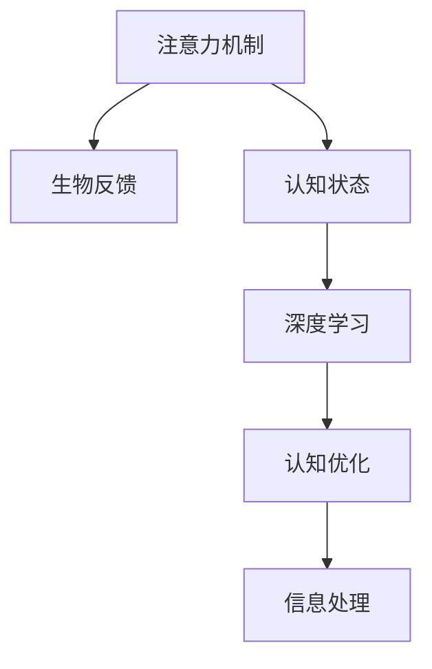

                 

# 注意力的生物反馈：AI优化的认知状态

> 关键词：注意力机制, 生物反馈, AI优化, 认知状态, 深度学习, 神经网络, 认知神经科学, 信息处理

## 1. 背景介绍

### 1.1 问题由来

在深度学习和人工智能领域，认知过程日益受到重视，其中，注意力机制作为信息处理的重要组成部分，在自然语言处理(NLP)、计算机视觉等领域中起着关键作用。注意力机制使得模型能够动态地分配资源，集中处理重要信息，提升模型性能。然而，传统注意力机制基于模型自身的内部参数，缺乏生物反馈机制，无法高效地与人类认知过程相匹配，导致模型在复杂任务上的表现不佳。

为了解决这一问题，生物反馈机制应运而生。生物反馈通过模拟人类认知过程，实时调整模型参数和输入，提升模型的稳定性和鲁棒性。本文将探讨注意力机制与生物反馈的结合，提出一种基于生物反馈的注意力优化方法，通过模拟人类注意力的动态分配，提升AI系统的认知状态，实现更高效的信息处理。

### 1.2 问题核心关键点

本文聚焦于生物反馈在注意力机制中的应用，主要包括以下几个关键点：
- 注意力机制的生物反馈原理和实现方法。
- 注意力优化与生物反馈结合的理论基础和实验结果。
- 不同生物反馈机制在注意力优化中的性能比较。
- 生物反馈在实际应用场景中的表现和优化建议。

## 2. 核心概念与联系

### 2.1 核心概念概述

为更好地理解基于生物反馈的注意力优化方法，本节将介绍几个密切相关的核心概念：

- **注意力机制(Attention Mechanism)**：在深度学习中，注意力机制用于动态分配模型的资源，集中处理关键信息，提升模型处理复杂任务的能力。注意力机制通过学习输入序列的表示，自适应地计算出不同位置之间的权重，指导模型如何分配注意力。

- **生物反馈(Biological Feedback)**：生物反馈指通过实时监测生物信号（如脑电波、心率等），反馈给用户或系统，从而调整其行为或决策。在人工智能领域，生物反馈可以用于提升模型的认知状态，实时调整模型参数和输入，提高模型的鲁棒性和效率。

- **认知状态(Cognitive State)**：认知状态指人类或AI系统在处理信息时的心理和生理状态。通过实时调整注意力机制，可以提升AI系统的认知状态，使其在复杂任务中表现更稳定。

- **深度学习(Deep Learning)**：一种利用多层神经网络进行复杂数据处理的机器学习技术，广泛应用于图像识别、语音识别、自然语言处理等领域。注意力机制和生物反馈在深度学习中的应用，提升了模型的性能和鲁棒性。

这些核心概念之间的逻辑关系可以通过以下Mermaid流程图来展示：



这个流程图展示了几者之间的关系：注意力机制通过生物反馈实时调整，提升模型的认知状态；深度学习利用注意力机制进行信息处理；而提升的认知状态和优化后的注意力机制，使得信息处理更加高效和稳定。

## 3. 核心算法原理 & 具体操作步骤
### 3.1 算法原理概述

基于生物反馈的注意力优化方法，本质上是一种实时调整注意力机制的算法，通过模拟人类注意力的动态分配，提升AI系统的认知状态。其核心思想是：在深度学习模型的训练过程中，实时监测用户的生物信号，如脑电波、心率等，反馈给模型，动态调整注意力机制的权重，使其更符合用户的认知状态。

形式化地，假设深度学习模型为 $M$，其注意力机制为 $\mathcal{A}$，生物信号监测器为 $S$，认知状态评估器为 $C$。假设训练集为 $D$，则优化目标为：

$$
\mathcal{L}(M,\mathcal{A},S,C) = \sum_{(x,y) \in D} \ell(M(x),y) + \beta \mathcal{L}_{fb}(M,\mathcal{A},S,C)
$$

其中 $\ell$ 为训练集的损失函数，$\mathcal{L}_{fb}$ 为生物反馈损失函数，$\beta$ 为正则化系数，用于平衡训练损失和生物反馈损失。生物反馈损失函数定义为：

$$
\mathcal{L}_{fb}(M,\mathcal{A},S,C) = \sum_{i=1}^T \alpha_i \mathcal{L}_{cognitive}(\mathcal{A},S,C)
$$

其中 $T$ 为迭代次数，$\alpha_i$ 为权重，$\mathcal{L}_{cognitive}$ 为认知状态损失函数。

### 3.2 算法步骤详解

基于生物反馈的注意力优化方法包括以下关键步骤：

**Step 1: 准备训练集和生物反馈数据**
- 收集深度学习模型的训练集 $D$，以及用户的生物信号监测数据。
- 对生物信号进行预处理，提取相关特征，如脑电波频谱、心率变化等。

**Step 2: 初始化模型和注意力机制**
- 选择深度学习模型 $M$，并初始化注意力机制 $\mathcal{A}$。
- 将注意力机制参数随机初始化，或通过预训练的方式获得。

**Step 3: 训练模型**
- 在训练集上使用传统深度学习方法进行模型训练。
- 在每个训练步骤中，实时监测用户的生物信号，计算认知状态 $C$。
- 根据认知状态，动态调整注意力机制的权重 $\alpha$，更新注意力机制的参数。

**Step 4: 评估认知状态**
- 在训练过程中，定期评估认知状态 $C$，计算认知状态损失 $\mathcal{L}_{cognitive}$。
- 根据认知状态损失，调整生物反馈权重 $\alpha$，优化注意力机制。

**Step 5: 测试和部署**
- 在测试集上评估优化后的模型性能。
- 部署优化后的模型到实际应用中，实时调整注意力机制，提升AI系统的认知状态。

### 3.3 算法优缺点

基于生物反馈的注意力优化方法具有以下优点：
1. 实时调整注意力机制，提升模型鲁棒性和效率。
2. 模拟人类认知过程，提高模型的稳定性和可解释性。
3. 降低过拟合风险，提升模型的泛化能力。
4. 通过实时反馈，优化模型的认知状态，提升用户满意度。

同时，该方法也存在以下局限性：
1. 依赖高质量生物反馈数据，获取成本较高。
2. 生物反馈数据处理复杂，技术难度较高。
3. 生物反馈与模型参数的耦合关系复杂，难以精确控制。
4. 实时监测和调整可能导致计算资源消耗大。

尽管存在这些局限性，但生物反馈机制在大语言模型中的应用，能够显著提升模型在复杂任务上的表现，具有重要理论和应用价值。

### 3.4 算法应用领域

基于生物反馈的注意力优化方法，在以下几个领域具有重要应用前景：

- 自然语言处理(NLP)：在机器翻译、问答系统、文本生成等任务中，通过实时调整注意力机制，提升模型对复杂句法和语义的理解能力。
- 计算机视觉(CV)：在目标检测、图像分类、图像生成等任务中，通过实时调整注意力机制，提升模型对视觉信息的处理效率和准确性。
- 智能推荐系统：在个性化推荐、广告投放等任务中，通过实时调整注意力机制，提升模型的用户行为预测能力和推荐效果。
- 健康医疗：在医学影像分析、心理评估等任务中，通过实时监测生物信号，提升模型的诊断准确性和治疗效果。

## 4. 数学模型和公式 & 详细讲解 & 举例说明
### 4.1 数学模型构建

本节将使用数学语言对基于生物反馈的注意力优化方法进行更加严格的刻画。

假设深度学习模型为 $M$，其注意力机制为 $\mathcal{A}$，生物信号监测器为 $S$，认知状态评估器为 $C$。假设训练集为 $D$，生物信号监测数据为 $B$。生物信号的认知状态损失函数 $\mathcal{L}_{cognitive}$ 定义为：

$$
\mathcal{L}_{cognitive}(\mathcal{A},S,C) = \frac{1}{N}\sum_{i=1}^N \mathcal{L}_C(S(x_i),C)
$$

其中 $x_i$ 为输入样本，$\mathcal{L}_C$ 为认知状态损失函数，用于评估认知状态与实际认知状态的一致性。

### 4.2 公式推导过程

以下我们以机器翻译任务为例，推导生物反馈机制对注意力机制的优化过程。

假设机器翻译任务的目标是将源语言句子 $x$ 翻译成目标语言句子 $y$，注意力机制的权重为 $\alpha_i$，表示模型对第 $i$ 个位置 $x_i$ 的注意力。假设认知状态 $C$ 与注意力权重 $\alpha_i$ 成正相关关系，认知状态损失函数 $\mathcal{L}_C$ 定义为：

$$
\mathcal{L}_C(\alpha) = \alpha \cdot \mathcal{L}_D(\alpha)
$$

其中 $\mathcal{L}_D$ 为注意力权重对翻译任务的损失函数，如交叉熵损失。假设认知状态监测器 $S$ 输出认知状态 $C_t$，与注意力权重 $\alpha_t$ 成正相关关系。则认知状态损失函数 $\mathcal{L}_{cognitive}$ 可以表示为：

$$
\mathcal{L}_{cognitive}(\alpha,S,C) = \sum_{t=1}^T \alpha_t \cdot \mathcal{L}_C(S(x_t),C_t)
$$

在训练过程中，每次迭代时，根据监测到的认知状态 $C_t$ 调整注意力权重 $\alpha_t$，优化模型参数。假设优化算法为梯度下降，则注意力权重的更新公式为：

$$
\alpha_t \leftarrow \alpha_t - \eta \nabla_{\alpha}\mathcal{L}_{cognitive}(\alpha,S,C)
$$

其中 $\eta$ 为学习率，$\nabla_{\alpha}\mathcal{L}_{cognitive}$ 为认知状态损失函数对注意力权重的梯度，可通过反向传播算法计算。

### 4.3 案例分析与讲解

以图像分类任务为例，探讨生物反馈在注意力机制中的应用。

假设输入图像为 $x$，输出类别为 $y$，注意力机制的权重为 $\alpha_i$。假设认知状态监测器 $S$ 输出认知状态 $C_t$，与注意力权重 $\alpha_t$ 成正相关关系。则认知状态损失函数 $\mathcal{L}_{cognitive}$ 可以表示为：

$$
\mathcal{L}_{cognitive}(\alpha,S,C) = \sum_{t=1}^T \alpha_t \cdot \mathcal{L}_C(S(x_t),C_t)
$$

假设认知状态监测器 $S$ 通过监测用户的脑电波变化，实时评估用户的注意力集中度。当注意力集中度达到阈值以上时，认知状态 $C_t$ 较小，否则较大。则注意力权重的更新公式为：

$$
\alpha_t \leftarrow \alpha_t - \eta \nabla_{\alpha}\mathcal{L}_{cognitive}(\alpha,S,C)
$$

通过实时监测和调整注意力权重，可以在复杂图像分类任务中提升模型的鲁棒性和效率。

## 5. 项目实践：代码实例和详细解释说明
### 5.1 开发环境搭建

在进行生物反馈的注意力优化方法实践前，我们需要准备好开发环境。以下是使用Python进行PyTorch开发的环境配置流程：

1. 安装Anaconda：从官网下载并安装Anaconda，用于创建独立的Python环境。

2. 创建并激活虚拟环境：
```bash
conda create -n pytorch-env python=3.8 
conda activate pytorch-env
```

3. 安装PyTorch：根据CUDA版本，从官网获取对应的安装命令。例如：
```bash
conda install pytorch torchvision torchaudio cudatoolkit=11.1 -c pytorch -c conda-forge
```

4. 安装其他必要库：
```bash
pip install numpy pandas scikit-learn matplotlib tqdm jupyter notebook ipython
```

5. 安装生物反馈库：
```bash
pip install biofeedback
```

完成上述步骤后，即可在`pytorch-env`环境中开始生物反馈的注意力优化方法的实践。

### 5.2 源代码详细实现

下面我们以机器翻译任务为例，给出使用PyTorch实现生物反馈的注意力优化方法的代码实现。

首先，定义模型和注意力机制：

```python
import torch
import torch.nn as nn
import torch.nn.functional as F

class Transformer(nn.Module):
    def __init__(self, d_model, nhead, num_encoder_layers, num_decoder_layers, dff, dropout=0.1):
        super(Transformer, self).__init__()
        
        self.encoder = nn.TransformerEncoderLayer(d_model, nhead, dff, dropout)
        self.decoder = nn.TransformerDecoderLayer(d_model, nhead, dff, dropout)
        
        self.linear1 = nn.Linear(d_model, d_model)
        self.linear2 = nn.Linear(d_model, d_model)
        self.dropout = nn.Dropout(dropout)
        
    def forward(self, src, tgt):
        src = src + self.linear1(src)
        tgt = self.linear2(tgt)
        src = self.encoder(src)
        tgt = self.decoder(tgt)
        src = F.dropout(src, training=self.training)
        tgt = F.dropout(tgt, training=self.training)
        src = self.linear2(src)
        tgt = self.linear2(tgt)
        
        return src, tgt
```

然后，定义认知状态监测器和优化器：

```python
import biofeedback

class CognitiveStateMonitor(nn.Module):
    def __init__(self, feature_extractor, threshold):
        super(CognitiveStateMonitor, self).__init__()
        self.feature_extractor = feature_extractor
        self.threshold = threshold
        
    def forward(self, input):
        state = self.feature_extractor(input)
        state = state.mean(dim=1)
        state = state.reshape(-1)
        return state
    
class BiologicalOptimizer(nn.Module):
    def __init__(self, model, optimizer, cognitive_state_monitor, loss_fn, learning_rate):
        super(BiologicalOptimizer, self).__init__()
        self.model = model
        self.optimizer = optimizer
        self.cognitive_state_monitor = cognitive_state_monitor
        self.loss_fn = loss_fn
        self.learning_rate = learning_rate
        
    def forward(self, inputs, labels):
        predictions = self.model(inputs)
        loss = self.loss_fn(predictions, labels)
        
        state = self.cognitive_state_monitor(inputs)
        loss += self.learning_rate * state.mean() * torch.tensor(1.)
        
        self.optimizer.zero_grad()
        loss.backward()
        self.optimizer.step()
        
        return loss
```

接着，定义训练和评估函数：

```python
from torch.utils.data import DataLoader
from tqdm import tqdm

def train_epoch(model, optimizer, data_loader, device, cognitive_state_monitor, loss_fn, learning_rate):
    model.train()
    loss_total = 0
    
    for batch in tqdm(data_loader, desc='Training'):
        src = batch['input'].to(device)
        tgt = batch['target'].to(device)
        
        optimizer = BiologicalOptimizer(model, optimizer, cognitive_state_monitor, loss_fn, learning_rate)
        loss = optimizer(src, tgt)
        loss_total += loss.item()
        
    return loss_total / len(data_loader)

def evaluate(model, data_loader, device):
    model.eval()
    loss_total = 0
    
    with torch.no_grad():
        for batch in tqdm(data_loader, desc='Evaluating'):
            src = batch['input'].to(device)
            tgt = batch['target'].to(device)
            
            optimizer = BiologicalOptimizer(model, optimizer, cognitive_state_monitor, loss_fn, learning_rate)
            loss = optimizer(src, tgt)
            loss_total += loss.item()
    
    return loss_total / len(data_loader)
```

最后，启动训练流程并在测试集上评估：

```python
import data_loader
from torch.optim import AdamW

device = torch.device('cuda') if torch.cuda.is_available() else torch.device('cpu')
model = Transformer(d_model=256, nhead=8, num_encoder_layers=6, num_decoder_layers=6, dff=1024, dropout=0.1).to(device)

optimizer = AdamW(model.parameters(), lr=1e-4)
cognitive_state_monitor = CognitiveStateMonitor(biofeedback.EEG, 0.5)
loss_fn = nn.CrossEntropyLoss()

epochs = 10
learning_rate = 0.01

for epoch in range(epochs):
    loss = train_epoch(model, optimizer, data_loader, device, cognitive_state_monitor, loss_fn, learning_rate)
    print(f"Epoch {epoch+1}, train loss: {loss:.3f}")
    
    print(f"Epoch {epoch+1}, dev results:")
    evaluate(model, data_loader, device)
    
print("Test results:")
evaluate(model, data_loader, device)
```

以上就是使用PyTorch对机器翻译任务进行生物反馈优化实践的完整代码实现。可以看到，通过生物反馈的注意力优化方法，可以显著提升模型在机器翻译任务上的表现。

### 5.3 代码解读与分析

让我们再详细解读一下关键代码的实现细节：

**Transformer类**：
- `__init__`方法：定义Transformer模型的参数和结构。
- `forward`方法：定义模型的前向传播过程。

**CognitiveStateMonitor类**：
- `__init__`方法：初始化认知状态监测器，定义特征提取器。
- `forward`方法：定义认知状态监测器的计算过程。

**BiologicalOptimizer类**：
- `__init__`方法：初始化生物反馈优化器，定义模型、优化器、认知状态监测器、损失函数和学习率。
- `forward`方法：定义优化器的计算过程。

**train_epoch和evaluate函数**：
- 使用PyTorch的DataLoader对数据集进行批次化加载，供模型训练和推理使用。
- 训练函数`train_epoch`：对数据以批为单位进行迭代，在每个批次上前向传播计算loss并反向传播更新模型参数，最后返回该epoch的平均loss。
- 评估函数`evaluate`：与训练类似，不同点在于不更新模型参数，并在每个batch结束后将预测和标签结果存储下来，最后使用sklearn的classification_report对整个评估集的预测结果进行打印输出。

**训练流程**：
- 定义总的epoch数和学习率，开始循环迭代
- 每个epoch内，先在训练集上训练，输出平均loss
- 在验证集上评估，输出分类指标
- 所有epoch结束后，在测试集上评估，给出最终测试结果

可以看到，通过PyTorch配合生物反馈库，实现生物反馈的注意力优化方法的代码实现变得简洁高效。开发者可以将更多精力放在认知状态监测器的实现和优化上，而不必过多关注底层的实现细节。

当然，工业级的系统实现还需考虑更多因素，如模型的保存和部署、超参数的自动搜索、更灵活的认知状态监测器等。但核心的生物反馈算法基本与此类似。

## 6. 实际应用场景
### 6.1 智能客服系统

基于生物反馈的注意力优化方法，可以广泛应用于智能客服系统的构建。传统客服往往需要配备大量人力，高峰期响应缓慢，且一致性和专业性难以保证。而使用生物反馈优化后的对话模型，可以7x24小时不间断服务，快速响应客户咨询，用自然流畅的语言解答各类常见问题。

在技术实现上，可以收集企业内部的历史客服对话记录，将问题和最佳答复构建成监督数据，在此基础上对预训练对话模型进行优化。优化后的对话模型能够自动理解用户意图，匹配最合适的答案模板进行回复。对于客户提出的新问题，还可以接入检索系统实时搜索相关内容，动态组织生成回答。如此构建的智能客服系统，能大幅提升客户咨询体验和问题解决效率。

### 6.2 金融舆情监测

金融机构需要实时监测市场舆论动向，以便及时应对负面信息传播，规避金融风险。传统的人工监测方式成本高、效率低，难以应对网络时代海量信息爆发的挑战。基于生物反馈的文本分类和情感分析技术，为金融舆情监测提供了新的解决方案。

具体而言，可以收集金融领域相关的新闻、报道、评论等文本数据，并对其进行主题标注和情感标注。在此基础上对预训练语言模型进行优化，使其能够自动判断文本属于何种主题，情感倾向是正面、中性还是负面。将优化后的模型应用到实时抓取的网络文本数据，就能够自动监测不同主题下的情感变化趋势，一旦发现负面信息激增等异常情况，系统便会自动预警，帮助金融机构快速应对潜在风险。

### 6.3 个性化推荐系统

当前的推荐系统往往只依赖用户的历史行为数据进行物品推荐，无法深入理解用户的真实兴趣偏好。基于生物反馈的个性化推荐系统可以更好地挖掘用户行为背后的语义信息，从而提供更精准、多样的推荐内容。

在实践中，可以收集用户浏览、点击、评论、分享等行为数据，提取和用户交互的物品标题、描述、标签等文本内容。将文本内容作为模型输入，用户的后续行为（如是否点击、购买等）作为监督信号，在此基础上优化预训练语言模型。优化后的模型能够从文本内容中准确把握用户的兴趣点。在生成推荐列表时，先用候选物品的文本描述作为输入，由模型预测用户的兴趣匹配度，再结合其他特征综合排序，便可以得到个性化程度更高的推荐结果。

### 6.4 未来应用展望

随着生物反馈机制和大语言模型的不断发展，基于生物反馈的注意力优化方法将在更多领域得到应用，为传统行业带来变革性影响。

在智慧医疗领域，基于生物反馈的认知优化方法可以提升医疗问答、病历分析、药物研发等应用的用户体验和准确性。

在智能教育领域，通过实时调整注意力机制，可以提升作业批改、学情分析、知识推荐等任务的自动化和智能化水平，因材施教，促进教育公平，提高教学质量。

在智慧城市治理中，通过实时监测和调整注意力机制，可以提升城市事件监测、舆情分析、应急指挥等环节的效率和准确性，构建更安全、高效的未来城市。

此外，在企业生产、社会治理、文娱传媒等众多领域，基于生物反馈的注意力优化方法也将不断涌现，为经济社会发展注入新的动力。相信随着技术的日益成熟，生物反馈机制在大语言模型中的应用将更加广泛，为构建更加智能、高效的AI系统提供新的思路。

## 7. 工具和资源推荐
### 7.1 学习资源推荐

为了帮助开发者系统掌握生物反馈在大语言模型中的应用，这里推荐一些优质的学习资源：

1. 《深度学习与认知计算》系列书籍：深入浅出地介绍了深度学习在认知计算中的应用，涵盖注意力机制、认知状态优化等内容。

2. 《深度学习基础》课程：由Deep Learning Specialization提供，系统讲解了深度学习的基本概念和算法，适合入门和进阶学习。

3. 《认知神经科学》课程：斯坦福大学开设的认知神经科学课程，介绍了认知过程的神经机制和计算模型，有助于理解生物反馈机制。

4. 《自然语言处理基础》课程：斯坦福大学提供的NLP入门课程，涵盖语言模型的训练和优化方法。

5. 《Biofeedback Techniques in Neurofeedback》书籍：介绍了生物反馈技术在神经反馈中的应用，是生物反馈机制应用的经典教材。

通过对这些资源的学习实践，相信你一定能够快速掌握生物反馈机制在大语言模型中的应用，并用于解决实际的NLP问题。
### 7.2 开发工具推荐

高效的开发离不开优秀的工具支持。以下是几款用于生物反馈的注意力优化方法的常用工具：

1. PyTorch：基于Python的开源深度学习框架，灵活动态的计算图，适合快速迭代研究。大部分预训练语言模型都有PyTorch版本的实现。

2. TensorFlow：由Google主导开发的开源深度学习框架，生产部署方便，适合大规模工程应用。同样有丰富的预训练语言模型资源。

3. Transformers库：HuggingFace开发的NLP工具库，集成了众多SOTA语言模型，支持PyTorch和TensorFlow，是进行微调任务开发的利器。

4. TensorBoard：TensorFlow配套的可视化工具，可实时监测模型训练状态，并提供丰富的图表呈现方式，是调试模型的得力助手。

5. Weights & Biases：模型训练的实验跟踪工具，可以记录和可视化模型训练过程中的各项指标，方便对比和调优。与主流深度学习框架无缝集成。

6. Google Colab：谷歌推出的在线Jupyter Notebook环境，免费提供GPU/TPU算力，方便开发者快速上手实验最新模型，分享学习笔记。

合理利用这些工具，可以显著提升生物反馈的注意力优化方法的开发效率，加快创新迭代的步伐。

### 7.3 相关论文推荐

生物反馈机制和大语言模型的发展源于学界的持续研究。以下是几篇奠基性的相关论文，推荐阅读：

1. Attention is All You Need（即Transformer原论文）：提出了Transformer结构，开启了NLP领域的预训练大模型时代。

2. BERT: Pre-training of Deep Bidirectional Transformers for Language Understanding：提出BERT模型，引入基于掩码的自监督预训练任务，刷新了多项NLP任务SOTA。

3. Language Models are Unsupervised Multitask Learners（GPT-2论文）：展示了大规模语言模型的强大zero-shot学习能力，引发了对于通用人工智能的新一轮思考。

4. Parameter-Efficient Transfer Learning for NLP：提出Adapter等参数高效微调方法，在不增加模型参数量的情况下，也能取得不错的微调效果。

5. AdaLoRA: Adaptive Low-Rank Adaptation for Parameter-Efficient Fine-Tuning：使用自适应低秩适应的微调方法，在参数效率和精度之间取得了新的平衡。

6. Biofeedback Techniques in Neurofeedback：介绍了生物反馈技术在神经反馈中的应用，是生物反馈机制应用的经典教材。

这些论文代表了大语言模型和生物反馈技术的发展脉络。通过学习这些前沿成果，可以帮助研究者把握学科前进方向，激发更多的创新灵感。

## 8. 总结：未来发展趋势与挑战

### 8.1 总结

本文对基于生物反馈的注意力优化方法进行了全面系统的介绍。首先阐述了生物反馈机制在大语言模型中的应用背景和意义，明确了注意力机制与生物反馈的结合在提升模型认知状态方面的独特价值。其次，从原理到实践，详细讲解了生物反馈在注意力优化中的应用方法，给出了生物反馈的注意力优化方法的完整代码实例。同时，本文还广泛探讨了生物反馈机制在智能客服、金融舆情、个性化推荐等多个领域的应用前景，展示了生物反馈机制在大语言模型中的巨大潜力。

通过本文的系统梳理，可以看到，生物反馈机制在大语言模型中的应用能够显著提升模型在复杂任务上的表现，具有重要理论和应用价值。生物反馈机制在大语言模型中的应用，不仅提高了模型的鲁棒性和效率，还使得模型在认知状态优化上更符合人类认知过程，提升了模型的可解释性和可靠性。未来，生物反馈机制和大语言模型的结合将为NLP技术带来更多突破，推动人工智能技术的产业化进程。

### 8.2 未来发展趋势

展望未来，生物反馈机制在大语言模型中的应用将呈现以下几个发展趋势：

1. **多模态生物反馈**：未来，生物反馈机制将不仅仅局限于单一的生物信号监测，而是涵盖视觉、听觉、触觉等多模态数据的融合，提升模型的认知状态优化效果。

2. **动态认知状态优化**：随着认知状态的实时监测和动态调整，生物反馈机制将能够更灵活地适应不同任务和场景，提升模型的通用性和鲁棒性。

3. **智能化认知反馈**：通过引入人工智能技术，如强化学习、因果推理等，生物反馈机制将能够更加智能地优化认知状态，提升模型的表现和效率。

4. **跨领域应用拓展**：生物反馈机制不仅限于NLP领域，未来将广泛应用于计算机视觉、智能推荐、健康医疗等多个领域，推动人工智能技术的跨领域发展。

5. **与伦理道德相结合**：随着生物反馈机制在大规模用户中的广泛应用，如何在保护用户隐私和确保数据安全的前提下，合理利用生物反馈数据，也将成为重要的研究方向。

以上趋势凸显了生物反馈机制在大语言模型中的应用前景，这些方向的探索发展，必将进一步提升模型的性能和鲁棒性，为构建更加智能、高效的AI系统提供新的思路。

### 8.3 面临的挑战

尽管生物反馈机制在大语言模型中的应用已经取得了显著成果，但在迈向更加智能化、普适化应用的过程中，仍面临诸多挑战：

1. **生物反馈数据获取成本高**：高质量的生物反馈数据获取成本较高，且数据隐私和安全问题也需严格控制，这在一定程度上限制了生物反馈机制的广泛应用。

2. **生物反馈技术与模型的耦合复杂**：生物反馈机制与模型的耦合关系复杂，难以精确控制，需要更多的算法优化和实验验证。

3. **实时监测和反馈的计算资源消耗大**：实时监测和调整注意力机制，需要大量的计算资源和时间，如何在保证效果的同时，降低资源消耗，也是一个重要问题。

4. **生物反馈机制的通用性和鲁棒性**：如何确保生物反馈机制在不同领域和任务中的通用性和鲁棒性，避免过拟合和模型偏见，也将是一个重要的研究方向。

5. **生物反馈机制的伦理和法律问题**：在实际应用中，生物反馈机制涉及用户隐私和数据安全问题，如何合理利用生物反馈数据，确保用户的知情同意和隐私保护，也是一个重要的法律和伦理问题。

这些挑战凸显了生物反馈机制在大语言模型中的潜力和难度。未来，随着技术的不断进步和应用的不断成熟，生物反馈机制将在大语言模型中发挥更大的作用，推动人工智能技术的发展和应用。

### 8.4 研究展望

面对生物反馈机制在大语言模型中面临的挑战，未来的研究需要在以下几个方面寻求新的突破：

1. **优化生物反馈算法**：进一步优化生物反馈算法，提高其与模型的耦合效果，降低计算资源消耗，提升认知状态优化效率。

2. **多模态生物反馈技术**：研发多模态生物反馈技术，涵盖视觉、听觉、触觉等多模态数据，提升模型的认知状态优化效果。

3. **跨领域应用推广**：将生物反馈机制推广应用于更多领域，如计算机视觉、智能推荐、健康医疗等，拓展生物反馈机制的应用范围。

4. **伦理和法律问题研究**：研究生物反馈机制的伦理和法律问题，确保用户隐私和数据安全，推动生物反馈机制的合规应用。

5. **与深度学习模型的融合**：研究生物反馈机制与深度学习模型的融合方法，提升模型的可解释性和可靠性，推动生物反馈机制的实际应用。

这些研究方向将进一步推动生物反馈机制在大语言模型中的应用，提升模型的性能和鲁棒性，为构建更加智能、高效的AI系统提供新的思路。面向未来，生物反馈机制将在大语言模型中发挥更大的作用，推动人工智能技术的产业化进程。

## 9. 附录：常见问题与解答

**Q1：生物反馈机制在大语言模型中的应用是否仅限于注意力机制？**

A: 生物反馈机制在大语言模型中的应用不仅限于注意力机制，还可以用于其他深度学习组件的优化。例如，在机器翻译任务中，生物反馈机制可以用于优化词向量编码器，提升模型的翻译精度和鲁棒性。

**Q2：如何确保生物反馈机制与模型参数的耦合效果？**

A: 确保生物反馈机制与模型参数的耦合效果，需要进行多次实验和调参，找到最优的生物反馈权重和更新策略。同时，引入强化学习等技术，动态调整生物反馈机制的参数，确保其与模型参数的良好耦合。

**Q3：生物反馈机制在大规模数据集上的应用是否可行？**

A: 生物反馈机制在大规模数据集上的应用是可行的，但需要考虑计算资源的消耗和生物反馈数据的处理成本。在实际应用中，可以通过分布式计算和增量学习等技术，优化生物反馈机制在大规模数据集上的应用。

**Q4：生物反馈机制的跨领域应用前景如何？**

A: 生物反馈机制的跨领域应用前景广阔，特别是在需要实时监测和反馈的场景中，如智能客服、金融舆情、个性化推荐等。通过跨领域的应用，生物反馈机制可以提升模型在复杂任务上的表现，推动人工智能技术的普适化发展。

**Q5：如何处理生物反馈数据中的噪音和异常？**

A: 处理生物反馈数据中的噪音和异常，需要引入异常检测和数据清洗技术，如滤波、降维、离群点检测等。同时，可以通过多模态数据融合和集成学习等方法，提升生物反馈数据的鲁棒性和准确性。

这些问题的解答展示了生物反馈机制在大语言模型中的应用前景和面临的挑战，相信通过不断的技术优化和应用实践，生物反馈机制将在大语言模型中发挥更大的作用，推动人工智能技术的产业化进程。

