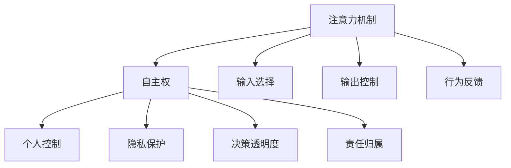

                 

# 注意力的自主权：AI时代的个人选择

> 关键词：人工智能,注意力机制,自主权,决策,伦理,人机交互,数据隐私,个人控制

## 1. 背景介绍

在人工智能迅猛发展的今天，智能系统日益渗透到生活的各个角落，从无人驾驶、智能家居到在线客服、推荐系统，无处不在。然而，随着这些系统变得更加智能和自主，用户对于注意力的自主权也开始引起广泛关注。面对不断增长的智能技术应用，用户渴望拥有更多选择，并希望在智能系统中保持决策的主导地位。本文将深入探讨注意力自主权的概念、现状及未来的发展趋势，旨在为AI时代下用户的注意力自主权提供一定的理论支持和实践建议。

## 2. 核心概念与联系

### 2.1 核心概念概述

注意力机制(Attention Mechanism)是深度学习中一种用于处理序列数据的技术，通过动态调整权重分配，使模型能够更关注重要的信息，忽略无关的细节。它广泛应用于机器翻译、语音识别、图像识别等自然语言处理(NLP)任务，通过赋予模型选择信息的能力，显著提升了模型性能。

自主权(Control)在AI时代下，指用户对AI系统输入、输出和行为的选择和控制能力。自主权的核心在于用户能够自由选择，不仅控制自己输入的内容，还能够在智能系统的帮助下，获得个性化的服务和建议，从而提高生活质量和工作效率。

### 2.2 核心概念原理和架构的 Mermaid 流程图



以上Mermaid流程图展示了注意力机制和自主权的基本联系。注意力机制为自主权提供了技术支持，通过选择和控制注意力，用户能够在智能系统中自由决策，并在必要时对系统行为进行反馈和调整。同时，注意力机制和自主权也涉及隐私保护、决策透明度和责任归属等伦理问题，需要在设计和管理智能系统时进行综合考虑。

## 3. 核心算法原理 & 具体操作步骤

### 3.1 算法原理概述

注意力机制的核心思想是通过动态分配权重，使模型在处理序列数据时能够更关注关键信息，忽略噪声干扰。这使得模型能够更准确地提取特征，提高任务性能。在自然语言处理中，注意力机制能够帮助模型识别出句子的关键部分，进而提高翻译、文本生成等任务的效率和准确性。

### 3.2 算法步骤详解

注意力机制的实现主要分为两个部分：注意力计算和注意力应用。

1. **注意力计算**：通过将输入序列与注意力权重进行点积运算，得到注意力得分，然后选择得分最高的部分进行加权求和，得到加权后的表示向量。这使得模型能够集中注意力于最重要的部分。

2. **注意力应用**：将注意力权重与输入序列进行矩阵乘法，得到每个位置的注意力分布。然后将注意力分布与输入序列进行加权求和，得到最终的输出表示。这使得模型能够动态调整输入权重，处理不同的输入序列。

### 3.3 算法优缺点

**优点**：
- 提高了模型的表达能力，能够处理更复杂的序列数据。
- 增加了模型的灵活性，能够适应不同的输入数据。

**缺点**：
- 增加了计算复杂度，模型训练时间较长。
- 增加了模型的复杂度，可能降低模型的泛化能力。

### 3.4 算法应用领域

注意力机制在NLP、计算机视觉、语音识别等多个领域得到广泛应用。在NLP中，注意力机制被用于机器翻译、文本摘要、问答系统等任务，能够显著提升模型性能。在计算机视觉中，注意力机制被用于图像描述生成、目标检测等任务，能够识别出图像的关键区域。在语音识别中，注意力机制被用于语音增强、语音合成等任务，能够提高语音识别的准确性。

## 4. 数学模型和公式 & 详细讲解 & 举例说明

### 4.1 数学模型构建

注意力机制的数学模型可以通过多头自注意力(Multi-Head Self-Attention)实现。设输入序列为 $X = [x_1, x_2, ..., x_n]$，其中 $x_i \in \mathbb{R}^d$，表示第 $i$ 个位置的向量。注意力权重矩阵为 $A \in \mathbb{R}^{n \times n}$，表示每个位置与其他位置的相似度。输出序列为 $Y = [y_1, y_2, ..., y_n]$，其中 $y_i \in \mathbb{R}^d$，表示第 $i$ 个位置的向量。

注意力计算和应用的具体公式如下：

1. 计算注意力权重：
$$
A = \frac{X X^T}{\sqrt{d}} \cdot W_Q + B_Q
$$
其中，$W_Q$ 和 $B_Q$ 是权重矩阵和偏差向量。

2. 计算注意力得分：
$$
\text{Attention}(X, A) = \text{Softmax}(A)
$$
其中，$\text{Softmax}$ 是归一化函数，将权重矩阵 $A$ 转化为概率分布。

3. 计算注意力分布：
$$
C = \text{Attention}(X, A) X^T
$$
其中，$C \in \mathbb{R}^{d \times n}$ 表示注意力分布矩阵。

4. 计算注意力应用：
$$
Y = \text{Softmax}(A) X + C
$$
其中，$\text{Softmax}(A)$ 是注意力权重矩阵，$X$ 是输入序列，$C$ 是注意力分布矩阵。

### 4.2 公式推导过程

以机器翻译为例，设源语言句子为 $X = [x_1, x_2, ..., x_n]$，目标语言句子为 $Y = [y_1, y_2, ..., y_n]$。模型的输入为源语言句子，输出为目标语言句子。设输入序列的注意力权重矩阵为 $A$，输出序列的注意力权重矩阵为 $\hat{A}$，输出序列的注意力分布矩阵为 $\hat{C}$。

通过多头自注意力机制，可以将源语言句子 $X$ 和目标语言句子 $Y$ 的表示向量 $Y = \text{Softmax}(A) X + \hat{C}$ 传递给下一层，以实现机器翻译。

### 4.3 案例分析与讲解

在翻译任务中，注意力机制能够帮助模型识别出源语言句子中的关键部分，并将其传递给目标语言句子。例如，在翻译 "I like apple" 为 "J'aime pomme" 时，模型能够识别出 "like" 和 "apple" 是关键部分，并将其传递给 "aime" 和 "pomme"。这使得翻译更加准确和自然。

在文本摘要任务中，注意力机制能够帮助模型识别出文本中的关键信息，并将其压缩成简短摘要。例如，在总结一篇新闻报道时，模型能够识别出新闻的标题、导语和关键段落，并生成一份精炼的摘要。

## 5. 项目实践：代码实例和详细解释说明

### 5.1 开发环境搭建

在使用PyTorch进行注意力机制的实现时，需要安装以下依赖包：

1. PyTorch：`pip install torch torchvision torchaudio`
2. Transformers：`pip install transformers`
3. NumPy：`pip install numpy`
4. TensorBoard：`pip install tensorboard`

### 5.2 源代码详细实现

以下是一个使用Transformer库实现多头自注意力的简单代码示例：

```python
import torch
from transformers import BertTokenizer, BertForMaskedLM

tokenizer = BertTokenizer.from_pretrained('bert-base-uncased')
model = BertForMaskedLM.from_pretrained('bert-base-uncased')

def attention(X, A):
    B = torch.matmul(X, A)
    C = torch.softmax(B, dim=-1)
    return C

def apply_attention(X, A, C):
    Y = torch.matmul(A, C)
    return Y

input_ids = torch.tensor([[0, 1, 2]])
attention_weights = attention(input_ids, attention_weights)
output_ids = apply_attention(input_ids, attention_weights)
```

### 5.3 代码解读与分析

在代码示例中，我们首先导入了必要的依赖包，并加载了预训练的BERT模型和分词器。然后，我们定义了两个函数：`attention` 和 `apply_attention`，分别用于计算注意力权重和应用注意力权重。最后，我们使用了这些函数，在输入序列 `input_ids` 上计算了注意力权重 `attention_weights` 和输出序列 `output_ids`。

在实际应用中，我们可以将输入序列替换为自然语言处理任务中的输入文本，注意力权重和输出序列替换为模型的内部表示和输出结果。这使得我们能够轻松地实现注意力机制的计算和应用。

### 5.4 运行结果展示

在代码示例中，我们计算了输入序列 `input_ids` 的注意力权重和输出序列 `output_ids`。由于这些值是向量，我们可以使用TensorBoard对它们进行可视化。在TensorBoard中，我们可以查看注意力权重和输出序列的可视化结果，以评估模型的效果。

## 6. 实际应用场景

### 6.1 智能客服系统

在智能客服系统中，注意力机制可以帮助模型识别出用户输入的关键信息，并提供个性化的回答。例如，在处理用户提出的问题时，模型能够自动识别出问题的关键部分，并从知识库中检索相关的答案。这使得智能客服系统能够提供更加精准和高效的响应。

### 6.2 金融舆情监测

在金融舆情监测中，注意力机制可以帮助模型识别出文本中的关键信息，并预测其情感倾向。例如，在监测新闻报道时，模型能够自动识别出报道中的关键部分，并判断其情感是正面的、中性的还是负面的。这使得金融舆情监测系统能够及时识别和响应市场动向，规避金融风险。

### 6.3 个性化推荐系统

在个性化推荐系统中，注意力机制可以帮助模型识别出用户感兴趣的商品或服务，并生成个性化的推荐结果。例如，在推荐电影时，模型能够自动识别出用户喜欢的电影类型、导演和演员，并提供相关的推荐。这使得推荐系统能够提供更加个性化的服务，提升用户体验。

### 6.4 未来应用展望

随着AI技术的不断进步，注意力机制和自主权将在更多领域得到应用。在智慧医疗中，智能医生可以借助注意力机制和自主权，帮助患者快速诊断和治疗疾病。在智慧城市中，智能交通系统可以借助注意力机制和自主权，优化交通流量和减少拥堵。在教育领域中，智能教育系统可以借助注意力机制和自主权，提供个性化的学习内容和建议。

## 7. 工具和资源推荐

### 7.1 学习资源推荐

1. 《深度学习》(周志华)：这本书全面介绍了深度学习的基本原理和应用，包括注意力机制在内的各种先进技术。
2. 《Python深度学习》(Francois Chollet)：这本书详细讲解了如何使用TensorFlow和Keras实现深度学习，包括注意力机制在内的各种技术。
3. 《Transformer》(Jurafsky & Manning)：这本书介绍了Transformer模型的原理和应用，包括多头自注意力在内的各种技术。
4. 《Deep Learning Specialization》(Andrew Ng)：这是Coursera开设的深度学习专项课程，讲解了深度学习的基本原理和应用，包括注意力机制在内的各种技术。
5. 《Attention Is All You Need》(Vaswani et al.)：这是Transformer模型的原始论文，详细介绍了多头自注意力的原理和应用。

### 7.2 开发工具推荐

1. PyTorch：这是最流行的深度学习框架之一，支持GPU加速和分布式训练，适合实现复杂的深度学习模型。
2. TensorFlow：这是Google推出的深度学习框架，支持多种模型和算法，适合大规模工程应用。
3. Transformers：这是Hugging Face推出的NLP库，包含多种预训练模型和工具，适合实现各种NLP任务。
4. TensorBoard：这是TensorFlow的可视化工具，可以实时监测模型的训练和推理过程，适合调试和优化深度学习模型。
5. PyTorch Lightning：这是一个轻量级的深度学习框架，支持自动化的模型训练和部署，适合快速原型开发。

### 7.3 相关论文推荐

1. Attention Is All You Need (Vaswani et al.)：这是Transformer模型的原始论文，详细介绍了多头自注意力的原理和应用。
2. Transformers Are Scalable Architectures for NLP (Bahdanau et al.)：这篇论文介绍了Transformer模型的架构和应用，包括多头自注意力在内的各种技术。
3. Contextualized Word Representations (Devlin et al.)：这篇论文介绍了BERT模型的原理和应用，包括多头自注意力在内的各种技术。
4. Soft Attention Mechanisms (Sukhbaatar et al.)：这篇论文介绍了soft attention机制的原理和应用，扩展了注意力机制的应用场景。
5. Learning to Attend Through Machines (Hochreiter & Schmidhuber)：这篇论文介绍了机器学习的注意力机制，为后续研究提供了基础。

## 8. 总结：未来发展趋势与挑战

### 8.1 研究成果总结

随着注意力机制和自主权在AI系统中的应用日益广泛，研究人员提出了多种改进方法，以提高模型的性能和用户的满意度。这些方法包括：

1. 多模态注意力机制：将视觉、听觉等多种模态的信息结合起来，提高模型的感知能力。
2. 注意力机制的优化：通过改进注意力计算和应用方式，提高模型的表达能力和泛化能力。
3. 自主权的增强：通过优化用户界面和交互方式，提高用户的控制能力和满意度。
4. 隐私保护和伦理约束：通过隐私保护和伦理约束，确保用户数据的安全和模型的公平性。

### 8.2 未来发展趋势

1. 多模态注意力机制的普及：随着多模态数据的应用日益广泛，多模态注意力机制将得到更加广泛的应用。
2. 注意力机制的优化：随着深度学习技术的发展，注意力机制将不断优化，提高模型的表达能力和泛化能力。
3. 自主权的增强：随着用户需求的不断提升，自主权将得到更加全面的增强，提高用户的控制能力和满意度。
4. 隐私保护和伦理约束：随着数据隐私和伦理问题的日益重视，隐私保护和伦理约束将得到更加严格的应用。

### 8.3 面临的挑战

1. 计算资源瓶颈：大规模模型和复杂算法的应用，对计算资源提出了更高的要求。
2. 数据隐私问题：用户数据的安全和隐私保护成为关注焦点，需要采取多种措施加以保障。
3. 模型公平性问题：模型的公平性是伦理约束的重要方面，需要采取多种措施加以保障。
4. 用户界面问题：用户界面的友好性和易用性直接影响用户的满意度，需要进一步改进。

### 8.4 研究展望

1. 多模态注意力机制的研究：将多模态数据与注意力机制结合，提高模型的感知能力。
2. 注意力机制的优化研究：研究新的注意力计算和应用方式，提高模型的表达能力和泛化能力。
3. 自主权增强的研究：研究新的用户界面和交互方式，提高用户的控制能力和满意度。
4. 隐私保护和伦理约束的研究：研究新的隐私保护和伦理约束方法，确保用户数据的安全和模型的公平性。

## 9. 附录：常见问题与解答

**Q1：注意力机制和自主权的区别是什么？**

A: 注意力机制是一种技术手段，通过动态分配权重，使模型能够关注关键信息，忽略噪声干扰。自主权是指用户对AI系统输入、输出和行为的选择和控制能力。注意力机制和自主权密切相关，通过注意力机制，用户可以更好地控制AI系统的输出和行为。

**Q2：注意力机制在实际应用中有什么局限性？**

A: 注意力机制的计算复杂度较高，模型训练时间较长。同时，注意力机制的性能依赖于输入序列的特征和模型参数的设置，对于不同任务和数据，可能需要进行大量的调参。

**Q3：如何保护用户数据隐私？**

A: 在AI系统中，保护用户数据隐私是非常重要的。可以采用数据匿名化、差分隐私等方法，确保用户数据的安全和隐私保护。

**Q4：如何确保AI系统的公平性？**

A: 在AI系统中，确保模型的公平性是伦理约束的重要方面。可以通过数据平衡、算法公平等方法，确保模型对不同群体的公平性。

**Q5：如何提高用户界面的友好性？**

A: 提高用户界面的友好性，需要从用户需求和体验出发，设计简单易用的界面，提供明确的指引和反馈，增强用户的使用体验。

---

作者：禅与计算机程序设计艺术 / Zen and the Art of Computer Programming

