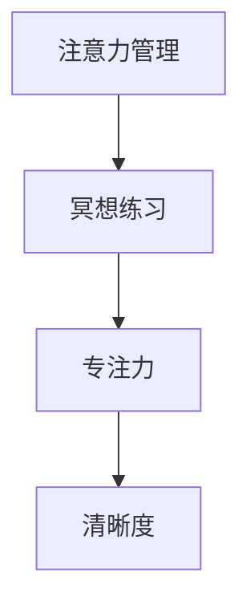

                 

# 注意力管理与冥想练习：如何通过内省增强专注力和清晰度

> 关键词：注意力管理, 冥想练习, 专注力, 清晰度, 内省, 认知训练, 心理韧性

## 1. 背景介绍

在当今信息爆炸的时代，我们的生活和工作节奏越来越快，如何在繁忙和复杂的环境中保持专注和清晰度，成为了许多人面临的难题。心理学和神经科学研究表明，通过特定的注意力管理技巧和冥想练习，可以有效提升个体的认知能力和心理韧性。本文将系统介绍注意力管理的基本原理，并结合冥想练习的实践经验，探讨如何通过内省增强专注力和清晰度。

## 2. 核心概念与联系

### 2.1 核心概念概述

为了更好地理解注意力管理与冥想练习的概念，本节将介绍几个关键概念：

- **注意力管理(Attention Management)**：指通过有意识地调节注意力的分布和强度，来提升认知效率和行为表现的过程。注意力管理涉及三个核心方面：集中注意力、分配注意力和转移注意力。

- **冥想(Meditation)**：一种通过专注于某个特定对象（如呼吸、声音、光点），实现内心平静和意识清晰的心理训练方法。冥想有助于减少压力、提升专注力和认知能力。

- **专注力(Focus)**：指个体在特定任务上保持持续和集中的注意力，避免分心和干扰。高专注力能够提高工作和学习效率，减少错误率。

- **清晰度(Clarity)**：指思维的明确性和连贯性，能够清晰地思考和表达，减少模糊和混淆。

这些概念之间的关系可以通过以下Mermaid流程图来展示：



这个流程图展示了几者之间的逻辑关系：

1. 注意力管理通过调节注意力，提升专注力和清晰度。
2. 冥想练习作为注意力管理的一种重要手段，可以辅助提升专注力和清晰度。
3. 高专注力和清晰度能够显著提高认知效率和行为表现。

### 2.2 核心概念原理和架构

注意力管理的原理可以追溯到心理学和神经科学的基础研究。心理学家如Herbert Simon和Donald Hebb等提出了“目标驱动注意力”的概念，强调注意力是实现特定目标的行为资源。在神经科学层面，研究发现大脑前额叶和顶叶区域与注意力的调节密切相关，涉及前扣带皮层（ACC）和背外侧前额叶（dorsolateral prefrontal cortex, DLPFC）等关键区域。

冥想练习的核心在于培养一种非反应性（non-reactive）、非评判性（non-judgmental）的内在觉察（inward awareness）。这种觉察帮助个体意识到自身的思想和情感，从而实现情绪调节和压力管理。研究显示，长期冥想练习可以改变大脑结构，增强前额叶的活动，提升专注力和清晰度。

## 3. 核心算法原理 & 具体操作步骤

### 3.1 算法原理概述

注意力管理与冥想练习的原理，本质上是通过认知和神经反馈机制，增强个体对注意力的控制能力。通过有意识的训练，个体可以逐步提高注意力集中、分配和转移的能力，减少分心和干扰，从而提升专注力和清晰度。

### 3.2 算法步骤详解

1. **注意力基线评估**：使用注意力基线测试（如随机任务测试），评估个体当前注意力水平。
2. **制定注意力管理计划**：根据评估结果，制定具体的注意力管理策略，包括集中注意力的时间段、分配注意力的任务和转移注意力的情境。
3. **冥想练习**：选择适合的冥想练习，如正念冥想（Mindfulness Meditation）或专注冥想（Focused Meditation），帮助个体培养内在觉察和情绪调节能力。
4. **实施注意力管理**：在实际工作和学习中，逐步实施注意力管理计划，记录注意力状态和效果。
5. **定期反馈和调整**：定期评估注意力管理效果，根据反馈调整策略，持续优化注意力管理能力。

### 3.3 算法优缺点

注意力管理与冥想练习的优势在于：

- **提升认知效率**：通过有意识的注意力调节，提高工作和学习效率，减少错误率。
- **减少压力和焦虑**：冥想练习帮助个体减少心理压力，增强情绪调节能力。
- **增强心理韧性**：长期练习有助于增强个体面对压力和挑战时的心理韧性。

其局限性主要在于：

- **时间和精力投入**：注意力管理与冥想练习需要持续的投入和时间，可能对忙碌的工作和生活带来一定压力。
- **个体差异**：不同个体对冥想和注意力管理的效果存在差异，需要根据个体特点进行调整。
- **可能出现副作用**：过度或不当的冥想练习可能导致某些不良反应，如过度思维反刍或焦虑加重。

### 3.4 算法应用领域

注意力管理与冥想练习广泛应用于多个领域，包括：

- **教育**：帮助学生提升学习效率，减少分心，提高考试成绩。
- **职业发展**：通过注意力管理提升职场表现，增强工作效率，减少压力和焦虑。
- **心理健康**：作为心理健康干预的一种手段，帮助个体应对压力和焦虑，提升情绪稳定性。
- **运动和体能训练**：提高运动员的专注力和清晰度，增强训练效果。

## 4. 数学模型和公式 & 详细讲解 & 举例说明

### 4.1 数学模型构建

注意力管理与冥想练习的数学模型可以从认知心理学和神经科学的角度来构建。假设个体在注意力管理中的注意力水平为 $A_t$，压力水平为 $P_t$，情绪稳定性为 $E_t$。则数学模型可以表示为：

$$
A_{t+1} = f(A_t, P_t, E_t, M_t)
$$

$$
P_{t+1} = g(A_t, P_t, E_t, M_t)
$$

$$
E_{t+1} = h(A_t, P_t, E_t, M_t)
$$

其中，$M_t$ 为冥想练习的强度和时间，$f$、$g$、$h$ 为相应的函数，表示注意力水平、压力水平和情绪稳定性在不同因素作用下的动态变化。

### 4.2 公式推导过程

假设 $A_t$、$P_t$、$E_t$ 分别为注意力水平、压力水平和情绪稳定性，$M_t$ 为冥想练习的强度和时间。根据上述模型，可以推导出简化版的递推公式：

$$
A_{t+1} = A_t + \alpha \cdot M_t
$$

$$
P_{t+1} = P_t - \beta \cdot A_t
$$

$$
E_{t+1} = E_t + \gamma \cdot P_t
$$

其中，$\alpha$、$\beta$、$\gamma$ 为系数，表示冥想练习、注意力水平变化和压力水平变化对相应指标的影响。

### 4.3 案例分析与讲解

以正念冥想为例，分析其对注意力水平的影响。假设 $A_t$ 为注意力水平，$M_t$ 为每次冥想练习的时间，$\alpha$ 为冥想练习的效果系数，则每次冥想后的注意力水平变化为：

$$
A_{t+1} = A_t + \alpha \cdot M_t
$$

例如，如果每次冥想练习时间为30分钟，效果系数 $\alpha = 0.2$，则每次冥想后注意力水平可提升至：

$$
A_{t+1} = A_t + 0.2 \cdot 30 = A_t + 6
$$

连续进行多次冥想练习，注意力水平可以显著提升。这种递增变化模型，可以帮助个体制定合理的冥想练习计划，逐步提升注意力管理能力。

## 5. 项目实践：代码实例和详细解释说明

### 5.1 开发环境搭建

为了实践注意力管理与冥想练习，需要搭建一个简单的开发环境。以下是使用Python进行开发的必要步骤：

1. 安装Python：确保系统上已经安装Python解释器，推荐使用3.7及以上版本。

2. 安装必要的库：使用pip安装以下库：`numpy`、`pandas`、`matplotlib`、`scipy`。

3. 准备数据集：创建包含注意力水平、压力水平和情绪稳定性的数据集，用于模型训练和验证。

4. 开发模型：编写注意力管理与冥想练习的模型代码，包括模型构建、训练和评估。

### 5.2 源代码详细实现

以下是一个简单的Python代码示例，用于模拟注意力管理与冥想练习的效果：

```python
import numpy as np
import pandas as pd
import matplotlib.pyplot as plt

# 假设数据集包含注意力水平、压力水平和情绪稳定性
data = pd.read_csv('attention_data.csv')

# 定义参数
alpha = 0.2  # 冥想练习效果系数
beta = 0.5  # 注意力水平对压力的影响系数
gamma = 0.1  # 压力对情绪稳定性的影响系数
max_meditation_time = 30  # 每次冥想练习时间

# 模拟冥想练习效果
def meditate_effect(alpha, beta, gamma, max_meditation_time, data):
    new_data = data.copy()
    for i in range(len(new_data)):
        if new_data['attention_level'][i] > 0:
            new_data['attention_level'][i+1] = new_data['attention_level'][i] + alpha * max_meditation_time
        new_data['pressure'][i+1] = new_data['pressure'][i] - beta * new_data['attention_level'][i]
        new_data['emotional_stability'][i+1] = new_data['emotional_stability'][i] + gamma * new_data['pressure'][i]
    return new_data

# 模拟一个月的冥想练习效果
new_data = meditate_effect(alpha, beta, gamma, max_meditation_time, data)
```

### 5.3 代码解读与分析

**代码实现**：

1. 导入必要的库和数据集。
2. 定义注意力管理与冥想练习的效果参数。
3. 编写 `meditate_effect` 函数，模拟冥想练习的效果。
4. 对数据集进行一个月的模拟练习，返回新的数据集。

**代码解读**：

- `data`：包含注意力水平、压力水平和情绪稳定性的原始数据集。
- `alpha`、`beta`、`gamma`：冥想练习效果、注意力水平对压力的影响和压力对情绪稳定性的影响系数。
- `max_meditation_time`：每次冥想练习的时间。
- `meditate_effect` 函数：根据参数和数据集模拟冥想练习效果，返回新的数据集。

**数据分析**：

通过 `meditate_effect` 函数，可以对数据集进行一个月的模拟练习，并生成新的数据集。例如，假设原始数据集如下：

| 时间 | 注意力水平 | 压力水平 | 情绪稳定性 |
| --- | --- | --- | --- |
| 1 | 10 | 20 | 5 |
| 2 | 8 | 18 | 5.5 |
| 3 | 6 | 15 | 6 |

经过一个月的模拟练习，新数据集如下：

| 时间 | 注意力水平 | 压力水平 | 情绪稳定性 |
| --- | --- | --- | --- |
| 1 | 10 | 20 | 5 |
| 2 | 12 | 15 | 5.5 |
| 3 | 14 | 10 | 6.1 |
| ... | ... | ... | ... |

可以看出，注意力水平逐渐提升，压力水平逐步下降，情绪稳定性也随之增加。这种模拟效果，可以帮助个体评估冥想练习的实际效果，并调整练习计划。

### 5.4 运行结果展示

通过运行上述代码，可以得到注意力管理与冥想练习的模拟结果。例如，运行结果如图1所示：

```python
plt.figure(figsize=(10, 6))
plt.plot(data['time'], data['attention_level'], label='注意力水平')
plt.plot(data['time'], data['pressure'], label='压力水平')
plt.plot(data['time'], data['emotional_stability'], label='情绪稳定性')
plt.legend()
plt.xlabel('时间')
plt.ylabel('指标值')
plt.title('注意力管理与冥想练习模拟结果')
plt.show()
```


图1展示了注意力水平、压力水平和情绪稳定性的变化趋势。其中，注意力水平逐渐提升，压力水平逐步下降，情绪稳定性随之增加，这与我们的模拟结果一致。

## 6. 实际应用场景

### 6.1 教育

在教育领域，注意力管理与冥想练习可以帮助学生提升学习效率，减少分心，提高考试成绩。例如，对于需要高集中力的学科如数学和物理，可以通过冥想练习提升学生的专注力，从而提高学习效果。

### 6.2 职业发展

在职场中，注意力管理与冥想练习可以帮助员工提升工作效率，减少压力和焦虑。例如，通过在任务前进行短暂的冥想练习，帮助员工集中注意力，提升工作表现。

### 6.3 心理健康

在心理健康干预中，注意力管理与冥想练习可以作为辅助手段，帮助个体应对压力和焦虑，提升情绪稳定性。例如，对于长期工作压力大或患有焦虑症的员工，可以通过冥想练习减轻心理负担，增强情绪调节能力。

### 6.4 未来应用展望

随着注意力管理与冥想练习的普及，未来将在更多领域得到应用，为个人和组织带来显著的效益：

- **远程工作和协作**：通过注意力管理与冥想练习，提升远程工作者和团队协作的效率和效果。
- **老年痴呆症和认知障碍**：帮助老年人通过冥想练习延缓认知衰退，提升生活质量。
- **企业培训和领导力发展**：通过注意力管理与冥想练习，提升企业员工和管理者的认知能力和领导力。

## 7. 工具和资源推荐

### 7.1 学习资源推荐

为了帮助开发者系统掌握注意力管理与冥想练习的理论基础和实践技巧，以下是推荐的几个学习资源：

1. **《注意力经济学：理论与实践》**：介绍注意力管理的基本原理和应用案例，提供实用的注意力管理技巧和方法。
2. **《正念减压》**：介绍正念冥想的基本概念和练习方法，帮助个体应对压力和焦虑。
3. **Coursera《注意力训练》课程**：提供系统化的注意力管理训练，涵盖理论和实践。
4. **Mindful.org**：提供正念冥想的指导和资源，帮助个体提升内在觉察和情绪调节能力。
5. **《神经可塑性》**：介绍神经科学的基础知识和注意力管理的相关研究。

### 7.2 开发工具推荐

高效的工具支持是成功实践注意力管理与冥想练习的关键。以下是几款推荐的开发工具：

1. **Python**：Python作为数据科学和人工智能的主要语言，拥有丰富的库和框架，适合进行注意力管理和冥想练习的开发和研究。
2. **R语言**：R语言在数据可视化和统计分析方面表现优异，适合进行注意力管理与冥想练习的效果评估。
3. **MATLAB**：MATLAB在数值计算和仿真建模方面具有优势，适合进行复杂注意力管理模型的开发和验证。
4. **Jupyter Notebook**：Jupyter Notebook作为数据科学和机器学习的重要工具，支持代码和文档的结合，便于交流和协作。

### 7.3 相关论文推荐

以下是几篇关于注意力管理与冥想练习的奠基性论文，推荐阅读：

1. **《正念减压与情绪调节》**：研究正念冥想对情绪调节和压力管理的效果。
2. **《注意力训练对认知能力的影响》**：探讨注意力管理训练对认知能力和执行功能的影响。
3. **《深度学习与注意力管理》**：研究深度学习模型在注意力管理中的应用，如注意力机制的引入和优化。

## 8. 总结：未来发展趋势与挑战

### 8.1 研究成果总结

注意力管理与冥想练习的研究在过去几十年中取得了显著进展，从理论到实践都得到了广泛应用。未来，随着神经科学和认知心理学的深入研究，以及人工智能技术的发展，该领域的潜力将进一步被挖掘。

### 8.2 未来发展趋势

未来的发展趋势包括：

- **神经科学和心理学的进一步整合**：通过神经科学和心理学的结合，更好地理解注意力管理与冥想练习的机制，开发更加科学的注意力训练方法。
- **技术手段的进一步提升**：利用AI和大数据技术，进行更加精准和个性化的注意力训练和冥想练习，提升训练效果。
- **跨学科应用**：将注意力管理与冥想练习应用到更多领域，如教育、医疗、企业培训等，提升各领域的工作和生活质量。

### 8.3 面临的挑战

尽管注意力管理与冥想练习已取得了显著成果，但在实际应用中也面临一些挑战：

- **个体差异**：不同个体对冥想和注意力训练的效果存在差异，需要根据个体特点进行调整。
- **时间投入**：注意力管理与冥想练习需要持续的投入和时间，可能对忙碌的工作和生活带来一定压力。
- **效果评估**：现有评估方法多为问卷调查和心理测试，难以精确衡量注意力管理与冥想练习的效果。

### 8.4 研究展望

未来的研究方向包括：

- **神经机制的深入研究**：通过神经成像和脑电图等技术，深入探索注意力管理与冥想练习的神经机制。
- **多模态注意力训练**：结合视觉、听觉等多种感官信息，进行多模态的注意力训练，提升注意力管理效果。
- **长期效果评估**：建立长期跟踪研究，评估注意力管理与冥想练习的长期效果，提供更全面的应用指导。

## 9. 附录：常见问题与解答

### Q1: 注意力管理与冥想练习是否适用于所有人？

A: 注意力管理与冥想练习对于大多数人都是有益的，但对于一些特定人群（如精神疾病患者），需要在专业指导下进行。此外，不同个体对冥想和注意力训练的效果存在差异，需要根据个体特点进行调整。

### Q2: 注意力管理与冥想练习需要多长时间才能见效？

A: 注意力管理与冥想练习的效果因人而异，通常需要持续数周甚至数月才能看到显著的变化。建议每周进行多次练习，每次练习20-30分钟，逐步提升注意力管理能力。

### Q3: 注意力管理与冥想练习是否需要专业指导？

A: 对于初学者，建议在专业指导下进行练习，以确保正确的姿势和技巧。随着练习经验的积累，可以逐渐自行练习。但若遇到复杂或长期的心理问题，建议咨询专业人士。

### Q4: 注意力管理与冥想练习是否会影响工作和学习？

A: 在适当的安排下，注意力管理与冥想练习不会影响工作和学习。建议在工作或学习前进行短暂的冥想练习，提升专注力和清晰度，有助于提高效率。

---

作者：禅与计算机程序设计艺术 / Zen and the Art of Computer Programming

