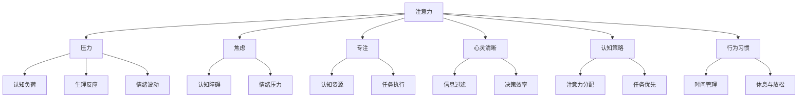

                 

# 注意力管理与压力管理：在压力和焦虑中保持专注和心灵清晰

在当今快节奏的生活和工作环境中，注意力管理与压力管理成为了影响我们效率和健康的重要因素。本文将深入探讨注意力和压力管理的原理，并结合实际应用场景，提出一系列切实可行的策略，帮助大家在面对压力和焦虑时，保持专注和心灵清晰。

## 1. 背景介绍

### 1.1 问题由来
随着科技的迅猛发展，我们日常生活中涉及的信息量急剧增加。如何在海量信息中筛选关键内容，集中注意力完成任务，成为了许多人的难题。同时，工作与生活的界限逐渐模糊，工作压力与生活压力交织，使许多人感到身心疲惫，难以保持清晰的思维。

### 1.2 问题核心关键点
注意力管理与压力管理是一个综合性问题，涉及心理学、神经科学、认知科学等多个领域。其核心在于如何通过有效的认知策略和行为习惯，在信息过载和压力环境中，保持专注和心态平衡。

### 1.3 问题研究意义
提升注意力管理和压力管理能力，不仅有助于提高工作效率和生活质量，还能够减少焦虑、抑郁等心理疾病的发生。对于个人成长、职业发展以及社会福祉具有重要意义。

## 2. 核心概念与联系

### 2.1 核心概念概述

为更好地理解注意力管理与压力管理，本节将介绍几个密切相关的核心概念：

- 注意力(Attention)：指人脑对一定信息的集中和持久关注，是认知资源分配和信息处理的基础。
- 压力(Stress)：指个体在面对压力源时，产生的一种心理和生理上的紧张反应。
- 焦虑(Anxiety)：指个体对未来可能发生的威胁性事件的不确定感，常见于高压力环境下。
- 专注(Focus)：指个体在特定任务上保持注意力集中和持久的状态。
- 心灵清晰(Mental Clarity)：指个体思维清晰、判断准确的状态，不受焦虑、压力等情绪干扰。
- 认知策略(Cognitive Strategies)：指个体在认知过程中采用的方法或技巧，如注意力转移、任务分解等。
- 行为习惯(Behavioral Habits)：指个体在日常行为中形成的行为模式，如定时休息、睡眠优化等。

这些概念之间的逻辑关系可以通过以下Mermaid流程图来展示：



这个流程图展示了一些核心概念之间的相互作用和相互影响：

- 注意力受到压力和焦虑的干扰，需要通过认知策略和行为习惯进行调节。
- 专注和心灵清晰有助于提升认知资源和决策效率，降低认知负荷和生理反应。
- 认知策略和行为习惯的合理运用，可以增强注意力的集中度和抗压能力，提升整体心理和生理健康。

## 3. 核心算法原理 & 具体操作步骤
### 3.1 算法原理概述

注意力管理与压力管理基于认知神经科学和行为心理学的原理，主要包括以下几个方面：

- **认知负荷理论(Cognitive Load Theory, CLT)**：该理论认为认知负荷与任务复杂度、工作记忆容量有关，适当调整认知负荷可以有效提升注意力的集中度。
- **情绪调节理论(Emotion Regulation Theory, ERT)**：通过认知和行为手段，控制情绪反应，减少焦虑和压力对认知过程的干扰。
- **工作记忆模型(Working Memory Model, WMM)**：描述信息在短时记忆中的存储、加工和提取过程，通过优化工作记忆，提升注意力和专注度。

### 3.2 算法步骤详解

以下是一些具体的注意力管理和压力管理算法步骤：

**Step 1: 自我认知**
- 识别当前所面临的压力源和焦虑情绪，明确需要管理的对象。

**Step 2: 设定目标**
- 根据实际情况，设定具体可行的注意力管理与压力管理目标。

**Step 3: 认知策略**
- 采用认知策略进行注意力管理，如注意力转移、任务分解等。
- 应用认知策略进行压力管理，如情绪重评、认知重构等。

**Step 4: 行为习惯**
- 建立健康的生活习惯，如定时休息、规律运动等。
- 调整工作习惯，如任务优先、时间管理等。

**Step 5: 监测与反馈**
- 定期评估注意力和压力管理的效果，根据反馈调整策略。

**Step 6: 持续改进**
- 根据实际情况不断优化和调整认知策略和行为习惯，逐步提升管理能力。

### 3.3 算法优缺点

注意力管理与压力管理方法具有以下优点：
1. 简单易行：通过合理的认知策略和行为习惯调整，易于操作和执行。
2. 效果显著：经过系统训练，可以有效提升专注度和抗压能力。
3. 灵活多变：适用于各种环境和任务，可以根据实际情况灵活调整策略。

同时，这些方法也存在一定的局限性：
1. 需要自我意识：部分策略依赖于个体自我意识和自我调节能力，难以在所有情况下生效。
2. 持续性要求高：这些方法需要长期坚持和持续努力，短期内难以见效。
3. 个体差异大：不同的个体对同一种策略的响应可能不同，需要个性化调整。

尽管存在这些局限性，但经过合理的运用和持续的实践，注意力管理与压力管理方法依然可以显著提升我们的认知和心理状态，为工作和生活带来积极影响。

### 3.4 算法应用领域

注意力管理与压力管理方法在各个领域都有广泛应用，例如：

- 教育：通过注意力管理和压力管理，提升学生的学习效率和心理韧性。
- 企业：帮助员工应对工作压力，提高工作效率和团队协作能力。
- 医疗：帮助患者应对疾病带来的压力和焦虑，提升生活质量和康复速度。
- 心理咨询：提供科学的认知策略和行为习惯建议，帮助来访者应对心理问题。

## 4. 数学模型和公式 & 详细讲解 & 举例说明（备注：数学公式请使用latex格式，latex嵌入文中独立段落使用 $$，段落内使用 $)
### 4.1 数学模型构建

注意力和压力管理的数学模型主要基于认知负荷理论和情绪调节理论构建。

假设个体在任务中所需的认知负荷为 $C$，工作记忆容量为 $W$，任务复杂度为 $T$。则认知负荷模型可以表示为：

$$
C = k_1 \times T + k_2 \times W
$$

其中 $k_1$ 和 $k_2$ 为常数，反映了任务复杂度和工作记忆容量对认知负荷的影响。

情绪调节模型则基于情绪调节策略的复杂度和效果进行建模。假设情绪调节策略的效果为 $E$，策略复杂度为 $S$，则情绪调节模型可以表示为：

$$
E = f(S)
$$

其中 $f$ 为非线性函数，反映了策略复杂度对情绪调节效果的影响。

### 4.2 公式推导过程

对于认知负荷模型，我们需要通过实验或调查数据来确定 $k_1$ 和 $k_2$ 的值。可以通过计算不同任务和不同工作记忆容量下的认知负荷来推导这些参数。

对于情绪调节模型，可以通过心理实验或观察数据来确定 $f$ 的函数形式。常见的方法包括单因素设计、多因素设计和随机对照实验等。

### 4.3 案例分析与讲解

假设我们在一个软件开发项目中应用注意力管理和压力管理方法。根据项目需求和团队情况，我们需要对认知负荷和情绪调节进行建模和评估。

首先，通过任务分解和优先级排序，计算每个任务的复杂度和所需工作记忆容量，代入认知负荷模型得到每个任务的认知负荷。

其次，通过团队成员的反馈和行为数据，分析不同情绪调节策略的效果，应用情绪调节模型优化策略选择。

最后，定期评估团队成员的认知负荷和情绪状态，根据反馈调整任务分配和情绪调节策略，逐步提升团队整体的工作效率和心理韧性。

## 5. 项目实践：代码实例和详细解释说明
### 5.1 开发环境搭建

在进行注意力管理和压力管理项目实践前，我们需要准备好开发环境。以下是使用Python进行项目开发的环境配置流程：

1. 安装Anaconda：从官网下载并安装Anaconda，用于创建独立的Python环境。

2. 创建并激活虚拟环境：
```bash
conda create -n cognitive_env python=3.8 
conda activate cognitive_env
```

3. 安装所需的Python库：
```bash
pip install numpy pandas scikit-learn seaborn matplotlib jupyter notebook ipython
```

4. 安装第三方库：
```bash
pip install tensorflow
```

5. 导入相关库：
```python
import numpy as np
import pandas as pd
import seaborn as sns
import matplotlib.pyplot as plt
import tensorflow as tf
```

### 5.2 源代码详细实现

下面我们以情感调节策略为例，给出使用TensorFlow进行情绪调节的Python代码实现。

首先，定义情绪调节策略的数据集：

```python
data = pd.read_csv('emotion_management.csv')
labels = data['strategy'].map({'A': 1, 'B': 2, 'C': 3}).values
x = data.drop('strategy', axis=1)
```

然后，定义情绪调节模型：

```python
model = tf.keras.Sequential([
    tf.keras.layers.Dense(64, activation='relu', input_shape=(x.shape[1],)),
    tf.keras.layers.Dense(64, activation='relu'),
    tf.keras.layers.Dense(3, activation='softmax')
])
```

接着，编译和训练模型：

```python
model.compile(optimizer='adam', loss='sparse_categorical_crossentropy', metrics=['accuracy'])
model.fit(x, labels, epochs=10, validation_split=0.2)
```

最后，评估模型效果：

```python
test_data = pd.read_csv('test_emotion.csv')
test_labels = test_data['strategy'].map({'A': 1, 'B': 2, 'C': 3}).values
test_x = test_data.drop('strategy', axis=1)

predictions = model.predict(test_x)
print(classification_report(test_labels, predictions.argmax(axis=1)))
```

以上代码展示了如何使用TensorFlow构建和训练一个简单的情绪调节模型，用于预测不同的情绪调节策略效果。在实际应用中，可以根据具体需求调整模型架构和训练参数，以提升预测精度。

### 5.3 代码解读与分析

让我们再详细解读一下关键代码的实现细节：

**数据准备**：
- `read_csv`方法用于读取数据集，`map`方法用于将策略标签转化为模型所需的数字标签。
- `drop`方法用于删除不需要的特征列。

**模型定义**：
- `Sequential`方法用于构建序列模型，`Dense`层用于定义全连接神经网络。
- `activation`参数用于指定激活函数，`input_shape`参数用于指定输入数据的形状。

**模型训练**：
- `compile`方法用于配置模型优化器和损失函数。
- `fit`方法用于训练模型，`validation_split`参数用于划分验证集。

**模型评估**：
- `predict`方法用于进行预测，`argmax`方法用于获取预测结果。
- `classification_report`方法用于输出模型性能评估报告。

这些关键代码步骤展示了使用TensorFlow进行情绪调节策略的简单实现。在实际应用中，可以进一步优化模型架构，引入更多特征和数据，以提升模型效果。

## 6. 实际应用场景
### 6.1 教育

在教育领域，注意力管理和压力管理技术可以显著提升学生的学习效率和心理韧性。

通过采用认知策略，如任务分解和时间管理，帮助学生集中注意力，提升学习效果。通过应用情绪调节策略，如认知重构和情绪重评，帮助学生应对考试压力和作业负担，减少焦虑和压力感。

### 6.2 企业

在企业环境中，注意力管理和压力管理技术可以提升员工的工作效率和团队协作能力。

通过任务优先和时间管理策略，帮助员工集中注意力，避免多任务干扰。通过情绪调节策略，如正念冥想和团队建设活动，帮助员工缓解工作压力，提升心理韧性。

### 6.3 医疗

在医疗领域，注意力管理和压力管理技术可以帮助患者应对疾病带来的压力和焦虑，提升生活质量和康复速度。

通过认知策略，如信息过滤和任务简化，帮助患者减轻认知负担，提升治疗效果。通过情绪调节策略，如放松技巧和心理疏导，帮助患者缓解心理压力，提升康复速度。

### 6.4 未来应用展望

随着认知神经科学和行为心理学研究的深入，注意力管理和压力管理技术将得到更广泛的应用和改进。未来的发展趋势包括：

1. 个性化定制：通过大数据和机器学习技术，实现个性化的注意力和压力管理方案。
2. 实时监测：结合物联网技术，实现对个体注意力和压力状态的实时监测和反馈。
3. 多学科融合：与心理学、神经科学、工程学等多学科结合，提供综合性的解决方案。
4. 智能辅助：利用AI技术，提供智能化的情绪调节和认知管理建议。

## 7. 工具和资源推荐
### 7.1 学习资源推荐

为了帮助开发者系统掌握注意力管理和压力管理的技术基础和实践技巧，这里推荐一些优质的学习资源：

1. 《认知负荷与注意力管理》系列博文：由认知心理学专家撰写，深入浅出地介绍了认知负荷理论和注意力管理方法。

2. 《情绪调节与心理韧性》课程：由心理学专家开设的在线课程，涵盖情绪调节策略和心理韧性训练。

3. 《工作记忆与认知效率》书籍：认知科学领域的经典著作，全面介绍了工作记忆模型和认知效率优化方法。

4. TensorFlow官方文档：TensorFlow的官方文档，提供了丰富的情感调节和认知管理样例代码，是实践学习的好帮手。

5. 《心理健康与认知调节》论文：学术期刊上的最新研究成果，涵盖了多种认知调节和情绪管理策略。

通过对这些资源的学习实践，相信你一定能够快速掌握注意力管理和压力管理的精髓，并用于解决实际的认知和心理问题。

### 7.2 开发工具推荐

高效的开发离不开优秀的工具支持。以下是几款用于注意力管理和压力管理开发的常用工具：

1. Jupyter Notebook：开源的交互式笔记本环境，支持Python、R等多种编程语言，方便进行数据探索和算法实验。

2. TensorFlow：由Google主导开发的开源深度学习框架，支持GPU加速，适合进行复杂的情感调节和认知管理模型训练。

3. Scikit-learn：开源的机器学习库，提供了丰富的数据预处理和模型评估工具，方便进行注意力管理和压力管理数据的分析和处理。

4. Seaborn：基于matplotlib的数据可视化库，提供了美观的数据可视化效果，方便进行情绪调节策略效果的展示。

5. Weights & Biases：模型训练的实验跟踪工具，可以记录和可视化模型训练过程中的各项指标，方便对比和调优。

6. Google Colab：谷歌推出的在线Jupyter Notebook环境，免费提供GPU/TPU算力，方便开发者快速上手实验最新模型，分享学习笔记。

合理利用这些工具，可以显著提升注意力管理和压力管理任务的开发效率，加快创新迭代的步伐。

### 7.3 相关论文推荐

注意力管理和压力管理的研究源于学界的持续研究。以下是几篇奠基性的相关论文，推荐阅读：

1. Cognitive Load Theory: Review and Recent Advances: 综述了认知负荷理论的研究进展，介绍了认知负荷和任务复杂度之间的关系。

2. Emotion Regulation Theory: A Comprehensive Review: 综述了情绪调节理论的研究进展，介绍了不同情绪调节策略的效果和机制。

3. Working Memory and Attention: A Critical Review: 综述了工作记忆模型和注意力管理的研究进展，介绍了工作记忆和认知资源分配的关系。

4. Attention Management and Stress Reduction: 介绍了一种基于认知负荷理论的注意力管理策略，通过实验验证了其效果。

5. Cognitive Behavioral Therapy for Attention Management: 介绍了一种基于认知行为疗法的注意力管理方法，通过案例分析展示了其应用效果。

这些论文代表了大语言模型微调技术的发展脉络。通过学习这些前沿成果，可以帮助研究者把握学科前进方向，激发更多的创新灵感。

## 8. 总结：未来发展趋势与挑战

### 8.1 总结

本文对注意力管理与压力管理进行了全面系统的介绍。首先阐述了注意力和压力管理的原理，明确了其对认知和心理状态的影响。其次，从原理到实践，详细讲解了注意力和压力管理的数学模型和操作步骤，给出了具体实用的代码实现。同时，本文还广泛探讨了注意力和压力管理技术在教育、企业、医疗等领域的实际应用，展示了其广泛的应用前景。此外，本文精选了注意力和压力管理技术的各类学习资源，力求为读者提供全方位的技术指引。

通过本文的系统梳理，可以看到，注意力管理和压力管理技术在各个领域都有广阔的应用前景，是提升个人效率和心理健康的重要手段。未来，伴随这些技术的持续发展，我们必将能够更好地应对各种复杂的认知和心理问题，提升整体的工作和生活质量。

### 8.2 未来发展趋势

展望未来，注意力管理和压力管理技术将呈现以下几个发展趋势：

1. 智能化和自动化：结合人工智能技术，开发更加智能化的注意力和压力管理工具，实现个性化的认知优化和情绪调节。
2. 实时化和动态化：利用物联网和云计算技术，实现对注意力和压力状态的实时监测和动态调整，提供实时的情绪和认知管理建议。
3. 跨学科融合：与心理学、神经科学、计算机科学等多学科结合，提供综合性的解决方案，提升注意力管理和压力管理的科学性和有效性。
4. 健康与幸福：将注意力管理和压力管理技术应用于健康管理、幸福提升等多个方面，推动全社会的健康和幸福水平的提升。

### 8.3 面临的挑战

尽管注意力管理和压力管理技术已经取得了一定的进展，但在迈向更加智能化、普适化应用的过程中，它仍面临诸多挑战：

1. 数据隐私和安全：在实时监测和数据反馈过程中，如何保障用户的隐私和安全，防止数据泄露和滥用。
2. 模型透明性：如何增强模型算法的透明性和可解释性，确保用户对模型的理解和信任。
3. 伦理和道德：如何确保注意力和压力管理技术的伦理和道德合规，避免技术滥用和不良后果。
4. 技术壁垒：如何降低技术门槛，使更多用户能够便捷地使用注意力和压力管理工具。
5. 多样性和包容性：如何确保技术解决方案的多样性和包容性，满足不同用户的需求和背景。

### 8.4 研究展望

为了应对这些挑战，未来的研究需要在以下几个方面寻求新的突破：

1. 数据保护和隐私技术：研究高效的数据保护和隐私技术，确保用户数据的安全和隐私。
2. 模型可解释性：开发可解释性强的注意力和压力管理模型，增强用户对模型的信任和理解。
3. 伦理和道德约束：建立伦理和道德约束机制，确保技术应用的合规性和道德性。
4. 用户友好设计：优化技术界面和用户体验，降低技术门槛，使更多人能够便捷地使用注意力和压力管理工具。
5. 多样性和包容性设计：研究多样性和包容性设计方法，确保技术解决方案满足不同用户的需求和背景。

这些研究方向的研究，必将引领注意力管理和压力管理技术迈向更高的台阶，为构建健康、高效、和谐的社会环境铺平道路。面向未来，我们期待更多创新技术的涌现，使注意力管理和压力管理真正成为提升人类生活质量的有力工具。

## 9. 附录：常见问题与解答

**Q1：注意力管理和压力管理是否适用于所有人群？**

A: 注意力管理和压力管理技术适用于大多数人，但不同个体对同一策略的响应可能不同。建议根据个人情况选择和调整策略。

**Q2：注意力管理和压力管理需要多久才能见效？**

A: 注意力管理和压力管理的效果因人而异，一般需要持续实践和调整才能见效。建议定期评估和调整策略，逐步提升管理能力。

**Q3：注意力管理和压力管理是否会影响个人隐私？**

A: 部分注意力和压力管理技术需要实时监测和数据分析，可能涉及个人隐私。建议使用合规的平台和工具，保障数据安全。

**Q4：注意力管理和压力管理是否会依赖外部技术设备？**

A: 部分注意力和压力管理技术需要借助外部技术设备，如可穿戴设备、心理疏导软件等。建议选择可靠、安全的技术设备，确保使用效果。

**Q5：注意力管理和压力管理是否会与现有工作和生活习惯冲突？**

A: 部分注意力和压力管理策略可能与现有工作和生活习惯冲突。建议逐步调整和优化策略，确保其与现有习惯相协调。

这些常见问题的解答，帮助读者更好地理解注意力管理和压力管理的原理和实践，为实际操作提供参考和指导。希望本文能够帮助大家在压力和焦虑中找到一份专注和心灵清晰，为提升工作效率和生活质量做出贡献。

---

作者：禅与计算机程序设计艺术 / Zen and the Art of Computer Programming

