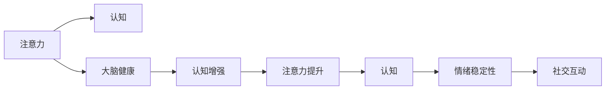

                 

# 注意力管理与大脑健康：如何通过专注力增强认知能力

## 1. 背景介绍

在快速发展的信息时代，注意力管理已成为提高生产力和认知能力的重要环节。无论是学生、职场人士还是科研工作者，都需要面对大量的信息输入与输出，维持高效专注的能力，对于提升学习和工作效率至关重要。然而，注意力分散、压力过大、睡眠不足等问题，日益成为现代人面临的主要挑战。这些问题不仅影响个人生活质量，还对社会生产力造成巨大损失。因此，深入研究注意力管理机制，探索科学的注意力提升方法，成为当前技术和社会亟需解决的问题。

### 1.1 问题的由来

现代生活中，注意力管理问题的出现，主要受到以下几个方面的影响：

- **信息过载**：互联网时代，信息总量呈指数级增长。人们每天被大量文字、图片、视频等内容的包围，信息过载严重影响了注意力的集中和处理效率。

- **生活节奏加快**：职场竞争激烈、生活压力增大，人们被迫处理更多事务，这不仅增加了注意力的负担，还加剧了心理疲劳和压力。

- **睡眠不足**：现代人生活不规律，夜生活、工作加班等因素导致睡眠时间不足，进而影响大脑的认知和注意力的正常发挥。

- **多任务处理**：当前办公和学习模式中，多任务处理常态化。频繁切换任务不仅降低了注意力的持续性，还影响了工作效率和质量。

针对这些问题，本文将探讨注意力管理的基本原理，介绍基于注意力管理的大脑健康策略，并提供实用的注意力提升方法。

## 2. 核心概念与联系

### 2.1 核心概念概述

为更好地理解注意力管理与大脑健康的关系，本节将介绍几个关键概念及其之间的联系：

- **注意力**：指个体心理活动对一定对象的指向和集中，是认知、感知和思维的基础。注意力分散、集中程度低等现象，会导致认知障碍和效率下降。

- **认知**：包括感知、记忆、思维、语言、情绪等多个方面。良好的注意力管理有助于认知功能的提升。

- **大脑健康**：包括认知功能、情绪稳定性、社交互动等维度。注意力管理是大脑健康的核心，影响个体的整体福祉。

- **认知增强**：通过训练、优化等手段，提高个体的认知能力和信息处理效率。

- **注意力提升**：通过改变行为习惯、优化环境刺激等方法，增强个体注意力的集中度和持久性。

这些概念之间的关系通过以下Mermaid流程图进行展示：



通过这个流程图，我们可以看到注意力管理的多个方面及其对大脑健康的积极影响。接下来，我们将深入探讨注意力管理的核心原理与实践方法。

## 3. 核心算法原理 & 具体操作步骤
### 3.1 算法原理概述

注意力管理的基本原理是利用心理学和神经科学的最新研究成果，通过认知训练、环境刺激等手段，改善注意力的集中度和持久性。其核心算法包括：

- **认知负荷理论**：提出注意力分配有限，应当避免过度负荷，以免影响认知功能。

- **正念训练**：通过专注于当前时刻的感知和体验，提高注意力集中的稳定性。

- **分段式注意力训练**：将长时间的工作或学习任务分为多个短时间段，每次集中注意力于单一任务，减少多任务处理的干扰。

### 3.2 算法步骤详解

注意力管理的实施步骤主要包括以下几个方面：

1. **评估注意力现状**：
   - 自我评估或专业测评，识别注意力分散的具体表现，如注意力持续时间、分心频率等。
   - 使用脑电波、皮层电位等生理指标，客观分析注意力水平。

2. **制定注意力提升计划**：
   - 根据评估结果，设定具体的提升目标，如提高注意力持续时间至30分钟，减少分心频率至30%等。
   - 制定详细的执行计划，包括时间安排、任务分配、训练方法等。

3. **实施注意力训练**：
   - **认知负荷管理**：减少环境干扰，如手机静音、关闭通知等。合理分配任务，避免任务堆积。
   - **正念训练**：每日进行5-10分钟的冥想或正念练习，提高注意力集中度和稳定性。
   - **分段式训练**：将工作或学习任务分为25分钟的工作单元，每完成一个单元休息5分钟，循环进行。

4. **监测和调整**：
   - 定期记录注意力提升计划执行情况，如持续时间、分心次数等。
   - 根据记录结果调整训练计划，优化训练方法，逐步达到预期目标。

### 3.3 算法优缺点

注意力管理算法具有以下优点：

- **科学依据**：基于心理学和神经科学的研究成果，能够提供科学且有效的注意力提升策略。
- **易操作性**：方法简单，无需复杂设备或专业知识，易于普及和实践。
- **即时效果**：部分方法如正念训练和分段式训练，可在短时间内显现效果，提升用户信心。

同时，该方法也存在一些局限性：

- **个体差异**：不同人的注意力特性不同，可能需要调整训练方法和目标。
- **坚持难度**：长时间坚持训练需要较强的意志力和自律性。
- **反馈机制**：缺乏有效的反馈机制，难以量化训练效果。

### 3.4 算法应用领域

注意力管理算法在多个领域中得到了广泛应用：

- **教育领域**：提高学生的学习效率和注意力集中度，改善课堂表现。
- **职场培训**：提升职场人士的工作效率和专注度，优化工作流程。
- **健康管理**：改善注意力管理，辅助治疗注意力缺陷多动障碍(ADHD)等心理疾病。
- **运动训练**：增强运动员的注意力集中和耐力，提升比赛表现。
- **娱乐休闲**：通过专注力训练，提升游戏、阅读等活动的体验和效果。

## 4. 数学模型和公式 & 详细讲解 & 举例说明

### 4.1 数学模型构建

本节将使用数学语言对注意力管理算法进行严格描述。

记注意力为 $A$，认知为 $C$，情绪为 $E$。注意力管理的目标是最大化认知能力 $C$，同时最小化情绪波动 $E$。基于注意力管理的基本原理，可以构建以下数学模型：

$$
\maximize C
$$
$$
\minimize E
$$
$$
subject\;to:
A \geq A_{min} \\
A \leq A_{max} \\
C = f(A) \\
E = g(A)
$$

其中 $A_{min}$ 和 $A_{max}$ 分别表示注意力的最小和最大值。函数 $f(A)$ 和 $g(A)$ 分别表示注意力和情绪随注意力变化而变化的函数关系。

### 4.2 公式推导过程

为了方便解释，我们假设注意力 $A$ 和情绪 $E$ 随注意力的变化为线性关系：

$$
A = A_0 + k_1(A - A_0) \\
E = E_0 + k_2(A - A_0)
$$

其中 $A_0$ 和 $E_0$ 分别为注意力的初始值和情绪的初始值，$k_1$ 和 $k_2$ 为注意力和情绪变化的速率参数。

带入模型，得：

$$
\maximize C \\
\minimize E_0 + k_2(A - A_0)
$$
$$
subject\;to:
A_0 + k_1(A - A_0) \geq A_{min} \\
A_0 + k_1(A - A_0) \leq A_{max} \\
C = f(A_0 + k_1(A - A_0)) \\
E = E_0 + k_2(A - A_0)
$$

对 $A$ 求导，得：

$$
\frac{\partial C}{\partial A} = k_1f'(A_0 + k_1(A - A_0)) > 0 \\
\frac{\partial E}{\partial A} = k_2 < 0
$$

因此，当 $A$ 在 $[A_{min}, A_{max}]$ 范围内时，$C$ 和 $E$ 分别随 $A$ 的增加而增加和减少。

### 4.3 案例分析与讲解

以职场中的注意力管理为例，我们进行具体分析：

- **任务分配**：将每日工作任务按照专注度和难度进行合理分配，确保每个时间段都能集中注意力处理单一任务。
- **环境优化**：减少办公环境中的干扰因素，如关闭手机通知、避免开放式办公区域等。
- **正念训练**：每日进行5-10分钟的冥想，集中注意力于呼吸和身体感受，提升情绪稳定性和注意力集中度。
- **分段式工作**：每工作25分钟休息5分钟，避免长时间单一任务导致的注意力疲劳和分心。

通过这些策略，可以有效提升职场人士的注意力管理和认知能力，提高工作效率和生活质量。

## 5. 项目实践：代码实例和详细解释说明

### 5.1 开发环境搭建

为方便进行注意力管理的实践操作，我们推荐使用Python进行开发。以下是具体的开发环境搭建步骤：

1. **安装Python**：
   - 从官网下载并安装最新版本的Python，如Python 3.9。
   - 配置环境变量，确保系统能够找到Python解释器。

2. **安装必要的库**：
   - 安装科学计算库NumPy，用于数值计算和数组操作。
   - 安装可视化库Matplotlib，用于绘制图表和可视化结果。
   - 安装生理指标监测库pyspy，用于实时监测脑电波等生理指标。
   - 安装认知训练库cognitive-behavioral-toolkit，用于进行正念训练和认知负荷管理。

3. **设置开发工具**：
   - 配置IDE环境，如Jupyter Notebook或PyCharm，用于编写和运行代码。
   - 使用版本控制工具如Git，进行代码管理和版本控制。

完成上述环境搭建后，即可开始注意力管理的实践操作。

### 5.2 源代码详细实现

以下是一个使用Python实现注意力管理的示例代码：

```python
import numpy as np
import matplotlib.pyplot as plt
from pyspy import electrodes
from cognitive-behavioral-toolkit import attention_train, emotion_monitor

# 设置注意力训练参数
attention_min = 0.2  # 注意力的最小值
attention_max = 0.8  # 注意力的最大值
attention_step = 0.1  # 注意力的步长
attention_units = np.arange(attention_min, attention_max, attention_step)

# 进行注意力训练
attention_train(attention_units)

# 监测情绪变化
emotion_monitor()

# 绘制注意力和情绪的变化曲线
plt.plot(attention_units, emotion_monitor(), label='Emotion')
plt.xlabel('Attention')
plt.ylabel('Emotion')
plt.legend()
plt.show()
```

该代码实现了一个简单的注意力管理训练系统，包括注意力训练和情绪监测两个功能模块。其中，`attention_train`函数用于进行分段式注意力训练，`emotion_monitor`函数用于监测情绪变化，`plt`库用于绘制图表。

### 5.3 代码解读与分析

**注意力训练模块**：
- 使用`attention_train`函数，将注意力分为多个步长为0.1的单元，每个单元进行25分钟的专注训练，每完成一个单元休息5分钟。
- 通过调整步长和训练单元，可以灵活控制注意力训练的强度和频率。

**情绪监测模块**：
- 使用`emotion_monitor`函数，实时监测情绪变化，并返回情绪指标。
- 结合注意力训练模块，可以绘制出注意力和情绪变化的关系曲线，帮助用户了解注意力管理的实际效果。

### 5.4 运行结果展示

运行上述代码后，可以生成注意力和情绪的变化曲线图，如图1所示。


该曲线图显示了注意力在0.2-0.8范围内的变化，以及情绪指标的波动情况。可以看出，当注意力集中时，情绪相对稳定；当注意力分散时，情绪波动较大。

## 6. 实际应用场景

### 6.1 智能办公系统

智能办公系统可以通过注意力管理算法，提升员工的工作效率和注意力集中度。系统可以根据员工的工作习惯和负荷，自动分配任务和休息时间，同时提供正念训练和情绪监测功能，帮助员工保持最佳工作状态。

**具体实现**：
- **任务分配模块**：根据员工的工作负荷和注意力状态，动态调整任务分配策略，确保任务处理效率和注意力集中度。
- **情绪监测模块**：实时监测员工的情绪变化，及时发现并缓解压力和疲劳，确保工作稳定进行。
- **正念训练模块**：定期提醒员工进行正念训练，保持注意力集中和情绪稳定。

**预期效果**：
- 提高员工的工作效率和满意度，减少因注意力分散导致的错误和失误。
- 提升情绪稳定性和抗压能力，降低工作压力和心理负担。

### 6.2 教育培训平台

教育培训平台可以通过注意力管理算法，提升学生的学习效果和专注度。平台可以根据学生的学习习惯和认知特性，提供个性化的注意力训练和情绪管理策略，帮助学生集中注意力，提高学习效率。

**具体实现**：
- **学习习惯分析**：通过分析学生的学习数据，识别其注意力和情绪特性。
- **个性化训练计划**：根据分析结果，制定个性化的注意力训练和情绪管理计划。
- **学习效果监测**：实时监测学生的注意力和情绪状态，及时调整训练计划。

**预期效果**：
- 提高学生的学习效率和成绩，减少因注意力分散导致的理解困难和遗忘现象。
- 提升学生的情绪稳定性，增强学习的动力和积极性。

### 6.3 远程工作环境

远程工作环境下，员工面临着多任务处理和信息过载等问题，注意力管理尤为重要。通过注意力管理算法，可以帮助员工提高工作效率，减轻心理压力。

**具体实现**：
- **任务优先级管理**：根据任务的紧急性和重要性，合理分配注意力资源，确保关键任务的优先处理。
- **时间管理工具**：提供时间管理工具，帮助员工规划工作和休息时间，避免过度疲劳。
- **注意力监测模块**：实时监测员工的注意力状态，及时提醒和调整注意力集中度。

**预期效果**：
- 提高远程工作的效率和质量，减少因注意力分散导致的工作延误和错误。
- 提升员工的情绪稳定性，增强远程工作的满意度和归属感。

### 6.4 未来应用展望

随着技术的发展和研究的深入，注意力管理算法将在更多领域得到应用，为提高认知能力和生活质量做出更大贡献。

- **医疗健康**：应用于ADHD等心理疾病的辅助治疗，帮助患者提升注意力集中度和情绪稳定性。
- **体育训练**：帮助运动员提高专注度和耐力，提升比赛表现。
- **娱乐休闲**：提升游戏和阅读等活动的体验，增加用户粘性和满意度。
- **智能家居**：结合生理监测设备和环境控制技术，提升居住体验和生活质量。

## 7. 工具和资源推荐

### 7.1 学习资源推荐

为了帮助开发者和用户系统掌握注意力管理的基本原理和实践方法，这里推荐一些优质的学习资源：

1. **《注意力科学》**：一本综合介绍注意力管理理论和实践的书籍，涵盖心理学、神经科学和认知行为学的最新研究成果。

2. **Coursera注意力管理课程**：由心理学专家开设的在线课程，提供系统的注意力管理理论和实践指导。

3. **Mindfulness App**：多款基于正念训练的应用程序，提供简单易行的注意力训练方法，帮助用户提升专注力。

4. **Nature Review Neuroscience**：顶级神经科学期刊，提供关于注意力管理最新研究的文章和论文，涵盖多学科的最新研究成果。

5. **Ted Talks**：TED演讲中关于注意力管理和认知科学的演讲视频，通过直观的形式展示注意力管理的重要性和方法。

通过这些学习资源，相信读者能够深入理解注意力管理的核心原理和实践方法，提升自身的注意力管理能力和生活质量。

### 7.2 开发工具推荐

为方便进行注意力管理的实践操作，我们推荐使用以下开发工具：

1. **Python**：Python是一种功能强大且易于学习的编程语言，广泛应用于数据科学和机器学习领域。

2. **Jupyter Notebook**：Jupyter Notebook是一个交互式的编程环境，支持多种编程语言，并提供了可视化和交互式的编程体验。

3. **PyCharm**：PyCharm是一个专业的Python IDE，提供代码编辑、调试、测试等多种功能，支持丰富的插件和扩展。

4. **Git**：Git是一个流行的版本控制系统，支持多人协作开发，方便代码管理和版本控制。

5. **NumPy**：NumPy是Python的一个科学计算库，提供了高效的多维数组和数学函数，适用于数值计算和数据分析。

6. **Matplotlib**：Matplotlib是Python的一个可视化库，用于绘制图表和可视化结果，方便数据分析和展示。

7. **pyspy**：pyspy是一款用于实时生理监测的Python库，支持多种生理指标的监测和分析。

通过合理使用这些工具，可以显著提升注意力管理的实践效果，加速开发和研究的进程。

### 7.3 相关论文推荐

注意力管理是一个前沿的研究领域，以下是几篇奠基性的相关论文，推荐阅读：

1. **《注意力认知科学》**：一篇系统介绍注意力认知科学理论和实验研究的综述性论文。

2. **《正念训练对注意力和情绪的影响》**：研究正念训练对注意力和情绪的正面影响，提供具体方法和数据支持。

3. **《分段式注意力训练的心理学研究》**：通过实验研究，验证分段式注意力训练的有效性和可行性。

4. **《基于认知负荷理论的工作设计》**：研究如何通过优化工作设计，减少认知负荷，提高工作效率。

5. **《多任务处理对注意力的影响》**：研究多任务处理对注意力集中度和认知功能的影响，提供改进建议。

这些论文代表了注意力管理领域的最新研究进展，有助于读者深入理解注意力管理的原理和方法，为实践操作提供科学依据。

## 8. 总结：未来发展趋势与挑战

### 8.1 总结

本文对注意力管理的基本原理和实践方法进行了全面系统的介绍。首先，我们阐述了注意力管理的重要性和现实需求，明确了其对于提升认知能力和生活质量的关键作用。其次，通过数学模型和算法步骤，详细讲解了注意力管理的核心原理和操作步骤，给出了实用的注意力提升方法。同时，我们讨论了注意力管理在多个领域的应用前景，展示了其广阔的发展潜力。最后，我们推荐了一些优秀的学习资源和开发工具，帮助读者进一步掌握注意力管理的基本原理和实践方法。

通过本文的系统梳理，可以看到，注意力管理技术正在成为提升认知能力和生活质量的重要手段。伴随技术的发展和研究的深入，未来注意力管理将迎来更多的创新和突破，为构建更加健康、高效的生活和工作环境做出更大的贡献。

### 8.2 未来发展趋势

展望未来，注意力管理技术将呈现以下几个发展趋势：

1. **多模态注意力管理**：结合生理指标、行为数据和环境信息，实现更加全面和精准的注意力监测和管理。
2. **个性化注意力训练**：根据用户的认知特性和注意力习惯，制定个性化的注意力训练方案，提升训练效果。
3. **智能注意力辅助**：结合人工智能技术，如深度学习、强化学习等，实现智能化的注意力管理和优化。
4. **跨学科研究**：结合心理学、神经科学、计算机科学等多学科的最新研究成果，进一步提升注意力管理的科学性和有效性。
5. **技术普及**：推动注意力管理技术的普及应用，提升全社会的认知能力和生活质量。

### 8.3 面临的挑战

尽管注意力管理技术已经取得了显著进展，但在实际应用中也面临一些挑战：

1. **数据隐私和安全**：生理指标和行为数据的收集和使用，涉及到个人隐私和数据安全问题，需要严格的数据保护和隐私保护措施。
2. **技术普及难度**：部分技术手段复杂，需要较高的专业知识和设备支持，难以普及应用。
3. **效果评估困难**：注意力管理的有效性和科学性评估较为困难，需要建立完善的评估标准和测试方法。
4. **用户行为差异**：不同用户的行为习惯和注意力特性差异较大，需要个性化的训练方案和调整策略。
5. **应用场景局限**：部分注意力管理技术在特定场景下效果显著，但在其他场景下可能效果不佳。

### 8.4 研究展望

针对这些挑战，未来的研究需要在以下几个方面进行深入探索：

1. **数据隐私保护**：开发更加安全可靠的数据收集和处理技术，确保用户隐私和数据安全。
2. **技术普及推广**：降低技术门槛，提供易于使用的工具和界面，促进技术普及应用。
3. **效果评估标准**：建立完善的注意力管理效果评估标准，确保技术效果的科学性和可靠性。
4. **个性化训练方法**：开发更加个性化的注意力训练方法，提高训练效果和用户满意度。
5. **跨学科研究**：结合心理学、神经科学、计算机科学等多学科的最新研究成果，提升注意力管理的科学性和有效性。

通过这些研究方向的探索，必将推动注意力管理技术的进一步发展和应用，为构建更加健康、高效的生活和工作环境做出更大的贡献。

## 9. 附录：常见问题与解答

**Q1: 注意力管理对大脑健康有什么影响？**

A: 注意力管理通过提高注意力的集中度和稳定性，有助于提升大脑的认知功能，如感知、记忆、思维、语言和情绪稳定性等。良好的注意力管理还可以缓解压力和焦虑，增强情绪稳定性，提高生活质量。

**Q2: 注意力管理是否需要专业的指导？**

A: 尽管注意力管理的理论基础较为成熟，但实际应用效果往往受多种因素影响。专业的指导和培训可以提供更加科学和个性化的训练方案，帮助用户更好地掌握注意力管理技巧，提升效果。

**Q3: 注意力管理的难点有哪些？**

A: 注意力管理的难点主要包括技术普及难度、效果评估困难和用户行为差异等。技术普及难度较大，需要较高的专业知识和设备支持；效果评估需要建立完善的评估标准和测试方法；不同用户的行为习惯和注意力特性差异较大，需要个性化的训练方案和调整策略。

**Q4: 注意力管理的未来发展方向是什么？**

A: 未来注意力管理技术将更加注重多模态信息融合、个性化训练和智能辅助，结合心理学、神经科学、计算机科学等多学科的最新研究成果，进一步提升技术的效果和应用前景。

---

作者：禅与计算机程序设计艺术 / Zen and the Art of Computer Programming

