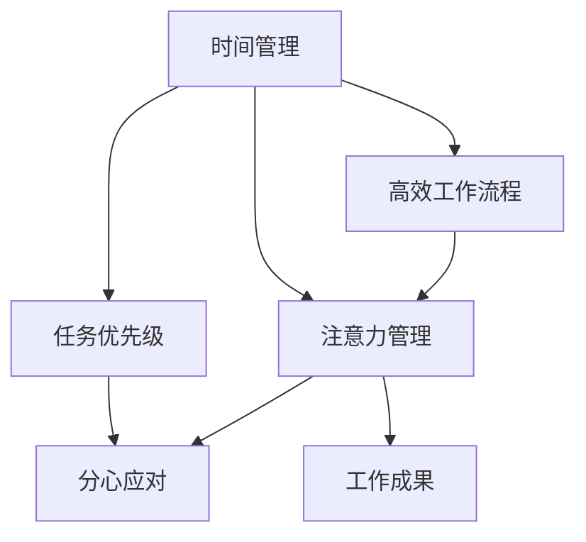

                 

# 注意力管理与时间管理策略：最大化利用你的时间和效率

在当今信息爆炸的时代，时间管理和注意力管理变得比以往任何时候都更加重要。无论是忙碌的职场人士，还是自由职业者，都在努力寻找最有效的方法来管理自己的时间和注意力，以最大化利用每天的时间。本文将深入探讨注意力管理与时间管理策略，帮助读者掌握如何高效利用时间，提升工作效率，实现个人目标。

## 1. 背景介绍

### 1.1 问题由来
随着技术的发展，我们的生活和工作方式发生了巨大的变化。互联网和移动设备的普及，使得我们的注意力被各种应用和信息分流，导致我们的时间变得越来越碎片化，难以集中注意力完成重要任务。同时，信息过载也让我们难以筛选出最重要的信息，从而影响我们的决策和效率。因此，有效的时间管理和注意力管理变得尤为重要。

### 1.2 问题核心关键点
时间管理和注意力管理的关键点在于如何高效分配时间、集中注意力、减少分心、以及筛选重要信息。其核心在于两个方面：
1. **时间管理**：合理安排工作和休息时间，避免拖延和过劳，提高工作效率。
2. **注意力管理**：集中注意力在重要任务上，避免分心，提升工作质量。

## 2. 核心概念与联系

### 2.1 核心概念概述

为了更好地理解注意力管理与时间管理策略，本节将介绍几个密切相关的核心概念：

- **时间管理**：指通过计划、安排和控制时间的使用，以达成目标或完成工作任务的过程。常见的时间管理方法包括GTD（Getting Things Done）、番茄工作法、四象限法则等。

- **注意力管理**：指通过自我监控和调节，提升注意力集中度和持续时间的能力。常见的方法包括番茄工作法、专注冥想、环境优化等。

- **任务优先级**：指根据任务的重要性和紧急程度，确定优先执行的任务顺序。常见的优先级方法包括艾森豪威尔矩阵、ABC分析法等。

- **分心应对**：指识别和应对导致分心的事物，如手机通知、环境噪音等。常见的方法包括数字断舍离、环境隔离、设定工作时间等。

- **高效工作流程**：指通过优化工作流程，减少无用的环节，提高工作效率。常见的方法包括精益工作法、JIT（Just-In-Time）管理等。

这些核心概念之间的逻辑关系可以通过以下Mermaid流程图来展示：



这个流程图展示了一些关键概念及其之间的关系：

1. 时间管理帮助确定任务优先级，合理安排时间。
2. 注意力管理提升注意力集中度和持续时间。
3. 任务优先级决定哪些任务应该优先完成。
4. 分心应对帮助减少干扰，保持专注。
5. 高效工作流程优化工作流程，减少浪费。
6. 以上管理手段共同作用，最终提升工作成果。

## 3. 核心算法原理 & 具体操作步骤

### 3.1 算法原理概述

注意力管理与时间管理策略的核心理论是行为科学和心理学研究的成果。其基本原理是通过认知行为干预，改变个人的行为习惯，提升时间和注意力的使用效率。具体来说，包括以下几个步骤：

1. **时间记录**：记录每日的活动时间，了解时间花在哪些任务上。
2. **任务分解**：将大任务分解为小任务，便于管理。
3. **优先级排序**：根据任务的重要性和紧急程度，排序并确定优先级。
4. **时间块划分**：将时间划分为若干固定长度的时间块，集中精力完成特定任务。
5. **注意力集中**：通过环境优化、专注冥想等手段，提升注意力集中度和持续时间。
6. **分心应对**：识别和应对导致分心的事物，如手机通知、环境噪音等。

### 3.2 算法步骤详解

下面是详细的注意力管理与时间管理策略的实现步骤：

**Step 1: 时间记录与分析**

1. **使用时间记录工具**：如Toggl、RescueTime等，记录每日的活动时间，包括工作、学习、休息等。
2. **分析时间记录**：分析时间记录数据，了解自己在哪些任务上花费的时间最多，哪些时间被浪费。

**Step 2: 任务分解与优先级排序**

1. **任务分解**：将大任务分解为小任务，便于管理和执行。
2. **优先级排序**：根据任务的重要性和紧急程度，使用艾森豪威尔矩阵、ABC分析法等工具确定优先级。

**Step 3: 时间块划分**

1. **设定时间块**：将每天的时间划分为若干固定长度的时间块，例如番茄工作法中的25分钟时间块。
2. **专注执行**：在每个时间块内，集中精力完成特定任务，避免分心。

**Step 4: 注意力集中**

1. **环境优化**：通过减少环境噪音、保持整洁等方式，创造有利于集中注意力的环境。
2. **专注冥想**：通过冥想练习，提升注意力集中度和持续时间。

**Step 5: 分心应对**

1. **识别分心因素**：识别导致分心的事物，如手机通知、社交媒体等。
2. **设定工作时间**：设定专门的工作时间，避免在这段时间内被打扰。

### 3.3 算法优缺点

注意力管理与时间管理策略的优点：
1. **提升效率**：通过合理的时间安排和任务优先级排序，提升工作效率。
2. **减少拖延**：通过设定具体的工作时间块，避免拖延。
3. **提升专注度**：通过环境优化和专注冥想，提升注意力集中度。
4. **减少分心**：通过识别和应对分心因素，减少分心。

其缺点：
1. **初期难度**：初期的调整和习惯养成较为困难，需要一定的坚持。
2. **适应性**：不同人对于不同策略的适应性不同，需要根据个人情况选择适合的策略。
3. **需要自律**：需要较强的自律性，才能坚持执行策略。

### 3.4 算法应用领域

注意力管理与时间管理策略广泛应用于各行各业，例如：

- **职场管理**：通过时间记录和任务优先级排序，提高工作效率，减少加班。
- **学术研究**：通过任务分解和时间块划分，高效管理研究时间和任务。
- **项目管理**：通过任务优先级和分心应对，确保项目按时完成。
- **个人发展**：通过时间记录和注意力集中，提升自我学习和个人成长。

## 4. 数学模型和公式 & 详细讲解 & 举例说明

### 4.1 数学模型构建

为了更精确地分析时间管理与注意力管理，可以构建数学模型。假设一个人的总时间是 $T$，每天工作时间是 $W$，则有：

$$
W = T - R
$$

其中 $R$ 为非工作时间（如休息、娱乐等）。任务优先级可以使用加权向量表示，例如：

$$
P = [p_1, p_2, \ldots, p_n]
$$

其中 $p_i$ 为第 $i$ 个任务的优先级权重，满足 $p_i \geq 0$ 且 $\sum_{i=1}^n p_i = 1$。注意力集中的时间块大小为 $t$，注意力集中的次数为 $n$，则注意力集中时间占总时间的比例为：

$$
\frac{nt}{T}
$$

### 4.2 公式推导过程

假设某人每天工作时间为 $W$，注意力集中的时间为 $C$，分心时间为 $D$，则有：

$$
W = C + D
$$

为了最大化 $W$，需要最大化 $C$ 并最小化 $D$。假设 $C$ 占总时间 $T$ 的比例为 $\alpha$，则有：

$$
C = \alpha T
$$

由于 $W = T - R$，则有：

$$
W = \alpha T + R
$$

为了最大化 $W$，需要最大化 $\alpha$ 并最小化 $R$。因此，可以通过优化 $\alpha$ 和 $R$ 来提升效率。

### 4.3 案例分析与讲解

假设一个人每天有 8 小时的时间，其中 3 小时用于工作，1 小时用于休息，4 小时用于非工作时间。设任务优先级权重 $P = [0.5, 0.3, 0.2]$，注意力集中的时间块大小为 25 分钟，注意力集中的次数为 8。则：

1. **任务优先级排序**：按照优先级排序，依次完成三个任务。
2. **时间块划分**：将时间划分为 8 个 25 分钟的时间块，每个时间块内专注一个任务。
3. **注意力集中**：通过环境优化和专注冥想，提升注意力集中度。
4. **分心应对**：识别和应对分心因素，减少分心。

## 5. 项目实践：代码实例和详细解释说明

### 5.1 开发环境搭建

在进行时间管理与注意力管理实践前，我们需要准备好开发环境。以下是使用Python进行实践的环境配置流程：

1. 安装Anaconda：从官网下载并安装Anaconda，用于创建独立的Python环境。

2. 创建并激活虚拟环境：
```bash
conda create -n time-management python=3.8 
conda activate time-management
```

3. 安装相关库：
```bash
pip install pandas numpy matplotlib
```

完成上述步骤后，即可在`time-management`环境中开始实践。

### 5.2 源代码详细实现

下面是一个使用Python实现时间管理与注意力管理策略的示例代码：

```python
import pandas as pd

# 记录每日时间记录
daily_records = {
    "Time": ["09:00-10:00", "10:00-11:00", "14:00-15:00", "15:00-16:00", "16:00-17:00", "18:00-19:00"],
    "Task": ["工作", "学习", "午休", "工作", "运动", "休息"],
    "Focus": [True, True, False, True, True, False]
}

# 将时间记录转换为数据框
df = pd.DataFrame(daily_records)

# 计算每天的工作时间和非工作时间
work_hours = df[df["Task"] == "工作"].sum() / 60
rest_hours = df[df["Task"] == "休息"].sum() / 60
non_work_hours = 24 - work_hours - rest_hours

# 输出工作时间和非工作时间
print("工作时间：", work_hours)
print("非工作时间：", non_work_hours)
```

### 5.3 代码解读与分析

让我们再详细解读一下关键代码的实现细节：

**每日时间记录**：
- 定义一个字典，记录每日的时间、任务和是否集中注意力。
- 将字典转换为Pandas数据框，便于计算和分析。

**计算工作时间和非工作时间**：
- 使用Pandas的`sum`方法，计算每天的工作时间和非工作时间。
- 将工作时间转换为小时，以便与总时间进行比较。

**输出结果**：
- 输出每天的工作时间和非工作时间，以便评估和优化。

## 6. 实际应用场景

### 6.1 智能客服系统

基于时间管理与注意力管理策略，智能客服系统可以更加高效地处理客户咨询。通过记录客服的每天工作时间和任务，系统可以自动生成工作分析报告，帮助客服识别工作效率低下的环节，并进行优化。同时，系统可以根据客服的工作状态（如忙碌、空闲），动态调整任务优先级，提升整体工作效率。

### 6.2 金融舆情监测

在金融舆情监测中，时间管理与注意力管理策略可以用于管理数据分析和报告生成任务。通过记录每日的分析时间和非分析时间，系统可以自动分析时间分配，识别并优化低效的分析环节，从而提升分析报告的生成效率。同时，系统可以根据舆情变化，动态调整优先级，确保重要舆情的及时响应。

### 6.3 个性化推荐系统

在个性化推荐系统中，时间管理与注意力管理策略可以用于优化推荐模型的训练和推理。通过记录模型训练和推理的时间，系统可以自动分析时间分配，识别并优化低效的训练和推理环节，从而提升推荐系统的效率和准确性。同时，系统可以根据用户的反馈，动态调整推荐优先级，确保推荐结果的及时性和个性化。

### 6.4 未来应用展望

随着时间管理和注意力管理策略的不断发展，未来将在更多领域得到应用，为传统行业带来变革性影响。

在智慧医疗领域，时间管理与注意力管理策略可以帮助医务人员高效管理病历记录、诊疗时间，提升医疗服务的效率和质量。

在智能教育领域，时间管理与注意力管理策略可以用于优化课程安排和教学评估，帮助教师和学生更高效地完成教学和学习任务。

在智慧城市治理中，时间管理与注意力管理策略可以用于优化城市事件监测、应急响应等环节，提高城市管理的自动化和智能化水平。

此外，在企业生产、社会治理、文娱传媒等众多领域，时间管理和注意力管理策略也将不断涌现，为经济社会发展注入新的动力。相信随着技术的发展和实践的积累，时间管理和注意力管理策略将更加深入人心，成为提升工作效率的重要手段。

## 7. 工具和资源推荐

### 7.1 学习资源推荐

为了帮助开发者系统掌握时间管理和注意力管理策略的理论基础和实践技巧，这里推荐一些优质的学习资源：

1. 《高效能人士的七个习惯》：史蒂芬·柯维的经典著作，详细介绍了时间管理、目标设定等核心概念。

2. 《深度工作》：卡尔·纽波特的著作，探讨了在分散注意力环境中如何高效工作。

3. 《番茄工作法图解》：弗朗西斯科·西里洛的著作，介绍了番茄工作法的基本原理和实践技巧。

4. 《GTD：Getting Things Done》：大卫·艾伦的著作，详细介绍了GTD方法的时间管理技巧。

5. 《时间管理简史》：史蒂夫·柯尔的著作，梳理了时间管理发展历程，提供丰富的历史背景知识。

通过对这些资源的学习实践，相信你一定能够快速掌握时间管理和注意力管理的精髓，并用于解决实际的工作问题。

### 7.2 开发工具推荐

高效的开发离不开优秀的工具支持。以下是几款用于时间管理与注意力管理策略开发的常用工具：

1. Toggl：时间记录和分析工具，支持多平台，帮助用户记录和分析时间记录。

2. RescueTime：自动时间记录和分析工具，可以自动跟踪用户在不同应用和任务上花费的时间。

3. Focus@Will：专注于提升注意力和集中度的音乐服务，帮助用户创建专注环境。

4. Todoist：任务管理工具，支持多平台，帮助用户管理任务和优先级。

5. Forest：专注应用程序，通过种树的方式，帮助用户专注于当前任务。

6. Pomodone：基于番茄工作法的时间管理工具，帮助用户创建时间块，管理专注时间。

合理利用这些工具，可以显著提升时间管理和注意力管理的效率，加快创新迭代的步伐。

### 7.3 相关论文推荐

时间管理和注意力管理策略的发展源于学界的持续研究。以下是几篇奠基性的相关论文，推荐阅读：

1. "The Eisenhower Matrix: How to Use It to Take Control of Your Life"：戴维·艾伦的文章，介绍了艾森豪威尔矩阵的时间管理方法。

2. "Deep Work: Rules for Focused Success in a Distracted World"：卡尔·纽波特的著作，探讨了深度工作的原理和实践技巧。

3. "The Pomodoro Technique"：弗朗西斯科·西里洛的文章，介绍了番茄工作法的基本原理。

4. "Time Management in Software Development"：James Shore的论文，探讨了软件开发中的时间管理方法。

5. "The Impact of Productivity Tools on Team Coordination"：Pearson的论文，探讨了工具对团队协作和时间管理的影响。

这些论文代表了大规模语言模型微调技术的发展脉络。通过学习这些前沿成果，可以帮助研究者把握学科前进方向，激发更多的创新灵感。

## 8. 总结：未来发展趋势与挑战

### 8.1 总结

本文对时间管理和注意力管理策略进行了全面系统的介绍。首先阐述了时间管理和注意力管理的重要性和基本概念，明确了策略在提升工作效率、优化时间利用方面的独特价值。其次，从原理到实践，详细讲解了时间管理和注意力管理的数学模型和操作步骤，给出了具体的代码实现和实例分析。同时，本文还广泛探讨了时间管理和注意力管理在多个行业领域的应用前景，展示了策略的广泛适用性。

通过本文的系统梳理，可以看到，时间管理和注意力管理策略正在成为提升工作效率的重要手段，为个人和组织提供了科学的时间分配和任务管理方案。随着技术的发展和实践的积累，时间管理和注意力管理将不断演进，带来更多新的突破和应用。

### 8.2 未来发展趋势

展望未来，时间管理和注意力管理策略将呈现以下几个发展趋势：

1. **智能化应用**：未来将出现更多基于AI的时间管理和注意力管理工具，如智能助理、智能日程安排等，帮助用户自动优化时间分配和任务优先级。

2. **多模态融合**：时间管理和注意力管理策略将与其他AI技术，如自然语言处理、计算机视觉等进行融合，提供更全面、个性化的管理方案。

3. **远程协作优化**：随着远程办公的普及，时间管理和注意力管理策略将更加注重团队协作和沟通效率，帮助团队成员更好地协同工作。

4. **自我学习优化**：未来的工具将更加注重个性化和学习优化，根据用户的历史数据和行为，自动调整时间管理策略，提升用户效率。

5. **跨平台整合**：未来的时间管理和注意力管理工具将实现跨平台整合，支持多设备、多平台协同管理，提升用户体验。

这些趋势将推动时间管理和注意力管理策略不断进步，为个人和组织带来更大的价值。

### 8.3 面临的挑战

尽管时间管理和注意力管理策略已经取得了显著成效，但在迈向更加智能化、个性化应用的过程中，它仍面临诸多挑战：

1. **个性化需求多样化**：不同用户的需求差异较大，单一的策略难以满足所有人的需求。如何设计更加个性化、灵活的管理策略，是一个重要挑战。

2. **技术适应性**：新技术和新工具层出不穷，用户需要不断学习和适应，才能充分利用其优势。如何降低技术使用门槛，提升用户接受度，是一个挑战。

3. **数据隐私和安全**：时间管理和注意力管理策略涉及大量的个人数据，如何保护用户隐私，确保数据安全，是一个重要的挑战。

4. **行为依赖**：时间管理和注意力管理策略的有效性依赖于用户的坚持和自律，如何提高用户粘性，帮助用户长期坚持，是一个挑战。

5. **跨文化适应**：时间管理和注意力管理策略在不同文化背景下可能存在差异，如何设计跨文化适用的管理方案，是一个挑战。

6. **心理负担**：长时间使用时间管理和注意力管理策略可能带来心理负担，如何设计减轻心理负担的管理策略，是一个挑战。

这些挑战需要从技术、心理、社会等多个维度综合考虑，才能有效应对和解决。

### 8.4 研究展望

面对时间管理和注意力管理策略面临的种种挑战，未来的研究需要在以下几个方面寻求新的突破：

1. **个性化定制**：开发更加个性化的时间管理和注意力管理工具，根据用户的行为习惯和偏好，自动生成个性化的管理方案。

2. **跨文化适应**：研究时间管理和注意力管理策略在不同文化背景下的适用性，设计跨文化适用的管理方案。

3. **智能优化**：引入AI技术，如深度学习、强化学习等，优化时间管理和注意力管理策略，提升其智能化水平。

4. **心理适应**：研究时间管理和注意力管理策略对用户心理的影响，设计减轻心理负担的管理方案。

5. **社会协同**：研究时间管理和注意力管理策略在团队和组织中的协同效果，提升整体协作效率。

6. **伦理和安全**：研究时间管理和注意力管理策略的伦理和安全问题，确保其应用符合道德标准和法律法规。

这些研究方向的探索，必将引领时间管理和注意力管理策略迈向更高的台阶，为构建高效、智能的时间管理生态系统铺平道路。

## 9. 附录：常见问题与解答

**Q1：时间管理与注意力管理策略是否适用于所有人？**

A: 时间管理和注意力管理策略适用于大多数人群，但不同人对策略的接受度和适应度可能不同。特别是对于一些极端拖延症患者，可能需要更多的时间和耐心来适应。

**Q2：时间管理与注意力管理策略是否需要设置固定的工作时间块？**

A: 时间管理与注意力管理策略不一定需要设置固定的工作时间块，可以根据个人的习惯和任务特点灵活调整。例如，番茄工作法中的时间块大小和间隔可以按照个人需求进行调整。

**Q3：如何应对突发事件对时间管理的影响？**

A: 突发事件是不可避免的，可以预留一定的时间弹性，避免时间管理过于紧张。同时，通过优先级调整和任务分解，确保突发事件不影响核心任务的完成。

**Q4：如何保持长时间的专注力？**

A: 保持长时间的专注力需要多种手段，如环境优化、专注冥想、定期休息等。可以通过多种方法综合应用，找到适合自己的方式。

**Q5：时间管理与注意力管理策略需要坚持多久才能见效？**

A: 时间管理与注意力管理策略需要长期坚持才能见效。通常需要几周到几个月的时间来适应和优化，建议设定一个合理的坚持周期，逐步调整和优化。

---

作者：禅与计算机程序设计艺术 / Zen and the Art of Computer Programming

