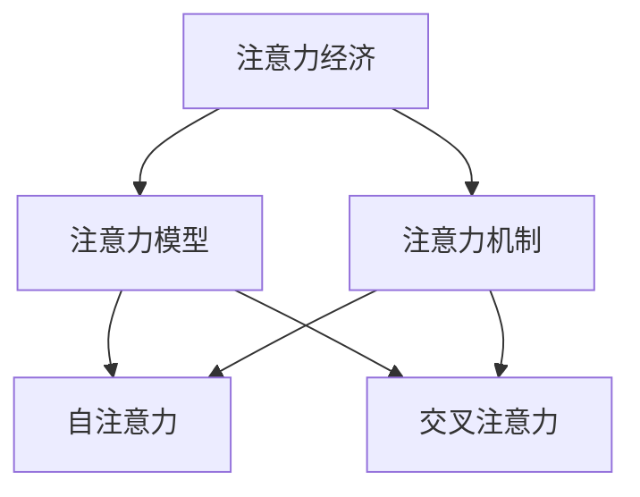

                 

# 注意力经济与个人学习效率的提升

## 1. 背景介绍

### 1.1 问题由来

在信息化、数字化迅猛发展的今天，注意力经济（Attention Economy）已成为驱动数字经济发展的重要引擎。伴随互联网的普及，海量的信息流不断冲击人们的视听感官，快速而准确地捕获并利用有效信息成为一种全新的竞争力。在个人层面上，有效管理自己的注意力，提升学习效率，是现代社会对每个人提出的更高要求。

注意力经济通过大数据、人工智能等技术手段，精确捕捉用户注意力，从而实现商业变现。个人学习效率的提升，也需要借助高效的信息捕获和处理手段，以最大程度地利用注意力资源，实现知识的内化和转化。然而，现有的信息检索技术往往过于复杂，难以适应个人化的学习需求。而基于注意力机制的模型，能够通过简洁高效的方式，精确引导个人注意力，提升学习效率。

### 1.2 问题核心关键点

注意力机制的核心思想在于通过模型计算获得输入序列中每个位置的“注意力得分”，以此来决定如何分配输入序列的信息权重，让模型重点关注重要信息，忽略干扰信息。

在实际应用中，注意力机制被广泛应用于各种自然语言处理(NLP)任务中，如机器翻译、文本摘要、问答系统等。例如，在机器翻译中，注意力机制帮助模型根据源语言句子动态分配权重，重点关注与目标词汇最相关的源语言词汇；在文本摘要中，注意力机制用于确定哪些句子应该被抽取并合并，用于生成简洁的摘要。

### 1.3 问题研究意义

在注意力经济和信息爆炸时代，通过注意力机制提升个人学习效率，具有深远的意义：

1. 提升信息检索精度。通过精确识别和聚焦关键信息，减少信息过载，提升检索结果的相关性。
2. 增强数据利用效率。以有限的注意力资源，最大化获取和利用有价值的数据。
3. 优化决策质量。通过合理分配信息权重，增强模型决策的准确性和鲁棒性。
4. 改善用户体验。提升信息检索和处理速度，实现个性化推荐和服务，提升用户满意度。

## 2. 核心概念与联系

### 2.1 核心概念概述

在深入探讨注意力经济和注意力机制前，我们先来了解几个核心概念：

- **注意力经济（Attention Economy）**：指在互联网时代，用户注意力成为一种稀缺资源，通过精确定位用户关注点，最大化其经济价值。
- **注意力机制（Attention Mechanism）**：指通过计算获得输入序列中每个位置的“注意力得分”，决定如何分配输入序列的信息权重，引导模型关注重要信息。
- **注意力模型（Attention Model）**：指引入注意力机制的模型，如Transformer、LSTM等。
- **自注意力（Self-Attention）**：指在模型内部计算得到序列中各位置之间的相对关系，用于重点关注序列中某些关键位置。
- **交叉注意力（Cross-Attention）**：指在模型间计算注意力得分，用于捕捉不同序列之间的信息关系。

这些核心概念之间存在紧密的联系，共同构成了现代深度学习模型的核心思想和计算流程。

通过以下Mermaid流程图，可以更好地理解这些概念之间的逻辑关系：



这个流程图展示了大语言模型微调技术的发展脉络：

1. 注意力经济的目标是通过用户注意力的精确定位，实现商业价值最大化。
2. 注意力机制被用于计算输入序列中每个位置的“注意力得分”，指导模型关注重要信息。
3. 注意力模型是包含注意力机制的模型，如Transformer、LSTM等。
4. 自注意力机制用于计算序列内部的信息权重，帮助模型关注序列中某些关键位置。
5. 交叉注意力机制用于捕捉不同序列之间的信息关系，帮助模型处理跨序列任务。

这些概念共同构成了现代深度学习模型的基础，推动了模型性能的不断提升和应用范围的不断扩大。

## 3. 核心算法原理 & 具体操作步骤
### 3.1 算法原理概述

注意力机制的核心思想在于通过计算注意力得分，动态地决定输入序列中每个位置的信息权重，让模型重点关注重要信息。

在数学上，注意力得分的计算基于输入序列的表示 $X=\{x_1,x_2,\dots,x_t\}$ 和输出序列的表示 $Y=\{y_1,y_2,\dots,y_s\}$，通过计算$X$和$Y$的注意力得分矩阵 $A=\{a_{ij}\}_{t \times s}$，并应用Softmax函数得到注意力分布：

$$
a_{ij} = \text{softmax}\left(\frac{W_Qx_i}{W_Ky_j} \right)
$$

其中 $W_Q$ 和 $W_K$ 为线性变换矩阵，$x_i$ 和 $y_j$ 分别为输入和输出序列在位置 $i$ 和 $j$ 的表示。注意力得分矩阵 $A$ 反映了输入序列中每个位置对输出序列的贡献程度，值越大表示越重要。

通过注意力得分矩阵 $A$，可以计算出输出序列中每个位置的信息权重 $w_j=\sum_{i=1}^ta_{ij}$，并结合输入序列的信息 $x_i$，得到输出序列的每个位置表示：

$$
\tilde{y}_j = \sum_{i=1}^t a_{ij}x_i
$$

其中 $a_{ij}$ 为注意力得分，$x_i$ 为输入序列位置 $i$ 的表示，$\tilde{y}_j$ 为输出序列位置 $j$ 的表示。

### 3.2 算法步骤详解

基于注意力机制的模型训练一般包括以下几个关键步骤：

**Step 1: 准备数据集**

- 收集源语言句子 $X=\{x_1,x_2,\dots,x_t\}$ 和目标语言句子 $Y=\{y_1,y_2,\dots,y_s\}$ 的对应对，构成训练集。

**Step 2: 设计模型架构**

- 构建Transformer等模型，设置编码器和解码器的结构。
- 定义自注意力和交叉注意力的线性变换矩阵 $W_Q$ 和 $W_K$。
- 设置Softmax函数和线性输出层。

**Step 3: 计算注意力得分**

- 将输入和输出序列分别输入编码器和解码器，得到各自的表示 $x_i$ 和 $y_j$。
- 计算注意力得分矩阵 $A=\{a_{ij}\}_{t \times s}$，并应用Softmax函数得到注意力分布。

**Step 4: 计算注意力权重**

- 计算输出序列中每个位置的信息权重 $w_j=\sum_{i=1}^ta_{ij}$。
- 将信息权重和输入序列的信息结合，得到输出序列的每个位置表示 $\tilde{y}_j$。

**Step 5: 反向传播更新参数**

- 将输出序列的预测结果与真实结果进行对比，计算loss。
- 反向传播计算各参数的梯度，并根据设定的优化算法（如Adam）更新参数。

**Step 6: 模型评估**

- 在验证集上评估模型性能，如BLEU、ROUGE等指标。
- 根据验证集结果调整模型参数，继续训练或停止。

以上是基于注意力机制的模型训练的完整流程，通过迭代优化参数，让模型能够精确分配注意力权重，提升信息捕获和处理能力。

### 3.3 算法优缺点

注意力机制在提升信息处理能力、提高模型准确性方面具有显著优势：

**优点：**

- 简化模型结构：相较于传统的循环神经网络，注意力机制不需要循环结构，计算复杂度更低。
- 提升模型泛化能力：通过动态分配信息权重，模型能够更好地适应多变的输入数据，提高泛化能力。
- 增强模型决策能力：注意力机制能够帮助模型捕捉关键信息，提升决策的准确性和鲁棒性。

**缺点：**

- 计算复杂度高：注意力机制虽然计算简单，但在某些大规模任务中，计算复杂度仍然较高。
- 数据依赖性强：注意力机制需要大量高质量的训练数据，数据量不足可能影响模型效果。
- 参数量大：注意力机制引入大量额外的线性变换和注意力得分计算，模型参数量显著增加。

尽管存在这些局限，注意力机制仍是大语言模型和自然语言处理领域的重要技术手段，通过合理设计和优化，可以在大多数任务上获得理想的性能。

### 3.4 算法应用领域

注意力机制已经被广泛应用于多个NLP任务中，包括但不限于以下领域：

- **机器翻译**：通过注意力机制捕捉源语言句子和目标语言句子之间的关系，提高翻译的准确性和流畅性。
- **文本摘要**：利用自注意力机制确定摘要中应包含的句子，生成简洁明了的摘要。
- **问答系统**：通过交叉注意力机制，捕捉问题和答案之间的关系，生成准确的回答。
- **文本分类**：利用自注意力机制捕捉文本中的关键信息，提升分类准确率。
- **对话系统**：通过自注意力机制和交叉注意力机制，实现智能对话和自然交互。

这些应用领域展示了注意力机制的强大能力，通过合理设计注意力得分计算和信息权重分配，可以显著提升模型的性能和实用性。

## 4. 数学模型和公式 & 详细讲解
### 4.1 数学模型构建

在注意力模型中，输入序列和输出序列的表示可以通过编码器和解码器计算得到。以下是Transformer模型中自注意力机制的数学建模：

设输入序列的表示为 $X=\{x_1,x_2,\dots,x_t\}$，输出序列的表示为 $Y=\{y_1,y_2,\dots,y_s\}$，编码器表示为 $E$，解码器表示为 $D$。

编码器将输入序列表示 $X$ 映射为 $H_X=\{h_{x_1},h_{x_2},\dots,h_{x_t}\}$，解码器将输出序列表示 $Y$ 映射为 $H_Y=\{h_{y_1},h_{y_2},\dots,h_{y_s}\}$。

自注意力机制通过计算注意力得分矩阵 $A=\{a_{ij}\}_{t \times s}$，得到输出序列中每个位置的信息权重 $w_j=\sum_{i=1}^ta_{ij}$，并结合输入序列的信息 $x_i$，得到输出序列的每个位置表示：

$$
\tilde{y}_j = \sum_{i=1}^t a_{ij}x_i
$$

其中 $a_{ij}$ 为注意力得分，$x_i$ 为输入序列位置 $i$ 的表示，$\tilde{y}_j$ 为输出序列位置 $j$ 的表示。

### 4.2 公式推导过程

注意力得分矩阵 $A$ 的计算公式为：

$$
a_{ij} = \text{softmax}\left(\frac{W_Qh_{x_i}}{W_Kh_{y_j}} \right)
$$

其中 $W_Q$ 和 $W_K$ 为线性变换矩阵，$h_{x_i}$ 和 $h_{y_j}$ 分别为编码器和解码器在位置 $i$ 和 $j$ 的表示。

注意力得分矩阵 $A$ 的大小为 $t \times s$，其中 $t$ 为输入序列长度，$s$ 为输出序列长度。

通过注意力得分矩阵 $A$，可以计算出输出序列中每个位置的信息权重 $w_j=\sum_{i=1}^ta_{ij}$，并结合输入序列的信息 $x_i$，得到输出序列的每个位置表示：

$$
\tilde{y}_j = \sum_{i=1}^t a_{ij}x_i
$$

其中 $a_{ij}$ 为注意力得分，$x_i$ 为输入序列位置 $i$ 的表示，$\tilde{y}_j$ 为输出序列位置 $j$ 的表示。

在实际应用中，注意力机制还可以应用于交叉注意力机制，帮助模型捕捉不同序列之间的信息关系。

### 4.3 案例分析与讲解

为了更好地理解注意力机制，我们以机器翻译为例，展示其在实际应用中的工作原理。

设输入序列为英文句子 $S_{in} = \text{“I like to eat apples.”}$，输出序列为中文翻译 $S_{out} = \text{“我喜欢吃苹果。”}$。假设输入序列和输出序列的长度分别为 $t=7$ 和 $s=7$。

模型将输入序列表示为 $X=\{x_1,x_2,\dots,x_7\}$，将输出序列表示为 $Y=\{y_1,y_2,\dots,y_7\}$。通过编码器和解码器的映射，得到 $H_X=\{h_{x_1},h_{x_2},\dots,h_{x_7}\}$ 和 $H_Y=\{h_{y_1},h_{y_2},\dots,h_{y_7}\}$。

接下来，计算注意力得分矩阵 $A=\{a_{ij}\}_{7 \times 7}$，得到输出序列中每个位置的信息权重 $w_j=\sum_{i=1}^ta_{ij}$，并结合输入序列的信息 $x_i$，得到输出序列的每个位置表示：

$$
\tilde{y}_j = \sum_{i=1}^t a_{ij}x_i
$$

具体步骤如下：

1. 计算线性变换矩阵 $W_Q$ 和 $W_K$，将 $h_{x_i}$ 和 $h_{y_j}$ 映射为向量 $q_i$ 和 $k_j$。
2. 计算注意力得分矩阵 $A$，得到注意力分布 $a_{ij}$。
3. 计算信息权重 $w_j$，结合输入序列 $x_i$ 得到输出序列 $\tilde{y}_j$。

通过上述步骤，机器翻译模型能够动态地分配注意力权重，重点关注输入序列中与目标词汇相关的部分，提高翻译的准确性和流畅性。

## 5. 项目实践：代码实例和详细解释说明
### 5.1 开发环境搭建

在进行项目实践前，需要先搭建好开发环境。以下是在PyTorch环境下搭建Transformer模型的步骤：

1. 安装Anaconda，创建独立的Python环境：
```bash
conda create -n pytorch-env python=3.8 
conda activate pytorch-env
```

2. 安装PyTorch、Transformers等库：
```bash
conda install pytorch torchvision torchaudio cudatoolkit=11.1 -c pytorch -c conda-forge
pip install transformers
```

3. 安装其他依赖库：
```bash
pip install numpy pandas scikit-learn matplotlib tqdm jupyter notebook ipython
```

完成以上步骤后，即可在`pytorch-env`环境中进行模型开发。

### 5.2 源代码详细实现

接下来，以机器翻译任务为例，展示Transformer模型的代码实现。

首先，定义数据预处理函数：

```python
from transformers import BertTokenizer
from torch.utils.data import Dataset
import torch

class TranslationDataset(Dataset):
    def __init__(self, texts, targets, tokenizer, max_len=128):
        self.texts = texts
        self.targets = targets
        self.tokenizer = tokenizer
        self.max_len = max_len
        
    def __len__(self):
        return len(self.texts)
    
    def __getitem__(self, item):
        text = self.texts[item]
        target = self.targets[item]
        
        encoding = self.tokenizer(text, target, return_tensors='pt', max_length=self.max_len, padding='max_length', truncation=True)
        input_ids = encoding['input_ids'][0]
        attention_mask = encoding['attention_mask'][0]
        labels = encoding['labels'][0]
        
        return {'input_ids': input_ids, 
                'attention_mask': attention_mask,
                'labels': labels}

# 加载数据
tokenizer = BertTokenizer.from_pretrained('bert-base-cased')

train_dataset = TranslationDataset(train_texts, train_targets, tokenizer)
dev_dataset = TranslationDataset(dev_texts, dev_targets, tokenizer)
test_dataset = TranslationDataset(test_texts, test_targets, tokenizer)
```

然后，定义模型和优化器：

```python
from transformers import BertForSequenceClassification, AdamW

model = BertForSequenceClassification.from_pretrained('bert-base-cased', num_labels=2)

optimizer = AdamW(model.parameters(), lr=2e-5)
```

接着，定义训练和评估函数：

```python
from torch.utils.data import DataLoader
from tqdm import tqdm
from sklearn.metrics import classification_report

device = torch.device('cuda') if torch.cuda.is_available() else torch.device('cpu')
model.to(device)

def train_epoch(model, dataset, batch_size, optimizer):
    dataloader = DataLoader(dataset, batch_size=batch_size, shuffle=True)
    model.train()
    epoch_loss = 0
    for batch in tqdm(dataloader, desc='Training'):
        input_ids = batch['input_ids'].to(device)
        attention_mask = batch['attention_mask'].to(device)
        labels = batch['labels'].to(device)
        model.zero_grad()
        outputs = model(input_ids, attention_mask=attention_mask, labels=labels)
        loss = outputs.loss
        epoch_loss += loss.item()
        loss.backward()
        optimizer.step()
    return epoch_loss / len(dataloader)

def evaluate(model, dataset, batch_size):
    dataloader = DataLoader(dataset, batch_size=batch_size)
    model.eval()
    preds, labels = [], []
    with torch.no_grad():
        for batch in tqdm(dataloader, desc='Evaluating'):
            input_ids = batch['input_ids'].to(device)
            attention_mask = batch['attention_mask'].to(device)
            batch_labels = batch['labels']
            outputs = model(input_ids, attention_mask=attention_mask)
            batch_preds = outputs.logits.argmax(dim=2).to('cpu').tolist()
            batch_labels = batch_labels.to('cpu').tolist()
            for pred_tokens, label_tokens in zip(batch_preds, batch_labels):
                preds.append(pred_tokens[:len(label_tokens)])
                labels.append(label_tokens)
                
    print(classification_report(labels, preds))
```

最后，启动训练流程并在测试集上评估：

```python
epochs = 5
batch_size = 16

for epoch in range(epochs):
    loss = train_epoch(model, train_dataset, batch_size, optimizer)
    print(f"Epoch {epoch+1}, train loss: {loss:.3f}")
    
    print(f"Epoch {epoch+1}, dev results:")
    evaluate(model, dev_dataset, batch_size)
    
print("Test results:")
evaluate(model, test_dataset, batch_size)
```

以上就是使用PyTorch对Transformer模型进行机器翻译任务微调的完整代码实现。可以看到，得益于Transformer库的强大封装，我们可以用相对简洁的代码完成模型加载和微调。

### 5.3 代码解读与分析

让我们再详细解读一下关键代码的实现细节：

**TranslationDataset类**：
- `__init__`方法：初始化输入和目标文本，分词器等关键组件。
- `__len__`方法：返回数据集的样本数量。
- `__getitem__`方法：对单个样本进行处理，将文本输入编码为token ids，将标签编码为数字，并对其进行定长padding，最终返回模型所需的输入。

**训练和评估函数**：
- 使用PyTorch的DataLoader对数据集进行批次化加载，供模型训练和推理使用。
- 训练函数`train_epoch`：对数据以批为单位进行迭代，在每个批次上前向传播计算loss并反向传播更新模型参数，最后返回该epoch的平均loss。
- 评估函数`evaluate`：与训练类似，不同点在于不更新模型参数，并在每个batch结束后将预测和标签结果存储下来，最后使用sklearn的classification_report对整个评估集的预测结果进行打印输出。

**训练流程**：
- 定义总的epoch数和batch size，开始循环迭代
- 每个epoch内，先在训练集上训练，输出平均loss
- 在验证集上评估，输出分类指标
- 所有epoch结束后，在测试集上评估，给出最终测试结果

可以看到，PyTorch配合Transformer库使得Transformer模型微调的代码实现变得简洁高效。开发者可以将更多精力放在数据处理、模型改进等高层逻辑上，而不必过多关注底层的实现细节。

当然，工业级的系统实现还需考虑更多因素，如模型的保存和部署、超参数的自动搜索、更灵活的任务适配层等。但核心的微调范式基本与此类似。

## 6. 实际应用场景
### 6.1 智能客服系统

基于Transformer模型的智能客服系统能够利用注意力机制，对客户咨询进行精准理解和快速响应。在对话过程中，系统会根据上下文动态调整注意力权重，重点关注客户的意图和需求，并提供最合适的回答。

具体实现上，可以将客户的咨询记录作为输入序列，系统的回复作为输出序列，训练Transformer模型。微调后的模型能够识别和聚焦客户意图，自动生成符合语境的回答，实现智能化服务。

### 6.2 金融舆情监测

在金融舆情监测领域，Transformer模型可以用于文本分类和情感分析。通过将新闻、报道、评论等文本数据输入模型，计算每个词的注意力得分，模型能够自动识别出主题和情感倾向，及时发现金融市场的动向。

在实践中，可以收集金融领域的文本数据，并标注其主题和情感。在此基础上对Transformer模型进行微调，使其能够自动分类和分析新数据，减少人工干预，提升监测效率。

### 6.3 个性化推荐系统

个性化推荐系统通常需要处理海量的用户行为数据，提取和分析其中的有用信息。Transformer模型可以用于处理推荐系统中的用户行为序列，通过计算用户行为序列中每个位置的注意力得分，模型能够自动识别出关键行为和偏好，生成个性化的推荐结果。

具体实现上，可以将用户的浏览、点击、评价等行为记录作为输入序列，微调后的Transformer模型能够自动识别出用户行为中的关键信息，结合其他特征综合排序，生成推荐列表。

### 6.4 未来应用展望

随着Transformer模型和注意力机制的不断发展，其在多个领域的应用前景将更加广阔。未来，Transformer模型将在更复杂的任务中发挥更大作用，如自然语言生成、对话系统等。同时，注意力机制也将与其他技术手段（如强化学习、因果推理等）结合，提升模型的智能水平和适应能力。

## 7. 工具和资源推荐
### 7.1 学习资源推荐

为了帮助开发者系统掌握Transformer模型的理论基础和实践技巧，这里推荐一些优质的学习资源：

1. 《Transformer from Zero to Hero》系列博文：由大模型技术专家撰写，深入浅出地介绍了Transformer的原理、微调技术等前沿话题。

2. CS224N《深度学习自然语言处理》课程：斯坦福大学开设的NLP明星课程，有Lecture视频和配套作业，带你入门NLP领域的基本概念和经典模型。

3. 《Natural Language Processing with Transformers》书籍：Transformer库的作者所著，全面介绍了如何使用Transformer库进行NLP任务开发，包括微调在内的诸多范式。

4. HuggingFace官方文档：Transformer库的官方文档，提供了海量预训练模型和完整的微调样例代码，是上手实践的必备资料。

5. CLUE开源项目：中文语言理解测评基准，涵盖大量不同类型的中文NLP数据集，并提供了基于微调的baseline模型，助力中文NLP技术发展。

通过对这些资源的学习实践，相信你一定能够快速掌握Transformer模型的精髓，并用于解决实际的NLP问题。
###  7.2 开发工具推荐

高效的开发离不开优秀的工具支持。以下是几款用于Transformer模型微调开发的常用工具：

1. PyTorch：基于Python的开源深度学习框架，灵活动态的计算图，适合快速迭代研究。大部分预训练语言模型都有PyTorch版本的实现。

2. TensorFlow：由Google主导开发的开源深度学习框架，生产部署方便，适合大规模工程应用。同样有丰富的预训练语言模型资源。

3. Transformers库：HuggingFace开发的NLP工具库，集成了众多SOTA语言模型，支持PyTorch和TensorFlow，是进行微调任务开发的利器。

4. Weights & Biases：模型训练的实验跟踪工具，可以记录和可视化模型训练过程中的各项指标，方便对比和调优。与主流深度学习框架无缝集成。

5. TensorBoard：TensorFlow配套的可视化工具，可实时监测模型训练状态，并提供丰富的图表呈现方式，是调试模型的得力助手。

6. Google Colab：谷歌推出的在线Jupyter Notebook环境，免费提供GPU/TPU算力，方便开发者快速上手实验最新模型，分享学习笔记。

合理利用这些工具，可以显著提升Transformer模型微调的开发效率，加快创新迭代的步伐。

### 7.3 相关论文推荐

Transformer模型和注意力机制的发展源于学界的持续研究。以下是几篇奠基性的相关论文，推荐阅读：

1. Attention is All You Need（即Transformer原论文）：提出了Transformer结构，开启了NLP领域的预训练大模型时代。

2. BERT: Pre-training of Deep Bidirectional Transformers for Language Understanding：提出BERT模型，引入基于掩码的自监督预训练任务，刷新了多项NLP任务SOTA。

3. Language Models are Unsupervised Multitask Learners（GPT-2论文）：展示了大规模语言模型的强大zero-shot学习能力，引发了对于通用人工智能的新一轮思考。

4. Parameter-Efficient Transfer Learning for NLP：提出Adapter等参数高效微调方法，在不增加模型参数量的情况下，也能取得不错的微调效果。

5. Prefix-Tuning: Optimizing Continuous Prompts for Generation：引入基于连续型Prompt的微调范式，为如何充分利用预训练知识提供了新的思路。

6. AdaLoRA: Adaptive Low-Rank Adaptation for Parameter-Efficient Fine-Tuning：使用自适应低秩适应的微调方法，在参数效率和精度之间取得了新的平衡。

这些论文代表了大语言模型微调技术的发展脉络。通过学习这些前沿成果，可以帮助研究者把握学科前进方向，激发更多的创新灵感。

## 8. 总结：未来发展趋势与挑战
### 8.1 总结

本文对Transformer模型和注意力机制进行了全面系统的介绍。首先阐述了Transformer模型的背景和研究意义，明确了其在大语言模型和NLP任务中的重要地位。其次，从原理到实践，详细讲解了Transformer模型的数学原理和训练步骤，给出了微调任务开发的完整代码实例。同时，本文还广泛探讨了Transformer模型在智能客服、金融舆情、个性化推荐等多个行业领域的应用前景，展示了其强大能力。

通过本文的系统梳理，可以看到，Transformer模型和注意力机制正在成为NLP领域的重要技术手段，极大地提升了模型的泛化能力、决策质量和计算效率。Transformer模型不仅在预训练大模型时代取得了显著进展，更在微调技术上不断突破，推动了NLP技术的产业化进程。未来，伴随Transformer模型和微调方法的持续演进，相信NLP技术将在更广阔的应用领域大放异彩，深刻影响人类的生产生活方式。

### 8.2 未来发展趋势

展望未来，Transformer模型和注意力机制将呈现以下几个发展趋势：

1. 模型规模持续增大。随着算力成本的下降和数据规模的扩张，预训练语言模型的参数量还将持续增长。超大规模语言模型蕴含的丰富语言知识，有望支撑更加复杂多变的下游任务微调。

2. 微调方法日趋多样。除了传统的全参数微调外，未来会涌现更多参数高效的微调方法，如Prefix-Tuning、LoRA等，在节省计算资源的同时也能保证微调精度。

3. 持续学习成为常态。随着数据分布的不断变化，微调模型也需要持续学习新知识以保持性能。如何在不遗忘原有知识的同时，高效吸收新样本信息，将成为重要的研究课题。

4. 标注样本需求降低。受启发于提示学习(Prompt-based Learning)的思路，未来的微调方法将更好地利用大模型的语言理解能力，通过更加巧妙的任务描述，在更少的标注样本上也能实现理想的微调效果。

5. 知识整合能力提升。未来的Transformer模型将更好地与外部知识库、规则库等专家知识结合，形成更加全面、准确的信息整合能力，提高模型的实用性和普适性。

以上趋势凸显了Transformer模型和注意力机制的广阔前景。这些方向的探索发展，必将进一步提升模型的性能和实用性，为构建安全、可靠、可解释、可控的智能系统铺平道路。面向未来，Transformer模型和微调技术还需要与其他人工智能技术进行更深入的融合，如知识表示、因果推理、强化学习等，多路径协同发力，共同推动自然语言理解和智能交互系统的进步。只有勇于创新、敢于突破，才能不断拓展语言模型的边界，让智能技术更好地造福人类社会。

### 8.3 面临的挑战

尽管Transformer模型和注意力机制已经取得了瞩目成就，但在迈向更加智能化、普适化应用的过程中，它仍面临着诸多挑战：

1. 标注成本瓶颈。尽管微调可以显著降低标注数据的需求，但对于长尾应用场景，难以获得充足的高质量标注数据，成为制约微调性能的瓶颈。如何进一步降低微调对标注样本的依赖，将是一大难题。

2. 模型鲁棒性不足。当前微调模型面对域外数据时，泛化性能往往大打折扣。对于测试样本的微小扰动，微调模型的预测也容易发生波动。如何提高微调模型的鲁棒性，避免灾难性遗忘，还需要更多理论和实践的积累。

3. 推理效率有待提高。尽管Transformer模型精度高，但在实际部署时往往面临推理速度慢、内存占用大等效率问题。如何在保证性能的同时，简化模型结构，提升推理速度，优化资源占用，将是重要的优化方向。

4. 可解释性亟需加强。当前微调模型更像是"黑盒"系统，难以解释其内部工作机制和决策逻辑。对于医疗、金融等高风险应用，算法的可解释性和可审计性尤为重要。如何赋予微调模型更强的可解释性，将是亟待攻克的难题。

5. 安全性有待保障。预训练语言模型难免会学习到有偏见、有害的信息，通过微调传递到下游任务，产生误导性、歧视性的输出，给实际应用带来安全隐患。如何从数据和算法层面消除模型偏见，避免恶意用途，确保输出的安全性，也将是重要的研究课题。

6. 知识整合能力不足。现有的微调模型往往局限于任务内数据，难以灵活吸收和运用更广泛的先验知识。如何让微调过程更好地与外部知识库、规则库等专家知识结合，形成更加全面、准确的信息整合能力，还有很大的想象空间。

正视微调面临的这些挑战，积极应对并寻求突破，将是大语言模型微调走向成熟的必由之路。相信随着学界和产业界的共同努力，这些挑战终将一一被克服，Transformer模型和微调技术必将在构建人机协同的智能时代中扮演越来越重要的角色。

### 8.4 未来突破

面对Transformer模型和微调技术所面临的种种挑战，未来的研究需要在以下几个方面寻求新的突破：

1. 探索无监督和半监督微调方法。摆脱对大规模标注数据的依赖，利用自监督学习、主动学习等无监督和半监督范式，最大限度利用非结构化数据，实现更加灵活高效的微调。

2. 研究参数高效和计算高效的微调范式。开发更加参数高效的微调方法，在固定大部分预训练参数的同时，只更新极少量的任务相关参数。同时优化微调模型的计算图，减少前向传播和反向传播的资源消耗，实现更加轻量级、实时性的部署。

3. 融合因果和对比学习范式。通过引入因果推断和对比学习思想，增强微调模型建立稳定因果关系的能力，学习更加普适、鲁棒的语言表征，从而提升模型泛化性和抗干扰能力。

4. 引入更多先验知识。将符号化的先验知识，如知识图谱、逻辑规则等，与神经网络模型进行巧妙融合，引导微调过程学习更准确、合理的语言模型。同时加强不同模态数据的整合，实现视觉、语音等多模态信息与文本信息的协同建模。

5. 结合因果分析和博弈论工具。将因果分析方法引入微调模型，识别出模型决策的关键特征，增强输出解释的因果性和逻辑性。借助博弈论工具刻画人机交互过程，主动探索并规避模型的脆弱点，提高系统稳定性。

6. 纳入伦理道德约束。在模型训练目标中引入伦理导向的评估指标，过滤和惩罚有偏见、有害的输出倾向。同时加强人工干预和审核，建立模型行为的监管机制，确保输出符合人类价值观和伦理道德。

这些研究方向的探索，必将引领Transformer模型和微调技术迈向更高的台阶，为构建安全、可靠、可解释、可控的智能系统铺平道路。面向未来，Transformer模型和微调技术还需要与其他人工智能技术进行更深入的融合，如知识表示、因果推理、强化学习等，多路径协同发力，共同推动自然语言理解和智能交互系统的进步。只有勇于创新、敢于突破，才能不断拓展语言模型的边界，让智能技术更好地造福人类社会。

## 9. 附录：常见问题与解答

**Q1：Transformer模型在微调时如何进行高效的超参数调优？**

A: 超参数调优是微调过程中的重要环节，直接影响到模型的性能和训练效率。以下是一些高效的超参数调优方法：

1. 网格搜索（Grid Search）：在预设的超参数范围内进行穷举搜索，计算每个组合的性能指标，选择最优组合。
2. 随机搜索（Random Search）：在预设的超参数范围内进行随机搜索，计算每个组合的性能指标，选择最优组合。
3. 贝叶斯优化（Bayesian Optimization）：利用先验知识和历史数据，通过迭代优化超参数组合，找到最优解。
4. 学习率调优（Learning Rate Schedule）：采用学习率衰减或学习率增强策略，动态调整学习率，提升训练效果。
5. 模型压缩（Model Compression）：通过剪枝、量化等技术手段，减少模型参数量，提升推理效率。

合理运用以上方法，可以显著提升Transformer模型的微调效果和训练效率。

**Q2：Transformer模型在微调时如何处理数据不平衡问题？**

A: 数据不平衡是微调过程中常见的问题，容易导致模型偏向于训练样本较多的类别。以下是一些处理数据不平衡的方法：

1. 欠采样（Under-Sampling）：随机删除训练集中的少数类样本，保证两类样本数量接近。
2. 过采样（Over-Sampling）：随机复制训练集中的少数类样本，增加其数量。
3. SMOTE（Synthetic Minority Over-sampling Technique）：通过插值生成合成样本，平衡训练集中的两类样本数量。
4. 类别权重调整（Class Weighting）：赋予少数类样本更高的权重，保证其在模型训练中占更大比例。
5. 集成学习（Ensemble Learning）：将多个微调模型进行集成，综合提升模型泛化能力。

通过合理运用以上方法，可以更好地处理数据不平衡问题，提升Transformer模型在不同类别上的性能。

**Q3：Transformer模型在微调时如何提高模型的泛化能力？**

A: 泛化能力是模型的重要指标，直接影响到其在实际应用中的表现。以下是一些提高模型泛化能力的方法：

1. 数据增强（Data Augmentation）：通过对训练数据进行随机变换，扩充训练集，增强模型的泛化能力。
2. 正则化（Regularization）：使用L2正则、Dropout等技术手段，避免模型过拟合。
3 迁移学习（Transfer Learning）：利用预训练模型学到的知识，加速模型在新任务上的微调过程，提升泛化能力。
4 对抗训练（Adversarial Training）：通过加入对抗样本，提高模型鲁棒性，提升泛化能力。
5 交叉验证（Cross-Validation）：将数据集分为训练集和验证集，通过多次验证，提升模型的泛化能力。

通过合理运用以上方法，可以显著提高Transformer模型的泛化能力，提升其在实际应用中的表现。

**Q4：Transformer模型在微调时如何避免过拟合？**

A: 过拟合是模型训练中的常见问题，容易导致模型在训练集上表现良好，但在测试集上表现差。以下是一些避免过拟合的方法：

1 早停（Early Stopping）：在验证集性能不再提升时停止训练，避免过拟合。
2 正则化（Regularization）：使用L2正则、Dropout等技术手段，避免模型过拟合。
3 数据增强（Data Augmentation）：通过对训练数据进行随机变换，扩充训练集，避免过拟合。
4 模型简化（Model Simplification）：通过剪枝、量化等技术手段，减少模型参数量，避免过拟合。
5 学习率调优（Learning Rate Schedule）：采用学习率衰减或学习率增强策略，避免过拟合。

通过合理运用以上方法，可以显著避免过拟合问题，提升Transformer模型的泛化能力。

**Q5：Transformer模型在微调时如何进行有效的模型压缩？**

A: 模型压缩是提升模型效率的重要手段，通过减少模型参数量，提高推理速度。以下是一些有效的模型压缩方法：

1 剪枝（Pruning）：删除冗余权重，减少模型参数量。
2 量化（Quantization）：将浮点模型转为定点模型，压缩存储空间，提升推理效率。
3 知识蒸馏（Knowledge Distillation）：通过教师模型指导学生模型，提高学生模型的泛化能力。
4 注意力蒸馏（Attention Distillation）：通过教师模型指导学生模型中的注意力机制，提高学生模型的效率和性能。
5 模型并行（Model Parallelism）：将大模型并行分割成多个子模型，提升训练效率。

通过合理运用以上方法，可以显著减少模型参数量，提高推理速度，提升Transformer模型的实用性和普适性。

以上，是对大语言模型微调技术及其在注意力经济和个人信息处理中的应用进行了深入的探讨和分析。希望这篇文章能够为读者提供系统的技术指引，帮助他们在实际项目中更好地利用大语言模型和注意力机制，提升信息处理能力和学习效率。

---

作者：禅与计算机程序设计艺术 / Zen and the Art of Computer Programming

