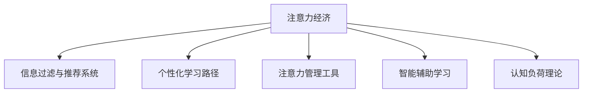

                 

# 注意力经济与个人学习方法论的革新

## 1. 背景介绍

### 1.1 问题由来

在信息爆炸的现代社会，人们面临着前所未有的知识过载。如何快速高效地从海量信息中提取有价值的内容，已成为个体在竞争激烈的市场环境中的关键能力。传统的信息检索和筛选方法已经无法满足快速变化、高度专业化的知识需求。与此同时，信息内容日益复杂多变，对人类注意力的分配提出了更高要求。

这一背景催生了"注意力经济"这一概念。注意力经济（Economy of Attention），是指在数字经济时代，信息生产与消费不再以物质产品的交换为媒介，而是以注意力交换为桥梁。在知识经济和数字经济的双重驱动下，个体如何在有限的注意力资源下，做出最优的决策，成为研究热点。

与此同时，个人学习方法论也经历了深刻变革。随着互联网技术的普及，人们获取和利用信息的方式发生了革命性变化。从线下的书籍学习、课堂教育，到线上的MOOC、开放课程，再到更为先进的AI辅助学习，个人学习方法和工具不断推陈出新。然而，面对碎片化、快速迭代的知识体系，如何构建适应个人需求的学习路径，高效利用学习资源，提升学习效率，依然是一个极具挑战性的课题。

## 2. 核心概念与联系

### 2.1 核心概念概述

为更好地理解注意力经济与个人学习方法论，我们将介绍几个关键概念：

- **注意力经济（Economy of Attention）**：指在信息过载的时代，个体注意力的价值日益凸显，成为交换信息资源的重要媒介。有效管理注意力资源，是提升信息获取效率的关键。

- **信息过滤与推荐系统**：基于用户行为数据，通过算法模型过滤无关信息，推荐相关内容。信息过滤与推荐系统是注意力经济中的重要环节，能够有效提升用户信息获取的精确度和相关性。

- **个性化学习路径**：通过分析用户的学习习惯和偏好，结合推荐系统，动态调整学习内容和顺序，构建个性化的学习路径，提升学习效率。

- **注意力管理工具**：帮助个体分配和监控注意力资源，如番茄工作法、Pomodoro 时钟、Pareto 法则等。通过这些工具，可以有效提高注意力资源的利用率。

- **智能辅助学习**：结合人工智能技术，如机器学习、自然语言处理、计算机视觉等，辅助用户进行知识发现、理解、记忆与表达。如智能笔记、虚拟助教、学习管理系统等。

- **认知负荷理论**：解释学习过程中认知资源分配的理论，即个体在学习和记忆时，注意力资源和记忆资源是有限的，需要在任务之间进行合理的分配与管理。

这些概念之间的逻辑关系可以通过以下Mermaid流程图来展示：



这个流程图展示了几大核心概念及其之间的联系：

1. 注意力经济是整个系统的背景和基础。
2. 信息过滤与推荐系统是提升信息获取效率的关键手段。
3. 个性化学习路径、注意力管理工具、智能辅助学习都是为了更好地管理注意力资源和提高学习效率。
4. 认知负荷理论则解释了注意力资源的分配和管理的科学依据。

## 3. 核心算法原理 & 具体操作步骤

### 3.1 算法原理概述

注意力经济与个人学习方法论的革新，核心在于如何高效管理和分配注意力资源。其算法原理主要基于以下两个层面：

1. **信息过滤与推荐算法**：通过分析和理解用户的行为、兴趣和需求，利用机器学习算法，预测用户对不同信息内容的偏好和评价，从而对海量信息进行筛选和推荐。
2. **个性化学习路径生成算法**：通过分析用户的学习数据，识别其知识结构、认知能力和学习习惯，结合推荐系统，动态调整学习内容和时间安排，构建个性化的学习路径。

### 3.2 算法步骤详解

**步骤1: 数据采集与预处理**

- 数据来源：社交媒体（如Twitter、Facebook）、搜索引擎（如Google、Bing）、在线学习平台（如Coursera、Udacity）、个人设备记录（如手机、电脑使用记录）等。
- 数据预处理：清洗、归一化、特征提取等。

**步骤2: 用户兴趣与行为建模**

- 基于用户的历史行为数据（如搜索记录、点击记录、浏览记录等），构建用户画像。
- 使用协同过滤、内容推荐等算法，预测用户对新内容的兴趣和评价。

**步骤3: 信息过滤与推荐**

- 结合用户画像和推荐算法，对海量信息进行过滤和筛选，生成个性化推荐列表。
- 使用模型（如Transformer、LSTM等）对推荐结果进行排序和优化，提升推荐精度和多样性。

**步骤4: 个性化学习路径生成**

- 收集用户的学习行为数据（如学习时长、进度、得分等），分析其学习习惯和偏好。
- 结合推荐系统生成的学习内容，动态调整学习顺序和时间安排，构建个性化学习路径。
- 定期评估学习效果，并根据反馈调整学习路径，不断迭代优化。

### 3.3 算法优缺点

**优点**：

- **高效信息筛选**：利用机器学习算法，对海量信息进行快速高效筛选和推荐。
- **个性化学习**：通过分析用户的学习行为，生成个性化的学习路径，提升学习效率。
- **实时动态调整**：能够实时根据用户的学习情况，动态调整学习内容和时间安排。

**缺点**：

- **隐私风险**：对用户数据的大量采集和分析，可能导致隐私泄露和数据滥用风险。
- **算法偏见**：机器学习模型可能存在算法偏见，对某些特定用户群体产生歧视或不公平。
- **资源消耗**：对大量数据进行实时处理和分析，对计算资源和存储资源有较高要求。

### 3.4 算法应用领域

注意力经济与个人学习方法论的应用领域非常广泛，以下是几个典型的应用场景：

- **在线教育平台**：如Coursera、Udacity等，通过推荐系统，个性化推荐课程和学习资源，提升学习体验和效果。
- **智能推荐系统**：如Amazon、Netflix等，利用用户行为数据，推荐商品和影视内容，提升用户满意度。
- **社交媒体平台**：如Facebook、Twitter等，通过分析用户行为，推送相关内容和广告，提升平台活跃度和用户粘性。
- **在线图书馆与书店**：如Kindle、Amazon Books等，推荐用户感兴趣的书籍和阅读资源，提升用户阅读体验。

## 4. 数学模型和公式 & 详细讲解 & 举例说明（备注：数学公式请使用latex格式，latex嵌入文中独立段落使用 $$，段落内使用 $)
### 4.1 数学模型构建

为了更好地理解和描述信息过滤与推荐系统的算法原理，我们将构建一个基于协同过滤的推荐算法模型。协同过滤算法基于用户和物品之间的相似性，进行推荐预测。模型输入包括用户历史评分和物品属性，输出为用户对新物品的评分预测。

**协同过滤算法**：

$$
\hat{y}_{ui} = \frac{\sum_{j=1}^n r_{uj}k_{ij}}{\sum_{j=1}^n k_{uj}} = \frac{\sum_{j=1}^n r_{uj}a_{ij}}{\sum_{j=1}^n a_{uj}}
$$

其中，$r_{uj}$ 为用户 $u$ 对物品 $j$ 的评分，$a_{ij}$ 为物品 $i$ 的属性特征向量与用户 $u$ 的兴趣向量之间的相似度。

### 4.2 公式推导过程

1. **用户-物品评分矩阵**：将用户与物品之间的评分数据构建为用户-物品评分矩阵 $R$。
2. **用户兴趣向量**：根据用户历史评分数据，构建用户兴趣向量 $u$。
3. **物品属性向量**：提取物品的属性特征，构建物品属性向量 $i$。
4. **相似度计算**：利用余弦相似度等方法，计算用户和物品之间的相似度 $a_{ij}$。
5. **评分预测**：利用协同过滤公式，预测用户对新物品的评分 $\hat{y}_{ui}$。

### 4.3 案例分析与讲解

**案例1: 电影推荐系统**

假设某电影平台有大量用户评分数据，我们需要为用户推荐其可能喜欢的电影。利用协同过滤算法，我们可以通过以下步骤实现：

1. 构建用户-电影评分矩阵 $R$，其中 $r_{ui}$ 为用户 $u$ 对电影 $i$ 的评分。
2. 对用户 $u$ 的历史评分数据进行分析，构建用户兴趣向量 $u$。
3. 提取电影的评分特征，构建物品属性向量 $i$。
4. 计算用户 $u$ 和电影 $i$ 之间的相似度 $a_{ij}$。
5. 根据协同过滤公式，预测用户 $u$ 对电影 $i$ 的评分 $\hat{y}_{ui}$，并根据评分排序生成推荐列表。

**案例2: 图书推荐系统**

图书推荐系统与电影推荐系统类似，可以通过协同过滤算法为用户推荐图书。具体步骤如下：

1. 构建用户-图书评分矩阵 $R$，其中 $r_{ui}$ 为用户 $u$ 对图书 $i$ 的评分。
2. 对用户 $u$ 的历史评分数据进行分析，构建用户兴趣向量 $u$。
3. 提取图书的评分特征，构建物品属性向量 $i$。
4. 计算用户 $u$ 和图书 $i$ 之间的相似度 $a_{ij}$。
5. 根据协同过滤公式，预测用户 $u$ 对图书 $i$ 的评分 $\hat{y}_{ui}$，并根据评分排序生成推荐列表。

通过这些案例分析，我们可以更好地理解协同过滤算法的应用，以及如何基于用户行为数据进行个性化推荐。

## 5. 项目实践：代码实例和详细解释说明

### 5.1 开发环境搭建

在进行注意力经济与个人学习方法论的实践时，我们需要准备好开发环境。以下是使用Python进行TensorFlow开发的典型环境配置流程：

1. 安装Anaconda：从官网下载并安装Anaconda，用于创建独立的Python环境。

2. 创建并激活虚拟环境：
```bash
conda create -n tf-env python=3.8 
conda activate tf-env
```

3. 安装TensorFlow：根据CUDA版本，从官网获取对应的安装命令。例如：
```bash
conda install tensorflow tensorflow==2.5
```

4. 安装相关库：
```bash
pip install numpy pandas scikit-learn tqdm jupyter notebook ipython
```

完成上述步骤后，即可在`tf-env`环境中开始项目实践。

### 5.2 源代码详细实现

下面以电影推荐系统为例，给出使用TensorFlow进行协同过滤算法实现的完整代码。

首先，定义协同过滤算法的评分预测函数：

```python
import tensorflow as tf

def predict_user_item_score(rated_matrix, user_vector, item_vector, num_users, num_items, num_factors):
    # 构造用户-物品评分矩阵
    u_matrix = tf.convert_to_tensor(rated_matrix)
    
    # 构造用户和物品属性向量
    user_matrix = tf.convert_to_tensor(user_vector)
    item_matrix = tf.convert_to_tensor(item_vector)
    
    # 计算用户和物品之间的相似度
    user_item_similarity = tf.matmul(user_matrix, tf.transpose(item_matrix))
    
    # 构造协同过滤公式的矩阵
    user_item_matrix = tf.multiply(u_matrix, user_item_similarity)
    
    # 计算预测评分
    y_hat = tf.reduce_sum(user_item_matrix, axis=1) / tf.reduce_sum(user_item_similarity, axis=1)
    
    # 构造预测评分矩阵
    y_hat_matrix = tf.transpose(tf.concat((user_matrix, tf.expand_dims(y_hat, axis=1)), axis=1))
    
    return y_hat_matrix
```

接着，使用TensorFlow定义协同过滤算法的优化器和损失函数：

```python
from tensorflow.keras import Model
from tensorflow.keras import losses

def train_cf_model(rated_matrix, user_vector, item_vector, num_users, num_items, num_factors, batch_size):
    # 构造评分预测模型
    model = Model(inputs=[user_vector, item_vector], outputs=predict_user_item_score(rated_matrix, user_vector, item_vector, num_users, num_items, num_factors))
    
    # 定义损失函数
    loss = losses.mean_squared_error
    
    # 编译模型
    model.compile(optimizer='adam', loss=loss)
    
    # 定义优化器
    optimizer = tf.keras.optimizers.Adam(lr=0.01)
    
    # 训练模型
    history = model.fit([user_vector, item_vector], rated_matrix, batch_size=batch_size, epochs=100, validation_split=0.2)
    
    return model
```

最后，启动协同过滤算法的训练流程：

```python
# 训练模型
model = train_cf_model(rated_matrix, user_vector, item_vector, num_users, num_items, num_factors, batch_size)
```

以上代码实现了基于协同过滤的电影推荐系统。通过TensorFlow的强大计算图机制，我们可以高效地训练和预测用户评分。

### 5.3 代码解读与分析

下面我们对关键代码的实现细节进行详细解读：

**predict_user_item_score函数**：
- 函数实现协同过滤算法的评分预测，利用用户-物品评分矩阵、用户向量、物品向量等输入，计算预测评分，并返回评分矩阵。
- 函数内部定义了评分预测模型的计算图，通过TensorFlow的矩阵操作和自动微分技术，高效计算评分预测结果。

**train_cf_model函数**：
- 函数实现协同过滤算法的模型训练，定义了损失函数、优化器、训练数据集等关键组件。
- 使用TensorFlow的模型编译和fit函数，快速训练模型，并返回训练后的模型。
- 训练过程中，通过batch_size和validation_split参数设置批处理大小和验证集比例，确保模型训练的稳定性和泛化能力。

**启动协同过滤算法的训练流程**：
- 调用train_cf_model函数，传入评分矩阵、用户向量、物品向量、用户数、物品数、因子数、批处理大小等参数，训练协同过滤模型。
- 返回训练后的模型，用于后续的电影推荐。

以上代码实现展示了TensorFlow在注意力经济与个人学习方法论中的应用潜力。利用TensorFlow的计算图和优化器，可以高效地实现复杂的推荐算法，提升推荐系统的精度和效率。

## 6. 实际应用场景

### 6.1 智慧教育平台

智慧教育平台（如Coursera、edX等）通过推荐系统，为用户推荐合适的课程和学习资源，提升学习体验和效果。在实际应用中，系统会根据用户的历史学习行为数据，构建用户画像，结合推荐算法，动态调整推荐内容。

具体而言，系统可以收集用户的学习时长、进度、得分等数据，分析其学习习惯和偏好，结合推荐系统生成的学习内容，动态调整学习顺序和时间安排，构建个性化学习路径。通过这种方式，用户能够更高效地学习，提升学习效果。

### 6.2 智能推荐系统

智能推荐系统（如Amazon、Netflix等）通过协同过滤算法和深度学习模型，为用户推荐商品和影视内容。在实际应用中，系统会根据用户的浏览、购买、评分等行为数据，构建用户画像，结合推荐算法，生成个性化的推荐列表。

例如，Amazon根据用户的浏览记录和购买历史，预测用户可能感兴趣的商品，并在首页和推荐页展示相关商品。通过这种方式，用户能够更快速地发现感兴趣的商品，提升购物体验。

### 6.3 社交媒体平台

社交媒体平台（如Facebook、Twitter等）通过分析用户的行为和兴趣，推送相关内容和广告，提升平台活跃度和用户粘性。在实际应用中，系统可以根据用户的历史行为数据，构建用户画像，结合推荐算法，生成个性化的内容推荐。

例如，Facebook根据用户的浏览记录和点赞、评论、分享等互动行为，推荐相关的新闻、视频、文章等内容。通过这种方式，用户能够更快地发现感兴趣的内容，提升平台活跃度和用户粘性。

### 6.4 未来应用展望

随着注意力经济与个人学习方法论的不断发展，未来的应用场景将更加广泛和深入。以下是几个未来应用展望：

- **跨平台学习资源整合**：未来的智慧教育平台将打破平台壁垒，整合不同平台的学习资源，构建更加全面、多元的学习体系。通过推荐系统和个性化学习路径，为学习者提供无缝切换的学习体验。
- **多模态智能辅助学习**：未来的智能辅助学习系统将融合视觉、听觉、触觉等多种感官信息，实现多模态智能辅助学习。例如，结合AR技术，将虚拟课堂和教材与现实世界相结合，提升学习效果。
- **个性化认知负荷管理**：未来的个人学习方法论将结合认知负荷理论，优化学习任务的分配和调整，减轻学习者的认知负担。例如，通过动态调整学习任务和休息时间，保持学习者的最佳学习状态。

## 7. 工具和资源推荐

### 7.1 学习资源推荐

为了帮助开发者系统掌握注意力经济与个人学习方法论的理论基础和实践技巧，这里推荐一些优质的学习资源：

1. **《深度学习与推荐系统》课程**：斯坦福大学开设的推荐系统课程，详细讲解了协同过滤、深度学习等推荐算法，适合入门学习。
2. **《推荐系统实战》书籍**：该书系统介绍了推荐系统的理论、算法和应用，并提供了丰富的代码示例，适合实践操作。
3. **Coursera、Udacity等在线课程平台**：这些平台提供了大量与推荐系统和个性化学习相关的课程，涵盖了理论、算法和实践等多个方面。
4. **Kaggle竞赛平台**：参与推荐系统竞赛，可以获得实战经验和最新算法动态，提升自己的应用能力。
5. **Github开源项目**：参与和贡献开源项目，了解最新的研究和实践进展，与社区交流学习。

通过对这些资源的学习实践，相信你一定能够系统掌握注意力经济与个人学习方法论的核心技术和应用方法，并用于解决实际的推荐系统和学习路径优化问题。

### 7.2 开发工具推荐

高效的开发离不开优秀的工具支持。以下是几款用于注意力经济与个人学习方法论开发的常用工具：

1. TensorFlow：基于Python的开源深度学习框架，具有强大的计算图机制，适合复杂的模型训练和优化。
2. PyTorch：灵活的动态计算图框架，适合快速迭代和模型验证，适合学术研究和工业应用。
3. Scikit-learn：Python机器学习库，提供丰富的算法实现和工具，适合各种数据处理和模型评估任务。
4. Jupyter Notebook：Python的交互式开发环境，支持代码、数据和可视化的综合展示，适合学习和研究。
5. Visual Studio Code：跨平台的IDE工具，支持Python和其他语言的开发，提供丰富的插件和扩展功能。

合理利用这些工具，可以显著提升注意力经济与个人学习方法论的开发效率，加速创新迭代的步伐。

### 7.3 相关论文推荐

注意力经济与个人学习方法论的研究源于学界的持续研究。以下是几篇奠基性的相关论文，推荐阅读：

1. **《协同过滤推荐系统》**：详细介绍了协同过滤算法的基本原理和实现方法，是推荐系统研究的经典之作。
2. **《基于深度学习的推荐系统》**：介绍了深度学习在推荐系统中的应用，如神经协同过滤、矩阵分解等。
3. **《认知负荷理论与学习设计》**：解释了认知负荷理论的基本原理和应用方法，为个性化学习路径的设计提供了理论基础。
4. **《基于注意力机制的推荐系统》**：引入了注意力机制，提升了推荐系统的精度和鲁棒性。
5. **《跨平台学习资源整合》**：探讨了跨平台学习资源整合的技术和方法，为智慧教育平台的构建提供了参考。

这些论文代表了大语言模型微调技术的发展脉络。通过学习这些前沿成果，可以帮助研究者把握学科前进方向，激发更多的创新灵感。

## 8. 总结：未来发展趋势与挑战

### 8.1 总结

本文对注意力经济与个人学习方法论进行了全面系统的介绍。首先阐述了注意力经济的背景和重要性，以及个人学习方法论的演进历程。其次，从原理到实践，详细讲解了协同过滤算法、个性化学习路径生成的核心技术和具体操作步骤，给出了注意力经济与个人学习方法论的完整代码实例。同时，本文还探讨了其在智慧教育平台、智能推荐系统、社交媒体平台等多个实际应用场景中的具体应用，展示了其巨大的应用潜力。

通过本文的系统梳理，可以看到，注意力经济与个人学习方法论正逐渐成为数字经济时代的重要工具，极大地提升了信息获取和知识管理的效率。这一方法论的不断演进，必将推动教育、商业、社交等领域的技术革新和业务升级。

### 8.2 未来发展趋势

展望未来，注意力经济与个人学习方法论将呈现以下几个发展趋势：

1. **跨平台整合**：未来的智慧教育平台和智能推荐系统将打破平台壁垒，整合不同平台的学习资源，构建更加全面、多元的学习体系。
2. **多模态智能辅助学习**：未来的智能辅助学习系统将融合视觉、听觉、触觉等多种感官信息，实现多模态智能辅助学习。
3. **个性化认知负荷管理**：未来的个性化学习路径将结合认知负荷理论，优化学习任务的分配和调整，减轻学习者的认知负担。
4. **深度学习与强化学习结合**：未来的推荐系统将结合深度学习和强化学习，提升推荐的精度和个性化程度。
5. **隐私保护与数据安全**：未来的注意力经济与个人学习方法论将更加注重隐私保护和数据安全，确保用户数据的保密性和合法性。
6. **自适应与动态调整**：未来的推荐系统和学习路径将更加自适应和动态调整，根据用户实时反馈和环境变化，进行持续优化。

以上趋势凸显了注意力经济与个人学习方法论的广阔前景。这些方向的探索发展，必将进一步提升信息获取和知识管理的效率，为个体和社会带来更多价值。

### 8.3 面临的挑战

尽管注意力经济与个人学习方法论已经取得了瞩目成就，但在迈向更加智能化、普适化应用的过程中，它仍面临诸多挑战：

1. **隐私保护**：大量的数据采集和分析可能导致隐私泄露和数据滥用风险，如何保护用户隐私成为关键挑战。
2. **模型公平性**：推荐系统可能存在算法偏见，对某些特定用户群体产生歧视或不公平。如何设计公平无偏的推荐算法，是亟待解决的问题。
3. **计算资源**：对大量数据进行实时处理和分析，对计算资源和存储资源有较高要求。如何高效利用资源，提升系统的可扩展性，是重要的优化方向。
4. **用户反馈机制**：如何设计有效的用户反馈机制，不断优化推荐系统和学习路径，是提升系统效果的关键。
5. **数据质量**：数据质量对推荐系统的精度和效果有重要影响，如何保证数据的质量和多样性，是推荐系统持续优化的基础。

### 8.4 研究展望

面对注意力经济与个人学习方法论面临的挑战，未来的研究需要在以下几个方面寻求新的突破：

1. **隐私保护算法**：开发更加隐私保护的推荐算法，确保用户数据的安全性和合法性。
2. **公平性优化**：设计公平无偏的推荐算法，消除算法偏见，提升推荐系统的公平性。
3. **高效计算技术**：开发高效的计算图优化技术和分布式计算框架，提升系统的可扩展性和计算效率。
4. **智能反馈机制**：设计智能化的用户反馈机制，实时调整推荐系统和学习路径，提升系统效果。
5. **多源数据融合**：结合多种数据源，提升推荐系统和学习路径的丰富性和多样性，确保数据的全面性和准确性。

这些研究方向的探索，必将引领注意力经济与个人学习方法论走向更高的台阶，为信息获取和知识管理提供更高效、更公平、更安全的解决方案。

## 9. 附录：常见问题与解答

**Q1：注意力经济与个人学习方法论适用于所有学习场景吗？**

A: 注意力经济与个人学习方法论适用于绝大多数学习场景，特别是在信息过载和知识密集型领域，其效果更为显著。例如在线教育、智能推荐系统、社交媒体平台等。但对于一些特定领域的学习场景，如医学、法律等，需要进一步结合领域知识进行优化。

**Q2：如何选择合适的推荐算法？**

A: 选择合适的推荐算法需要考虑多个因素，包括数据特性、业务需求、计算资源等。常见的推荐算法包括协同过滤、基于内容的推荐、深度学习等。协同过滤适用于有用户和物品评分数据的情况，基于内容的推荐适用于静态物品特征丰富的场景，深度学习适用于数据量较大、特征复杂的情况。需要根据具体应用场景进行选择和调整。

**Q3：推荐系统在落地部署时需要注意哪些问题？**

A: 推荐系统在落地部署时，需要注意以下几个关键问题：
1. 数据质量：确保推荐系统使用的数据质量高，能够准确反映用户行为和物品特性。
2. 模型评估：在部署前进行充分的模型评估，确保推荐系统效果稳定可靠。
3. 系统优化：进行模型剪枝、计算图优化等操作，确保系统在实际环境中的高效运行。
4. 安全防护：采用访问鉴权、数据脱敏等措施，保障数据和模型安全。
5. 用户反馈：建立用户反馈机制，根据用户反馈进行动态调整和优化。

**Q4：如何设计个性化的学习路径？**

A: 设计个性化的学习路径需要以下几个步骤：
1. 收集用户的学习行为数据，包括学习时长、进度、得分等。
2. 分析用户的学习习惯和偏好，构建用户画像。
3. 结合推荐系统生成的学习内容，动态调整学习顺序和时间安排。
4. 定期评估学习效果，根据反馈调整学习路径，不断迭代优化。

**Q5：认知负荷理论在实际应用中如何应用？**

A: 认知负荷理论在实际应用中可以通过以下方式应用：
1. 分析学习任务的任务复杂度和信息密度，确保任务设计合理，避免过载。
2. 结合学习者的认知资源，合理分配学习任务，避免负担过重。
3. 设计适当的休息和复习策略，帮助学习者维持最佳学习状态。
4. 根据学习效果反馈，动态调整学习任务和休息时间，优化学习路径。

通过这些问题的解答，相信你能够更好地理解和应用注意力经济与个人学习方法论，提升学习效率和效果。

---

作者：禅与计算机程序设计艺术 / Zen and the Art of Computer Programming

