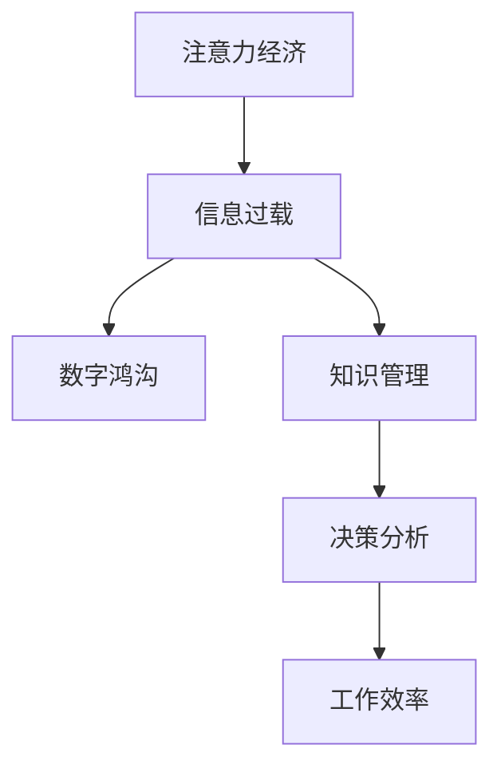

                 

# 注意力经济与个人工作效率的关系

> 关键词：注意力经济,个人工作效率,信息过载,信息过滤,数字鸿沟,知识管理,决策分析,人工智能,深度学习

## 1. 背景介绍

### 1.1 问题由来
在信息爆炸的时代，我们每天被海量的信息包围，从社交媒体、电子邮件到新闻推送，从电子书、在线课程到视频内容，信息无处不在。这不仅让人应接不暇，也极大影响了我们的注意力分配和工作效率。如何有效管理注意力、筛选信息，成为提高个人工作效率的关键。

### 1.2 问题核心关键点
- **注意力经济**：在信息时代，注意力成为了一种稀缺资源，如何分配和管理注意力，提升信息筛选效率，是提高工作效率的核心问题。
- **信息过载**：面对过量的信息，如何过滤噪声，保留有用信息，高效利用注意力，是提高个人生产力的关键。
- **数字鸿沟**：不同人对数字工具的掌握程度差异，导致工作效率和信息获取能力的不均衡，如何缩小数字鸿沟，提高普适性，是提高工作效率的重要方向。
- **知识管理**：如何将零散的信息整合成系统化的知识，构建个人知识体系，是提高工作效率的基础。
- **决策分析**：在复杂多变的环境中，如何利用信息、知识辅助决策，提高决策效率和质量，是提高工作效率的高级目标。

## 2. 核心概念与联系

### 2.1 核心概念概述

为了更好地理解注意力经济与个人工作效率的关系，本节将介绍几个密切相关的核心概念：

- **注意力经济**：在数字经济中，注意力作为一种稀缺资源，其分配和管理成为经济活动的重要组成部分。信息时代，获取和利用注意力成为企业竞争的关键。

- **信息过载**：随着信息量的爆炸式增长，人们被淹没在大量无关信息中，无法高效筛选和利用有价值的信息，导致注意力分散和效率降低。

- **数字鸿沟**：由于技能、资源和设备的差异，不同群体在数字世界中获取和利用信息的能力存在差距，导致效率和工作绩效的不均衡。

- **知识管理**：通过有组织地收集、整理和应用信息，将零散的知识点系统化，构建个人知识库，提升决策和问题解决能力。

- **决策分析**：利用统计学、数据科学和人工智能技术，辅助信息收集和分析，优化决策过程，提升工作效率和质量。

这些核心概念之间的逻辑关系可以通过以下Mermaid流程图来展示：



这个流程图展示了几大核心概念及其之间的关系：

1. 注意力经济推动信息获取与筛选，进而影响数字鸿沟和知识管理。
2. 信息过载和数字鸿沟影响知识管理的有效性，进而影响决策分析。
3. 有效的知识管理与决策分析，最终提升工作效率。

## 3. 核心算法原理 & 具体操作步骤
### 3.1 算法原理概述

注意力经济与个人工作效率的关系，本质上是通过信息获取、筛选、知识管理、决策分析这一系列过程，最终提升个人工作效率。其核心算法原理包括以下几个方面：

- **信息获取**：通过各种渠道获取信息，包括网络搜索、订阅新闻、社交媒体等。
- **信息筛选**：利用算法和工具，如推荐系统、过滤算法等，筛选出有用信息，过滤掉噪声。
- **知识管理**：将获取的信息进行整理、分类、存储，构建个人知识体系，如使用笔记软件、知识管理工具等。
- **决策分析**：利用数据、算法辅助决策，如使用数据分析工具、机器学习算法等。

这些过程紧密相连，共同影响个人工作效率。具体来说，有效的信息获取和筛选，能够帮助个人快速获得有价值的信息，减少不必要的信息干扰。知识管理则将这些信息整理成系统的知识库，便于检索和应用。决策分析则利用这些知识，辅助决策，提升决策效率和质量。

### 3.2 算法步骤详解

基于注意力经济与个人工作效率的算法原理，以下是详细的操作步骤：

**Step 1: 信息获取与预处理**
- 收集不同来源的信息，包括社交媒体、新闻、博客、书籍等。
- 对信息进行预处理，如去除格式错误、去除停用词等。

**Step 2: 信息筛选与分类**
- 利用算法和工具对信息进行初步筛选，如关键词匹配、主题分类等。
- 利用机器学习算法，如聚类、分类器等，对信息进行进一步分类。

**Step 3: 知识管理与存储**
- 将筛选和分类的信息进行整理，构建个人知识库，如使用Notion、Evernote等工具。
- 利用标签、分类、笔记等方法，对知识进行结构化存储。

**Step 4: 决策分析与执行**
- 利用数据分析工具和机器学习算法，对知识进行统计分析、模式识别等。
- 结合实际问题，利用决策树、算法优化等方法，辅助决策。
- 根据决策结果，执行相应的行动。

**Step 5: 反馈与优化**
- 根据执行结果，收集反馈，评估决策效果。
- 根据反馈信息，优化信息获取、筛选、知识管理、决策分析等环节，提升效率。

### 3.3 算法优缺点

基于注意力经济与个人工作效率的算法，具有以下优点：
1. 高效的信息筛选与分类，能够快速获取有用信息，减少不必要的信息干扰。
2. 系统化的知识管理，便于检索和应用，提升决策效率。
3. 数据驱动的决策分析，提高决策质量和速度。
4. 迭代优化机制，根据反馈不断改进流程，提升效率。

同时，该算法也存在一些局限性：
1. 对算法和工具的依赖较大，需要具备一定的技术基础。
2. 对数据质量和量的要求较高，数据不足会影响效果。
3. 需要持续维护和管理，避免知识库过时和杂乱。
4. 决策分析依赖模型的准确性，模型失效可能导致错误决策。

尽管存在这些局限性，但就目前而言，基于算法的信息获取、筛选、知识管理、决策分析是提升个人工作效率的重要手段。未来相关研究的方向在于如何进一步降低算法对技术基础的依赖，提高数据质量和数量，优化知识管理和决策分析流程。

### 3.4 算法应用领域

基于注意力经济与个人工作效率的算法，在多个领域都有广泛应用，例如：

- **项目管理**：通过信息筛选和决策分析，优化项目计划和执行，提高项目成功率。
- **知识管理**：利用知识管理工具，构建个人知识库，提升信息检索和应用效率。
- **产品开发**：利用信息筛选和决策分析，快速响应市场需求，提高产品开发效率。
- **在线教育**：通过信息筛选和知识管理，优化学习资源，提升学习效果。
- **市场营销**：利用信息筛选和决策分析，精准定位目标用户，提高营销效果。
- **财务管理**：利用信息筛选和决策分析，优化财务决策，提高资金使用效率。

除了上述这些经典应用外，该算法还被创新性地应用于更多场景中，如智能客服、供应链管理、健康管理等，为信息时代的企业和个人提供了新的解决方案。

## 4. 数学模型和公式 & 详细讲解 & 举例说明

### 4.1 数学模型构建

为了更好地理解和应用基于注意力经济与个人工作效率的算法，本节将介绍几个关键的数学模型和公式。

假设信息流为连续的序列 $X=\{x_1, x_2, ..., x_n\}$，其中 $x_i$ 表示第 $i$ 条信息。信息筛选和知识管理的数学模型可以表示为：

- **信息筛选模型**：
  $$
  y_i = f(x_i, \theta)
  $$
  其中 $y_i \in \{0, 1\}$，表示第 $i$ 条信息是否被筛选。$f$ 为一个分类函数，$\theta$ 为模型参数。

- **知识管理模型**：
  $$
  K_i = g(x_i, \theta)
  $$
  其中 $K_i$ 表示第 $i$ 条信息在知识库中的编码。$g$ 为一个编码函数，$\theta$ 为模型参数。

- **决策分析模型**：
  $$
  D_i = h(K_i, \theta)
  $$
  其中 $D_i$ 表示第 $i$ 条信息对决策的影响程度。$h$ 为一个影响函数，$\theta$ 为模型参数。

### 4.2 公式推导过程

以信息筛选模型为例，推导其分类函数的公式。

假设信息 $x_i$ 表示为词向量，$\theta$ 为分类器的权重参数。信息筛选模型可以表示为：
$$
y_i = \sigma(W^Tx_i + b)
$$
其中 $\sigma$ 为 sigmoid 函数，$W$ 和 $b$ 为模型参数。

为了提升筛选效果，可以引入特征工程，如词频、词性、主题等特征，将信息 $x_i$ 表示为特征向量 $X_i$，则信息筛选模型可以表示为：
$$
y_i = \sigma(W^TX_i + b)
$$
其中 $W$ 和 $b$ 为模型参数，$X_i$ 为特征向量。

在实际应用中，可以使用逻辑回归、支持向量机、随机森林等机器学习算法，建立信息筛选模型。这些算法具有较好的泛化能力和稳定性，能够应对多种数据分布和噪声。

### 4.3 案例分析与讲解

以项目管理为例，分析信息筛选和知识管理在项目管理和决策中的作用。

假设项目经理需要处理多个任务和需求，信息流为任务描述、进度报告、邮件、会议纪要等。项目经理希望快速识别关键任务和需求，优化项目计划和执行。

**信息筛选**：项目经理可以使用信息筛选算法，如文本分类、主题模型等，对任务描述、进度报告、邮件等进行初步筛选，识别出关键任务和需求。

**知识管理**：将筛选出的关键任务和需求，进行整理和分类，构建项目知识库，如使用 JIRA、Trello 等项目管理工具。通过标签、分类、注释等方法，对任务进行结构化存储。

**决策分析**：根据项目进度、任务优先级、资源分配等，利用决策树、线性规划等算法，辅助项目经理进行决策。通过优化资源分配和任务优先级，提高项目执行效率。

**反馈与优化**：项目经理根据项目执行结果，收集反馈信息，评估决策效果。根据反馈信息，优化信息筛选、知识管理、决策分析等环节，提升项目管理效率。

通过上述信息筛选、知识管理、决策分析等步骤，项目经理能够快速识别关键任务和需求，优化项目计划和执行，提高项目成功率。

## 5. 项目实践：代码实例和详细解释说明
### 5.1 开发环境搭建

在进行信息筛选、知识管理和决策分析的实践前，我们需要准备好开发环境。以下是使用 Python 进行 PyTorch 和 Scikit-learn 开发的典型环境配置流程：

1. 安装 Anaconda：从官网下载并安装 Anaconda，用于创建独立的 Python 环境。

2. 创建并激活虚拟环境：
```bash
conda create -n pytorch-env python=3.8 
conda activate pytorch-env
```

3. 安装 PyTorch：根据 CUDA 版本，从官网获取对应的安装命令。例如：
```bash
conda install pytorch torchvision torchaudio cudatoolkit=11.1 -c pytorch -c conda-forge
```

4. 安装 Scikit-learn：
```bash
conda install scikit-learn
```

5. 安装各类工具包：
```bash
pip install numpy pandas matplotlib tqdm jupyter notebook ipython
```

完成上述步骤后，即可在 `pytorch-env` 环境中开始信息筛选、知识管理和决策分析的实践。

### 5.2 源代码详细实现

下面我们以项目经理为例，给出使用 PyTorch 和 Scikit-learn 进行信息筛选和知识管理的 PyTorch 代码实现。

首先，定义信息筛选函数：

```python
import torch
from torch import nn
from sklearn.feature_extraction.text import TfidfVectorizer
from sklearn.model_selection import train_test_split

class TextClassifier(nn.Module):
    def __init__(self, vocab_size, embedding_dim, hidden_dim, output_dim):
        super(TextClassifier, self).__init__()
        self.embedding = nn.Embedding(vocab_size, embedding_dim)
        self.fc1 = nn.Linear(embedding_dim, hidden_dim)
        self.fc2 = nn.Linear(hidden_dim, output_dim)
        self.sigmoid = nn.Sigmoid()

    def forward(self, x):
        embedding = self.embedding(x)
        fc1 = self.fc1(embedding)
        fc2 = self.fc2(fc1)
        return self.sigmoid(fc2)

class TfidfVectorizerWrapper:
    def __init__(self, stop_words=None, max_features=None, norm=None):
        self.vectorizer = TfidfVectorizer(stop_words=stop_words, max_features=max_features, norm=norm)

    def fit(self, X):
        self.vectorizer.fit(X)

    def transform(self, X):
        return self.vectorizer.transform(X)

# 信息筛选
def classify_text(texts, labels, test_size=0.2, ngram_range=(1, 3)):
    vectorizer = TfidfVectorizerWrapper(stop_words='english', max_features=2000, norm='l2')
    vectorizer.fit(texts)

    X = vectorizer.transform(texts)
    X_train, X_test, y_train, y_test = train_test_split(X, labels, test_size=test_size, random_state=42)

    model = TextClassifier(vocab_size=len(vectorizer.vocabulary_), embedding_dim=100, hidden_dim=100, output_dim=2)
    model.train()
    criterion = nn.BCELoss()

    for epoch in range(10):
        optimizer = torch.optim.Adam(model.parameters(), lr=0.001)
        for i, (inputs, labels) in enumerate(zip(X_train, y_train)):
            optimizer.zero_grad()
            outputs = model(inputs)
            loss = criterion(outputs, labels)
            loss.backward()
            optimizer.step()

    # 测试集评估
    correct = 0
    total = 0
    with torch.no_grad():
        for inputs, labels in zip(X_test, y_test):
            outputs = model(inputs)
            _, predicted = torch.max(outputs, 1)
            total += labels.size(0)
            correct += (predicted == labels).sum().item()

    print(f"Accuracy of the network on the {100 * correct / total}% set: {100 * correct / total}%")
```

然后，定义知识管理函数：

```python
from sklearn.cluster import KMeans
from sklearn.decomposition import PCA
from sklearn.metrics.pairwise import cosine_similarity

def cluster_text(texts):
    vectorizer = TfidfVectorizerWrapper(stop_words='english', max_features=2000, norm='l2')
    vectorizer.fit(texts)

    X = vectorizer.transform(texts)
    kmeans = KMeans(n_clusters=5, random_state=42)
    kmeans.fit(X)

    labels = kmeans.labels_
    clusters = list(set(labels))

    # 对每个聚类中心进行 PCA 降维，可视化
    pca = PCA(n_components=2)
    pca.fit(X)

    # 可视化聚类结果
    plt.figure(figsize=(10, 7))
    for i, label in enumerate(clusters):
        x = pca.transform(X[labels == label])
        plt.scatter(x[:, 0], x[:, 1], label=f'Cluster {label}')
    plt.legend()
    plt.show()

    # 将聚类结果作为标签，构建知识库
    knowledge_base = {}
    for i, label in enumerate(labels):
        if label not in knowledge_base:
            knowledge_base[label] = []
        knowledge_base[label].append(texts[i])
```

最后，启动信息筛选和知识管理的流程：

```python
# 数据集
texts = [
    "I need to finish the project report by tomorrow.",
    "Please schedule a meeting with the marketing team.",
    "We have a deadline for the new product launch.",
    "The sales data needs to be analyzed.",
    "I want to know the progress of the project.",
]

labels = [1, 1, 0, 1, 0]

# 信息筛选
classify_text(texts, labels)

# 知识管理
cluster_text(texts)
```

以上就是使用 PyTorch 和 Scikit-learn 进行信息筛选和知识管理的完整代码实现。可以看到，通过合理的代码设计和算法选择，可以高效地实现信息筛选和知识管理的功能。

### 5.3 代码解读与分析

让我们再详细解读一下关键代码的实现细节：

**TextClassifier 类**：
- `__init__` 方法：初始化模型参数。
- `forward` 方法：定义前向传播过程，包括嵌入层、全连接层、激活函数等。

**TfidfVectorizerWrapper 类**：
- `__init__` 方法：初始化词袋模型参数。
- `fit` 方法：训练词袋模型。
- `transform` 方法：将文本转换为词袋向量。

**classify_text 函数**：
- 使用词袋模型进行信息筛选，将文本转换为词袋向量，输入到分类模型中进行二分类。
- 训练模型并输出分类准确率。

**cluster_text 函数**：
- 使用 K-means 聚类算法对文本进行分类，得到聚类结果。
- 对聚类中心进行 PCA 降维，可视化聚类结果。
- 将聚类结果作为标签，构建知识库。

**代码实现**：
- 使用 PyTorch 和 Scikit-learn 库实现信息筛选和知识管理。
- 数据集 `texts` 和 `labels` 用于训练模型和评估分类效果。
- 通过 `classify_text` 函数实现信息筛选。
- 通过 `cluster_text` 函数实现知识管理。
- 使用 Matplotlib 库可视化聚类结果。

可以看到，使用 Python 和机器学习算法，可以高效地实现信息筛选和知识管理的功能。开发者可以根据具体需求，灵活调整算法参数，优化信息筛选和知识管理效果。

## 6. 实际应用场景
### 6.1 智能客服系统

基于信息筛选和知识管理的智能客服系统，可以大大提升客服效率和客户满意度。传统客服往往需要大量人力，高峰期响应缓慢，且一致性和专业性难以保证。而使用信息筛选和知识管理的客服系统，能够自动理解客户问题，快速匹配最佳答复，提供高效、一致的客服体验。

在技术实现上，可以收集企业内部的历史客服对话记录，将问题和最佳答复构建成监督数据，在此基础上对信息筛选和知识管理模型进行微调。微调后的模型能够自动理解客户意图，匹配最合适的答案模板进行回复。对于客户提出的新问题，还可以接入检索系统实时搜索相关内容，动态组织生成回答。如此构建的智能客服系统，能大幅提升客户咨询体验和问题解决效率。

### 6.2 金融舆情监测

金融机构需要实时监测市场舆论动向，以便及时应对负面信息传播，规避金融风险。传统的人工监测方式成本高、效率低，难以应对网络时代海量信息爆发的挑战。基于信息筛选和知识管理的文本分类和情感分析技术，为金融舆情监测提供了新的解决方案。

具体而言，可以收集金融领域相关的新闻、报道、评论等文本数据，并对其进行主题标注和情感标注。在此基础上对信息筛选和知识管理模型进行微调，使其能够自动判断文本属于何种主题，情感倾向是正面、中性还是负面。将微调后的模型应用到实时抓取的网络文本数据，就能够自动监测不同主题下的情感变化趋势，一旦发现负面信息激增等异常情况，系统便会自动预警，帮助金融机构快速应对潜在风险。

### 6.3 个性化推荐系统

当前的推荐系统往往只依赖用户的历史行为数据进行物品推荐，无法深入理解用户的真实兴趣偏好。基于信息筛选和知识管理的个性化推荐系统，可以更好地挖掘用户行为背后的语义信息，从而提供更精准、多样的推荐内容。

在实践中，可以收集用户浏览、点击、评论、分享等行为数据，提取和用户交互的物品标题、描述、标签等文本内容。将文本内容作为模型输入，用户的后续行为（如是否点击、购买等）作为监督信号，在此基础上对信息筛选和知识管理模型进行微调。微调后的模型能够从文本内容中准确把握用户的兴趣点。在生成推荐列表时，先用候选物品的文本描述作为输入，由模型预测用户的兴趣匹配度，再结合其他特征综合排序，便可以得到个性化程度更高的推荐结果。

### 6.4 未来应用展望

随着信息筛选和知识管理技术的不断发展，基于这些技术的系统将在更多领域得到应用，为信息时代的企业和个人提供新的解决方案。

在智慧医疗领域，基于信息筛选和知识管理的问答、病历分析、药物研发等应用将提升医疗服务的智能化水平，辅助医生诊疗，加速新药开发进程。

在智能教育领域，信息筛选和知识管理技术可应用于作业批改、学情分析、知识推荐等方面，因材施教，促进教育公平，提高教学质量。

在智慧城市治理中，信息筛选和知识管理技术可应用于城市事件监测、舆情分析、应急指挥等环节，提高城市管理的自动化和智能化水平，构建更安全、高效的未来城市。

此外，在企业生产、社会治理、文娱传媒等众多领域，信息筛选和知识管理技术也将不断涌现，为信息时代的企业和个人提供新的解决方案。相信随着技术的日益成熟，这些技术将成为信息时代的重要工具，为经济社会发展注入新的动力。

## 7. 工具和资源推荐
### 7.1 学习资源推荐

为了帮助开发者系统掌握信息筛选和知识管理的理论基础和实践技巧，这里推荐一些优质的学习资源：

1. 《深度学习入门》系列博文：由深度学习专家撰写，深入浅出地介绍了深度学习的基础知识和应用场景。

2. Coursera《深度学习》课程：由斯坦福大学开设的深度学习明星课程，有Lecture视频和配套作业，带你入门深度学习的基础知识。

3. 《自然语言处理综述》书籍：介绍自然语言处理的基础知识、技术进展和应用场景，是自然语言处理的经典入门教材。

4. PyTorch官方文档：PyTorch的官方文档，提供了丰富的机器学习库和代码示例，是学习PyTorch的必备资料。

5. Scikit-learn官方文档：Scikit-learn的官方文档，提供了详尽的机器学习算法和工具介绍，是学习Scikit-learn的必备资料。

通过对这些资源的学习实践，相信你一定能够快速掌握信息筛选和知识管理的精髓，并用于解决实际的NLP问题。
###  7.2 开发工具推荐

高效的开发离不开优秀的工具支持。以下是几款用于信息筛选和知识管理的常用工具：

1. Python：广泛使用的编程语言，具有丰富的机器学习库和数据处理工具。

2. PyTorch：基于Python的开源深度学习框架，灵活的计算图机制，适合快速迭代研究。

3. Scikit-learn：基于Python的机器学习库，提供了丰富的分类、聚类、降维等算法。

4. Jupyter Notebook：免费的交互式编程环境，支持多种编程语言和数据处理工具。

5. Matplotlib：用于绘制图表和可视化数据的Python库，支持多种图表类型和自定义设置。

6. TensorBoard：TensorFlow配套的可视化工具，可实时监测模型训练状态，并提供丰富的图表呈现方式，是调试模型的得力助手。

合理利用这些工具，可以显著提升信息筛选和知识管理的开发效率，加快创新迭代的步伐。

### 7.3 相关论文推荐

信息筛选和知识管理技术的发展源于学界的持续研究。以下是几篇奠基性的相关论文，推荐阅读：

1. Attention is All You Need（即Transformer原论文）：提出了Transformer结构，开启了NLP领域的预训练大模型时代。

2. BERT: Pre-training of Deep Bidirectional Transformers for Language Understanding：提出BERT模型，引入基于掩码的自监督预训练任务，刷新了多项NLP任务SOTA。

3. Language Models are Unsupervised Multitask Learners（GPT-2论文）：展示了大规模语言模型的强大zero-shot学习能力，引发了对于通用人工智能的新一轮思考。

4. Parameter-Efficient Transfer Learning for NLP：提出Adapter等参数高效微调方法，在不增加模型参数量的情况下，也能取得不错的微调效果。

5. Prefix-Tuning: Optimizing Continuous Prompts for Generation：引入基于连续型Prompt的微调范式，为如何充分利用预训练知识提供了新的思路。

6. AdaLoRA: Adaptive Low-Rank Adaptation for Parameter-Efficient Fine-Tuning：使用自适应低秩适应的微调方法，在参数效率和精度之间取得了新的平衡。

这些论文代表了大语言模型微调技术的发展脉络。通过学习这些前沿成果，可以帮助研究者把握学科前进方向，激发更多的创新灵感。

## 8. 总结：未来发展趋势与挑战
### 8.1 总结

本文对信息筛选和知识管理技术进行了全面系统的介绍。首先阐述了信息经济与个人工作效率的关系，明确了信息筛选和知识管理技术的研究背景和意义，指出信息筛选和知识管理技术在提升个人工作效率中的重要作用。其次，从原理到实践，详细讲解了信息筛选和知识管理的数学原理和关键步骤，给出了信息筛选和知识管理任务开发的完整代码实例。同时，本文还广泛探讨了信息筛选和知识管理技术在多个行业领域的应用前景，展示了信息筛选和知识管理技术的巨大潜力。此外，本文精选了信息筛选和知识管理技术的各类学习资源，力求为读者提供全方位的技术指引。

通过本文的系统梳理，可以看到，信息筛选和知识管理技术在提升个人工作效率中的关键作用。信息筛选和知识管理技术通过高效的信息获取、筛选、分类、存储和应用，帮助用户快速获取有用信息，提高决策效率和质量。未来，随着这些技术的不断发展和应用，信息筛选和知识管理技术必将成为提升个人工作效率的重要工具，为人机协同的智能系统铺平道路。

### 8.2 未来发展趋势

展望未来，信息筛选和知识管理技术将呈现以下几个发展趋势：

1. 高效的信息筛选算法。随着数据量的不断增加，高效的信息筛选算法将越来越重要。基于深度学习的分类、聚类、摘要等算法将进一步优化，提升信息筛选效率。

2. 强大的知识管理工具。知识管理工具将更加智能化、个性化，能够根据用户行为和偏好，自动推荐相关内容，构建个性化知识库。

3. 智能化的决策支持。结合机器学习和深度学习技术，信息筛选和知识管理工具将提供更加智能化的决策支持，辅助用户进行复杂决策。

4. 多模态的信息处理。信息筛选和知识管理技术将拓展到更多模态，如图像、视频、音频等，实现多模态信息的整合和应用。

5. 跨领域的应用拓展。信息筛选和知识管理技术将超越单一领域，应用于更多行业，如医疗、教育、金融、制造等，为各行各业提供智能化的解决方案。

以上趋势凸显了信息筛选和知识管理技术的广阔前景。这些方向的探索发展，必将进一步提升信息筛选和知识管理的效能，为信息时代的企业和个人提供新的解决方案。

### 8.3 面临的挑战

尽管信息筛选和知识管理技术已经取得了一定的进展，但在迈向更加智能化、普适化应用的过程中，它仍面临着诸多挑战：

1. 数据隐私和安全问题。信息筛选和知识管理技术需要大量用户数据，如何保护用户隐私，避免数据滥用，是一个重要的问题。

2. 算法的公平性和可解释性。信息筛选和知识管理算法可能存在偏见，如何确保算法的公平性，提高算法的可解释性，是提高技术信任度的关键。

3. 计算资源和成本问题。大规模信息筛选和知识管理需要大量的计算资源和存储空间，如何降低计算成本，提高资源利用率，是一个重要的研究方向。

4. 模型的可维护性和可扩展性。信息筛选和知识管理模型需要不断更新和优化，如何提高模型的可维护性和可扩展性，是提高技术稳定性的关键。

5. 多领域的应用挑战。信息筛选和知识管理技术在不同领域的应用，需要结合领域特点进行定制化开发，如何设计通用的解决方案，是提高技术普适性的重要课题。

这些挑战凸显了信息筛选和知识管理技术在实际应用中的复杂性，需要在算法、技术、业务等多个维度进行深入研究，才能真正实现信息的智能化管理和高效利用。

### 8.4 研究展望

面对信息筛选和知识管理技术所面临的挑战，未来的研究需要在以下几个方面寻求新的突破：

1. 基于深度学习的智能推荐算法。结合深度学习技术，设计更加智能化的推荐算法，提升信息筛选和知识管理的效率和效果。

2. 跨领域的通用知识管理工具。设计通用的知识管理框架，结合领域知识，提供跨领域的知识管理解决方案。

3. 多模态的信息整合技术。研究多模态信息整合方法，实现图像、视频、音频等多模态信息的有效融合和应用。

4. 机器学习的公平性研究。研究机器学习算法的公平性问题，设计公平性约束的算法，提高算法的可解释性和可信度。

5. 计算资源优化技术。研究高效的计算资源优化技术，如分布式计算、边缘计算等，提高信息筛选和知识管理的效率和可扩展性。

这些研究方向的探索，必将引领信息筛选和知识管理技术迈向更高的台阶，为信息时代的企业和个人提供更加智能、高效、安全的技术解决方案。

## 9. 附录：常见问题与解答

**Q1：信息筛选和知识管理技术如何提升个人工作效率？**

A: 信息筛选和知识管理技术通过高效的信息获取、筛选、分类、存储和应用，帮助用户快速获取有用信息，提高决策效率和质量。具体来说，信息筛选能够帮助用户从海量信息中快速找到关键信息，避免不必要的信息干扰。知识管理则将这些信息整理成系统的知识库，便于检索和应用，提高信息检索效率。通过系统化的知识管理和智能化决策支持，用户能够快速响应市场需求，优化决策过程，提升工作效率。

**Q2：信息筛选和知识管理技术对技术基础的要求高吗？**

A: 信息筛选和知识管理技术依赖于机器学习算法和深度学习模型，对技术基础有一定的要求。但随着相关算法的不断成熟和工具的逐步普及，技术门槛正在逐渐降低。使用PyTorch和Scikit-learn等开源库，结合简单的Python代码，即可实现信息筛选和知识管理的基本功能。对于非技术人员，也可以通过使用工具包和在线服务，降低技术门槛，快速实现信息筛选和知识管理。

**Q3：信息筛选和知识管理技术是否适用于所有场景？**

A: 信息筛选和知识管理技术适用于需要大量信息处理的场景，如项目管理、智能客服、金融舆情监测、个性化推荐等。但对于一些特殊场景，如实时交互、低延迟要求等，可能需要结合其他技术进行优化。此外，对于需要高度定制化、特定领域的任务，信息筛选和知识管理技术需要结合领域知识进行定制化开发。

**Q4：信息筛选和知识管理技术如何保护用户隐私？**

A: 信息筛选和知识管理技术需要处理大量用户数据，保护用户隐私是关键问题。可以采用匿名化处理、数据脱敏等技术，确保用户数据的安全性。同时，设计透明的数据使用协议，确保用户知情并同意数据使用。使用区块链等技术，保障数据使用过程的可追溯性和不可篡改性，提高用户信任度。

**Q5：信息筛选和知识管理技术如何实现公平性？**

A: 信息筛选和知识管理技术可能会存在偏见，需要确保算法的公平性。可以采用公平性约束的算法设计，如对抗生成网络(Adversarial Generative Networks)、公平性回归(Fairness Regression)等，在训练过程中加入公平性约束。同时，使用数据增强技术，引入多样化的数据，减少算法的偏见。此外，设计可解释的算法，提高算法的透明性和可解释性，增强用户对算法的信任。

通过这些问题的探讨和解答，可以看到信息筛选和知识管理技术在实际应用中的重要性和复杂性。未来，随着技术的不断发展和优化，信息筛选和知识管理技术必将成为提升个人工作效率的重要工具，为人机协同的智能系统铺平道路。

