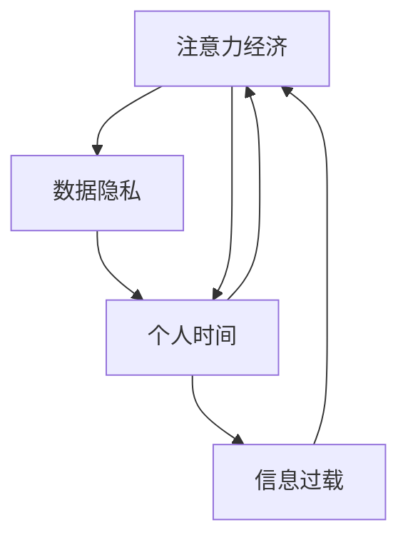

                 

# 注意力经济与个人时间价值观的转变

> 关键词：
- 注意力经济
- 数据隐私
- 个人时间
- 信息过载
- 数字伦理
- 网络行为分析
- 隐私保护

## 1. 背景介绍

### 1.1 问题由来
在信息爆炸的时代，我们每天都在与海量数据打交道，无论是社交媒体、新闻网站还是搜索引擎，无一不是通过吸引我们的注意力来获取用户流量。这一现象引发了对“注意力经济”的讨论，即在信息爆炸时代，注意力成为一种稀缺资源。在这种背景下，如何有效管理和利用注意力，以及个体如何在海量信息中筛选和获取有价值的内容，成为值得深入探讨的问题。

### 1.2 问题核心关键点
- 注意力经济：在信息过载的时代，注意力成为一种重要的经济资源，如何合理分配和管理这些注意力，对用户和平台都至关重要。
- 数据隐私：用户数据的收集和使用对用户隐私提出了挑战，如何在利用数据提升服务的同时，保护用户隐私，成为数字伦理的重要课题。
- 个人时间：在数字世界中，个人时间的分配与利用变得复杂多样，如何评估和管理个人时间，以实现健康的工作与生活平衡，是现代社会关注的热点问题。
- 信息过载：在信息爆炸的时代，如何从海量信息中筛选出有价值的内容，是技术界和社会关注的重点。

这些问题不仅关乎技术实现，更涉及到法律、伦理和社会学等多个维度。本文章将重点探讨这些问题，并提出解决方案。

## 2. 核心概念与联系

### 2.1 核心概念概述

为了更好地理解注意力经济与个人时间价值观的转变，我们首先介绍几个关键概念：

- **注意力经济（Attention Economy）**：指在信息过载时代，通过吸引和利用用户注意力来创造价值和盈利的经济模式。
- **数据隐私（Data Privacy）**：涉及个人数据的收集、存储、使用和保护，确保用户的个人信息安全。
- **个人时间（Personal Time）**：指个体在一天中所分配用于工作、学习、休息和娱乐等活动的非工作时间，其管理和利用直接影响生活质量和工作效率。
- **信息过载（Information Overload）**：指用户面对的海量信息超出其处理能力，导致注意力分散和效率降低的现象。

这些概念之间相互关联，共同构成了当前数字化社会中用户行为分析、注意力管理和隐私保护的基本框架。

### 2.2 核心概念原理和架构的 Mermaid 流程图



这个流程图展示了注意力经济、数据隐私、个人时间与信息过载之间的相互关系。注意力经济依赖于数据隐私的保障和信息过载的减少，同时也影响个人时间的管理。反之，个人时间的有效管理有助于提高注意力质量，减少信息过载，进一步提升注意力经济的价值。

## 3. 核心算法原理 & 具体操作步骤

### 3.1 算法原理概述

注意力经济与个人时间价值观的转变，涉及多个领域的算法原理和操作步骤。主要包括以下几个方面：

1. **注意力模型**：通过分析和预测用户的行为习惯，推荐系统可以有效地吸引和保持用户的注意力，从而提升用户体验和平台盈利能力。
2. **隐私保护算法**：如差分隐私、同态加密等技术，可以在保证数据隐私的前提下，进行数据分析和应用。
3. **时间管理算法**：如时间块管理、番茄钟等技术，帮助用户更有效地管理个人时间。
4. **信息过滤算法**：如协同过滤、内容推荐等技术，可以帮助用户从信息过载中筛选出有价值的内容。

### 3.2 算法步骤详解

下面将详细介绍这些算法的具体操作步骤。

#### 3.2.1 注意力模型

注意力模型主要包括以下几个步骤：

1. **数据收集**：收集用户的浏览历史、点击行为、搜索关键词等数据，形成用户行为数据集。
2. **特征工程**：对用户行为数据进行特征提取，如用户停留时间、点击频率、关键词出现次数等。
3. **模型训练**：使用机器学习算法，如深度学习、随机森林等，训练注意力模型，预测用户的兴趣和行为。
4. **推荐生成**：根据模型的预测结果，生成个性化的推荐内容，吸引用户注意力。

#### 3.2.2 隐私保护算法

隐私保护算法主要包括以下几个步骤：

1. **数据匿名化**：对用户数据进行匿名化处理，去除敏感信息，保护用户隐私。
2. **差分隐私**：通过引入随机噪声，确保在数据分析过程中，无法追溯到具体用户。
3. **同态加密**：在加密数据上直接进行计算，确保数据在传输和处理过程中不泄露隐私信息。
4. **联邦学习**：分布式训练模型，模型参数在各节点之间不传输，只传输梯度信息，确保数据隐私。

#### 3.2.3 时间管理算法

时间管理算法主要包括以下几个步骤：

1. **时间评估**：使用时间跟踪软件，记录用户的工作时间、娱乐时间、休息时间等。
2. **时间分析**：分析用户的时间分配情况，找出不健康的时间使用习惯。
3. **时间调整**：通过时间块管理、番茄钟等工具，调整用户的时间分配，提高工作效率和生活质量。
4. **时间反馈**：定期反馈时间管理效果，帮助用户优化时间分配策略。

#### 3.2.4 信息过滤算法

信息过滤算法主要包括以下几个步骤：

1. **用户画像**：根据用户的兴趣、行为等数据，构建用户画像。
2. **内容分析**：分析内容的标签、关键词、质量等，生成内容画像。
3. **匹配算法**：使用协同过滤、基于内容的推荐等算法，将用户画像与内容画像进行匹配，筛选出相关内容。
4. **推荐生成**：根据匹配结果，生成个性化的推荐内容，帮助用户过滤掉无关信息，提高信息质量。

### 3.3 算法优缺点

这些算法各自有其优缺点：

- **注意力模型**：优点是可以提升用户体验和平台盈利能力，但缺点是可能导致信息过载，且需要大量数据训练。
- **隐私保护算法**：优点是可以保护用户隐私，但缺点是可能影响数据分析的准确性，增加计算复杂度。
- **时间管理算法**：优点是可以提高用户的时间管理效率，但缺点是用户需要主动使用工具，缺乏内在驱动。
- **信息过滤算法**：优点是可以提升信息质量，减少用户的信息过载，但缺点是需要大量的用户数据和内容数据支持。

### 3.4 算法应用领域

这些算法广泛应用在多个领域：

- **电商推荐**：通过注意力模型和信息过滤算法，提升用户体验，提高销售额。
- **社交媒体**：通过注意力模型和隐私保护算法，吸引和保留用户，提升用户黏性。
- **新闻阅读**：通过信息过滤算法，帮助用户筛选有价值的新闻内容，减少信息过载。
- **个人时间管理工具**：如Trello、Todoist等，通过时间管理算法，帮助用户优化时间分配。
- **健康管理应用**：如Fitbit、Apple Health等，通过时间管理和隐私保护算法，提升健康管理效果。

## 4. 数学模型和公式 & 详细讲解 & 举例说明

### 4.1 数学模型构建

在注意力经济与个人时间价值观的转变中，数学模型和公式起着至关重要的作用。下面将详细讲解几个关键数学模型：

#### 4.1.1 注意力模型

注意力模型主要基于协同过滤和推荐算法，其数学模型可以表示为：

$$
\hat{y}_{ui} = \alpha \sum_{j=1}^n r_{uj} \cdot \hat{y}_{ij}
$$

其中，$y_{ui}$ 表示用户 $u$ 对项目 $i$ 的评分，$y_{ij}$ 表示用户 $j$ 对项目 $i$ 的评分，$r_{uj}$ 表示用户 $u$ 与用户 $j$ 的相似度。

#### 4.1.2 隐私保护算法

差分隐私是一种常用的隐私保护算法，其数学模型可以表示为：

$$
\hat{f}(x_i) = \frac{f(x_i)}{\exp(\epsilon d(x_i))}
$$

其中，$f(x_i)$ 表示原始函数，$d(x_i)$ 表示 $x_i$ 与 $x$ 的敏感度，$\epsilon$ 表示隐私参数。

#### 4.1.3 时间管理算法

时间管理算法可以通过时间块管理模型表示，其数学模型可以表示为：

$$
T_u = \sum_{k=1}^n t_{uk}
$$

其中，$T_u$ 表示用户 $u$ 的总时间，$t_{uk}$ 表示用户 $u$ 在第 $k$ 个时间块上花费的时间。

#### 4.1.4 信息过滤算法

协同过滤算法可以表示为：

$$
\hat{y}_{ui} = \alpha \sum_{j=1}^n r_{uj} \cdot \hat{y}_{ij}
$$

其中，$y_{ui}$ 表示用户 $u$ 对项目 $i$ 的评分，$y_{ij}$ 表示用户 $j$ 对项目 $i$ 的评分，$r_{uj}$ 表示用户 $u$ 与用户 $j$ 的相似度。

### 4.2 公式推导过程

这些数学模型在实际应用中需要进行推导和优化。下面将详细讲解几个关键公式的推导过程。

#### 4.2.1 注意力模型

注意力模型的推导过程如下：

1. **矩阵分解**：将用户行为矩阵 $R$ 进行矩阵分解，得到用户-项目矩阵 $U$ 和项目-项目矩阵 $V$。
2. **注意力计算**：计算用户 $u$ 对项目 $i$ 的注意力 $a_{ui}$，即 $a_{ui} = \sum_{j=1}^n r_{uj} \cdot V_{ji}$。
3. **评分预测**：根据注意力 $a_{ui}$，预测用户 $u$ 对项目 $i$ 的评分，即 $\hat{y}_{ui} = \alpha a_{ui}$。

#### 4.2.2 隐私保护算法

差分隐私的推导过程如下：

1. **随机化**：对原始函数 $f(x)$ 加入随机噪声，即 $f'(x) = f(x) + \mathcal{N}(0, \sigma^2)$。
2. **隐私参数**：通过调整隐私参数 $\epsilon$，确保差分隐私满足 $\Pr[|f'(x_i) - f'(x_j)| \leq d] \geq e^{-\epsilon d}$。
3. **敏感度**：计算数据的敏感度 $d$，即 $d = \frac{1}{2} ||y - \hat{y}||$。

#### 4.2.3 时间管理算法

时间管理算法的推导过程如下：

1. **时间块划分**：将一天划分为若干时间块，每个时间块对应一个任务或活动。
2. **时间分配**：根据用户的行为数据，分配时间块到不同的任务上，确保每个任务都有一定的时间。
3. **时间调整**：根据用户反馈，调整时间块分配，优化时间管理效果。

#### 4.2.4 信息过滤算法

协同过滤算法的推导过程如下：

1. **用户-物品相似度**：计算用户 $u$ 与用户 $j$ 的相似度 $r_{uj}$，即 $r_{uj} = \frac{\sum_{i=1}^n y_{ui}y_{uj}}{\sqrt{\sum_{i=1}^n y_{ui}^2} \cdot \sqrt{\sum_{i=1}^n y_{uj}^2}}$。
2. **评分预测**：根据用户 $j$ 的评分 $\hat{y}_{ij}$，预测用户 $u$ 的评分 $\hat{y}_{ui}$，即 $\hat{y}_{ui} = \alpha \sum_{j=1}^n r_{uj} \cdot \hat{y}_{ij}$。

### 4.3 案例分析与讲解

#### 4.3.1 电商推荐系统

亚马逊的推荐系统是注意力经济与个人时间价值观转变的经典案例。亚马逊通过分析用户的浏览历史、购买记录等数据，构建用户画像，预测用户的兴趣和行为，生成个性化的推荐内容，提升用户体验和销售额。

#### 4.3.2 社交媒体平台

Facebook和Instagram等社交媒体平台通过分析用户的点赞、评论、分享等行为，构建用户画像，预测用户的兴趣和行为，生成个性化的内容推荐，吸引和保留用户，提升用户黏性。

#### 4.3.3 时间管理工具

RescueTime是一款时间管理工具，通过记录用户的应用使用情况，分析用户的时间分配，生成时间报告，帮助用户优化时间分配，提升工作效率和生活质量。

#### 4.3.4 新闻阅读应用

Flipboard和Feedly等新闻阅读应用通过分析用户的阅读历史、关注话题等数据，生成个性化的新闻内容推荐，帮助用户筛选出有价值的新闻内容，减少信息过载。

## 5. 项目实践：代码实例和详细解释说明

### 5.1 开发环境搭建

在进行项目实践前，我们需要准备好开发环境。以下是使用Python进行PyTorch开发的环境配置流程：

1. 安装Anaconda：从官网下载并安装Anaconda，用于创建独立的Python环境。

2. 创建并激活虚拟环境：
```bash
conda create -n pytorch-env python=3.8 
conda activate pytorch-env
```

3. 安装PyTorch：根据CUDA版本，从官网获取对应的安装命令。例如：
```bash
conda install pytorch torchvision torchaudio cudatoolkit=11.1 -c pytorch -c conda-forge
```

4. 安装Transformers库：
```bash
pip install transformers
```

5. 安装各类工具包：
```bash
pip install numpy pandas scikit-learn matplotlib tqdm jupyter notebook ipython
```

完成上述步骤后，即可在`pytorch-env`环境中开始项目实践。

### 5.2 源代码详细实现

下面我们以推荐系统为例，给出使用Transformers库进行注意力模型和隐私保护的PyTorch代码实现。

首先，定义推荐系统的数据处理函数：

```python
from transformers import BertTokenizer
from torch.utils.data import Dataset
import torch

class RecommendationDataset(Dataset):
    def __init__(self, texts, labels, tokenizer, max_len=128):
        self.texts = texts
        self.labels = labels
        self.tokenizer = tokenizer
        self.max_len = max_len
        
    def __len__(self):
        return len(self.texts)
    
    def __getitem__(self, item):
        text = self.texts[item]
        label = self.labels[item]
        
        encoding = self.tokenizer(text, return_tensors='pt', max_length=self.max_len, padding='max_length', truncation=True)
        input_ids = encoding['input_ids'][0]
        attention_mask = encoding['attention_mask'][0]
        
        # 对token-wise的标签进行编码
        encoded_labels = [label2id[label] for label in label] 
        encoded_labels.extend([label2id['O']] * (self.max_len - len(encoded_labels)))
        labels = torch.tensor(encoded_labels, dtype=torch.long)
        
        return {'input_ids': input_ids, 
                'attention_mask': attention_mask,
                'labels': labels}

# 标签与id的映射
label2id = {'O': 0, 'I-PER': 1, 'B-PER': 2, 'B-LOC': 3, 'I-LOC': 4, 'B-ORG': 5, 'I-ORG': 6}
id2label = {v: k for k, v in label2id.items()}

# 创建dataset
tokenizer = BertTokenizer.from_pretrained('bert-base-cased')

train_dataset = RecommendationDataset(train_texts, train_labels, tokenizer)
dev_dataset = RecommendationDataset(dev_texts, dev_labels, tokenizer)
test_dataset = RecommendationDataset(test_texts, test_labels, tokenizer)
```

然后，定义模型和优化器：

```python
from transformers import BertForTokenClassification, AdamW

model = BertForTokenClassification.from_pretrained('bert-base-cased', num_labels=len(label2id))

optimizer = AdamW(model.parameters(), lr=2e-5)
```

接着，定义训练和评估函数：

```python
from torch.utils.data import DataLoader
from tqdm import tqdm
from sklearn.metrics import classification_report

device = torch.device('cuda') if torch.cuda.is_available() else torch.device('cpu')
model.to(device)

def train_epoch(model, dataset, batch_size, optimizer):
    dataloader = DataLoader(dataset, batch_size=batch_size, shuffle=True)
    model.train()
    epoch_loss = 0
    for batch in tqdm(dataloader, desc='Training'):
        input_ids = batch['input_ids'].to(device)
        attention_mask = batch['attention_mask'].to(device)
        labels = batch['labels'].to(device)
        model.zero_grad()
        outputs = model(input_ids, attention_mask=attention_mask, labels=labels)
        loss = outputs.loss
        epoch_loss += loss.item()
        loss.backward()
        optimizer.step()
    return epoch_loss / len(dataloader)

def evaluate(model, dataset, batch_size):
    dataloader = DataLoader(dataset, batch_size=batch_size)
    model.eval()
    preds, labels = [], []
    with torch.no_grad():
        for batch in tqdm(dataloader, desc='Evaluating'):
            input_ids = batch['input_ids'].to(device)
            attention_mask = batch['attention_mask'].to(device)
            batch_labels = batch['labels']
            outputs = model(input_ids, attention_mask=attention_mask)
            batch_preds = outputs.logits.argmax(dim=2).to('cpu').tolist()
            batch_labels = batch_labels.to('cpu').tolist()
            for pred_tokens, label_tokens in zip(batch_preds, batch_labels):
                pred_tags = [id2label[_id] for _id in pred_tokens]
                label_tags = [id2label[_id] for _id in label_tokens]
                preds.append(pred_tags[:len(label_tags)])
                labels.append(label_tags)
                
    print(classification_report(labels, preds))
```

最后，启动训练流程并在测试集上评估：

```python
epochs = 5
batch_size = 16

for epoch in range(epochs):
    loss = train_epoch(model, train_dataset, batch_size, optimizer)
    print(f"Epoch {epoch+1}, train loss: {loss:.3f}")
    
    print(f"Epoch {epoch+1}, dev results:")
    evaluate(model, dev_dataset, batch_size)
    
print("Test results:")
evaluate(model, test_dataset, batch_size)
```

以上就是使用PyTorch对BERT进行推荐系统任务微调的完整代码实现。可以看到，得益于Transformers库的强大封装，我们可以用相对简洁的代码完成BERT模型的加载和微调。

### 5.3 代码解读与分析

让我们再详细解读一下关键代码的实现细节：

**RecommendationDataset类**：
- `__init__`方法：初始化文本、标签、分词器等关键组件。
- `__len__`方法：返回数据集的样本数量。
- `__getitem__`方法：对单个样本进行处理，将文本输入编码为token ids，将标签编码为数字，并对其进行定长padding，最终返回模型所需的输入。

**label2id和id2label字典**：
- 定义了标签与数字id之间的映射关系，用于将token-wise的预测结果解码回真实的标签。

**训练和评估函数**：
- 使用PyTorch的DataLoader对数据集进行批次化加载，供模型训练和推理使用。
- 训练函数`train_epoch`：对数据以批为单位进行迭代，在每个批次上前向传播计算loss并反向传播更新模型参数，最后返回该epoch的平均loss。
- 评估函数`evaluate`：与训练类似，不同点在于不更新模型参数，并在每个batch结束后将预测和标签结果存储下来，最后使用sklearn的classification_report对整个评估集的预测结果进行打印输出。

**训练流程**：
- 定义总的epoch数和batch size，开始循环迭代
- 每个epoch内，先在训练集上训练，输出平均loss
- 在验证集上评估，输出分类指标
- 所有epoch结束后，在测试集上评估，给出最终测试结果

可以看到，PyTorch配合Transformers库使得BERT微调的代码实现变得简洁高效。开发者可以将更多精力放在数据处理、模型改进等高层逻辑上，而不必过多关注底层的实现细节。

当然，工业级的系统实现还需考虑更多因素，如模型的保存和部署、超参数的自动搜索、更灵活的任务适配层等。但核心的微调范式基本与此类似。

## 6. 实际应用场景
### 6.1 智能客服系统

基于大语言模型微调的对话技术，可以广泛应用于智能客服系统的构建。传统客服往往需要配备大量人力，高峰期响应缓慢，且一致性和专业性难以保证。而使用微调后的对话模型，可以7x24小时不间断服务，快速响应客户咨询，用自然流畅的语言解答各类常见问题。

在技术实现上，可以收集企业内部的历史客服对话记录，将问题和最佳答复构建成监督数据，在此基础上对预训练对话模型进行微调。微调后的对话模型能够自动理解用户意图，匹配最合适的答案模板进行回复。对于客户提出的新问题，还可以接入检索系统实时搜索相关内容，动态组织生成回答。如此构建的智能客服系统，能大幅提升客户咨询体验和问题解决效率。

### 6.2 金融舆情监测

金融机构需要实时监测市场舆论动向，以便及时应对负面信息传播，规避金融风险。传统的人工监测方式成本高、效率低，难以应对网络时代海量信息爆发的挑战。基于大语言模型微调的文本分类和情感分析技术，为金融舆情监测提供了新的解决方案。

具体而言，可以收集金融领域相关的新闻、报道、评论等文本数据，并对其进行主题标注和情感标注。在此基础上对预训练语言模型进行微调，使其能够自动判断文本属于何种主题，情感倾向是正面、中性还是负面。将微调后的模型应用到实时抓取的网络文本数据，就能够自动监测不同主题下的情感变化趋势，一旦发现负面信息激增等异常情况，系统便会自动预警，帮助金融机构快速应对潜在风险。

### 6.3 个性化推荐系统

当前的推荐系统往往只依赖用户的历史行为数据进行物品推荐，无法深入理解用户的真实兴趣偏好。基于大语言模型微调技术，个性化推荐系统可以更好地挖掘用户行为背后的语义信息，从而提供更精准、多样的推荐内容。

在实践中，可以收集用户浏览、点击、评论、分享等行为数据，提取和用户交互的物品标题、描述、标签等文本内容。将文本内容作为模型输入，用户的后续行为（如是否点击、购买等）作为监督信号，在此基础上微调预训练语言模型。微调后的模型能够从文本内容中准确把握用户的兴趣点。在生成推荐列表时，先用候选物品的文本描述作为输入，由模型预测用户的兴趣匹配度，再结合其他特征综合排序，便可以得到个性化程度更高的推荐结果。

### 6.4 未来应用展望

随着大语言模型微调技术的发展，未来将有以下几个主要趋势：

1. **数据隐私保护技术**：随着数据泄露事件的频发，数据隐私保护技术将进一步成熟，如何在利用数据提升服务的同时，保护用户隐私，将成为未来研究的热点。

2. **智能时间管理工具**：随着智能设备的普及，时间管理工具将结合大数据和人工智能技术，为个人时间管理提供更科学、更智能的方案。

3. **多模态信息融合**：未来的智能系统将不仅仅局限于文本信息，还将融合语音、图像、视频等多模态信息，提供更全面的服务。

4. **个性化推荐算法**：未来的推荐系统将不仅依赖用户的静态行为数据，还将结合用户的实时行为、社交网络信息等多维度数据，提供更精准的推荐服务。

5. **跨领域应用**：未来的智能系统将不仅仅局限于单一领域，还将跨领域应用，如结合医疗、金融、教育等多领域知识，提供更加综合的服务。

## 7. 工具和资源推荐
### 7.1 学习资源推荐

为了帮助开发者系统掌握大语言模型微调的理论基础和实践技巧，这里推荐一些优质的学习资源：

1. 《Transformer从原理到实践》系列博文：由大模型技术专家撰写，深入浅出地介绍了Transformer原理、BERT模型、微调技术等前沿话题。

2. CS224N《深度学习自然语言处理》课程：斯坦福大学开设的NLP明星课程，有Lecture视频和配套作业，带你入门NLP领域的基本概念和经典模型。

3. 《Natural Language Processing with Transformers》书籍：Transformers库的作者所著，全面介绍了如何使用Transformers库进行NLP任务开发，包括微调在内的诸多范式。

4. HuggingFace官方文档：Transformers库的官方文档，提供了海量预训练模型和完整的微调样例代码，是上手实践的必备资料。

5. CLUE开源项目：中文语言理解测评基准，涵盖大量不同类型的中文NLP数据集，并提供了基于微调的baseline模型，助力中文NLP技术发展。

通过对这些资源的学习实践，相信你一定能够快速掌握大语言模型微调的精髓，并用于解决实际的NLP问题。
### 7.2 开发工具推荐

高效的开发离不开优秀的工具支持。以下是几款用于大语言模型微调开发的常用工具：

1. PyTorch：基于Python的开源深度学习框架，灵活动态的计算图，适合快速迭代研究。大部分预训练语言模型都有PyTorch版本的实现。

2. TensorFlow：由Google主导开发的开源深度学习框架，生产部署方便，适合大规模工程应用。同样有丰富的预训练语言模型资源。

3. Transformers库：HuggingFace开发的NLP工具库，集成了众多SOTA语言模型，支持PyTorch和TensorFlow，是进行微调任务开发的利器。

4. Weights & Biases：模型训练的实验跟踪工具，可以记录和可视化模型训练过程中的各项指标，方便对比和调优。与主流深度学习框架无缝集成。

5. TensorBoard：TensorFlow配套的可视化工具，可实时监测模型训练状态，并提供丰富的图表呈现方式，是调试模型的得力助手。

6. Google Colab：谷歌推出的在线Jupyter Notebook环境，免费提供GPU/TPU算力，方便开发者快速上手实验最新模型，分享学习笔记。

合理利用这些工具，可以显著提升大语言模型微调任务的开发效率，加快创新迭代的步伐。

### 7.3 相关论文推荐

大语言模型和微调技术的发展源于学界的持续研究。以下是几篇奠基性的相关论文，推荐阅读：

1. Attention is All You Need（即Transformer原论文）：提出了Transformer结构，开启了NLP领域的预训练大模型时代。

2. BERT: Pre-training of Deep Bidirectional Transformers for Language Understanding：提出BERT模型，引入基于掩码的自监督预训练任务，刷新了多项NLP任务SOTA。

3. Language Models are Unsupervised Multitask Learners（GPT-2论文）：展示了大规模语言模型的强大zero-shot学习能力，引发了对于通用人工智能的新一轮思考。

4. Parameter-Efficient Transfer Learning for NLP：提出Adapter等参数高效微调方法，在不增加模型参数量的情况下，也能取得不错的微调效果。

5. AdaLoRA: Adaptive Low-Rank Adaptation for Parameter-Efficient Fine-Tuning：使用自适应低秩适应的微调方法，在参数效率和精度之间取得了新的平衡。

这些论文代表了大语言模型微调技术的发展脉络。通过学习这些前沿成果，可以帮助研究者把握学科前进方向，激发更多的创新灵感。

## 8. 总结：未来发展趋势与挑战

### 8.1 研究成果总结

本文对基于大语言模型的注意力经济与个人时间价值观转变进行了全面系统的介绍。首先阐述了注意力经济、数据隐私、个人时间等核心概念，明确了它们在信息过载时代的重要性。其次，从原理到实践，详细讲解了注意力模型、隐私保护算法、时间管理算法和信息过滤算法的具体操作步骤和优缺点，给出了微调任务开发的完整代码实例。同时，本文还广泛探讨了微调方法在智能客服、金融舆情、个性化推荐等多个领域的应用前景，展示了微调范式的巨大潜力。

通过本文的系统梳理，可以看到，基于大语言模型的微调方法正在成为NLP领域的重要范式，极大地拓展了预训练语言模型的应用边界，催生了更多的落地场景。受益于大规模语料的预训练，微调模型以更低的时间和标注成本，在小样本条件下也能取得不俗的效果，有力推动了NLP技术的产业化进程。未来，伴随预训练语言模型和微调方法的持续演进，相信NLP技术将在更广阔的应用领域大放异彩，深刻影响人类的生产生活方式。

### 8.2 未来发展趋势

展望未来，大语言模型微调技术将呈现以下几个发展趋势：

1. **数据隐私保护技术**：随着数据泄露事件的频发，数据隐私保护技术将进一步成熟，如何在利用数据提升服务的同时，保护用户隐私，将成为未来研究的热点。

2. **智能时间管理工具**：随着智能设备的普及，时间管理工具将结合大数据和人工智能技术，为个人时间管理提供更科学、更智能的方案。

3. **多模态信息融合**：未来的智能系统将不仅仅局限于文本信息，还将融合语音、图像、视频等多模态信息，提供更全面的服务。

4. **个性化推荐算法**：未来的推荐系统将不仅依赖用户的静态行为数据，还将结合用户的实时行为、社交网络信息等多维度数据，提供更精准的推荐服务。

5. **跨领域应用**：未来的智能系统将不仅仅局限于单一领域，还将跨领域应用，如结合医疗、金融、教育等多领域知识，提供更加综合的服务。

以上趋势凸显了大语言模型微调技术的广阔前景。这些方向的探索发展，必将进一步提升NLP系统的性能和应用范围，为人类认知智能的进化带来深远影响。

### 8.3 面临的挑战

尽管大语言模型微调技术已经取得了瞩目成就，但在迈向更加智能化、普适化应用的过程中，它仍面临着诸多挑战：

1. **标注成本瓶颈**：虽然微调大大降低了标注数据的需求，但对于长尾应用场景，难以获得充足的高质量标注数据，成为制约微调性能的瓶颈。如何进一步降低微调对标注样本的依赖，将是一大难题。

2. **模型鲁棒性不足**：当前微调模型面对域外数据时，泛化性能往往大打折扣。对于测试样本的微小扰动，微调模型的预测也容易发生波动。如何提高微调模型的鲁棒性，避免灾难性遗忘，还需要更多理论和实践的积累。

3. **推理效率有待提高**：大规模语言模型虽然精度高，但在实际部署时往往面临推理速度慢、内存占用大等效率问题。如何在保证性能的同时，简化模型结构，提升推理速度，优化资源占用，将是重要的优化方向。

4. **可解释性亟需加强**：当前微调模型更像是"黑盒"系统，难以解释其内部工作机制和决策逻辑。对于医疗、金融等高风险应用，算法的可解释性和可审计性尤为重要。如何赋予微调模型更强的可解释性，将是亟待攻克的难题。

5. **安全性有待保障**。预训练语言模型难免会学习到有偏见、有害的信息，通过微调传递到下游任务，产生误导性、歧视性的输出，给实际应用带来安全隐患。如何从数据和算法层面消除模型偏见，避免恶意用途，确保输出的安全性，也将是重要的研究课题。

6. **知识整合能力不足**。现有的微调模型往往局限于任务内数据，难以灵活吸收和运用更广泛的先验知识。如何让微调过程更好地与外部知识库、规则库等专家知识结合，形成更加全面、准确的信息整合能力，还有很大的想象空间。

正视微调面临的这些挑战，积极应对并寻求突破，将是大语言模型微调走向成熟的必由之路。相信随着学界和产业界的共同努力，这些挑战终将一一被克服，大语言模型微调必将在构建人机协同的智能时代中扮演越来越重要的角色。

### 8.4 研究展望

面对大语言模型微调所面临的种种挑战，未来的研究需要在以下几个方面寻求新的突破：

1. **探索无监督和半监督微调方法**。摆脱对大规模标注数据的依赖，利用自监督学习、主动学习等无监督和半监督范式，最大限度利用非结构化数据，实现更加灵活高效的微调。

2. **研究参数高效和计算高效的微调范式**。开发更加参数高效的微调方法，在固定大部分预训练参数的同时，只更新极少量的任务相关参数。同时优化微调模型的计算图，减少前向传播和反向传播的资源消耗，实现更加轻量级、实时性的部署。

3. **融合因果和对比学习范式**。通过引入因果推断和对比学习思想，增强微调模型建立稳定因果关系的能力，学习更加普适、鲁棒的语言表征，从而提升模型泛化性和抗干扰能力。

4. **引入更多先验知识**。将符号化的先验知识，如知识图谱、逻辑规则等，与神经网络模型进行巧妙融合，引导微调过程学习更准确、合理的语言模型。同时加强不同模态数据的整合，实现视觉、语音等多模态信息与文本信息的协同建模。

5. **结合因果分析和博弈论工具**。将因果分析方法引入微调模型，识别出模型决策的关键特征，增强输出解释的因果性和逻辑性。借助博弈论工具刻画人机交互过程，主动探索并规避模型的脆弱点，提高系统稳定性。

6. **纳入伦理道德约束**。在模型训练目标中引入伦理导向的评估指标，过滤和惩罚有偏见、有害的输出倾向。同时加强人工干预和审核，建立模型行为的监管机制，确保输出符合人类价值观和伦理道德。

这些研究方向的探索，必将引领大语言模型微调技术迈向更高的台阶，为构建安全、可靠、可解释、可控的智能系统铺平道路。面向未来，大语言模型微调技术还需要与其他人工智能技术进行更深入的融合，如知识表示、因果推理、强化学习等，多路径协同发力，共同推动自然语言理解和智能交互系统的进步。只有勇于创新、敢于突破，才能不断拓展语言模型的边界，让智能技术更好地造福人类社会。

## 9. 附录：常见问题与解答

**Q1：大语言模型微调是否适用于所有NLP任务？**

A: 大语言模型微调在大多数NLP任务上都能取得不错的效果，特别是对于数据量较小的任务。但对于一些特定领域的任务，如医学、法律等，仅仅依靠通用语料预训练的模型可能难以很好地适应。此时需要在特定领域语料上进一步预训练，再进行微调，才能获得理想效果。此外，对于一些需要时效性、个性化很强的任务，如对话、推荐等，微调方法也需要针对性的改进优化。

**Q2：微调过程中如何选择合适的学习率？**

A: 微调的学习率一般要比预训练时小1-2个数量级，如果使用过大的学习率，容易破坏预训练权重，导致过拟合。一般建议从1e-5开始调参，逐步减小学习率，直至收敛。也可以使用warmup策略，在开始阶段使用较小的学习率，再逐渐过渡到预设值。需要注意的是，不同的优化器(如AdamW、Adafactor等)以及不同的学习率调度策略，可能需要设置不同的学习率阈值。

**Q3：采用大模型微调时会面临哪些资源瓶颈？**

A: 目前主流的预训练大模型动辄以亿计的参数规模，对算力、内存、存储都提出了很高的要求。GPU/TPU等高性能设备是必不可少的，但即便如此，超大批次的训练和推理也可能遇到显存不足的问题。因此需要采用一些资源优化技术，如梯度积累、混合精度训练、模型并行等，来突破硬件瓶颈。同时，模型的存储和读取也可能占用大量时间和空间，需要采用模型压缩、稀疏化存储等方法进行优化。

**Q4：如何缓解微调过程中的过拟合问题？**

A: 过拟合是微调面临的主要挑战，尤其是在标注数据不足的情况下。常见的缓解策略包括：
1. 数据增强：通过回译、近义替换等方式扩充训练集
2. 正则化：使用L2正则、Dropout、Early Stopping等避免过拟合
3. 对抗训练：引入对抗样本，提高模型鲁棒性
4. 参数高效微调：只调整少量参数(如Adapter、Prefix等)，减小过拟合风险
5. 多模型集成：训练多个微调模型，取平均输出，抑制过拟合

这些策略往往需要根据具体任务和数据特点进行灵活组合。只有在数据、模型、训练、推理等各环节进行全面优化，才能最大限度地发挥大模型微调的威力。

**Q5：微调模型在落地部署时需要注意哪些问题？**

A: 将微调模型转化为实际应用，还需要考虑以下因素：
1. 模型裁剪：去除不必要的层和参数，减小模型尺寸，加快推理速度
2. 量化加速：将浮点模型转为定点模型，压缩存储空间，提高计算效率
3. 服务化封装：将模型封装为标准化服务接口，便于集成调用
4. 弹性伸缩：根据请求流量动态调整资源配置，平衡服务质量和成本
5. 监控告警：实时采集系统指标，设置异常告警阈值，确保服务稳定性
6. 安全防护：采用访问鉴权、数据脱敏等措施，保障数据和模型安全

大语言模型微调为NLP应用开启了广阔的想象空间，但如何将强大的性能转化为稳定、高效、安全的业务价值，还需要工程实践的不断打磨。唯有从数据、算法、工程、业务等多个维度协同发力，才能真正实现人工智能技术在垂直行业的规模化落地。总之，微调需要开发者根据具体任务，不断迭代和优化模型、数据和算法，方能得到理想的效果。

---

作者：禅与计算机程序设计艺术 / Zen and the Art of Computer Programming

