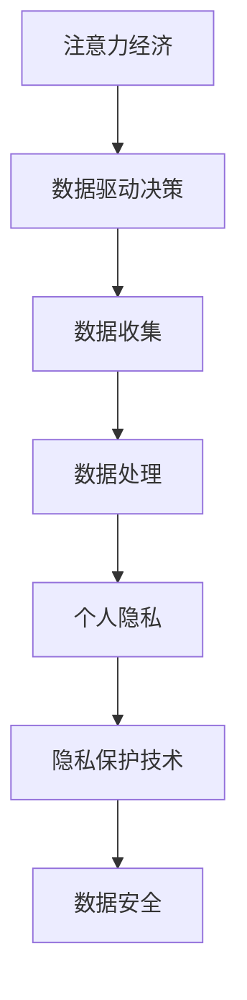

                 

# 注意力经济与个人隐私保护的平衡

> 关键词：注意力经济, 个人隐私, 隐私保护, 数据驱动, 数据安全, 伦理道德

## 1. 背景介绍

### 1.1 问题由来

在信息化高速发展的时代，数据成为了最为重要的资产之一。特别是在数字化转型加速的当下，企业通过数据驱动决策，成为获得竞争优势的关键。而注意力经济，即通过获取和集中用户的注意力，从而实现商业价值的目标，已经成为各行各业争夺用户的重要手段。

然而，注意力经济在为企业带来商业成功的同时，也引发了一系列关于个人隐私保护的担忧。用户在使用各种应用和平台时，往往需要提供大量的个人信息，而这些数据往往会被用于分析用户行为，并定向推送广告，甚至可能被滥用导致个人隐私泄露。如何在利用数据获取经济利益的同时，保障用户的隐私安全，成为当前技术和社会共同面临的挑战。

### 1.2 问题核心关键点

个人隐私保护的关注点主要集中在以下几个方面：

- **数据收集的透明性**：用户在提供数据时，是否有足够的知情权，是否明确了解数据的用途和处理方式。
- **数据使用的限制**：数据仅用于特定的商业目的，而不是被随意滥用或出售给第三方。
- **数据的匿名化处理**：对于敏感数据，是否采用了适当的去标识化方法，以确保数据的安全性。
- **用户的控制权**：用户是否能够自主决定数据的共享和删除，并有权随时撤回其同意。

这些关键点涉及技术、法律、伦理等多个层面，需要多方协同努力，才能在注意力经济中实现个人隐私的保护与平衡。

## 2. 核心概念与联系

### 2.1 核心概念概述

为更好地理解如何在注意力经济中平衡个人隐私保护，本节将介绍几个密切相关的核心概念：

- **注意力经济**：通过吸引用户注意力，利用用户的行为数据创造商业价值的过程。主要关注用户的点击、浏览、购买等行为。
- **个人隐私**：指个人数据在未经同意的情况下，不被泄露或滥用的权利。包括个人信息、位置、行为等各类数据。
- **隐私保护技术**：指采用技术手段，保障个人隐私不被未授权的访问、使用和传播的技术，如数据加密、匿名化处理、差分隐私等。
- **数据驱动决策**：利用大数据和机器学习技术，辅助企业进行业务决策和产品优化。
- **数据安全**：指通过技术和管理措施，保障数据在传输和存储过程中的安全性。

这些概念之间的逻辑关系可以通过以下Mermaid流程图来展示：



这个流程图展示了几大核心概念及其之间的关系：

1. 注意力经济通过数据驱动决策获取用户行为数据。
2. 数据驱动决策中的数据收集、处理过程需保障个人隐私。
3. 隐私保护技术为数据驱动决策中的隐私保障提供技术支撑。
4. 数据安全是数据驱动决策和隐私保护的基础。

这些核心概念共同构成了注意力经济中的隐私保护框架，使得技术手段能够在保障用户隐私的前提下，发挥数据的商业价值。

## 3. 核心算法原理 & 具体操作步骤

### 3.1 算法原理概述

在注意力经济中，个人隐私保护的核心在于数据收集和处理过程中的透明性和限制性。主要算法原理包括：

- **差分隐私**：通过在数据中引入噪声，使得任何单一数据对整体数据分布的影响极小，从而保障数据匿名化。
- **匿名化技术**：如k-匿名化、l-多样性等，通过限制数据中相似个体数量，确保数据不可识别性。
- **同态加密**：在加密状态下直接进行数据计算，解密后结果不受影响，从而保障数据在传输过程中的安全性。
- **联邦学习**：多设备或多机构间共享模型参数，而非数据本身，从而在保护数据隐私的同时，实现模型训练和更新。

这些算法原理通过技术手段，在数据驱动决策和注意力经济中实现个人隐私保护。

### 3.2 算法步骤详解

以下以差分隐私算法为例，详细介绍其实现步骤：

1. **数据收集与预处理**：收集用户行为数据，并进行去标识化处理，如删除或替换敏感信息。
2. **引入噪声**：在去标识化数据中引入噪声，通常采用拉普拉斯机制或高斯机制，引入噪声的大小由参数 $\epsilon$ 决定。
3. **数据查询**：对噪声化后的数据进行统计查询，如计算平均点击率、购买率等。
4. **结果解算**：通过逆标准化等方法，将查询结果还原为真实的统计值。

具体实现步骤如下：

**Step 1: 准备数据和噪声参数**
- 收集用户行为数据 $D$，如点击率、购买率等。
- 设定噪声参数 $\epsilon$，根据具体应用需求选择合适的噪声机制。

**Step 2: 引入噪声**
- 对于每个数据点 $d_i \in D$，计算其敏感度 $\Delta_i$。
- 根据噪声机制计算噪声值 $N_i$，将原始数据 $d_i$ 和噪声值 $N_i$ 相加，得到噪声化数据 $\tilde{d}_i$。

**Step 3: 查询统计数据**
- 对噪声化数据 $\tilde{D}$ 进行统计查询，得到查询结果 $\hat{Q}$。

**Step 4: 解算真实值**
- 通过逆标准化等方法，将查询结果 $\hat{Q}$ 还原为真实的统计值 $Q$。

### 3.3 算法优缺点

差分隐私算法在实现个人隐私保护方面具有以下优点：

1. **隐私保护性高**：通过引入噪声，使得任何单一数据对整体数据分布的影响极小，保障数据匿名化。
2. **适用范围广**：可以应用于各种数据统计查询，如点击率、购买率、热门商品等。
3. **实用性高**：可以通过设定噪声参数，灵活控制隐私保护的强度。

但同时也存在一些缺点：

1. **噪声引入导致精度下降**：为了保障隐私，需要在数据中引入噪声，这可能导致统计结果的精度下降。
2. **计算复杂度高**：引入噪声后的数据计算过程复杂，需要在计算成本和隐私保护之间进行权衡。
3. **模型训练难度大**：差分隐私引入噪声后的数据往往难以直接用于模型训练，需要进行额外的处理。

尽管存在这些局限性，但差分隐私算法仍然是当前实现个人隐私保护的有效手段之一。

### 3.4 算法应用领域

差分隐私算法在以下几个领域得到了广泛应用：

- **数据挖掘与分析**：如广告投放优化、用户行为分析等，通过差分隐私保障用户数据的匿名性。
- **金融风控**：在金融交易数据上应用差分隐私，保障用户隐私的同时，提高金融风控模型的准确性。
- **医疗数据隐私保护**：在医疗数据统计和分析中应用差分隐私，确保患者隐私不受侵害。
- **社交媒体数据分析**：在社交媒体平台上的用户行为数据分析中，应用差分隐私保障用户隐私。

除了差分隐私，其他隐私保护技术如匿名化、同态加密、联邦学习等也在不同的应用场景中发挥作用，推动了注意力经济中的个人隐私保护。

## 4. 数学模型和公式 & 详细讲解  
### 4.1 数学模型构建

本节将使用数学语言对差分隐私算法的隐私保护机制进行更加严格的刻画。

设原始数据集 $D = \{d_1, d_2, ..., d_n\}$，其中 $d_i$ 表示第 $i$ 个用户的敏感信息。引入拉普拉斯噪声的差分隐私定义如下：

$$
\mathcal{L}_{\epsilon}(D) = \mathbb{E}_{\delta \sim \mathcal{N}(0, \Delta)}\left[\frac{1}{\epsilon} \log \frac{1}{1 - \exp(-\frac{\delta}{\epsilon})}\right]
$$

其中，$\epsilon$ 为隐私保护参数，$\delta$ 为拉普拉斯噪声，$\Delta$ 为噪声方差，$\mathbb{E}$ 表示期望。

差分隐私的目标是通过引入噪声，使得任何单一数据对整体数据分布的影响极小，从而保障数据匿名化。通过设定合适的噪声参数 $\epsilon$，可以控制隐私保护的程度。

### 4.2 公式推导过程

对于单个数据点 $d_i$ 的敏感度 $\Delta_i$，通常可以采用绝对差值 $\Delta_i = |d_i - d_i^{\prime}|$ 来衡量，其中 $d_i^{\prime}$ 为 $d_i$ 的替代值。

拉普拉斯机制引入的噪声 $\delta$ 通常为拉普拉斯分布，其概率密度函数为：

$$
p_\delta(x) = \frac{1}{2\Delta} e^{-\frac{|x|}{\Delta}}
$$

通过计算单个数据点 $d_i$ 的噪声值 $N_i$，将原始数据 $d_i$ 和噪声值 $N_i$ 相加，得到噪声化数据 $\tilde{d}_i$。查询结果 $\hat{Q}$ 通过统计噪声化数据 $\tilde{D}$ 计算得到。最终，通过逆标准化等方法将查询结果 $\hat{Q}$ 还原为真实的统计值 $Q$。

### 4.3 案例分析与讲解

以广告投放优化为例，假设有 $n$ 个用户，每个用户在一天内的点击次数为 $d_i$，总点击次数为 $D = \{d_1, d_2, ..., d_n\}$。假设广告主希望统计一天内某产品的总点击次数，但同时希望保障用户隐私，可以使用差分隐私算法实现这一目标。

**Step 1: 准备数据和噪声参数**
- 收集一天内所有用户的点击次数 $D$。
- 设定隐私保护参数 $\epsilon$，根据实际需求选择合适的噪声参数。

**Step 2: 引入噪声**
- 对于每个用户 $i$，计算点击次数的敏感度 $\Delta_i = |d_i - 0|$。
- 引入拉普拉斯噪声 $\delta_i \sim \mathcal{N}(0, \Delta)$，计算噪声值 $N_i = \delta_i / \Delta$。
- 将原始点击次数 $d_i$ 和噪声值 $N_i$ 相加，得到噪声化点击次数 $\tilde{d}_i = d_i + N_i$。

**Step 3: 查询统计数据**
- 对所有噪声化点击次数 $\tilde{D}$ 进行求和，得到噪声化总点击次数 $\hat{Q} = \sum_{i=1}^{n} \tilde{d}_i$。

**Step 4: 解算真实值**
- 通过逆标准化等方法，将噪声化总点击次数 $\hat{Q}$ 还原为真实的总点击次数 $Q$。

## 5. 项目实践：代码实例和详细解释说明
### 5.1 开发环境搭建

在进行差分隐私项目实践前，我们需要准备好开发环境。以下是使用Python进行PyTorch开发的环境配置流程：

1. 安装Anaconda：从官网下载并安装Anaconda，用于创建独立的Python环境。

2. 创建并激活虚拟环境：
```bash
conda create -n pytorch-env python=3.8 
conda activate pytorch-env
```

3. 安装PyTorch：根据CUDA版本，从官网获取对应的安装命令。例如：
```bash
conda install pytorch torchvision torchaudio cudatoolkit=11.1 -c pytorch -c conda-forge
```

4. 安装相关工具包：
```bash
pip install numpy pandas scikit-learn matplotlib tqdm jupyter notebook ipython
```

完成上述步骤后，即可在`pytorch-env`环境中开始差分隐私实践。

### 5.2 源代码详细实现

下面我们以拉普拉斯机制的差分隐私算法为例，给出使用PyTorch实现隐私保护的代码实现。

首先，定义差分隐私函数：

```python
import torch
import torch.nn as nn
from torch.distributions import Laplace

def laplace_difference_privacy(datasets, epsilon=1e-5, delta=0.1):
    """
    实现差分隐私算法，采用拉普拉斯机制
    """
    # 计算每个数据的敏感度
    sensitivities = torch.max(datasets, dim=0)[0] - torch.min(datasets, dim=0)[0]
    
    # 引入拉普拉斯噪声
    noises = torch.empty_like(sensitivities)
    for i in range(sensitivities.shape[0]):
        laplace = Laplace(loc=0, scale=1/sensitivities[i]*epsilon)
        noises[i] = laplace.sample()
    
    # 噪声化数据
    noised_datasets = datasets + noises
    
    # 查询统计数据
    mean = torch.mean(noised_datasets, dim=0)
    
    # 解算真实值
    real_mean = (mean - noises) / (1 + epsilon)
    return real_mean
```

然后，构建数据集并测试差分隐私算法：

```python
# 创建数据集
datasets = torch.tensor([1, 2, 3, 4, 5])

# 应用差分隐私算法
real_mean = laplace_difference_privacy(datasets, epsilon=1e-5, delta=0.1)
print(real_mean)
```

可以看到，通过上述代码，我们成功实现了差分隐私算法，并得到了噪声化后的统计数据。

### 5.3 代码解读与分析

让我们再详细解读一下关键代码的实现细节：

**laplace_difference_privacy函数**：
- `datasets`：输入的原始数据集。
- `epsilon`：隐私保护参数，控制隐私保护的强度。
- `delta`：拉普拉斯噪声的尺度参数。

**数据敏感度计算**：
- 通过计算数据集中的最大值和最小值之差，得到每个数据的敏感度。

**引入拉普拉斯噪声**：
- 对每个数据点引入拉普拉斯噪声，通过计算噪声值并将其加到原始数据上，得到噪声化数据。

**查询统计数据**：
- 对噪声化数据求均值，得到查询结果。

**解算真实值**：
- 通过逆标准化等方法，将查询结果还原为真实的统计值。

**测试代码**：
- 创建测试数据集 `datasets`，调用 `laplace_difference_privacy` 函数进行差分隐私计算，并输出结果。

可以看到，差分隐私算法通过引入噪声，实现了对用户数据的隐私保护，同时保留了足够的统计信息，保障了数据驱动决策的准确性。

## 6. 实际应用场景
### 6.1 智能广告投放

智能广告投放是注意力经济中的重要应用场景之一。通过差分隐私算法，广告主可以在保障用户隐私的前提下，获取广告点击率等关键指标，实现更精准的广告投放。

具体而言，广告主可以从大数据平台收集用户的点击次数，通过差分隐私算法进行噪声化处理，获取一天的平均点击率，从而优化广告投放策略。在实际操作中，通过设定合适的隐私保护参数，可以实现对广告点击率的统计，同时保障用户数据的匿名性。

### 6.2 金融风险评估

金融行业需要处理大量的个人财务数据，如信用卡消费记录、贷款申请记录等。差分隐私算法可以用于保障用户隐私的同时，提高金融风控模型的准确性。

在金融风险评估中，差分隐私算法可以应用于对用户消费行为、信用记录等数据的统计分析，保障用户数据的安全性。金融机构可以通过差分隐私算法，在不暴露具体用户数据的情况下，获取全样本的统计数据，从而进行风险评估和模型优化。

### 6.3 医疗数据分析

医疗数据分析需要处理大量的敏感数据，如患者诊断记录、用药记录等。差分隐私算法可以在保障患者隐私的同时，提高医疗数据分析的准确性。

通过差分隐私算法，医疗机构可以对患者的诊断数据进行统计分析，获取疾病的流行趋势、用药规律等信息，从而支持公共卫生决策和医疗资源配置。同时，通过设定合适的隐私保护参数，可以保障患者数据的匿名性，避免数据滥用。

### 6.4 未来应用展望

随着差分隐私等隐私保护技术的发展，未来其在注意力经济中的应用将更加广泛。

在智慧城市治理中，差分隐私算法可以用于城市事件监测、舆情分析、应急指挥等环节，保障城市数据的隐私安全。

在智能家居领域，差分隐私算法可以用于用户行为数据的统计分析，保障用户隐私的同时，提供个性化的家居服务。

在社交媒体平台，差分隐私算法可以用于用户行为数据的隐私保护，保障用户数据的匿名性，避免数据滥用。

此外，差分隐私等隐私保护技术还将与其他AI技术进行更深入的融合，如强化学习、知识图谱等，共同推动注意力经济的发展。

## 7. 工具和资源推荐
### 7.1 学习资源推荐

为了帮助开发者系统掌握差分隐私算法的理论基础和实践技巧，这里推荐一些优质的学习资源：

1. 《差分隐私：定义、模型与算法》系列博文：由差分隐私领域的专家撰写，深入浅出地介绍了差分隐私的定义、模型和算法。

2. 《隐私保护技术综述》课程：由国内外知名大学的隐私保护专家授课，全面介绍了差分隐私、匿名化、同态加密等隐私保护技术。

3. 《差分隐私在实际应用中的挑战与解决方案》书籍：详细介绍了差分隐私在实际应用中面临的挑战，并提供了解决方案。

4. IBM差分隐私工具库：提供了一套差分隐私算法的实现和应用指南，助力开发者快速上手差分隐私实践。

5. Google差分隐私库：提供了一组Python接口，方便开发者实现差分隐私算法。

通过对这些资源的学习实践，相信你一定能够快速掌握差分隐私算法的精髓，并用于解决实际的隐私保护问题。
### 7.2 开发工具推荐

高效的开发离不开优秀的工具支持。以下是几款用于差分隐私开发的常用工具：

1. PyTorch：基于Python的开源深度学习框架，灵活动态的计算图，适合快速迭代研究。特别适用于差分隐私算法的实现。

2. TensorFlow：由Google主导开发的开源深度学习框架，生产部署方便，适合大规模工程应用。提供了丰富的隐私保护技术支持。

3. PySyft：隐私计算框架，采用联邦学习等技术，实现数据隐私保护的同时进行模型训练。

4. Lazy作图：支持差分隐私算法的可视化工具，方便开发者调试和优化隐私保护模型。

5. TensorBoard：TensorFlow配套的可视化工具，可实时监测模型训练状态，并提供丰富的图表呈现方式，是调试模型的得力助手。

合理利用这些工具，可以显著提升差分隐私算法的开发效率，加快创新迭代的步伐。

### 7.3 相关论文推荐

差分隐私等隐私保护技术的发展源于学界的持续研究。以下是几篇奠基性的相关论文，推荐阅读：

1. Differential Privacy by Yash Chou and Salil Vadhan：提出差分隐私的定义和基本性质，奠定了差分隐私理论的基础。

2. The Privacy Amplification Theorem by Maurice T. Roy and Marco Gaboardi：探讨隐私放大定理，阐述了如何在数据处理过程中保障隐私。

3. Differential Privacy in Practice: Tutorial and Open Problems by Anupam Datta：详细介绍了差分隐私在实际应用中的挑战和解决方案，并提出了未来的研究方向。

4. Privacy-aware Machine Learning by Mario Ulfelder：介绍了隐私保护技术在机器学习中的应用，包括差分隐私、同态加密等。

5. Privacy Preserving Deep Learning: A Survey by Cong Xu, Feng Xia and Shu Fan：综述了隐私保护技术在深度学习中的应用，探讨了未来的研究方向和挑战。

这些论文代表了大数据和人工智能领域中隐私保护技术的最新进展，通过学习这些前沿成果，可以帮助研究者把握学科前进方向，激发更多的创新灵感。

## 8. 总结：未来发展趋势与挑战

### 8.1 研究成果总结

本文对差分隐私算法在注意力经济中的应用进行了全面系统的介绍。首先阐述了差分隐私算法的定义、实现步骤和关键参数，详细讲解了其在实际应用中的使用方法。其次，介绍了差分隐私算法在智能广告投放、金融风险评估、医疗数据分析等多个场景中的应用，展示了其在注意力经济中的广泛前景。最后，通过列举相关学习资源和开发工具，为开发者提供了全面的技术指引。

通过本文的系统梳理，可以看到，差分隐私算法在保障个人隐私的同时，保障了数据驱动决策的准确性和安全性，成为当前技术和社会共同面临的挑战。

### 8.2 未来发展趋势

展望未来，差分隐私算法的发展将呈现以下几个趋势：

1. **技术进步**：随着计算能力的提升和隐私保护理论的深入，差分隐私算法的实现将更加高效、准确。

2. **应用拓展**：差分隐私算法将进一步拓展到更多应用场景，如智能家居、智慧城市、医疗健康等领域。

3. **隐私保护与隐私利用的平衡**：如何在保障隐私的同时，更好地利用数据创造商业价值，将成为差分隐私算法的新的研究方向。

4. **多方计算**：通过多方安全计算、联邦学习等技术，实现在保障数据隐私的前提下，进行多机构或多设备间的协作计算。

5. **联邦学习与差分隐私的结合**：利用联邦学习在分布式环境下的隐私保护特性，结合差分隐私技术，提升数据驱动决策的隐私保护能力。

6. **隐私保护技术的多样化**：除了差分隐私，联邦学习、同态加密、匿名化等隐私保护技术也将得到广泛应用，提供多样化的隐私保护手段。

以上趋势凸显了差分隐私算法在保障个人隐私保护方面的广阔前景。这些方向的探索发展，将进一步推动数据驱动决策和注意力经济的成熟，为智能社会的建设提供坚实的技术支撑。

### 8.3 面临的挑战

尽管差分隐私算法已经取得了一定的成果，但在实际应用中仍面临诸多挑战：

1. **计算资源消耗大**：差分隐私算法的计算过程复杂，特别是在数据量大、噪声参数多的情况下，计算资源的消耗显著增加。

2. **噪声引入影响精度**：为了保障隐私，需要在数据中引入噪声，这可能导致统计结果的精度下降，影响模型的准确性。

3. **隐私保护参数设定困难**：差分隐私算法中的隐私保护参数设定，需要根据具体应用场景进行调整，否则可能无法满足隐私保护要求。

4. **隐私保护与数据利用的平衡**：如何在隐私保护与数据利用之间找到平衡，保障用户隐私的同时，充分挖掘数据的价值，是差分隐私算法面临的主要挑战之一。

5. **隐私保护技术的普及度低**：相较于传统的机器学习和数据挖掘技术，差分隐私算法的普及度较低，需要更多的教育推广和行业标准的制定。

6. **隐私保护技术与AI技术的融合**：如何将差分隐私等隐私保护技术与AI技术更好地结合，以应对未来多样化的数据驱动决策需求，需要进一步研究和探索。

正视差分隐私算法面临的这些挑战，积极应对并寻求突破，将是大数据和人工智能技术在隐私保护方面的重要课题。相信随着学界和产业界的共同努力，这些挑战终将一一被克服，差分隐私算法必将在保护用户隐私的同时，发挥更大的商业价值。

### 8.4 研究展望

面向未来，差分隐私算法的研究需要在以下几个方面寻求新的突破：

1. **优化差分隐私算法**：通过改进噪声机制、优化计算过程等方式，提升差分隐私算法的计算效率和准确性。

2. **探索隐私保护的新方法**：除了差分隐私，探索联邦学习、同态加密、匿名化等隐私保护技术的新方法，提供更多选择。

3. **隐私保护技术的多样化**：在保障隐私的前提下，探索隐私保护技术的多样化应用，如隐私计算、多方安全计算等。

4. **隐私保护技术的自动化**：通过自动化技术，提高隐私保护参数的设定效率，降低人工干预的复杂度。

5. **隐私保护技术与AI技术的融合**：结合隐私保护技术与AI技术，如联邦学习、知识图谱等，实现更加全面、准确的隐私保护和数据驱动决策。

这些研究方向将推动差分隐私算法在更多领域的应用，提升隐私保护的效能，为智能社会的建设提供坚实的技术保障。

## 9. 附录：常见问题与解答

**Q1: 差分隐私算法和同态加密算法有什么区别？**

A: 差分隐私算法和同态加密算法都是隐私保护技术，但它们的目标和方法有所不同。

- **差分隐私算法**：通过在数据中引入噪声，使得任何单一数据对整体数据分布的影响极小，保障数据匿名化。主要应用于数据统计和分析，如点击率、购买率、热门商品等。

- **同态加密算法**：在加密状态下直接进行数据计算，解密后结果不受影响，从而保障数据在传输过程中的安全性。主要应用于数据计算和处理，如在线计算、云存储等。

尽管目标和方法不同，但两者都是保障用户隐私的重要手段。在实际应用中，通常会结合使用，以实现更加全面的隐私保护。

**Q2: 差分隐私算法在实际应用中如何设定隐私保护参数？**

A: 差分隐私算法中的隐私保护参数 $\epsilon$ 和 $\delta$，需要根据具体应用场景进行调整。一般来说，$\epsilon$ 越小，隐私保护的强度越高，但也会导致统计结果的精度下降。$\delta$ 越小，隐私保护的强度越高，但也会增加计算成本。

通常，可以通过以下步骤设定隐私保护参数：

1. **确定隐私保护目标**：根据应用场景，确定隐私保护的强度和数据计算的精度要求。
2. **评估隐私保护风险**：通过模拟攻击等方法，评估隐私保护的风险，确定合适的参数值。
3. **实际应用测试**：在实际应用中，通过设定不同的隐私保护参数，进行测试和评估，选择最优的参数组合。

需要注意的是，隐私保护参数的设定需要考虑计算资源和数据隐私的平衡，不同应用场景下的设定可能存在差异。

**Q3: 差分隐私算法是否适用于所有数据类型的隐私保护？**

A: 差分隐私算法主要适用于数值型数据的隐私保护，对于文本、图像、音频等非数值型数据，需要进行预处理和特征工程。

对于文本数据，可以采用NLP技术将其转化为数值型数据，如TF-IDF、词向量等。对于图像和音频数据，可以采用降维技术如PCA、LDA等，将高维数据转化为低维数值型数据，再应用差分隐私算法进行隐私保护。

因此，差分隐私算法适用于多种数据类型的隐私保护，但需要进行适当的预处理和特征工程，以适应不同的数据类型和隐私保护需求。

**Q4: 差分隐私算法在实际应用中如何实现联邦学习？**

A: 差分隐私算法可以通过联邦学习实现隐私保护的同时进行分布式模型训练。联邦学习是一种多设备或多机构间的协作学习方式，通过在本地设备上训练模型，并将模型参数加密后传输到中央服务器进行汇总，最终更新模型参数。

具体实现步骤如下：

1. **本地训练**：每个设备或机构在本地数据集上进行模型训练，获取本地模型参数 $\theta_i$。
2. **参数加密**：对本地模型参数 $\theta_i$ 进行差分隐私处理，得到加密后的模型参数 $\hat{\theta}_i$。
3. **参数传输**：将加密后的模型参数 $\hat{\theta}_i$ 传输到中央服务器。
4. **参数聚合**：中央服务器对所有加密后的模型参数进行聚合，得到全局的模型参数 $\bar{\theta}$。
5. **参数更新**：根据全局的模型参数 $\bar{\theta}$，更新每个设备的模型参数 $\theta_i$。

通过差分隐私算法和联邦学习的结合，可以在保障用户隐私的前提下，进行分布式模型训练，提升数据驱动决策的准确性和鲁棒性。

**Q5: 差分隐私算法在实际应用中如何处理异常数据？**

A: 差分隐私算法在实际应用中，需要处理异常数据以避免对隐私保护的干扰。通常可以采用以下方法：

1. **数据清洗**：在数据预处理阶段，对异常数据进行清洗，剔除异常值和噪声数据。
2. **差分隐私处理**：对清洗后的数据进行差分隐私处理，引入噪声，保证数据的隐私性和匿名性。
3. **异常检测**：在数据处理过程中，使用异常检测算法识别异常数据，并将其标记或剔除，以避免对隐私保护和数据统计的影响。

通过数据清洗、差分隐私处理和异常检测，可以保障数据驱动决策的准确性和隐私保护的有效性，提升数据驱动决策的鲁棒性。

---

作者：禅与计算机程序设计艺术 / Zen and the Art of Computer Programming

