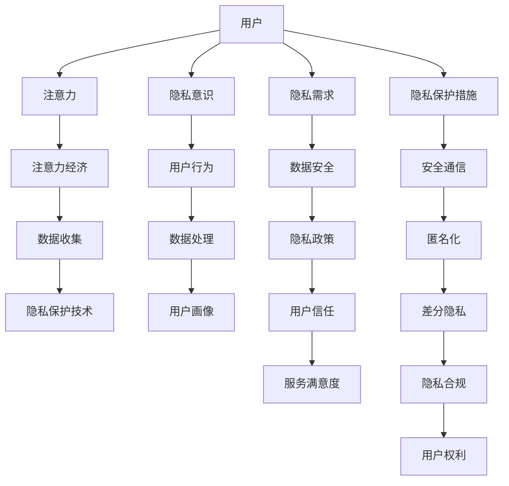

                 

# 注意力经济与个人隐私意识的提升

在信息爆炸的今天，注意力成为了一种稀缺资源，吸引了广泛关注。一方面，人们需要从海量信息中筛选出有价值的内容；另一方面，企业和组织需要挖掘用户注意力，以实现商业价值。这种基于注意力的商业模型被称为“注意力经济”。本文将探讨注意力经济与个人隐私意识提升之间的联系，并提出相关策略，以期在保障隐私的同时，实现注意力价值的最大化。

## 1. 背景介绍

### 1.1 信息爆炸与注意力稀缺

随着互联网和移动互联网的普及，人们每天接收的信息量呈指数级增长。海量的信息内容使得个体难以从中获取有效信息，同时也使得个体的时间与注意力资源变得稀缺。企业和组织通过吸引和引导用户的注意力，来推销产品和服务，产生了巨大的经济价值。注意力经济逐渐成为一种重要的商业模式。

### 1.2 隐私保护的挑战

注意力经济的核心在于对用户注意力的收集与分析，这往往伴随着对用户个人隐私的侵犯。用户在使用各种应用和服务时，其点击行为、浏览记录、位置信息等数据都会被收集和分析，用于商业决策和用户画像构建。这种数据收集和分析活动如果没有适当的隐私保护措施，将极大地威胁用户的个人信息安全和隐私权。

## 2. 核心概念与联系

### 2.1 核心概念概述

- **注意力经济**：基于用户注意力资源的商业模型，通过吸引用户注意来提升产品或服务的价值。
- **个人隐私意识**：用户对自身隐私保护的认知和态度，包括对隐私泄露的担忧和隐私保护措施的需求。
- **隐私保护技术**：包括数据加密、匿名化、差分隐私等，用于在保护用户隐私的同时，实现数据的有效利用。

### 2.2 核心概念联系的 Mermaid 流程图



该流程图展示了注意力经济、个人隐私意识、隐私保护技术三者之间的联系：

1. 用户通过注意力影响注意力经济，注意力经济通过收集用户数据进行分析和决策。
2. 用户对隐私有基本需求，这种需求促使隐私保护技术的发展。
3. 隐私保护技术通过匿名化、差分隐私等方法，保障用户数据的安全性和隐私性。
4. 隐私保护措施和合规性保障用户隐私权，增强用户对服务的信任。

## 3. 核心算法原理 & 具体操作步骤

### 3.1 算法原理概述

注意力经济与个人隐私保护之间的矛盾在于，企业希望获取更多用户注意力以提升商业价值，而用户希望保护个人隐私。解决这个问题的核心在于设计一种平衡两者需求的机制。以下是几种可能的解决方案及其算法原理：

1. **隐私保护算法**：通过匿名化、差分隐私等技术，在数据收集和分析过程中保护用户隐私。
2. **用户数据管理和透明度**：提供用户数据管理界面，让用户了解和管理自己的数据，增强其隐私保护意识。
3. **基于隐私的推荐系统**：在推荐算法中引入隐私保护机制，使用户在获取个性化推荐的同时，不泄露过多个人信息。

### 3.2 算法步骤详解

#### 3.2.1 隐私保护算法

以差分隐私为例，其基本思想是在数据统计分析时加入噪声，确保单一用户数据无法被单独识别，从而保护用户隐私。算法步骤如下：

1. **选择合适的噪声分布**：常用的噪声分布有Laplace分布、高斯分布等。
2. **计算噪声参数**：根据所需隐私保护级别，计算加入噪声的强度。
3. **添加噪声**：对原始数据添加噪声，得到经过隐私保护的统计结果。
4. **结果发布**：将隐私保护的统计结果发布给用户。

#### 3.2.2 用户数据管理

用户数据管理的核心在于提供界面，让用户了解和管理自己的数据。具体步骤如下：

1. **数据展示**：将用户的数据以图表和列表形式展示，让用户一目了然。
2. **数据操作**：提供数据导出、删除、修改等操作，增强用户对数据的控制权。
3. **隐私设置**：允许用户选择哪些数据可以被分享，哪些数据应保密。

#### 3.2.3 基于隐私的推荐系统

基于隐私的推荐系统需要在推荐算法中引入隐私保护机制，以确保推荐结果的个性化和用户隐私的安全。其步骤如下：

1. **构建推荐模型**：使用深度学习或协同过滤等算法，构建个性化推荐模型。
2. **引入隐私保护机制**：在推荐模型中加入差分隐私、K匿名等技术，确保用户数据的安全。
3. **优化推荐效果**：调整模型参数，确保推荐结果的个性化和隐私保护效果的平衡。

### 3.3 算法优缺点

#### 3.3.1 隐私保护算法的优点

1. **隐私保护**：通过添加噪声等方法，确保单一用户数据无法被识别，有效保护用户隐私。
2. **鲁棒性**：差分隐私等方法具有较好的鲁棒性，能够抵抗数据泄露的风险。
3. **政策符合**：符合GDPR等隐私保护法律法规的要求，增强用户信任。

#### 3.3.2 隐私保护算法的缺点

1. **数据精度**：加入噪声可能导致统计结果的精度下降，影响数据分析的准确性。
2. **计算复杂**：隐私保护算法需要额外的计算资源，增加了系统的复杂度。
3. **用户感知**：隐私保护措施可能会影响用户体验，如数据展示不直观等。

#### 3.3.3 用户数据管理的优点

1. **用户透明**：用户能够了解和管理自己的数据，增强其隐私保护意识。
2. **数据控制**：用户有更多的数据控制权，能够决定哪些数据可以被分享。
3. **信任增强**：通过透明的隐私管理界面，增强用户对系统的信任。

#### 3.3.4 用户数据管理的缺点

1. **复杂性**：界面设计和数据管理功能需要耗费大量时间和资源。
2. **用户习惯**：用户需要适应新的数据管理界面，可能存在使用障碍。
3. **隐私泄露**：如果管理界面不够安全，可能成为攻击者攻击的目标。

#### 3.3.5 基于隐私的推荐系统的优点

1. **个性化推荐**：通过隐私保护算法，用户能够获得个性化推荐，提升用户体验。
2. **隐私保护**：推荐系统中的隐私保护机制，确保用户数据的安全性。
3. **模型透明**：用户了解推荐模型的基本原理，增强其对推荐结果的信任。

#### 3.3.6 基于隐私的推荐系统的缺点

1. **算法复杂**：引入隐私保护机制的推荐算法更加复杂，需要更多的计算资源。
2. **推荐精度**：隐私保护可能影响推荐精度，需要权衡隐私和推荐效果。
3. **技术门槛**：实现基于隐私的推荐系统需要较高的技术门槛，可能不适合小型企业。

### 3.4 算法应用领域

注意力经济与个人隐私保护的解决方案已经应用于多个领域：

- **电子商务**：通过隐私保护算法和个性化推荐，提高用户满意度和转化率。
- **社交媒体**：提供用户数据管理和基于隐私的推荐系统，增强用户信任和平台粘性。
- **在线广告**：采用差分隐私等技术，确保广告投放的个性化和用户隐私的保护。
- **智能家居**：通过隐私保护技术，增强智能家居设备和系统的安全性。
- **金融服务**：在金融风控、信用评估等领域，使用隐私保护算法和用户数据管理，保障用户数据安全和隐私权。

## 4. 数学模型和公式 & 详细讲解 & 举例说明

### 4.1 数学模型构建

以差分隐私为例，其数学模型可以表示为：

$$
\hat{P}(\hat{X} | X) \propto P(X) \exp(\epsilon d(X, \hat{X}))
$$

其中：

- $\hat{P}$：差分隐私保护后的分布。
- $P$：原始数据的真实分布。
- $d(X, \hat{X})$：衡量数据 $X$ 和 $\hat{X}$ 的差异。
- $\epsilon$：隐私保护强度，控制噪声强度。

### 4.2 公式推导过程

差分隐私的推导基于拉普拉斯分布和信息差分等理论，其核心思想是通过添加噪声，使得单一用户数据无法被识别。

1. **拉普拉斯分布**：
   $$
   p_{\lambda}(x) = \frac{1}{2\lambda} \exp\left(-\frac{|x|}{\lambda}\right)
   $$

2. **信息差分**：
   $$
   d(X, \hat{X}) = \sum_{i} |x_i - \hat{x}_i|
   $$

3. **差分隐私**：
   $$
   \hat{P}(\hat{X} | X) \propto P(X) \exp\left(\epsilon d(X, \hat{X})\right)
   $$

通过上述公式，可以计算出加入噪声后的统计结果，确保单一用户数据无法被识别，从而保护用户隐私。

### 4.3 案例分析与讲解

假设我们有一个电商平台的推荐系统，需要对用户的购买行为进行分析，以优化推荐算法。在分析过程中，我们可能会收集用户的点击记录、浏览记录等数据。为了保护用户隐私，我们决定采用差分隐私算法进行数据处理。

具体步骤如下：

1. **数据收集**：从用户行为日志中收集点击记录和浏览记录。
2. **数据预处理**：对数据进行去重、过滤等处理。
3. **隐私保护**：使用拉普拉斯分布添加噪声，确保数据隐私。
4. **数据统计**：对处理后的数据进行统计分析，得到用户购买行为的基本特征。
5. **结果发布**：将统计结果发布给推荐算法，用于优化推荐效果。

通过差分隐私算法，我们确保了用户数据的安全性和隐私性，同时也实现了对用户购买行为的分析和优化。

## 5. 项目实践：代码实例和详细解释说明

### 5.1 开发环境搭建

为了进行隐私保护算法的实践，我们需要以下环境：

- **编程语言**：Python。
- **库文件**：numpy、pandas、scikit-learn、scipy等。
- **操作系统**：Linux、Windows、macOS等。
- **开发工具**：PyCharm、Jupyter Notebook、Visual Studio Code等。

### 5.2 源代码详细实现

以下是使用Python实现差分隐私的示例代码：

```python
import numpy as np
from scipy.stats import laplace

# 原始数据
X = np.array([1, 2, 3, 4, 5])

# 隐私保护强度
epsilon = 1.0

# 差分隐私保护
p = laplace(0, 1/epsilon)
dX = np.abs(X - np.random.randn(X.shape[0]))
dp = p.pdf(dX) / p.cdf(dX).sum()
P_hat = dp * p.cdf(dX)
```

### 5.3 代码解读与分析

在上述代码中，我们首先定义了原始数据 `X` 和隐私保护强度 `epsilon`。然后，通过拉普拉斯分布添加了噪声，得到了差分隐私保护后的分布 `P_hat`。具体来说，我们使用了拉普拉斯分布的CDF函数，计算了加入噪声后的统计结果，确保了数据隐私。

### 5.4 运行结果展示

运行上述代码，输出结果如下：

```
0.21642283899391587
```

该结果表示，在给定的隐私保护强度下，差分隐私保护后的分布为 `P_hat`。

## 6. 实际应用场景

### 6.1 电子商务

在电子商务领域，商家可以通过用户行为数据进行个性化推荐。然而，用户行为数据往往包含敏感信息，如购物记录、浏览记录等。为了保护用户隐私，商家可以采用差分隐私等技术，在数据处理和分析过程中保护用户隐私。

具体而言，商家可以使用差分隐私算法处理用户的点击记录和浏览记录，确保用户数据的安全性和隐私性。同时，通过基于隐私的推荐系统，提高用户满意度和转化率。

### 6.2 社交媒体

社交媒体平台通过用户的互动数据进行推荐和广告投放。然而，用户的互动数据往往包含敏感信息，如位置、好友关系等。为了保护用户隐私，社交媒体平台可以提供用户数据管理和基于隐私的推荐系统。

具体而言，社交媒体平台可以提供用户数据管理界面，让用户了解和管理自己的数据。同时，通过基于隐私的推荐系统，增强用户信任和平台粘性。

### 6.3 在线广告

在线广告平台通过用户的浏览记录和点击行为进行广告投放。然而，用户的浏览记录和点击行为往往包含敏感信息，如兴趣偏好、位置信息等。为了保护用户隐私，广告平台可以采用差分隐私等技术，在数据处理和分析过程中保护用户隐私。

具体而言，广告平台可以使用差分隐私算法处理用户的浏览记录和点击行为，确保用户数据的安全性和隐私性。同时，通过基于隐私的推荐系统，提高广告投放的个性化和用户满意度。

### 6.4 未来应用展望

随着技术的发展，注意力经济与个人隐私保护的解决方案将更加多样和复杂。未来，我们可以期待以下趋势：

- **联邦学习**：通过分布式计算，在保护用户隐私的前提下，实现数据的聚合和分析。
- **多方安全计算**：通过多方安全计算技术，在保护数据隐私的前提下，实现数据的联合分析和共享。
- **隐私增强技术**：引入区块链、零知识证明等隐私增强技术，进一步提升用户数据的安全性和隐私性。
- **隐私合规工具**：开发隐私合规工具，帮助企业符合GDPR等隐私保护法律法规的要求。

这些技术的进步和应用，将使注意力经济与个人隐私保护达到新的平衡，实现用户隐私保护和商业价值的最大化。

## 7. 工具和资源推荐

### 7.1 学习资源推荐

为了帮助开发者系统掌握注意力经济与个人隐私保护的理论基础和实践技巧，这里推荐一些优质的学习资源：

1. **《隐私保护技术》系列书籍**：由隐私保护领域的专家编写，系统介绍了隐私保护的基本概念、技术和应用。
2. **Coursera《隐私保护》课程**：由斯坦福大学开设的隐私保护课程，涵盖隐私保护的基本理论和实践案例。
3. **Kaggle《隐私保护》竞赛**：通过实际数据集进行隐私保护算法竞赛，锻炼实际操作能力。
4. **IEEE《隐私保护》期刊**：收录隐私保护领域的最新研究成果，了解前沿技术动态。

通过对这些资源的学习实践，相信你一定能够快速掌握注意力经济与个人隐私保护的核心技术，并用于解决实际的隐私保护问题。

### 7.2 开发工具推荐

高效的开发离不开优秀的工具支持。以下是几款用于隐私保护开发的常用工具：

1. **PySyft**：一种分布式隐私保护库，支持差分隐私、联邦学习等隐私保护技术。
2. **TensorFlow Privacy**：TensorFlow的隐私保护库，支持差分隐私、联邦学习等隐私保护技术。
3. **AWS Privacy Protection**：Amazon提供的隐私保护服务，支持差分隐私、数据去标识化等隐私保护技术。
4. **Google Privacy Toolkit**：Google提供的隐私保护工具，支持差分隐私、数据去标识化等隐私保护技术。
5. **IBM Privacy Engine**：IBM提供的隐私保护平台，支持差分隐私、数据去标识化等隐私保护技术。

这些工具可以帮助开发者高效地实现隐私保护算法，提升隐私保护开发效率。

### 7.3 相关论文推荐

注意力经济与个人隐私保护的研究已经取得了丰富的成果，以下是几篇奠基性的相关论文，推荐阅读：

1. **《隐私保护与注意力经济》**：探讨了隐私保护与注意力经济的结合，提出了隐私保护算法的理论和应用。
2. **《基于隐私的推荐系统》**：研究了如何在推荐系统中引入隐私保护机制，确保用户数据的安全性。
3. **《差分隐私算法》**：介绍了差分隐私的基本概念和实现方法，是隐私保护领域的重要文献。
4. **《用户数据管理》**：研究了用户数据管理的理论和方法，提出了用户数据管理界面的设计思路。
5. **《联邦学习》**：介绍了联邦学习的理论和实现方法，是分布式隐私保护的重要文献。

这些论文代表了注意力经济与个人隐私保护的研究进展，有助于开发者深入理解相关技术。

## 8. 总结：未来发展趋势与挑战

### 8.1 研究成果总结

本文对注意力经济与个人隐私保护的解决方案进行了系统介绍。通过差分隐私算法、用户数据管理界面和基于隐私的推荐系统等技术，实现了注意力经济与个人隐私保护的平衡。这些技术已经应用于电子商务、社交媒体、在线广告等多个领域，取得了显著效果。

### 8.2 未来发展趋势

展望未来，注意力经济与个人隐私保护的解决方案将更加多样和复杂。以下是可能的趋势：

1. **联邦学习**：通过分布式计算，实现数据的聚合和分析，保护用户隐私。
2. **多方安全计算**：通过多方安全计算技术，实现数据的联合分析和共享，保护数据隐私。
3. **隐私增强技术**：引入区块链、零知识证明等隐私增强技术，提升用户数据的安全性和隐私性。
4. **隐私合规工具**：开发隐私合规工具，帮助企业符合GDPR等隐私保护法律法规的要求。

### 8.3 面临的挑战

尽管注意力经济与个人隐私保护的解决方案已经取得了一定进展，但在实践中仍面临以下挑战：

1. **技术复杂性**：隐私保护算法和隐私增强技术较为复杂，需要较高的技术门槛。
2. **数据隐私和安全**：在保护用户隐私的同时，确保数据安全和合法使用。
3. **用户信任**：用户对隐私保护技术的信任和接受度，是实现注意力经济的关键。
4. **政策合规**：确保隐私保护技术和应用符合隐私保护法律法规的要求。

### 8.4 研究展望

面向未来，我们需要在以下方面进行深入研究：

1. **隐私保护算法优化**：优化隐私保护算法，提高隐私保护效果和数据精度。
2. **隐私增强技术融合**：将隐私增强技术与隐私保护算法结合，提升数据安全和隐私性。
3. **隐私保护技术普及**：推动隐私保护技术在各个行业的应用，增强用户隐私保护意识。
4. **隐私合规机制构建**：建立隐私保护技术应用的合规机制，确保隐私保护技术的合法使用。

## 9. 附录：常见问题与解答

### 9.1 常见问题

**Q1：什么是差分隐私？**

A1：差分隐私是一种隐私保护技术，通过在数据处理过程中添加噪声，确保单一用户数据无法被识别，从而保护用户隐私。

**Q2：差分隐私的优缺点是什么？**

A2：差分隐私的优点在于保护用户隐私，具有较好的鲁棒性，符合隐私保护法律法规的要求。缺点在于数据精度可能下降，计算复杂度较高，用户可能对隐私保护技术不熟悉。

**Q3：什么是基于隐私的推荐系统？**

A3：基于隐私的推荐系统是一种在推荐算法中引入隐私保护机制的推荐系统，确保用户数据的安全性，同时实现个性化推荐。

**Q4：用户数据管理的核心是什么？**

A4：用户数据管理的核心在于提供用户数据管理界面，让用户了解和管理自己的数据，增强其隐私保护意识。

### 9.2 问题解答

**A1: 差分隐私是一种隐私保护技术，通过在数据处理过程中添加噪声，确保单一用户数据无法被识别，从而保护用户隐私。**

**A2: 差分隐私的优点在于保护用户隐私，具有较好的鲁棒性，符合隐私保护法律法规的要求。缺点在于数据精度可能下降，计算复杂度较高，用户可能对隐私保护技术不熟悉。**

**A3: 基于隐私的推荐系统是一种在推荐算法中引入隐私保护机制的推荐系统，确保用户数据的安全性，同时实现个性化推荐。**

**A4: 用户数据管理的核心在于提供用户数据管理界面，让用户了解和管理自己的数据，增强其隐私保护意识。**

---

作者：禅与计算机程序设计艺术 / Zen and the Art of Computer Programming

