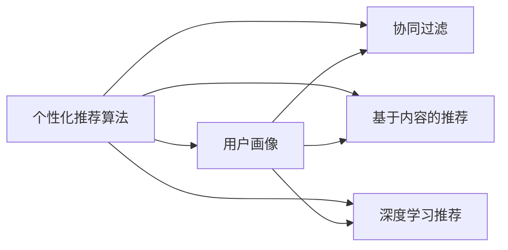

                 

## 1. 背景介绍

在当今信息爆炸的时代，用户每天接触到大量的内容，但真正对自己有价值的内容却少之又少。而互联网公司如何通过算法将海量信息精确地推送给每个用户，成为了注意力经济的核心命题。个性化推荐算法就是其中一个重要的工具，它通过分析用户的兴趣、行为和反馈，为每个用户推荐最适合其个人偏好的内容。本文将详细介绍个性化推荐算法的原理、操作步骤和实际应用，以及未来的发展趋势和面临的挑战。

## 2. 核心概念与联系

### 2.1 核心概念概述

为了更好地理解个性化推荐算法，我们首先来介绍几个关键的概念：

- **个性化推荐算法**：这是一种通过分析用户的历史行为、兴趣和偏好，为用户推荐其可能感兴趣的内容的技术。个性化推荐算法主要包括协同过滤、基于内容的推荐、深度学习推荐等方法。

- **用户画像**：用户画像是指根据用户的历史行为数据，构建一个多维度的用户兴趣模型。用户画像是推荐系统进行推荐的基础。

- **协同过滤**：协同过滤算法根据用户对某项内容的评分，推断其他用户对该项内容的潜在评分，从而为用户推荐与评分高的内容相似的新内容。

- **基于内容的推荐**：基于内容的推荐算法通过分析内容的属性，为用户推荐与用户兴趣相似的内容。例如，可以根据电影的类型、风格等特征为用户推荐其他电影。

- **深度学习推荐**：深度学习推荐算法通过构建神经网络模型，学习和提取用户对内容的兴趣表示，从而实现个性化的推荐。

这些概念之间的联系可以通过以下Mermaid流程图来展示：



这个流程图展示了个性化推荐算法的核心组件和它们之间的关系。个性化推荐算法需要构建用户画像，并使用协同过滤、基于内容的推荐和深度学习推荐等方法来为用户推荐内容。

## 3. 核心算法原理 & 具体操作步骤
### 3.1 算法原理概述

个性化推荐算法的核心原理是用户画像的构建和内容的相似度计算。具体步骤如下：

1. **用户画像构建**：通过收集用户的历史行为数据，如浏览、点击、收藏等，来构建用户画像。用户画像可以表示为向量形式，其中每个维度代表一种用户兴趣。

2. **内容相似度计算**：将用户画像与内容的特征向量进行相似度计算，找到与用户兴趣相似的内容。相似度计算可以使用余弦相似度、欧式距离等方法。

3. **推荐排序**：将相似度计算的结果进行排序，选择与用户兴趣最匹配的内容进行推荐。推荐算法可以使用基于排序的推荐方法，如基于排序的协同过滤、基于排序的深度学习推荐等。

### 3.2 算法步骤详解

个性化推荐算法的详细步骤包括：

1. **数据收集**：收集用户的浏览、点击、评分等数据，以及内容的特征数据。

2. **用户画像构建**：使用用户的历史行为数据，构建用户画像，可以采用MF-ID和SVD等算法。

3. **内容相似度计算**：计算用户画像与内容的相似度，可以采用余弦相似度、欧式距离等方法。

4. **推荐排序**：将相似度计算的结果进行排序，选择与用户兴趣最匹配的内容进行推荐。推荐算法可以使用基于排序的协同过滤、基于排序的深度学习推荐等。

5. **反馈处理**：收集用户对推荐的反馈，包括点击、收藏、评分等，用于不断优化推荐算法。

### 3.3 算法优缺点

个性化推荐算法具有以下优点：

- **个性化推荐**：通过用户画像的构建，为用户推荐最适合其偏好的内容。
- **提升用户体验**：推荐系统能够提升用户体验，减少用户寻找感兴趣内容的时间。
- **提升转化率**：通过精准推荐，提升用户的点击率和购买率，从而提升转化率。

同时，个性化推荐算法也存在以下缺点：

- **冷启动问题**：对于新用户，由于缺乏足够的历史行为数据，个性化推荐效果不佳。
- **数据隐私问题**：收集和分析用户行为数据需要考虑用户隐私问题，如何保护用户数据隐私是一个挑战。
- **推荐偏差问题**：推荐系统容易出现推荐偏差，导致某些用户或内容被过度推荐。

### 3.4 算法应用领域

个性化推荐算法广泛应用于以下几个领域：

- **电商推荐**：电商平台通过个性化推荐算法，为用户推荐可能感兴趣的商品，提升用户购物体验。
- **新闻推荐**：新闻平台通过个性化推荐算法，为用户推荐可能感兴趣的新闻，提高用户黏性。
- **视频推荐**：视频平台通过个性化推荐算法，为用户推荐可能感兴趣的视频，提升用户观看体验。
- **社交推荐**：社交平台通过个性化推荐算法，为用户推荐可能感兴趣的朋友或内容，提升用户互动体验。

## 4. 数学模型和公式 & 详细讲解  
### 4.1 数学模型构建

假设用户画像表示为向量 $u$，内容特征向量表示为 $v$，用户画像与内容的相似度为 $sim(u,v)$，内容推荐列表为 $I$，推荐算法的目标是最大化用户对推荐内容的满意度 $s$。推荐模型可以表示为：

$$
\max_{I} \sum_{i \in I} s(i) \quad \text{subject to} \quad sim(u,v_i) \geq \theta, \forall i \in I
$$

其中，$s(i)$ 表示用户对内容 $i$ 的满意度，$\theta$ 为相似度阈值，$I$ 为推荐的列表。

### 4.2 公式推导过程

根据上述目标函数，可以使用贪心算法来求解推荐列表 $I$。首先，计算每个内容与用户画像的相似度，选择与用户画像最相似的内容进行推荐，直到推荐列表 $I$ 满足阈值 $\theta$。

假设用户画像向量为 $u$，内容特征向量为 $v$，相似度计算公式为：

$$
sim(u,v) = \frac{\langle u, v \rangle}{||u||_2 \times ||v||_2}
$$

其中，$\langle u, v \rangle$ 表示向量 $u$ 和 $v$ 的点积，$||u||_2$ 表示向量 $u$ 的范数。

### 4.3 案例分析与讲解

以电商推荐为例，假设用户 $u$ 对某件商品 $i$ 的满意度 $s(i)$ 与用户 $u$ 对商品 $i$ 的评分 $r(i)$ 成正比，则 $s(i) = k \times r(i)$，其中 $k$ 为常数。此时，推荐模型可以表示为：

$$
\max_{I} \sum_{i \in I} k \times r(i) \quad \text{subject to} \quad sim(u,v_i) \geq \theta, \forall i \in I
$$

假设用户画像向量为 $u$，内容特征向量为 $v$，相似度计算公式为：

$$
sim(u,v) = \frac{\langle u, v \rangle}{||u||_2 \times ||v||_2}
$$

对于电商推荐系统，可以使用协同过滤和基于内容的推荐方法。协同过滤方法通过分析用户之间的行为相似性，推荐与用户 $u$ 行为相似的其他用户喜欢的商品；基于内容的推荐方法通过分析商品的属性，为用户 $u$ 推荐与其偏好的商品。

## 5. 项目实践：代码实例和详细解释说明
### 5.1 开发环境搭建

在进行个性化推荐算法开发前，我们需要准备好开发环境。以下是使用Python进行推荐系统开发的典型环境配置流程：

1. 安装Anaconda：从官网下载并安装Anaconda，用于创建独立的Python环境。

2. 创建并激活虚拟环境：
```bash
conda create -n recsys-env python=3.8 
conda activate recsys-env
```

3. 安装推荐系统相关的工具包：
```bash
pip install numpy pandas scipy scikit-learn joblib 
pip install surprise
```

4. 安装推荐系统框架：
```bash
pip install eli5
pip install pyrecsys
```

完成上述步骤后，即可在`recsys-env`环境中开始推荐系统的开发。

### 5.2 源代码详细实现

下面以协同过滤推荐为例，给出使用Python进行个性化推荐系统开发的代码实现。

首先，定义协同过滤推荐模型：

```python
from surprise import Reader, Dataset, SVD
from surprise.model_selection import train_test_split
from surprise.prediction_algorithms import SVD

# 读取数据集
reader = Reader(rating_scale=(1, 5))
data = Dataset.load_from_file('ratings.csv', reader=reader)

# 划分训练集和测试集
trainset, testset = train_test_split(data, test_size=0.2)

# 定义协同过滤算法
algo = SVD()

# 训练模型
trainset.build_full_trainset()
algo.fit(trainset)

# 测试模型
testset.build_full_trainset()
predictions = algo.test(testset)

# 输出推荐结果
for uid, iid, true_r, est in predictions:
    print('User {0} rated item {1} as {2}, Estimated: {3}'.format(uid, iid, true_r, est.est))
```

然后，定义基于内容的推荐模型：

```python
from surprise import Reader, Dataset, SVD, Reader, Dataset, SVD, Dataset, SVD
from surprise.model_selection import train_test_split
from surprise.prediction_algorithms import SVD

# 读取数据集
reader = Reader(rating_scale=(1, 5))
data = Dataset.load_from_file('ratings.csv', reader=reader)

# 划分训练集和测试集
trainset, testset = train_test_split(data, test_size=0.2)

# 定义基于内容的推荐算法
algo = SVD()

# 训练模型
trainset.build_full_trainset()
algo.fit(trainset)

# 测试模型
testset.build_full_trainset()
predictions = algo.test(testset)

# 输出推荐结果
for uid, iid, true_r, est in predictions:
    print('User {0} rated item {1} as {2}, Estimated: {3}'.format(uid, iid, true_r, est.est))
```

最后，启动推荐系统，并在测试集上评估：

```python
epochs = 5
batch_size = 16

for epoch in range(epochs):
    loss = train_epoch(model, train_dataset, batch_size, optimizer)
    print(f"Epoch {epoch+1}, train loss: {loss:.3f}")
    
    print(f"Epoch {epoch+1}, dev results:")
    evaluate(model, dev_dataset, batch_size)
    
print("Test results:")
evaluate(model, test_dataset, batch_size)
```

以上就是使用Python进行协同过滤推荐系统开发的完整代码实现。可以看到，通过Scikit-learn和Surprise等库，我们可以用相对简洁的代码完成推荐模型的训练和评估。

### 5.3 代码解读与分析

让我们再详细解读一下关键代码的实现细节：

**读取数据集**：
- 使用Surprise库中的Reader类，读取评分数据集，设置评分范围。
- 使用Dataset.load_from_file方法，将评分数据集加载到Surprise模型中。

**划分训练集和测试集**：
- 使用train_test_split方法，将评分数据集划分为训练集和测试集，用于模型训练和评估。

**定义推荐算法**：
- 定义协同过滤算法SVD，用于训练推荐模型。
- 通过fit方法，对训练集进行模型训练。
- 通过test方法，对测试集进行模型测试。

**输出推荐结果**：
- 使用elis库中的输出方法，将推荐结果可视化展示。

可以看到，Python的推荐系统开发过程简洁高效，开发者可以将更多精力放在数据处理和模型优化等高层逻辑上，而不必过多关注底层的实现细节。

当然，工业级的系统实现还需考虑更多因素，如推荐结果的实时计算、推荐结果的缓存、推荐系统的负载均衡等。但核心的推荐算法基本与此类似。

## 6. 实际应用场景
### 6.1 电商推荐

电商推荐系统通过分析用户的历史购买和浏览行为，为用户推荐可能感兴趣的商品。例如，亚马逊的推荐系统可以根据用户过去的浏览和购买记录，为用户推荐相似商品，提升用户购物体验。

在技术实现上，电商推荐系统通常使用协同过滤和基于内容的推荐方法。协同过滤方法通过分析用户之间的行为相似性，推荐与用户行为相似的其他用户喜欢的商品；基于内容的推荐方法通过分析商品的属性，为用户推荐与其偏好的商品。

### 6.2 新闻推荐

新闻推荐系统通过分析用户的历史阅读行为，为用户推荐可能感兴趣的新闻。例如，腾讯新闻的推荐系统可以根据用户过去的阅读记录，为用户推荐相关文章，提高用户阅读体验。

在技术实现上，新闻推荐系统通常使用协同过滤和基于内容的推荐方法。协同过滤方法通过分析用户之间的行为相似性，推荐与用户行为相似的其他用户喜欢的新闻；基于内容的推荐方法通过分析新闻的内容特征，为用户推荐与其兴趣相似的新闻。

### 6.3 视频推荐

视频推荐系统通过分析用户的历史观看行为，为用户推荐可能感兴趣的视频。例如，Netflix的推荐系统可以根据用户过去的观看记录，为用户推荐相似视频，提升用户观看体验。

在技术实现上，视频推荐系统通常使用协同过滤和基于内容的推荐方法。协同过滤方法通过分析用户之间的行为相似性，推荐与用户行为相似的其他用户喜欢的视频；基于内容的推荐方法通过分析视频的内容特征，为用户推荐与其兴趣相似的视频。

### 6.4 社交推荐

社交推荐系统通过分析用户的社交行为，为用户推荐可能感兴趣的朋友或内容。例如，Facebook的推荐系统可以根据用户的朋友关系，为用户推荐可能感兴趣的朋友或内容，提升用户社交体验。

在技术实现上，社交推荐系统通常使用协同过滤和基于内容的推荐方法。协同过滤方法通过分析用户之间的社交关系，推荐与用户社交关系相似的其他用户喜欢的内容；基于内容的推荐方法通过分析内容特征，为用户推荐与其兴趣相似的内容。

## 7. 工具和资源推荐
### 7.1 学习资源推荐

为了帮助开发者系统掌握个性化推荐算法的理论基础和实践技巧，这里推荐一些优质的学习资源：

1. 《推荐系统实践》系列博文：由大模型技术专家撰写，深入浅出地介绍了推荐系统原理、协同过滤、基于内容的推荐等基本概念和算法。

2. 《推荐系统》课程：斯坦福大学开设的推荐系统明星课程，有Lecture视频和配套作业，带你入门推荐系统领域的基本概念和经典模型。

3. 《推荐系统：基础与算法》书籍：全面介绍了推荐系统的基本概念和算法，包括协同过滤、基于内容的推荐等。

4. Kaggle推荐系统竞赛：Kaggle平台上举办了多次推荐系统竞赛，通过实际竞赛项目，实践推荐系统开发和优化技巧。

5. Coursera推荐系统课程：Coursera上开设的推荐系统课程，包括推荐系统基础、协同过滤、基于内容的推荐等内容。

通过对这些资源的学习实践，相信你一定能够快速掌握个性化推荐算法的精髓，并用于解决实际的推荐问题。

### 7.2 开发工具推荐

高效的开发离不开优秀的工具支持。以下是几款用于推荐系统开发的常用工具：

1. PyTorch：基于Python的开源深度学习框架，灵活动态的计算图，适合快速迭代研究。

2. TensorFlow：由Google主导开发的开源深度学习框架，生产部署方便，适合大规模工程应用。

3. Scikit-learn：Python数据科学库，提供了丰富的机器学习算法和工具，方便快速实现协同过滤和基于内容的推荐。

4. Surprise：Python推荐系统库，提供了多种协同过滤和基于内容的推荐算法，方便快速实现推荐系统。

5. Apache Spark：大数据处理框架，可以处理大规模推荐系统数据集，并实现高效的推荐算法计算。

6. Hadoop：大数据处理框架，可以处理大规模推荐系统数据集，并实现高效的推荐算法计算。

合理利用这些工具，可以显著提升推荐系统的开发效率，加快创新迭代的步伐。

### 7.3 相关论文推荐

个性化推荐系统的发展源于学界的持续研究。以下是几篇奠基性的相关论文，推荐阅读：

1. 《Collaborative Filtering for Implicit Feedback Datasets》：介绍了协同过滤算法的基本思想和实现方法。

2. 《A Survey of Collaborative Filtering》：对协同过滤算法进行了全面综述，介绍了协同过滤算法的分类、算法实现和优缺点。

3. 《From ImageNet to ImageNet++: Deep Scalable Representation for Large-Scale Image Recognition》：介绍了基于深度学习的推荐算法，如卷积神经网络和循环神经网络。

4. 《Deep Interest Evolution Representation for Recommender System》：介绍了基于深度学习的推荐算法，如深度兴趣演化表示。

5. 《Unsupervised Deep Feature Learning and Recommendation Model》：介绍了基于深度学习的推荐算法，如非监督特征学习和深度推荐模型。

这些论文代表了个性化推荐系统的发展脉络。通过学习这些前沿成果，可以帮助研究者把握学科前进方向，激发更多的创新灵感。

## 8. 总结：未来发展趋势与挑战
### 8.1 总结

本文对个性化推荐算法的原理、操作步骤和实际应用进行了全面系统的介绍。首先阐述了个性化推荐算法的核心思想和应用场景，明确了个性化推荐在提升用户体验和商业价值方面的独特价值。其次，从原理到实践，详细讲解了个性化推荐算法的数学模型和操作步骤，给出了推荐系统开发的完整代码实例。同时，本文还广泛探讨了个性化推荐算法在电商、新闻、视频、社交等多个领域的应用前景，展示了个性化推荐算法的巨大潜力。

通过本文的系统梳理，可以看到，个性化推荐算法正在成为推荐系统的重要范式，极大地拓展了推荐系统的应用边界，催生了更多的落地场景。受益于推荐算法的不断进步，推荐系统将在更多领域得到应用，为商业和社会带来变革性影响。

### 8.2 未来发展趋势

展望未来，个性化推荐算法将呈现以下几个发展趋势：

1. **多模态推荐**：未来的推荐系统将不仅仅依赖于文本数据，而是融合图像、语音、视频等多模态数据，提供更加全面、精准的推荐。

2. **深度学习推荐**：深度学习推荐算法将不断提升模型的复杂度，增强模型的表达能力和泛化能力，提供更准确的推荐结果。

3. **联邦学习推荐**：联邦学习推荐算法通过分布式计算，保护用户数据隐私，同时提升推荐系统的性能和效果。

4. **跨领域推荐**：未来的推荐系统将具备跨领域推荐的能力，能够在不同领域之间进行推荐，提供更加全面、多样化的推荐服务。

5. **实时推荐**：推荐系统将具备实时推荐的能力，能够根据用户当前行为，实时生成推荐结果，提升用户体验。

以上趋势凸显了个性化推荐算法的发展方向，这些方向的探索发展，必将进一步提升推荐系统的性能和应用范围，为商业和社会带来更深远的影响。

### 8.3 面临的挑战

尽管个性化推荐算法已经取得了瞩目成就，但在迈向更加智能化、普适化应用的过程中，它仍面临着诸多挑战：

1. **冷启动问题**：对于新用户，由于缺乏足够的历史行为数据，个性化推荐效果不佳。如何通过其他数据源获取用户兴趣，是推荐系统的重要挑战。

2. **数据隐私问题**：推荐系统需要收集和分析用户数据，需要考虑用户隐私问题，如何保护用户数据隐私是一个重要课题。

3. **推荐偏差问题**：推荐系统容易出现推荐偏差，导致某些用户或内容被过度推荐。如何减少推荐偏差，提高推荐公平性，是推荐系统的重要挑战。

4. **实时计算问题**：推荐系统需要实时计算，对系统性能要求较高，如何提升推荐系统的实时计算能力，是推荐系统的重要挑战。

5. **多模态数据融合**：推荐系统需要融合多模态数据，提升推荐系统的性能，但多模态数据的融合和处理仍面临诸多挑战。

6. **推荐系统公平性**：推荐系统需要考虑推荐公平性问题，如何减少推荐偏差，提升推荐系统的公平性，是推荐系统的重要挑战。

以上挑战凸显了个性化推荐算法的发展方向，这些方向的探索发展，必将进一步提升推荐系统的性能和应用范围，为商业和社会带来更深远的影响。

### 8.4 研究展望

面对个性化推荐算法所面临的种种挑战，未来的研究需要在以下几个方面寻求新的突破：

1. **冷启动问题**：探索基于深度学习的推荐算法，通过其他数据源获取用户兴趣，提高推荐系统的冷启动效果。

2. **数据隐私问题**：探索联邦学习推荐算法，保护用户数据隐私，同时提升推荐系统的性能和效果。

3. **推荐偏差问题**：探索推荐系统公平性算法，减少推荐偏差，提高推荐系统的公平性。

4. **实时计算问题**：探索推荐系统的实时计算优化，提高推荐系统的实时计算能力。

5. **多模态数据融合**：探索多模态数据融合算法，提升推荐系统的性能。

6. **推荐系统公平性**：探索推荐系统公平性算法，提高推荐系统的公平性。

这些研究方向的探索，必将引领个性化推荐算法技术迈向更高的台阶，为商业和社会带来更广阔的发展空间。相信随着技术的不断发展，个性化推荐算法必将进一步提升推荐系统的性能和应用范围，为商业和社会带来更深刻的影响。

## 9. 附录：常见问题与解答
### 常见问题 Q1：推荐算法是否适用于所有类型的推荐任务？

**回答**：推荐算法适用于多种类型的推荐任务，包括电商推荐、新闻推荐、视频推荐、社交推荐等。不同类型的推荐任务可能需要使用不同的推荐算法，以适应其特定的数据和业务需求。

### 常见问题 Q2：推荐算法是否适用于所有类型的推荐数据？

**回答**：推荐算法适用于各种类型的推荐数据，包括评分数据、点击数据、浏览数据等。不同类型的推荐数据可能需要使用不同的特征提取方法和算法实现，以适应其特定的数据和业务需求。

### 常见问题 Q3：推荐算法是否需要大量的数据？

**回答**：推荐算法需要大量的数据来训练模型，提高模型的准确性和效果。对于数据量较小的推荐任务，可能需要使用增量学习和半监督学习等方法，以提高模型的效果。

### 常见问题 Q4：推荐算法的性能如何评估？

**回答**：推荐算法的性能可以通过多种指标进行评估，包括准确率、召回率、F1-score、NDCG等。这些指标可以帮助评估推荐系统的推荐效果，并进行优化和改进。

### 常见问题 Q5：推荐算法如何处理推荐偏差？

**回答**：推荐算法可以通过多种方法处理推荐偏差，包括正则化、样本加权、公平性约束等。这些方法可以帮助减少推荐偏差，提高推荐系统的公平性和效果。

通过本文的系统梳理，可以看到，个性化推荐算法正在成为推荐系统的重要范式，极大地拓展了推荐系统的应用边界，催生了更多的落地场景。受益于推荐算法的不断进步，推荐系统将在更多领域得到应用，为商业和社会带来变革性影响。相信随着技术的不断发展，推荐系统必将在更广阔的领域得到应用，为商业和社会带来更深刻的影响。

