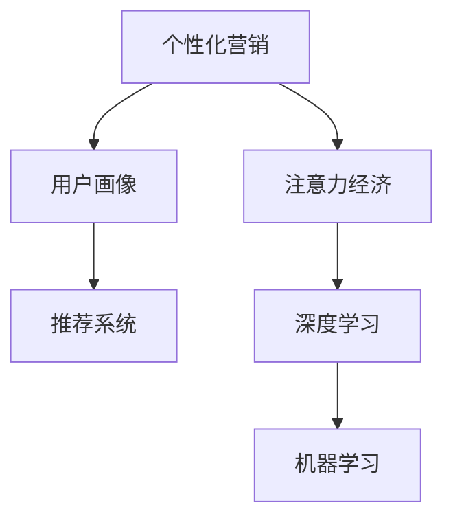

                 

# 注意力经济与个性化营销技术：为受众创建定制、有针对性的体验

> 关键词：注意力经济, 个性化营销, 用户行为分析, 机器学习, 深度学习, 推荐系统, 用户画像, 数据挖掘

## 1. 背景介绍

### 1.1 问题由来

随着互联网技术的不断发展和普及，数字营销已经成为了许多企业和品牌推广的重要手段。然而，面对海量的数据和不断变化的市场环境，传统的营销方式往往难以适应。这不仅造成了资源的浪费，还使得用户体验大打折扣。

注意力经济的出现，使得营销者开始重视用户对信息的关注度，并逐渐从广撒网式的营销模式转向更加精准的个性化营销策略。个性化营销的核心在于理解用户需求、行为和偏好，以定制化、有针对性的内容和服务，满足用户个性化的需求。

### 1.2 问题核心关键点

个性化营销的关键在于理解用户，并根据用户的行为和需求，提供定制化的内容和服务。为了实现这一目标，企业和品牌需要从数据入手，收集用户行为数据，进行深度挖掘和分析，以构建用户画像和行为模型。在这一过程中，数据量和算法的精度是关键因素。

个性化营销的实现离不开技术的支持。大数据、机器学习和深度学习等技术为个性化营销提供了新的工具和手段，能够对用户行为进行更为精准的分析和预测，从而实现更高效的营销策略。

### 1.3 问题研究意义

个性化营销技术能够帮助企业实现以下几个目标：

1. **提高营销效率**：通过精准定位用户，提高广告投放和内容推荐的准确性，从而降低成本，提升效果。
2. **增强用户体验**：通过个性化的内容和推荐，提升用户的满意度和粘性，增加品牌忠诚度。
3. **优化资源配置**：通过对用户数据的分析，优化资源配置，避免资源浪费。
4. **驱动创新**：个性化营销技术的应用，能够为企业带来新的商业机会和创新点。

## 2. 核心概念与联系

### 2.1 核心概念概述

为更好地理解个性化营销技术，本节将介绍几个密切相关的核心概念：

- **个性化营销**：根据用户的行为和偏好，定制化、有针对性地向用户推送产品、服务、内容和推荐。
- **用户画像**：通过分析用户的行为数据和偏好，构建用户特征模型，帮助企业更好地理解用户。
- **推荐系统**：利用用户历史行为数据，预测用户未来的行为和需求，为用户推荐个性化的内容和服务。
- **注意力经济**：在信息过载的环境中，用户对信息的选择和关注至关重要，营销者需要通过精准的个性化策略，吸引和保持用户的注意力。
- **深度学习**：通过多层神经网络结构，对用户行为数据进行复杂的建模和预测，提升个性化推荐系统的精度。
- **机器学习**：利用数据驱动的方法，自动化地优化营销策略，提升效果。

这些概念之间的逻辑关系可以通过以下Mermaid流程图来展示：



这个流程图展示了个性化营销的核心概念及其之间的关系：

1. 个性化营销通过用户画像和推荐系统，向用户提供定制化内容和服务。
2. 用户画像依赖深度学习对用户行为数据进行建模和分析，以构建精准的用户特征模型。
3. 注意力经济强调用户对信息的关注度，是实现个性化营销的前提。
4. 机器学习和深度学习为个性化营销提供了技术手段，提升推荐的精度和效果。

## 3. 核心算法原理 & 具体操作步骤

### 3.1 算法原理概述

个性化营销的核心算法是基于用户的兴趣和行为数据，利用机器学习和深度学习技术，预测用户未来的需求，并为其提供定制化的推荐和服务。这一过程通常包括以下几个步骤：

1. **数据收集与预处理**：收集用户的行为数据，并进行清洗和标准化处理。
2. **用户画像构建**：利用用户行为数据，构建用户的兴趣和偏好模型。
3. **推荐系统设计**：根据用户画像，设计个性化的推荐模型，预测用户对不同内容和服务的兴趣。
4. **注意力机制引入**：通过引入注意力机制，提升推荐系统的精度和效果。

### 3.2 算法步骤详解

#### 数据收集与预处理

数据收集是个性化营销的基础，主要包括以下几个步骤：

1. **行为数据采集**：收集用户在网站、应用等平台上的行为数据，如浏览记录、点击、购买等。
2. **数据清洗与标准化**：对采集到的数据进行清洗，去除噪音和异常值，并进行标准化处理，确保数据的一致性和准确性。
3. **数据集成**：将不同来源的数据集成到一个统一的框架中，形成完整、连续的用户行为记录。

#### 用户画像构建

用户画像的构建主要包括以下几个步骤：

1. **特征工程**：从行为数据中提取和构建用户特征，如用户兴趣、偏好、活跃度等。
2. **模型训练**：利用机器学习模型对用户特征进行建模和训练，形成用户画像。
3. **画像更新**：定期更新用户画像，确保其反映最新的用户特征和行为。

#### 推荐系统设计

推荐系统设计主要包括以下几个步骤：

1. **特征提取**：从用户画像中提取用户特征，如兴趣、行为等。
2. **模型训练**：利用推荐算法对用户特征进行建模和训练，预测用户对不同内容和服务的兴趣。
3. **推荐生成**：根据预测结果，为用户生成个性化的推荐列表。

#### 注意力机制引入

注意力机制的引入主要包括以下几个步骤：

1. **注意力模型构建**：引入注意力模型，对用户画像和推荐系统中的各个特征进行加权处理，提升推荐的精度和效果。
2. **模型训练**：利用注意力机制对推荐系统进行训练和优化，提高模型性能。
3. **推荐更新**：根据注意力机制的权重，实时更新推荐列表，确保推荐的实时性和相关性。

### 3.3 算法优缺点

个性化营销算法具有以下优点：

1. **高效精准**：利用机器学习和深度学习技术，能够对用户行为进行精确的预测和分析，提供精准的推荐。
2. **自动化**：自动化地优化营销策略，减少人力成本和错误。
3. **实时性**：实时更新推荐列表，提升用户体验。

同时，个性化营销算法也存在一些局限性：

1. **数据依赖**：个性化营销高度依赖于用户数据的质量和完整性，数据质量不足可能导致推荐精度下降。
2. **隐私问题**：收集和分析用户数据可能涉及隐私问题，需要严格遵守相关法律法规。
3. **过拟合风险**：过度依赖历史数据可能导致模型过拟合，影响推荐效果。
4. **复杂度较高**：算法模型复杂，实现难度较大，需要专业的技术支持。

### 3.4 算法应用领域

个性化营销算法在以下几个领域得到了广泛应用：

1. **电子商务**：利用个性化推荐，提升用户体验和销售额。
2. **在线广告**：通过精准的定向广告，提高广告投放效果。
3. **内容平台**：根据用户兴趣推荐个性化的文章、视频等内容，提升用户粘性。
4. **社交网络**：根据用户行为推荐个性化的好友、群组等，增强用户互动。

## 4. 数学模型和公式 & 详细讲解 & 举例说明

### 4.1 数学模型构建

个性化营销的核心模型主要包括以下几个部分：

1. **用户画像模型**：利用用户行为数据构建用户特征模型，反映用户兴趣和偏好。
2. **推荐模型**：利用用户画像模型，预测用户对不同内容和服务的兴趣，生成个性化推荐。
3. **注意力模型**：利用注意力机制，对用户画像和推荐系统中的各个特征进行加权处理，提升推荐精度。

### 4.2 公式推导过程

以协同过滤推荐系统为例，介绍推荐模型的公式推导过程：

假设用户-物品评分矩阵为 $R_{u,i}$，用户画像模型为 $P_u$，物品画像模型为 $P_i$，则协同过滤推荐模型的目标是最小化预测评分与实际评分的差异：

$$
\min_{\theta} \frac{1}{2} \sum_{u=1}^{M} \sum_{i=1}^{N} (R_{u,i} - \hat{R}_{u,i})^2
$$

其中，$\hat{R}_{u,i}$ 为利用用户画像模型 $P_u$ 和物品画像模型 $P_i$ 预测的用户对物品 $i$ 的评分。利用矩阵分解技术，可以将协同过滤模型表示为：

$$
\hat{R}_{u,i} = \mathbf{u} \mathbf{v}_i^T
$$

其中，$\mathbf{u}$ 为用户的特征向量，$\mathbf{v}_i$ 为物品的特征向量。

### 4.3 案例分析与讲解

以在线广告为例，介绍如何利用个性化推荐技术提升广告投放效果：

1. **数据收集**：收集用户在网站上的浏览、点击、购买等行为数据。
2. **用户画像构建**：利用机器学习模型，构建用户画像，反映用户的兴趣和偏好。
3. **推荐模型设计**：利用用户画像，设计个性化推荐模型，预测用户对不同广告的兴趣。
4. **广告投放**：根据推荐结果，投放个性化的广告，提高广告点击率和转化率。

## 5. 项目实践：代码实例和详细解释说明

### 5.1 开发环境搭建

在进行个性化营销项目开发前，需要准备好开发环境。以下是使用Python进行TensorFlow开发的环境配置流程：

1. 安装Anaconda：从官网下载并安装Anaconda，用于创建独立的Python环境。

2. 创建并激活虚拟环境：
```bash
conda create -n tf-env python=3.7 
conda activate tf-env
```

3. 安装TensorFlow：根据CUDA版本，从官网获取对应的安装命令。例如：
```bash
conda install tensorflow -c tensorflow -c conda-forge
```

4. 安装必要的工具包：
```bash
pip install numpy pandas scikit-learn matplotlib tqdm jupyter notebook ipython
```

完成上述步骤后，即可在`tf-env`环境中开始项目开发。

### 5.2 源代码详细实现

这里我们以协同过滤推荐系统为例，给出使用TensorFlow实现个性化推荐系统的代码实现。

首先，定义推荐系统的主要参数：

```python
import tensorflow as tf
from tensorflow.keras.layers import Input, Embedding, Dot, Dense

N = 10000 # 物品数量
M = 1000 # 用户数量
D = 64 # 用户和物品的特征维度
B = 64 # 模型嵌入矩阵的大小

# 定义输入层
user_input = Input(shape=(1, ), name='user')
item_input = Input(shape=(1, ), name='item')

# 定义用户画像和物品画像的嵌入层
user_embedding = Embedding(input_dim=M, output_dim=D, name='user_embed', mask_zero=True)(user_input)
item_embedding = Embedding(input_dim=N, output_dim=D, name='item_embed', mask_zero=True)(item_input)

# 定义注意力机制
attention = Dot(axes=(2, 2))([user_embedding, item_embedding])
attention = Dense(B)(attention)

# 定义推荐模型
recommendation = Dense(1, activation='sigmoid')(attention)

# 定义模型
model = tf.keras.Model(inputs=[user_input, item_input], outputs=recommendation)

# 编译模型
model.compile(optimizer='adam', loss='binary_crossentropy')
```

然后，定义数据生成函数和训练函数：

```python
import numpy as np

def generate_data():
    np.random.seed(0)
    user = np.random.randint(0, M, size=(N, 1))
    item = np.random.randint(0, N, size=(N, 1))
    R = np.random.randint(0, 2, size=(N, 1))
    return user, item, R

def train_model(model, train_epochs=10, batch_size=64):
    for epoch in range(train_epochs):
        user, item, R = generate_data()
        user = tf.keras.utils.to_categorical(user)
        item = tf.keras.utils.to_categorical(item)
        R = R.reshape((-1, 1))
        X = np.hstack((user, item))
        y = R
        X_train, y_train = X, y
        X_val, y_val = X, y
        
        model.fit(x=X_train, y=y_train, validation_data=(X_val, y_val), epochs=1, batch_size=batch_size)
```

最后，启动训练流程：

```python
train_model(model)
```

以上就是使用TensorFlow实现协同过滤推荐系统的完整代码实现。可以看到，TensorFlow提供了强大的模型构建和训练能力，使得个性化推荐系统的开发变得简单高效。

### 5.3 代码解读与分析

让我们再详细解读一下关键代码的实现细节：

**推荐系统定义**：
- 使用TensorFlow的Keras API，定义输入层、嵌入层和注意力机制。
- 利用嵌入层将用户和物品的特征向量表示出来，并通过注意力机制计算用户和物品的匹配度。
- 定义推荐模型的输出，预测用户对物品的兴趣。
- 编译模型，定义优化器和损失函数。

**数据生成函数**：
- 定义生成随机数据的方法，生成用户ID、物品ID和评分数据。
- 将用户ID和物品ID转化为one-hot编码，方便模型的训练。

**训练函数**：
- 在每个epoch内，生成一批随机数据，并进行模型训练。
- 使用生成器生成数据，避免将全部数据加载到内存中。
- 定期在验证集上评估模型性能，根据性能指标决定是否继续训练。

**训练流程**：
- 定义训练轮数和批量大小，开始循环训练。
- 在每个epoch内，使用生成器生成随机数据，进行模型训练和验证。
- 最终训练完成后，保存模型参数。

可以看到，TensorFlow使得个性化推荐系统的开发变得简单高效，开发者可以将更多精力放在模型设计、数据处理和业务逻辑上。

## 6. 实际应用场景

### 6.1 在线广告

个性化推荐技术在在线广告中的应用非常广泛。传统广告通常采用广撒网式投放，而个性化推荐则可以根据用户的兴趣和行为，定向投放广告，提高广告的点击率和转化率。例如，电商平台可以根据用户的浏览和购买历史，为用户推荐相关商品广告，提高广告投放效果。

### 6.2 内容推荐

内容推荐是个性化营销的重要应用场景之一。内容平台如Netflix、YouTube等，可以通过个性化推荐技术，为用户推荐符合其兴趣的视频、文章等，提高用户的粘性和满意度。推荐系统可以通过分析用户的观看历史、评分和评价等数据，预测用户对不同内容的兴趣，提供个性化的推荐列表。

### 6.3 电子商务

电子商务平台可以利用个性化推荐技术，提升用户购物体验。例如，亚马逊可以根据用户的浏览历史和购买记录，推荐相关商品，提高用户的购买率和满意度。推荐系统可以通过分析用户的搜索历史、浏览记录和评价等数据，预测用户对不同商品的兴趣，提供个性化的商品推荐。

## 7. 工具和资源推荐

### 7.1 学习资源推荐

为了帮助开发者系统掌握个性化营销的理论基础和实践技巧，这里推荐一些优质的学习资源：

1. **《深度学习基础》课程**：斯坦福大学开设的深度学习课程，涵盖深度学习的基本概念和算法，是入门深度学习的重要资源。
2. **《机器学习实战》书籍**：详细介绍了机器学习的基本原理和实践技巧，是理解机器学习算法的必读书籍。
3. **《推荐系统实战》书籍**：详细介绍了推荐系统的基本原理和实践技巧，是理解推荐算法的重要资源。
4. **Coursera的推荐系统课程**：由世界顶尖大学开设的推荐系统课程，涵盖推荐系统的理论基础和算法实现。
5. **Kaggle数据集和竞赛**：提供丰富的推荐系统数据集和竞赛任务，是实践推荐算法的最佳平台。

通过对这些资源的学习实践，相信你一定能够快速掌握个性化营销的核心技术，并用于解决实际的个性化推荐问题。

### 7.2 开发工具推荐

高效的开发离不开优秀的工具支持。以下是几款用于个性化营销开发的常用工具：

1. **TensorFlow**：由Google主导开发的深度学习框架，生产部署方便，适合大规模工程应用。
2. **PyTorch**：基于Python的开源深度学习框架，灵活动态的计算图，适合快速迭代研究。
3. **Hadoop**：大数据处理框架，支持大规模数据的存储和处理，是个性化推荐系统的重要基础。
4. **Spark**：大数据处理框架，提供高效的数据处理和计算能力，是推荐系统的核心工具。
5. **ELK Stack**：日志管理解决方案，实时监测推荐系统的性能和稳定性，提供详细的日志分析和告警功能。

合理利用这些工具，可以显著提升个性化推荐系统的开发效率，加快创新迭代的步伐。

### 7.3 相关论文推荐

个性化营销技术的发展源于学界的持续研究。以下是几篇奠基性的相关论文，推荐阅读：

1. **《The Bell Labs PageRank and the Web’s Hierarchy》**：引入了PageRank算法，奠定了搜索引擎的基础。
2. **《A Personalized Ranking Algorithm》**：提出协同过滤算法，为个性化推荐系统奠定了理论基础。
3. **《Recommender Systems for E-commerce》**：详细介绍了电子商务中的推荐系统，展示了个性化推荐在实际应用中的效果。
4. **《Festival Collaborative Filtering》**：提出基于矩阵分解的协同过滤算法，提升了推荐系统的精度。
5. **《Attention is All You Need》**：引入注意力机制，提升了深度学习模型的效果。

这些论文代表了个性化营销技术的发展脉络。通过学习这些前沿成果，可以帮助研究者把握学科前进方向，激发更多的创新灵感。

## 8. 总结：未来发展趋势与挑战

### 8.1 总结

本文对个性化营销技术进行了全面系统的介绍。首先阐述了个性化营销的背景和意义，明确了数据驱动和算法优化的核心思想。其次，从原理到实践，详细讲解了个性化营销的数学模型和具体操作步骤，给出了完整的代码实例。同时，本文还探讨了个性化营销在电子商务、在线广告等多个领域的应用前景，展示了个性化营销的广泛应用价值。

通过本文的系统梳理，可以看到，个性化营销技术已经成为了数字营销的重要手段，极大地提升了用户体验和营销效果。未来，伴随技术的不断进步和应用场景的拓展，个性化营销技术将进一步深入各行各业，成为推动数字经济发展的重要力量。

### 8.2 未来发展趋势

展望未来，个性化营销技术将呈现以下几个发展趋势：

1. **数据驱动**：随着大数据技术的不断进步，数据的收集和分析将更加高效，为个性化推荐提供更坚实的数据基础。
2. **算法优化**：基于深度学习、强化学习等前沿技术，个性化推荐算法将不断优化，提升推荐的精度和效果。
3. **多模态融合**：个性化推荐将逐步融合视觉、语音等多模态数据，提升推荐的全面性和准确性。
4. **实时性增强**：随着实时计算技术的进步，推荐系统将具备更强的实时性，提升用户体验。
5. **跨领域应用**：个性化推荐技术将逐步拓展到医疗、教育、金融等更多领域，带来新的商业机会和创新点。

以上趋势凸显了个性化营销技术的广阔前景。这些方向的探索发展，必将进一步提升推荐系统的性能和应用范围，为各行各业带来更高效的营销策略和更好的用户体验。

### 8.3 面临的挑战

尽管个性化营销技术已经取得了显著成就，但在迈向更加智能化、普适化应用的过程中，它仍面临着诸多挑战：

1. **数据质量问题**：推荐系统的准确性和效果高度依赖于数据质量，数据缺失、噪音等问题将影响推荐效果。
2. **隐私和安全问题**：收集和分析用户数据涉及隐私和安全问题，需要严格遵守相关法律法规。
3. **算法复杂度问题**：推荐算法复杂度较高，实现难度较大，需要专业的技术支持。
4. **过拟合风险**：过度依赖历史数据可能导致模型过拟合，影响推荐效果。
5. **实时性要求高**：推荐系统需要具备更强的实时性，对计算资源和存储资源提出了更高的要求。

### 8.4 研究展望

面对个性化营销技术面临的挑战，未来的研究需要在以下几个方面寻求新的突破：

1. **数据质量提升**：研究高效的数据收集和清洗方法，提高数据的完整性和准确性。
2. **隐私保护技术**：研究隐私保护技术，保护用户数据安全，防止数据泄露和滥用。
3. **算法优化**：研究更高效的推荐算法，提升推荐的精度和效果，降低实现难度。
4. **多模态融合**：研究多模态数据的融合方法，提升推荐系统的全面性和准确性。
5. **实时计算技术**：研究实时计算技术，提升推荐系统的实时性和稳定性。

这些研究方向将引领个性化营销技术的发展，带来更高效、更智能的推荐系统，为各行各业带来更高的营销效果和更好的用户体验。

## 9. 附录：常见问题与解答

**Q1：个性化营销是否适用于所有行业？**

A: 个性化营销在许多行业中都能够发挥作用，但不同行业的应用场景和需求有所不同。例如，电商、媒体、金融等行业已经广泛应用个性化推荐技术，而医疗、教育等行业则需要结合特定的业务场景进行个性化营销。

**Q2：如何设计个性化的广告投放策略？**

A: 设计个性化的广告投放策略需要考虑以下几个因素：
1. **用户画像**：构建详细的用户画像，了解用户兴趣和行为特征。
2. **内容优化**：根据用户画像，设计符合用户兴趣的广告内容，提高广告吸引力。
3. **渠道选择**：选择合适的广告渠道，如社交媒体、搜索引擎等，提高广告曝光率。
4. **投放策略**：利用A/B测试等方法，不断优化广告投放策略，提高广告效果。

**Q3：如何提升个性化推荐系统的实时性？**

A: 提升个性化推荐系统的实时性需要从以下几个方面入手：
1. **计算优化**：使用高效的计算框架和算法，优化推荐系统的计算过程。
2. **缓存机制**：使用缓存机制，减少频繁的计算和数据访问，提高响应速度。
3. **异步处理**：采用异步处理机制，并行处理多个请求，提升系统的并发能力。
4. **分布式计算**：利用分布式计算技术，提升推荐系统的计算能力和扩展性。

**Q4：个性化营销对用户隐私有什么影响？**

A: 个性化营销需要收集和分析用户数据，涉及用户隐私问题。为了保护用户隐私，需要采取以下措施：
1. **数据匿名化**：对用户数据进行匿名化处理，防止数据泄露。
2. **隐私保护算法**：研究隐私保护算法，如差分隐私、联邦学习等，保护用户隐私。
3. **法律法规遵守**：严格遵守相关的法律法规，保护用户隐私。

这些措施能够帮助企业在个性化营销中保护用户隐私，提升用户信任度。

**Q5：个性化营销如何提升用户满意度？**

A: 个性化营销能够提升用户满意度，主要通过以下几个方面：
1. **精准推荐**：根据用户兴趣和行为，提供符合用户需求的内容和服务，提升用户满意度。
2. **用户体验优化**：优化用户体验，如页面布局、加载速度等，提高用户的满意度。
3. **个性化互动**：利用个性化营销技术，提供个性化的互动方式，提升用户粘性。
4. **实时反馈**：实时收集用户反馈，不断优化推荐系统和用户体验，提高用户满意度。

通过这些措施，能够显著提升用户满意度和忠诚度，增强品牌竞争力。

---

作者：禅与计算机程序设计艺术 / Zen and the Art of Computer Programming

