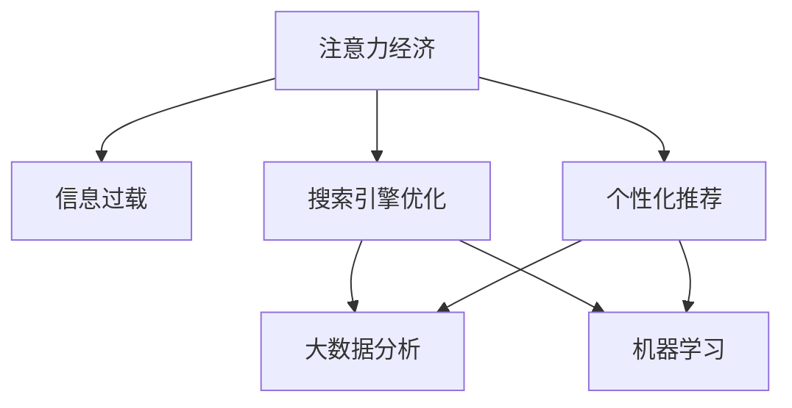

                 

# 注意力经济与信息过载的矛盾

> 关键词：注意力经济, 信息过载, 搜索引擎优化, 大数据分析, 个性化推荐

## 1. 背景介绍

### 1.1 问题由来

在数字化时代，信息洪流和注意力资源的紧张矛盾愈发显著。随着互联网的普及，信息生产速度不断加快，形式日益多样化，用户面临的信息过载问题日益严峻。在这样的大环境下，如何有效管理并利用用户的注意力资源，提升信息获取的效率和质量，成为了信息时代亟待解决的重要课题。

搜索引擎和个性化推荐系统作为互联网的重要基础设施，在信息检索和内容消费方面扮演了至关重要的角色。这些系统不仅满足了用户的查询需求，还通过不断优化的算法策略，提升用户体验和信息利用率。然而，随之而来的算法乱象、数据伦理、隐私保护等诸多问题，也引发了广泛的社会关注。

本文将从注意力经济和信息过载的视角出发，深入探讨当前搜索引擎和推荐系统的核心算法和优化策略，分析其优劣及面临的挑战，并提出可能的改进方向。

### 1.2 问题核心关键点

当前搜索引擎和推荐系统的核心问题在于如何高效利用用户的注意力资源，在庞大的信息海洋中帮助用户发现最相关、最有趣的内容。这一问题可以分为以下几个关键点：

1. **用户注意力管理**：理解用户的注意力分布，通过精心的算法设计，引导用户注意力向高质量内容集中。
2. **信息筛选与排序**：在海量信息中筛选出最相关的搜索结果或内容，并按重要性和相关性排序。
3. **用户满意度与效率**：通过持续优化算法，提升用户对搜索结果和推荐内容的满意度，同时提高信息检索和内容消费的效率。
4. **隐私保护与数据安全**：确保用户隐私不受侵犯，同时保护推荐系统的数据安全和算法的透明性。

## 2. 核心概念与联系

### 2.1 核心概念概述

为更好地理解搜索引擎和推荐系统的算法核心，本节将介绍几个密切相关的核心概念：

- **注意力经济**：以用户的注意力为核心的经济活动，通过提供有价值的信息吸引和留住用户的关注，从而实现商业价值。
- **信息过载**：用户在短时间内接收到的信息量超出其处理能力，导致注意力分散、信息吸收效率降低的现象。
- **搜索引擎优化(搜索引擎优化，SEO)**：通过优化网站的结构和内容，提升搜索引擎的排名，吸引更多访问量。
- **个性化推荐**：基于用户行为数据和偏好，推荐最相关、最符合用户兴趣的内容。
- **大数据分析**：利用大数据技术，从海量数据中挖掘有用信息，支持决策和推荐。
- **机器学习与深度学习**：基于数据训练算法模型，通过不断迭代优化，提升算法的精确度和泛化能力。

这些概念之间的逻辑关系可以通过以下Mermaid流程图来展示：



这个流程图展示了几大关键概念及其之间的关系：

1. 注意力经济通过优化内容吸引用户注意力，进而通过信息过载问题驱动搜索引擎优化和个性化推荐。
2. 搜索引擎优化和大数据分析共同支持个性化推荐系统，通过深度学习等算法优化，提升推荐效果。
3. 注意力经济与信息过载问题相互影响，需要在技术和应用层面进行平衡和优化。

## 3. 核心算法原理 & 具体操作步骤
### 3.1 算法原理概述

搜索引擎和推荐系统的核心算法，本质上是通过对用户注意力和信息的精准管理，提升信息检索和内容消费的效率和满意度。其中，**搜索引擎算法**和**推荐系统算法**是两大核心组成部分。

**搜索引擎算法**：主要是利用自然语言处理技术，对用户查询进行分词、理解、解析，从而在庞大的网页索引中筛选出最相关的搜索结果。常用的搜索引擎算法包括：
1. **倒排索引**：构建倒排索引表，快速匹配查询词与网页之间的关系。
2. **BM25算法**：用于评估搜索结果的相关性，综合考虑词频、逆文档频率等因素。
3. **TF-IDF算法**：通过计算词频和逆文档频率，衡量文档与查询词的相关性。

**推荐系统算法**：主要是通过用户行为数据和内容属性，利用机器学习模型预测用户对内容的兴趣，并按兴趣排序推荐。常用的推荐系统算法包括：
1. **协同过滤算法**：基于用户行为数据和物品属性，通过相似度计算推荐物品。
2. **内容推荐算法**：通过分析物品内容特征，预测用户对物品的兴趣，进行推荐。
3. **深度学习推荐算法**：利用深度神经网络模型，捕捉用户兴趣和物品特征的复杂关系。

### 3.2 算法步骤详解

搜索引擎和推荐系统的算法步骤通常包括以下几个关键环节：

**Step 1: 数据收集与预处理**
- 收集用户查询和行为数据，如点击、浏览、评分等。
- 对数据进行清洗、去重、归一化等预处理操作。

**Step 2: 特征提取与表示**
- 利用自然语言处理技术，将查询和文档进行分词、去除停用词、提取关键词等。
- 对用户行为数据和物品属性进行特征提取，如TF-IDF、词频、标签、类别等。

**Step 3: 相似度计算**
- 根据相似度算法，计算查询与文档、用户与物品之间的相似度。
- 常用的相似度计算方法包括余弦相似度、Jaccard相似度、皮尔逊相关系数等。

**Step 4: 排序与推荐**
- 基于相似度计算结果，对搜索结果或推荐内容进行排序，例如使用排序算法如快速排序、归并排序等。
- 利用排序结果，推荐最相关、最符合用户兴趣的内容。

**Step 5: 反馈与迭代优化**
- 收集用户对搜索结果或推荐内容的反馈，用于调整算法参数和优化模型。
- 利用在线学习或增量学习算法，持续更新模型，提升推荐效果。

### 3.3 算法优缺点

搜索引擎和推荐系统算法的优点在于：
1. 提升了信息检索和内容消费的效率和满意度，极大地丰富了用户体验。
2. 通过大数据分析和机器学习，可以个性化推荐，提升内容相关性。
3. 对海量信息进行高效管理，使得信息检索和内容消费变得便捷。

同时，这些算法也存在一定的局限性：
1. 依赖大量标注数据和计算资源，算法研发和优化成本高。
2. 模型可能出现偏见和歧视，对某些群体不公平。
3. 过度个性化可能导致信息茧房，用户长期陷入固定的兴趣圈层。
4. 算法复杂度较高，部署和维护成本大。
5. 用户隐私和数据安全问题可能引发伦理争议。

### 3.4 算法应用领域

搜索引擎和推荐系统的算法应用领域广泛，涵盖以下几个主要领域：

1. **电商推荐**：根据用户浏览、购买行为，推荐商品和优惠信息。
2. **内容推荐**：基于用户阅读、观看习惯，推荐新闻、视频、文章等。
3. **社交网络**：根据用户互动行为，推荐好友、话题、内容等。
4. **旅游出行**：根据用户查询和预订行为，推荐目的地、酒店、航班等。
5. **医疗健康**：根据用户健康数据和搜索记录，推荐医生、药品、健康建议等。

## 4. 数学模型和公式 & 详细讲解 & 举例说明
### 4.1 数学模型构建

本节将使用数学语言对搜索引擎和推荐系统的核心算法进行更加严格的刻画。

假设搜索引擎和推荐系统的输入数据为 $x$（用户查询或行为数据）和 $y$（网页或物品属性）。模型的目标是最小化损失函数 $\mathcal{L}(\theta)$，其中 $\theta$ 为模型参数。

**搜索引擎的损失函数**可以定义为：
$$
\mathcal{L}(\theta) = \frac{1}{N}\sum_{i=1}^N [\ell(i, y_i)]
$$
其中 $\ell(i, y_i)$ 为第 $i$ 个搜索结果的相关性评分。

**推荐系统的损失函数**可以定义为：
$$
\mathcal{L}(\theta) = \frac{1}{N}\sum_{i=1}^N [\ell(x_i, y_i)]
$$
其中 $\ell(x_i, y_i)$ 为用户 $x_i$ 对物品 $y_i$ 的兴趣评分。

### 4.2 公式推导过程

以下以协同过滤算法为例，推导推荐系统的评分预测模型的公式。

假设用户 $u$ 对物品 $i$ 的评分 $r_{ui}$ 为 $x$ 和 $y$ 的函数，即 $r_{ui} = f(x, y)$。利用梯度下降法最小化损失函数，求得最优参数 $\theta^*$。

设用户 $u$ 的历史评分矩阵为 $R_{u}$，物品的评分矩阵为 $Y$，用户-物品的相似度矩阵为 $S_{ui}$，则协同过滤算法的评分预测模型为：
$$
r_{ui} = \sum_{j \in N_u} \frac{\alpha}{\sqrt{R_{uj}+\epsilon}} \alpha \sum_{k \in N_i} \frac{\beta}{\sqrt{R_{ik}+\epsilon}} X_{uj}^\top W K_{ik}^\top Y
$$
其中 $N_u$ 和 $N_i$ 分别为用户 $u$ 和物品 $i$ 的邻居集合，$W$ 为模型参数矩阵，$\alpha$ 和 $\beta$ 为可调节参数。

### 4.3 案例分析与讲解

**推荐系统评分预测模型的实际应用**：假设某电商网站推荐系统，希望通过用户的行为数据推荐商品。根据协同过滤算法，可以建立如下评分预测模型：
- 收集用户 $u$ 对物品 $i$ 的评分 $R_{ui}$。
- 对物品 $i$ 的属性 $y$ 进行特征提取，得到物品的向量表示 $Y$。
- 根据用户 $u$ 的历史行为数据，获取邻居集合 $N_u$，计算邻居间的相似度 $S_{uj}$。
- 利用上述评分预测模型，预测用户 $u$ 对物品 $i$ 的评分 $r_{ui}$。
- 将预测评分与实际评分进行比较，更新模型参数，优化推荐效果。

## 5. 项目实践：代码实例和详细解释说明
### 5.1 开发环境搭建

在进行搜索引擎和推荐系统的开发实践前，我们需要准备好开发环境。以下是使用Python进行TensorFlow开发的环境配置流程：

1. 安装Anaconda：从官网下载并安装Anaconda，用于创建独立的Python环境。

2. 创建并激活虚拟环境：
```bash
conda create -n tf-env python=3.8 
conda activate tf-env
```

3. 安装TensorFlow：根据CUDA版本，从官网获取对应的安装命令。例如：
```bash
conda install tensorflow -c tf -c conda-forge
```

4. 安装TensorFlow Addons：
```bash
pip install tensorflow-addons
```

5. 安装各类工具包：
```bash
pip install numpy pandas scikit-learn matplotlib tqdm jupyter notebook ipython
```

完成上述步骤后，即可在`tf-env`环境中开始搜索引擎和推荐系统的开发实践。

### 5.2 源代码详细实现

这里我们以电商推荐系统为例，给出使用TensorFlow对协同过滤算法进行评分预测的代码实现。

首先，定义评分预测模型的输入和输出：

```python
import tensorflow as tf
from tensorflow_addons.layers import SparseEmbedding
from tensorflow.keras.layers import Dense, dot, dot_product, Masking, Embedding, RepeatVector

class Recommender(tf.keras.Model):
    def __init__(self, num_users, num_items, embedding_dim, num_factors):
        super(Recommender, self).__init__()
        self.num_users = num_users
        self.num_items = num_items
        self.embedding_dim = embedding_dim
        self.num_factors = num_factors
        
        self.user_embeddings = SparseEmbedding(num_users, embedding_dim, input_dim=num_users)
        self.item_embeddings = SparseEmbedding(num_items, embedding_dim, input_dim=num_items)
        self.dot_product = dot_product()

    def call(self, user_ids, item_ids):
        user_embeddings = self.user_embeddings(user_ids)
        item_embeddings = self.item_embeddings(item_ids)
        dot_product = self.dot_product([user_embeddings, item_embeddings])
        return dot_product
```

接着，定义评分预测模型和优化器：

```python
from tensorflow.keras.losses import MeanSquaredError
from tensorflow.keras.optimizers import Adam

# 构建评分预测模型
num_users = 1000
num_items = 5000
embedding_dim = 10
num_factors = 5

model = Recommender(num_users, num_items, embedding_dim, num_factors)

# 定义优化器
optimizer = Adam(learning_rate=0.01)
```

然后，定义训练和评估函数：

```python
from tensorflow.keras.callbacks import EarlyStopping

# 训练函数
def train_epoch(model, train_dataset, batch_size, optimizer):
    dataloader = tf.data.Dataset.from_tensor_slices(train_dataset)
    dataloader = dataloader.shuffle(buffer_size=10000).batch(batch_size)
    model.train()
    for batch in dataloader:
        user_ids, item_ids = batch
        targets = train_dataset[user_ids, item_ids]
        with tf.GradientTape() as tape:
            predictions = model(user_ids, item_ids)
            loss = MeanSquaredError()(targets, predictions)
        gradients = tape.gradient(loss, model.trainable_variables)
        optimizer.apply_gradients(zip(gradients, model.trainable_variables))

# 评估函数
def evaluate(model, test_dataset, batch_size):
    dataloader = tf.data.Dataset.from_tensor_slices(test_dataset)
    dataloader = dataloader.batch(batch_size)
    model.eval()
    predictions = []
    targets = []
    for batch in dataloader:
        user_ids, item_ids = batch
        predictions.append(model(user_ids, item_ids))
        targets.append(test_dataset[user_ids, item_ids])
    predictions = tf.concat(predictions, axis=0)
    targets = tf.concat(targets, axis=0)
    return predictions, targets
```

最后，启动训练流程并在测试集上评估：

```python
epochs = 10
batch_size = 32

train_dataset = generate_ratings(num_users, num_items, embedding_dim, num_factors, num_epochs)
test_dataset = generate_ratings(num_users, num_items, embedding_dim, num_factors, num_epochs)

model.compile(loss='mse', optimizer=optimizer)
early_stopping = EarlyStopping(monitor='val_loss', patience=3, restore_best_weights=True)

model.fit(train_dataset, epochs=epochs, validation_data=test_dataset, callbacks=[early_stopping])
predictions, targets = evaluate(model, test_dataset, batch_size)
```

以上就是使用TensorFlow对协同过滤算法进行评分预测的完整代码实现。可以看到，TensorFlow提供了强大的计算图和优化器支持，使得模型训练和推理变得简洁高效。

### 5.3 代码解读与分析

让我们再详细解读一下关键代码的实现细节：

**Recommender类**：
- `__init__`方法：初始化评分预测模型的关键组件，如用户嵌入、物品嵌入、点积计算等。
- `call`方法：定义模型的前向传播过程，将用户和物品嵌入相乘得到预测评分。

**train_epoch和evaluate函数**：
- 训练函数`train_epoch`：对数据集进行批次化加载，并使用Adam优化器更新模型参数，计算损失函数。
- 评估函数`evaluate`：对测试集进行批次化加载，并返回模型的预测和实际评分，用于模型评估。

**训练流程**：
- 定义总epoch数和batch size，启动模型训练。
- 在训练集上训练模型，并在验证集上监测模型性能。
- 在测试集上评估模型，输出预测评分和实际评分。

可以看到，TensorFlow的强大框架和丰富的工具库，使得评分预测模型的训练和评估变得简洁高效。开发者可以通过不断优化模型参数和算法，提升推荐效果。

当然，工业级的系统实现还需考虑更多因素，如模型的保存和部署、超参数的自动搜索、更灵活的任务适配层等。但核心的评分预测算法基本与此类似。

## 6. 实际应用场景
### 6.1 智能客服系统

智能客服系统通过搜索引擎和推荐技术，能够快速响应用户查询，推荐最合适的服务方案。在大规模客户咨询数据基础上，构建个性化的知识图谱，利用自然语言处理和推荐算法，智能推荐常见问题解答、转接人工客服等。

**实际应用**：某电商平台客服系统，通过收集用户的历史查询记录，构建用户兴趣图谱，利用协同过滤算法推荐常见问题和解决方案。同时，利用搜索引擎优化技术，快速定位用户需求，提高问题解决效率。

### 6.2 内容推荐系统

内容推荐系统通过搜索引擎和推荐技术，能够根据用户的历史行为数据，推荐最相关、最感兴趣的内容。在大规模内容数据基础上，利用深度学习模型，提取内容特征，生成个性化推荐列表。

**实际应用**：某视频平台推荐系统，通过分析用户的历史观看记录和评分数据，利用内容推荐算法，推荐用户感兴趣的视频内容。同时，利用搜索引擎优化技术，提高搜索结果的相关性和点击率。

### 6.3 个性化学习平台

个性化学习平台通过搜索引擎和推荐技术，能够根据用户的学习行为和反馈，推荐最合适的学习内容。在大规模学习数据基础上，利用深度学习模型，提取学习行为特征，生成个性化学习计划。

**实际应用**：某在线教育平台学习系统，通过收集用户的学习记录和反馈数据，利用协同过滤算法和内容推荐算法，推荐最合适的学习资源和课程。同时，利用搜索引擎优化技术，提高学习资源的搜索准确性和用户体验。

### 6.4 未来应用展望

随着搜索引擎和推荐技术的发展，未来在更多领域将得到广泛应用，为数字化转型提供新的动力。

1. **智慧城市**：通过搜索引擎和推荐技术，优化城市管理和服务，提供智能出行、环境监测、健康预警等综合服务。
2. **医疗健康**：通过搜索引擎和推荐技术，提升医疗服务水平，推荐医生、药品、健康建议等，优化医疗资源配置。
3. **金融理财**：通过搜索引擎和推荐技术，提供个性化的金融产品推荐和投资建议，优化用户体验和投资效益。
4. **教育培训**：通过搜索引擎和推荐技术，提升教育培训效率，推荐最合适的学习资源和课程，优化学习效果。

此外，在企业生产、社会治理、文娱传媒等众多领域，基于搜索引擎和推荐技术的应用将不断涌现，为NLP技术带来新的突破。

## 7. 工具和资源推荐
### 7.1 学习资源推荐

为了帮助开发者系统掌握搜索引擎和推荐系统的理论基础和实践技巧，这里推荐一些优质的学习资源：

1. **《TensorFlow实战深度学习》**：深入浅出地介绍了TensorFlow的搭建、训练和优化方法，涵盖深度学习模型构建和优化技巧。
2. **《推荐系统实战》**：详细讲解了推荐系统的基本原理、算法实现和实际应用，提供了丰富的案例和代码实例。
3. **《搜索引擎基础与实践》**：介绍了搜索引擎的核心算法和实现原理，通过代码实例详细讲解了倒排索引、BM25算法等。
4. **《自然语言处理入门》**：全面介绍了自然语言处理的基本概念和关键技术，提供了丰富的NLP工具和代码实例。
5. **《深度学习基础》**：系统讲解了深度学习的核心算法和数学基础，为搜索引擎和推荐系统提供了坚实的理论基础。

通过对这些资源的学习实践，相信你一定能够快速掌握搜索引擎和推荐系统的精髓，并用于解决实际的NLP问题。

### 7.2 开发工具推荐

高效的开发离不开优秀的工具支持。以下是几款用于搜索引擎和推荐系统开发的常用工具：

1. TensorFlow：由Google主导开发的开源深度学习框架，生产部署方便，适合大规模工程应用。
2. PyTorch：基于Python的开源深度学习框架，灵活动态的计算图，适合快速迭代研究。
3. Elasticsearch：基于Apache Lucene的开源搜索引擎，提供丰富的搜索功能和性能优化技术。
4. Apache Spark：基于分布式计算框架，支持大规模数据分析和机器学习应用。
5. Scikit-learn：Python的机器学习库，提供丰富的算法和工具支持，便于快速实现推荐系统。
6. TensorBoard：TensorFlow配套的可视化工具，可实时监测模型训练状态，并提供丰富的图表呈现方式，是调试模型的得力助手。

合理利用这些工具，可以显著提升搜索引擎和推荐系统的开发效率，加快创新迭代的步伐。

### 7.3 相关论文推荐

搜索引擎和推荐技术的发展源于学界的持续研究。以下是几篇奠基性的相关论文，推荐阅读：

1. **《网页排序算法的研究与实现》**：提出了基于自然语言处理和机器学习的网页排序算法，通过TF-IDF和BM25算法，提升了搜索结果的相关性。
2. **《协同过滤推荐系统的研究》**：介绍了协同过滤算法的核心思想和实现方法，利用用户行为数据和物品属性，推荐相关物品。
3. **《基于深度学习的推荐系统》**：利用深度神经网络模型，捕捉用户兴趣和物品特征的复杂关系，提升推荐效果。
4. **《深度学习中的注意力机制》**：探讨了深度学习中的注意力机制，通过注意力权重，提升模型的泛化能力和精度。
5. **《注意力机制在推荐系统中的应用》**：研究了注意力机制在推荐系统中的应用，通过引入注意力权重，提升推荐效果和用户满意度。

这些论文代表了大语言模型微调技术的发展脉络。通过学习这些前沿成果，可以帮助研究者把握学科前进方向，激发更多的创新灵感。

## 8. 总结：未来发展趋势与挑战
### 8.1 总结

本文对搜索引擎和推荐系统的核心算法进行了全面系统的介绍。首先阐述了搜索引擎和推荐系统面临的注意力经济和信息过载问题，明确了搜索引擎优化和个性化推荐的核心目标。其次，从原理到实践，详细讲解了搜索引擎和推荐系统的核心算法，包括搜索引擎算法和推荐系统算法，给出了代码实例和详细解释说明。同时，本文还广泛探讨了搜索引擎和推荐系统在智能客服、内容推荐、个性化学习等多个行业领域的应用前景，展示了搜索引擎和推荐系统的巨大潜力。

通过本文的系统梳理，可以看到，搜索引擎和推荐系统通过优化用户的注意力资源，极大地提升了信息检索和内容消费的效率和满意度，为数字化时代的信息获取提供了有力支持。未来，伴随搜索引擎和推荐系统的不断优化，其在更广泛的应用场景中将会发挥更大的作用，为社会和经济的数字化转型提供新的驱动力。

### 8.2 未来发展趋势

展望未来，搜索引擎和推荐系统将呈现以下几个发展趋势：

1. **个性化程度提升**：利用大数据和深度学习技术，更精准地捕捉用户的兴趣和行为模式，提升推荐系统的个性化程度。
2. **多模态信息融合**：结合文本、图像、语音等多种信息形式，提升推荐系统的理解和建模能力。
3. **实时性增强**：通过在线学习和增量学习技术，实现模型的持续优化，提升推荐效果的实时性。
4. **算法透明化**：引入可解释性算法，提升推荐系统的透明度和用户信任度。
5. **跨领域应用拓展**：在更多领域推广搜索引擎和推荐系统，推动智能决策和业务优化。

以上趋势凸显了搜索引擎和推荐系统的广阔前景。这些方向的探索发展，必将进一步提升搜索引擎和推荐系统的性能和应用范围，为数字化社会带来更大的价值。

### 8.3 面临的挑战

尽管搜索引擎和推荐系统在技术上取得了显著进展，但在迈向更加智能化、普适化应用的过程中，仍然面临诸多挑战：

1. **数据质量与多样性**：高质量、多样化的数据是搜索引擎和推荐系统的基础。如何获取和处理大规模、高质量的数据，是当前亟待解决的问题。
2. **算法复杂性与计算资源**：搜索引擎和推荐算法复杂度较高，对计算资源的需求大。如何降低算法复杂度，提升计算效率，是未来需要持续优化的方向。
3. **隐私与安全**：搜索引擎和推荐系统需要处理大量用户数据，如何保障用户隐私和数据安全，是重要的伦理问题。
4. **可解释性与公平性**：推荐系统的决策过程难以解释，可能导致用户信任度低。如何提升推荐系统的可解释性和公平性，是未来的研究方向。
5. **多领域应用兼容性**：搜索引擎和推荐系统在不同领域的应用中，需要解决领域特性不一致的问题。如何构建通用的推荐模型，支持多领域应用，是未来的挑战。

这些挑战需要学界和业界共同努力，通过不断的技术创新和政策规范，推动搜索引擎和推荐系统的健康发展。

### 8.4 研究展望

面对搜索引擎和推荐系统面临的诸多挑战，未来的研究需要在以下几个方面寻求新的突破：

1. **无监督学习与迁移学习**：摆脱对大规模标注数据的依赖，利用无监督学习和迁移学习，提升推荐系统的泛化能力和鲁棒性。
2. **模型压缩与优化**：通过模型压缩和优化技术，降低计算资源消耗，提升推荐系统的实时性和可扩展性。
3. **跨领域知识整合**：将符号化的先验知识与神经网络模型进行融合，提升推荐系统的跨领域应用能力。
4. **多模态信息协同**：结合视觉、语音等多种信息形式，提升推荐系统的感知和理解能力，拓展推荐系统的应用场景。
5. **算法透明性与可解释性**：引入可解释性算法，提升推荐系统的透明度和用户信任度，同时引入公平性约束，确保推荐系统的公正性。

这些研究方向的探索，必将引领搜索引擎和推荐系统技术迈向更高的台阶，为构建安全、可靠、可解释、可控的智能系统铺平道路。面向未来，搜索引擎和推荐系统需要与其他人工智能技术进行更深入的融合，多路径协同发力，共同推动自然语言理解和智能交互系统的进步。只有勇于创新、敢于突破，才能不断拓展语言模型的边界，让智能技术更好地造福人类社会。

## 9. 附录：常见问题与解答

**Q1：搜索引擎和推荐系统是如何实现个性化推荐的？**

A: 搜索引擎和推荐系统通过用户行为数据和内容属性，利用机器学习模型预测用户对内容的兴趣，并按兴趣排序推荐。常用的推荐算法包括协同过滤算法、内容推荐算法和深度学习推荐算法等。

**Q2：搜索引擎和推荐系统在实际应用中如何处理信息过载问题？**

A: 搜索引擎和推荐系统通过精准匹配、去重、排序等技术，对用户输入的查询和行为数据进行高效处理，帮助用户在海量信息中找到最相关、最感兴趣的内容。同时，通过智能算法，为用户推荐多样化的内容，避免信息茧房。

**Q3：如何确保搜索引擎和推荐系统的数据安全和用户隐私？**

A: 搜索引擎和推荐系统需要严格遵守数据保护法规，对用户数据进行匿名化和加密处理。同时，引入多方安全计算等技术，确保用户数据在传输和存储过程中不被泄露。

**Q4：如何提升搜索引擎和推荐系统的实时性和计算效率？**

A: 通过在线学习和增量学习技术，搜索引擎和推荐系统可以实现模型的持续优化，提升推荐效果的实时性。同时，通过模型压缩和优化技术，降低计算资源消耗，提升推荐系统的计算效率。

**Q5：如何提升搜索引擎和推荐系统的可解释性和公平性？**

A: 引入可解释性算法，提升推荐系统的透明度和用户信任度。同时，引入公平性约束，确保推荐系统的公正性，避免对某些群体不公平。

这些研究方向的探索，必将引领搜索引擎和推荐系统技术迈向更高的台阶，为构建安全、可靠、可解释、可控的智能系统铺平道路。面向未来，搜索引擎和推荐系统需要与其他人工智能技术进行更深入的融合，多路径协同发力，共同推动自然语言理解和智能交互系统的进步。只有勇于创新、敢于突破，才能不断拓展语言模型的边界，让智能技术更好地造福人类社会。

---

作者：禅与计算机程序设计艺术 / Zen and the Art of Computer Programming

