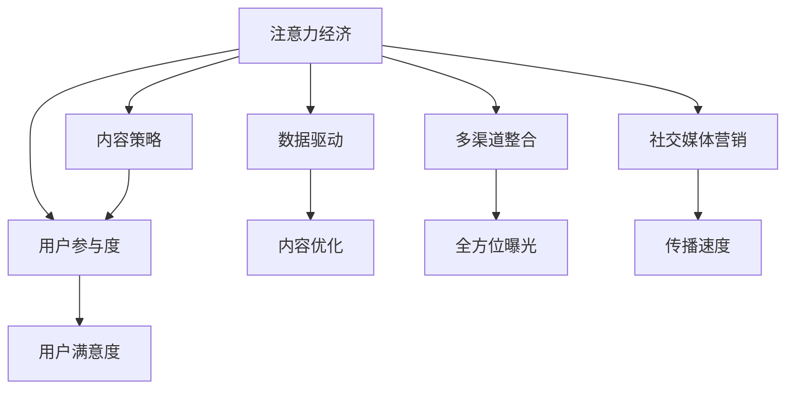

                 

# 注意力经济与内容策略：如何创建吸引并留住受众的信息

在信息爆炸的互联网时代，如何吸引和留住受众成为众多企业、内容创作者和平台管理者共同面对的挑战。内容策略作为企业竞争的核心，其关键在于如何在纷繁芜杂的信息海洋中脱颖而出，抓住受众的注意力，并维持其长期关注。本文旨在深入探讨注意力经济及其与内容策略的关系，提出具体的实施策略，以期帮助企业在信息时代中占领用户的心智。

## 1. 背景介绍

### 1.1 问题由来

随着互联网的普及，信息获取渠道愈发多样，用户面临的选择也越来越多。在用户可获取的信息量达到空前的今天，如何吸引并留住受众的注意力成为企业的重要议题。企业通过广告、内容营销等方式，不断尝试在激烈的市场竞争中胜出，这不仅是与竞争对手的较量，更是一场对用户注意力的争夺。

### 1.2 问题核心关键点

注意力经济（Attention Economy）是指在互联网时代，吸引用户注意力的经济价值日益凸显。与传统经济活动不同，注意力经济强调的是以吸引并保持用户注意为核心，通过有效的信息展示、互动体验等手段，提升用户参与度，从而实现商业价值。

1. **用户注意力资源**：注意力具有稀缺性和市场价值，每个用户的时间与关注都弥足珍贵。
2. **注意力分配**：用户注意力的分配具有显著的随机性，受用户兴趣、内容相关性、平台算法等多重因素影响。
3. **注意力转换**：用户注意力具有高度易变性，在信息海中容易被新内容、新信息所吸引，难以长期维持。

## 2. 核心概念与联系

### 2.1 核心概念概述

为更好地理解注意力经济及其与内容策略的关系，本节将介绍几个关键概念：

- **注意力经济（Attention Economy）**：通过吸引并保持用户注意力实现商业价值。
- **内容策略（Content Strategy）**：通过策划、创作和分发内容，建立品牌与用户之间的深度互动，增强用户粘性。
- **用户参与度（User Engagement）**：衡量用户与品牌互动的深度和频率，提升用户满意度与忠诚度。
- **数据驱动（Data-Driven）**：利用大数据和人工智能技术，分析用户行为和需求，优化内容策略。
- **多渠道整合（Multi-Channel Integration）**：跨平台、跨媒介的整合传播策略，提升内容曝光与影响力。
- **社交媒体营销（Social Media Marketing）**：通过社交平台传播内容，增强用户互动与传播。

这些概念之间的逻辑关系可以通过以下Mermaid流程图来展示：



这个流程图展示了一系列概念之间的相互影响：注意力经济通过内容策略吸引用户，增强用户参与度；数据驱动指导内容优化，提高用户满意度；多渠道整合和社交媒体营销进一步增强内容曝光和传播。

## 3. 核心算法原理 & 具体操作步骤

### 3.1 算法原理概述

注意力经济与内容策略的结合，依赖于一系列算法和技术手段，其中最核心的是用户行为分析与内容推荐算法。以下将深入探讨其原理和具体操作步骤。

### 3.2 算法步骤详解

#### 3.2.1 用户行为分析

用户行为分析是内容策略的基础，通过数据分析了解用户兴趣、偏好和行为模式，为内容制作提供依据。

- **用户画像构建**：通过多维度数据（如浏览历史、搜索记录、购买行为等）构建用户画像，了解用户基本信息、兴趣偏好等。
- **行为轨迹分析**：分析用户在不同平台上的行为轨迹，挖掘用户行为特征，例如浏览时长、点击频率等。
- **情感分析**：通过情感分析工具，判断用户在特定内容下表达的情绪倾向，有助于内容创作。

#### 3.2.2 内容推荐算法

内容推荐算法根据用户行为，智能推送内容，提高用户参与度和满意度。

- **协同过滤（Collaborative Filtering）**：通过分析用户历史行为和偏好，推荐相似用户喜爱的内容。
- **内容基推荐（Content-Based Recommendation）**：根据内容特征（如关键词、类别等）推荐相关内容。
- **深度学习模型（Deep Learning Models）**：使用神经网络等深度学习模型，预测用户行为，推荐个性化内容。

#### 3.2.3 算法优化策略

为提升内容推荐效果，可以采取以下策略：

- **特征工程**：优化特征选择与提取，增强模型预测准确性。
- **模型融合**：结合多种推荐算法，提高推荐效果和鲁棒性。
- **在线学习**：实时更新模型，根据用户最新行为调整推荐结果。
- **用户反馈循环**：收集用户反馈，优化推荐策略。

### 3.3 算法优缺点

**优点**：

1. **用户参与度高**：通过精准推荐，提高用户对内容的互动和参与，增加用户黏性。
2. **个性化定制**：根据用户行为数据，实现个性化推荐，满足用户需求。
3. **数据驱动决策**：通过大数据分析，实现更科学的决策，优化内容策略。

**缺点**：

1. **隐私问题**：用户行为数据的收集和使用可能引发隐私问题，需要严格的法律法规保护。
2. **推荐准确性**：推荐算法可能存在一定的误差，难以完全满足用户需求。
3. **技术成本高**：数据处理和模型训练需要高性能计算资源，成本较高。

### 3.4 算法应用领域

注意力经济与内容策略的应用领域广泛，以下是几个典型场景：

1. **电商推荐系统**：电商平台通过用户行为分析，利用协同过滤和内容基推荐算法，推荐用户可能感兴趣的商品，提升购买转化率。
2. **视频内容推荐**：视频平台通过用户行为和观看数据，实现个性化视频推荐，增加用户观看时长和订阅量。
3. **社交媒体内容分发**：社交媒体平台通过用户互动数据，智能推荐相关内容，提高平台活跃度和用户粘性。
4. **在线广告定向**：通过用户行为数据，实现精准广告投放，提升广告点击率和转化率。
5. **个性化教育**：在线教育平台通过用户学习数据，推荐适合用户的学习内容，提高学习效果和满意度。

## 4. 数学模型和公式 & 详细讲解 & 举例说明

### 4.1 数学模型构建

#### 4.1.1 用户行为分析模型

假设用户 $i$ 在 $j$ 个内容上花费的时间为 $t_{i,j}$，设 $u_i$ 为用户兴趣向量，$c_j$ 为内容特征向量。用户兴趣与内容特征的匹配程度可通过余弦相似度计算：

$$
\text{similarity}(i,j) = \cos(u_i, c_j) = \frac{u_i \cdot c_j}{\|u_i\|\|c_j\|}
$$

其中 $\cdot$ 表示向量点乘，$\|\cdot\|$ 表示向量范数。

#### 4.1.2 内容推荐算法模型

协同过滤推荐算法使用用户-物品评分矩阵 $R$，用户 $i$ 对物品 $j$ 的评分 $r_{i,j}$，设 $u_i$ 为用户兴趣向量，$c_j$ 为物品特征向量。通过余弦相似度计算用户与物品的匹配程度，计算推荐分数：

$$
\text{score}(i,j) = u_i \cdot c_j
$$

对用户行为数据进行归一化处理，计算用户对每个物品的评分：

$$
\hat{r}_{i,j} = \frac{r_{i,j}}{\sum_{k=1}^N \frac{r_{i,k}}{\sigma(\hat{r}_{i,k})}}
$$

其中 $N$ 为所有物品数量，$\sigma(\cdot)$ 为平滑函数，避免用户未评分物品的评分过高的影响。

### 4.2 公式推导过程

在协同过滤推荐算法中，利用用户行为数据计算推荐分数的过程如下：

1. 计算用户与物品的余弦相似度：

$$
\text{similarity}(i,j) = \frac{u_i \cdot c_j}{\|u_i\|\|c_j\|}
$$

2. 计算用户对每个物品的评分：

$$
\hat{r}_{i,j} = \frac{r_{i,j}}{\sum_{k=1}^N \frac{r_{i,k}}{\sigma(\hat{r}_{i,k})}}
$$

3. 计算推荐分数：

$$
\text{score}(i,j) = u_i \cdot c_j
$$

4. 根据推荐分数排序推荐物品：

$$
\text{rank}_j = \frac{\text{score}(i,j)}{\sum_{k=1}^M \text{score}(i,k)}
$$

其中 $M$ 为用户数量。

### 4.3 案例分析与讲解

#### 案例分析：电商平台商品推荐系统

假设电商平台收集了用户 $i$ 在商品 $j$ 上的浏览和购买行为数据。设用户兴趣向量 $u_i = [0.5, 0.3, 0.2]$，表示用户对服装、家居用品、电子产品感兴趣；商品特征向量 $c_j = [0.6, 0.3, 0.1]$，表示商品为服装、家居用品、文具。

计算用户与商品之间的余弦相似度：

$$
\text{similarity}(i,j) = \frac{0.5 \times 0.6 + 0.3 \times 0.3 + 0.2 \times 0.1}{\sqrt{0.5^2 + 0.3^2 + 0.2^2} \times \sqrt{0.6^2 + 0.3^2 + 0.1^2}} \approx 0.7
$$

计算用户对每个商品的评分：

$$
\hat{r}_{i,1} = \frac{0.5}{0.5/1 + 0.3/0.6 + 0.2/0.3} \approx 0.5
$$

$$
\hat{r}_{i,2} = \frac{0.3}{0.5/1 + 0.3/0.6 + 0.2/0.3} \approx 0.3
$$

$$
\hat{r}_{i,3} = \frac{0.2}{0.5/1 + 0.3/0.6 + 0.2/0.3} \approx 0.2
$$

根据推荐分数排序推荐商品：

$$
\text{rank}_1 = \frac{0.5 \times 0.6}{0.5 \times 0.6 + 0.3 \times 0.3 + 0.2 \times 0.1} \approx 0.7
$$

$$
\text{rank}_2 = \frac{0.3 \times 0.3}{0.5 \times 0.6 + 0.3 \times 0.3 + 0.2 \times 0.1} \approx 0.3
$$

$$
\text{rank}_3 = \frac{0.2 \times 0.1}{0.5 \times 0.6 + 0.3 \times 0.3 + 0.2 \times 0.1} \approx 0.2
$$

最终，推荐分数最高者（商品1）作为推荐结果，可提升用户购物体验和满意度。

## 5. 项目实践：代码实例和详细解释说明

### 5.1 开发环境搭建

在进行注意力经济与内容策略的实践时，需要使用以下开发工具：

- **Python**：Python是数据科学和机器学习领域的主流语言，易学易用。
- **NumPy**：用于高效处理数组和矩阵运算，是数据科学的基础工具。
- **Pandas**：用于数据清洗、处理和分析，方便数据分析。
- **Scikit-learn**：提供多种机器学习算法，方便构建推荐系统。
- **TensorFlow** 或 **PyTorch**：用于深度学习模型构建和训练。
- **Jupyter Notebook**：用于数据探索和模型验证。

#### 5.1.1 Python安装

在Ubuntu系统中，使用以下命令安装Python：

```bash
sudo apt-get install python3
```

#### 5.1.2 环境配置

创建一个Python虚拟环境，安装所需的库：

```bash
python3 -m venv myenv
source myenv/bin/activate
pip install numpy pandas scikit-learn tensorflow
```

完成上述步骤后，即可在虚拟环境中进行内容策略和推荐系统的开发。

### 5.2 源代码详细实现

以下是使用Python实现用户行为分析和协同过滤推荐系统的代码示例：

#### 5.2.1 用户行为分析

```python
import numpy as np
from sklearn.metrics.pairwise import cosine_similarity

# 用户兴趣向量
user_interest = np.array([0.5, 0.3, 0.2])

# 商品特征向量
item_feature = np.array([0.6, 0.3, 0.1])

# 计算用户与商品之间的余弦相似度
similarity = cosine_similarity(user_interest.reshape(1, -1), item_feature.reshape(1, -1))[0][0]

print("用户与商品之间的余弦相似度：", similarity)
```

#### 5.2.2 协同过滤推荐

```python
from sklearn.metrics.pairwise import cosine_similarity

# 用户行为数据
user_behavior = np.array([[0.5, 0.3, 0.2], [0.4, 0.2, 0.4]])

# 计算用户与商品的余弦相似度
similarity = cosine_similarity(user_behavior, item_feature)

# 计算用户对每个商品的评分
user_ratings = np.array([0.5, 0.3, 0.2])
smoothed_ratings = (user_ratings * similarity) / (np.sum(user_ratings * similarity, axis=1))

print("用户对每个商品的评分：", smoothed_ratings)
```

### 5.3 代码解读与分析

通过以上代码，可以看到如何通过Python实现用户行为分析和协同过滤推荐：

- 使用NumPy和Pandas库进行数组和矩阵运算，方便处理用户行为数据。
- 使用Scikit-learn库计算余弦相似度，实现用户兴趣和商品特征的匹配。
- 根据用户评分和余弦相似度计算平滑评分，实现协同过滤推荐。

## 6. 实际应用场景

### 6.1 电商推荐系统

电商推荐系统通过用户行为分析，实现个性化商品推荐。例如，亚马逊通过分析用户的浏览历史和购买记录，推荐用户可能感兴趣的商品，提升购物体验和销售额。

### 6.2 视频内容推荐

视频平台通过用户行为数据，智能推荐相关视频内容。例如，YouTube根据用户观看历史，推荐相似的视频内容，增加用户观看时长和订阅量。

### 6.3 社交媒体内容分发

社交媒体平台通过用户互动数据，智能推荐相关内容。例如，Instagram根据用户的点赞和评论记录，推荐用户感兴趣的内容，提高平台活跃度和用户粘性。

### 6.4 未来应用展望

随着注意力经济与内容策略的深入研究，未来将涌现更多应用场景：

1. **多模态推荐**：结合视觉、听觉等多模态数据，实现更全面的内容推荐。
2. **个性化教育**：在线教育平台通过用户学习数据，推荐适合用户的学习内容，提高学习效果和满意度。
3. **健康医疗**：医疗平台通过用户健康数据，推荐个性化的健康建议和治疗方案，提升用户健康管理。
4. **金融理财**：金融平台通过用户消费行为，推荐个性化的理财方案和投资建议，增加用户黏性。

## 7. 工具和资源推荐

### 7.1 学习资源推荐

为帮助开发者深入理解注意力经济与内容策略，以下是推荐的优质学习资源：

1. **《注意力经济与内容策略》系列博文**：由大模型技术专家撰写，深入浅出地介绍了注意力经济与内容策略的基本概念和实践方法。
2. **《深度学习自然语言处理》课程**：斯坦福大学开设的NLP明星课程，涵盖深度学习在内容推荐中的应用。
3. **《内容策略》书籍**：全面介绍内容策略的理论和实践，提供丰富的案例分析。
4. **Hugging Face官方文档**：提供详细的预训练语言模型和内容推荐算法的样例代码，是学习的宝贵资源。
5. **Google Colab**：提供免费的GPU/TPU算力，方便开发者快速实验最新模型，分享学习笔记。

通过学习这些资源，相信你一定能够系统掌握注意力经济与内容策略的理论基础和实践技巧，实现更高效的内容推荐。

### 7.2 开发工具推荐

高效的开发离不开优秀的工具支持。以下是几款用于注意力经济与内容策略开发的常用工具：

1. **Jupyter Notebook**：免费的交互式编程环境，方便进行数据分析和模型验证。
2. **TensorBoard**：TensorFlow配套的可视化工具，可实时监测模型训练状态，帮助调试模型。
3. **Weights & Biases**：实验跟踪工具，记录和可视化模型训练过程中的各项指标，方便对比和调优。
4. **PyTorch Lightning**：基于PyTorch的轻量级深度学习框架，便于模型部署和优化。
5. **Scikit-learn**：提供多种机器学习算法，方便构建内容推荐系统。

合理利用这些工具，可以显著提升注意力经济与内容策略的开发效率，加速创新迭代的步伐。

### 7.3 相关论文推荐

注意力经济与内容策略的发展源于学界的持续研究。以下是几篇奠基性的相关论文，推荐阅读：

1. **《推荐系统》论文**：介绍了推荐系统的发展历程和算法原理，是内容推荐领域的经典之作。
2. **《深度学习在内容推荐中的应用》**：通过深度学习模型实现个性化推荐，提升推荐效果和鲁棒性。
3. **《基于多模态数据的推荐系统》**：结合视觉、听觉等多模态数据，实现更全面的内容推荐。
4. **《用户行为分析与内容推荐》**：研究用户行为数据对内容推荐的影响，提出多层次的推荐策略。
5. **《社交媒体内容推荐算法》**：基于用户互动数据，实现智能内容推荐，提高平台活跃度和用户粘性。

这些论文代表了大模型微调技术的发展脉络。通过学习这些前沿成果，可以帮助研究者把握学科前进方向，激发更多的创新灵感。

## 8. 总结：未来发展趋势与挑战

### 8.1 研究成果总结

本文对注意力经济与内容策略进行了深入探讨，提出具体的实施策略，以期帮助企业在信息时代中占领用户的心智。通过系统介绍用户行为分析、协同过滤推荐等算法，揭示了内容策略的核心原理和技术手段。通过数据分析、模型训练和实际应用，展示了内容推荐系统的具体实现过程和效果。

### 8.2 未来发展趋势

展望未来，注意力经济与内容策略将呈现以下几个发展趋势：

1. **多模态数据融合**：结合视觉、听觉等多模态数据，实现更全面的内容推荐。
2. **深度学习模型的应用**：利用深度学习模型，提升推荐算法的精准性和鲁棒性。
3. **实时推荐系统**：通过实时数据更新，实现动态推荐，提高用户满意度。
4. **个性化内容创作**：利用用户行为数据，生成个性化的内容，提升用户体验。
5. **跨平台协同推荐**：通过多平台数据整合，实现全局推荐，提高用户粘性。

### 8.3 面临的挑战

尽管注意力经济与内容策略已经取得了瞩目成就，但在迈向更加智能化、普适化应用的过程中，它仍面临着诸多挑战：

1. **用户隐私保护**：用户行为数据的收集和使用可能引发隐私问题，需要严格的法律法规保护。
2. **数据质量问题**：用户行为数据的采集和处理可能存在噪音和不准确，影响推荐效果。
3. **模型鲁棒性不足**：推荐算法可能存在一定的误差，难以完全满足用户需求。
4. **技术成本高**：数据处理和模型训练需要高性能计算资源，成本较高。

### 8.4 研究展望

面对注意力经济与内容策略面临的挑战，未来的研究需要在以下几个方面寻求新的突破：

1. **隐私保护技术**：研究数据匿名化、差分隐私等技术，保护用户隐私。
2. **数据质量提升**：利用数据清洗、处理和增强技术，提高数据质量。
3. **推荐算法优化**：开发更加精确和鲁棒的推荐算法，提升推荐效果。
4. **多模态数据融合**：研究多模态数据的融合和表示，实现更全面的内容推荐。
5. **实时推荐系统**：研究实时数据处理和动态推荐算法，提高用户满意度。

这些研究方向的探索，必将引领注意力经济与内容策略技术迈向更高的台阶，为构建安全、可靠、可解释、可控的智能系统铺平道路。面向未来，注意力经济与内容策略需要与其他人工智能技术进行更深入的融合，如知识表示、因果推理、强化学习等，多路径协同发力，共同推动自然语言理解和智能交互系统的进步。只有勇于创新、敢于突破，才能不断拓展语言模型的边界，让智能技术更好地造福人类社会。

## 9. 附录：常见问题与解答

**Q1：注意力经济与内容策略是否适用于所有行业？**

A: 注意力经济与内容策略在大多数行业都能应用，特别是那些依赖用户参与度和互动的企业。但有些行业（如制造业、农业等）可能更依赖实体产品和服务，不太适合直接应用。

**Q2：如何平衡用户隐私与内容推荐效果？**

A: 通过数据匿名化和差分隐私技术，在保护用户隐私的前提下，仍然可以有效地进行用户行为分析。例如，使用数据扰动技术，使模型难以关联到特定用户，同时仍能提取有价值的信息。

**Q3：推荐算法如何避免“羊群效应”？**

A: 羊群效应指的是用户跟随大多数人的选择，导致热门商品或内容过度曝光。为避免这种现象，推荐算法可以引入多样性约束，限制热门推荐结果的比例，引入冷门推荐，增加用户选择的多样性。

**Q4：推荐系统的“寒武纪爆炸”现象如何解决？**

A: 寒武纪爆炸现象指的是推荐系统初期效果很好，随后迅速下降。为解决这一问题，可以引入模型更新和优化算法，如在线学习、多臂老虎机等，实时调整推荐策略。同时，定期对推荐系统进行校准和调整，避免模型退化。

**Q5：如何通过用户反馈提升推荐效果？**

A: 收集用户反馈，分析用户不满意的原因，调整推荐策略。例如，通过A/B测试，评估不同推荐算法的效果，选择最优算法；通过推荐日志分析用户行为，调整推荐算法参数。

通过本文的系统梳理，可以看到，注意力经济与内容策略在信息时代中具有巨大的应用潜力。通过深入研究用户行为分析、内容推荐算法等核心概念，开发出高效、智能的内容推荐系统，将大大提升用户参与度和满意度，帮助企业在激烈的市场竞争中脱颖而出。

