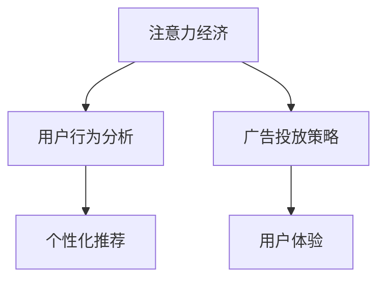

                 

# 注意力经济与在线广告目标与策略：在不牺牲用户体验的情况下吸引受众

> 关键词：注意力经济, 在线广告, 用户行为分析, 广告投放策略, 个性化推荐, 用户体验

## 1. 背景介绍

### 1.1 问题由来
在互联网时代，注意力资源成为一种稀缺资源。相比于信息爆炸，人们可用的注意力显得愈发稀缺，如何有效利用这一稀缺资源，成为企业关注的焦点。尤其是在竞争激烈的网络空间中，如何吸引和留住用户，将流量转化为有效的注意力经济，成为了在线广告的核心问题。

### 1.2 问题核心关键点
如何实现用户关注与广告收益的最大化，而不牺牲用户体验，成为了在线广告的主要挑战。当前的主流广告投放策略大多依赖于曝光率、点击率、转化率等指标，然而这些指标在实际应用中存在明显的局限性。例如，过于追求点击率和转化率可能导致内容质量下降，用户体验受损，从而影响广告的长期效果。

### 1.3 问题研究意义
理解并应用注意力经济原理，设计高效且兼顾用户体验的在线广告目标与策略，对企业的精准营销、用户留存和品牌建设具有重要意义。广告投放不仅要追求短期的点击率和转化率，更要关注长期的用户粘性和品牌认知。

## 2. 核心概念与联系

### 2.1 核心概念概述

为更好地理解基于注意力经济的在线广告策略，本节将介绍几个密切相关的核心概念：

- **注意力经济**：指在信息过载的环境下，注意力资源的稀缺性和价值。广告主需要在有限的注意力资源中，寻找最有效的广告投放策略，最大化广告的回报。

- **用户行为分析**：通过数据挖掘、机器学习等技术，分析用户的行为模式、兴趣偏好等信息，为广告投放提供精准的目标用户画像。

- **广告投放策略**：根据用户画像和广告目标，制定合理的广告投放计划和策略，以最优化的方式达到广告效果。

- **个性化推荐**：结合用户画像和广告内容，实现用户与广告的精准匹配，提升广告的吸引力和转化率。

- **用户体验**：用户在使用互联网产品或服务过程中产生的感受和满意度。在广告投放中，平衡广告效果和用户体验，是广告策略设计的重要目标。

这些核心概念之间的逻辑关系可以通过以下Mermaid流程图来展示：



这个流程图展示了几者之间的内在联系：

1. 广告投放策略需要依赖注意力经济和用户行为分析，制定合理的广告投放计划。
2. 个性化推荐结合用户画像和广告内容，提升广告的吸引力。
3. 最终广告效果需要在不牺牲用户体验的前提下，达到最大化。

## 3. 核心算法原理 & 具体操作步骤
### 3.1 算法原理概述

基于注意力经济的在线广告策略，核心在于理解和量化用户对广告的注意力，并在用户注意力最大化的前提下，实现广告收益的最大化。具体来说，需要结合用户画像、广告内容以及用户行为数据，设计合理的广告投放策略和个性化推荐方案。

该策略基于以下假设：
- 用户的注意力是有限的，且不同时间段和不同情景下的注意力分布不同。
- 广告效果不仅取决于曝光率和点击率，更取决于用户对广告的感知和兴趣。
- 个性化推荐可以提升广告的吸引力和转化率，同时提高用户体验。

### 3.2 算法步骤详解

基于注意力经济的在线广告策略，主要包括以下几个关键步骤：

**Step 1: 用户行为数据的收集与分析**

- 收集用户的网络行为数据，包括浏览记录、点击记录、搜索记录等。
- 通过聚类分析、关联规则挖掘等技术，分析用户的行为模式和兴趣偏好。
- 对用户进行标签化，形成用户画像。

**Step 2: 广告投放计划的制定**

- 根据用户画像和广告内容，设计广告投放的预算、时间段、频次等策略。
- 利用A/B测试等方法，优化广告投放计划，找出最优的投放组合。

**Step 3: 个性化推荐方案的设计**

- 结合用户画像和广告内容，设计个性化推荐算法，如协同过滤、基于内容的推荐等。
- 根据用户的行为数据，实时调整推荐结果，提高广告的相关性和吸引力。

**Step 4: 用户体验的优化**

- 通过A/B测试、用户调查等方式，评估广告投放策略对用户体验的影响。
- 根据用户体验的反馈，不断优化广告投放方案，确保广告投放不会对用户体验造成负面影响。

**Step 5: 广告效果评估**

- 定期评估广告的曝光率、点击率、转化率等指标，同时关注用户的行为数据变化。
- 结合用户反馈和行为数据，优化广告投放策略，提升广告效果。

以上是基于注意力经济的在线广告策略的一般流程。在实际应用中，还需要针对具体任务的特点，对策略的各个环节进行优化设计，如改进用户行为分析方法，引入更多个性化推荐技术，搜索最优的广告投放方案等，以进一步提升广告效果。

### 3.3 算法优缺点

基于注意力经济的在线广告策略具有以下优点：
1. 提升广告效果：通过个性化推荐和精准投放，可以显著提升广告的吸引力和转化率。
2. 关注用户体验：通过A/B测试和用户反馈，可以优化广告策略，提升用户体验，避免过度曝光。
3. 数据驱动决策：通过数据分析和模型优化，可以制定科学的广告投放策略，减少试错成本。

同时，该策略也存在一定的局限性：
1. 数据隐私问题：大规模收集用户行为数据，可能引发数据隐私和安全问题。
2. 模型复杂度：个性化推荐和用户行为分析涉及复杂的算法模型，需要较高的技术门槛和计算资源。
3. 成本高昂：精确的广告投放策略往往需要大量的数据和计算资源，成本较高。
4. 动态变化：用户行为和注意力分布是动态变化的，需要实时调整广告策略，增加了运营难度。

尽管存在这些局限性，但就目前而言，基于注意力经济的广告策略仍是实现精准营销和提高广告效果的重要手段。未来相关研究的重点在于如何进一步优化模型效率，降低数据收集成本，提高广告投放的实时性和精准性，同时兼顾用户隐私和数据安全。

### 3.4 算法应用领域

基于注意力经济的在线广告策略，在电商、社交媒体、移动应用等多个领域得到了广泛的应用，具体包括：

- 电子商务：通过个性化推荐和精准广告投放，提升用户的购买转化率。
- 社交媒体：利用用户行为分析，提供精准的广告定向和内容推荐，提高用户粘性。
- 移动应用：结合用户的使用习惯和兴趣偏好，实现动态的广告推荐和推送。
- 在线视频：根据用户的观看记录和兴趣标签，实现个性化的视频广告推荐，提升广告效果。
- 搜索广告：在用户搜索时，通过精准的广告投放和推荐，提升广告的点击率和转化率。

除了这些常见应用外，基于注意力经济的广告策略还广泛应用于更多的行业领域，如在线旅游、智能家居、金融科技等，为企业的精准营销和用户留存提供了新的解决方案。

## 4. 数学模型和公式 & 详细讲解 & 举例说明

### 4.1 数学模型构建

本节将使用数学语言对基于注意力经济的在线广告策略进行更加严格的刻画。

记用户的注意力值为 $A$，广告的吸引力值为 $B$，用户对广告的兴趣度为 $I$，广告的曝光频率为 $F$。设广告的点击率为 $C$，转化率为 $T$。

广告投放的效果可通过最大化以下函数来评估：

$$
\maximize f(I, A, B, F) = I \times \log C + A \times \log T
$$

其中 $C$ 和 $T$ 分别为点击率和转化率的函数，需通过用户行为数据和模型计算得出。

### 4.2 公式推导过程

以点击率 $C$ 为例，其函数形式可以表示为：

$$
C = f(I, A, B, F) = \frac{I \times A \times B \times F}{\sum_{j=1}^N (I_j \times A_j \times B_j \times F_j)}
$$

其中 $I_j$、$A_j$、$B_j$、$F_j$ 分别为第 $j$ 个用户对广告的兴趣度、吸引力、兴趣度和曝光频率。

通过对 $I$、$A$、$B$、$F$ 进行建模和优化，可以实现对广告效果的精确计算和评估。

### 4.3 案例分析与讲解

以下我们以电商网站为例，给出基于注意力经济的广告投放策略的数学模型和具体案例。

假设某电商网站推出一款新产品，并希望通过广告投放推广该产品。根据用户行为数据，我们可以获得用户对产品的兴趣度 $I$、广告的吸引力 $A$、广告的曝光频率 $F$ 和用户对广告的点击率 $C$。

1. 用户兴趣度 $I$：通过用户对产品的浏览记录和搜索记录，计算用户对产品的兴趣度。假设用户的兴趣度可以表示为一个向量 $\mathbf{I} = [I_1, I_2, ..., I_N]$，其中 $I_j$ 为第 $j$ 个用户的兴趣度。

2. 广告吸引力 $A$：广告吸引力可以通过产品描述、价格、促销活动等因素计算得出。假设广告吸引力为向量 $\mathbf{A} = [A_1, A_2, ..., A_N]$。

3. 广告曝光频率 $F$：广告的曝光频率可以根据用户对广告的浏览记录计算得出。假设广告曝光频率为向量 $\mathbf{F} = [F_1, F_2, ..., F_N]$。

4. 广告点击率 $C$：通过用户对广告的点击记录，计算广告的点击率。假设点击率为向量 $\mathbf{C} = [C_1, C_2, ..., C_N]$。

结合上述数据，我们可以构建广告投放效果的数学模型：

$$
\maximize \sum_{i=1}^N [I_i \times \log C_i + A_i \times \log T_i]
$$

其中 $T_i$ 为用户对广告的转化率，可以通过广告点击和购买行为计算得出。

通过优化上述模型，可以计算出最佳的广告投放策略，实现广告效果和用户体验的最大化。

## 5. 项目实践：代码实例和详细解释说明
### 5.1 开发环境搭建

在进行广告策略开发前，我们需要准备好开发环境。以下是使用Python进行广告投放策略开发的开发环境配置流程：

1. 安装Anaconda：从官网下载并安装Anaconda，用于创建独立的Python环境。

2. 创建并激活虚拟环境：
```bash
conda create -n ad-env python=3.8 
conda activate ad-env
```

3. 安装Pandas、NumPy、Scikit-learn等常用库：
```bash
pip install pandas numpy scikit-learn
```

4. 安装TensorFlow或PyTorch：选择适合的深度学习框架进行广告推荐系统的搭建。
```bash
pip install tensorflow 
# 或
pip install torch
```

5. 安装广告推荐相关的库：
```bash
pip install ad-py
```

完成上述步骤后，即可在`ad-env`环境中开始广告投放策略的开发和测试。

### 5.2 源代码详细实现

以下是使用TensorFlow进行广告投放策略开发的Python代码实现。

```python
import tensorflow as tf
from ad_py import AdDataset

# 加载广告数据集
dataset = AdDataset('ads.csv', 'users.csv', 'clicks.csv')

# 定义广告投放策略的超参数
learning_rate = 0.01
batch_size = 128
epochs = 100

# 定义广告投放策略模型
model = tf.keras.Sequential([
    tf.keras.layers.Dense(32, activation='relu', input_shape=(4,)),
    tf.keras.layers.Dense(1, activation='sigmoid')
])

# 编译模型
model.compile(optimizer=tf.keras.optimizers.Adam(learning_rate),
              loss='binary_crossentropy',
              metrics=['accuracy'])

# 训练模型
model.fit(dataset.train(), epochs=epochs, batch_size=batch_size, validation_data=dataset.val())

# 测试模型
test_loss, test_acc = model.evaluate(dataset.test())
print(f'Test accuracy: {test_acc:.2f}')
```

上述代码实现了一个简单的广告投放策略模型，通过TensorFlow框架进行训练和测试。在实际应用中，还需进一步优化模型的结构和超参数，结合更多的用户行为数据和广告特征，实现更加精准的广告投放策略。

### 5.3 代码解读与分析

让我们再详细解读一下关键代码的实现细节：

**AdDataset类**：
- 自定义的数据集类，用于加载和处理广告数据集，包括用户行为数据、广告数据和点击数据。
- 封装了数据加载、预处理、特征工程等操作，简化了广告投放策略的实现。

**广告投放策略模型**：
- 使用Keras框架定义了一个包含两个Dense层的神经网络，用于预测用户对广告的点击率。
- 第一层使用ReLU激活函数，第二层使用Sigmoid激活函数，用于输出点击概率。

**模型编译和训练**：
- 通过`model.compile`方法编译模型，指定了优化器、损失函数和评估指标。
- 使用`model.fit`方法训练模型，通过训练数据集和验证数据集进行迭代优化。

**模型评估**：
- 通过`model.evaluate`方法在测试集上评估模型效果，输出测试准确率。

可以看到，TensorFlow框架提供了简单易用的API，方便开发者构建和训练广告投放策略模型。同时，通过自定义数据集类，简化了数据加载和处理的过程，提高了开发效率。

当然，在实际应用中，还需要考虑更多因素，如模型的超参数调优、数据增强、正则化等。但核心的广告投放策略实现基本与此类似。

## 6. 实际应用场景
### 6.1 电商平台广告投放

电商平台通过广告投放策略，可以有效提升商品的曝光率和销售转化率。在具体实现中，可以收集用户的浏览、点击、购买等行为数据，结合商品属性和广告内容，进行精准的广告投放。例如，某电商平台推出新产品时，可以使用基于用户行为数据的广告投放策略，通过个性化推荐和定向广告，提升用户的购买意愿。

### 6.2 社交媒体广告投放

社交媒体广告通过精准的用户画像和行为分析，实现广告的定向投放。在具体实现中，可以收集用户的社交行为数据、兴趣标签等，结合广告内容，进行精准的广告推荐。例如，某社交媒体平台推出的新应用功能，可以使用基于用户兴趣的行为分析，实现精准的广告定向投放，提升用户对新功能的兴趣和参与度。

### 6.3 在线视频广告投放

在线视频平台通过用户行为数据和广告内容，实现广告的动态推荐和投放。在具体实现中，可以收集用户的观看记录、点赞、评论等数据，结合广告内容，进行个性化的视频广告推荐。例如，某在线视频平台推出的新电影，可以使用基于用户观影行为的视频广告推荐，提升用户对新电影的兴趣和观看意愿。

### 6.4 未来应用展望

随着广告投放策略技术的不断发展，未来将在更多领域得到应用，为企业的精准营销和用户留存提供新的解决方案。

在智慧医疗领域，基于用户行为数据的广告策略可以实现精准医疗广告的投放，提高用户对医疗服务的认知和参与度。

在智能家居领域，基于用户行为数据的广告策略可以实现智能家居产品的精准推荐，提升用户对智能家居产品的使用粘性和满意度。

在金融科技领域，基于用户行为数据的广告策略可以实现金融产品的精准推荐，提升用户对金融产品的购买转化率和忠诚度。

除了这些常见应用外，基于注意力经济的广告策略还将广泛应用于更多的行业领域，如教育、旅游、游戏等，为企业的精准营销和用户留存提供新的解决方案。相信随着技术的不断进步，广告策略的应用将更加广泛，为企业带来更多的商业价值和用户体验。

## 7. 工具和资源推荐
### 7.1 学习资源推荐

为了帮助开发者系统掌握广告投放策略的理论基础和实践技巧，这里推荐一些优质的学习资源：

1. 《广告学原理》：由知名广告学专家编写，系统介绍了广告学的基础理论和实践方法，是广告学研究的重要参考书。

2. 《机器学习实战》：介绍了机器学习的基本概念和常用算法，结合广告投放策略的案例，帮助开发者掌握实际应用中的技术要点。

3. 《深度学习与推荐系统》：深入讲解了深度学习在推荐系统中的应用，包括用户行为分析、广告投放策略等关键内容，是推荐系统开发的必备资源。

4. Google AdWords Ads API文档：Google广告平台提供的API接口文档，详细介绍了广告投放的各项参数和接口，是广告投放策略开发的重要参考。

5. Kaggle广告投放竞赛：Kaggle提供的广告投放竞赛，可以帮助开发者了解广告投放的实际场景和数据处理技术，提高广告投放策略的实战能力。

通过对这些资源的学习实践，相信你一定能够快速掌握广告投放策略的精髓，并用于解决实际的广告投放问题。

### 7.2 开发工具推荐

高效的开发离不开优秀的工具支持。以下是几款用于广告投放策略开发的常用工具：

1. TensorFlow：基于Python的开源深度学习框架，提供高效的图计算和模型训练功能，适合广告投放策略的开发和优化。

2. PyTorch：基于Python的开源深度学习框架，灵活动态的计算图，适合快速迭代研究和实验。

3. Scikit-learn：基于Python的机器学习库，提供丰富的机器学习算法和模型评估工具，适合数据预处理和特征工程。

4. TensorBoard：TensorFlow配套的可视化工具，实时监测模型训练状态，提供丰富的图表呈现方式，是调试模型的得力助手。

5. Weights & Biases：模型训练的实验跟踪工具，可以记录和可视化模型训练过程中的各项指标，方便对比和调优。

6. Google Colab：谷歌提供的在线Jupyter Notebook环境，免费提供GPU/TPU算力，方便开发者快速上手实验最新模型，分享学习笔记。

合理利用这些工具，可以显著提升广告投放策略的开发效率，加快创新迭代的步伐。

### 7.3 相关论文推荐

广告投放策略的发展源于学界的持续研究。以下是几篇奠基性的相关论文，推荐阅读：

1. AdWords Campaigns 1.0：Google广告平台的研究论文，介绍了广告投放策略的原理和实现方法，是广告投放策略开发的经典案例。

2. Click-Through Rates Predictions and Augmentation in Text Ad Click-Through Rate Prediction：研究论文介绍了基于机器学习的广告点击率预测方法，提出了多种特征工程和模型优化技术。

3. Impact of Appetitive and Avoidative Attributes on Ad Satisfaction：通过实验研究了用户对广告的满意度和认知，提出了改进广告投放策略的方法。

4. Incorporating Video Viewing Information in Targeted Video Advertising：研究论文介绍了基于视频行为数据的广告投放策略，提出了实时动态推荐的技术方案。

这些论文代表了大语言模型微调技术的发展脉络。通过学习这些前沿成果，可以帮助研究者把握学科前进方向，激发更多的创新灵感。

## 8. 总结：未来发展趋势与挑战

### 8.1 总结

本文对基于注意力经济的在线广告策略进行了全面系统的介绍。首先阐述了注意力经济和用户行为分析在广告投放中的重要性，明确了广告投放策略在企业精准营销、用户留存和品牌建设中的独特价值。其次，从原理到实践，详细讲解了广告投放策略的数学模型和关键步骤，给出了广告投放策略开发的完整代码实例。同时，本文还广泛探讨了广告策略在电商平台、社交媒体、在线视频等多个行业领域的应用前景，展示了广告策略范式的巨大潜力。

通过本文的系统梳理，可以看到，基于注意力经济的广告策略正在成为精准营销的重要手段，极大地提升了广告效果和用户体验。未来，伴随广告投放策略技术的持续演进，相信精准营销将继续拓展其应用边界，为企业的数字化转型提供新的动力。

### 8.2 未来发展趋势

展望未来，基于注意力经济的广告策略将呈现以下几个发展趋势：

1. 数据驱动的精准投放：随着数据收集和处理技术的进步，广告投放策略将更加依赖于用户行为数据和广告内容，实现更加精准的投放。

2. 实时动态调整：广告投放策略将能够实时响应用户行为变化，动态调整广告内容和投放策略，提升广告效果。

3. 多渠道融合：广告投放策略将实现跨渠道的融合，结合社交媒体、搜索引擎、视频平台等多渠道数据，提升广告的覆盖率和投放效果。

4. 个性化推荐技术进步：个性化推荐技术的发展，将进一步提升广告的吸引力和转化率，增强用户粘性和满意度。

5. 用户体验优化：广告投放策略将更加关注用户体验，避免过度曝光和频繁打扰，提升用户对广告的接受度和满意度。

6. 智能广告推荐：结合机器学习、自然语言处理等技术，实现更加智能化的广告推荐，提升广告的转化率和用户满意度。

以上趋势凸显了广告投放策略技术的广阔前景。这些方向的探索发展，必将进一步提升广告效果和用户体验，为企业的精准营销和用户留存提供新的解决方案。

### 8.3 面临的挑战

尽管基于注意力经济的广告策略已经取得了瞩目成就，但在迈向更加智能化、普适化应用的过程中，它仍面临着诸多挑战：

1. 数据隐私问题：大规模收集用户行为数据，可能引发数据隐私和安全问题，如何保护用户隐私，是广告策略发展的重要课题。

2. 模型复杂度：广告投放策略涉及复杂的机器学习和深度学习模型，需要较高的技术门槛和计算资源，如何降低模型复杂度，提高效率，是广告策略优化的一大挑战。

3. 成本高昂：精确的广告投放策略往往需要大量的数据和计算资源，成本较高，如何降低成本，提高广告投放的性价比，是广告策略优化的一大挑战。

4. 动态变化：用户行为和注意力分布是动态变化的，如何实时调整广告策略，实现动态优化，是广告策略设计的重要难题。

5. 用户体验优化：广告投放策略需要在不牺牲用户体验的前提下，实现广告效果的最大化，如何平衡广告效果和用户体验，是广告策略设计的核心问题。

6. 技术集成难度：广告投放策略需要结合多种技术，如机器学习、深度学习、自然语言处理等，如何实现技术集成，优化广告投放策略，是广告策略实现的重要难题。

正视广告策略面临的这些挑战，积极应对并寻求突破，将是大语言模型微调走向成熟的必由之路。相信随着学界和产业界的共同努力，这些挑战终将一一被克服，广告策略必将在构建人机协同的智能时代中扮演越来越重要的角色。

### 8.4 研究展望

面对广告策略面临的挑战，未来的研究需要在以下几个方面寻求新的突破：

1. 探索无监督和半监督广告投放方法。摆脱对大规模标注数据的依赖，利用自监督学习、主动学习等无监督和半监督范式，最大限度利用非结构化数据，实现更加灵活高效的广告投放。

2. 研究参数高效和计算高效的广告投放范式。开发更加参数高效的广告投放方法，在固定大部分广告内容的前提下，只更新极少量的任务相关参数。同时优化广告投放的计算图，减少前向传播和反向传播的资源消耗，实现更加轻量级、实时性的部署。

3. 融合因果和对比学习范式。通过引入因果推断和对比学习思想，增强广告投放策略建立稳定因果关系的能力，学习更加普适、鲁棒的用户行为表征，从而提升广告的泛化性和抗干扰能力。

4. 结合符号化知识库。将符号化的知识库和规则库与广告投放策略结合，引导策略学习更准确、合理的用户行为表征。同时加强不同模态数据的整合，实现视觉、语音等多模态信息与文本信息的协同建模。

5. 引入博弈论思想。将博弈论工具引入广告投放策略，刻画人机交互过程，主动探索并规避策略的脆弱点，提高系统稳定性。

这些研究方向的探索，必将引领广告投放策略技术迈向更高的台阶，为构建安全、可靠、可解释、可控的智能广告系统铺平道路。面向未来，广告投放策略还需要与其他人工智能技术进行更深入的融合，如知识表示、因果推理、强化学习等，多路径协同发力，共同推动广告投放策略的进步。只有勇于创新、敢于突破，才能不断拓展广告策略的边界，让广告投放策略更好地服务于企业精准营销和用户留存。

## 9. 附录：常见问题与解答

**Q1：广告投放策略是否适用于所有行业？**

A: 广告投放策略在大多数行业领域都可以应用，但其效果和适用性会根据具体行业和市场环境的不同而有所差异。例如，在电商、社交媒体等线上业务中，广告投放策略效果显著，但在线下零售、传统媒体等领域，其效果和应用难度较大。

**Q2：如何评估广告投放策略的效果？**

A: 广告投放策略的效果可以通过多个指标进行评估，包括点击率、转化率、广告投入产出比(CPC)、广告回报率(ROAS)等。具体来说，可以通过以下步骤进行评估：
1. 收集广告投放前后的数据，包括曝光量、点击量、转化量等。
2. 计算点击率和转化率等关键指标。
3. 分析广告投入产出比和广告回报率等综合指标，评估广告效果。
4. 结合用户行为数据，进行长期效果分析，评估广告投放的长期影响。

**Q3：如何优化广告投放策略？**

A: 广告投放策略的优化可以从多个方面进行，包括：
1. 数据收集和处理：通过更多维度、更高质量的用户行为数据，提升广告投放的精准度。
2. 模型优化：通过优化模型结构和超参数，提高广告投放的效率和效果。
3. 广告创意优化：通过A/B测试等方法，不断改进广告创意和文案，提升广告的吸引力和转化率。
4. 用户反馈和调优：通过用户反馈和行为数据，不断调整广告策略，优化广告投放效果。

**Q4：广告投放策略是否会对用户隐私造成影响？**

A: 广告投放策略的实现通常需要收集和分析用户行为数据，可能引发数据隐私和安全问题。为保护用户隐私，应采取以下措施：
1. 数据匿名化处理：对用户行为数据进行匿名化处理，保护用户隐私。
2. 数据加密存储：对用户行为数据进行加密存储，防止数据泄露。
3. 用户同意机制：在收集用户数据前，获取用户同意，明确告知数据用途和保护措施。

**Q5：广告投放策略在实际应用中遇到的最大挑战是什么？**

A: 广告投放策略在实际应用中遇到的最大挑战主要有以下几点：
1. 数据隐私问题：大规模收集用户行为数据可能引发数据隐私和安全问题。
2. 模型复杂度：广告投放策略涉及复杂的机器学习和深度学习模型，需要较高的技术门槛和计算资源。
3. 成本高昂：精确的广告投放策略往往需要大量的数据和计算资源，成本较高。
4. 动态变化：用户行为和注意力分布是动态变化的，需要实时调整广告策略，增加了运营难度。
5. 用户体验优化：广告投放策略需要在不牺牲用户体验的前提下，实现广告效果的最大化。

正视这些挑战，积极应对并寻求突破，将是大语言模型微调走向成熟的必由之路。相信随着学界和产业界的共同努力，这些挑战终将一一被克服，广告投放策略必将在构建人机协同的智能时代中扮演越来越重要的角色。

---

作者：禅与计算机程序设计艺术 / Zen and the Art of Computer Programming

