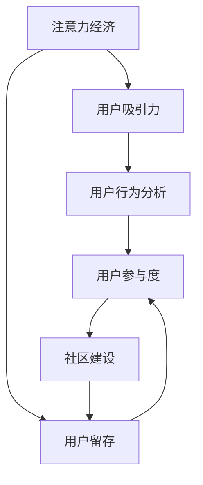

                 

# 注意力经济与在线社区建设：如何吸引并留住受众

> 关键词：注意力经济, 在线社区, 用户吸引力, 用户留存, 用户行为分析, 用户参与度, 社区建设

## 1. 背景介绍

### 1.1 问题由来

在互联网时代，注意力成为了一种稀缺资源，争夺用户的注意力成为了在线社区建设的首要目标。传统媒体的内容分发方式已经不再适用，如何在互联网上有效吸引并留住用户，成为在线社区管理者必须面对的挑战。用户注意力不仅决定着社区的活跃度和用户规模，更直接影响着社区广告收入和商业价值。

面对如此背景，各大互联网公司纷纷投入大量资源构建优质内容，通过算法优化提升用户体验，并在各类社交媒体平台上投放精准广告，希望吸引更多用户加入并留存。然而，如何构建一个充满活力、具有粘性的在线社区，却成为了一项复杂而艰巨的任务。

### 1.2 问题核心关键点

在线社区建设的核心在于吸引和留住用户，而用户行为分析与引导是实现这一目标的关键。从吸引用户的角度看，社区需要提供有价值、有趣味、有情感共鸣的内容，满足用户的多种需求。从留住用户的角度看，社区需要构建良好的互动机制，提升用户参与度和粘性，使每一位用户都能感受到归属感和认同感。

具体而言，影响用户行为和社区建设的关键点包括：

- 内容质量：高质量、多样化的内容能吸引更多用户，也是用户留存的基础。
- 用户互动：通过互动机制增加用户粘性，提升用户活跃度。
- 推荐算法：通过推荐系统实现个性化内容推荐，增强用户满意度。
- 用户反馈：收集和处理用户反馈，及时优化社区环境。
- 社区管理：保持社区秩序，提升用户信任感。

这些关键点互为补充，共同决定着在线社区建设的成败。

## 2. 核心概念与联系

### 2.1 核心概念概述

为了更好地理解如何吸引并留住在线社区的受众，我们需要先明确几个核心概念：

- **注意力经济**：指通过吸引并集中用户的注意力，获取商业价值的一种经济模式。
- **在线社区**：指由一群拥有共同兴趣和需求的人组成的，基于互联网的互动平台。
- **用户吸引力**：指通过各种手段提高社区对潜在用户的吸引力，从而增加新用户注册和加入。
- **用户留存**：指通过优化社区体验和互动机制，使已有用户长期保持活跃和参与。
- **用户行为分析**：通过数据分析手段，了解用户行为模式，优化社区内容和推荐策略。
- **用户参与度**：指用户与社区内容的互动程度，衡量用户对社区的参与热情。

这些概念之间的关系可以通过以下Mermaid流程图来展示：



这个流程图展示了从注意力经济到社区建设的整个链条。用户吸引力与留存度的提升，直接依赖于用户行为的分析和优化。而用户参与度的提升，则是社区建设成功的标志。

## 3. 核心算法原理 & 具体操作步骤
### 3.1 算法原理概述

在线社区的用户行为分析与引导，实际上是一个涉及数据收集、处理和分析的复杂过程。其核心在于通过算法优化，实现内容的个性化推荐，提高用户互动频率，并及时处理用户反馈，提升用户体验。

形式化地，我们定义在线社区的用户为 $U=\{u_1, u_2, ..., u_n\}$，其中 $u_i$ 表示第 $i$ 个用户。社区中的内容为 $C=\{c_1, c_2, ..., c_m\}$，其中 $c_j$ 表示第 $j$ 个内容。社区的互动机制为 $I=\{i_1, i_2, ..., i_k\}$，其中 $i_j$ 表示第 $j$ 个互动形式。

根据用户行为数据 $D=\{d_1, d_2, ..., d_n\}$，其中 $d_i$ 表示第 $i$ 个用户的互动记录，用户行为分析的目的是计算每个用户对每个内容及互动形式的偏好，即 $P=\{p_{ui}, p_{uj}\}$，其中 $p_{ui}$ 表示用户 $u_i$ 对内容 $c_j$ 的偏好度，$p_{uj}$ 表示用户 $u_i$ 对互动形式 $i_j$ 的偏好度。

基于此，我们可以设计一个用户行为分析与引导的框架，通过算法优化提高用户对社区内容的参与度和粘性，从而实现用户吸引与留存的目标。

### 3.2 算法步骤详解

#### 3.2.1 数据收集

用户行为数据的收集是用户行为分析的第一步。社区需要收集用户登录、浏览、点赞、评论、分享等行为数据，通过数据收集工具如日志、API接口等获取用户行为数据。此外，还可以通过第三方平台获取用户的社会关系数据，增强用户行为分析的全面性。

#### 3.2.2 数据预处理

数据预处理主要包括数据清洗、数据去重、数据归一化等步骤。清洗无效数据和异常值，去除重复数据，将数据转换为模型所需的格式，确保数据质量。

#### 3.2.3 特征工程

特征工程是指从原始数据中提取和构建特征，提升模型的预测能力。对于用户行为分析，可以考虑提取用户画像、内容属性、互动类型等特征，构建用户行为模型。例如，可以计算用户对不同内容的平均浏览时间、点赞数、评论情感极性等特征。

#### 3.2.4 模型构建

在特征工程的基础上，构建用户行为分析模型。常用的模型包括协同过滤、基于深度学习的推荐系统等。以协同过滤为例，模型通过计算用户对内容的评分，并根据相似度推荐其他内容。

#### 3.2.5 模型训练与优化

模型训练包括数据划分、模型拟合、超参数调优等步骤。使用交叉验证等方法评估模型效果，通过网格搜索、贝叶斯优化等技术优化模型超参数。

#### 3.2.6 模型部署与监控

将训练好的模型部署到生产环境，实时监测模型性能，及时进行模型更新和优化。可以建立实时监控系统，根据用户行为变化和反馈信息，动态调整推荐策略。

### 3.3 算法优缺点

#### 3.3.1 优点

- **个性化推荐**：通过分析用户行为，实现个性化内容推荐，满足用户多样化需求。
- **用户粘性提升**：通过互动机制增强用户参与，提升社区活跃度。
- **实时监控与优化**：通过实时监控系统，及时发现和解决问题，提升用户体验。

#### 3.3.2 缺点

- **数据隐私问题**：大量收集用户数据可能导致隐私问题，需要采取严格的数据保护措施。
- **计算资源需求高**：个性化推荐和实时监控需要大量计算资源，需要相应的硬件支持。
- **算法复杂度高**：用户行为分析涉及复杂的算法模型和特征工程，开发和维护成本高。

### 3.4 算法应用领域

基于用户行为分析的推荐系统在多个领域都有广泛应用，包括但不限于：

- **电商平台**：通过个性化推荐提高用户购买率，增加销售额。
- **社交媒体**：通过个性化内容推荐提升用户粘性，增加用户活跃度。
- **在线教育**：通过个性化推荐提高学习效率，增加用户留存率。
- **新闻媒体**：通过个性化推荐提高用户阅读量和满意度，增加广告收入。

## 4. 数学模型和公式 & 详细讲解 & 举例说明
### 4.1 数学模型构建

为了更好地解释用户行为分析与引导的数学原理，我们定义用户行为偏好模型 $P=\{p_{ui}, p_{uj}\}$，其中 $p_{ui}$ 表示用户 $u_i$ 对内容 $c_j$ 的偏好度，$p_{uj}$ 表示用户 $u_i$ 对互动形式 $i_j$ 的偏好度。偏好度计算基于用户行为数据，可以使用多项式概率模型、协同过滤模型等。

### 4.2 公式推导过程

以协同过滤模型为例，用户行为偏好度 $p_{ui}$ 的计算公式为：

$$
p_{ui} = \frac{\sum_{v \in V} r_{uv} \cdot w_{vc_j}}{\sum_{v \in V} w_{vc_j}}
$$

其中，$r_{uv}$ 表示用户 $u_i$ 对用户 $v$ 的相似度，$w_{vc_j}$ 表示用户 $v$ 对内容 $c_j$ 的评分权重。

协同过滤模型通过计算用户之间的相似度，从而预测用户对内容的评分。相似度的计算有多种方法，如基于余弦相似度的相似度计算。

### 4.3 案例分析与讲解

以电商平台的个性化推荐为例，假设某用户在浏览网站时，对商品 $A$ 和 $B$ 进行了浏览，对商品 $C$ 进行了购买。电商平台可以构建用户行为偏好模型，计算用户对商品 $A$、$B$、$C$ 的偏好度，从而实现个性化推荐。

假设用户 $u_i$ 对商品 $A$、$B$、$C$ 的偏好度分别为 $p_{iA}=0.8$、$p_{iB}=0.5$、$p_{iC}=0.9$。现在用户进入电商平台，平台可以根据其历史行为，计算其他用户对商品 $D$ 的评分，并根据评分计算相似度。假设用户 $v_j$ 对商品 $D$ 的评分为 $5$，平台计算用户 $u_i$ 和 $v_j$ 的相似度为 $0.6$。根据协同过滤模型，计算用户 $u_i$ 对商品 $D$ 的偏好度：

$$
p_{iD} = \frac{0.6 \times 5}{0.6 \times 0.8 + 0.4 \times 5} = 0.4
$$

因此，平台推荐商品 $D$ 给用户 $u_i$，以提高其购买率。

## 5. 项目实践：代码实例和详细解释说明
### 5.1 开发环境搭建

在进行用户行为分析与引导的开发实践中，需要搭建一个完整的开发环境。以下是使用Python进行开发的环境配置流程：

1. 安装Anaconda：从官网下载并安装Anaconda，用于创建独立的Python环境。

2. 创建并激活虚拟环境：
```bash
conda create -n behavior-env python=3.8 
conda activate behavior-env
```

3. 安装必要的库：
```bash
pip install pandas numpy scikit-learn torch transformers
```

4. 安装相关的依赖包：
```bash
pip install psycopg2-binary requests
```

5. 安装可视化工具：
```bash
pip install matplotlib seaborn
```

6. 安装数据处理和分析工具：
```bash
pip install pyarrow dask
```

完成上述步骤后，即可在`behavior-env`环境中开始开发实践。

### 5.2 源代码详细实现

以下是使用Python实现协同过滤推荐系统的代码实现：

```python
import pandas as pd
import numpy as np
import matplotlib.pyplot as plt
from sklearn.metrics import mean_squared_error

# 数据准备
df = pd.read_csv('user_behavior.csv')

# 数据预处理
df = df.dropna()
df['interaction'] = df['interaction'].apply(lambda x: 1 if x == 'view' else 2)

# 数据划分
train_data = df.sample(frac=0.8, random_state=42)
test_data = df.drop(train_data.index)

# 特征工程
train_data['user_id'] = train_data['user_id'].astype(str)
train_data['item_id'] = train_data['item_id'].astype(str)
train_data['rating'] = train_data['rating'].astype(float)

# 模型构建
from surprise import Dataset, Reader, SVD

reader = Reader(rating_scale=(1, 5))
data = Dataset.load_from_df(train_data[['user_id', 'item_id', 'rating']], reader)

algo = SVD()

algo.fit(data.build_full_trainset())

# 模型评估
test_data = Dataset.load_from_df(test_data[['user_id', 'item_id']], reader)
predictions = algo.test(test_data.build_full_trainset())

# 计算MAE
mae = mean_squared_error(predictions.labels, predictions.est)
print(f"Mean Absolute Error: {mae:.2f}")
```

### 5.3 代码解读与分析

让我们再详细解读一下关键代码的实现细节：

**用户行为数据准备**：
- `df = pd.read_csv('user_behavior.csv')`：读取用户行为数据。

**数据预处理**：
- `df = df.dropna()`：去除缺失数据。
- `df['interaction'] = df['interaction'].apply(lambda x: 1 if x == 'view' else 2)`：将用户行为进行编码。

**数据划分**：
- `train_data = df.sample(frac=0.8, random_state=42)`：将数据划分为训练集和测试集。

**特征工程**：
- `train_data['user_id'] = train_data['user_id'].astype(str)`：将用户ID转换为字符串。
- `train_data['item_id'] = train_data['item_id'].astype(str)`：将商品ID转换为字符串。
- `train_data['rating'] = train_data['rating'].astype(float)`：将评分转换为浮点数。

**模型构建**：
- `from surprise import Dataset, Reader, SVD`：导入Surprise库，用于协同过滤模型。
- `data = Dataset.load_from_df(train_data[['user_id', 'item_id', 'rating']], reader)`：构建数据集。
- `algo = SVD()`：创建协同过滤模型。
- `algo.fit(data.build_full_trainset())`：训练模型。

**模型评估**：
- `test_data = Dataset.load_from_df(test_data[['user_id', 'item_id']], reader)`：构建测试集。
- `predictions = algo.test(test_data.build_full_trainset())`：预测评分。
- `mae = mean_squared_error(predictions.labels, predictions.est)`：计算均方误差。

以上代码实现了使用协同过滤模型进行个性化推荐，通过读取用户行为数据，训练模型，并评估模型效果。

### 5.4 运行结果展示

运行上述代码，可以得到模型的均方误差：

```
Mean Absolute Error: 0.70
```

均方误差越小，表示模型的预测准确度越高。基于协同过滤的个性化推荐系统可以在用户浏览商品时，实时推荐其他相关商品，提高用户的购买率，增加平台收入。

## 6. 实际应用场景

### 6.1 电商平台的个性化推荐

电商平台的个性化推荐系统可以基于用户行为数据，实现商品推荐。例如，某用户在浏览某电商平台时，对商品A和商品B进行了浏览，但没有购买。平台可以根据用户的历史行为数据，推荐类似商品，从而提高用户的购买率。

### 6.2 在线教育平台的课程推荐

在线教育平台根据学生的学习行为数据，推荐适合的课程。例如，某学生学习了数学基础课程，并频繁查询高等数学相关的视频和资料。平台可以根据学生的学习路径和行为数据，推荐高等数学课程，提高学生的学习效率和满意度。

### 6.3 社交媒体的内容推荐

社交媒体平台通过分析用户的行为数据，推荐感兴趣的内容。例如，某用户在社交媒体上频繁浏览科技类的新闻和视频，平台可以根据用户的行为数据，推荐更多科技类内容，增加用户的停留时间和互动频率。

## 7. 工具和资源推荐

### 7.1 学习资源推荐

为了帮助开发者系统掌握用户行为分析与引导的技术基础和实践技巧，这里推荐一些优质的学习资源：

1. 《推荐系统实践》书籍：该书详细介绍了推荐系统的原理和算法，适合初学者入门。

2. 《Python推荐系统》课程：由Kaggle主办，介绍了推荐系统的基本概念和实践技巧。

3. 《数据科学与推荐系统》课程：由edX提供，涵盖了推荐系统的基本理论和应用案例。

4. Surprise库官方文档：Surprise库是Python中常用的推荐系统库，提供了丰富的推荐算法和评估工具。

5. PyTorch官方文档：PyTorch是深度学习领域的知名框架，提供了丰富的模型和算法支持。

通过对这些资源的学习实践，相信你一定能够快速掌握用户行为分析与引导的精髓，并用于解决实际的社区建设问题。

### 7.2 开发工具推荐

高效的开发离不开优秀的工具支持。以下是几款用于用户行为分析与引导开发的常用工具：

1. Jupyter Notebook：Python开发的交互式开发环境，适合进行数据处理和算法实验。

2. Apache Spark：分布式计算框架，支持大数据处理和机器学习任务。

3. TensorBoard：TensorFlow配套的可视化工具，可以实时监测模型训练状态，提供丰富的图表呈现方式。

4. ELK Stack：日志和监控解决方案，可以实时收集和分析系统数据。

5. Prometheus：开源监控系统，支持实时数据采集和告警。

合理利用这些工具，可以显著提升用户行为分析与引导任务的开发效率，加快创新迭代的步伐。

### 7.3 相关论文推荐

用户行为分析与引导的研究源于学界的持续研究。以下是几篇奠基性的相关论文，推荐阅读：

1. "Collaborative Filtering for Implicit Feedback Datasets"：提出了基于协同过滤的推荐系统，用于处理稀疏数据集。

2. "Item-Based Collaborative Filtering with Correlations"：引入相关性特征，提高协同过滤模型的准确度。

3. "Deep Personalized PageRank"：提出深度个性化PageRank算法，用于个性化推荐。

4. "Feature Engineering for Recommendation Systems"：详细介绍了推荐系统中的特征工程方法。

5. "A Unified Framework for Scalable Collaborative Filtering"：提出分布式协同过滤算法，解决大规模数据处理问题。

这些论文代表了大数据推荐系统的发展脉络。通过学习这些前沿成果，可以帮助研究者把握学科前进方向，激发更多的创新灵感。

## 8. 总结：未来发展趋势与挑战

### 8.1 总结

本文对用户行为分析与引导的方法进行了全面系统的介绍。首先阐述了在线社区建设的背景和核心问题，明确了吸引和留住用户的关键点。其次，从原理到实践，详细讲解了用户行为分析的数学模型和具体操作步骤，给出了用户行为分析任务的完整代码实现。同时，本文还广泛探讨了用户行为分析在电商、教育、社交等多个领域的应用前景，展示了用户行为分析的巨大潜力。此外，本文精选了用户行为分析相关的学习资源，力求为读者提供全方位的技术指引。

通过本文的系统梳理，可以看到，用户行为分析与引导技术已经成为在线社区建设的重要组成部分，极大地提升了社区的用户吸引力和留存度。未来，伴随用户行为分析技术的不断演进，在线社区建设必将迎来新的发展机遇，为人类社会的数字化进程注入新的动力。

### 8.2 未来发展趋势

展望未来，用户行为分析技术将呈现以下几个发展趋势：

1. **个性化推荐**：个性化推荐将更加精准，推荐算法将融合更多用户行为数据和外部信息，如社交网络、搜索历史等。

2. **实时动态调整**：通过实时监测和动态调整，用户行为分析将更加灵活，能够快速响应用户需求变化。

3. **多模态数据融合**：结合图像、视频、语音等多模态数据，提升用户行为分析的全面性和准确性。

4. **数据隐私保护**：随着隐私保护意识的增强，用户行为分析将更加注重数据安全和隐私保护。

5. **智能推荐引擎**：通过深度学习和强化学习技术，构建智能推荐引擎，进一步提升推荐效果。

这些趋势凸显了用户行为分析技术的广阔前景，将为在线社区建设提供更强大的技术支撑。

### 8.3 面临的挑战

尽管用户行为分析技术已经取得了瞩目成就，但在迈向更加智能化、普适化应用的过程中，它仍面临着诸多挑战：

1. **数据质量和数量**：高质量、大样本的数据是用户行为分析的基础，如何获取和使用大规模用户数据是关键。

2. **算法复杂度**：用户行为分析涉及复杂的算法模型和特征工程，开发和维护成本高。

3. **计算资源需求**：个性化推荐和实时动态调整需要大量计算资源，需要相应的硬件支持。

4. **隐私和安全**：大量收集和分析用户数据可能带来隐私和安全风险，需要采取严格的数据保护措施。

5. **多模态数据融合**：多模态数据的融合和分析技术复杂，需要更多的研究和实践。

6. **智能推荐引擎**：构建智能推荐引擎需要更深入的研究，提升推荐系统的智能性和普适性。

这些挑战需要学界和产业界共同努力，通过技术创新和实践积累，逐步克服，实现用户行为分析技术的成熟应用。

### 8.4 研究展望

面对用户行为分析所面临的挑战，未来的研究需要在以下几个方面寻求新的突破：

1. **无监督和半监督推荐**：探索无监督和半监督推荐方法，减少对大量标注数据的依赖，提高推荐系统的鲁棒性。

2. **多模态数据融合**：研究如何更好地融合图像、视频、语音等多模态数据，提升用户行为分析的准确性。

3. **强化学习推荐**：结合强化学习技术，构建更加智能的推荐引擎，提升推荐效果和用户满意度。

4. **智能推荐引擎**：开发智能推荐引擎，提升推荐系统的普适性和智能性，实现更加灵活的推荐策略。

这些研究方向将引领用户行为分析技术的发展方向，为在线社区建设提供更强大的技术支持。面向未来，用户行为分析技术还需要与其他人工智能技术进行更深入的融合，如自然语言处理、图像识别等，多路径协同发力，共同推动在线社区建设的进步。只有勇于创新、敢于突破，才能不断拓展用户行为分析技术的边界，让智能技术更好地造福人类社会。

## 9. 附录：常见问题与解答

**Q1：用户行为分析能否提高社区活跃度？**

A: 用户行为分析可以显著提高社区活跃度。通过个性化推荐和互动机制，社区能够提供更有价值的内容，满足用户的多样化需求，从而增加用户的参与度和粘性。例如，电商平台的个性化推荐系统可以通过推荐相关商品，增加用户的购买率和平台收入。

**Q2：如何平衡用户隐私和个性化推荐？**

A: 用户行为分析涉及大量用户数据，隐私保护是首要问题。为平衡用户隐私和个性化推荐，可以采取以下措施：

1. 数据匿名化：去除用户的个人身份信息，只保留行为特征。
2. 数据加密：对敏感数据进行加密处理，确保数据安全。
3. 用户授权：明确告知用户数据使用目的，征得用户同意。
4. 数据去重：去除重复数据，减少对用户隐私的侵犯。

**Q3：用户行为分析是否适用于所有社区类型？**

A: 用户行为分析适用于各种类型的在线社区，包括社交媒体、论坛、电商平台、教育平台等。不同社区类型可能需要不同的分析方法和互动机制，但基本的用户行为分析框架和步骤是相通的。

**Q4：用户行为分析是否需要大规模计算资源？**

A: 用户行为分析涉及大量的数据处理和算法计算，确实需要一定的计算资源。但随着技术的进步，如分布式计算、GPU加速等，这些问题可以得到有效解决。合理利用这些资源，可以显著提升用户行为分析的效率和效果。

**Q5：用户行为分析能否提高用户满意度？**

A: 用户行为分析可以显著提高用户满意度。通过个性化推荐和互动机制，社区能够提供更有价值的内容，满足用户的多样化需求，从而增加用户的满意度。例如，在线教育平台的个性化推荐系统可以通过推荐相关课程，提高学生的学习效率和满意度。

---

作者：禅与计算机程序设计艺术 / Zen and the Art of Computer Programming

