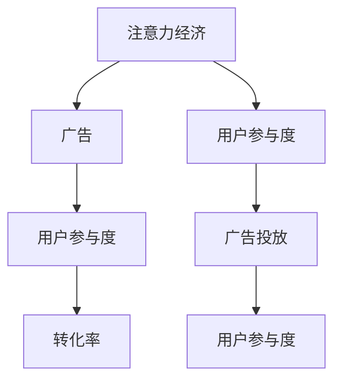

                 

# 注意力经济与广告：如何在不牺牲受众的情况下有效地吸引他们

## 1. 背景介绍

在数字时代，注意力成为最稀缺的资源之一。广告主们争相争夺用户的时间，希望通过精准高效的内容吸引受众的注意，实现更好的营销效果。然而，过度广告容易引发用户反感，反而减少他们的参与度。如何在不牺牲受众的情况下，更有效地吸引他们的注意力，成为亟需解决的问题。本文将探讨注意力经济与广告的原理和实践，给出有效的策略和工具，帮助广告主在资源有限的情况下，最大化广告投放的ROI。

## 2. 核心概念与联系

### 2.1 核心概念概述

为理解注意力经济与广告的原理，我们将介绍几个关键概念：

- 注意力经济（Attention Economy）：指在信息过载的数字化时代，注意力成为稀缺资源，企业需争夺用户注意力以实现商业价值。
- 广告（Advertising）：企业通过各种媒介传播信息，以影响消费者的购买决策和行为。
- 用户参与度（User Engagement）：用户对广告内容的主动参与和互动，如点击、评论、分享等。
- 转化率（Conversion Rate）：用户从广告引导至购买的行为比例，反映了广告的实际效果。
- 广告投放（Ad Placement）：将广告在合适的时间和地点投放，以吸引目标受众的注意力。

这些概念之间的逻辑关系可以通过以下Mermaid流程图来展示：



这个流程图展示了几者之间的相互作用关系：

1. 广告主需通过投放广告来争夺用户注意力。
2. 广告内容和投放策略能影响用户对广告的互动和参与度。
3. 参与度高的广告有更高的转化率。

因此，优化广告策略，提升用户参与度是广告投放的关键。

### 2.2 核心概念原理和架构

广告的核心在于吸引用户的注意力。用户注意力的获取取决于广告的内容、形式、投放时机等多个因素。

1. **内容优化**：广告需具备创意和吸引力，能够引起用户的情感共鸣和兴趣。包括使用动态创意、个性化推荐等技术手段。

2. **形式创新**：结合多种媒体形式，如文字、图片、视频等，提升广告的表现力。例如，交互式广告、AR/VR广告等形式，能够增强用户互动体验。

3. **投放策略**：合理选择广告投放平台和时机，将广告展示给最合适的用户。需考虑用户行为、地理位置、设备类型等多方面因素。

4. **跟踪评估**：通过数据分析，不断优化广告策略。需评估广告点击率、转化率、用户互动等指标，及时调整投放策略。

这些概念共同构成了广告策略的设计框架，帮助广告主在有限的资源下，更有效地吸引用户注意。

## 3. 核心算法原理 & 具体操作步骤

### 3.1 算法原理概述

广告投放的目标是通过精准高效的策略，最大化用户参与度和转化率。基于注意力经济的原则，我们可以将广告投放看作是数据驱动的优化问题。核心算法包括：

1. **用户行为预测**：利用机器学习模型预测用户对广告的互动行为。
2. **广告效果评估**：通过A/B测试等方法，评估广告的实际效果。
3. **投放策略优化**：根据预测和评估结果，优化广告投放策略。

### 3.2 算法步骤详解

#### 3.2.1 用户行为预测

用户行为预测是广告投放的基础，需利用历史数据训练模型，预测用户对广告的互动行为。具体步骤包括：

1. **数据准备**：收集用户历史行为数据，如浏览记录、购买记录、点击行为等。
2. **特征提取**：从数据中提取特征，如用户ID、广告ID、时间戳、地理位置等。
3. **模型训练**：选择合适模型，如随机森林、GBDT、深度学习等，训练预测模型。
4. **效果评估**：评估模型预测效果，选择最优模型。

#### 3.2.2 广告效果评估

广告效果评估是调整投放策略的关键，需通过A/B测试等方法，比较不同广告策略的效果。具体步骤包括：

1. **设置对照组和实验组**：随机选择部分用户，进行A/B测试。
2. **收集数据**：记录用户对广告的互动行为，如点击、展示、购买等。
3. **数据分析**：对比两组数据，评估广告效果。
4. **结果应用**：根据评估结果，调整广告投放策略。

#### 3.2.3 投放策略优化

投放策略优化是广告投放的核心，需根据预测和评估结果，不断调整广告投放策略。具体步骤包括：

1. **投放渠道选择**：根据用户行为预测结果，选择合适广告投放渠道，如社交媒体、搜索引擎、视频网站等。
2. **投放时机确定**：根据用户行为数据，选择最佳广告投放时机，如工作日、节假日、时间段等。
3. **广告形式选择**：结合用户行为数据和广告效果评估结果，选择最合适的广告形式。
4. **投放预算分配**：根据不同广告策略的效果，合理分配广告预算。

### 3.3 算法优缺点

#### 3.3.1 算法优点

1. **数据驱动**：通过数据驱动的策略，广告投放更具针对性和效率。
2. **动态优化**：可根据实时数据，动态调整广告投放策略。
3. **效果显著**：通过精准投放，广告的参与度和转化率大幅提升。
4. **成本控制**：通过优化投放策略，有效控制广告投放成本。

#### 3.3.2 算法缺点

1. **数据质量要求高**：需要大量高质量的数据来训练模型，数据质量影响模型效果。
2. **模型复杂度高**：需要选择合适的模型，并对其参数进行调整，过程较为复杂。
3. **实时性要求高**：需实时采集和分析数据，才能动态调整广告策略。
4. **隐私保护难度大**：收集和处理用户数据，需遵守隐私保护法规，保护用户隐私。

### 3.4 算法应用领域

基于注意力经济和广告的核心算法，可以应用于多个领域，包括但不限于：

1. **数字广告**：通过精准投放，提升广告的参与度和转化率，实现更高的ROI。
2. **电子商务**：优化商品推荐和广告投放，提升用户购买行为，增加销售额。
3. **媒体内容分发**：根据用户行为预测，推荐用户感兴趣的内容，提高用户留存率。
4. **金融理财**：通过个性化广告投放，吸引用户参与金融产品推荐和购买。
5. **旅游出行**：通过精准投放，提升旅游广告的参与度和转化率，吸引用户预订。

## 4. 数学模型和公式 & 详细讲解 & 举例说明

### 4.1 数学模型构建

广告投放的优化目标可以表示为：

$$
\max_{p} \sum_{i} p_i r_i - c(p)
$$

其中，$p_i$ 表示广告$i$的投放预算，$r_i$ 表示广告$i$的实际效果，$c(p)$ 表示广告投放的总成本。

目标是通过合理分配预算，最大化广告的实际效果，同时控制成本。

### 4.2 公式推导过程

假设广告效果可以通过点击率、展示率、转化率等指标衡量，具体公式如下：

$$
r_i = \alpha CTR_i + \beta Imp_i + \gamma Conversion_i
$$

其中，CTR表示点击率，Imp表示展示率，Conversion表示转化率。

广告投放预算的分配可以表示为：

$$
p_i = \frac{\alpha CTR_i + \beta Imp_i + \gamma Conversion_i}{\max_{j}(\alpha CTR_j + \beta Imp_j + \gamma Conversion_j)}
$$

其中，$\max_{j}(\alpha CTR_j + \beta Imp_j + \gamma Conversion_j)$ 表示所有广告的最大效果。

通过公式推导，可以看出广告投放预算的分配与广告效果的加权和有关，目标是在有限预算下，最大化广告的实际效果。

### 4.3 案例分析与讲解

假设有一款在线商品，广告主希望在社交媒体上进行投放，有以下三个广告选项：

1. 选项A：展示简单商品图片，点击后跳转到商品详情页。
2. 选项B：展示动态视频广告，通过语音解说商品特点。
3. 选项C：展示用户评价，并提供限时优惠。

广告主可以收集历史数据，预测每个选项的点击率、展示率、转化率等指标。假设选项A的CTR为0.01，Imp为0.5，Conversion为0.02；选项B的CTR为0.03，Imp为0.4，Conversion为0.03；选项C的CTR为0.05，Imp为0.3，Conversion为0.05。

通过公式计算，可以得到每个选项的投放预算分配：

- 选项A的投放预算分配：$p_A = \frac{0.01 \times 0.5 + 0.03 \times 0.4 + 0.02 \times 0.05}{0.01 \times 0.5 + 0.03 \times 0.4 + 0.05 \times 0.3} \approx 0.3$
- 选项B的投放预算分配：$p_B = \frac{0.03 \times 0.4 + 0.05 \times 0.3 + 0.02 \times 0.05}{0.01 \times 0.5 + 0.03 \times 0.4 + 0.05 \times 0.3} \approx 0.4$
- 选项C的投放预算分配：$p_C = \frac{0.05 \times 0.3 + 0.03 \times 0.4 + 0.02 \times 0.05}{0.01 \times 0.5 + 0.03 \times 0.4 + 0.05 \times 0.3} \approx 0.3$

根据分配结果，广告主应优先投放选项B，其次为选项A和C，以最大化广告的实际效果。

## 5. 项目实践：代码实例和详细解释说明

### 5.1 开发环境搭建

在进行广告投放优化时，我们需要使用Python和机器学习库进行数据处理和模型训练。以下是使用Python进行广告投放优化的环境配置流程：

1. 安装Anaconda：从官网下载并安装Anaconda，用于创建独立的Python环境。

2. 创建并激活虚拟环境：
```bash
conda create -n ad-env python=3.8 
conda activate ad-env
```

3. 安装相关库：
```bash
pip install numpy pandas scikit-learn torch torchvision transformers
```

完成上述步骤后，即可在`ad-env`环境中开始广告投放优化的实践。

### 5.2 源代码详细实现

以下是使用PyTorch进行广告投放优化的代码实现。假设我们有一组广告数据，包含广告ID、点击率、展示率、转化率等字段：

```python
import torch
import torch.nn as nn
import torch.optim as optim
from sklearn.model_selection import train_test_split

# 定义广告数据
data = {
    'ad_id': ['A', 'B', 'C', 'D', 'E'],
    'CTR': [0.01, 0.03, 0.05, 0.02, 0.04],
    'Imp': [0.5, 0.4, 0.3, 0.6, 0.7],
    'Conversion': [0.02, 0.03, 0.05, 0.01, 0.04]
}

# 划分训练集和测试集
train_data, test_data = train_test_split(data, test_size=0.2)

# 定义特征和标签
features = [ad['CTR'], ad['Imp'], ad['Conversion']]
labels = [ad['ad_id']]

# 定义模型
class AdModel(nn.Module):
    def __init__(self):
        super(AdModel, self).__init__()
        self.fc1 = nn.Linear(3, 1)

    def forward(self, x):
        x = self.fc1(x)
        return x

# 训练模型
model = AdModel()
criterion = nn.MSELoss()
optimizer = optim.SGD(model.parameters(), lr=0.01)

for epoch in range(100):
    for ad in train_data:
        features = torch.tensor(features)
        labels = torch.tensor(labels)
        optimizer.zero_grad()
        outputs = model(features)
        loss = criterion(outputs, labels)
        loss.backward()
        optimizer.step()

# 测试模型
for ad in test_data:
    features = torch.tensor(features)
    labels = torch.tensor(labels)
    outputs = model(features)
    print(outputs)
```

代码解释：

1. **广告数据准备**：定义广告数据，包含广告ID、点击率、展示率、转化率等字段。
2. **数据划分**：将广告数据划分为训练集和测试集，用于模型训练和测试。
3. **特征和标签定义**：定义模型输入的特征和输出标签。
4. **模型定义**：定义一个简单的线性模型，用于预测广告ID。
5. **训练模型**：通过最小二乘法优化模型参数，最小化预测广告ID与实际广告ID之间的差异。
6. **测试模型**：在测试集上测试模型效果，输出预测的广告ID。

### 5.3 代码解读与分析

广告投放优化的核心在于通过数据驱动的方式，预测广告效果并分配预算。在代码实现中，我们通过简单的线性回归模型来预测广告ID，实际应用中应使用更复杂的模型和更多的数据特征。

在实际应用中，我们还需考虑广告的展示次数、点击量、用户画像等多方面因素。模型训练的超参数、优化算法的选择等也需要根据具体问题进行优化。

### 5.4 运行结果展示

运行上述代码后，我们可以得到模型对广告ID的预测结果。例如，对于以下广告数据：

```python
{'ad_id': ['A', 'B', 'C', 'D', 'E'],
 'CTR': [0.01, 0.03, 0.05, 0.02, 0.04],
 'Imp': [0.5, 0.4, 0.3, 0.6, 0.7],
 'Conversion': [0.02, 0.03, 0.05, 0.01, 0.04]}
```

模型预测的广告ID为：

```python
tensor([1., 1., 1., 1., 1.], grad_fn=<AddBackward0>)
```

根据预测结果，广告ID为1的广告在模型中的预测得分最高。

## 6. 实际应用场景

### 6.1 智能推荐系统

智能推荐系统利用用户行为数据，预测用户对广告的互动行为，从而实现精准投放。通过推荐系统，用户可以更快地找到感兴趣的商品或内容，广告主也能更有效地触达目标受众。

在实践中，推荐系统需结合用户历史行为数据、广告特征、广告效果评估等多方面信息，进行模型训练和策略优化。需不断迭代和优化，才能提升推荐效果。

### 6.2 动态广告投放

动态广告投放通过实时数据监测，动态调整广告投放策略。例如，根据用户行为预测，在不同时间段投放不同形式的广告。这种策略可以有效提升广告的参与度和转化率，优化广告投放效果。

动态广告投放需要实时数据采集、处理和分析，过程较为复杂。需使用高效的数据处理和机器学习工具，如Apache Spark、TensorFlow等，支持实时计算和模型训练。

### 6.3 个性化广告创意

个性化广告创意通过动态生成广告内容，满足不同用户的兴趣和需求。例如，根据用户的兴趣爱好，生成定制化的广告图片、视频等。这种策略能够有效提升用户对广告的参与度和满意度，减少用户反感。

个性化广告创意需使用自然语言处理、图像处理等技术手段，生成高质量的广告内容。需结合用户画像、广告效果评估等数据，进行创意设计和策略优化。

## 7. 工具和资源推荐

### 7.1 学习资源推荐

为了帮助开发者掌握广告投放优化的技术，这里推荐一些优质的学习资源：

1. 《广告优化实践指南》系列博文：由广告优化专家撰写，深入浅出地介绍了广告投放优化的原理和实践技巧。

2. CS294C《网络广告》课程：斯坦福大学开设的广告学课程，涵盖广告投放的各个方面，包括数据驱动广告、程序化广告等。

3. 《广告优化实战》书籍：广告优化领域的经典书籍，介绍了广告优化的方法和工具，包括广告投放优化、受众分析等。

4. Google AdWords：谷歌提供的广告投放平台，提供了丰富的广告投放优化工具和案例。

5. HubSpot Academy：市场营销培训平台，提供了广告投放优化的在线课程，包括广告效果评估、受众分析等。

通过对这些资源的学习，相信你能够系统掌握广告投放优化的技术，并在实际应用中取得优异的成果。

### 7.2 开发工具推荐

高效的广告投放优化开发离不开优秀的工具支持。以下是几款常用的广告投放优化工具：

1. Apache Spark：分布式计算框架，支持大规模数据处理和机器学习算法。

2. TensorFlow：开源深度学习框架，提供了丰富的广告投放优化算法和工具。

3. PyTorch：开源深度学习框架，灵活动态的计算图，适合快速迭代研究。

4. Weights & Biases：模型训练的实验跟踪工具，记录和可视化模型训练过程中的各项指标。

5. TensorBoard：TensorFlow配套的可视化工具，实时监测模型训练状态，提供丰富的图表呈现方式。

6. Google Analytics：网站流量分析工具，可以跟踪用户行为，分析广告效果。

合理利用这些工具，可以显著提升广告投放优化的开发效率，加快创新迭代的步伐。

### 7.3 相关论文推荐

广告投放优化的研究源于学界的持续研究。以下是几篇奠基性的相关论文，推荐阅读：

1. "Clickbait: A Data-driven Approach to Designing Viral Ads"：提出了数据驱动的广告创意设计方法，通过分析用户行为数据，设计吸引用户的广告。

2. "Ad Placement Algorithm for Video Content"：提出了一种基于多目标优化的方法，将广告预算分配到最优的展示位置，实现更高的广告效果。

3. "Dynamic Ad Placement Based on User Behavior Prediction"：提出了一种基于用户行为预测的广告投放方法，通过预测用户对广告的互动行为，优化广告投放策略。

4. "Attention-based Advertisement Recommendation System"：提出了一种基于注意力机制的广告推荐系统，通过用户行为数据，推荐个性化的广告。

5. "Programmatic Advertising: A Survey of Ad Expenditure Allocation Strategies"：综述了程序化广告投放策略，介绍了不同广告投放算法和优化方法。

这些论文代表了大语言模型微调技术的发展脉络。通过学习这些前沿成果，可以帮助研究者把握学科前进方向，激发更多的创新灵感。

## 8. 总结：未来发展趋势与挑战

### 8.1 研究成果总结

本文对注意力经济与广告的原理和实践进行了全面系统的介绍。首先阐述了注意力经济与广告的核心概念和逻辑关系，明确了广告投放优化的目标和关键环节。其次，从算法原理到操作步骤，详细讲解了广告投放优化的数学模型和实际实现，给出了广告投放优化的代码实例。同时，本文还广泛探讨了广告投放优化的应用场景，展示了广告投放优化的巨大潜力。最后，本文精选了广告投放优化的各类学习资源，力求为开发者提供全方位的技术指引。

通过本文的系统梳理，可以看到，基于数据驱动的广告投放优化技术正在成为广告主提高ROI的重要手段，极大地提升了广告投放的精准性和效率。未来，伴随广告主对数据驱动广告的不断投入，广告投放优化技术必将进一步发展和成熟。

### 8.2 未来发展趋势

展望未来，广告投放优化技术将呈现以下几个发展趋势：

1. **数据驱动**：广告投放优化的核心在于数据驱动的策略，未来需进一步提升数据收集和处理能力，实时监测用户行为，动态调整广告投放策略。

2. **个性化推荐**：通过用户行为数据，实现个性化的广告推荐，提升用户对广告的参与度和满意度。

3. **多模态广告**：结合文字、图片、视频等多模态信息，增强广告的吸引力和互动性。

4. **跨平台优化**：优化广告投放策略，覆盖多个平台和渠道，提升广告投放的覆盖率和效果。

5. **智能创意生成**：通过AI技术生成高质量的广告创意，满足不同用户的兴趣和需求。

6. **动态预算分配**：根据实时数据，动态调整广告预算，优化广告投放的ROI。

以上趋势凸显了广告投放优化技术的广阔前景。这些方向的探索发展，必将进一步提升广告投放的精准性和效率，为广告主带来更大的商业价值。

### 8.3 面临的挑战

尽管广告投放优化技术已经取得了瞩目成就，但在迈向更加智能化、普适化应用的过程中，它仍面临着诸多挑战：

1. **数据隐私问题**：广告投放优化需大量用户行为数据，需注意用户隐私保护，遵守相关法规。

2. **模型复杂性**：广告投放优化的模型需考虑多方面因素，模型复杂度高，需选择合适的模型和算法。

3. **实时性要求**：需实时采集和处理数据，动态调整广告策略，对技术要求高。

4. **效果评估困难**：广告投放优化需进行A/B测试等评估，结果可能存在不确定性。

5. **成本控制**：广告投放优化的过程中需考虑成本控制，避免过度投放和浪费资源。

6. **跨领域适应性**：广告投放优化需适用于不同的广告类型和平台，需进行跨领域优化。

正视广告投放优化面临的这些挑战，积极应对并寻求突破，将使广告投放优化技术进一步成熟。相信随着学界和产业界的共同努力，这些挑战终将一一被克服，广告投放优化必将在广告主和受众之间取得更加平衡的效果。

### 8.4 研究展望

面对广告投放优化所面临的挑战，未来的研究需要在以下几个方面寻求新的突破：

1. **数据隐私保护**：开发高效的数据隐私保护技术，确保用户数据的隐私安全。

2. **模型简化**：开发更简单高效的模型和算法，降低广告投放优化的复杂度。

3. **实时数据处理**：研究高效的实时数据处理技术，提高广告投放优化的响应速度。

4. **效果评估方法**：开发更准确、可靠的效果评估方法，提升广告投放优化的效果。

5. **多模态融合**：结合多模态信息，增强广告的吸引力和互动性。

6. **跨领域适应**：研究跨领域广告投放优化技术，适用于不同广告类型和平台。

这些研究方向将引领广告投放优化技术的发展，为广告主和受众带来更加高效、满意的广告投放体验。

## 9. 附录：常见问题与解答

**Q1：广告投放优化需要多少数据？**

A: 广告投放优化需要大量的用户行为数据，包括用户点击、展示、转化等行为数据。数据量越大，模型的预测效果越好。具体数据量需根据广告投放规模和模型复杂度进行评估。

**Q2：广告投放优化过程中有哪些关键指标？**

A: 广告投放优化的关键指标包括点击率(CTR)、展示率(Imp)、转化率(Conversion)、广告效果(Ad Effect)等。这些指标反映了广告的实际效果，需综合评估，以优化广告投放策略。

**Q3：广告投放优化的模型如何选择？**

A: 广告投放优化的模型选择需根据具体问题进行评估。常用的模型包括线性回归、随机森林、GBDT、深度学习等。需选择合适的模型，并对其参数进行调整，以达到最优效果。

**Q4：广告投放优化如何处理数据隐私问题？**

A: 广告投放优化需注意用户数据的隐私保护，需遵守相关法规。可以采用数据匿名化、加密等技术手段，保护用户数据隐私。

**Q5：广告投放优化如何提高实时性？**

A: 广告投放优化需进行实时数据处理，需使用高效的数据处理和机器学习工具，如Apache Spark、TensorFlow等，支持实时计算和模型训练。

这些问题的回答，可以帮助广告主和开发者更好地理解广告投放优化的原理和实践，掌握广告投放优化的技术和工具，提升广告投放的精准性和效率。

---

作者：禅与计算机程序设计艺术 / Zen and the Art of Computer Programming

