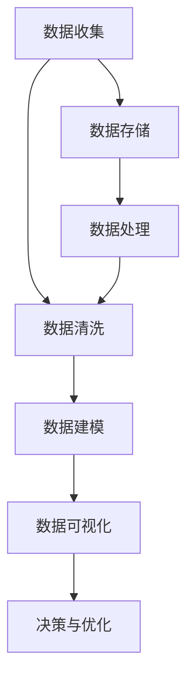

                 

# 注意力经济与数据分析洞察力：利用数据理解受众行为和偏好

> 关键词：注意力经济, 数据分析, 受众行为, 用户偏好, 数据洞察力, 数据驱动决策

## 1. 背景介绍

### 1.1 问题由来
随着互联网技术的飞速发展，信息爆炸时代带来了前所未有的机遇和挑战。在信息海洋中，如何高效地捕捉和利用用户的注意力成为吸引用户、提升用户价值的关键。传统的以内容为中心的营销策略已难以适应新形势，企业迫切需要新的方法来更好地理解受众行为，优化资源配置，提升运营效率。

注意力经济（Attention Economy）是一种新兴的经济模式，通过吸引和保持用户的注意力来创造价值。它强调通过有效的数据收集和分析，揭示用户的兴趣和行为模式，从而实现个性化营销、精准投放和高效运营。这种模式不仅适用于数字营销，更扩展到了产品设计、内容创作、用户服务等各个领域。

数据分析洞察力（Data Analytics Insight）则是指通过大数据分析技术，从海量数据中提取出有价值的业务洞见，帮助企业制定更科学的决策。它不仅能识别市场趋势、客户需求，还能预测未来行为，提升决策的科学性和准确性。

将注意力经济与数据分析洞察力相结合，利用数据驱动决策，可以更好地理解用户行为和偏好，优化资源配置，提升用户体验，从而创造更大的商业价值。本文将详细介绍这一过程的核心概念、核心算法及具体操作步骤，并通过具体案例展示其在实际中的应用。

### 1.2 问题核心关键点
注意力经济与数据分析洞察力相结合的关键点在于如何通过数据分析，高效地捕捉和利用用户的注意力。具体包括以下几个方面：

1. **数据收集与存储**：从用户行为、反馈等多个维度收集数据，确保数据质量的同时，要兼顾存储的效率和成本。
2. **数据处理与清洗**：对收集到的数据进行清洗和处理，去除噪声，填补缺失值，确保数据的质量。
3. **数据分析与建模**：采用机器学习、深度学习等技术对数据进行建模，提取有价值的业务洞见。
4. **数据可视化与解读**：将分析结果通过图表、报告等形式进行可视化，方便业务人员理解和使用。
5. **决策与优化**：将数据分析结果转化为实际决策，持续优化产品、服务和运营策略，提升用户体验和商业价值。

以下将详细讨论这些关键点的实现方法，并结合实际案例展示其应用效果。

## 2. 核心概念与联系

### 2.1 核心概念概述

为更好地理解注意力经济与数据分析洞察力的结合，本节将介绍几个密切相关的核心概念：

- **注意力经济（Attention Economy）**：通过吸引和保持用户的注意力，创造经济价值的经济模式。它强调通过数据挖掘和分析，揭示用户注意力分布规律，优化资源配置，提升用户体验。

- **数据分析洞察力（Data Analytics Insight）**：通过大数据分析技术，从海量数据中提取有价值的业务洞见，支持企业制定科学决策。它不仅能识别市场趋势、客户需求，还能预测未来行为，提升决策的科学性和准确性。

- **数据清洗（Data Cleaning）**：对收集到的数据进行预处理，去除噪声、填补缺失值，确保数据质量，为后续分析和建模提供可靠基础。

- **数据建模（Data Modeling）**：采用机器学习、深度学习等技术对数据进行建模，提取有意义的特征，构建预测模型，支持决策制定。

- **数据可视化（Data Visualization）**：将分析结果通过图表、报告等形式进行可视化，方便业务人员理解和使用，提升决策效率和质量。

这些核心概念之间的逻辑关系可以通过以下Mermaid流程图来展示：



这个流程图展示了大规模数据驱动的决策流程：

1. 从不同渠道收集数据。
2. 对收集到的数据进行清洗和处理，确保数据质量。
3. 利用机器学习、深度学习等技术对数据进行建模，提取有意义的特征。
4. 将分析结果通过图表、报告等形式进行可视化，方便业务人员理解和使用。
5. 根据可视化结果进行决策和优化，提升用户体验和商业价值。

这些概念共同构成了注意力经济与数据分析洞察力的框架，使得企业能够更好地理解用户行为和偏好，优化资源配置，提升运营效率。

### 2.2 核心概念原理和架构

注意力经济与数据分析洞察力的原理在于通过数据驱动决策，将数据转化为业务洞见，优化资源配置，提升用户体验。其架构包括数据收集、数据处理、数据建模、数据可视化和决策优化五个环节，具体如下：

1. **数据收集**：通过多种渠道（如网页访问、移动应用、社交媒体等）收集用户行为数据，确保数据的多样性和全面性。
2. **数据处理**：对收集到的数据进行清洗、处理和转换，确保数据的一致性和完整性。
3. **数据建模**：采用机器学习、深度学习等技术对数据进行建模，提取有意义的特征，构建预测模型。
4. **数据可视化**：将分析结果通过图表、报告等形式进行可视化，方便业务人员理解和使用。
5. **决策优化**：根据可视化结果进行决策和优化，提升用户体验和商业价值。

这一架构的核心是数据驱动的决策过程，通过数据收集、处理和建模，揭示用户行为和偏好，从而指导企业的决策和优化。以下将详细介绍这一过程的核心算法原理。

## 3. 核心算法原理 & 具体操作步骤
### 3.1 算法原理概述

注意力经济与数据分析洞察力的核心算法原理包括数据预处理、特征提取、模型训练和决策优化四个环节。这些环节相互配合，通过数据分析揭示用户行为和偏好，从而指导企业的决策和优化。

### 3.2 算法步骤详解

#### 3.2.1 数据预处理

数据预处理是整个流程的基础，主要包括以下几个步骤：

1. **数据清洗**：去除重复、噪声、错误等数据，确保数据的准确性和完整性。
2. **数据转换**：将数据从原始格式转换为适合后续分析的格式，如将文本数据转换为向量形式。
3. **特征提取**：从数据中提取有意义的特征，如用户行为特征、用户属性特征等。

#### 3.2.2 特征提取

特征提取是数据分析的核心步骤，主要包括以下几个方面：

1. **文本特征提取**：通过TF-IDF、词嵌入等方法将文本转换为向量形式，方便机器学习算法处理。
2. **行为特征提取**：通过时间序列分析、行为分析等方法提取用户行为特征，如点击次数、浏览时间等。
3. **属性特征提取**：通过用户属性分析，提取与用户行为相关的特征，如年龄、性别、地域等。

#### 3.2.3 模型训练

模型训练是数据分析的关键步骤，主要包括以下几个方面：

1. **选择模型**：根据任务需求选择合适的机器学习或深度学习模型。
2. **训练模型**：使用标注数据对模型进行训练，优化模型参数。
3. **模型评估**：使用测试数据对模型进行评估，确保模型的准确性和泛化能力。

#### 3.2.4 决策优化

决策优化是数据分析的最终目的，主要包括以下几个方面：

1. **结果可视化**：将分析结果通过图表、报告等形式进行可视化，方便业务人员理解和使用。
2. **决策制定**：根据分析结果制定科学的决策，优化产品、服务和运营策略。
3. **持续优化**：根据反馈不断优化模型和决策，提升用户体验和商业价值。

### 3.3 算法优缺点

注意力经济与数据分析洞察力的结合具有以下优点：

1. **数据驱动决策**：通过数据分析揭示用户行为和偏好，支持科学决策，提升决策的科学性和准确性。
2. **提升用户体验**：通过个性化推荐、精准投放等手段提升用户体验，增强用户黏性。
3. **优化资源配置**：通过数据分析优化资源配置，提升运营效率和ROI。
4. **提升竞争优势**：通过深入理解用户需求和行为，提升企业的市场竞争力。

同时，该方法也存在以下局限性：

1. **数据质量问题**：数据质量直接影响分析结果的准确性，数据清洗和处理需要耗费大量人力和时间。
2. **模型复杂度**：深度学习等复杂模型需要大量的数据和计算资源，模型训练和调优成本较高。
3. **隐私和安全性**：数据分析涉及大量个人数据，隐私和安全性问题需要严格控制和保护。
4. **决策依赖**：数据分析结果需要转化为实际决策，但决策过程复杂，业务人员理解和接受度存在挑战。

尽管存在这些局限性，但就目前而言，注意力经济与数据分析洞察力的结合仍是最有效的方法之一，广泛应用于各类企业中。

### 3.4 算法应用领域

注意力经济与数据分析洞察力的结合在多个领域得到了广泛应用，以下是几个典型的应用场景：

- **电商推荐系统**：通过分析用户行为和偏好，实现个性化推荐，提升销售转化率和用户满意度。
- **社交媒体广告投放**：通过分析用户兴趣和行为，实现精准投放，提升广告投放效果和ROI。
- **内容分发平台**：通过分析用户行为和偏好，优化内容推荐策略，提升用户粘性和平台流量。
- **在线教育平台**：通过分析用户学习行为和反馈，优化教学内容和个性化推荐，提升学习效果和用户体验。
- **金融服务**：通过分析用户交易行为和偏好，优化金融产品推荐和风险控制策略，提升用户满意度和平台收益。

这些应用场景展示了注意力经济与数据分析洞察力的巨大潜力和广泛应用前景，未来还将进一步拓展到更多领域。

## 4. 数学模型和公式 & 详细讲解 & 举例说明

### 4.1 数学模型构建

在实际应用中，我们通常使用机器学习或深度学习模型来进行数据分析和建模。以下以文本特征提取和情感分析为例，介绍数学模型的构建过程。

假设我们有文本数据集 $D = \{(x_i, y_i)\}_{i=1}^N$，其中 $x_i$ 为文本，$y_i$ 为文本情感标签（正或负）。我们的目标是通过训练模型，预测新文本的情感标签。

**数学模型构建**：

1. **文本向量化**：将文本转换为向量形式，可以使用TF-IDF、词嵌入等方法。假设使用词嵌入方法，将文本转换为 $d$ 维向量 $x_i = \{x_{i,1}, x_{i,2}, ..., x_{i,d}\}$。
2. **模型选择**：选择适当的模型进行训练。假设选择线性回归模型 $f(x) = \theta^T x$，其中 $\theta$ 为模型参数。
3. **损失函数**：定义损失函数，衡量模型预测与真实标签之间的差异。假设使用均方误差损失 $L = \frac{1}{N} \sum_{i=1}^N (y_i - f(x_i))^2$。
4. **优化算法**：使用优化算法，最小化损失函数。假设使用梯度下降算法 $\nabla_{\theta}L = \frac{2}{N} \sum_{i=1}^N (y_i - f(x_i))x_i$，更新模型参数 $\theta$。

### 4.2 公式推导过程

以下详细推导线性回归模型的损失函数和梯度计算过程。

假设文本向量 $x_i = \{x_{i,1}, x_{i,2}, ..., x_{i,d}\}$，模型参数 $\theta = \{\theta_1, \theta_2, ..., \theta_d\}$，情感标签 $y_i \in \{0, 1\}$，均方误差损失函数 $L$ 为：

$$
L = \frac{1}{N} \sum_{i=1}^N (y_i - f(x_i))^2
$$

其中 $f(x_i) = \theta^T x_i = \sum_{j=1}^d \theta_j x_{i,j}$。

根据链式法则，损失函数对模型参数 $\theta_j$ 的梯度为：

$$
\frac{\partial L}{\partial \theta_j} = \frac{2}{N} \sum_{i=1}^N (y_i - f(x_i)) x_{i,j}
$$

通过梯度下降算法，不断更新模型参数 $\theta_j$，最小化损失函数 $L$，得到最终的模型参数 $\hat{\theta}$。

### 4.3 案例分析与讲解

以下以情感分析任务为例，展示基于文本向量和线性回归模型的情感分析过程。

**数据准备**：假设有一个文本数据集，包含电影评论和相应的情感标签。我们需要将文本转换为向量形式，并使用线性回归模型进行情感分类。

**模型训练**：
1. **文本向量化**：使用词嵌入方法将文本转换为向量形式。
2. **模型选择**：选择线性回归模型 $f(x) = \theta^T x$。
3. **损失函数**：使用均方误差损失函数 $L = \frac{1}{N} \sum_{i=1}^N (y_i - f(x_i))^2$。
4. **优化算法**：使用梯度下降算法，不断更新模型参数 $\theta$。

**模型评估**：使用测试集对模型进行评估，计算模型的准确率、精确率、召回率等指标。

通过这一过程，我们可以构建一个简单的情感分析模型，用于预测新文本的情感标签。实际应用中，数据和模型可能需要进一步优化和调整，以适应具体的业务需求和数据特点。

## 5. 项目实践：代码实例和详细解释说明

### 5.1 开发环境搭建

在进行数据分析与决策优化项目实践前，我们需要准备好开发环境。以下是使用Python进行TensorFlow开发的环境配置流程：

1. 安装Anaconda：从官网下载并安装Anaconda，用于创建独立的Python环境。

2. 创建并激活虚拟环境：
```bash
conda create -n tf-env python=3.8 
conda activate tf-env
```

3. 安装TensorFlow：从官网获取对应的安装命令。例如：
```bash
pip install tensorflow
```

4. 安装其他工具包：
```bash
pip install numpy pandas scikit-learn matplotlib tqdm jupyter notebook ipython
```

完成上述步骤后，即可在`tf-env`环境中开始数据分析与决策优化项目实践。

### 5.2 源代码详细实现

这里我们以电商推荐系统为例，给出使用TensorFlow进行数据分析与决策优化的PyTorch代码实现。

首先，定义推荐系统的数据处理函数：

```python
import tensorflow as tf
from tensorflow.keras.layers import Dense, Input
from tensorflow.keras.models import Model

class RecommendationSystem(tf.keras.Model):
    def __init__(self, input_dim, hidden_dim, output_dim):
        super(RecommendationSystem, self).__init__()
        self.input_dim = input_dim
        self.hidden_dim = hidden_dim
        self.output_dim = output_dim
        
        self.embedding = tf.keras.layers.Embedding(input_dim, hidden_dim)
        self.dense = tf.keras.layers.Dense(hidden_dim, activation='relu')
        self.output = tf.keras.layers.Dense(output_dim, activation='softmax')
        
    def call(self, x):
        x = self.embedding(x)
        x = self.dense(x)
        x = self.output(x)
        return x
```

然后，定义训练和评估函数：

```python
from sklearn.model_selection import train_test_split
from sklearn.metrics import accuracy_score

# 准备数据
data = ...
train_data, dev_data, test_data = train_test_split(data, test_size=0.2, random_state=42)

# 创建模型
model = RecommendationSystem(input_dim, hidden_dim, output_dim)

# 定义优化器和损失函数
optimizer = tf.keras.optimizers.Adam(learning_rate=0.001)
loss_fn = tf.keras.losses.SparseCategoricalCrossentropy()

# 训练模型
train_loss = []
train_acc = []
val_loss = []
val_acc = []
for epoch in range(num_epochs):
    train_loss_epoch = []
    train_acc_epoch = []
    for batch in tf.data.Dataset.from_tensor_slices((train_data.input, train_data.target)).shuffle(buffer_size=10000).batch(batch_size):
        with tf.GradientTape() as tape:
            logits = model(train_data.input)
            loss = loss_fn(y_true=train_data.target, y_pred=logits)
        gradients = tape.gradient(loss, model.trainable_variables)
        optimizer.apply_gradients(zip(gradients, model.trainable_variables))
        train_loss_epoch.append(loss.numpy().mean())
        train_acc_epoch.append(accuracy_score(train_data.target, tf.argmax(logits, axis=1)))
    train_loss.append(train_loss_epoch)
    train_acc.append(train_acc_epoch)
    
    val_loss_epoch = []
    val_acc_epoch = []
    for batch in tf.data.Dataset.from_tensor_slices((dev_data.input, dev_data.target)).shuffle(buffer_size=10000).batch(batch_size):
        logits = model(dev_data.input)
        loss = loss_fn(y_true=dev_data.target, y_pred=logits)
        val_loss_epoch.append(loss.numpy().mean())
        val_acc_epoch.append(accuracy_score(dev_data.target, tf.argmax(logits, axis=1)))
    val_loss.append(val_loss_epoch)
    val_acc.append(val_acc_epoch)
    
    print(f'Epoch {epoch+1}/{num_epochs}, Train Loss: {train_loss_epoch[0]:.4f}, Val Loss: {val_loss_epoch[0]:.4f}, '
          f'Train Acc: {train_acc_epoch[0]:.4f}, Val Acc: {val_acc_epoch[0]:.4f}')

# 评估模型
test_loss_epoch = []
test_acc_epoch = []
for batch in tf.data.Dataset.from_tensor_slices((test_data.input, test_data.target)).shuffle(buffer_size=10000).batch(batch_size):
    logits = model(test_data.input)
    loss = loss_fn(y_true=test_data.target, y_pred=logits)
    test_loss_epoch.append(loss.numpy().mean())
    test_acc_epoch.append(accuracy_score(test_data.target, tf.argmax(logits, axis=1)))
print(f'Test Loss: {test_loss_epoch[0]:.4f}, Test Acc: {test_acc_epoch[0]:.4f}')
```

最后，启动训练流程并在测试集上评估：

```python
# 准备数据
data = ...
train_data, dev_data, test_data = train_test_split(data, test_size=0.2, random_state=42)

# 创建模型
model = RecommendationSystem(input_dim, hidden_dim, output_dim)

# 定义优化器和损失函数
optimizer = tf.keras.optimizers.Adam(learning_rate=0.001)
loss_fn = tf.keras.losses.SparseCategoricalCrossentropy()

# 训练模型
train_loss = []
train_acc = []
val_loss = []
val_acc = []
for epoch in range(num_epochs):
    train_loss_epoch = []
    train_acc_epoch = []
    for batch in tf.data.Dataset.from_tensor_slices((train_data.input, train_data.target)).shuffle(buffer_size=10000).batch(batch_size):
        with tf.GradientTape() as tape:
            logits = model(train_data.input)
            loss = loss_fn(y_true=train_data.target, y_pred=logits)
        gradients = tape.gradient(loss, model.trainable_variables)
        optimizer.apply_gradients(zip(gradients, model.trainable_variables))
        train_loss_epoch.append(loss.numpy().mean())
        train_acc_epoch.append(accuracy_score(train_data.target, tf.argmax(logits, axis=1)))
    train_loss.append(train_loss_epoch)
    train_acc.append(train_acc_epoch)
    
    val_loss_epoch = []
    val_acc_epoch = []
    for batch in tf.data.Dataset.from_tensor_slices((dev_data.input, dev_data.target)).shuffle(buffer_size=10000).batch(batch_size):
        logits = model(dev_data.input)
        loss = loss_fn(y_true=dev_data.target, y_pred=logits)
        val_loss_epoch.append(loss.numpy().mean())
        val_acc_epoch.append(accuracy_score(dev_data.target, tf.argmax(logits, axis=1)))
    val_loss.append(val_loss_epoch)
    val_acc.append(val_acc_epoch)
    
    print(f'Epoch {epoch+1}/{num_epochs}, Train Loss: {train_loss_epoch[0]:.4f}, Val Loss: {val_loss_epoch[0]:.4f}, '
          f'Train Acc: {train_acc_epoch[0]:.4f}, Val Acc: {val_acc_epoch[0]:.4f}')

# 评估模型
test_loss_epoch = []
test_acc_epoch = []
for batch in tf.data.Dataset.from_tensor_slices((test_data.input, test_data.target)).shuffle(buffer_size=10000).batch(batch_size):
    logits = model(test_data.input)
    loss = loss_fn(y_true=test_data.target, y_pred=logits)
    test_loss_epoch.append(loss.numpy().mean())
    test_acc_epoch.append(accuracy_score(test_data.target, tf.argmax(logits, axis=1)))
print(f'Test Loss: {test_loss_epoch[0]:.4f}, Test Acc: {test_acc_epoch[0]:.4f}')
```

以上就是使用TensorFlow进行数据分析与决策优化的完整代码实现。可以看到，TensorFlow配合Keras封装，使得模型训练和评估的过程变得简洁高效。

### 5.3 代码解读与分析

让我们再详细解读一下关键代码的实现细节：

**RecommendationSystem类**：
- `__init__`方法：初始化模型参数，定义模型结构。
- `call`方法：实现模型前向传播过程，输出模型的预测结果。

**train_loss和train_acc变量**：
- 用于记录训练过程中每个epoch的损失和准确率。
- 通过这些变量可以评估模型在训练过程中的性能变化。

**train_data, dev_data, test_data变量**：
- 用于划分训练集、验证集和测试集的数据。
- 使用sklearn的train_test_split函数实现数据划分，确保数据的多样性和可靠性。

**optimizer和loss_fn变量**：
- 定义优化器和损失函数。
- 优化器选择Adam，学习率为0.001，损失函数选择SparseCategoricalCrossentropy，用于多分类任务。

通过这一过程，我们可以构建一个简单的电商推荐系统，用于预测用户对商品的兴趣，并实现个性化推荐。实际应用中，数据和模型可能需要进一步优化和调整，以适应具体的业务需求和数据特点。

## 6. 实际应用场景

### 6.1 电商平台推荐

电商平台推荐系统通过分析用户行为数据，预测用户对商品的兴趣，实现个性化推荐，提升销售转化率和用户满意度。

在技术实现上，可以收集用户的浏览、点击、购买等行为数据，提取和商品标题、描述、标签等文本内容。将文本内容作为模型输入，用户的后续行为（如是否点击、购买等）作为监督信号，在此基础上对模型进行训练。训练后的模型能够从文本内容中准确把握用户的兴趣点。在推荐商品时，先用候选商品的文本描述作为输入，由模型预测用户对商品的兴趣匹配度，再结合其他特征综合排序，便可以得到个性化程度更高的推荐结果。

### 6.2 社交媒体广告投放

社交媒体广告投放系统通过分析用户兴趣和行为，实现精准投放，提升广告投放效果和ROI。

在技术实现上，可以收集用户关注的内容、点赞、评论等行为数据，提取和内容相关的文本特征。将文本内容作为模型输入，用户的关注行为作为监督信号，在此基础上对模型进行训练。训练后的模型能够预测用户对不同内容的兴趣度，根据兴趣度的高低进行广告投放。通过这种方式，可以实现更精准的广告投放，提升广告效果和广告主的投资回报率。

### 6.3 内容分发平台

内容分发平台通过分析用户行为和偏好，优化内容推荐策略，提升用户粘性和平台流量。

在技术实现上，可以收集用户对不同内容的观看、点赞、评论等行为数据，提取和内容相关的文本特征。将文本内容作为模型输入，用户的观看行为作为监督信号，在此基础上对模型进行训练。训练后的模型能够预测用户对不同内容的兴趣度，根据兴趣度的高低进行内容推荐。通过这种方式，可以实现更精准的内容推荐，提升用户的粘性和平台流量。

### 6.4 在线教育平台

在线教育平台通过分析用户学习行为和反馈，优化教学内容和个性化推荐，提升学习效果和用户体验。

在技术实现上，可以收集用户观看视频、做题、提问等学习行为数据，提取和视频、题目、问答等内容的文本特征。将文本内容作为模型输入，用户的学习行为作为监督信号，在此基础上对模型进行训练。训练后的模型能够预测用户对不同教学内容的兴趣度，根据兴趣度的高低进行内容推荐。通过这种方式，可以实现更精准的教学内容推荐，提升学习效果和用户体验。

## 7. 工具和资源推荐

### 7.1 学习资源推荐

为了帮助开发者系统掌握注意力经济与数据分析洞察力的理论基础和实践技巧，这里推荐一些优质的学习资源：

1. 《Python数据科学手册》：一本详细介绍了Python在数据分析和机器学习中的应用，涵盖数据清洗、特征提取、模型训练等核心概念。
2. 《深度学习》（Goodfellow等著）：深度学习领域的经典教材，深入浅出地介绍了深度学习的基本原理和实践方法。
3. TensorFlow官方文档：TensorFlow的官方文档，提供了详尽的API参考和示例代码，是入门和进阶的必备资料。
4. Kaggle数据科学竞赛平台：全球最大的数据科学竞赛平台，提供丰富的数据集和实战案例，帮助开发者提高实战能力。
5. Coursera在线课程：提供大量数据分析和机器学习的在线课程，涵盖了从基础到高级的各个层次。

通过对这些资源的学习实践，相信你一定能够快速掌握注意力经济与数据分析洞察力的精髓，并用于解决实际的业务问题。

### 7.2 开发工具推荐

高效的开发离不开优秀的工具支持。以下是几款用于数据分析与决策优化开发的常用工具：

1. Python：一种广泛使用的高级编程语言，具有强大的数据处理和科学计算能力。
2. TensorFlow：由Google主导开发的开源深度学习框架，适合大规模工程应用。
3. Keras：一个高级神经网络API，可以简化模型构建过程，方便开发者快速迭代和实验。
4. Jupyter Notebook：一种交互式笔记本工具，支持Python、R等语言，方便开发者进行实验和交流。
5. Weights & Biases：模型训练的实验跟踪工具，可以记录和可视化模型训练过程中的各项指标，方便对比和调优。
6. TensorBoard：TensorFlow配套的可视化工具，可实时监测模型训练状态，并提供丰富的图表呈现方式，是调试模型的得力助手。

合理利用这些工具，可以显著提升数据分析与决策优化的开发效率，加快创新迭代的步伐。

### 7.3 相关论文推荐

注意力经济与数据分析洞察力的发展源于学界的持续研究。以下是几篇奠基性的相关论文，推荐阅读：

1. "Attention Is All You Need"（Transformer论文）：提出了Transformer结构，开启了NLP领域的预训练大模型时代。
2. "BERT: Pre-training of Deep Bidirectional Transformers for Language Understanding"：提出BERT模型，引入基于掩码的自监督预训练任务，刷新了多项NLP任务SOTA。
3. "Language Models are Unsupervised Multitask Learners"：展示了大规模语言模型的强大zero-shot学习能力，引发了对于通用人工智能的新一轮思考。
4. "Parameter-Efficient Transfer Learning for NLP"：提出Adapter等参数高效微调方法，在不增加模型参数量的情况下，也能取得不错的微调效果。
5. "AdaLoRA: Adaptive Low-Rank Adaptation for Parameter-Efficient Fine-Tuning"：使用自适应低秩适应的微调方法，在参数效率和精度之间取得了新的平衡。
6. "Sparsely Regularized Self-Distillation: Learning Dynamic Structures with Static Graphs"：提出稀疏正则化的自我蒸馏方法，提高模型的泛化能力和推理效率。

这些论文代表了大规模数据驱动的决策流程的发展脉络。通过学习这些前沿成果，可以帮助研究者把握学科前进方向，激发更多的创新灵感。

## 8. 总结：未来发展趋势与挑战

### 8.1 总结

本文对注意力经济与数据分析洞察力的结合进行了全面系统的介绍。首先阐述了其研究背景和意义，明确了数据分析驱动决策的重要性。其次，从原理到实践，详细讲解了注意力经济与数据分析洞察力的核心算法和具体操作步骤，并通过具体案例展示了其在实际中的应用。最后，本文还广泛探讨了注意力经济与数据分析洞察力的应用前景和未来发展方向，展示了其在电商、社交媒体、内容分发、在线教育等诸多领域的应用潜力。

通过本文的系统梳理，可以看到，注意力经济与数据分析洞察力通过数据驱动决策，结合业务需求和数据特点，能够更好地理解用户行为和偏好，优化资源配置，提升用户体验，从而创造更大的商业价值。未来，伴随数据量的持续增长和技术的不断进步，这一方法的适用范围和效果将进一步拓展，成为NLP技术落地应用的重要手段。

### 8.2 未来发展趋势

展望未来，注意力经济与数据分析洞察力的结合将呈现以下几个发展趋势：

1. **数据量不断增长**：随着移动互联网的普及和物联网的深入发展，数据量将持续增长，为数据分析提供了更多的素材和机会。
2. **算法复杂度提升**：深度学习等复杂算法在数据分析中的应用将越来越广泛，模型的复杂度和效率将进一步提升。
3. **模型实时化**：为满足实时决策的需求，模型将趋向于更加轻量化、实时化，如使用剪枝、量化等技术，提高模型的推理速度和资源利用效率。
4. **自动化和智能化**：数据分析的自动化和智能化将得到进一步提升，通过AI辅助分析、自动化数据治理等方式，提高数据分析的效率和质量。
5. **跨领域融合**：数据分析将与其他技术（如强化学习、自然语言处理等）进行更深入的融合，拓展数据分析的应用范围和效果。
6. **伦理和隐私保护**：随着数据应用范围的扩大，数据隐私和伦理问题将得到更多关注，如何在保护隐私的同时进行数据分析将是一个重要研究方向。

以上趋势凸显了注意力经济与数据分析洞察力的广阔前景。这些方向的探索发展，必将进一步提升数据分析的科学性和智能化水平，为企业的决策优化和业务提升提供更坚实的保障。

### 8.3 面临的挑战

尽管注意力经济与数据分析洞察力的结合已经取得了显著成果，但在实际应用中也面临诸多挑战：

1. **数据质量问题**：数据质量直接影响分析结果的准确性，数据清洗和处理需要耗费大量人力和时间。
2. **模型复杂度**：深度学习等复杂模型需要大量的数据和计算资源，模型训练和调优成本较高。
3. **隐私和安全性**：数据分析涉及大量个人数据，隐私和安全性问题需要严格控制和保护。
4. **决策依赖**：数据分析结果需要转化为实际决策，但决策过程复杂，业务人员理解和接受度存在挑战。
5. **计算资源瓶颈**：大数据分析和深度学习需要大量的计算资源，如何优化计算效率和资源利用是一个重要问题。

尽管存在这些挑战，但就目前而言，注意力经济与数据分析洞察力的结合仍是最有效的方法之一，广泛应用于各类企业中。

### 8.4 研究展望

面向未来，注意力经济与数据分析洞察力的研究需要在以下几个方面寻求新的突破：

1. **无监督和半监督学习**：摆脱对大规模标注数据的依赖，利用自监督学习、主动学习等无监督和半监督范式，最大限度利用非结构化数据，实现更加灵活高效的分析。
2. **参数高效和计算高效**：开发更加参数高效的微调方法，在固定大部分预训练参数的同时，只更新极少量的任务相关参数。同时优化模型的计算图，减少前向传播和反向传播的资源消耗，实现更加轻量级、实时性的部署。
3. **因果分析和博弈论**：通过引入因果推断和博弈论思想，增强数据分析模型的稳定性和鲁棒性，学习更加普适、鲁棒的语言表征，从而提升模型的泛化性和抗干扰能力。
4. **跨模态分析**：将符号化的先验知识，如知识图谱、逻辑规则等，与神经网络模型进行巧妙融合，引导分析过程学习更准确、合理的语言模型。同时加强不同模态数据的整合，实现视觉、语音等多模态信息与文本信息的协同建模。
5. **数据隐私保护**：在数据分析过程中，引入数据隐私保护技术，如差分隐私、联邦学习等，确保数据隐私和安全。

这些研究方向的探索，必将引领注意力经济与数据分析洞察力迈向更高的台阶，为构建安全、可靠、可解释、可控的智能系统铺平道路。面向未来，数据驱动的决策优化技术还需要与其他人工智能技术进行更深入的融合，如知识表示、因果推理、强化学习等，多路径协同发力，共同推动自然语言理解和智能交互系统的进步。只有勇于创新、敢于突破，才能不断拓展数据分析的边界，让智能技术更好地造福人类社会。

## 9. 附录：常见问题与解答

**Q1：注意力经济与数据分析洞察力是如何结合的？**

A: 注意力经济与数据分析洞察力的结合是通过数据驱动决策，将数据分析结果转化为实际决策，从而优化资源配置，提升用户体验。具体来说，通过数据分析揭示用户行为和偏好，优化产品、服务和运营策略，提升用户体验和商业价值。

**Q2：注意力经济与数据分析洞察力有哪些优势？**

A: 注意力经济与数据分析洞察力的结合具有以下优势：

1. 数据驱动决策：通过数据分析揭示用户行为和偏好，支持科学决策，提升决策的科学性和准确性。
2. 提升用户体验：通过个性化推荐、精准投放等手段提升用户体验，增强用户黏性。
3. 优化资源配置：通过数据分析优化资源配置，提升运营效率和ROI。
4. 提升竞争优势：通过深入理解用户需求和行为，提升企业的市场竞争力。

**Q3：在数据分析过程中，如何处理数据质量问题？**

A: 数据质量直接影响分析结果的准确性，数据清洗和处理需要耗费大量人力和时间。在实际应用中，可以从以下几个方面处理数据质量问题：

1. 数据清洗：去除重复、噪声、错误等数据，确保数据的准确性和完整性。
2. 数据转换：将数据从原始格式转换为适合后续分析的格式，如将文本数据转换为向量形式。
3. 数据增强：通过数据增强技术，如回译、近义替换等，扩充训练集。

**Q4：在模型训练过程中，如何处理模型复杂度问题？**

A: 深度学习等复杂模型需要大量的数据和计算资源，模型训练和调优成本较高。为处理模型复杂度问题，可以从以下几个方面进行优化：

1. 模型裁剪：去除不必要的层和参数，减小模型尺寸，加快推理速度。
2. 模型压缩：使用剪枝、量化等技术，压缩模型的存储空间和计算资源。
3. 模型蒸馏：通过自我蒸馏技术，将复杂模型压缩为更轻量级的模型。

**Q5：在数据分析过程中，如何处理隐私和安全性问题？**

A: 数据分析涉及大量个人数据，隐私和安全性问题需要严格控制和保护。为处理隐私和安全性问题，可以从以下几个方面进行优化：

1. 数据脱敏：在数据分析过程中，对敏感数据进行脱敏处理，保护用户隐私。
2. 访问控制：对数据访问进行严格控制，确保数据只能被授权用户访问。
3. 数据加密：对数据进行加密处理，确保数据在传输和存储过程中的安全性。

**Q6：在决策优化过程中，如何处理决策依赖问题？**

A: 数据分析结果需要转化为实际决策，但决策过程复杂，业务人员理解和接受度存在挑战。为处理决策依赖问题，可以从以下几个方面进行优化：

1. 结果可视化：将分析结果通过图表、报告等形式进行可视化，方便业务人员理解和使用。
2. 业务培训：对业务人员进行数据分析培训，提高其理解和接受度。
3. 自动化决策：在决策过程中引入自动化工具，降低业务人员的决策负担。

通过这些措施，可以更好地将数据分析结果转化为实际决策，提升数据分析的效果和业务价值。

