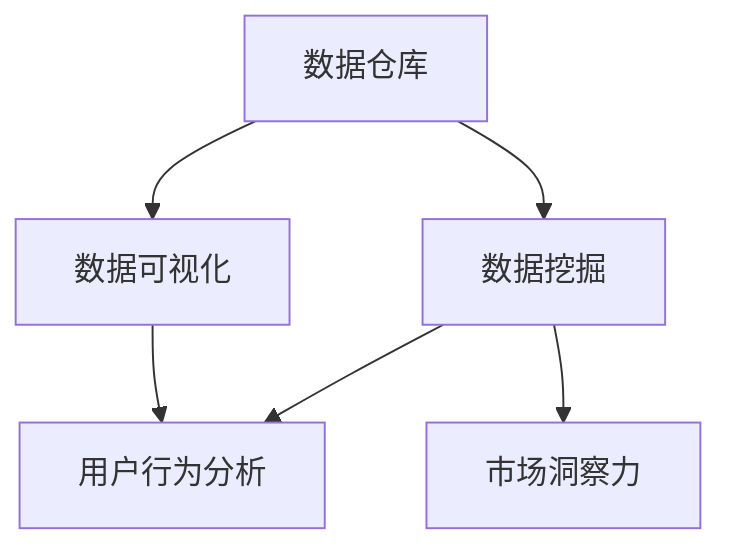

                 

# 注意力经济与数据分析洞察力：利用数据理解受众行为和市场

> 关键词：注意力经济, 数据分析, 用户行为, 市场洞察力, 数据驱动决策, 数据可视化, 数据挖掘, 数据仓库, 大数据, 数据隐私

## 1. 背景介绍

### 1.1 问题由来

在互联网时代，数据逐渐成为企业的重要资产之一。企业利用数据驱动决策，洞察市场变化，优化产品和服务，提升用户体验，从而在激烈的市场竞争中占据有利地位。然而，随着数据量的激增，传统的数据分析方法已难以满足日益复杂的数据处理需求。

“注意力经济”的概念应运而生。注意力经济是指在信息爆炸的时代，如何吸引和维持用户注意力，使数据价值最大化。在这一背景下，数据分析逐渐从“收集-清洗-分析”的单一过程转变为更加注重用户行为分析和市场洞察的全流程解决方案。

本文将深入探讨利用数据分析洞察受众行为和市场的核心原理与关键技术，并结合实际案例进行详细讲解。

### 1.2 问题核心关键点

本节将从以下三个关键点进行深入分析：

1. 数据驱动：通过数据分析挖掘数据背后的信息，洞察用户行为和市场趋势，为决策提供数据支撑。
2. 用户行为分析：从用户视角出发，利用数据分析技术，深度理解用户需求和行为模式，提升用户体验。
3. 市场洞察力：通过数据挖掘和可视化技术，揭示市场规律，发现新商机，制定精准的营销策略。

## 2. 核心概念与联系

### 2.1 核心概念概述

本节将详细介绍几个关键概念，并阐述它们之间的联系：

1. **数据仓库**：集中的、可管理的、可共享的数据存储环境，用于支持决策分析和管理。
2. **数据挖掘**：通过算法技术在数据中发现有用的模式和关系，用于辅助决策。
3. **数据可视化**：将复杂的数据转换为图形化表示，便于理解与分析。
4. **用户行为分析**：通过分析用户行为数据，理解用户需求和行为模式，优化用户体验。
5. **市场洞察力**：利用数据分析揭示市场规律，发现新商机，制定精准的营销策略。

这些概念相互关联，共同构成了数据驱动决策的全流程：



通过上述流程，企业可以高效地从数据中挖掘出有价值的信息，洞察用户行为和市场趋势，从而提升决策的科学性和有效性。

## 3. 核心算法原理 & 具体操作步骤

### 3.1 算法原理概述

注意力经济与数据分析的核心在于通过数据驱动决策，洞察用户行为和市场趋势。这一过程通常包括以下几个关键步骤：

1. **数据收集**：收集用户行为数据、市场交易数据、社交媒体数据等，构建全链路的数据仓库。
2. **数据清洗与预处理**：通过清洗和预处理，确保数据的准确性和完整性。
3. **数据挖掘与分析**：利用算法技术挖掘数据背后的信息，洞察用户行为和市场趋势。
4. **数据可视化**：将分析结果转换为图形化表示，便于理解与决策。
5. **市场洞察力**：通过数据分析揭示市场规律，发现新商机，制定精准的营销策略。

### 3.2 算法步骤详解

#### 3.2.1 数据收集

数据收集是数据分析的第一步，通常包括以下几种数据来源：

1. **内部数据**：如订单数据、用户行为数据、网站流量数据等。
2. **外部数据**：如社交媒体数据、行业报告、公开数据等。
3. **实时数据**：如网站访问日志、实时交易数据等。

具体收集方式包括：

1. **日志文件**：收集系统日志、访问日志、交易日志等。
2. **API接口**：通过接口调用获取外部数据，如天气数据、新闻数据等。
3. **数据爬虫**：利用数据爬虫技术，从网站和社交媒体上抓取数据。

#### 3.2.2 数据清洗与预处理

数据清洗和预处理是数据分析的必要步骤，通过这一步确保数据的准确性和完整性。主要包括以下操作：

1. **数据去重**：去除重复数据，确保数据的唯一性。
2. **数据缺失处理**：处理缺失值，如均值填充、插值等。
3. **数据标准化**：将不同数据源的数据统一到相同的格式和单位。
4. **数据归一化**：将数据映射到[0,1]区间，便于后续分析。

#### 3.2.3 数据挖掘与分析

数据挖掘与分析是数据分析的核心步骤，通过算法技术挖掘数据背后的信息，洞察用户行为和市场趋势。主要包括以下几种算法：

1. **聚类算法**：如K-means、层次聚类等，用于将数据分为不同的类别，发现用户群体和市场细分。
2. **分类算法**：如决策树、随机森林、支持向量机等，用于预测用户行为和市场变化。
3. **回归算法**：如线性回归、岭回归等，用于建立变量之间的关系，预测趋势和变化。
4. **关联规则挖掘**：如Apriori算法，用于发现数据之间的关联性，如购买行为分析。
5. **时间序列分析**：如ARIMA模型，用于分析时间序列数据，预测市场趋势。

#### 3.2.4 数据可视化

数据可视化是将分析结果转换为图形化表示，便于理解与决策。主要包括以下几种可视化方法：

1. **散点图**：用于展示两个变量之间的关系。
2. **柱状图**：用于展示不同类别的数量关系。
3. **折线图**：用于展示数据随时间的变化趋势。
4. **热力图**：用于展示变量之间的关系强度。
5. **雷达图**：用于展示多个变量的综合表现。
6. **桑基图**：用于展示数据的流动情况。

#### 3.2.5 市场洞察力

市场洞察力是通过数据分析揭示市场规律，发现新商机，制定精准的营销策略。主要包括以下几个步骤：

1. **数据融合**：将不同数据源的数据进行融合，形成全链路的数据视图。
2. **数据集成**：将不同数据源的数据集成到一个统一的数据仓库中。
3. **数据挖掘**：利用数据挖掘技术，发现市场规律和趋势。
4. **市场预测**：利用预测模型，预测市场变化和趋势。
5. **市场策略**：根据市场预测结果，制定精准的营销策略。

### 3.3 算法优缺点

基于数据驱动决策的分析方法，具有以下优点：

1. **数据驱动**：通过数据分析挖掘数据背后的信息，洞察用户行为和市场趋势，为决策提供数据支撑。
2. **客观性强**：基于数据的分析结果，具有较高的客观性和可信度。
3. **高效性**：通过自动化工具和技术，大大提高了数据分析的效率。

然而，也存在一些局限性：

1. **数据质量**：数据的准确性和完整性直接影响分析结果。
2. **数据隐私**：数据隐私保护问题，如用户隐私泄露等，成为一大挑战。
3. **算法复杂性**：一些高级算法模型较为复杂，需要专业的技术支持。
4. **数据存储问题**：大量数据存储和处理需要高性能计算设备和数据存储技术。

### 3.4 算法应用领域

基于数据驱动决策的分析方法，广泛应用于多个领域，如：

1. **电商行业**：通过数据分析，优化商品推荐、用户画像、市场细分等，提升销售和用户体验。
2. **金融行业**：通过数据分析，风险评估、客户画像、市场预测等，提升金融产品的竞争力。
3. **医疗行业**：通过数据分析，疾病预测、患者画像、药物研发等，提升医疗服务的质量和效率。
4. **旅游行业**：通过数据分析，旅游路线规划、用户行为分析、市场洞察等，提升旅游体验和收入。
5. **社交媒体**：通过数据分析，用户行为分析、内容推荐、广告投放等，提升用户体验和广告效果。

## 4. 数学模型和公式 & 详细讲解 & 举例说明

### 4.1 数学模型构建

基于注意力经济与数据分析的数学模型，主要包括以下几个部分：

1. **数据收集模型**：用于描述数据的收集过程，如数据类型、来源、存储等。
2. **数据清洗模型**：用于描述数据清洗和预处理的过程，如去重、填充、标准化等。
3. **数据挖掘模型**：用于描述数据挖掘的过程，如聚类、分类、回归等。
4. **数据可视化模型**：用于描述数据可视化的过程，如散点图、柱状图、折线图等。
5. **市场洞察力模型**：用于描述市场洞察力的过程，如数据融合、集成、挖掘、预测等。

### 4.2 公式推导过程

#### 4.2.1 数据收集模型

数据收集模型用于描述数据的收集过程，如数据类型、来源、存储等。以下是一个示例数据收集模型：

$$
D = \{D_1, D_2, \ldots, D_n\}
$$

其中 $D_i$ 表示第 $i$ 个数据源的数据集合。

#### 4.2.2 数据清洗模型

数据清洗模型用于描述数据清洗和预处理的过程，如去重、填充、标准化等。以下是一个示例数据清洗模型：

$$
D_{clean} = D_{raw} \rightarrow \{D_{clean}_1, D_{clean}_2, \ldots, D_{clean}_n\}
$$

其中 $D_{raw}$ 表示原始数据，$D_{clean}$ 表示清洗后的数据。

#### 4.2.3 数据挖掘模型

数据挖掘模型用于描述数据挖掘的过程，如聚类、分类、回归等。以下是一个示例数据挖掘模型：

$$
M = \{M_1, M_2, \ldots, M_k\}
$$

其中 $M_i$ 表示第 $i$ 个数据挖掘算法的结果。

#### 4.2.4 数据可视化模型

数据可视化模型用于描述数据可视化的过程，如散点图、柱状图、折线图等。以下是一个示例数据可视化模型：

$$
V = \{V_1, V_2, \ldots, V_m\}
$$

其中 $V_i$ 表示第 $i$ 个可视化图表。

#### 4.2.5 市场洞察力模型

市场洞察力模型用于描述市场洞察力的过程，如数据融合、集成、挖掘、预测等。以下是一个示例市场洞察力模型：

$$
I = \{I_1, I_2, \ldots, I_l\}
$$

其中 $I_i$ 表示第 $i$ 个市场洞察力分析结果。

### 4.3 案例分析与讲解

#### 4.3.1 电商行业

电商行业通过数据分析，优化商品推荐、用户画像、市场细分等，提升销售和用户体验。以下是一个示例电商行业数据分析案例：

1. **数据收集**：收集订单数据、用户行为数据、网站流量数据等。
2. **数据清洗与预处理**：清洗和预处理数据，确保数据的准确性和完整性。
3. **数据挖掘与分析**：利用聚类算法，发现用户群体和市场细分。
4. **数据可视化**：将聚类结果转换为图形化表示，便于理解与决策。
5. **市场洞察力**：根据聚类结果，制定精准的营销策略，优化商品推荐和用户体验。

#### 4.3.2 金融行业

金融行业通过数据分析，风险评估、客户画像、市场预测等，提升金融产品的竞争力。以下是一个示例金融行业数据分析案例：

1. **数据收集**：收集交易数据、客户数据、市场数据等。
2. **数据清洗与预处理**：清洗和预处理数据，确保数据的准确性和完整性。
3. **数据挖掘与分析**：利用分类算法，预测客户行为和市场变化。
4. **数据可视化**：将分类结果转换为图形化表示，便于理解与决策。
5. **市场洞察力**：根据分类结果，制定精准的营销策略，提升金融产品的竞争力。

## 5. 项目实践：代码实例和详细解释说明

### 5.1 开发环境搭建

在进行数据分析实践前，我们需要准备好开发环境。以下是使用Python进行Pandas开发的环境配置流程：

1. 安装Anaconda：从官网下载并安装Anaconda，用于创建独立的Python环境。

2. 创建并激活虚拟环境：
```bash
conda create -n data-analysis-env python=3.8 
conda activate data-analysis-env
```

3. 安装Pandas：
```bash
pip install pandas
```

4. 安装NumPy、Matplotlib、Scikit-learn等工具包：
```bash
pip install numpy matplotlib scikit-learn seaborn
```

完成上述步骤后，即可在`data-analysis-env`环境中开始数据分析实践。

### 5.2 源代码详细实现

这里我们以电商行业为例，给出使用Pandas进行数据分析的PyTorch代码实现。

```python
import pandas as pd
import numpy as np
import matplotlib.pyplot as plt

# 读取订单数据
orders = pd.read_csv('orders.csv')

# 清洗和预处理数据
orders = orders.drop_duplicates()
orders = orders.dropna()

# 数据可视化
orders.plot(kind='scatter', x='price', y='quantity', c='category', alpha=0.5)

# 聚类分析
from sklearn.cluster import KMeans
kmeans = KMeans(n_clusters=3, random_state=42)
kmeans.fit(orders[['price', 'quantity']])
labels = kmeans.labels_

# 显示聚类结果
plt.figure(figsize=(10, 6))
plt.bar(labels, orders['quantity'].groupby(labels).count())
plt.title('Category Distribution')
plt.xlabel('Cluster Label')
plt.ylabel('Quantity')

# 输出聚类结果
print(labels)
```

### 5.3 代码解读与分析

让我们再详细解读一下关键代码的实现细节：

**电商订单数据分析代码**：
- `pd.read_csv`方法：读取订单数据。
- `drop_duplicates`方法：去除重复数据。
- `dropna`方法：去除缺失数据。
- `plot`方法：绘制散点图，展示价格与数量的关系。
- `KMeans`算法：进行聚类分析，发现价格和数量的聚类结果。
- `groupby`方法：按照聚类结果分组，统计每个类别的订单数量。
- `plt.bar`方法：绘制柱状图，展示各个聚类类别的订单数量。
- `print`方法：输出聚类结果。

通过上述代码，我们可以看到，使用Pandas进行数据分析的过程简单高效，并且可以方便地实现数据可视化、聚类分析等常见功能。

## 6. 实际应用场景

### 6.1 智能客服系统

智能客服系统通过数据分析，可以提升客户咨询体验和问题解决效率。以下是一个示例智能客服系统数据分析案例：

1. **数据收集**：收集历史客服对话记录，提取问题和最佳答复。
2. **数据清洗与预处理**：清洗和预处理数据，确保数据的准确性和完整性。
3. **数据挖掘与分析**：利用分类算法，发现常见问题和最佳答复模式。
4. **数据可视化**：将分类结果转换为图形化表示，便于理解与决策。
5. **市场洞察力**：根据分类结果，制定精准的客服策略，提升客户咨询体验。

### 6.2 金融舆情监测

金融舆情监测通过数据分析，可以实时监测市场舆论动向，规避金融风险。以下是一个示例金融舆情监测数据分析案例：

1. **数据收集**：收集金融领域相关的新闻、报道、评论等文本数据。
2. **数据清洗与预处理**：清洗和预处理数据，确保数据的准确性和完整性。
3. **数据挖掘与分析**：利用情感分析算法，发现舆情变化趋势。
4. **数据可视化**：将情感分析结果转换为图形化表示，便于理解与决策。
5. **市场洞察力**：根据情感分析结果，制定精准的舆情应对策略，规避金融风险。

### 6.3 个性化推荐系统

个性化推荐系统通过数据分析，可以提升用户体验和满意度。以下是一个示例个性化推荐系统数据分析案例：

1. **数据收集**：收集用户浏览、点击、评论、分享等行为数据，提取物品标题、描述、标签等文本内容。
2. **数据清洗与预处理**：清洗和预处理数据，确保数据的准确性和完整性。
3. **数据挖掘与分析**：利用聚类算法，发现用户兴趣点和物品类别。
4. **数据可视化**：将聚类结果转换为图形化表示，便于理解与决策。
5. **市场洞察力**：根据聚类结果，制定精准的推荐策略，提升用户体验。

### 6.4 未来应用展望

随着数据驱动决策的不断发展，基于数据分析的注意力经济将得到更广泛的应用，为各行各业带来新的突破。

在智慧医疗领域，通过数据分析，可以优化诊疗流程、提升医疗服务质量，辅助医生做出精准诊断和治疗方案。

在智能教育领域，通过数据分析，可以分析学生行为和学习成果，制定个性化的学习方案，提升教育质量。

在智慧城市治理中，通过数据分析，可以实时监测城市运行状态，优化资源配置，提高城市管理的智能化水平。

此外，在企业生产、社会治理、文娱传媒等众多领域，基于数据分析的注意力经济也将不断涌现，为经济社会发展注入新的动力。相信随着技术的日益成熟，基于数据分析的注意力经济必将在构建人机协同的智能时代中扮演越来越重要的角色。

## 7. 工具和资源推荐

### 7.1 学习资源推荐

为了帮助开发者系统掌握数据分析的理论基础和实践技巧，这里推荐一些优质的学习资源：

1. 《Python数据分析实战》系列博文：由大数据专家撰写，深入浅出地介绍了Pandas、NumPy等Python数据分析工具的用法。
2. Coursera《数据分析与统计学》课程：由约翰霍普金斯大学开设，提供从入门到高级的数据分析课程，涵盖统计学、机器学习等知识。
3. 《数据科学实战》书籍：介绍数据分析、数据挖掘、机器学习等技术，通过实际案例进行讲解。
4. Kaggle：全球最大的数据科学竞赛平台，提供丰富的数据集和数据竞赛，帮助开发者提升实战技能。
5. Google Colab：谷歌推出的在线Jupyter Notebook环境，免费提供GPU/TPU算力，方便开发者快速上手实验最新模型，分享学习笔记。

通过对这些资源的学习实践，相信你一定能够快速掌握数据分析的精髓，并用于解决实际的业务问题。

### 7.2 开发工具推荐

高效的开发离不开优秀的工具支持。以下是几款用于数据分析开发的常用工具：

1. Jupyter Notebook：Python数据科学开发环境，支持代码编写、数据可视化、版本控制等功能。
2. Matplotlib：Python绘图库，支持丰富的可视化图表展示。
3. Seaborn：基于Matplotlib的高级绘图库，支持统计图表和热力图等。
4. Pandas：Python数据分析库，支持数据清洗、预处理、分析等功能。
5. NumPy：Python数值计算库，支持高效的数据处理和计算。
6. SciPy：Python科学计算库，支持数学、科学和工程计算。

合理利用这些工具，可以显著提升数据分析的开发效率，加快创新迭代的步伐。

### 7.3 相关论文推荐

数据分析与注意力经济的发展源于学界的持续研究。以下是几篇奠基性的相关论文，推荐阅读：

1. A Survey of Data-Driven Decision Making in Business Analytics：回顾数据分析在商业决策中的应用，介绍各类数据分析方法。
2. Data Mining for Market Basket Analysis：介绍关联规则挖掘算法，应用于购物篮分析，发现用户的购买行为模式。
3. Data Mining and Statistical Learning：介绍各类数据挖掘算法，应用于数据挖掘、预测建模、聚类分析等领域。
4. Data-Driven Methods in Financial Analytics：介绍数据分析在金融领域的应用，如风险评估、客户画像、市场预测等。
5. Data Mining and Statistical Learning：介绍各类数据挖掘算法，应用于数据挖掘、预测建模、聚类分析等领域。

这些论文代表了大数据与数据分析技术的发展脉络。通过学习这些前沿成果，可以帮助研究者把握学科前进方向，激发更多的创新灵感。

## 8. 总结：未来发展趋势与挑战

### 8.1 总结

本文对基于数据分析的注意力经济进行了全面系统的介绍。首先阐述了数据分析在数据驱动决策中的重要性，明确了数据分析在理解用户行为和市场趋势中的独特价值。其次，从原理到实践，详细讲解了数据分析的核心步骤和技术实现，给出了数据分析任务开发的完整代码实例。同时，本文还广泛探讨了数据分析在智能客服、金融舆情、个性化推荐等多个行业领域的应用前景，展示了数据分析技术的广阔前景。

通过本文的系统梳理，可以看到，基于数据分析的注意力经济正在成为数据驱动决策的重要范式，极大地拓展了数据分析应用边界，催生了更多的落地场景。受益于数据驱动决策的不断发展，数据分析技术必将在更广阔的应用领域大放异彩，深刻影响人类的生产生活方式。

### 8.2 未来发展趋势

展望未来，基于数据分析的注意力经济将呈现以下几个发展趋势：

1. 数据量持续增大。随着数据的不断产生，数据量将持续增长，数据分析的价值将更加凸显。
2. 数据来源多样化。未来将有更多数据源，如传感器数据、物联网数据、实时数据等，丰富数据分析的维度。
3. 数据分析方法多样化。随着技术的发展，数据分析方法将更加多样化和高效化，提升数据分析的精度和效率。
4. 数据可视化发展。数据可视化将更加智能和交互化，方便用户理解和决策。
5. 人工智能与数据分析融合。人工智能技术将与数据分析深度融合，提升数据分析的智能化水平。

以上趋势凸显了数据分析与注意力经济技术的广阔前景。这些方向的探索发展，必将进一步提升数据分析的科学性和有效性，为构建智能社会提供强有力的技术支撑。

### 8.3 面临的挑战

尽管基于数据分析的注意力经济已经取得了瞩目成就，但在迈向更加智能化、普适化应用的过程中，它仍面临着诸多挑战：

1. 数据质量问题。数据的准确性和完整性直接影响分析结果，需要投入大量资源进行数据清洗和预处理。
2. 数据隐私保护。数据隐私保护问题，如用户隐私泄露等，成为一大挑战。
3. 算法复杂性。一些高级算法模型较为复杂，需要专业的技术支持。
4. 数据存储问题。大量数据存储和处理需要高性能计算设备和数据存储技术。
5. 数据可视化问题。数据可视化需要投入大量时间和资源，提升可视化效果。

### 8.4 研究展望

面对数据分析面临的这些挑战，未来的研究需要在以下几个方面寻求新的突破：

1. 探索高效的数据清洗与预处理方法。通过数据清洗与预处理，确保数据的准确性和完整性。
2. 研究数据隐私保护技术。利用数据脱敏、加密等技术，保护数据隐私。
3. 开发高效的数据分析算法。利用高效的算法模型，提升数据分析的精度和效率。
4. 探索智能化的数据可视化技术。通过AI技术，提升数据可视化的智能性和交互性。
5. 探索数据与AI技术的融合。将数据与AI技术深度融合，提升数据分析的智能化水平。

这些研究方向的探索，必将引领数据分析技术迈向更高的台阶，为构建智能社会提供强有力的技术支撑。面向未来，数据分析技术还需要与其他人工智能技术进行更深入的融合，如知识表示、因果推理、强化学习等，多路径协同发力，共同推动数据分析技术的进步。只有勇于创新、敢于突破，才能不断拓展数据分析的边界，让数据分析技术更好地造福人类社会。

## 9. 附录：常见问题与解答

**Q1：数据分析对企业有什么帮助？**

A: 数据分析可以为企业提供以下帮助：

1. 优化决策：通过数据分析，企业可以更好地理解用户行为和市场趋势，优化决策过程，提升决策的科学性和准确性。
2. 提升用户体验：通过数据分析，企业可以深入了解用户需求和行为模式，优化产品和服务，提升用户体验。
3. 发现商机：通过数据分析，企业可以揭示市场规律和趋势，发现新商机，制定精准的营销策略。
4. 风险规避：通过数据分析，企业可以实时监测市场风险，规避风险，提升竞争力。

**Q2：数据分析的主要流程是什么？**

A: 数据分析的主要流程包括以下几个步骤：

1. 数据收集：收集数据，如订单数据、客户数据、市场数据等。
2. 数据清洗与预处理：清洗和预处理数据，确保数据的准确性和完整性。
3. 数据挖掘与分析：利用算法技术挖掘数据背后的信息，洞察用户行为和市场趋势。
4. 数据可视化：将分析结果转换为图形化表示，便于理解与决策。
5. 市场洞察力：通过数据分析揭示市场规律，发现新商机，制定精准的营销策略。

**Q3：数据分析中的常见问题有哪些？**

A: 数据分析中的常见问题包括：

1. 数据质量问题：数据的准确性和完整性直接影响分析结果，需要投入大量资源进行数据清洗和预处理。
2. 数据隐私问题：数据隐私保护问题，如用户隐私泄露等，成为一大挑战。
3. 算法复杂性：一些高级算法模型较为复杂，需要专业的技术支持。
4. 数据存储问题：大量数据存储和处理需要高性能计算设备和数据存储技术。
5. 数据可视化问题：数据可视化需要投入大量时间和资源，提升可视化效果。

**Q4：如何提高数据分析的效率？**

A: 提高数据分析的效率可以从以下几个方面入手：

1. 自动化数据处理：利用自动化工具和技术，如Pandas、NumPy等，提高数据处理效率。
2. 数据并行处理：利用多核CPU、GPU、分布式计算等技术，提高数据处理速度。
3. 高效算法模型：利用高效的数据分析算法，如聚类算法、分类算法等，提高数据分析精度。
4. 数据缓存与预处理：利用数据缓存和预处理技术，提高数据分析速度。

通过这些措施，可以显著提升数据分析的效率，缩短数据分析周期，加速业务决策。

**Q5：如何保护数据隐私？**

A: 保护数据隐私可以采取以下措施：

1. 数据脱敏：对数据进行脱敏处理，去除敏感信息。
2. 数据加密：对数据进行加密处理，确保数据传输和存储的安全性。
3. 访问控制：对数据进行访问控制，限制数据的访问权限。
4. 匿名化处理：对数据进行匿名化处理，保护个人隐私。
5. 隐私政策：制定隐私政策，明确数据的使用范围和限制。

通过这些措施，可以有效地保护数据隐私，确保数据使用的合法性和安全性。

---

作者：禅与计算机程序设计艺术 / Zen and the Art of Computer Programming

