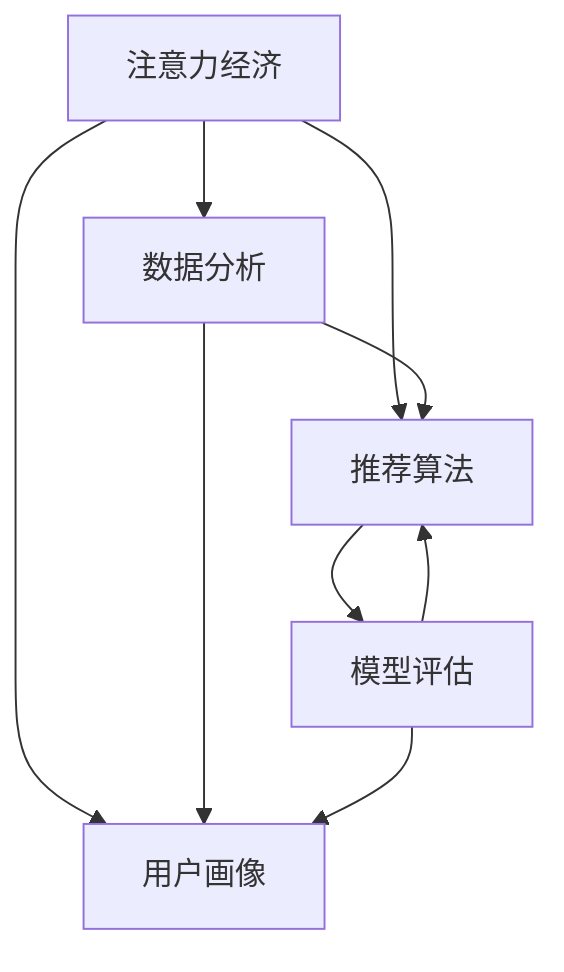

                 

# 注意力经济与数据分析洞见：利用数据理解受众行为和偏好

> 关键词：注意力经济, 数据分析, 受众行为, 数据理解, 推荐算法, 用户画像, 模型评估

## 1. 背景介绍

### 1.1 问题由来
在信息过载的时代，如何精准、高效地将信息传递给用户，从而实现注意力价值的最大化，成为了众多企业关注的焦点。这一现象催生了“注意力经济”的概念，即在高度竞争的市场中，获取用户注意力成为获取市场份额的关键。

在此背景下，数据分析成为了理解用户行为和偏好的重要手段。通过对大量用户数据的收集和分析，企业能够构建用户画像，进行个性化推荐，提升用户体验，实现流量变现。

然而，面对海量的用户数据，如何从中提取有价值的洞见，制定有效的数据驱动决策，是一项极具挑战性的任务。本文将深入探讨注意力经济下数据分析的核心原理与技术实践，为解决这一问题提供有价值的洞见。

### 1.2 问题核心关键点
注意力经济与数据分析的结合，涉及到多个关键点，包括：
- 如何高效获取用户注意力：通过精准的定位和吸引策略，将信息推送至目标受众。
- 如何理解用户行为和偏好：通过数据收集和分析，构建用户画像，洞察用户需求。
- 如何优化推荐系统：根据用户画像和行为数据，进行个性化推荐，提升用户满意度。
- 如何评估推荐效果：通过实验和反馈，持续优化推荐算法。

这些问题要求我们结合注意力经济学原理和数据分析技术，进行系统化、可量化的分析和优化。

## 2. 核心概念与联系

### 2.1 核心概念概述

为了更好地理解注意力经济与数据分析的结合，本节将介绍几个核心概念：

- **注意力经济**：指在数字经济时代，通过精准获取用户注意力，实现商业价值最大化的经济模式。用户注意力是稀缺资源，如何高效利用成为企业竞争的关键。
- **数据分析**：通过收集、清洗、分析和可视化数据，从数据中提取有价值的信息和洞见，以支持决策制定的过程。数据分析覆盖数据收集、数据处理、数据分析、数据可视化等多个环节。
- **用户画像**：基于用户行为和偏好，构建详细的用户档案，用于理解用户需求和行为，进行精准营销和个性化推荐。
- **推荐算法**：利用算法模型，根据用户的历史行为和兴趣，自动生成推荐列表，提升用户满意度和转化率。推荐算法包括协同过滤、基于内容的推荐、深度学习推荐等。
- **模型评估**：通过实验和指标，评估推荐系统的性能和效果，指导算法优化和迭代。常用的指标包括点击率、转化率、召回率、准确率等。

这些概念之间的逻辑关系可以通过以下Mermaid流程图来展示：



这个流程图展示了一些核心概念之间的关系：

1. 注意力经济是数据分析的应用场景，用于指导数据收集和分析方向。
2. 用户画像是数据分析的输出之一，为推荐算法提供依据。
3. 推荐算法是基于数据分析的用户画像进行个性化推荐的核心工具。
4. 模型评估用于衡量推荐算法的性能，指导算法优化。

## 3. 核心算法原理 & 具体操作步骤
### 3.1 算法原理概述

注意力经济与数据分析的结合，核心在于如何通过数据分析构建用户画像，进行精准推荐。这一过程可以分为数据收集与预处理、用户画像构建、推荐算法优化、模型评估与迭代等多个步骤。

### 3.2 算法步骤详解

**Step 1: 数据收集与预处理**
- 数据收集：利用用户行为数据（如浏览记录、点击行为、购买记录等）和用户属性数据（如年龄、性别、地理位置等），构建数据集。
- 数据清洗：去除重复、缺失、异常数据，保证数据质量和完整性。
- 特征工程：对原始数据进行特征提取和转换，如特征编码、归一化等。

**Step 2: 用户画像构建**
- 用户分群：基于用户的属性和行为，进行聚类分析，构建不同的用户群体。
- 行为分析：分析用户的历史行为和偏好，如浏览频率、停留时间、购买记录等。
- 画像构建：结合用户属性和行为数据，构建详尽的用户画像。

**Step 3: 推荐算法优化**
- 算法选择：根据任务需求和数据特点，选择合适的推荐算法（如协同过滤、基于内容的推荐、深度学习推荐等）。
- 模型训练：利用用户画像数据，训练推荐模型。
- 模型调优：根据推荐效果和用户反馈，调整模型参数和超参数，提升推荐精度和效果。

**Step 4: 模型评估与迭代**
- 效果评估：通过A/B测试、离线评估等方法，评估推荐模型的效果。
- 反馈机制：收集用户反馈，进行数据和模型迭代。
- 持续优化：基于评估结果和反馈信息，持续优化推荐算法和数据模型。

### 3.3 算法优缺点

注意力经济与数据分析的结合，具有以下优点：
1. 精准定位：通过数据分析和用户画像，实现精准的目标用户定位。
2. 个性化推荐：根据用户画像，进行个性化推荐，提升用户体验。
3. 用户粘性：通过精准推荐，增加用户粘性和转化率。
4. 数据驱动：以数据为核心，进行决策和优化，提升决策科学性。

同时，也存在一些局限性：
1. 数据隐私：数据收集和使用过程中可能涉及用户隐私问题，需严格遵守数据保护法规。
2. 数据质量：数据质量和完整性对分析结果和推荐效果有直接影响。
3. 算法复杂度：部分推荐算法（如深度学习推荐）需要大量的计算资源和时间。
4. 模型解释性：复杂的推荐模型可能缺乏可解释性，用户难以理解推荐逻辑。

尽管存在这些局限性，但就目前而言，注意力经济与数据分析的结合方法仍是最主流的应用范式。未来相关研究的重点在于如何进一步降低算法复杂度，提升数据质量和模型解释性，同时兼顾隐私保护和用户满意度。

### 3.4 算法应用领域

注意力经济与数据分析的应用范围广泛，以下列举几个典型的应用领域：

- **电商推荐**：基于用户浏览记录和购买行为，进行商品推荐，提升用户购买率和转化率。
- **新闻推荐**：分析用户阅读习惯和兴趣，推荐相关新闻文章，提升用户停留时间和互动率。
- **视频推荐**：根据用户观看历史和评分，推荐感兴趣的视频内容，提升用户满意度和观看时长。
- **社交推荐**：利用用户社交关系和兴趣，推荐好友和相关内容，增加用户互动和粘性。
- **广告推荐**：根据用户画像和行为数据，进行精准广告投放，提升广告点击率和转化率。

除了上述这些经典应用外，注意力经济与数据分析还被创新性地应用到更多场景中，如个性化旅游推荐、智能家居控制、智能客服系统等，为各行业数字化转型提供了新的动力。

## 4. 数学模型和公式 & 详细讲解 & 举例说明

### 4.1 数学模型构建

在注意力经济与数据分析的结合中，常见的数学模型包括协同过滤模型、基于内容的推荐模型和深度学习推荐模型。这里以协同过滤模型为例，展示其数学模型构建过程。

设用户集为 $U$，物品集为 $I$，用户-物品评分矩阵为 $R_{ui}$，其中 $R_{ui}$ 表示用户 $u$ 对物品 $i$ 的评分。协同过滤模型通过用户-物品评分矩阵来构建用户画像和推荐列表。

### 4.2 公式推导过程

协同过滤模型包括基于用户的协同过滤和基于物品的协同过滤两种方法。这里以基于用户的协同过滤模型为例，推导其公式。

假设用户 $u$ 对物品 $i$ 的评分已知，通过用户-物品评分矩阵 $R_{ui}$ 计算用户 $u$ 的评分向量 $r_u$ 和物品 $i$ 的评分向量 $r_i$，然后计算用户 $u$ 对物品 $j$ 的预测评分 $\hat{R}_{uj}$。

设用户 $u$ 对物品 $j$ 的评分向量为 $r_j$，则预测评分 $\hat{R}_{uj}$ 的公式如下：

$$
\hat{R}_{uj} = \sum_{i=1}^N \frac{R_{ui}R_{ij}}{\sigma(\alpha r_u^T r_j + b)} + \alpha_0
$$

其中，$N$ 为物品数量，$\alpha$ 为缩放因子，$b$ 为偏置项，$\alpha_0$ 为截距。$\sigma$ 为sigmoid函数。

### 4.3 案例分析与讲解

假设我们有一个电商网站，已收集到用户 $u$ 对商品 $i$ 的评分数据 $R_{ui}$。我们希望通过协同过滤模型为用户 $u$ 推荐其他可能喜欢的商品 $j$。

步骤如下：

1. 计算用户 $u$ 的评分向量 $r_u$ 和商品 $i$ 的评分向量 $r_i$，公式如下：

$$
r_u = \frac{1}{\sqrt{\sum_{i=1}^N r_i^2}} \begin{bmatrix} R_{u1} \\ R_{u2} \\ \vdots \\ R_{un} \end{bmatrix}, 
r_i = \frac{1}{\sqrt{\sum_{u=1}^M r_u^2}} \begin{bmatrix} R_{i1} \\ R_{i2} \\ \vdots \\ R_{im} \end{bmatrix}
$$

2. 计算用户 $u$ 对物品 $j$ 的预测评分 $\hat{R}_{uj}$，使用上述公式计算即可。

3. 根据预测评分 $\hat{R}_{uj}$ 对所有物品进行排序，选取评分最高的若干物品作为推荐列表。

通过以上过程，我们可以实现基于用户协同过滤的推荐算法，为用户提供个性化商品推荐。

## 5. 项目实践：代码实例和详细解释说明
### 5.1 开发环境搭建

在进行注意力经济与数据分析的实践前，我们需要准备好开发环境。以下是使用Python进行Scikit-learn开发的环境配置流程：

1. 安装Anaconda：从官网下载并安装Anaconda，用于创建独立的Python环境。

2. 创建并激活虚拟环境：
```bash
conda create -n attention-env python=3.8 
conda activate attention-env
```

3. 安装Scikit-learn：
```bash
conda install scikit-learn
```

4. 安装各类工具包：
```bash
pip install pandas numpy scikit-learn matplotlib seaborn jupyter notebook ipython
```

完成上述步骤后，即可在`attention-env`环境中开始实践。

### 5.2 源代码详细实现

下面我们以电商推荐系统为例，给出使用Scikit-learn进行协同过滤算法实现的PyTorch代码实现。

首先，定义协同过滤算法的函数：

```python
from sklearn.metrics.pairwise import cosine_similarity
import numpy as np

def collaborative_filtering(train_data, user_id, num_recommendations):
    train_matrix = np.array(train_data)
    user_id = int(user_id)
    all_users, all_items = train_matrix.shape
    user_row = train_matrix[user_id].reshape(-1, 1)
    all_user_row = train_matrix - user_row
    user_row_cosine = cosine_similarity(user_row, all_user_row)
    weighted_user_row = np.multiply(train_matrix[user_id].reshape(-1, 1), user_row_cosine)
    weights_sum = np.sum(abs(user_row_cosine), axis=1)
    predicted_ratings = np.dot(train_matrix[user_id].reshape(-1, 1), weights_sum)
    return np.argsort(predicted_ratings)[-num_recommendations:][::-1]
```

然后，加载数据集并进行预处理：

```python
import pandas as pd

# 读取数据集
train_data = pd.read_csv('train_data.csv', header=None)
train_data.columns = ['user_id', 'item_id', 'rating']

# 数据预处理
train_data = train_data.dropna()
train_data = train_data.astype(int)

# 构建用户-物品评分矩阵
train_matrix = train_data.groupby(['user_id', 'item_id'])['rating'].mean().unstack().reset_index()

# 构建测试集
test_data = pd.read_csv('test_data.csv', header=None)
test_data.columns = ['user_id', 'item_id']
test_matrix = test_data.groupby(['user_id', 'item_id'])['rating'].mean().unstack().reset_index()
```

最后，执行协同过滤算法并输出推荐结果：

```python
from flask import Flask, request

app = Flask(__name__)

@app.route('/recommend', methods=['GET'])
def recommend():
    user_id = request.args.get('user_id')
    recommendations = collaborative_filtering(train_matrix, user_id, 5)
    return str(recommendations)

if __name__ == '__main__':
    app.run(host='0.0.0.0', port=5000)
```

以上就是使用Scikit-learn进行电商推荐系统协同过滤算法实践的完整代码实现。可以看到，Scikit-learn提供了丰富的数据处理和分析工具，可以方便地构建协同过滤模型。

### 5.3 代码解读与分析

让我们再详细解读一下关键代码的实现细节：

**协同过滤函数**：
- 使用Pandas加载用户-物品评分矩阵，并进行预处理。
- 定义协同过滤函数，计算用户对物品的预测评分。
- 使用Pandas的groupby函数进行分组统计，计算用户-物品评分矩阵。
- 构建测试集，并进行相似度计算。
- 使用Flask搭建Web服务，接收用户ID作为参数，返回推荐结果。

**代码细节**：
- 在推荐算法中，使用了Python的NumPy库进行矩阵计算和排序。
- 使用Scikit-learn的cosine_similarity函数计算用户和物品之间的相似度。
- 通过Flask搭建Web服务，接收用户ID作为参数，返回推荐结果。

可以看到，Scikit-learn提供了强大的数据处理和分析工具，使得数据分析的实现变得简洁高效。开发者可以将更多精力放在模型设计和实验设计上，而不必过多关注底层的实现细节。

## 6. 实际应用场景
### 6.1 智能客服系统

基于注意力经济与数据分析的推荐系统，可以广泛应用于智能客服系统的构建。传统客服往往需要配备大量人力，高峰期响应缓慢，且一致性和专业性难以保证。而使用基于数据分析的推荐系统，可以7x24小时不间断服务，快速响应客户咨询，用自然流畅的语言解答各类常见问题。

在技术实现上，可以收集企业内部的历史客服对话记录，将问题和最佳答复构建成监督数据，在此基础上对推荐系统进行微调。微调后的推荐系统能够自动理解用户意图，匹配最合适的答案模板进行回复。对于客户提出的新问题，还可以接入检索系统实时搜索相关内容，动态组织生成回答。如此构建的智能客服系统，能大幅提升客户咨询体验和问题解决效率。

### 6.2 金融舆情监测

金融机构需要实时监测市场舆论动向，以便及时应对负面信息传播，规避金融风险。传统的人工监测方式成本高、效率低，难以应对网络时代海量信息爆发的挑战。基于数据分析的舆情监测系统，可以通过用户画像和行为分析，识别出市场趋势和舆情热点，实现及时预警和风险规避。

具体而言，可以收集金融领域相关的新闻、报道、评论等文本数据，并对其进行主题标注和情感标注。在此基础上对推荐系统进行微调，使其能够自动判断文本属于何种主题，情感倾向是正面、中性还是负面。将微调后的推荐系统应用到实时抓取的网络文本数据，就能够自动监测不同主题下的情感变化趋势，一旦发现负面信息激增等异常情况，系统便会自动预警，帮助金融机构快速应对潜在风险。

### 6.3 个性化推荐系统

当前的推荐系统往往只依赖用户的历史行为数据进行物品推荐，无法深入理解用户的真实兴趣偏好。基于数据分析的推荐系统，可以更好地挖掘用户行为背后的语义信息，从而提供更精准、多样的推荐内容。

在实践中，可以收集用户浏览、点击、评论、分享等行为数据，提取和用户交互的物品标题、描述、标签等文本内容。将文本内容作为模型输入，用户的后续行为（如是否点击、购买等）作为监督信号，在此基础上微调推荐模型。微调后的推荐模型能够从文本内容中准确把握用户的兴趣点。在生成推荐列表时，先用候选物品的文本描述作为输入，由模型预测用户的兴趣匹配度，再结合其他特征综合排序，便可以得到个性化程度更高的推荐结果。

### 6.4 未来应用展望

随着数据分析与注意力经济的结合不断深入，基于推荐系统的应用场景将更加多样，为各行业数字化转型提供新的动力。

在智慧医疗领域，基于数据分析的医疗推荐系统，能够根据患者的病情和历史数据，推荐最适合的治疗方案和药物，提高诊疗效率和效果。

在智能教育领域，基于数据分析的教育推荐系统，能够根据学生的学习行为和成绩，推荐适合的学习资源和辅导方案，因材施教，促进教育公平，提高教学质量。

在智慧城市治理中，基于数据分析的城市推荐系统，能够根据市民的行为和需求，推荐最合适的公共服务，提升城市管理和居民满意度。

此外，在企业生产、社会治理、文娱传媒等众多领域，基于数据分析的推荐系统也将不断涌现，为各行业数字化转型提供新的动力。相信随着数据分析技术的不断进步，推荐系统的应用场景将更加丰富，为数字化转型注入新的活力。

## 7. 工具和资源推荐
### 7.1 学习资源推荐

为了帮助开发者系统掌握注意力经济与数据分析的核心原理和实践技巧，这里推荐一些优质的学习资源：

1. 《推荐系统实战》系列博文：由推荐系统专家撰写，深入浅出地介绍了推荐系统的基本原理、算法实现和工程实践，适合初学者入门。

2. 《深度学习》课程：斯坦福大学开设的深度学习课程，涵盖深度学习的基本概念和经典模型，适合想要深入理解深度学习原理的读者。

3. 《Python数据科学手册》书籍：全面介绍了Python在数据科学中的应用，包括数据分析、机器学习、数据可视化等多个方面，适合系统学习。

4. Kaggle竞赛平台：全球知名的数据科学竞赛平台，提供大量真实世界的数据集和挑战，适合实战练习和提升。

5. HuggingFace官方文档：提供了丰富的预训练语言模型和推荐算法实现，适合快速上手和应用。

通过对这些资源的学习实践，相信你一定能够快速掌握注意力经济与数据分析的核心原理，并用于解决实际的推荐系统问题。

### 7.2 开发工具推荐

高效的开发离不开优秀的工具支持。以下是几款用于注意力经济与数据分析的推荐系统开发的常用工具：

1. PyTorch：基于Python的开源深度学习框架，灵活高效，支持多种推荐算法实现。

2. TensorFlow：由Google主导开发的开源深度学习框架，生产部署方便，适合大规模工程应用。

3. Scikit-learn：提供了丰富的数据分析和机器学习工具，适合快速实现推荐算法和模型评估。

4. FastAPI：基于Python的Web框架，可以快速搭建API服务，方便模型部署和调用。

5. Apache Superset：开源的数据可视化工具，可以实时展示推荐系统的运行状态和效果。

合理利用这些工具，可以显著提升推荐系统的开发效率，加快创新迭代的步伐。

### 7.3 相关论文推荐

注意力经济与数据分析的应用源于学界的持续研究。以下是几篇奠基性的相关论文，推荐阅读：

1. Collaborative Filtering for Recommender Systems（协同过滤算法）：由Herbrich等人在2002年发表，介绍了协同过滤算法的基本原理和实现方法。

2. Recommender Systems（推荐系统综述）：由Herbrich等人在2002年发表，详细介绍了推荐系统的历史、原理和算法。

3. Deep Collaborative Filtering（深度协同过滤）：由He等人在2017年发表，介绍了深度学习在协同过滤中的应用，提升了推荐系统的性能。

4. The BellKor 2010 Recommender Challenge：由Herbrich等人在2010年发表，介绍了Recommender Challenge 2010的竞赛结果和推荐系统方案。

5. Knowledge-Aware Collaborative Filtering（知识感知协同过滤）：由Hu等人在2012年发表，介绍了知识感知协同过滤算法，结合了领域知识进行推荐。

这些论文代表了大数据分析与推荐系统的研究方向。通过学习这些前沿成果，可以帮助研究者把握学科前进方向，激发更多的创新灵感。

## 8. 总结：未来发展趋势与挑战

### 8.1 总结

本文对注意力经济与数据分析的结合方法进行了全面系统的介绍。首先阐述了注意力经济的应用背景和数据分析的核心原理，明确了推荐系统在大数据时代的重要性和挑战。其次，从原理到实践，详细讲解了推荐算法的数学模型和实现步骤，给出了推荐系统开发的完整代码实例。同时，本文还广泛探讨了推荐系统在智能客服、金融舆情、个性化推荐等多个领域的应用前景，展示了推荐系统的广泛应用价值。

通过本文的系统梳理，可以看到，基于数据分析与注意力经济结合的推荐系统正在成为大数据时代的重要范式，极大地拓展了数据分析的应用边界，催生了更多的落地场景。未来，伴随推荐算法和数据分析技术的持续演进，推荐系统必将在更多领域得到应用，为数字化转型注入新的动力。

### 8.2 未来发展趋势

展望未来，基于数据分析与注意力经济结合的推荐系统将呈现以下几个发展趋势：

1. 数据质量持续提升：随着数据采集和清洗技术的进步，推荐系统的数据质量将不断提升，从而提高推荐精度和效果。

2. 算法模型持续优化：未来的推荐算法将更加智能和高效，结合深度学习、强化学习等技术，提升推荐系统的智能水平。

3. 个性化推荐更加精准：通过结合用户画像和行为分析，推荐系统能够更精准地把握用户需求和兴趣，提供更加个性化和定制化的推荐。

4. 实时推荐系统成为常态：利用流式数据处理和实时计算技术，推荐系统能够实现实时推荐，提升用户体验。

5. 多模态推荐系统崛起：推荐系统将不再局限于文本数据，结合图像、视频、音频等多模态数据，提升推荐效果。

6. 数据隐私保护更加严格：随着用户隐私保护意识的增强，推荐系统将更加注重数据隐私保护，采用隐私保护技术，如差分隐私、联邦学习等。

以上趋势凸显了基于数据分析与注意力经济结合的推荐系统的广阔前景。这些方向的探索发展，必将进一步提升推荐系统的性能和应用范围，为数字化转型提供新的动力。

### 8.3 面临的挑战

尽管基于数据分析与注意力经济结合的推荐系统已经取得了瞩目成就，但在迈向更加智能化、普适化应用的过程中，它仍面临着诸多挑战：

1. 数据隐私：数据收集和使用过程中可能涉及用户隐私问题，需严格遵守数据保护法规。

2. 数据质量：数据质量和完整性对推荐系统的效果有直接影响，数据采集和处理过程需要更加精细和科学。

3. 算法复杂度：部分推荐算法（如深度学习推荐）需要大量的计算资源和时间。

4. 模型解释性：复杂的推荐模型可能缺乏可解释性，用户难以理解推荐逻辑。

5. 推荐效果的一致性：随着数据和算法的变化，推荐效果可能出现波动，需要持续优化和维护。

6. 实时性：实时推荐系统对计算资源和处理速度要求较高，需要优化推荐算法和系统架构。

7. 多模态融合：多模态推荐系统需要在图像、视频、音频、文本等多模态数据间进行融合，提高推荐精度和效果。

8. 数据隐私保护：用户隐私保护越来越受到关注，推荐系统需要在保护用户隐私和提升推荐效果之间找到平衡。

正视推荐系统面临的这些挑战，积极应对并寻求突破，将是大数据分析与注意力经济结合的推荐系统走向成熟的必由之路。相信随着学界和产业界的共同努力，这些挑战终将一一被克服，推荐系统必将在构建智慧社会中扮演越来越重要的角色。

### 8.4 研究展望

面对大数据分析与注意力经济结合的推荐系统所面临的种种挑战，未来的研究需要在以下几个方面寻求新的突破：

1. 探索无监督和半监督推荐方法。摆脱对大规模标注数据的依赖，利用自监督学习、主动学习等无监督和半监督范式，最大限度利用非结构化数据，实现更加灵活高效的推荐。

2. 研究参数高效和计算高效的推荐范式。开发更加参数高效的推荐方法，在固定大部分推荐参数的同时，只更新极少量的任务相关参数。同时优化推荐算法的计算图，减少前向传播和反向传播的资源消耗，实现更加轻量级、实时性的部署。

3. 引入更多先验知识。将符号化的先验知识，如知识图谱、逻辑规则等，与神经网络模型进行巧妙融合，引导推荐过程学习更准确、合理的推荐模型。同时加强不同模态数据的整合，实现视觉、语音等多模态信息与文本信息的协同建模。

4. 结合因果分析和博弈论工具。将因果分析方法引入推荐模型，识别出模型决策的关键特征，增强推荐输出的因果性和逻辑性。借助博弈论工具刻画人机交互过程，主动探索并规避推荐系统的脆弱点，提高系统稳定性。

5. 纳入伦理道德约束。在推荐目标中引入伦理导向的评估指标，过滤和惩罚有偏见、有害的推荐结果，确保推荐结果符合人类价值观和伦理道德。

这些研究方向的探索，必将引领基于数据分析与注意力经济结合的推荐系统技术迈向更高的台阶，为构建安全、可靠、可解释、可控的智能系统铺平道路。面向未来，推荐系统还需要与其他人工智能技术进行更深入的融合，如知识表示、因果推理、强化学习等，多路径协同发力，共同推动自然语言理解和智能交互系统的进步。只有勇于创新、敢于突破，才能不断拓展推荐系统的边界，让智能技术更好地造福人类社会。

## 9. 附录：常见问题与解答

**Q1：如何平衡推荐系统中的数据质量和隐私保护？**

A: 在推荐系统中，数据质量和隐私保护是一个重要的平衡问题。一方面，高质量的数据是实现精准推荐的基础；另一方面，用户隐私保护是合规的底线。可以通过以下方法平衡两者的关系：

1. 匿名化处理：对用户数据进行匿名化处理，去除个人身份信息，确保用户隐私不被泄露。

2. 差分隐私：在数据处理过程中加入噪声，使得个体数据无法被单独识别，从而保护用户隐私。

3. 联邦学习：在数据不集中存储的情况下，通过分布式计算，从多个数据源中学习模型，减少数据泄露风险。

4. 数据融合：通过数据融合技术，将不同数据源的数据进行整合，提升数据质量和推荐效果。

5. 用户控制：提供用户对数据使用的控制权，让用户自主选择是否参与推荐系统，并对自己的数据进行管理。

通过以上方法，可以在推荐系统中实现数据质量和隐私保护的平衡。

**Q2：推荐系统如何处理用户行为数据？**

A: 推荐系统处理用户行为数据的过程可以分为以下几个步骤：

1. 数据收集：通过用户交互数据（如浏览记录、点击行为、购买记录等）收集用户行为数据。

2. 数据清洗：去除重复、缺失、异常数据，保证数据质量和完整性。

3. 特征工程：对原始数据进行特征提取和转换，如特征编码、归一化等。

4. 建模训练：使用推荐算法（如协同过滤、基于内容的推荐、深度学习推荐等）对用户行为数据进行建模训练。

5. 模型评估：通过A/B测试、离线评估等方法，评估推荐模型的效果。

6. 数据迭代：根据评估结果和用户反馈，持续优化推荐算法和数据模型。

通过以上过程，推荐系统能够准确把握用户行为和偏好，进行个性化推荐。

**Q3：推荐系统如何提高推荐效果？**

A: 提高推荐系统的推荐效果，可以从以下几个方面入手：

1. 数据质量：收集高质量、全面的用户行为数据，保证数据的质量和完整性。

2. 算法优化：选择适合的推荐算法，并进行模型调优和超参数优化，提升推荐精度和效果。

3. 用户画像：构建详细的用户画像，深入理解用户需求和行为，进行精准推荐。

4. 实时推荐：利用流式数据处理和实时计算技术，实现实时推荐，提升用户体验。

5. 多模态融合：结合图像、视频、音频、文本等多模态数据，提升推荐精度和效果。

6. 数据隐私保护：在保护用户隐私和提升推荐效果之间找到平衡，确保用户数据安全。

7. 推荐算法创新：引入新的推荐算法和技术，如深度学习、强化学习等，提升推荐系统的智能水平。

通过以上方法，可以显著提高推荐系统的推荐效果，提升用户满意度和转化率。

**Q4：推荐系统如何应对用户偏好变化？**

A: 推荐系统应对用户偏好变化的过程可以分为以下几个步骤：

1. 数据更新：定期收集和更新用户行为数据，反映用户偏好变化。

2. 模型更新：基于最新数据，重新训练推荐模型，更新推荐算法和超参数。

3. 用户画像更新：定期更新用户画像，确保模型能够准确把握用户需求和行为变化。

4. 推荐策略调整：根据用户偏好变化，调整推荐策略和策略参数，提升推荐效果。

5. 用户反馈机制：建立用户反馈机制，收集用户对推荐结果的反馈，进行模型迭代和优化。

通过以上过程，推荐系统能够及时应对用户偏好变化，实现个性化推荐。

**Q5：推荐系统如何优化模型性能？**

A: 优化推荐系统模型性能的过程可以分为以下几个步骤：

1. 数据清洗：去除重复、缺失、异常数据，保证数据质量和完整性。

2. 特征工程：对原始数据进行特征提取和转换，如特征编码、归一化等。

3. 模型选择：根据任务需求和数据特点，选择合适的推荐算法（如协同过滤、基于内容的推荐、深度学习推荐等）。

4. 模型调优：通过A/B测试、离线评估等方法，评估推荐模型的效果，进行模型调优和超参数优化。

5. 模型集成：通过模型集成技术，结合多个推荐模型，提升推荐精度和效果。

6. 实时推荐：利用流式数据处理和实时计算技术，实现实时推荐，提升用户体验。

7. 多模态融合：结合图像、视频、音频、文本等多模态数据，提升推荐精度和效果。

8. 数据隐私保护：在保护用户隐私和提升推荐效果之间找到平衡，确保用户数据安全。

通过以上方法，可以显著提升推荐系统的模型性能，提升用户满意度和转化率。

---

作者：禅与计算机程序设计艺术 / Zen and the Art of Computer Programming

