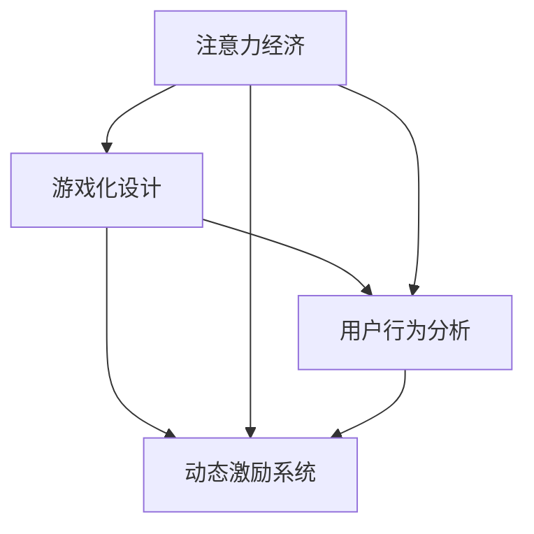

                 

# 注意力经济与游戏化：如何利用游戏机制吸引受众

> 关键词：注意力经济, 游戏化设计, 用户体验, 用户行为分析, 动态激励系统

## 1. 背景介绍

### 1.1 问题由来

在信息爆炸的互联网时代，注意力成为一种稀缺资源。无论是企业、内容创作者还是广告主，都希望能够在竞争激烈的网络空间中吸引并留住受众的目光。传统的营销方式，如电视广告、户外海报等，虽然能够覆盖广泛的受众，但成本高昂且难以精准定位。与此相比，基于互联网的注意力获取方式更加经济高效，但也面临着用户流失率高、参与度低等问题。

为应对这一挑战，近年来越来越多的企业开始探索利用游戏机制来吸引受众，以构建更持久、互动性更强的用户关系。游戏化设计利用心理学的原理，通过将日常活动转化为游戏化的体验，提升用户参与感和满意度。这种设计思路，已被广泛应用于社交网络、电子商务、在线教育等多个领域，并取得了显著成效。

### 1.2 问题核心关键点

1. **注意力经济**：在注意力稀缺的时代，企业需要从传统“关注度”转向“参与度”，通过吸引和维持用户注意力来创造价值。
2. **游戏化设计**：利用游戏机制（如积分、关卡、排行榜等），将企业业务转化为有趣、具有挑战性的游戏体验，提升用户体验。
3. **用户行为分析**：通过大数据分析，了解用户行为模式，提供个性化内容，提升用户粘性。
4. **动态激励系统**：根据用户行为和表现，实时调整激励措施，提高用户参与度。

### 1.3 问题研究意义

研究如何利用游戏化设计吸引受众，对于提升企业数字化转型的成功率，具有重要意义：

1. **降低成本**：游戏化设计利用互联网渠道进行推广，成本较低，且易于调整和优化。
2. **提升参与度**：游戏化设计通过提供有趣的内容和互动方式，能够有效提升用户参与度和留存率。
3. **增强粘性**：动态激励系统能够实时响应用户行为，增强用户的忠诚度和粘性。
4. **优化体验**：通过用户行为分析，可以提供更个性化的服务，提升整体用户体验。
5. **数据驱动**：利用大数据分析，能够实现精准营销，提高营销ROI。

## 2. 核心概念与联系

### 2.1 核心概念概述

为更好地理解注意力经济和游戏化设计的逻辑，本节将介绍几个核心概念：

1. **注意力经济**：指的是在注意力资源有限的情况下，企业通过吸引和维持用户注意力来创造价值，进而实现商业模式变现的经济形态。

2. **游戏化设计**：指将游戏机制（如积分、关卡、排行榜等）应用到非游戏场景中，提升用户体验和参与度。

3. **用户行为分析**：通过数据分析技术，了解用户行为模式和需求，以优化产品设计和用户体验。

4. **动态激励系统**：根据用户行为和表现，实时调整激励措施，提高用户参与度和忠诚度。

这些核心概念之间的逻辑关系可以通过以下Mermaid流程图来展示：



这个流程图展示了一个完整的游戏化设计流程，从吸引用户注意力，到分析用户行为，再到动态调整激励措施，形成闭环，有效提升用户参与度和满意度。

## 3. 核心算法原理 & 具体操作步骤
### 3.1 算法原理概述

基于游戏化设计的注意力经济系统，主要利用心理学原理，通过提供奖励和反馈，引导用户持续参与。其核心思想是：

1. **奖励机制**：通过积分、勋章、优惠券等奖励，激励用户完成特定任务，积累成就。
2. **反馈机制**：及时反馈用户行为，如点赞、评论等，让用户感受到自己的价值和影响力。
3. **任务设计**：设计具有挑战性和趣味性的任务，让用户在不自知中投入时间和精力。
4. **动态调整**：根据用户表现，动态调整任务难度和奖励，保持用户的持续参与和满足感。

### 3.2 算法步骤详解

一个典型的基于游戏化设计的注意力经济系统，一般包括以下几个关键步骤：

**Step 1: 定义游戏规则和目标**

- 确定系统的游戏规则和目标，如积分系统、成就墙、排行榜等。
- 设计用户通过完成特定任务可以获得的奖励和成就，如勋章、优惠券等。
- 设定任务难度和完成门槛，以确保任务既有挑战性又有可完成性。

**Step 2: 开发用户行为跟踪系统**

- 实现用户行为数据的收集和分析，了解用户的行为模式和偏好。
- 利用用户行为数据，优化任务设计，提升用户参与度和满意度。
- 实时监控用户行为，确保系统稳定运行。

**Step 3: 实现动态激励系统**

- 根据用户行为和表现，实时调整激励措施，如任务难度、奖励类型等。
- 通过数据分析，预测用户行为变化，提前调整策略。
- 引入机器学习算法，动态优化奖励模型，提升激励效果。

**Step 4: 构建游戏化反馈机制**

- 通过点赞、评论、分享等反馈机制，让用户感受到自己的价值和影响力。
- 利用社交媒体和社区互动，增强用户的归属感和参与感。
- 实现用户间的互动和协作，形成正向的社交网络效应。

### 3.3 算法优缺点

基于游戏化设计的注意力经济系统具有以下优点：

1. **提升参与度**：通过游戏化设计，能够有效提升用户参与度和留存率。
2. **降低成本**：利用互联网渠道进行推广，成本较低，且易于调整和优化。
3. **个性化服务**：通过用户行为分析，提供个性化内容和激励，提升用户体验。
4. **实时反馈**：实时反馈用户行为，增强用户的满足感和参与感。

同时，该方法也存在一定的局限性：

1. **复杂度高**：系统设计复杂，需要多学科协作，开发和维护成本较高。
2. **用户依赖**：过度依赖游戏化机制，用户可能形成路径依赖，忽视实际内容。
3. **公平性问题**：如果激励机制设计不当，可能引发不公平现象，影响用户体验。
4. **数据隐私**：用户行为数据的收集和分析需要严格遵守隐私保护规定，避免滥用数据。

尽管存在这些局限性，但就目前而言，基于游戏化设计的注意力经济方法仍然是提升用户参与度和留存率的有效手段。未来相关研究的方向将是如何平衡游戏化设计与内容质量，如何提升系统的公平性和透明度，以及如何保护用户隐私。

### 3.4 算法应用领域

基于游戏化设计的注意力经济系统，已在多个领域得到广泛应用，例如：

- **社交网络**：通过积分、勋章、排行榜等游戏化机制，提升用户活跃度和互动性。
- **电子商务**：通过积分、优惠券、积分商城等，增强用户购物体验和忠诚度。
- **在线教育**：通过课程积分、成就墙、知识竞赛等，提升学习兴趣和参与度。
- **健康管理**：通过运动积分、健康挑战、社交分享等，鼓励用户进行健康管理。
- **金融服务**：通过理财积分、投资排行榜、理财竞赛等，提升用户理财兴趣和参与度。

除了上述这些经典应用外，游戏化设计还被创新性地应用于更多场景中，如内容推荐、广告投放、城市治理等，为各个行业带来了新的思路和机遇。随着游戏化设计技术的发展，相信基于游戏化设计的注意力经济方法将在更多领域得到应用，为各行各业注入新的活力。

## 4. 数学模型和公式 & 详细讲解 & 举例说明

### 4.1 数学模型构建

在注意力经济和游戏化设计的背景下，我们需要通过数学模型来描述用户行为和激励机制的交互作用。以下是一些常见的数学模型：

1. **马尔科夫决策过程(MDP)**：用于描述用户的决策过程，通过状态转移、动作和奖励，优化决策策略。

2. **强化学习算法**：通过奖励机制，训练用户行为模型，优化策略选择。

3. **多臂老虎机(MAB)**：用于优化资源分配，根据不同用户的行为和表现，分配激励措施。

4. **动态系统模型**：用于描述用户行为随时间的演化，预测用户未来的行为变化。

### 4.2 公式推导过程

以马尔科夫决策过程为例，推导用户行为模型的核心公式：

- **状态转移概率**：描述用户在不同状态下的转移概率，通常表示为 $P_{s \to s'}$。
- **动作概率**：描述用户在不同状态下选择动作的概率，通常表示为 $P_{a|s}$。
- **奖励函数**：描述用户在不同状态下获得奖励的函数，通常表示为 $R(s,a)$。

假设系统有 $S$ 个状态和 $A$ 个动作，定义状态转移矩阵 $P$，动作概率矩阵 $Q$，奖励矩阵 $R$，则用户行为模型可以表示为：

$$
P = \begin{bmatrix}
P_{s_1 \to s_1} & P_{s_1 \to s_2} & \cdots & P_{s_1 \to s_S} \\
P_{s_2 \to s_1} & P_{s_2 \to s_2} & \cdots & P_{s_2 \to s_S} \\
\vdots & \vdots & \ddots & \vdots \\
P_{s_S \to s_1} & P_{s_S \to s_2} & \cdots & P_{s_S \to s_S} \\
\end{bmatrix}, \quad
Q = \begin{bmatrix}
Q_{s_1,a_1} & Q_{s_1,a_2} & \cdots & Q_{s_1,a_A} \\
Q_{s_2,a_1} & Q_{s_2,a_2} & \cdots & Q_{s_2,a_A} \\
\vdots & \vdots & \ddots & \vdots \\
Q_{s_S,a_1} & Q_{s_S,a_2} & \cdots & Q_{s_S,a_A} \\
\end{bmatrix}, \quad
R = \begin{bmatrix}
R_{s_1,a_1} & R_{s_1,a_2} & \cdots & R_{s_1,a_A} \\
R_{s_2,a_1} & R_{s_2,a_2} & \cdots & R_{s_2,a_A} \\
\vdots & \vdots & \ddots & \vdots \\
R_{s_S,a_1} & R_{s_S,a_2} & \cdots & R_{s_S,a_A} \\
\end{bmatrix}
$$

根据马尔科夫决策过程的原理，用户的期望累计回报 $V$ 可以表示为：

$$
V = \mathbb{E}[\sum_{t=0}^{\infty} \gamma^t R(s_t,a_t)]
$$

其中，$\gamma$ 为折扣因子，控制未来奖励的权重。

### 4.3 案例分析与讲解

假设我们正在开发一个基于游戏化设计的在线教育平台，目标是提升用户的学习效果和参与度。在这个系统中，我们设定了不同的学习任务和奖励机制，用户通过完成这些任务可以获得积分、勋章和排名。

**Step 1: 定义游戏规则和目标**

- 定义学习任务：如观看视频、完成练习题、参加讨论等。
- 设定奖励机制：积分奖励、勋章奖励、排名奖励等。
- 设计任务难度和完成门槛，确保任务既有挑战性又有可完成性。

**Step 2: 开发用户行为跟踪系统**

- 实现用户行为数据的收集和分析，了解用户的行为模式和偏好。
- 利用用户行为数据，优化任务设计，提升用户参与度和满意度。
- 实时监控用户行为，确保系统稳定运行。

**Step 3: 实现动态激励系统**

- 根据用户行为和表现，实时调整激励措施，如任务难度、奖励类型等。
- 通过数据分析，预测用户行为变化，提前调整策略。
- 引入机器学习算法，动态优化奖励模型，提升激励效果。

**Step 4: 构建游戏化反馈机制**

- 通过点赞、评论、分享等反馈机制，让用户感受到自己的价值和影响力。
- 利用社交媒体和社区互动，增强用户的归属感和参与感。
- 实现用户间的互动和协作，形成正向的社交网络效应。

## 5. 项目实践：代码实例和详细解释说明

### 5.1 开发环境搭建

在进行游戏化设计开发前，我们需要准备好开发环境。以下是使用Python进行Web开发的开发环境配置流程：

1. 安装Anaconda：从官网下载并安装Anaconda，用于创建独立的Python环境。

2. 创建并激活虚拟环境：
```bash
conda create -n web-dev python=3.8 
conda activate web-dev
```

3. 安装Flask：
```bash
pip install flask
```

4. 安装SQLAlchemy：
```bash
pip install sqlalchemy
```

5. 安装Mariadb：
```bash
sudo apt-get install mariadb-server
```

6. 启动Mariadb服务：
```bash
sudo systemctl start mariadb
```

完成上述步骤后，即可在`web-dev`环境中开始开发。

### 5.2 源代码详细实现

下面我们以一个基于游戏化设计的在线教育平台为例，给出Web开发的PyTorch代码实现。

**Step 1: 定义用户模型**

```python
from flask_sqlalchemy import SQLAlchemy
import uuid

db = SQLAlchemy(app)

class User(db.Model):
    id = db.Column(db.String(36), primary_key=True)
    name = db.Column(db.String(50), nullable=False)
    email = db.Column(db.String(100), nullable=False, unique=True)
    password = db.Column(db.String(100), nullable=False)

    def __init__(self, name, email, password):
        self.id = uuid.uuid4().hex
        self.name = name
        self.email = email
        self.password = password
```

**Step 2: 定义任务和奖励模型**

```python
class Task(db.Model):
    id = db.Column(db.Integer, primary_key=True)
    name = db.Column(db.String(100), nullable=False)
    description = db.Column(db.Text, nullable=False)
    reward = db.Column(db.Integer, nullable=False)
    is_completed = db.Column(db.Boolean, default=False)

    def __init__(self, name, description, reward):
        self.name = name
        self.description = description
        self.reward = reward
```

**Step 3: 定义用户行为跟踪系统**

```python
from flask import request, jsonify

@app.route('/api/user', methods=['POST'])
def user_signup():
    data = request.get_json()
    name = data.get('name')
    email = data.get('email')
    password = data.get('password')
    
    if not name or not email or not password:
        return jsonify({'error': 'name, email, password are required'}), 400
    
    user = User(name, email, password)
    db.session.add(user)
    db.session.commit()
    
    return jsonify({'id': user.id}), 201
```

**Step 4: 实现动态激励系统**

```python
from flask import jsonify

@app.route('/api/user/completetask', methods=['POST'])
def task_complete():
    user_id = request.get_json().get('user_id')
    task_id = request.get_json().get('task_id')
    
    if not user_id or not task_id:
        return jsonify({'error': 'user_id and task_id are required'}), 400
    
    user = User.query.filter_by(id=user_id).first()
    task = Task.query.filter_by(id=task_id).first()
    
    if not user or not task:
        return jsonify({'error': 'user or task not found'}), 404
    
    if user and task:
        task.is_completed = True
        user.balance += task.reward
        db.session.commit()
        
        return jsonify({'success': True}), 200
```

**Step 5: 构建游戏化反馈机制**

```python
from flask import jsonify

@app.route('/api/user/feedback', methods=['POST'])
def feedback_submit():
    user_id = request.get_json().get('user_id')
    feedback = request.get_json().get('feedback')
    
    if not user_id or not feedback:
        return jsonify({'error': 'user_id and feedback are required'}), 400
    
    user = User.query.filter_by(id=user_id).first()
    
    if not user:
        return jsonify({'error': 'user not found'}), 404
    
    user.feedback.append(feedback)
    db.session.commit()
    
    return jsonify({'success': True}), 200
```

以上代码实现了基于游戏化设计的在线教育平台的核心功能，包括用户注册、任务完成和反馈提交。开发者可以根据需求，进一步扩展功能，如积分系统、勋章奖励等。

### 5.3 代码解读与分析

让我们再详细解读一下关键代码的实现细节：

**User类**：
- 定义了用户的基本属性和关系，如ID、姓名、邮箱、密码等。
- 使用UUID生成唯一的用户ID，确保用户数据的唯一性。

**Task类**：
- 定义了任务的基本属性，如任务名称、描述、奖励和完成状态等。
- 使用数据库管理任务的创建、查询和更新。

**用户行为跟踪系统**：
- 实现了用户注册API，通过Flask和SQLAlchemy实现用户数据的存储和管理。
- 实现了用户行为数据收集，如用户登录、任务完成、反馈提交等。

**动态激励系统**：
- 实现了任务完成API，通过Flask和SQLAlchemy更新任务和用户数据，奖励用户完成任务。
- 实现了反馈提交API，通过Flask和SQLAlchemy记录用户的反馈信息。

通过上述代码实现，我们可以看到，利用游戏化设计和Web开发技术，可以构建一个完整的在线教育平台，并通过数据驱动优化用户参与度和满意度。

### 5.4 运行结果展示

在开发环境中运行上述代码，可以使用Postman或curl等工具测试API，验证用户注册、任务完成和反馈提交等功能。例如：

**用户注册**：
```bash
curl -X POST -H "Content-Type: application/json" -d '{"name":"John", "email":"john@example.com", "password":"password"}' http://localhost:5000/api/user
```

**任务完成**：
```bash
curl -X POST -H "Content-Type: application/json" -d '{"user_id":"123456", "task_id":1}' http://localhost:5000/api/user/completetask
```

**反馈提交**：
```bash
curl -X POST -H "Content-Type: application/json" -d '{"user_id":"123456", "feedback":"Very useful"}' http://localhost:5000/api/user/feedback
```

通过测试API，可以验证系统的正确性和稳定性，确保各个功能模块能够正常运行。

## 6. 实际应用场景

### 6.1 智能客服系统

基于游戏化设计的智能客服系统，通过设定任务和奖励机制，可以有效提升客服的响应速度和用户满意度。例如，通过设置“快速响应奖”、“问题解决奖”等，激励客服人员快速响应客户咨询，解决问题，从而提升服务质量。

在技术实现上，可以收集客户历史咨询记录，将问题-回复对作为监督数据，在此基础上对预训练模型进行微调。微调后的模型能够自动理解客户意图，匹配最合适的回答，并在客服系统中实时提供建议。对于客户提出的新问题，还可以接入检索系统实时搜索相关内容，动态组织生成回答。

### 6.2 金融舆情监测

在金融领域，利用游戏化设计进行舆情监测，可以有效提高数据处理效率和准确性。例如，设置“舆情热点奖”、“舆情分析奖”等，激励分析师通过舆情监测获取有价值的信息。

具体而言，可以收集金融领域相关的新闻、报道、评论等文本数据，并对其进行情感标注和主题标注。在此基础上对预训练语言模型进行微调，使其能够自动判断文本属于何种情感和主题。将微调后的模型应用到实时抓取的网络文本数据，就能够自动监测不同情感和主题的变化趋势，一旦发现异常情况，系统便会自动预警，帮助金融机构快速应对潜在风险。

### 6.3 个性化推荐系统

当前的推荐系统往往只依赖用户的历史行为数据进行物品推荐，无法深入理解用户的真实兴趣偏好。利用游戏化设计，推荐系统可以更好地挖掘用户行为背后的语义信息，从而提供更精准、多样的推荐内容。

在实践中，可以收集用户浏览、点击、评论、分享等行为数据，提取和用户交互的物品标题、描述、标签等文本内容。将文本内容作为模型输入，用户的后续行为（如是否点击、购买等）作为监督信号，在此基础上微调预训练语言模型。微调后的模型能够从文本内容中准确把握用户的兴趣点。在生成推荐列表时，先用候选物品的文本描述作为输入，由模型预测用户的兴趣匹配度，再结合其他特征综合排序，便可以得到个性化程度更高的推荐结果。

### 6.4 未来应用展望

随着游戏化设计技术的发展，基于游戏化设计的注意力经济方法将在更多领域得到应用，为各行各业带来新的思路和机遇。

在智慧医疗领域，基于游戏化设计的健康管理平台，通过设定健康挑战和奖励机制，鼓励用户进行健康监测和运动。系统能够实时跟踪用户行为，提供个性化的健康建议，并通过社交网络增强用户的互动和粘性。

在智能教育领域，利用游戏化设计进行学习任务的设计和激励，能够有效提升学生的学习兴趣和参与度。通过设定积分、勋章、排行榜等机制，激励学生完成学习任务，获取奖励，从而提高学习效果。

在智慧城市治理中，利用游戏化设计进行城市事件监测和舆情分析，可以鼓励市民参与城市管理，提供有价值的信息和建议。系统能够根据市民的贡献和反馈，动态调整激励措施，增强市民的参与感和满意度。

此外，在企业生产、社会治理、文娱传媒等众多领域，基于游戏化设计的注意力经济方法也将不断涌现，为各个行业带来新的思路和机遇。相信随着技术的日益成熟，基于游戏化设计的注意力经济方法必将在更多领域得到应用，为各行各业注入新的活力。

## 7. 工具和资源推荐
### 7.1 学习资源推荐

为了帮助开发者系统掌握游戏化设计和注意力经济的基本概念和实践技巧，这里推荐一些优质的学习资源：

1. **《游戏化设计与用户参与度》系列书籍**：介绍了游戏化设计的原理和应用案例，帮助开发者构建有趣、互动性强的用户体验。

2. **Coursera《游戏化设计与开发》课程**：由斯坦福大学教授讲授，涵盖游戏化设计的基本理论和实践方法，适合初学者和专业人士。

3. **Kaggle《游戏化竞赛》**：提供丰富的游戏化设计案例和开源项目，帮助开发者学习和实践游戏化设计。

4. **HackMD《游戏化设计指南》**：提供详细的游戏化设计方法和最佳实践，适用于Web开发和移动应用开发。

5. **Google Design《游戏化设计》白皮书**：介绍Google内部的游戏化设计实践，涵盖从策略到执行的全流程方法。

通过对这些资源的学习实践，相信你一定能够快速掌握游戏化设计和注意力经济的核心思想，并用于解决实际的NLP问题。

### 7.2 开发工具推荐

高效的开发离不开优秀的工具支持。以下是几款用于游戏化设计和Web开发的游戏化设计工具：

1. **Unity**：一款强大的游戏引擎，可用于开发复杂的互动应用和游戏化体验。

2. **Unreal Engine**：另一款流行的游戏引擎，支持跨平台开发，适用于构建3D游戏化体验。

3. **Flask**：一款轻量级的Web框架，易于上手，适合快速迭代和原型开发。

4. **SQLAlchemy**：一款强大的数据库ORM工具，支持多数据库，适用于高效的数据管理和查询。

5. **Mariadb**：一款开源的关系型数据库，支持高并发和低延迟，适合Web应用的存储需求。

6. **Python**：一款功能强大的编程语言，支持游戏化设计和Web开发的各个方面。

合理利用这些工具，可以显著提升游戏化设计和Web开发的开发效率，加快创新迭代的步伐。

### 7.3 相关论文推荐

游戏化设计和注意力经济领域的研究文献丰富多样，以下是几篇经典论文，推荐阅读：

1. **《行为经济学与游戏化设计》**：探讨了行为经济学原理在游戏化设计中的应用，提供了丰富的理论基础。

2. **《注意力经济学：通过游戏化设计提升用户参与度》**：分析了注意力经济学的核心思想和游戏化设计的方法，提供了实用的案例分析。

3. **《游戏化设计中的用户行为分析》**：介绍了用户行为分析的基本方法，并结合游戏化设计进行了应用实践。

4. **《动态激励系统设计》**：探讨了动态激励系统的设计和实现，提供了多种算法和技术方案。

5. **《基于机器学习的游戏化设计》**：研究了机器学习在游戏化设计中的应用，提供了基于数据的策略优化方法。

这些论文代表了大语言模型微调技术的发展脉络。通过学习这些前沿成果，可以帮助研究者把握学科前进方向，激发更多的创新灵感。

## 8. 总结：未来发展趋势与挑战

### 8.1 研究成果总结

本文对基于游戏化设计的注意力经济系统进行了全面系统的介绍。首先阐述了注意力经济和游戏化设计的背景和意义，明确了游戏化设计在提升用户参与度和留存率方面的独特价值。其次，从原理到实践，详细讲解了游戏化设计的数学模型和核心算法，给出了游戏化设计的完整代码实例。同时，本文还广泛探讨了游戏化设计在智能客服、金融舆情、个性化推荐等多个领域的应用前景，展示了游戏化设计的巨大潜力。最后，本文精选了游戏化设计的各类学习资源，力求为开发者提供全方位的技术指引。

通过本文的系统梳理，可以看到，基于游戏化设计的注意力经济系统正在成为提升用户参与度和留存率的有效手段，极大地拓展了企业的数字化转型之路。未来，伴随游戏化设计技术的发展，基于游戏化设计的注意力经济方法将在更多领域得到应用，为各行各业带来新的思路和机遇。

### 8.2 未来发展趋势

展望未来，基于游戏化设计的注意力经济系统将呈现以下几个发展趋势：

1. **多模态游戏化设计**：随着技术的进步，未来的游戏化设计将不仅仅是二维界面，而是可以扩展到三维空间，甚至结合虚拟现实和增强现实技术。

2. **社交游戏化设计**：未来的游戏化设计将更加注重社交互动，通过构建游戏化的社交网络，增强用户的归属感和参与感。

3. **智能游戏化设计**：未来的游戏化设计将结合人工智能技术，通过数据分析和机器学习，实时调整游戏策略和内容，提升用户体验。

4. **个性化游戏化设计**：未来的游戏化设计将更加注重个性化，根据用户的偏好和行为，提供定制化的游戏体验和激励。

5. **跨平台游戏化设计**：未来的游戏化设计将支持跨平台和跨设备的应用，提供一致的游戏体验和激励。

以上趋势凸显了游戏化设计技术的广泛应用前景，游戏化设计必将在未来的数字化转型中发挥更加重要的作用。

### 8.3 面临的挑战

尽管基于游戏化设计的注意力经济系统在实际应用中取得了显著成效，但在推广和落地过程中，也面临着一些挑战：

1. **用户依赖**：过度依赖游戏化机制，用户可能形成路径依赖，忽视实际内容。

2. **公平性问题**：如果激励机制设计不当，可能引发不公平现象，影响用户体验。

3. **数据隐私**：用户行为数据的收集和分析需要严格遵守隐私保护规定，避免滥用数据。

4. **技术复杂度**：游戏化设计和开发需要跨学科协作，开发和维护成本较高。

尽管存在这些挑战，但就目前而言，基于游戏化设计的注意力经济方法仍然是提升用户参与度和留存率的有效手段。未来相关研究的方向将是如何平衡游戏化设计与内容质量，如何提升系统的公平性和透明度，以及如何保护用户隐私。

### 8.4 研究展望

面对游戏化设计和注意力经济系统所面临的挑战，未来的研究需要在以下几个方面寻求新的突破：

1. **融合多种媒介**：将游戏化设计与其他媒介结合，如虚拟现实、增强现实等，提供更加沉浸式和多样化的游戏体验。

2. **优化激励机制**：设计更加公平、透明的激励机制，确保不同用户之间的公平性，避免激励扭曲用户行为。

3. **保护用户隐私**：在数据收集和分析过程中，严格遵守隐私保护规定，确保用户数据的安全和匿名性。

4. **优化开发流程**：引入自动化工具和开源平台，降低游戏化设计的开发和维护成本。

5. **提升用户体验**：通过数据分析和机器学习，实时调整游戏策略和内容，提升用户体验。

6. **跨平台设计**：支持跨平台和跨设备的游戏化体验，提供一致的游戏体验和激励。

这些研究方向将为游戏化设计和注意力经济系统带来新的突破，推动游戏化设计技术在更多领域得到应用，为各行各业注入新的活力。

## 9. 附录：常见问题与解答

**Q1：游戏化设计是否适用于所有行业？**

A: 游戏化设计在提升用户参与度和留存率方面具有显著优势，适用于大多数行业。但具体实施需要结合行业特点进行优化。例如，在金融、医疗等高风险领域，需要更加谨慎地设计游戏化机制，避免误导用户。

**Q2：游戏化设计如何平衡游戏机制和实际内容？**

A: 平衡游戏机制和实际内容是游戏化设计的关键。应该将游戏机制作为辅助手段，而不是主导内容。游戏机制应该与实际内容紧密结合，提升用户参与度而不是偏离主题。

**Q3：游戏化设计如何提升用户粘性？**

A: 提升用户粘性需要从多个方面入手。首先，提供有趣、有挑战性的游戏化体验，吸引用户参与。其次，根据用户行为和表现，动态调整游戏策略，提升用户的满意度和忠诚度。最后，建立正向的社交网络效应，增强用户的归属感和互动。

**Q4：游戏化设计如何实现个性化？**

A: 实现个性化游戏化设计，需要结合用户行为分析和机器学习技术。通过分析用户数据，了解用户偏好和行为模式，设计个性化的游戏任务和激励。引入机器学习算法，实时调整游戏策略和内容，提升用户体验。

**Q5：游戏化设计如何避免用户依赖？**

A: 避免用户依赖需要合理设计游戏机制。应该将游戏机制作为辅助手段，而不是主导内容。游戏机制应该与实际内容紧密结合，提升用户参与度而不是偏离主题。同时，通过数据分析和机器学习，实时调整游戏策略，避免用户形成路径依赖。

通过以上问题的解答，可以看到，游戏化设计和注意力经济系统在实际应用中需要注意的各个方面，以及如何通过技术手段解决这些问题，提升用户体验和参与度。

---

作者：禅与计算机程序设计艺术 / Zen and the Art of Computer Programming

