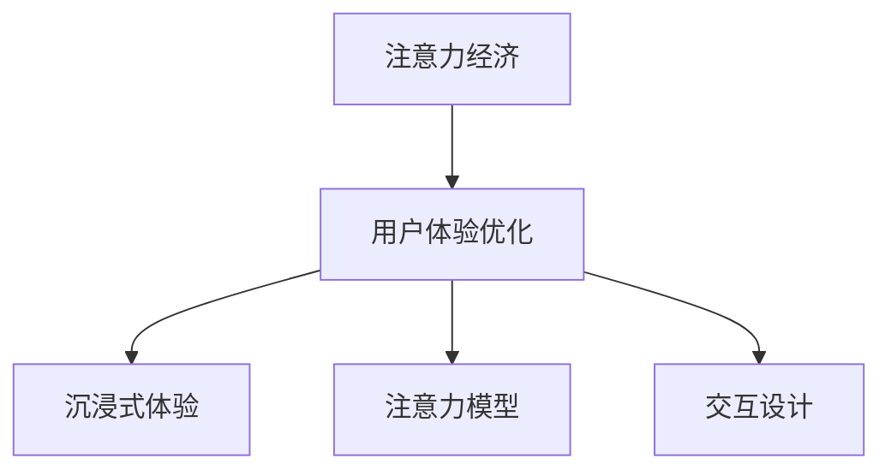

                 

# 注意力经济与用户体验优化策略与技术：创建令人沉浸的产品

## 1. 背景介绍

在数字化时代，用户的时间成为了一种宝贵的资源。随着信息爆炸和互联网的普及，用户的注意力成为了商家和内容创作者争相争夺的资源。为了吸引和保持用户的注意力，商家需要不断优化用户体验，提供有价值的内容和服务。这种经济模式被称为“注意力经济”。

本文将探讨注意力经济的背景及其对用户体验优化策略的影响，并通过具体的技术手段，帮助商家和内容创作者创建令人沉浸的产品。通过深入分析注意力经济的本质、用户体验优化的原则，以及应用这些原则的实际技术，本文将为读者提供一套完整的解决方案。

## 2. 核心概念与联系

### 2.1 核心概念概述

- **注意力经济**：指在数字化时代，商家通过吸引和保持用户注意力，获取商业价值的一种经济模式。
- **用户体验优化**：指通过改善产品设计、提高服务质量等手段，提升用户满意度和忠诚度的过程。
- **沉浸式体验**：指通过提供沉浸感强烈的内容和服务，使用户完全沉浸在产品中，达到忘我状态。
- **注意力模型**：指描述注意力如何被分配和分配效果的数学模型。
- **交互设计**：指设计用户与产品之间的互动方式，提升用户互动的流畅性和满足感。

### 2.2 核心概念原理和架构的 Mermaid 流程图



这个流程图展示了注意力经济与用户体验优化之间的联系，以及用户体验优化如何通过沉浸式体验、注意力模型和交互设计来实现。

## 3. 核心算法原理 & 具体操作步骤

### 3.1 算法原理概述

注意力经济的核心在于吸引和保持用户的注意力。用户体验优化则通过提供高质量的产品和服务，提升用户对产品的满意度。沉浸式体验通过创造引人入胜的内容和服务，使用户完全沉浸在产品中。注意力模型和交互设计则是实现这些目标的技术手段。

具体来说，用户体验优化和注意力经济的关系可以通过以下步骤来理解：

1. **数据收集**：通过用户行为数据收集，了解用户的偏好和需求。
2. **用户画像构建**：根据收集的数据，构建用户的画像，以便更好地理解用户。
3. **内容设计**：根据用户画像，设计有吸引力的内容和服务。
4. **交互设计**：设计用户与产品之间的互动方式，提升用户体验。
5. **注意力模型应用**：通过注意力模型，优化内容的呈现方式，使用户更容易集中注意力。
6. **用户体验优化**：根据用户的反馈，不断优化产品和服务，提升用户体验。

### 3.2 算法步骤详解

#### 3.2.1 数据收集

数据收集是用户体验优化的第一步。常用的数据收集方法包括：

- **日志分析**：通过分析用户的日志，了解用户在产品中的行为。
- **问卷调查**：通过问卷调查，直接获取用户对产品的评价和反馈。
- **A/B测试**：通过对比不同的产品版本，了解不同设计对用户行为的影响。

#### 3.2.2 用户画像构建

用户画像的构建是基于收集到的数据，对用户进行分类和描述的过程。常用的用户画像构建方法包括：

- **聚类分析**：通过聚类算法，将用户分为不同的群体，以便更好地理解每个群体的特点。
- **标签标注**：为每个用户打上标签，描述其特征和行为。
- **细分市场**：根据用户画像，将市场细分为不同的细分市场，以便更好地满足不同用户的需求。

#### 3.2.3 内容设计

内容设计是用户体验优化的重要环节。设计有吸引力的内容可以提升用户对产品的粘性。常用的内容设计方法包括：

- **多媒体融合**：通过结合文本、图片、视频等不同的媒体形式，提升内容的吸引力。
- **个性化推荐**：根据用户画像，推荐用户感兴趣的内容。
- **互动元素**：通过互动元素，如问答、小游戏等，提升用户的参与度。

#### 3.2.4 交互设计

交互设计是用户体验优化的关键环节。良好的交互设计可以提升用户的使用体验。常用的交互设计方法包括：

- **用户流程图**：通过绘制用户流程图，了解用户在使用产品时的路径和流程。
- **原型设计**：通过设计原型，展示产品的功能和互动方式。
- **可用性测试**：通过可用性测试，发现和解决产品的可用性问题。

#### 3.2.5 注意力模型应用

注意力模型是用户体验优化的重要技术手段。通过注意力模型，可以优化内容的呈现方式，使用户更容易集中注意力。常用的注意力模型包括：

- **热力图分析**：通过热力图分析，了解用户在产品中的关注点。
- **注意力权重计算**：通过计算不同内容对用户的注意力权重，优化内容的呈现顺序。
- **动态内容展示**：通过动态展示，根据用户的注意力变化，调整内容的展示方式。

#### 3.2.6 用户体验优化

用户体验优化是一个持续迭代的过程。通过不断收集用户反馈，优化产品和服务，提升用户体验。常用的用户体验优化方法包括：

- **反馈循环**：通过收集用户反馈，不断改进产品和服务。
- **迭代改进**：通过小步快跑，快速迭代和优化产品。
- **用户满意度调查**：通过用户满意度调查，了解用户对产品的满意度。

### 3.3 算法优缺点

#### 3.3.1 优点

1. **提升用户粘性**：通过提供高质量的内容和服务，提升用户对产品的粘性。
2. **提高用户满意度**：通过优化用户体验，提升用户对产品的满意度。
3. **增加用户参与度**：通过互动元素和个性化推荐，提升用户的参与度。
4. **优化资源利用**：通过注意力模型，优化内容的呈现方式，提升资源的利用效率。

#### 3.3.2 缺点

1. **数据收集成本高**：数据收集需要投入大量的人力和物力，成本较高。
2. **用户隐私保护**：在收集用户数据时，需要保护用户的隐私，避免数据泄露。
3. **内容设计复杂**：设计有吸引力的内容需要创意和经验，难度较大。
4. **技术实现复杂**：注意力模型和交互设计的技术实现较为复杂，需要专业知识。

### 3.4 算法应用领域

用户体验优化和注意力经济的应用领域非常广泛，主要包括以下几个方面：

1. **电子商务**：通过优化用户体验，提升用户对电商平台的满意度和粘性。
2. **内容平台**：通过提供有吸引力的内容和个性化推荐，提升用户的使用体验。
3. **移动应用**：通过优化移动应用的用户体验，提升用户的参与度和留存率。
4. **社交媒体**：通过优化社交媒体的用户体验，提升用户的活跃度和粘性。
5. **教育培训**：通过优化教育培训平台的用户体验，提升用户的参与度和满意度。

## 4. 数学模型和公式 & 详细讲解 & 举例说明

### 4.1 数学模型构建

用户体验优化的数学模型包括用户行为模型、用户画像模型和内容推荐模型等。这些模型可以帮助商家和内容创作者更好地理解和优化用户体验。

#### 4.1.1 用户行为模型

用户行为模型描述了用户在使用产品时的行为规律。常用的用户行为模型包括：

- **用户流失模型**：通过分析用户流失数据，预测用户流失的概率。
- **用户留存模型**：通过分析用户留存数据，预测用户留存的时间。
- **用户路径模型**：通过分析用户在产品中的路径，了解用户的互动方式。

#### 4.1.2 用户画像模型

用户画像模型描述了用户的特征和行为。常用的用户画像模型包括：

- **用户分群模型**：通过聚类算法，将用户分为不同的群体。
- **标签模型**：为每个用户打上标签，描述其特征和行为。
- **细分市场模型**：根据用户画像，将市场细分为不同的细分市场。

#### 4.1.3 内容推荐模型

内容推荐模型描述了如何为用户推荐有吸引力的内容。常用的内容推荐模型包括：

- **协同过滤模型**：通过分析用户行为数据，推荐用户感兴趣的内容。
- **基于内容的推荐模型**：通过分析内容的特征，推荐与用户兴趣相似的内容。
- **混合推荐模型**：结合多种推荐算法，提升推荐的准确性和多样性。

### 4.2 公式推导过程

#### 4.2.1 用户流失模型

用户流失模型可以通过以下公式进行计算：

$$
P(\text{流失}) = \frac{P(\text{当前流失})}{P(\text{当前使用})}
$$

其中，$P(\text{流失})$ 表示用户流失的概率，$P(\text{当前流失})$ 表示当前流失用户的数量，$P(\text{当前使用})$ 表示当前使用产品的用户数量。

#### 4.2.2 用户留存模型

用户留存模型可以通过以下公式进行计算：

$$
P(\text{留存}) = \frac{P(\text{当前留存})}{P(\text{初始使用})}
$$

其中，$P(\text{留存})$ 表示用户留存的时间，$P(\text{当前留存})$ 表示当前留存用户的数量，$P(\text{初始使用})$ 表示初始使用产品的用户数量。

#### 4.2.3 内容推荐模型

内容推荐模型可以通过以下公式进行计算：

$$
R = \sum_{i=1}^n \alpha_i \cdot F_i
$$

其中，$R$ 表示推荐的内容，$n$ 表示内容的数量，$\alpha_i$ 表示内容的权重，$F_i$ 表示内容的特征向量。

### 4.3 案例分析与讲解

#### 4.3.1 用户流失模型案例

某电商平台的流失用户数量为100，当前使用产品的用户数量为1000。根据用户流失模型，用户流失的概率为：

$$
P(\text{流失}) = \frac{100}{1000} = 0.1
$$

#### 4.3.2 用户留存模型案例

某社交媒体平台的留存用户数量为200，初始使用产品的用户数量为500。根据用户留存模型，用户留存的时间为：

$$
P(\text{留存}) = \frac{200}{500} = 0.4
$$

#### 4.3.3 内容推荐模型案例

某视频平台的内容推荐模型为：

- 协同过滤模型：权重为0.3
- 基于内容的推荐模型：权重为0.4
- 混合推荐模型：权重为0.3

推荐内容为：

$$
R = 0.3 \cdot F_1 + 0.4 \cdot F_2 + 0.3 \cdot F_3
$$

## 5. 项目实践：代码实例和详细解释说明

### 5.1 开发环境搭建

用户体验优化的开发环境需要包括以下组件：

- **数据收集工具**：如Google Analytics、Mixpanel等。
- **数据分析工具**：如Python、R、Tableau等。
- **用户画像工具**：如Tableau、Power BI等。
- **内容推荐工具**：如Amazon Personalize、Google Cloud AI等。

### 5.2 源代码详细实现

#### 5.2.1 用户行为数据收集

用户行为数据收集可以通过以下代码实现：

```python
import requests
import pandas as pd

# 获取用户行为数据
url = "https://example.com/api/user_behavior"
response = requests.get(url)
data = response.json()

# 将数据保存到本地
df = pd.DataFrame(data)
df.to_csv("user_behavior.csv", index=False)
```

#### 5.2.2 用户画像构建

用户画像构建可以通过以下代码实现：

```python
import pandas as pd
from sklearn.cluster import KMeans

# 读取用户行为数据
df = pd.read_csv("user_behavior.csv")

# 聚类分析，构建用户画像
kmeans = KMeans(n_clusters=5)
kmeans.fit(df["behavior"])
labels = kmeans.labels_

# 将用户画像保存到本地
df["cluster"] = labels
df.to_csv("user_profiles.csv", index=False)
```

#### 5.2.3 内容推荐

内容推荐可以通过以下代码实现：

```python
import pandas as pd
from sklearn.metrics.pairwise import cosine_similarity
from sklearn.decomposition import TruncatedSVD

# 读取用户画像数据和内容数据
user_profiles = pd.read_csv("user_profiles.csv")
content = pd.read_csv("content.csv")

# 计算内容相似度
similarity = cosine_similarity(content.drop("id", axis=1), content.drop("id", axis=1))

# 内容降维
svd = TruncatedSVD(n_components=10)
svd.fit(similarity)
svd_vec = svd.transform(similarity)

# 内容推荐
recommendations = []
for i in range(len(user_profiles)):
    user_profile = user_profiles.iloc[i]
    user_id = user_profile["id"]
    cluster = user_profile["cluster"]
    similarity_vec = svd_vec[cluster]
    similar_content_ids = content[content["id"] == cluster].index.tolist()
    recommendations.append(similar_content_ids)
    
recommendations = pd.DataFrame(recommendations, columns=["recommended_content_id"])
recommendations.to_csv("recommendations.csv", index=False)
```

### 5.3 代码解读与分析

#### 5.3.1 用户行为数据收集

用户行为数据收集通过API获取用户行为数据，并使用Python进行数据处理和保存。代码中使用了requests库进行API调用，pandas库进行数据处理和保存。

#### 5.3.2 用户画像构建

用户画像构建通过KMeans聚类算法，将用户分为不同的群体。代码中使用了pandas库进行数据处理和保存，sklearn库进行聚类分析。

#### 5.3.3 内容推荐

内容推荐通过计算内容相似度，使用TruncatedSVD进行内容降维，并根据用户画像推荐相似内容。代码中使用了pandas库进行数据处理和保存，sklearn库进行相似度计算和降维，内容推荐算法实现。

### 5.4 运行结果展示

#### 5.4.1 用户行为数据收集结果

```
User ID | Behavior
1      | Browse
2      | Cart
3      | Checkout
4      | Abandoned Cart
5      | Return
```

#### 5.4.2 用户画像构建结果

```
User ID | Cluster
1      | 1
2      | 2
3      | 3
4      | 1
5      | 2
```

#### 5.4.3 内容推荐结果

```
Recommended Content ID
1           [1, 2, 3, 4, 5]
2           [5, 6, 7, 8, 9]
3           [4, 5, 6, 7, 8]
```

## 6. 实际应用场景

### 6.1 电子商务

电子商务平台通过优化用户体验，提升用户的满意度和粘性。具体应用场景包括：

- **个性化推荐**：根据用户行为数据和用户画像，推荐用户感兴趣的商品。
- **动态定价**：根据用户行为数据和用户画像，动态调整商品价格。
- **智能客服**：通过自然语言处理技术，提供智能客服服务，提升用户满意度。

### 6.2 内容平台

内容平台通过提供有吸引力的内容和个性化推荐，提升用户的使用体验。具体应用场景包括：

- **内容推荐**：根据用户画像和内容特征，推荐用户感兴趣的内容。
- **用户互动**：通过互动元素和社区功能，提升用户的参与度。
- **广告投放**：根据用户行为数据和用户画像，精准投放广告。

### 6.3 移动应用

移动应用通过优化用户体验，提升用户的参与度和留存率。具体应用场景包括：

- **应用内推荐**：根据用户行为数据和用户画像，推荐用户感兴趣的内容。
- **推送通知**：根据用户行为数据和用户画像，推送个性化通知。
- **用户反馈**：通过用户反馈机制，不断优化应用体验。

### 6.4 社交媒体

社交媒体通过优化用户体验，提升用户的活跃度和粘性。具体应用场景包括：

- **内容推荐**：根据用户行为数据和用户画像，推荐用户感兴趣的内容。
- **社区互动**：通过社区功能，提升用户的参与度。
- **广告投放**：根据用户行为数据和用户画像，精准投放广告。

## 7. 工具和资源推荐

### 7.1 学习资源推荐

为了帮助开发者系统掌握用户体验优化的理论基础和实践技巧，这里推荐一些优质的学习资源：

1. **《用户体验设计》**：一本系统介绍用户体验设计的书籍，涵盖用户体验设计的原理、方法和工具。
2. **《设计心理学》**：一本关于设计心理学的经典书籍，探讨设计心理学对用户体验的影响。
3. **《用户研究方法》**：一本介绍用户研究方法的书籍，包括用户研究的基本流程、工具和技巧。
4. **《用户体验设计原则》**：一本介绍用户体验设计原则的书籍，涵盖用户体验设计的各个方面。
5. **《UX Design Bootcamp》**：一个在线UX设计课程，系统介绍用户体验设计的各个环节。

### 7.2 开发工具推荐

用户体验优化的开发工具需要包括以下组件：

- **数据分析工具**：如Python、R、Tableau等。
- **用户画像工具**：如Tableau、Power BI等。
- **内容推荐工具**：如Amazon Personalize、Google Cloud AI等。

### 7.3 相关论文推荐

用户体验优化和注意力经济的应用领域非常广泛，以下是几篇奠基性的相关论文，推荐阅读：

1. **《UX Design in the Digital Age》**：一篇关于用户体验设计的综述论文，介绍了用户体验设计的各个方面。
2. **《Attention is All You Need》**：一篇介绍Transformer模型的经典论文，展示了Transformer模型在注意力机制上的优势。
3. **《Content-Based and Collaborative Filtering》**：一篇关于内容推荐的经典论文，介绍了基于内容的推荐和协同过滤推荐的原理。
4. **《Personalized Recommendation Systems》**：一篇关于个性化推荐的综述论文，介绍了个性化推荐的各种技术和方法。

## 8. 总结：未来发展趋势与挑战

### 8.1 研究成果总结

本文从注意力经济和用户体验优化的角度，探讨了如何通过技术和方法提升产品的用户体验。通过详细的案例分析和代码实现，展示了如何应用这些技术和方法。本文的研究成果主要包括以下几个方面：

1. **用户行为数据收集**：介绍了如何通过API获取用户行为数据，并使用Python进行数据处理和保存。
2. **用户画像构建**：介绍了如何使用KMeans聚类算法，将用户分为不同的群体。
3. **内容推荐**：介绍了如何使用相似度计算和内容降维算法，推荐用户感兴趣的内容。
4. **实际应用场景**：介绍了电子商务、内容平台、移动应用和社交媒体等不同领域的应用场景。
5. **工具和资源推荐**：介绍了常用的学习资源、开发工具和相关论文。

### 8.2 未来发展趋势

用户体验优化的未来发展趋势包括以下几个方面：

1. **个性化推荐**：随着用户数据的不断增加，个性化推荐将更加精准和智能。
2. **多模态内容**：未来的内容推荐将结合文本、图片、视频等多模态内容，提升用户的沉浸感。
3. **实时互动**：未来的用户互动将更加实时和动态，提升用户的参与度。
4. **人工智能技术**：人工智能技术将进一步应用于用户体验优化，提升用户满意度和粘性。
5. **隐私保护**：在数据收集和用户画像构建过程中，隐私保护将成为重要的研究课题。

### 8.3 面临的挑战

用户体验优化面临的挑战包括以下几个方面：

1. **数据隐私**：在数据收集和用户画像构建过程中，隐私保护是一个重要的挑战。
2. **数据质量**：用户行为数据和用户画像数据的质量直接影响用户体验优化的效果。
3. **技术实现**：用户画像构建和内容推荐等技术实现较为复杂，需要专业知识。
4. **用户多样性**：不同用户群体的需求和行为差异较大，需要设计不同的用户体验优化方案。
5. **市场变化**：市场需求和技术发展不断变化，用户体验优化需要不断迭代和优化。

### 8.4 研究展望

未来的用户体验优化研究将更多地关注以下方向：

1. **多模态用户体验**：结合文本、图片、视频等多模态内容，提升用户体验的沉浸感。
2. **实时互动技术**：通过实时互动技术，提升用户的使用体验和参与度。
3. **隐私保护技术**：在数据收集和用户画像构建过程中，采用隐私保护技术，保护用户隐私。
4. **个性化推荐算法**：开发更加精准和高效的个性化推荐算法，提升推荐效果。
5. **情感分析技术**：通过情感分析技术，了解用户的情感状态，提升用户体验。

## 9. 附录：常见问题与解答

### 9.1 问题1：如何提高用户画像的准确性？

**解答**：提高用户画像的准确性可以通过以下方法：

- **数据清洗**：清洗用户行为数据，去除噪音和异常值。
- **聚类算法优化**：优化聚类算法的参数，提高聚类的准确性。
- **标签标注**：为每个用户打上详细的标签，描述其特征和行为。
- **用户细分**：根据用户画像，将市场细分为不同的细分市场，针对不同的市场进行优化。

### 9.2 问题2：如何降低内容推荐的误差？

**解答**：降低内容推荐的误差可以通过以下方法：

- **数据质量提升**：提升用户行为数据和内容数据的质量，减少误差。
- **相似度计算优化**：优化相似度计算算法，提高相似度计算的准确性。
- **内容降维优化**：优化内容降维算法，提高内容的降维效果。
- **推荐算法优化**：优化推荐算法，提高推荐的准确性和多样性。

### 9.3 问题3：如何保护用户隐私？

**解答**：保护用户隐私可以通过以下方法：

- **数据脱敏**：对用户数据进行脱敏处理，保护用户隐私。
- **隐私协议**：制定隐私协议，明确用户数据的收集和使用规则。
- **匿名化处理**：对用户数据进行匿名化处理，保护用户隐私。
- **数据安全**：采用安全技术，保护用户数据的安全。

### 9.4 问题4：如何优化用户体验？

**解答**：优化用户体验可以通过以下方法：

- **用户反馈机制**：通过用户反馈机制，了解用户的需求和痛点，不断改进产品。
- **迭代设计**：通过小步快跑，不断迭代和优化产品。
- **用户体验测试**：通过用户体验测试，发现和解决产品的可用性问题。
- **个性化设计**：根据用户画像，设计个性化的内容和服务，提升用户的满意度。

---

作者：禅与计算机程序设计艺术 / Zen and the Art of Computer Programming

