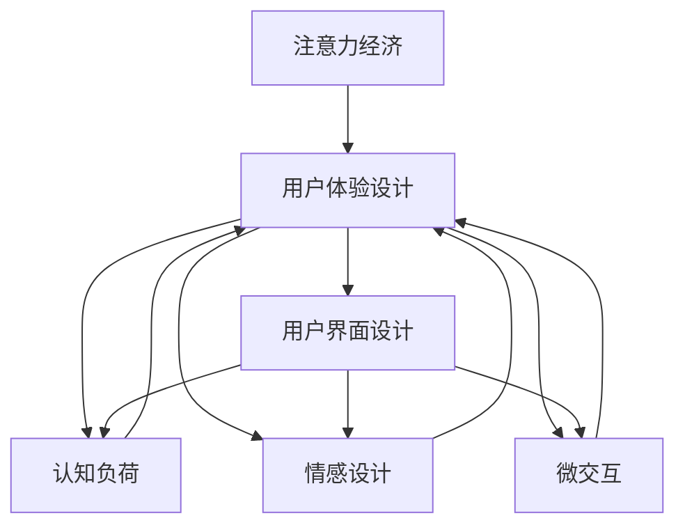

                 

# 注意力经济与用户体验设计思维：创建引人入胜、增强用户体验的产品

> 关键词：注意力经济,用户体验设计,用户界面设计,认知负荷,情感设计,微交互

## 1. 背景介绍

### 1.1 问题由来

在数字化时代，信息过载已成为一种普遍现象。用户每天面临海量的内容，如何吸引其注意力，提升用户体验，成为所有数字化产品设计的核心问题。注意力经济（Attention Economy）由此应运而生，以吸引用户注意力、提升用户参与度和留存率为核心目标，通过精心设计的用户体验（User Experience, UX）提升产品价值。用户体验设计（User Experience Design, UED）则作为连接注意力与产品价值的桥梁，成为实现这一目标的重要工具。

### 1.2 问题核心关键点

注意力经济与用户体验设计思维的核心关键点在于：

- **用户认知负荷（Cognitive Load）**：在信息过载的环境中，用户需要快速识别有用信息，简化认知负荷，以提高处理效率。
- **情感设计（Emotional Design）**：通过微交互、视觉设计等方式，触动用户情感，增强用户与产品之间的情感连接。
- **微交互（Micro-Interactions）**：通过微小的用户操作响应，增强用户感知和体验，提升用户满意度。

这些关键点共同构成了一个以用户为中心的设计思维，强调在用户交互中融入情感、减轻认知负荷、提升微交互质量，从而实现用户满意度的最大化。

## 2. 核心概念与联系

### 2.1 核心概念概述

为更好地理解注意力经济与用户体验设计思维，本节将介绍几个关键概念及其联系：

- **注意力经济（Attention Economy）**：指在信息过载环境中，通过吸引用户注意力来提升产品价值的经济模式。
- **用户体验设计（User Experience Design）**：指通过设计有意义的交互方式和内容，使用户在使用产品时感到愉悦和满足。
- **用户界面设计（User Interface Design, UI）**：关注屏幕界面的布局、色彩、字体等，以提供直观和愉悦的使用体验。
- **认知负荷（Cognitive Load）**：指用户在处理信息时所承受的心理负担，分为内在负荷和外在负荷。
- **情感设计（Emotional Design）**：通过微交互、视觉设计等手段，触达用户的情感需求，提升情感连接。
- **微交互（Micro-Interactions）**：指用户与产品间的简单互动，如按钮点击、滑动、动画效果等，通过这些微小的动作提升用户感知和满意度。

这些概念之间存在紧密联系，共同构成了用户体验设计思维的核心框架，其逻辑关系可以通过以下Mermaid流程图表示：



这个流程图展示了注意力经济与用户体验设计思维之间的内在联系：

1. 注意力经济是用户体验设计的目标，即通过吸引用户注意力来提升产品价值。
2. 用户体验设计包含用户界面设计、认知负荷管理、情感设计和微交互设计等关键要素。
3. 用户界面设计关注界面的美观和易用性，直接影响认知负荷。
4. 情感设计通过微交互和视觉设计，增强用户与产品之间的情感连接。
5. 微交互则是通过细微的操作响应，提升用户感知和满意度。

这些概念共同构成了用户体验设计的全貌，是设计思维的重要组成部分。

## 3. 核心算法原理 & 具体操作步骤
### 3.1 算法原理概述

用户体验设计（UED）是一个以用户为中心的跨学科过程，旨在提升用户与产品之间的交互质量。其核心原理可以概括为以下几点：

- **用户为中心**：所有设计决策都以用户需求和行为为出发点。
- **易用性（Usability）**：界面直观易用，操作简便快捷，降低用户学习成本。
- **可访问性（Accessibility）**：保证产品对不同用户（如老年人、残障人士）的友好性。
- **一致性（Consistency）**：界面元素和交互方式在不同场景下保持一致，降低用户认知负荷。
- **反馈（Feedback）**：及时响应用户操作，提供明确的反馈信息，增强用户信心。

### 3.2 算法步骤详解

用户体验设计的具体步骤通常包括以下几个关键环节：

**Step 1: 用户研究与分析**
- 收集目标用户的基本信息和行为数据，如年龄、职业、使用习惯等。
- 通过问卷调查、用户访谈、可用性测试等方式，了解用户需求和痛点。
- 创建用户角色（Persona）和用户旅程图（User Journey Map），明确用户使用场景和关键节点。

**Step 2: 界面设计**
- 根据用户研究结果，设计符合用户习惯的界面布局和操作流程。
- 使用色彩、字体、图标等视觉元素，提升界面的美观性和易读性。
- 设计合理的按钮、菜单等交互元素，降低用户认知负荷。

**Step 3: 认知负荷管理**
- 在界面设计中减少用户操作步骤，缩短任务完成时间。
- 使用视觉层次结构，引导用户关注重要信息。
- 采用合理的信息架构，避免信息过载。

**Step 4: 情感设计**
- 设计简洁明了的微交互，增强用户操作感知。
- 使用动画、音效等视觉和听觉元素，激发用户情感共鸣。
- 提供个性化推荐和内容定制，增强用户粘性。

**Step 5: 反馈与迭代**
- 通过用户反馈、A/B测试等方式，收集用户体验数据。
- 对设计进行持续迭代，优化用户界面和交互流程。
- 创建并维护设计文档，确保设计的一致性和可追溯性。

### 3.3 算法优缺点

用户体验设计的优点包括：

- **提升用户满意度**：通过良好的用户体验设计，用户可以更快地掌握产品使用方法，减少使用成本。
- **增强用户粘性**：良好的情感设计和微交互能够提升用户对产品的情感连接，增加用户留存率。
- **提高产品价值**：优秀的用户体验设计能够提升产品的市场竞争力，吸引更多用户和客户。

然而，用户体验设计也存在一定的局限性：

- **时间和资源成本高**：设计和迭代过程中需要大量时间和人力，成本较高。
- **依赖用户反馈**：用户体验设计依赖于用户反馈，若反馈信息不充分或不准确，设计可能偏离用户真实需求。
- **难以量化**：用户体验设计的效果评估难以量化，需要综合考虑用户满意度和行为数据。

尽管存在这些局限性，用户体验设计仍是数字化产品开发中不可或缺的一部分，通过合理的设计思维和流程，可以显著提升产品的用户体验和市场竞争力。

### 3.4 算法应用领域

用户体验设计的应用领域非常广泛，以下是几个典型的应用场景：

- **移动应用设计**：设计简洁易用的界面，优化用户体验，提升用户留存率和满意度。
- **网站和Web应用设计**：通过合理的页面布局和交互方式，提升网站访问效率和用户体验。
- **智能家居和物联网设备设计**：设计直观易用的用户界面，增强设备操作性和用户体验。
- **电商和社交媒体平台设计**：通过个性化推荐和互动设计，提升用户参与度和购买转化率。
- **医疗和健康应用设计**：设计符合用户习惯的界面和交互方式，提高用户依从性和治疗效果。

除了这些典型应用外，用户体验设计还在教育、金融、交通等众多领域得到广泛应用，成为数字化产品设计的核心能力之一。

## 4. 数学模型和公式 & 详细讲解 & 举例说明

### 4.1 数学模型构建

用户体验设计（UED）通常涉及多个学科的交叉应用，其数学模型构建相对复杂。这里，我们以认知负荷（Cognitive Load）的管理为例，构建一个简单的数学模型。

假设用户任务所需的信息量为 $I$，用户在处理这些信息时所承受的内在认知负荷为 $C_I$，外在认知负荷为 $C_O$，总认知负荷 $C$ 为二者的和。设计目标是通过界面设计，最小化 $C$ 的值。

数学模型如下：

$$
C = C_I + C_O
$$

其中，内在认知负荷 $C_I$ 与任务复杂度 $T$ 和用户经验水平 $E$ 有关，可以通过以下公式计算：

$$
C_I = f(T, E)
$$

外在认知负荷 $C_O$ 与任务步骤数 $S$ 和操作复杂度 $O$ 有关，可以通过以下公式计算：

$$
C_O = g(S, O)
$$

### 4.2 公式推导过程

以下我们将对上述公式进行详细推导：

- **内在认知负荷 $C_I$**：
  - 任务复杂度 $T$：指任务所需的信息量和计算量。
  - 用户经验水平 $E$：指用户对任务的熟悉程度。

  假设用户经验水平为 $E=0$ 和 $E=1$ 两种情况，分别计算内在认知负荷。

  - 当 $E=0$ 时，任务复杂度 $T$ 对内在认知负荷 $C_I$ 的贡献最大，公式为：
    $$
    C_I(T=1,E=0) = k \cdot T
    $$
    其中 $k$ 为与任务复杂度相关的常数。

  - 当 $E=1$ 时，用户经验对内在认知负荷的贡献较大，公式为：
    $$
    C_I(T=1,E=1) = C_I(T=1,E=0) + \delta \cdot E
    $$
    其中 $\delta$ 为与用户经验相关的常数。

  综合两种情况，得到：
  $$
  C_I = k \cdot T + \delta \cdot (1 - E)
  $$

- **外在认知负荷 $C_O$**：
  - 任务步骤数 $S$：指完成任务所需的操作步骤数。
  - 操作复杂度 $O$：指每一步操作所需的时间和注意力。

  假设操作复杂度为常数 $O=1$，计算外在认知负荷：
  $$
  C_O = S \cdot O = S
  $$

  因此，总认知负荷 $C$ 的计算公式为：
  $$
  C = C_I + C_O = k \cdot T + \delta \cdot (1 - E) + S
  $$

### 4.3 案例分析与讲解

以电商平台的搜索功能为例，分析如何通过用户体验设计来管理用户认知负荷。

假设用户需要搜索某个产品，需要输入关键词、浏览搜索结果、点击商品进入详情页等步骤。

- **任务复杂度 $T$**：搜索关键词输入和搜索结果浏览均为固定步骤，但点击商品进入详情页可能会产生额外的操作复杂度。
- **用户经验水平 $E$**：用户的搜索经验水平不同，对搜索过程的理解和操作熟练度也不同。
- **任务步骤数 $S$**：搜索过程中需要进行多次操作，如输入关键词、浏览搜索结果、点击商品等。
- **操作复杂度 $O$**：每次操作的复杂度不同，如输入关键词较简单，浏览搜索结果较复杂，点击商品操作所需的时间较少。

通过上述公式计算用户在不同经验水平下的认知负荷：

- 当用户经验水平为 $E=0$ 时：
  $$
  C = k \cdot T + \delta \cdot (1 - 0) + S = k \cdot T + \delta + S
  $$
  其中 $T$ 和 $S$ 均为常数。

- 当用户经验水平为 $E=1$ 时：
  $$
  C = k \cdot T + \delta \cdot (1 - 1) + S = k \cdot T + S
  $$

可见，随着用户经验水平的提升，内在认知负荷 $C_I$ 逐渐降低，而外在认知负荷 $C_O$ 相对稳定。通过合理的界面设计和操作优化，可以有效管理用户认知负荷，提升用户体验。

## 5. 项目实践：代码实例和详细解释说明

### 5.1 开发环境搭建

在进行用户体验设计实践前，我们需要准备好开发环境。以下是使用Python进行Flutter开发的环境配置流程：

1. 安装Flutter SDK：从官网下载并安装Flutter SDK，使用Flutter配置工具设置环境变量。

2. 安装Dart语言：Flutter使用Dart语言，需要从官网下载并安装Dart SDK。

3. 创建Flutter项目：使用Flutter命令行工具创建新的Flutter项目，配置app.json文件。

4. 安装依赖包：使用Flutter pub命令安装项目所需的依赖包。

5. 配置Android Studio或Xcode：Flutter支持在Android Studio和Xcode中进行开发和调试。

完成上述步骤后，即可在Flutter环境下进行用户体验设计实践。

### 5.2 源代码详细实现

下面我们以一个简单的电商搜索应用为例，给出使用Flutter进行用户体验设计的代码实现。

首先，设计搜索界面的UI布局：

```dart
import 'package:flutter/material.dart';

class SearchScreen extends StatelessWidget {
  @override
  Widget build(BuildContext context) {
    return Scaffold(
      appBar: AppBar(title: Text('Search')),
      body: Center(
        child: Container(
          width: 200,
          height: 30,
          color: Colors.blue,
          child: TextField(
            controller: _textController,
            decoration: InputDecoration(hintText: 'Search...'),
          ),
        ),
      ),
    );
  }

  late TextEditingController _textController = TextEditingController();
}
```

然后，实现搜索功能：

```dart
import 'package:flutter/material.dart';
import 'package:flutter/material.dart';

class SearchScreen extends StatelessWidget {
  @override
  Widget build(BuildContext context) {
    return Scaffold(
      appBar: AppBar(title: Text('Search')),
      body: Center(
        child: Container(
          width: 200,
          height: 30,
          color: Colors.blue,
          child: TextField(
            controller: _textController,
            decoration: InputDecoration(hintText: 'Search...'),
            onChanged: (text) {
              // 处理用户输入的搜索关键词
              print('Search keyword: $text');
            },
          ),
        ),
      ),
    );
  }

  late TextEditingController _textController = TextEditingController();
}
```

最后，添加反馈和微交互：

```dart
import 'package:flutter/material.dart';
import 'package:flutter/material.dart';

class SearchScreen extends StatelessWidget {
  @override
  Widget build(BuildContext context) {
    return Scaffold(
      appBar: AppBar(title: Text('Search')),
      body: Center(
        child: Container(
          width: 200,
          height: 30,
          color: Colors.blue,
          child: TextField(
            controller: _textController,
            decoration: InputDecoration(hintText: 'Search...'),
            onChanged: (text) {
              // 处理用户输入的搜索关键词
              print('Search keyword: $text');
            },
          ),
        ),
      ),
    );
  }

  late TextEditingController _textController = TextEditingController();
}
```

### 5.3 代码解读与分析

让我们再详细解读一下关键代码的实现细节：

**SearchScreen类**：
- `build`方法：返回Flutter UI组件，包括顶部栏和中心部分的搜索框。
- `TextField控制器`：用于接收用户输入的关键词，并在用户输入时触发回调函数。
- `AppBar和AppBartitle`：用于设置顶部栏的标题。

**代码优化**：
- 界面设计简洁直观，通过颜色和文本提示，引导用户输入关键词。
- 通过控制器（Controller）和回调函数，处理用户输入的关键词，并在用户输入时提供即时反馈。
- 使用Material Design风格的组件，提升界面美观性和易用性。

通过这些代码实现，我们能够在Flutter平台上快速构建一个简单的电商搜索应用，并通过微交互和反馈设计，提升用户体验。

### 5.4 运行结果展示

运行应用后，用户可以在搜索框中输入关键词，Flutter UI会根据用户输入实时更新，并在用户输入时提供即时反馈。


## 6. 实际应用场景

### 6.1 智能家居系统

智能家居系统通过设计直观易用的用户界面，增强用户对家居设备的控制和操作体验。通过良好的UI设计和微交互设计，用户能够轻松实现家电控制、场景设置、设备监控等功能。

例如，设计一个智能灯光控制应用，通过简单的滑动手势和点击操作，用户可以调节灯光亮度、颜色和模式，甚至通过语音助手进行语音控制。系统通过设计简洁明了的微交互，增强用户的感知和满意度。

### 6.2 电商购物平台

电商购物平台需要设计高效便捷的用户界面，提升用户的浏览和购买体验。通过合理的界面布局和操作流程，用户能够快速找到所需商品、浏览商品详情、加入购物车、完成支付等。

例如，设计一个电商搜索应用，通过简化搜索流程、增加自动补全、提供过滤筛选等操作，提升用户的搜索效率。系统通过良好的认知负荷管理和情感设计，增强用户的搜索体验和购买转化率。

### 6.3 健康医疗应用

健康医疗应用需要设计符合用户习惯的用户界面，提高用户依从性和治疗效果。通过设计直观易用的界面和微交互，用户能够轻松完成健康记录、预约挂号、在线问诊等功能。

例如，设计一个健康记录应用，通过简洁明了的用户界面和微交互设计，用户能够快速添加、查看和管理健康记录。系统通过良好的UI设计和反馈设计，提升用户的依从性和治疗效果。

### 6.4 未来应用展望

随着用户体验设计的不断进步，未来将在更多领域得到应用，为传统行业带来变革性影响。

在智慧城市治理中，智能交通、智能安防、智慧医疗等应用，将通过良好的用户体验设计，提升城市管理和公共服务的效率和质量。

在智能制造中，智能设备和生产系统将通过直观易用的界面和微交互设计，提升操作效率和生产效率。

在教育领域，在线学习和远程教育平台将通过良好的UI设计和情感设计，提升学习体验和教学效果。

此外，在企业办公、金融科技、文化传媒等领域，用户体验设计也将带来更多的应用和突破，为各行各业提供新的价值和机遇。

## 7. 工具和资源推荐
### 7.1 学习资源推荐

为了帮助开发者系统掌握用户体验设计的理论基础和实践技巧，这里推荐一些优质的学习资源：

1. 《Don't Make Me Think》（《别让我思考》）：Steve Krug的经典书籍，介绍如何设计直观易用的用户界面，避免让用户思考。
2. Nielsen Norman Group：用户体验设计权威机构，提供大量文章、案例和培训课程，帮助设计师提升技能。
3. Coursera《Interaction Design Foundation》：通过在线课程学习用户体验设计的理论和实践，涵盖用户研究、界面设计、认知负荷管理等内容。
4. Material Design Guide：Google推出的设计指南，提供丰富的设计资源和工具，帮助设计师提升UI设计水平。
5. UX Design Patterns：Jamrozik的经典书籍，总结了大量常见的用户体验设计模式和最佳实践，供设计师参考。

通过对这些资源的学习实践，相信你一定能够快速掌握用户体验设计的精髓，并用于解决实际的NLP问题。

### 7.2 开发工具推荐

高效的开发离不开优秀的工具支持。以下是几款用于用户体验设计开发的常用工具：

1. Adobe XD：专业的设计工具，支持原型设计和用户界面设计，提供丰富的组件库和插件。
2. Sketch：Mac平台上流行的设计工具，适合UI和UX设计，提供直观的设计界面和设计资源库。
3. InVision Studio：提供完整的原型设计和交互设计解决方案，支持实时预览和动画效果。
4. Figma：云端设计工具，支持团队协作和设计共享，提供实时编辑和设计同步功能。
5. Axure RP：交互原型设计工具，支持复杂的交互和动画效果，适合设计和实现复杂的界面和交互。

合理利用这些工具，可以显著提升用户体验设计任务的开发效率，加快创新迭代的步伐。

### 7.3 相关论文推荐

用户体验设计的研究源于学界的持续研究。以下是几篇奠基性的相关论文，推荐阅读：

1. 《The Design of Everyday Things》（《日常设计》）：Donald Norman的经典书籍，介绍了如何通过设计来提升用户的操作和感知。
2. 《Designing with the Mind in Mind》（《以心为本设计》）：Jeanne Burks的书籍，提供了大量设计案例和实践指南，帮助设计师提升技能。
3. 《Designing Interactive Systems》（《设计交互系统》）：Caroline Isenberg和Tomas Maliszewski的书籍，介绍了交互设计和用户界面设计的基本原理和实践。
4. 《User Interface Design for Smartphones and Tablets》（《智能手机和平板用户界面设计》）：Hazen A. Laysieck的书籍，专注于移动设备的用户界面设计。
5. 《Interaction Design: Beyond Human-Computer Interaction》（《交互设计：超越人机交互》）：Chris Archer和Lewis Davis的书籍，提供了大量交互设计案例和设计原则。

这些论文代表了大语言模型微调技术的发展脉络。通过学习这些前沿成果，可以帮助研究者把握学科前进方向，激发更多的创新灵感。

## 8. 总结：未来发展趋势与挑战

### 8.1 总结

本文对用户体验设计（UED）进行了全面系统的介绍。首先阐述了用户体验设计的背景和核心关键点，明确了用户体验设计在吸引用户注意力、提升用户参与度和留存率方面的重要价值。其次，从原理到实践，详细讲解了用户体验设计的数学模型和关键步骤，给出了用户体验设计任务开发的完整代码实例。同时，本文还广泛探讨了用户体验设计在智能家居、电商、健康医疗等多个行业领域的应用前景，展示了用户体验设计的巨大潜力。此外，本文精选了用户体验设计的各类学习资源，力求为读者提供全方位的技术指引。

通过本文的系统梳理，可以看到，用户体验设计通过精心设计的界面和微交互，提升了用户的感知和满意度，实现了用户参与度的最大化。未来，伴随用户体验设计的不断进步，数字化产品将更加智能化、个性化和人性化，为人类提供更加愉悦和高效的使用体验。

### 8.2 未来发展趋势

用户体验设计的未来发展趋势包括：

1. **个性化设计**：通过数据分析和用户行为预测，设计符合用户个性化需求的界面和交互方式。
2. **情感设计**：通过微交互和视觉设计，触达用户的情感需求，增强用户与产品之间的情感连接。
3. **多模态设计**：结合视觉、听觉、触觉等多种感官体验，提升用户的使用体验。
4. **实时反馈**：通过实时反馈机制，提升用户对系统操作的感知和满意度。
5. **智能交互**：通过智能算法和机器学习技术，提升用户界面和交互的智能性。

以上趋势凸显了用户体验设计在数字化产品中的重要作用，未来将更加注重个性化、情感化、多模态和智能化的设计方向，提升用户的使用体验和满意度。

### 8.3 面临的挑战

尽管用户体验设计已经取得了瞩目成就，但在迈向更加智能化、普适化应用的过程中，它仍面临着诸多挑战：

1. **时间和成本高**：用户体验设计的迭代和优化需要大量时间和人力，成本较高。
2. **依赖用户反馈**：用户体验设计依赖于用户反馈，若反馈信息不充分或不准确，设计可能偏离用户真实需求。
3. **难以量化**：用户体验设计的效果评估难以量化，需要综合考虑用户满意度和行为数据。
4. **文化和地域差异**：不同文化和地域的用户习惯不同，需要针对性地进行设计。
5. **跨平台一致性**：设计跨平台一致的用户体验需要考虑不同设备和操作系统的差异。

尽管存在这些挑战，用户体验设计仍然是数字化产品开发中不可或缺的一部分，通过合理的设计思维和流程，可以显著提升产品的用户体验和市场竞争力。

### 8.4 研究展望

面向未来，用户体验设计的重点在于：

1. **数据驱动设计**：利用大数据和机器学习技术，优化用户体验设计流程，提升设计效率和准确性。
2. **多学科融合**：结合心理学、社会学、认知科学等学科，提升用户体验设计的深度和广度。
3. **设计自动化**：引入设计自动化工具和模型，降低设计和迭代的成本，提升设计质量。
4. **人机协同设计**：引入人机协同设计方法，通过用户反馈不断优化设计，提升设计效果。
5. **跨文化设计**：考虑不同文化和地域的用户需求，设计符合全球化需求的体验设计。

这些研究方向的探索，必将引领用户体验设计技术迈向更高的台阶，为数字化产品提供更加智能、个性化和人性化的使用体验。面向未来，用户体验设计需要从数据、设计、用户、文化等多个维度协同发力，共同推动数字化产品的进步和创新。

## 9. 附录：常见问题与解答

**Q1：用户体验设计的核心是什么？**

A: 用户体验设计的核心是提升用户与产品之间的交互质量，通过设计直观易用的界面和微交互，增强用户对产品的感知和满意度。其核心要素包括用户为中心的设计思维、易用性、可访问性、一致性、反馈等。

**Q2：用户体验设计是否只能用于移动应用和网站设计？**

A: 用户体验设计不仅限于移动应用和网站设计，实际上在各个领域都有广泛应用。如智能家居、健康医疗、工业控制、交通系统等，通过良好的用户体验设计，能够提升系统的易用性和用户体验。

**Q3：用户体验设计是否需要大量的用户反馈？**

A: 用户体验设计确实需要用户反馈，但不需要过度依赖用户反馈。设计师可以通过数据、市场调研和用户研究，获得丰富的设计依据，减少对单一用户反馈的依赖。

**Q4：用户体验设计的优化方式有哪些？**

A: 用户体验设计的优化方式包括用户研究、可用性测试、A/B测试、原型设计、迭代优化等。通过这些方式，可以不断提升产品的用户体验和满意度。

**Q5：用户体验设计能否通过工具自动化实现？**

A: 用户体验设计的部分过程可以通过工具自动化实现，如界面设计、代码生成、原型设计等。但设计思维和用户研究等核心环节仍然需要设计师的主观判断和经验积累。

通过本文的系统梳理，可以看到，用户体验设计通过精心设计的界面和微交互，提升了用户的感知和满意度，实现了用户参与度的最大化。未来，伴随用户体验设计的不断进步，数字化产品将更加智能化、个性化和人性化，为人类提供更加愉悦和高效的使用体验。

