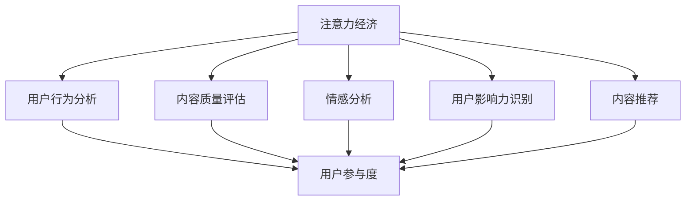

                 

# 注意力经济与社交媒体分析：了解受众参与度和影响力的秘诀

## 1. 背景介绍

### 1.1 问题由来

随着互联网的普及和数字技术的飞速发展，社交媒体平台成为人们获取信息、交流互动的主要渠道。社交媒体不仅改变了人类的传播方式和信息消费习惯，也逐渐形成了基于注意力驱动的“注意力经济”。在这个过程中，企业、媒体、个人都试图通过各种策略来吸引用户的关注，从而实现自身价值最大化。

然而，用户注意力是稀缺且动态变化的资源。如何在海量信息中脱颖而出，捕获并保持用户关注，成为企业和媒体关注的焦点。通过社交媒体分析，可以深入了解用户的行为模式、兴趣偏好、情感倾向等信息，从而制定更精准的策略，提升用户参与度和影响力。

### 1.2 问题核心关键点

注意力经济与社交媒体分析的核心在于通过数据分析技术，理解用户注意力转移的规律，挖掘影响用户行为的深层次因素，并据此优化内容生产、广告投放、用户体验等策略。这需要从以下几个关键点进行深入分析：

1. **用户行为分析**：了解用户在社交媒体上的行为习惯，包括阅读、点赞、评论、分享等，进而把握用户的活跃程度和兴趣焦点。
2. **内容质量评估**：通过对内容的浏览量、互动率等指标的监测，评估内容的吸引力与价值。
3. **情感分析**：分析用户对内容的情感倾向，了解用户对不同话题和内容的情感反应。
4. **影响力识别**：识别社交媒体上的意见领袖和关键节点，评估他们的影响力和传播效果。

## 2. 核心概念与联系

### 2.1 核心概念概述

为更好地理解注意力经济与社交媒体分析，本节将介绍几个关键概念及其相互联系：

- **注意力经济**：一种基于用户注意力的经济模式，强调注意力资源的稀缺性和重要性。社交媒体平台的商业价值在很大程度上依赖于用户注意力的吸引和维持。
- **社交媒体分析**：通过数据挖掘和机器学习等技术，分析社交媒体平台上的用户行为数据，提取有价值的信息，指导内容生产、广告投放等决策。
- **用户参与度**：衡量用户与内容互动的程度，包括点赞、评论、分享等行为频率。高参与度表示用户对内容的高度关注和兴趣。
- **用户影响力**：指用户在社交媒体上的影响力大小，可以通过粉丝数量、互动率、转发量等指标评估。影响力大的用户，对其他用户的行为和内容创作有显著影响。
- **内容质量**：社交媒体平台上发布的内容质量，包括原创性、时效性、趣味性等。高质量内容更容易获得用户的关注和互动。
- **情感分析**：通过对用户评论、反馈等文本数据的情感倾向分析，了解用户对内容的情感反应。情感分析可以指导内容创作，提升用户满意度。
- **内容推荐**：通过用户行为和偏好数据，推荐符合用户兴趣的内容，提高用户停留时间和互动率。

这些核心概念之间的联系可以通过以下Mermaid流程图来展示：



这个流程图展示了一系列核心概念及其在注意力经济与社交媒体分析中的应用：

1. 注意力经济依赖于用户行为分析、内容质量评估、情感分析等，以了解用户关注点，优化内容策略。
2. 用户参与度和影响力识别需要借助用户行为分析、情感分析等，以评估用户活跃程度和传播效果。
3. 内容推荐通过用户行为分析、内容质量评估等，为用户定制个性化内容，提高参与度和满意度。

## 3. 核心算法原理 & 具体操作步骤
### 3.1 算法原理概述

基于社交媒体分析的注意力经济研究，主要依赖于数据挖掘和机器学习技术。其核心思想是：通过分析社交媒体平台上的大量数据，识别出用户行为和内容质量的关键特征，从而指导内容策略和广告投放，提升用户参与度和影响力。

形式化地，假设社交媒体平台上的用户行为数据为 $D=\{(x_i,y_i)\}_{i=1}^N$，其中 $x_i$ 为用户行为数据，包括点赞、评论、分享等，$y_i$ 为用户的互动行为，如浏览时间、互动次数等。内容质量数据为 $C=\{(c_j,s_j)\}_{j=1}^M$，其中 $c_j$ 为内容，$s_j$ 为内容质量评估。情感数据为 $E=\{(e_k,v_k)\}_{k=1}^K$，其中 $e_k$ 为情感文本，$v_k$ 为情感极性（正、负、中性）。

注意力经济与社交媒体分析的目标是构建模型 $M$，最大化用户参与度和影响力。模型的优化目标为：

$$
\mathop{\arg\max}_{M} \left(\sum_{i=1}^N \eta_i y_i + \sum_{j=1}^M \alpha_j s_j + \sum_{k=1}^K \beta_k v_k\right)
$$

其中 $\eta_i$ 为注意力权重，$\alpha_j$ 为内容质量权重，$\beta_k$ 为情感极性权重。这些权重需要通过模型训练进行优化。

### 3.2 算法步骤详解

基于社交媒体分析的注意力经济优化，通常包括以下几个关键步骤：

**Step 1: 数据预处理与特征提取**
- 收集社交媒体平台上的用户行为数据、内容数据和情感数据。
- 对数据进行清洗、去重、分词、标注等预处理操作。
- 从数据中提取关键特征，如用户互动频率、内容质量评分、情感极性等。

**Step 2: 构建特征向量**
- 将用户行为数据、内容数据和情感数据转化为向量表示，供模型训练使用。
- 常用的特征表示方法包括词袋模型、TF-IDF、词嵌入等。

**Step 3: 训练模型**
- 选择合适的机器学习模型，如线性回归、逻辑回归、决策树、随机森林、神经网络等。
- 在标注数据集上进行模型训练，优化注意力权重、内容质量权重和情感极性权重。
- 使用交叉验证等方法评估模型性能，选择最优模型。

**Step 4: 模型评估与优化**
- 在测试集上对模型进行评估，计算用户参与度和影响力的指标。
- 根据评估结果对模型进行优化，调整权重参数，提升模型效果。
- 定期更新模型，以适应用户行为和内容质量的变化。

### 3.3 算法优缺点

基于社交媒体分析的注意力经济优化，具有以下优点：
1. 数据驱动：通过分析用户行为数据，发现用户注意力转移的规律，指导内容策略。
2. 精准高效：使用机器学习模型，对用户行为和内容质量进行精准预测，优化策略效果。
3. 自适应性强：可以不断更新模型，适应用户行为和内容质量的变化，保持策略的先进性。

同时，该方法也存在一些局限性：
1. 数据质量依赖：模型的效果依赖于数据的质量和多样性，数据不足或标注偏差会影响模型性能。
2. 计算资源需求高：社交媒体数据量庞大，特征提取和模型训练需要大量的计算资源。
3. 算法复杂度高：机器学习模型通常需要较长的训练时间和较高的计算复杂度，需要具备一定的技术背景。
4. 预测不确定性：模型预测结果存在不确定性，依赖于输入数据和模型选择。

尽管存在这些局限性，基于社交媒体分析的注意力经济优化方法仍在大数据时代具备重要意义，为内容策略和广告投放提供了科学依据。

### 3.4 算法应用领域

基于社交媒体分析的注意力经济优化方法，在以下几个领域得到了广泛应用：

- **内容推荐系统**：通过分析用户行为数据，推荐符合用户兴趣的内容，提高用户参与度和满意度。
- **广告投放策略**：利用用户行为数据和内容质量评估，优化广告投放策略，提升广告效果和转化率。
- **舆情分析**：通过对社交媒体上的情感数据进行分析，评估品牌形象和市场舆情，指导公关和营销策略。
- **用户画像构建**：通过用户行为和情感数据，构建用户画像，了解用户需求和行为模式。
- **社区管理**：通过分析社区中的互动数据，优化社区管理策略，提升用户参与度和社区活跃度。

除了上述这些经典应用外，社交媒体分析还在社会事件监测、用户行为预测、网络安全监控等诸多领域，发挥了重要作用。随着社交媒体平台的发展和用户行为数据的丰富，社交媒体分析的应用场景还将不断拓展。

## 4. 数学模型和公式 & 详细讲解 & 举例说明

### 4.1 数学模型构建

本节将使用数学语言对基于社交媒体分析的注意力经济优化进行严格建模。

假设社交媒体平台上的用户行为数据为 $D=\{(x_i,y_i)\}_{i=1}^N$，内容质量数据为 $C=\{(c_j,s_j)\}_{j=1}^M$，情感数据为 $E=\{(e_k,v_k)\}_{k=1}^K$。其中 $x_i, y_i, c_j, s_j, e_k, v_k$ 分别为用户行为、互动行为、内容、内容质量、情感文本和情感极性。

定义用户参与度为 $P=\sum_{i=1}^N \eta_i y_i$，内容质量评估为 $Q=\sum_{j=1}^M \alpha_j s_j$，情感极性评估为 $E=\sum_{k=1}^K \beta_k v_k$。

注意力经济优化的目标为最大化用户参与度和内容质量，即最大化：

$$
\mathop{\arg\max}_{\eta_i, \alpha_j, \beta_k} (P + Q + E)
$$

### 4.2 公式推导过程

以下我们将详细推导用户参与度 $P$、内容质量评估 $Q$ 和情感极性评估 $E$ 的公式。

**用户参与度 $P$**：

假设用户行为数据 $x_i$ 表示为向量 $\mathbf{x}_i$，互动行为 $y_i$ 表示为向量 $\mathbf{y}_i$，注意力权重 $\eta_i$ 表示为向量 $\mathbf{\eta}_i$。则用户参与度 $P$ 可以表示为：

$$
P = \sum_{i=1}^N \mathbf{\eta}_i^T \mathbf{x}_i \mathbf{y}_i
$$

**内容质量评估 $Q$**：

假设内容数据 $c_j$ 表示为向量 $\mathbf{c}_j$，内容质量评分 $s_j$ 表示为向量 $\mathbf{s}_j$，内容质量权重 $\alpha_j$ 表示为向量 $\mathbf{\alpha}_j$。则内容质量评估 $Q$ 可以表示为：

$$
Q = \sum_{j=1}^M \mathbf{\alpha}_j^T \mathbf{c}_j \mathbf{s}_j
$$

**情感极性评估 $E$**：

假设情感文本 $e_k$ 表示为向量 $\mathbf{e}_k$，情感极性 $v_k$ 表示为向量 $\mathbf{v}_k$，情感极性权重 $\beta_k$ 表示为向量 $\mathbf{\beta}_k$。则情感极性评估 $E$ 可以表示为：

$$
E = \sum_{k=1}^K \mathbf{\beta}_k^T \mathbf{e}_k \mathbf{v}_k
$$

通过上述公式，我们可以对用户参与度、内容质量评估和情感极性评估进行数学建模，进而构建优化目标函数。

### 4.3 案例分析与讲解

为了更好地理解公式的应用，我们以情感分析为例，展示如何通过社交媒体分析来评估品牌形象和市场舆情。

假设某品牌在社交媒体上发布了一则新产品广告，收集了包含情感极性 $v_k$ 的评论数据 $E=\{(e_k,v_k)\}_{k=1}^K$。通过情感分析模型，可以计算出该广告在社交媒体上的情感极性评估 $E$。如果 $E$ 为正值，表示用户对广告有正面情感；如果 $E$ 为负值，表示用户对广告有负面情感；如果 $E$ 为中性，表示用户对广告无明显情感倾向。

## 5. 项目实践：代码实例和详细解释说明
### 5.1 开发环境搭建

在进行社交媒体分析实践前，我们需要准备好开发环境。以下是使用Python进行TensorFlow开发的环境配置流程：

1. 安装Anaconda：从官网下载并安装Anaconda，用于创建独立的Python环境。

2. 创建并激活虚拟环境：
```bash
conda create -n tf-env python=3.8 
conda activate tf-env
```

3. 安装TensorFlow：根据CUDA版本，从官网获取对应的安装命令。例如：
```bash
conda install tensorflow==2.8
```

4. 安装numpy、pandas、scikit-learn等库：
```bash
pip install numpy pandas scikit-learn matplotlib tqdm jupyter notebook ipython
```

完成上述步骤后，即可在`tf-env`环境中开始社交媒体分析实践。

### 5.2 源代码详细实现

下面我们以情感分析任务为例，给出使用TensorFlow进行社交媒体情感分析的代码实现。

首先，定义情感分析任务的数据处理函数：

```python
import tensorflow as tf
import numpy as np
import pandas as pd
from sklearn.model_selection import train_test_split
from tensorflow.keras.preprocessing.text import Tokenizer
from tensorflow.keras.preprocessing.sequence import pad_sequences

# 加载数据集
data = pd.read_csv('sentiment_data.csv')
texts = data['text'].tolist()
labels = data['label'].tolist()

# 数据预处理
tokenizer = Tokenizer(oov_token='<OOV>')
tokenizer.fit_on_texts(texts)
sequences = tokenizer.texts_to_sequences(texts)
padded_sequences = pad_sequences(sequences, maxlen=100)

# 数据集划分
X_train, X_test, y_train, y_test = train_test_split(padded_sequences, labels, test_size=0.2)
```

然后，定义模型和损失函数：

```python
from tensorflow.keras.models import Sequential
from tensorflow.keras.layers import Embedding, LSTM, Dense

# 定义模型
model = Sequential()
model.add(Embedding(input_dim=len(tokenizer.word_index) + 1, output_dim=128, input_length=100))
model.add(LSTM(128))
model.add(Dense(1, activation='sigmoid'))

# 定义损失函数
loss_fn = tf.keras.losses.BinaryCrossentropy()

# 编译模型
model.compile(optimizer='adam', loss=loss_fn, metrics=['accuracy'])
```

接着，定义训练和评估函数：

```python
from tensorflow.keras.utils import to_categorical
from sklearn.metrics import classification_report

# 标签处理
y_train = to_categorical(y_train)
y_test = to_categorical(y_test)

# 训练模型
history = model.fit(X_train, y_train, epochs=10, batch_size=32, validation_data=(X_test, y_test))

# 评估模型
y_pred = model.predict(X_test)
y_pred = np.round(y_pred).astype(int)
print(classification_report(y_test, y_pred))
```

最后，启动训练流程并在测试集上评估：

```python
# 训练模型
history = model.fit(X_train, y_train, epochs=10, batch_size=32, validation_data=(X_test, y_test))

# 评估模型
y_pred = model.predict(X_test)
y_pred = np.round(y_pred).astype(int)
print(classification_report(y_test, y_pred))
```

以上就是使用TensorFlow进行社交媒体情感分析的完整代码实现。可以看到，借助TensorFlow的强大封装，我们可以用相对简洁的代码实现情感分析模型。

### 5.3 代码解读与分析

让我们再详细解读一下关键代码的实现细节：

**数据处理函数**：
- 使用Pandas加载情感分析数据集，提取文本和标签。
- 使用Tokenizers将文本转化为token序列，并使用padding将序列长度统一到100。
- 使用train_test_split将数据集划分为训练集和测试集。

**模型定义**：
- 定义一个简单的LSTM模型，包含Embedding层、LSTM层和Dense层。
- 定义损失函数为二元交叉熵，用于情感分类任务。
- 编译模型，选择adam优化器和准确率作为评估指标。

**训练和评估函数**：
- 使用sklearn的train_test_split对数据集进行划分。
- 使用TensorFlow的fit方法对模型进行训练，并记录训练过程中的损失和准确率。
- 使用sklearn的classification_report对测试集的预测结果进行评估，输出分类指标。

**训练流程**：
- 定义训练轮数和批大小。
- 在训练集上调用模型的fit方法进行训练，记录训练过程中的损失和准确率。
- 在测试集上评估模型，输出分类指标。

可以看到，TensorFlow提供了完整的工具链，帮助开发者高效实现社交媒体分析模型。

## 6. 实际应用场景
### 6.1 智能客服系统

智能客服系统可以利用社交媒体分析，了解用户情感和需求，提升用户体验和满意度。通过分析用户在社交媒体上的评论、反馈等数据，可以识别出用户的常见问题和痛点，从而优化客服流程和服务质量。

在技术实现上，可以使用情感分析模型识别用户情感倾向，使用文本分类模型分析用户常见问题，再结合机器学习算法，预测用户意图并提供个性化服务。如此构建的智能客服系统，能显著提升客户咨询体验和问题解决效率。

### 6.2 品牌舆情监测

品牌舆情监测是社交媒体分析的重要应用之一。通过监测社交媒体上的情感数据，品牌可以了解市场舆情，及时应对负面消息，提升品牌形象和用户信任度。

在具体实施中，可以使用情感分析模型对品牌相关评论进行情感极性评估，识别出正面、负面和中性评论，并分析不同情感评论的来源和趋势。品牌可以根据情感分析结果，调整市场策略和产品设计，改善用户体验。

### 6.3 产品推荐系统

社交媒体平台上的用户行为数据，可以用于个性化推荐系统的构建。通过分析用户的行为数据，推荐符合用户兴趣的内容和产品，提升用户满意度和平台粘性。

在技术实现上，可以使用协同过滤算法、基于内容的推荐算法和基于混合策略的推荐模型，结合用户行为数据和情感分析结果，构建个性化推荐系统。系统可以根据用户行为数据，实时更新推荐结果，满足用户不断变化的需求。

### 6.4 未来应用展望

随着社交媒体分析技术的不断进步，基于社交媒体分析的注意力经济将有更广泛的应用前景：

1. **内容推荐系统**：利用社交媒体分析，深入了解用户行为和兴趣，推荐更符合用户需求的内容，提高用户参与度和满意度。
2. **广告投放优化**：通过分析用户行为数据，优化广告投放策略，提升广告效果和转化率。
3. **市场趋势预测**：利用情感分析和社会网络分析，预测市场趋势和用户需求，指导产品开发和市场策略。
4. **舆情监控系统**：实时监测社交媒体上的舆情变化，及时应对负面消息，保护品牌形象和用户信任。
5. **用户行为预测**：通过分析用户行为数据，预测用户未来行为，提高营销和服务的精准度。

未来的社交媒体分析技术将更注重数据的多样性、实时性和准确性，结合深度学习、自然语言处理、知识图谱等前沿技术，构建更加智能、高效、可靠的分析系统。

## 7. 工具和资源推荐
### 7.1 学习资源推荐

为了帮助开发者系统掌握社交媒体分析的理论基础和实践技巧，这里推荐一些优质的学习资源：

1. 《深度学习入门：基于Python的理论与实现》：介绍了深度学习的基本原理和TensorFlow的使用方法，适合初学者入门。

2. 《自然语言处理综述》课程：斯坦福大学开设的NLP明星课程，涵盖了NLP的多个领域，如文本分类、情感分析、机器翻译等。

3. 《Python编程：从入门到实践》：介绍了Python的基本语法和编程实践，适合初学者学习。

4. TensorFlow官方文档：TensorFlow的详细文档，包含丰富的代码示例和API参考，是TensorFlow学习的重要资源。

5. Kaggle数据集：Kaggle提供了大量社交媒体分析的数据集，用于模型训练和评估。

通过对这些资源的学习实践，相信你一定能够快速掌握社交媒体分析的理论基础和实践技巧，并用于解决实际的社交媒体问题。

### 7.2 开发工具推荐

高效的开发离不开优秀的工具支持。以下是几款用于社交媒体分析开发的常用工具：

1. TensorFlow：由Google主导开发的深度学习框架，支持分布式训练和GPU加速，适合处理大规模数据。

2. PyTorch：由Facebook开发的深度学习框架，易于使用和调试，适合快速迭代研究。

3. scikit-learn：Python的机器学习库，包含丰富的算法和工具，适合数据预处理和模型评估。

4. Pandas：Python的数据处理库，适合数据清洗和分析，支持多种数据格式。

5. TensorBoard：TensorFlow的可视化工具，可以实时监测模型训练状态，并提供详细的图表展示。

6. Jupyter Notebook：交互式的编程环境，适合编写和调试代码，支持多种语言。

合理利用这些工具，可以显著提升社交媒体分析任务的开发效率，加快创新迭代的步伐。

### 7.3 相关论文推荐

社交媒体分析技术的发展离不开学界的持续研究。以下是几篇奠基性的相关论文，推荐阅读：

1. "Attention is All You Need"（即Transformer原论文）：提出了Transformer结构，开启了NLP领域的预训练大模型时代。

2. "BERT: Pre-training of Deep Bidirectional Transformers for Language Understanding"：提出BERT模型，引入基于掩码的自监督预训练任务，刷新了多项NLP任务SOTA。

3. "Semi-supervised Sequence Learning with Contextualized Representations"：提出基于Transformer的半监督序列学习方法，提升模型泛化性能。

4. "Emotion Analysis in Social Media"：研究社交媒体上的情感分析方法，探索情感极性评估和情感分类算法。

5. "Multimodal Sentiment Analysis Using Deep Learning"：研究多模态情感分析方法，融合文本、图像、声音等多模态信息，提高情感分析效果。

这些论文代表了大语言模型微调技术的发展脉络。通过学习这些前沿成果，可以帮助研究者把握学科前进方向，激发更多的创新灵感。

## 8. 总结：未来发展趋势与挑战

### 8.1 总结

本文对基于社交媒体分析的注意力经济进行了全面系统的介绍。首先阐述了社交媒体平台在信息消费和注意力经济中的重要作用，明确了社交媒体分析在理解用户行为、提升用户参与度和影响力方面的独特价值。其次，从原理到实践，详细讲解了社交媒体分析的数学建模和算法实现，给出了社交媒体情感分析的代码实例。同时，本文还广泛探讨了社交媒体分析在智能客服、品牌舆情监测、产品推荐等多个行业领域的应用前景，展示了社交媒体分析技术的广泛应用潜力。此外，本文精选了社交媒体分析的学习资源，力求为读者提供全方位的技术指引。

通过本文的系统梳理，可以看到，基于社交媒体分析的注意力经济研究，在理解用户行为、提升用户参与度和影响力方面具备重要价值。未来，随着深度学习、自然语言处理、知识图谱等技术的不断进步，社交媒体分析将进一步提升数据的丰富性和分析的准确性，为内容策略、广告投放、舆情监控等领域提供科学依据。

### 8.2 未来发展趋势

展望未来，社交媒体分析技术将呈现以下几个发展趋势：

1. **多模态融合**：社交媒体数据不仅包括文本，还包含图像、视频、音频等多模态信息。未来的社交媒体分析将更加注重多模态数据的融合，提升模型的综合分析能力。

2. **实时处理**：社交媒体信息动态变化，未来的社交媒体分析将更加注重实时处理，提高模型的响应速度和时效性。

3. **增强学习**：结合强化学习、博弈论等方法，通过交互式学习，提升模型的自适应性和决策能力。

4. **跨领域应用**：社交媒体分析技术将逐步向更多领域扩展，如舆情监测、市场预测、用户行为预测等。

5. **自动化分析**：通过自动化分析工具和平台，简化社交媒体分析流程，提高数据处理和模型训练的效率。

6. **隐私保护**：随着数据隐私问题日益受到重视，社交媒体分析将更加注重数据隐私保护，确保用户数据安全。

以上趋势凸显了社交媒体分析技术的广阔前景。这些方向的探索发展，必将进一步提升社交媒体分析的效果和应用范围，为内容策略、广告投放、舆情监测等领域提供更精准、实时的数据支持。

### 8.3 面临的挑战

尽管社交媒体分析技术已经取得了瞩目成就，但在迈向更加智能化、普适化应用的过程中，它仍面临诸多挑战：

1. **数据质量和多样性**：社交媒体数据质量参差不齐，缺乏标准化，难以统一处理。同时，数据的多样性和丰富性也给数据处理和模型训练带来挑战。

2. **算法复杂度**：社交媒体分析涉及深度学习、自然语言处理等多个领域，算法复杂度高，需要较高的技术门槛。

3. **计算资源需求**：社交媒体数据量庞大，特征提取和模型训练需要大量的计算资源，这对算力提出较高要求。

4. **隐私保护问题**：社交媒体数据涉及用户隐私，如何在保障隐私的同时，实现数据的有效分析，是一大难题。

5. **模型泛化性**：模型在社交媒体上表现良好，但在实际应用场景中，模型的泛化性和鲁棒性仍有待提高。

6. **伦理道德**：社交媒体分析涉及用户行为和隐私数据，如何在分析过程中遵守伦理道德规范，是一大挑战。

正视社交媒体分析面临的这些挑战，积极应对并寻求突破，将使社交媒体分析技术更加成熟可靠。

### 8.4 研究展望

未来的社交媒体分析研究需要在以下几个方面寻求新的突破：

1. **跨模态数据融合**：研究多模态数据的融合方法，提高模型的综合分析能力。

2. **实时分析和预测**：研究实时处理和预测算法，提高模型的响应速度和时效性。

3. **增强学习和交互式学习**：结合强化学习、博弈论等方法，提升模型的自适应性和决策能力。

4. **数据隐私保护**：研究数据隐私保护技术，确保用户数据的安全性和隐私性。

5. **跨领域应用**：探索社交媒体分析在其他领域的应用，如舆情监测、市场预测等。

6. **算法优化和简化**：研究算法优化和简化方法，降低技术门槛，提升数据处理和模型训练的效率。

这些研究方向的探索，必将引领社交媒体分析技术迈向更高的台阶，为内容策略、广告投放、舆情监测等领域提供更科学、实时的数据支持。面向未来，社交媒体分析技术需要与其他人工智能技术进行更深入的融合，如知识表示、因果推理、强化学习等，多路径协同发力，共同推动社交媒体分析技术的进步。

## 9. 附录：常见问题与解答

**Q1：如何评估社交媒体分析模型的性能？**

A: 社交媒体分析模型的性能评估通常使用分类指标，如准确率、召回率、F1值等。可以通过测试集上的评估结果，了解模型的预测性能。

**Q2：社交媒体分析是否适用于所有类型的数据？**

A: 社交媒体分析主要适用于文本数据，但也可以扩展到图像、视频等多模态数据。对于非文本数据，可以使用图像分类、视频情感分析等方法进行预处理，再接入社交媒体分析模型。

**Q3：如何处理社交媒体上的噪声数据？**

A: 社交媒体数据通常包含噪声和无关信息，需要对其进行清洗和预处理。可以通过去除停用词、去除无关话题、去除低质量数据等方法，提高数据的纯净度。

**Q4：社交媒体分析的模型如何选择？**

A: 社交媒体分析的模型选择应根据具体任务和数据特点进行。常用的模型包括神经网络、SVM、随机森林等，具体选择应综合考虑模型的复杂度、泛化能力、训练时间等因素。

**Q5：如何优化社交媒体分析的计算效率？**

A: 社交媒体分析的计算效率可以通过模型压缩、特征选择、并行计算等方法进行优化。可以使用深度学习框架的优化工具，如TensorFlow的Quantization、TensorFlow Lite等，减小模型体积和推理速度。

通过本文的系统梳理，可以看到，基于社交媒体分析的注意力经济研究，在理解用户行为、提升用户参与度和影响力方面具备重要价值。未来，随着深度学习、自然语言处理、知识图谱等技术的不断进步，社交媒体分析将进一步提升数据的丰富性和分析的准确性，为内容策略、广告投放、舆情监测等领域提供科学依据。同时，社交媒体分析技术也需要与其他人工智能技术进行更深入的融合，共同推动社交媒体分析技术的进步。

---

作者：禅与计算机程序设计艺术 / Zen and the Art of Computer Programming

