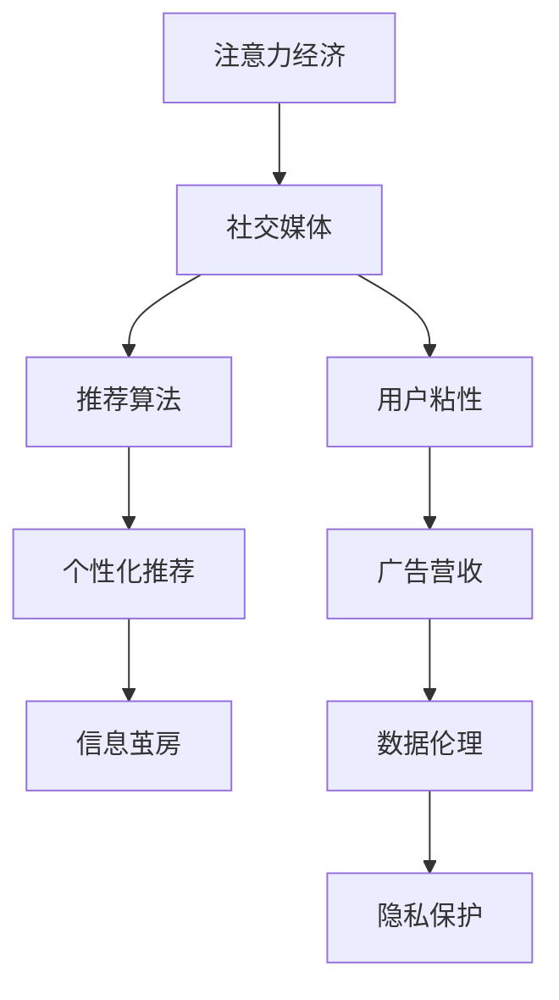

                 

# 注意力经济与社交媒体算法的共生

> 关键词：注意力经济, 社交媒体, 算法, 新闻消费, 广告推荐, 用户体验, 用户粘性, 信息茧房, 隐私保护, 数据伦理, 公平性

## 1. 背景介绍

### 1.1 问题由来
随着互联网的普及和社交媒体平台的崛起，人类社会的注意力经济模式发生了显著变化。传统的注意力资源主要集中在电视、报纸等大众媒体上，而如今，社交媒体已成为人们获取信息、表达观点、社交互动的重要渠道。这种变化带来了巨大的商业机会，也使得社交媒体平台成为全球最有价值的广告发布地之一。

社交媒体算法的兴起，进一步加速了这种变化。通过分析用户的在线行为和兴趣，算法能够精准推荐个性化内容，提高用户的参与度和满意度，从而增加平台的用户粘性和商业价值。然而，这种推荐算法在带来巨大经济效益的同时，也引发了一系列社会、伦理和隐私问题。

### 1.2 问题核心关键点
社交媒体算法与注意力经济之间的共生关系，核心关键点包括以下几个方面：

1. **用户注意力**：社交媒体平台的核心竞争力在于其对用户注意力的吸引和控制。通过推荐算法，平台能够持续提供吸引用户注意力的内容，增加用户停留时间。
2. **广告营收**：推荐算法通过精准定位，使得广告主能够更加有效地投放广告，从而提升广告营收。
3. **用户体验**：算法通过个性化推荐，提升用户的使用体验，增加用户满意度和忠诚度。
4. **信息茧房**：过度个性化的推荐可能导致信息茧房效应，即用户只接触到自己感兴趣的内容，逐渐陷入信息泡泡之中。
5. **隐私保护**：推荐算法需要收集和分析大量用户数据，如何保护用户隐私成为一大挑战。
6. **数据伦理**：推荐算法在决策过程中可能存在偏见和歧视，如何保证数据使用的公平性和透明性需要深入探讨。

这些关键点构成了社交媒体算法与注意力经济之间复杂而紧密的关系，既促进了平台的商业化进程，也带来了诸多社会和伦理问题。

### 1.3 问题研究意义
研究社交媒体算法与注意力经济之间的共生关系，对于理解当前社交媒体平台的运作机制、优化用户体验、保护用户隐私和数据伦理，具有重要意义：

1. **优化用户体验**：通过深入研究推荐算法的原理和优化方法，可以提升用户的使用体验，增加用户粘性，从而提升平台价值。
2. **提高广告营收**：理解算法如何在精准定位和个性化推荐中提升广告效果，有助于广告主更加有效地投放广告，提升营收。
3. **防范信息茧房**：通过研究算法如何推荐内容，可以提出改进措施，避免用户陷入信息茧房，保持信息的多样性。
4. **保护用户隐私**：研究推荐算法在数据使用中的隐私保护措施，可以制定更加严格的隐私保护政策，增强用户信任。
5. **推动数据伦理**：深入探讨算法的决策过程和数据使用中的公平性问题，可以制定更加透明和公平的数据使用政策，提升社会对技术的信任。

## 2. 核心概念与联系

### 2.1 核心概念概述

为更好地理解社交媒体算法与注意力经济之间的共生关系，本节将介绍几个密切相关的核心概念：

- **注意力经济**：指以吸引和分配用户注意力为核心，创造价值的新经济模式。在社交媒体平台上，用户注意力的吸引和控制是平台价值的核心。
- **社交媒体算法**：指通过分析用户行为数据，自动化地生成个性化推荐内容，提升用户互动和满意度的技术。
- **个性化推荐**：指根据用户的历史行为和兴趣，推荐其可能感兴趣的内容，提高用户满意度和忠诚度。
- **信息茧房**：指用户只接触到自己感兴趣的内容，逐渐陷入信息泡泡之中，无法接触到更广泛的信息和观点。
- **隐私保护**：指在数据收集和分析过程中，保护用户隐私不受侵犯的一系列技术和政策措施。
- **数据伦理**：指在使用数据过程中，遵循公平、透明、隐私保护等原则，避免算法偏见和歧视的技术和伦理要求。

这些核心概念之间的逻辑关系可以通过以下Mermaid流程图来展示：



这个流程图展示了注意力经济和社交媒体算法之间的相互作用和影响，包括个性化推荐、广告营收、信息茧房、隐私保护和数据伦理等关键概念。

## 3. 核心算法原理 & 具体操作步骤
### 3.1 算法原理概述

社交媒体算法的核心原理是基于机器学习的个性化推荐模型。通过分析用户的在线行为数据，如浏览历史、点赞、评论、分享等，算法能够识别出用户的兴趣和偏好，从而生成个性化推荐内容。

其核心算法包括：

- **协同过滤**：通过分析用户和物品的共现关系，推荐用户可能感兴趣的物品。
- **基于内容的推荐**：根据物品的属性和用户的历史行为，推荐相似的物品。
- **混合推荐**：结合多种推荐策略，提升推荐效果。

这些算法原理和技术的运用，使得社交媒体平台能够高效地吸引和保持用户的注意力，从而实现注意力经济的最大化。

### 3.2 算法步骤详解

社交媒体算法的实现步骤如下：

**Step 1: 数据收集**
- 收集用户的行为数据，包括浏览历史、点赞、评论、分享等。
- 收集物品的特征信息，如标题、摘要、标签等。

**Step 2: 数据预处理**
- 对原始数据进行清洗和格式化处理。
- 去除噪声和异常值，保证数据质量。

**Step 3: 特征工程**
- 提取用户行为特征，如浏览时间、点赞次数、评论情感等。
- 提取物品特征，如标题长度、标签数量等。

**Step 4: 模型训练**
- 使用协同过滤、基于内容的推荐等算法训练个性化推荐模型。
- 模型训练过程中使用交叉验证等技术，优化模型参数。

**Step 5: 推荐生成**
- 根据用户行为数据，生成个性化推荐内容。
- 实时调整推荐内容，提升用户满意度。

**Step 6: 效果评估**
- 通过A/B测试等方法，评估推荐效果。
- 根据效果反馈，不断优化推荐模型。

### 3.3 算法优缺点

社交媒体算法在优化用户体验、提升广告营收等方面具有显著优势，但也存在一些缺点：

**优点**：
1. **提升用户体验**：通过个性化推荐，提高用户满意度和忠诚度。
2. **增加广告营收**：精准推荐使得广告主的广告投放效果更好，提升营收。
3. **高效处理大数据**：算法能够高效处理大量用户行为数据，实现个性化推荐。

**缺点**：
1. **信息茧房**：过度个性化的推荐可能导致信息茧房效应，限制用户的信息获取。
2. **隐私保护问题**：算法需要收集大量用户数据，可能存在隐私泄露风险。
3. **算法偏见**：算法可能存在偏见和歧视，影响数据公平性和透明性。

### 3.4 算法应用领域

社交媒体算法在多个领域得到了广泛应用，包括：

- **新闻消费**：推荐新闻内容，提升用户阅读体验。
- **电商购物**：推荐商品，提高用户购买转化率。
- **社交互动**：推荐用户可能感兴趣的朋友和内容，增加用户互动。
- **广告投放**：精准定位用户，提升广告效果。

除了上述应用外，社交媒体算法还被用于内容审核、舆情监控、品牌管理等众多领域，为社交媒体平台的运营和发展提供了强大的技术支持。

## 4. 数学模型和公式 & 详细讲解 & 举例说明

### 4.1 数学模型构建

社交媒体算法的数学模型构建主要基于以下几个假设：

1. **协同过滤**：假设用户与物品之间存在一定的相似性关系，通过共现关系推断用户对物品的兴趣。
2. **基于内容的推荐**：假设物品之间存在一定的属性相似性，通过物品属性推断用户对物品的兴趣。

### 4.2 公式推导过程

**协同过滤算法**：

设用户集合为 $U$，物品集合为 $I$，用户-物品评分矩阵为 $R_{UI}$，用户 $u$ 对物品 $i$ 的评分记为 $R_{ui}$。协同过滤算法可以表示为：

$$
\hat{R}_{ui} = \sum_{j\in U}\alpha_j \frac{R_{uj}R_{ji}}{\sqrt{R_{uj}\cdot R_{ji}}}
$$

其中 $\alpha_j$ 为归一化系数，用于平衡用户和物品的影响力。

**基于内容的推荐算法**：

设物品 $i$ 的属性特征为 $\phi_i$，用户 $u$ 的历史行为特征为 $\psi_u$。基于内容的推荐算法可以表示为：

$$
\hat{R}_{ui} = \phi_i^\top \psi_u
$$

其中 $\phi_i$ 和 $\psi_u$ 分别为物品属性向量和用户行为向量。

### 4.3 案例分析与讲解

**新闻推荐案例**：

假设我们有一个新闻推荐系统，收集了用户的浏览历史和新闻的属性信息。可以使用协同过滤算法推荐用户可能感兴趣的新闻。具体实现步骤如下：

1. 收集用户的历史浏览数据，构建用户-物品评分矩阵。
2. 对评分矩阵进行归一化处理。
3. 使用协同过滤算法计算用户 $u$ 对物品 $i$ 的兴趣度 $\hat{R}_{ui}$。
4. 根据 $\hat{R}_{ui}$ 排序推荐新闻内容。

## 5. 项目实践：代码实例和详细解释说明
### 5.1 开发环境搭建

在进行推荐系统开发前，我们需要准备好开发环境。以下是使用Python进行TensorFlow开发的环境配置流程：

1. 安装Anaconda：从官网下载并安装Anaconda，用于创建独立的Python环境。

2. 创建并激活虚拟环境：
```bash
conda create -n recommendation-env python=3.8 
conda activate recommendation-env
```

3. 安装TensorFlow：从官网获取对应的安装命令。例如：
```bash
conda install tensorflow -c tf
```

4. 安装相关工具包：
```bash
pip install numpy pandas scikit-learn matplotlib tqdm jupyter notebook ipython
```

完成上述步骤后，即可在`recommendation-env`环境中开始推荐系统开发。

### 5.2 源代码详细实现

以下是一个简单的协同过滤推荐系统实现示例：

```python
import tensorflow as tf
import numpy as np
from tensorflow.keras.layers import Dot, Embedding, Dense
from tensorflow.keras.models import Model

# 构建用户-物品评分矩阵
R = np.random.rand(100, 10)  # 假设用户数为100，物品数为10

# 构建协同过滤模型
user_embed = Embedding(input_dim=100, output_dim=8)
item_embed = Embedding(input_dim=10, output_dim=8)
dot_product = Dot(axes=1)  # 点积层
out = Dense(1, activation='sigmoid')  # 输出层

model = Model(inputs=[user_embed.input, item_embed.input], outputs=out)

# 编译模型
model.compile(optimizer='adam', loss='binary_crossentropy')

# 训练模型
model.fit([R[:, 0], R[:, 1]], R[:, 2], epochs=10, batch_size=64)

# 使用模型进行推荐
user_vector = model.layers[0].get_weights()[0]  # 用户向量
item_vector = model.layers[1].get_weights()[0]  # 物品向量
similarity = dot_product([user_vector, item_vector])  # 点积相似度
prediction = out.predict(similarity)  # 预测结果
```

### 5.3 代码解读与分析

让我们再详细解读一下关键代码的实现细节：

**协同过滤模型**：
- 使用TensorFlow构建协同过滤模型，包含用户嵌入层、物品嵌入层、点积层和输出层。
- 在训练过程中，使用二分类交叉熵损失函数，优化器为Adam。
- 使用预测结果和实际评分进行对比，计算预测精度。

**训练和推荐流程**：
- 首先构建用户-物品评分矩阵，将其作为模型的输入。
- 训练模型，使用评分矩阵的数据进行训练，优化模型参数。
- 使用训练好的模型对新的用户和物品进行相似度计算，生成推荐结果。

## 6. 实际应用场景
### 6.1 智能新闻推荐

社交媒体平台上的新闻推荐系统，通过算法对用户的历史浏览行为进行分析，生成个性化的新闻内容推荐。用户打开平台时，可以看到系统推荐的新闻列表，从而节省寻找新闻的时间，提高阅读体验。

在技术实现上，可以收集用户的浏览历史、点赞、评论等行为数据，将其作为训练集，训练协同过滤或基于内容的推荐模型。用户登录时，系统使用该模型预测用户对每个新闻的兴趣度，并按兴趣度排序推荐新闻列表。此外，系统还可以根据用户的行为变化动态调整推荐内容，提升用户满意度。

### 6.2 电商商品推荐

电商平台上的商品推荐系统，通过分析用户的历史浏览和购买记录，生成个性化的商品推荐。用户浏览商品时，可以看到系统推荐的相关商品，从而提高购买转化率。

在技术实现上，可以收集用户的历史浏览和购买数据，将其作为训练集，训练协同过滤或基于内容的推荐模型。用户浏览商品时，系统使用该模型预测用户对每个商品的兴趣度，并按兴趣度排序推荐商品列表。此外，系统还可以根据用户的实时浏览行为动态调整推荐内容，提升购买转化率。

### 6.3 社交互动推荐

社交媒体平台上的社交互动推荐系统，通过算法推荐用户可能感兴趣的朋友和内容，增加用户互动。用户登录时，可以看到系统推荐的朋友和内容，从而扩大社交圈。

在技术实现上，可以收集用户的历史互动数据，将其作为训练集，训练协同过滤或基于内容的推荐模型。用户登录时，系统使用该模型预测用户对每个朋友和内容的兴趣度，并按兴趣度排序推荐列表。此外，系统还可以根据用户的实时互动行为动态调整推荐内容，增加用户粘性。

### 6.4 未来应用展望

随着推荐算法的发展，未来在社交媒体平台上将涌现更多基于推荐的应用场景，为用户的注意力吸引和平台商业化带来更多可能性：

1. **个性化视频推荐**：社交媒体平台将推荐系统应用于视频推荐，根据用户的观看历史和偏好，推荐个性化的视频内容。
2. **虚拟现实推荐**：社交媒体平台将推荐系统应用于虚拟现实内容推荐，根据用户的虚拟体验，推荐个性化的虚拟场景和体验。
3. **实时新闻推送**：社交媒体平台将推荐系统应用于实时新闻推送，根据用户的兴趣和行为，推送最新的新闻内容。
4. **个性化广告投放**：社交媒体平台将推荐系统应用于广告推荐，根据用户的兴趣和行为，精准投放广告，提升广告效果。

这些应用场景展示了推荐算法在社交媒体平台上的巨大潜力，未来有望进一步推动社交媒体平台的商业化进程。

## 7. 工具和资源推荐
### 7.1 学习资源推荐

为了帮助开发者系统掌握推荐算法和注意力经济的理论基础和实践技巧，这里推荐一些优质的学习资源：

1. 《推荐系统实战》系列博文：由推荐系统专家撰写，深入浅出地介绍了推荐系统的原理、实现和优化方法。

2. 《Deep Learning for Recommender Systems》书籍：涵盖了推荐系统的经典算法和最新研究成果，是推荐系统领域的重要参考书。

3. Coursera《Recommender Systems》课程：由斯坦福大学开设的推荐系统课程，有Lecture视频和配套作业，带你入门推荐系统领域的基本概念和经典算法。

4. Kaggle推荐系统竞赛：通过参与竞赛，实践推荐算法的实际应用，提升解决问题的能力。

5. Arxiv推荐系统相关论文：阅读最新的推荐系统论文，了解最新的研究进展和技术动态。

通过对这些资源的学习实践，相信你一定能够快速掌握推荐算法的精髓，并用于解决实际的推荐问题。

### 7.2 开发工具推荐

高效的开发离不开优秀的工具支持。以下是几款用于推荐系统开发的常用工具：

1. TensorFlow：基于Python的开源深度学习框架，灵活动态的计算图，适合快速迭代研究。推荐系统的经典模型如协同过滤、基于内容的推荐等都有TensorFlow版本的实现。

2. PyTorch：基于Python的开源深度学习框架，灵活的动态计算图，适合深度学习研究和原型开发。推荐系统的最新模型如深度神经网络等都有PyTorch版本的实现。

3. LightFM：HuggingFace开发的推荐系统库，支持协同过滤、基于内容的推荐、混合推荐等多种模型，是推荐系统开发的利器。

4. Surprise：Python推荐系统库，支持多种推荐算法，易于使用和集成。

5. Scikit-learn：Python机器学习库，支持多种经典推荐算法，提供简单易用的API接口。

合理利用这些工具，可以显著提升推荐系统的开发效率，加快创新迭代的步伐。

### 7.3 相关论文推荐

推荐系统的发展源于学界的持续研究。以下是几篇奠基性的相关论文，推荐阅读：

1. "Item-Based Collaborative Filtering Recommendation Algorithms"：提出了协同过滤算法的基本原理和实现方法，奠定了推荐系统理论基础。

2. "Content-Based Recommendation Systems"：介绍了基于内容的推荐算法的基本原理和实现方法，展示了内容推荐算法的优势。

3. "Hybrid Recommender Systems"：探讨了混合推荐算法的基本原理和实现方法，展示了多种推荐算法结合的潜力。

4. "Deep Learning for Recommender Systems"：介绍了深度学习在推荐系统中的应用，展示了深度推荐系统的优势。

5. "Fairness and Performance in Recommendation Algorithms"：探讨了推荐系统中的公平性问题，展示了如何在推荐算法中避免偏见和歧视。

这些论文代表了大规模推荐系统的研究脉络，通过学习这些前沿成果，可以帮助研究者把握学科前进方向，激发更多的创新灵感。

## 8. 总结：未来发展趋势与挑战
### 8.1 总结

本文对社交媒体算法与注意力经济之间的共生关系进行了全面系统的介绍。首先阐述了社交媒体平台的核心竞争力在于吸引和控制用户注意力，推荐算法通过个性化推荐提升用户体验和平台商业价值。其次，从原理到实践，详细讲解了推荐算法的数学模型和具体实现步骤，给出了推荐系统开发的完整代码实例。同时，本文还广泛探讨了推荐算法在新闻消费、电商购物、社交互动等多个领域的应用前景，展示了推荐算法的巨大潜力。此外，本文精选了推荐算法的各类学习资源，力求为读者提供全方位的技术指引。

通过本文的系统梳理，可以看到，推荐算法在社交媒体平台上具有重要的商业和应用价值，但也面临着隐私保护、算法公平性、信息茧房等问题。未来需要在这方面进行更多深入的研究和探讨。

### 8.2 未来发展趋势

展望未来，推荐算法的发展趋势主要包括以下几个方面：

1. **深度学习的应用**：随着深度学习技术的不断进步，未来的推荐系统将更多地采用深度神经网络等模型，提升推荐精度和个性化程度。
2. **多模态融合**：推荐系统将更多地融合图像、视频等多模态数据，提升对用户兴趣的全面理解。
3. **实时推荐**：未来的推荐系统将更加注重实时性，及时根据用户行为动态调整推荐内容。
4. **跨平台推荐**：推荐系统将更多地应用于跨平台的推荐，如社交媒体、电商、视频等平台，提升用户粘性。
5. **算法公平性**：推荐系统将更加注重算法的公平性和透明性，避免算法偏见和歧视。

这些趋势展示了推荐算法在未来的广阔前景，预示着推荐系统将在更多领域得到应用，为用户的注意力吸引和平台商业化带来更多可能性。

### 8.3 面临的挑战

尽管推荐算法在优化用户体验、提升广告营收等方面具有显著优势，但在迈向更加智能化、普适化应用的过程中，它仍面临诸多挑战：

1. **信息茧房问题**：过度个性化的推荐可能导致用户陷入信息茧房，限制用户的信息获取。
2. **隐私保护问题**：推荐算法需要收集大量用户数据，可能存在隐私泄露风险。
3. **算法偏见问题**：推荐算法可能存在偏见和歧视，影响数据公平性和透明性。
4. **计算资源问题**：推荐算法需要处理大量数据和模型参数，可能存在计算资源不足的问题。

这些挑战需要在未来推荐算法的研究和实践中得到更多的关注和解决。

### 8.4 研究展望

面对推荐算法面临的挑战，未来的研究需要在以下几个方面寻求新的突破：

1. **改进推荐算法**：开发更加高效、公平、透明的推荐算法，提升推荐效果和用户体验。
2. **强化隐私保护**：制定更加严格的隐私保护政策，保护用户数据隐私。
3. **提升信息多样性**：提出改进推荐算法的方法，避免用户陷入信息茧房。
4. **优化计算资源**：采用分布式计算、模型压缩等技术，提升推荐系统的计算效率。

这些研究方向的探索，必将引领推荐算法迈向更高的台阶，为构建智能化的社交媒体平台和优化用户体验提供技术支持。总之，未来推荐算法需要从算法设计、用户隐私、信息多样性等多个维度协同发力，才能真正实现其商业价值和应用潜力。

## 9. 附录：常见问题与解答

**Q1：推荐算法如何提升用户体验？**

A: 推荐算法通过分析用户的历史行为和兴趣，生成个性化的内容推荐，从而提升用户的满意度和粘性。具体而言，推荐算法能够：
1. 节省用户寻找信息的时间，提高信息获取效率。
2. 提供符合用户兴趣的内容，提高用户满意度。
3. 增加用户对平台的依赖，提高用户粘性。

**Q2：推荐算法在实际应用中面临哪些挑战？**

A: 推荐算法在实际应用中面临以下挑战：
1. 信息茧房：过度个性化的推荐可能导致用户陷入信息茧房，限制用户的信息获取。
2. 隐私保护：推荐算法需要收集大量用户数据，可能存在隐私泄露风险。
3. 算法偏见：推荐算法可能存在偏见和歧视，影响数据公平性和透明性。
4. 计算资源：推荐算法需要处理大量数据和模型参数，可能存在计算资源不足的问题。

这些挑战需要在未来推荐算法的研究和实践中得到更多的关注和解决。

**Q3：推荐算法如何避免信息茧房？**

A: 推荐算法可以通过以下方法避免信息茧房：
1. 多样性约束：在推荐算法中引入多样性约束，限制推荐结果中特定类别的数量。
2. 跨领域推荐：在推荐算法中引入跨领域推荐，增加用户接触不同领域内容的机会。
3. 主动探索：在推荐算法中引入主动探索机制，引导用户探索更多领域的内容。

这些方法可以在保证个性化推荐的同时，增加用户的信息多样性。

**Q4：推荐算法在实际应用中如何保护用户隐私？**

A: 推荐算法可以通过以下方法保护用户隐私：
1. 数据匿名化：在数据收集和处理过程中，对用户数据进行匿名化处理，保护用户隐私。
2. 差分隐私：在推荐算法中引入差分隐私机制，限制对用户数据的过度收集和使用。
3. 用户控制：在推荐算法中引入用户控制机制，让用户能够控制自己的数据使用和推荐内容。

这些方法可以在保证推荐效果的同时，保护用户隐私。

**Q5：推荐算法在实际应用中如何避免算法偏见？**

A: 推荐算法可以通过以下方法避免算法偏见：
1. 公平性约束：在推荐算法中引入公平性约束，限制推荐结果中的偏见和歧视。
2. 数据多样性：在推荐算法中引入数据多样性，避免过度关注某一类用户或内容。
3. 算法透明性：在推荐算法中引入算法透明性，让用户了解推荐算法的决策过程和依据。

这些方法可以在保证推荐效果的同时，避免算法偏见。

总之，推荐算法在未来的发展中需要在个性化推荐和多样性、隐私保护、公平性等方面进行深入研究和优化，才能真正实现其商业价值和应用潜力。

---

作者：禅与计算机程序设计艺术 / Zen and the Art of Computer Programming

