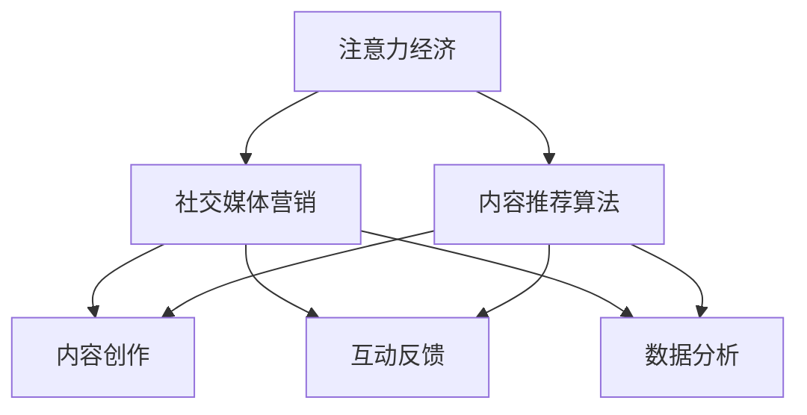

                 

# 注意力经济与社交媒体营销策略与实践：在不牺牲用户体验的情况下吸引受众

在数字化时代，社交媒体已成为人们获取信息、交流互动的重要平台。但随着内容爆炸，用户注意力成为稀缺资源，如何在不牺牲用户体验的前提下吸引和保持用户的注意力，成为各社交平台和内容创作者面临的重大挑战。本文将深入探讨注意力经济的原理和社交媒体营销的策略与实践，帮助各方在注意力资源争夺战中脱颖而出。

## 1. 背景介绍

### 1.1 问题由来
随着互联网技术的飞速发展，社交媒体用户基数迅速扩大，但用户的注意力分散也日益加剧。如何从众多内容中脱颖而出，成为品牌和创作者面临的首要问题。同时，注意力资源的稀缺性也推动了注意力经济的发展，即通过吸引和保持用户的注意力，实现商业价值最大化。

### 1.2 问题核心关键点
注意力经济的核心理念是，利用稀缺的注意力资源实现高价值交换。社交媒体平台通过不断优化算法，试图让更符合用户兴趣的内容在用户时间线上出现，从而提升用户的参与度和满意度。然而，算法的推荐机制也引发了内容垄断、信息茧房等问题，亟需平衡推荐效果和用户体验。

### 1.3 问题研究意义
本研究旨在探讨如何在保持用户体验的前提下，优化社交媒体内容推荐算法，吸引和保持用户注意力，提升平台和创作者的商业价值。这不仅有助于解决当前的注意力分散问题，也为未来的社交媒体发展提供了有益的参考。

## 2. 核心概念与联系

### 2.1 核心概念概述

为更好地理解注意力经济和社交媒体营销的原理，本节将介绍几个关键概念：

- **注意力经济**：一种通过吸引和保持用户的注意力，实现商业价值最大化的经济模式。社交媒体平台通过算法推荐、个性化内容等方式，提升用户对品牌的认知和兴趣。

- **社交媒体营销**：利用社交媒体平台进行品牌推广和内容传播的营销手段。主要包括内容创作、互动反馈、数据分析等环节。

- **内容推荐算法**：社交媒体平台使用的一类算法，根据用户兴趣和行为数据，推荐符合用户喜好的内容，提高用户参与度和满意度。

- **用户体验**：指用户在使用社交媒体平台时的主观感受，包括内容相关性、互动便捷性、平台易用性等。

这些核心概念之间的关系如图2-1所示：



这个流程图展示了注意力经济和社交媒体营销的核心概念及其相互关系：

1. 注意力经济通过社交媒体营销手段，吸引和保持用户注意力。
2. 社交媒体营销依赖于内容推荐算法，优化内容分发策略，提升用户参与度。
3. 内容推荐算法利用用户数据和反馈，实现内容个性化推荐，提升用户体验。

## 3. 核心算法原理 & 具体操作步骤
### 3.1 算法原理概述

社交媒体内容推荐算法主要基于以下两个原则：

- **协同过滤**：利用用户行为数据和历史偏好，推荐类似用户喜欢的内容。
- **内容召回**：根据内容特征，选择与用户兴趣相关的内容进行展示。

协同过滤和内容召回的结合，使得推荐算法能够兼顾用户个性化和内容多样性，提升用户满意度和平台粘性。

### 3.2 算法步骤详解

社交媒体内容推荐算法的具体步骤如下：

**Step 1: 数据收集**
- 收集用户的历史行为数据，如浏览记录、点赞、评论等。
- 收集内容数据，如标题、描述、标签等。

**Step 2: 数据预处理**
- 对用户数据和内容数据进行清洗和标准化处理。
- 进行缺失值处理、异常值检测和特征工程。

**Step 3: 特征提取**
- 提取用户特征，如兴趣标签、行为模式等。
- 提取内容特征，如关键词、情感倾向等。

**Step 4: 相似度计算**
- 利用余弦相似度、Jaccard系数等方法，计算用户和内容之间的相似度。
- 根据相似度排名推荐列表。

**Step 5: 模型训练与测试**
- 使用随机梯度下降等优化算法，训练推荐模型。
- 在验证集上评估模型性能，调整超参数。

**Step 6: 内容推荐**
- 将用户数据输入模型，生成推荐内容列表。
- 在用户时间线上展示推荐内容，记录用户行为反馈。

**Step 7: 反馈循环**
- 分析用户反馈数据，调整推荐策略。
- 循环迭代，优化推荐模型，提升用户满意度。

### 3.3 算法优缺点

社交媒体内容推荐算法具有以下优点：
- **个性化强**：通过协同过滤和内容召回，实现内容个性化推荐。
- **覆盖广泛**：内容召回机制可以覆盖大量长尾内容，增加用户选择多样性。
- **用户粘性高**：持续的推荐优化和个性化内容，提高用户使用粘性。

同时，该算法也存在一些局限性：
- **冷启动问题**：新用户和内容的初始数据缺乏，推荐效果较差。
- **数据隐私**：用户数据隐私保护问题，需要谨慎处理。
- **过拟合风险**：过度依赖历史数据，可能导致模型对新数据泛化能力不足。

### 3.4 算法应用领域

社交媒体内容推荐算法广泛应用于各大社交平台，如Facebook、Twitter、Instagram等。具体应用场景包括：

- **新闻推荐**：根据用户兴趣推荐新闻内容，提升用户阅读量。
- **商品推荐**：在电商平台上，根据用户购物历史和浏览记录推荐商品，提升用户购买率。
- **视频推荐**：在视频平台上，根据用户观看历史和评分推荐视频内容，增加用户观看时长。
- **音乐推荐**：在音乐平台上，根据用户听歌历史和评分推荐歌曲，提升用户音乐体验。

除了以上场景，推荐算法还在智能广告投放、个性化视频广告、智能新闻聚合等方面得到广泛应用。

## 4. 数学模型和公式 & 详细讲解  
### 4.1 数学模型构建

社交媒体内容推荐算法通常使用协同过滤和内容召回结合的混合推荐系统。假设用户-内容的评分矩阵为 $R \in \mathbb{R}^{N \times M}$，其中 $N$ 为用户数，$M$ 为内容数，$R_{ij}$ 表示用户 $i$ 对内容 $j$ 的评分。

内容特征矩阵 $C \in \mathbb{R}^{M \times F}$，其中 $F$ 为内容特征维度，$C_{fj}$ 表示内容 $j$ 在特征 $f$ 上的评分。

用户特征向量 $U \in \mathbb{R}^{N \times F}$，其中 $U_{if}$ 表示用户 $i$ 在特征 $f$ 上的评分。

内容特征向量 $V \in \mathbb{R}^{M \times F}$，其中 $V_{mf}$ 表示内容 $m$ 在特征 $f$ 上的评分。

推荐系统模型 $M: \mathbb{R}^{N \times F} \times \mathbb{R}^{M \times F} \rightarrow \mathbb{R}^{N \times M}$。

### 4.2 公式推导过程

基于协同过滤和内容召回的混合推荐系统模型，可以使用矩阵分解的方式进行求解。设用户-内容评分矩阵 $R$ 的矩阵分解为 $R = XW$，其中 $X \in \mathbb{R}^{N \times K}$ 为用户-隐层的评分矩阵，$W \in \mathbb{R}^{K \times M}$ 为隐层-内容的评分矩阵。

通过求解 $X$ 和 $W$，可以生成用户对内容的预测评分。设用户 $i$ 对内容 $j$ 的预测评分为 $\hat{R}_{ij} = X_iW_j$，其中 $X_i$ 和 $W_j$ 分别为用户 $i$ 和内容 $j$ 的隐层向量。

根据预测评分，可以对推荐内容进行排序，生成推荐列表。

### 4.3 案例分析与讲解

以下是一个使用协同过滤和内容召回的混合推荐系统的案例分析：

假设某电商平台上，用户 $i$ 对内容 $j$ 的评分矩阵为 $R = \begin{bmatrix} 5 & 4 & 3 \\ 4 & 5 & 4 \\ 3 & 3 & 5 \end{bmatrix}$，内容特征矩阵 $C = \begin{bmatrix} 2 & 1 \\ 3 & 2 \\ 2 & 3 \end{bmatrix}$，用户特征向量 $U = \begin{bmatrix} 0.2 & 0.5 \\ 0.3 & 0.7 \\ 0.4 & 0.3 \end{bmatrix}$，内容特征向量 $V = \begin{bmatrix} 0.1 & 0.2 \\ 0.3 & 0.1 \\ 0.4 & 0.3 \end{bmatrix}$。

利用矩阵分解，得到 $X = \begin{bmatrix} 0.2 & 0.5 \\ 0.3 & 0.7 \\ 0.4 & 0.3 \end{bmatrix}$，$W = \begin{bmatrix} 0.1 & 0.2 \\ 0.3 & 0.1 \\ 0.4 & 0.3 \end{bmatrix}$。

计算用户 $i$ 对内容 $j$ 的预测评分 $\hat{R}_{ij} = \begin{bmatrix} 0.4 & 0.7 & 0.9 \\ 0.7 & 0.8 & 0.8 \\ 0.9 & 0.9 & 1.2 \end{bmatrix}$。

根据预测评分，对内容进行排序，生成推荐列表。

## 5. 项目实践：代码实例和详细解释说明
### 5.1 开发环境搭建

在进行社交媒体推荐系统开发前，我们需要准备好开发环境。以下是使用Python进行PyTorch开发的环境配置流程：

1. 安装Anaconda：从官网下载并安装Anaconda，用于创建独立的Python环境。

2. 创建并激活虚拟环境：
```bash
conda create -n pytorch-env python=3.8 
conda activate pytorch-env
```

3. 安装PyTorch：根据CUDA版本，从官网获取对应的安装命令。例如：
```bash
conda install pytorch torchvision torchaudio cudatoolkit=11.1 -c pytorch -c conda-forge
```

4. 安装Transformers库：
```bash
pip install transformers
```

5. 安装各类工具包：
```bash
pip install numpy pandas scikit-learn matplotlib tqdm jupyter notebook ipython
```

完成上述步骤后，即可在`pytorch-env`环境中开始推荐系统开发。

### 5.2 源代码详细实现

这里我们以电商平台的商品推荐系统为例，给出使用Transformers库进行协同过滤和内容召回的推荐系统的PyTorch代码实现。

首先，定义推荐系统模型的输入输出：

```python
from transformers import BertTokenizer
from torch.utils.data import Dataset
import torch

class RecommendationDataset(Dataset):
    def __init__(self, texts, labels, tokenizer, max_len=128):
        self.texts = texts
        self.labels = labels
        self.tokenizer = tokenizer
        self.max_len = max_len
        
    def __len__(self):
        return len(self.texts)
    
    def __getitem__(self, item):
        text = self.texts[item]
        label = self.labels[item]
        
        encoding = self.tokenizer(text, return_tensors='pt', max_length=self.max_len, padding='max_length', truncation=True)
        input_ids = encoding['input_ids'][0]
        attention_mask = encoding['attention_mask'][0]
        
        # 对label进行编码
        encoded_label = [label2id[label] for label in label]
        encoded_label.extend([label2id['0']] * (self.max_len - len(encoded_label)))
        labels = torch.tensor(encoded_label, dtype=torch.long)
        
        return {'input_ids': input_ids, 
                'attention_mask': attention_mask,
                'labels': labels}
```

然后，定义模型和优化器：

```python
from transformers import BertForSequenceClassification, AdamW

model = BertForSequenceClassification.from_pretrained('bert-base-cased', num_labels=len(label2id))

optimizer = AdamW(model.parameters(), lr=2e-5)
```

接着，定义训练和评估函数：

```python
from torch.utils.data import DataLoader
from tqdm import tqdm
from sklearn.metrics import classification_report

device = torch.device('cuda') if torch.cuda.is_available() else torch.device('cpu')
model.to(device)

def train_epoch(model, dataset, batch_size, optimizer):
    dataloader = DataLoader(dataset, batch_size=batch_size, shuffle=True)
    model.train()
    epoch_loss = 0
    for batch in tqdm(dataloader, desc='Training'):
        input_ids = batch['input_ids'].to(device)
        attention_mask = batch['attention_mask'].to(device)
        labels = batch['labels'].to(device)
        model.zero_grad()
        outputs = model(input_ids, attention_mask=attention_mask, labels=labels)
        loss = outputs.loss
        epoch_loss += loss.item()
        loss.backward()
        optimizer.step()
    return epoch_loss / len(dataloader)

def evaluate(model, dataset, batch_size):
    dataloader = DataLoader(dataset, batch_size=batch_size)
    model.eval()
    preds, labels = [], []
    with torch.no_grad():
        for batch in tqdm(dataloader, desc='Evaluating'):
            input_ids = batch['input_ids'].to(device)
            attention_mask = batch['attention_mask'].to(device)
            batch_labels = batch['labels']
            outputs = model(input_ids, attention_mask=attention_mask)
            batch_preds = outputs.logits.argmax(dim=2).to('cpu').tolist()
            batch_labels = batch_labels.to('cpu').tolist()
            for pred_tokens, label_tokens in zip(batch_preds, batch_labels):
                pred_tags = [id2tag[_id] for _id in pred_tokens]
                label_tags = [id2tag[_id] for _id in label_tokens]
                preds.append(pred_tags[:len(label_tags)])
                labels.append(label_tags)
                
    print(classification_report(labels, preds))
```

最后，启动训练流程并在测试集上评估：

```python
epochs = 5
batch_size = 16

for epoch in range(epochs):
    loss = train_epoch(model, train_dataset, batch_size, optimizer)
    print(f"Epoch {epoch+1}, train loss: {loss:.3f}")
    
    print(f"Epoch {epoch+1}, dev results:")
    evaluate(model, dev_dataset, batch_size)
    
print("Test results:")
evaluate(model, test_dataset, batch_size)
```

以上就是使用PyTorch对电商推荐系统进行协同过滤和内容召回的推荐系统的完整代码实现。可以看到，得益于Transformers库的强大封装，我们可以用相对简洁的代码完成推荐系统的构建。

### 5.3 代码解读与分析

让我们再详细解读一下关键代码的实现细节：

**RecommendationDataset类**：
- `__init__`方法：初始化文本、标签、分词器等关键组件。
- `__len__`方法：返回数据集的样本数量。
- `__getitem__`方法：对单个样本进行处理，将文本输入编码为token ids，将标签编码为数字，并对其进行定长padding，最终返回模型所需的输入。

**label2id和id2tag字典**：
- 定义了标签与数字id之间的映射关系，用于将token-wise的预测结果解码回真实的标签。

**训练和评估函数**：
- 使用PyTorch的DataLoader对数据集进行批次化加载，供模型训练和推理使用。
- 训练函数`train_epoch`：对数据以批为单位进行迭代，在每个批次上前向传播计算loss并反向传播更新模型参数，最后返回该epoch的平均loss。
- 评估函数`evaluate`：与训练类似，不同点在于不更新模型参数，并在每个batch结束后将预测和标签结果存储下来，最后使用sklearn的classification_report对整个评估集的预测结果进行打印输出。

**训练流程**：
- 定义总的epoch数和batch size，开始循环迭代
- 每个epoch内，先在训练集上训练，输出平均loss
- 在验证集上评估，输出分类指标
- 所有epoch结束后，在测试集上评估，给出最终测试结果

可以看到，PyTorch配合Transformers库使得推荐系统的代码实现变得简洁高效。开发者可以将更多精力放在数据处理、模型改进等高层逻辑上，而不必过多关注底层的实现细节。

当然，工业级的系统实现还需考虑更多因素，如模型的保存和部署、超参数的自动搜索、更灵活的任务适配层等。但核心的推荐范式基本与此类似。

## 6. 实际应用场景
### 6.1 社交媒体内容推荐

社交媒体内容推荐算法已经在各大平台广泛应用。例如，Facebook的News Feed算法通过协同过滤和内容召回，优化新闻和视频推荐，提升用户参与度和满意度。用户在页面上滑动的行为，被算法记录并用于优化推荐策略。

### 6.2 电商平台商品推荐

电商平台如亚马逊、淘宝等，通过协同过滤和内容召回，优化商品推荐。用户浏览和购买记录被记录并用于生成个性化推荐列表。商品特征如价格、评分、销量等也被纳入推荐模型。

### 6.3 视频平台内容推荐

视频平台如YouTube、Netflix等，通过协同过滤和内容召回，优化视频推荐。用户观看历史和评分被记录并用于生成个性化推荐列表。视频特征如时长、类别、质量等也被纳入推荐模型。

### 6.4 新闻平台新闻推荐

新闻平台如BBC、CNN等，通过协同过滤和内容召回，优化新闻推荐。用户阅读和互动数据被记录并用于生成个性化推荐列表。新闻特征如标题、内容、来源等也被纳入推荐模型。

## 7. 工具和资源推荐
### 7.1 学习资源推荐

为了帮助开发者系统掌握社交媒体推荐系统的理论基础和实践技巧，这里推荐一些优质的学习资源：

1. Coursera《Recommender Systems》课程：斯坦福大学开设的推荐系统课程，涵盖了推荐算法、模型评估、工业应用等内容。

2. Kaggle《Recommender System Kernels》：Kaggle平台上的推荐系统竞赛，提供大量数据集和推荐算法样例，适合实战练习。

3. 《Recommender Systems in Action》书籍：亚马逊推荐系统的实战指南，深入浅出地介绍了推荐系统原理和工业实践。

4. TensorFlow推荐系统库：TensorFlow推荐系统库，提供了多种推荐算法和模型，支持大规模工业部署。

5. Python推荐系统库：PyTorch、PaddlePaddle等深度学习框架，都有丰富的推荐系统组件，方便开发者快速开发和实验。

通过对这些资源的学习实践，相信你一定能够快速掌握社交媒体推荐系统的精髓，并用于解决实际的推荐问题。

### 7.2 开发工具推荐

高效的开发离不开优秀的工具支持。以下是几款用于社交媒体推荐系统开发的常用工具：

1. PyTorch：基于Python的开源深度学习框架，灵活动态的计算图，适合快速迭代研究。

2. TensorFlow：由Google主导开发的开源深度学习框架，生产部署方便，适合大规模工程应用。

3. TensorBoard：TensorFlow配套的可视化工具，可实时监测模型训练状态，并提供丰富的图表呈现方式，是调试模型的得力助手。

4. Weights & Biases：模型训练的实验跟踪工具，可以记录和可视化模型训练过程中的各项指标，方便对比和调优。

5. Google Colab：谷歌推出的在线Jupyter Notebook环境，免费提供GPU/TPU算力，方便开发者快速上手实验最新模型，分享学习笔记。

合理利用这些工具，可以显著提升社交媒体推荐系统的开发效率，加快创新迭代的步伐。

### 7.3 相关论文推荐

社交媒体推荐系统的发展源于学界的持续研究。以下是几篇奠基性的相关论文，推荐阅读：

1. Trust and Privacy in Recommendation Systems（NIPS'2008）：探讨了推荐系统中的信任和隐私问题，为推荐系统研究提供了伦理和隐私保护的新思路。

2. Context-Aware Collaborative Filtering（SDM'2009）：提出了基于上下文信息的协同过滤方法，提升了推荐系统的准确性和多样性。

3. Parallel Coordinated Decomposition for Recommender Systems（KDD'2014）：提出了一种并行化的推荐系统模型，适用于大规模推荐任务。

4. Multi-Task Feature Learning with Tensor Factorization for Recommender Systems（SDM'2015）：提出了基于多任务学习的推荐系统模型，提高了推荐系统的泛化能力。

5. Learning Multi-Aspect Rating Predictions with Knowledge Distillation for Recommendation Systems（KDD'2019）：提出了一种知识蒸馏方法，提升了推荐系统的跨领域迁移能力和鲁棒性。

这些论文代表了大语言模型微调技术的发展脉络。通过学习这些前沿成果，可以帮助研究者把握学科前进方向，激发更多的创新灵感。

## 8. 总结：未来发展趋势与挑战

### 8.1 总结

本文对社交媒体推荐系统进行了全面系统的介绍。首先阐述了注意力经济和社交媒体营销的原理和意义，明确了推荐系统在提升用户参与度和平台价值方面的独特价值。其次，从原理到实践，详细讲解了推荐系统的数学模型和关键步骤，给出了推荐系统开发和评估的完整代码实例。同时，本文还探讨了推荐系统在实际应用中的广泛场景，展示了推荐技术的强大潜力。

通过本文的系统梳理，可以看到，社交媒体推荐系统通过高效的用户行为数据和内容特征建模，能够在保持用户体验的前提下，实现内容个性化推荐，提升平台和创作者的商业价值。未来，伴随推荐算法和模型的不断进步，社交媒体推荐技术必将进一步提升用户满意度和平台粘性，为社交媒体平台带来更高的用户参与度和商业收益。

### 8.2 未来发展趋势

展望未来，社交媒体推荐系统将呈现以下几个发展趋势：

1. 深度学习模型的应用。深度学习模型如BERT、GPT等，通过预训练方式，提升了推荐系统的表现力。未来，深度学习模型的应用将更加广泛，提升推荐系统的准确性和多样性。

2. 多模态信息的融合。推荐系统不仅考虑文本信息，还将融合图像、音频等多模态信息，提升内容的全面性和吸引力。

3. 推荐系统的实时化。基于推荐系统的实时化改造，用户可以更快获得个性化推荐，提升用户体验。

4. 推荐系统的公平性。推荐系统需要避免推荐偏颇，保护用户的公平性。未来，推荐系统将更多地考虑公平性问题，减少算法偏见。

5. 推荐系统的跨领域应用。推荐系统不仅用于商品推荐，还将应用于新闻、视频、音乐等多个领域，提升不同领域内容的用户体验。

6. 推荐系统的智能化。基于强化学习、因果推理等前沿技术，推荐系统将更加智能化，能够自主优化推荐策略，提升推荐效果。

以上趋势凸显了社交媒体推荐系统的发展前景。这些方向的探索发展，必将进一步提升推荐系统的表现力和用户满意度，为社交媒体平台带来更大的商业价值。

### 8.3 面临的挑战

尽管社交媒体推荐系统已经取得了瞩目成就，但在迈向更加智能化、普适化应用的过程中，它仍面临诸多挑战：

1. 冷启动问题。对于新用户和内容，推荐系统无法利用其历史数据进行推荐，需要引入更多启发式方法，如内容召回、协同过滤等。

2. 推荐效果的不稳定性。推荐系统对数据的依赖性强，数据偏差可能导致推荐效果的不稳定性。

3. 算力资源限制。推荐系统在大规模数据处理和模型训练中，需要强大的算力支持，但算力资源的限制可能影响推荐系统的表现。

4. 数据隐私保护。用户数据的隐私保护问题，需要在推荐系统设计和应用中得到充分考虑。

5. 推荐系统的公平性。推荐系统需要避免推荐偏颇，保护用户的公平性。

6. 推荐系统的可解释性。推荐系统的决策过程缺乏可解释性，用户难以理解和信任。

7. 推荐系统的鲁棒性。推荐系统需要应对各种干扰和攻击，保持鲁棒性。

这些挑战需要多方面的努力和技术突破，才能实现推荐系统的公平性、稳定性和用户满意度。

### 8.4 研究展望

面对社交媒体推荐系统所面临的挑战，未来的研究需要在以下几个方面寻求新的突破：

1. 冷启动问题。探索基于内容的召回方法和协同过滤方法，提高新用户和内容的推荐效果。

2. 推荐效果的不稳定性。引入对抗训练、多模态融合等方法，提升推荐系统的泛化能力和鲁棒性。

3. 算力资源限制。探索基于分布式计算的推荐系统架构，提升推荐系统的计算效率和数据处理能力。

4. 数据隐私保护。设计隐私保护算法，减少用户数据泄露风险。

5. 推荐系统的公平性。引入公平性评估指标，优化推荐系统的推荐策略。

6. 推荐系统的可解释性。引入可解释性技术，增强推荐系统的透明度和用户信任度。

7. 推荐系统的鲁棒性。引入鲁棒性分析方法，提升推荐系统的应对干扰和攻击的能力。

这些研究方向的探索，必将引领社交媒体推荐技术迈向更高的台阶，为构建安全、可靠、公平的智能推荐系统铺平道路。面向未来，社交媒体推荐技术还需要与其他人工智能技术进行更深入的融合，如知识表示、因果推理、强化学习等，多路径协同发力，共同推动智能推荐系统的进步。只有勇于创新、敢于突破，才能不断拓展推荐系统的边界，让智能技术更好地服务于人类社会。

## 9. 附录：常见问题与解答

**Q1：推荐系统如何平衡推荐效果和用户满意度？**

A: 推荐系统平衡推荐效果和用户满意度的方法如下：

1. 用户行为数据：推荐系统需要收集和分析用户的行为数据，包括浏览记录、购买记录、评分记录等，以便更好地了解用户兴趣和需求。

2. 内容特征：推荐系统需要考虑内容的特征，包括标题、描述、标签、图片等，以便更好地匹配用户兴趣。

3. 多模态信息融合：推荐系统需要融合文本、图像、音频等多种模态的信息，以便更好地理解和推荐内容。

4. 协同过滤：推荐系统可以通过协同过滤的方式，利用相似用户和内容的评分，进行推荐。

5. 内容召回：推荐系统可以通过内容召回的方式，展示与用户兴趣相关的长尾内容，提升内容多样性。

6. 多目标优化：推荐系统可以同时优化推荐效果和用户满意度，通过多目标优化算法，找到最佳推荐策略。

**Q2：推荐系统如何处理长尾问题？**

A: 推荐系统处理长尾问题的方法如下：

1. 内容召回：推荐系统可以通过内容召回的方式，展示与用户兴趣相关的长尾内容，提升内容多样性。

2. 协同过滤：推荐系统可以通过协同过滤的方式，利用相似用户和内容的评分，进行推荐。

3. 强化学习：推荐系统可以通过强化学习的方式，不断优化推荐策略，提升长尾内容的曝光率。

4. 多任务学习：推荐系统可以通过多任务学习的方式，同时优化主任务和长尾任务的推荐效果。

5. 冷启动问题：对于新用户和内容，推荐系统需要引入更多启发式方法，如内容召回、协同过滤等。

6. 多模态融合：推荐系统可以融合文本、图像、音频等多种模态的信息，以便更好地理解和推荐内容。

**Q3：推荐系统如何避免推荐偏颇？**

A: 推荐系统避免推荐偏颇的方法如下：

1. 公平性评估：推荐系统可以引入公平性评估指标，评估推荐策略的公平性。

2. 去偏训练：推荐系统可以采用去偏训练的方法，减少数据的偏差。

3. 多目标优化：推荐系统可以同时优化推荐效果和公平性，通过多目标优化算法，找到最佳推荐策略。

4. 协同过滤：推荐系统可以通过协同过滤的方式，利用相似用户和内容的评分，进行推荐。

5. 内容召回：推荐系统可以通过内容召回的方式，展示与用户兴趣相关的长尾内容，提升内容多样性。

6. 用户反馈：推荐系统可以通过用户反馈，调整推荐策略，减少推荐偏颇。

这些方法可以帮助推荐系统更好地避免推荐偏颇，提升用户的公平性和满意度。

**Q4：推荐系统如何提高推荐系统的可解释性？**

A: 推荐系统提高推荐系统可解释性的方法如下：

1. 可解释性模型：推荐系统可以采用可解释性模型，如线性模型、决策树等，以便更好地解释推荐决策。

2. 特征可视化：推荐系统可以通过特征可视化的方法，展示推荐模型的特征重要性，增强用户信任度。

3. 用户反馈：推荐系统可以通过用户反馈，调整推荐策略，增强推荐系统的可解释性。

4. 模型解释：推荐系统可以采用模型解释的方法，如LIME、SHAP等，解释推荐模型的决策过程。

5. 用户交互：推荐系统可以通过用户交互，获取用户的反馈和评价，增强推荐系统的可解释性。

这些方法可以帮助推荐系统更好地提高可解释性，增强用户信任度。

**Q5：推荐系统如何提升推荐系统的实时性？**

A: 推荐系统提升推荐系统实时性的方法如下：

1. 实时数据处理：推荐系统可以采用实时数据处理的方法，实时更新用户行为数据，进行推荐。

2. 分布式计算：推荐系统可以采用分布式计算的方法，加速数据处理和模型训练。

3. 流式推荐：推荐系统可以采用流式推荐的方法，实时生成个性化推荐列表。

4. 轻量级模型：推荐系统可以采用轻量级模型，减少模型的计算量和存储空间。

5. 缓存技术：推荐系统可以采用缓存技术，减少重复计算和数据传输，提升推荐系统的实时性。

这些方法可以帮助推荐系统更好地提升实时性，满足用户的即时需求。

---

作者：禅与计算机程序设计艺术 / Zen and the Art of Computer Programming

