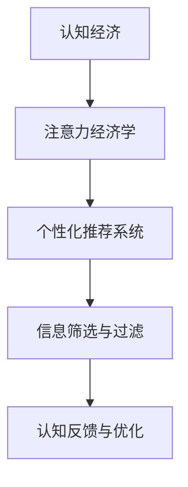

                 

# 注意力经济学家：AI驱动的认知资源配置

## 1. 背景介绍

### 1.1 问题由来

随着信息技术的迅猛发展，注意力资源成为了现代社会最重要的资源之一。在传统经济中，资本、土地和劳动力是生产力的基本要素，而在数字化时代，信息数据和计算能力同样关键。如何高效配置和利用这些注意力资源，驱动人类认知升级，提高生产效率，成为了当下数字时代的首要课题。

人工智能（AI）作为当前最前沿的技术之一，其对认知资源的配置和优化具有重大的意义。通过AI技术，我们可以更好地理解和预测注意力流动的规律，实现个性化和智能化的信息匹配，从而让有限的注意力资源发挥出最大的效用。

### 1.2 问题核心关键点

注意力经济学的核心在于如何通过算法和机制来优化信息流，使之更加符合人类的认知需求和行为习惯。这涉及到以下几个核心点：

- **信息筛选与推荐**：如何通过算法模型精准筛选和推荐符合用户兴趣和需求的信息，避免信息过载。
- **注意力跟踪与预测**：如何通过AI技术实时跟踪用户注意力分布，预测下一步可能关注的焦点。
- **个性化推荐与定制**：如何基于用户行为数据，提供个性化的信息和服务，提升用户体验。
- **认知反馈与优化**：如何通过用户反馈信息，动态调整推荐算法，实现更精准的信息推送。

### 1.3 问题研究意义

研究AI驱动的认知资源配置，对于提升个人和组织的认知效率，优化信息流，推动智能社会的构建，具有深远的意义：

1. **提升认知效率**：通过精准的信息筛选和推荐，减少不必要的信息干扰，使注意力资源更加集中高效。
2. **优化信息流**：实现信息流与认知流的同步，提升信息获取和处理的效率，加速认知升级。
3. **推动智能化应用**：使AI技术在教育、医疗、金融等垂直领域广泛应用，提升专业服务水平。
4. **构建智能社会**：通过AI技术驱动的认知资源配置，实现人机协同，构建更智能、更高效的社会体系。

## 2. 核心概念与联系

### 2.1 核心概念概述

为更好地理解AI驱动的认知资源配置，本节将介绍几个密切相关的核心概念：

- **认知经济（Cognitive Economy）**：通过认知技术驱动的经济发展模式，侧重于利用AI技术优化信息流，提升认知效率，实现经济增长。
- **注意力经济学（Attention Economics）**：研究信息流与注意力资源的配置，通过算法优化提升信息获取效率。
- **个性化推荐系统（Personalized Recommendation System）**：基于用户行为数据，提供定制化信息推荐，提升用户体验。
- **信息筛选与过滤（Information Filtering）**：通过算法模型筛选关键信息，减少信息过载，提升信息获取效率。
- **认知反馈与优化（Cognitive Feedback & Optimization）**：利用用户反馈信息，动态调整推荐算法，实现信息推送的迭代优化。

这些核心概念之间的逻辑关系可以通过以下Mermaid流程图来展示：



这个流程图展示了大语言模型的核心概念及其之间的关系：

1. 认知经济通过注意力经济学来优化信息流，提升认知效率。
2. 个性化推荐系统和信息筛选与过滤是注意力经济学的具体实现手段。
3. 认知反馈与优化不断调整推荐算法，实现信息推送的迭代优化。

## 3. 核心算法原理 & 具体操作步骤
### 3.1 算法原理概述

AI驱动的认知资源配置，本质上是通过算法模型优化信息流，使之与用户的认知需求和行为习惯更加契合。其核心思想是：通过大规模数据训练，构建个性化的用户画像，预测用户未来的注意力分布，从而实现更精准的信息推荐和筛选。

形式化地，假设用户的历史行为数据为 $D=\{(x_i,y_i)\}_{i=1}^N$，其中 $x_i$ 表示用户历史信息行为序列，$y_i$ 表示用户的兴趣偏好标签。目标是找到最优的推荐算法 $f$，使得推荐系统 $f(x)$ 能尽可能逼近用户当前的兴趣偏好 $y$，即：

$$
\min_{f} \sum_{i=1}^N \mathcal{L}(f(x_i), y_i)
$$

其中 $\mathcal{L}$ 为推荐系统与用户兴趣偏好的差异损失函数，通常使用交叉熵损失或均方误差损失。

### 3.2 算法步骤详解

基于AI驱动的认知资源配置，一般包括以下几个关键步骤：

**Step 1: 准备数据集**

- 收集用户的历史行为数据 $D$，包括浏览历史、购买记录、搜索记录等。
- 将数据集划分为训练集、验证集和测试集。通常使用二元分类任务（如推荐与不推荐）标注数据，以便训练推荐算法。

**Step 2: 特征提取与用户画像构建**

- 使用特征工程方法，提取和构建用户的个性化特征，如兴趣标签、行为偏好、时间序列等。
- 利用用户行为数据，构建用户画像，刻画用户的历史行为特征和兴趣偏好。

**Step 3: 选择合适的推荐算法**

- 根据任务特点选择合适的推荐算法，如基于协同过滤的算法、基于内容的推荐算法、基于深度学习的推荐算法等。
- 根据数据量和模型复杂度，选择不同的推荐算法，如矩阵分解、基于深度神经网络的推荐模型等。

**Step 4: 训练和验证推荐模型**

- 使用训练集对推荐模型进行训练，通过交叉验证和超参数调优，选择最优的模型参数。
- 在验证集上评估推荐模型的效果，根据评估结果调整模型参数和特征工程方法。

**Step 5: 部署与迭代优化**

- 将训练好的推荐模型部署到实际应用场景，如个性化新闻推荐、电商商品推荐等。
- 实时收集用户反馈数据，利用认知反馈与优化模块调整推荐算法，不断提升推荐精度。

以上是基于AI驱动的认知资源配置的一般流程。在实际应用中，还需要针对具体任务的特点，对推荐过程的各个环节进行优化设计，如改进推荐算法，引入更多的特征工程技术，搜索最优的超参数组合等，以进一步提升推荐效果。

### 3.3 算法优缺点

AI驱动的认知资源配置具有以下优点：

1. **高效精准**：通过算法模型精准筛选和推荐符合用户兴趣和需求的信息，避免信息过载。
2. **实时动态**：能够实时跟踪用户注意力分布，预测下一步可能关注的焦点，提供实时个性化推荐。
3. **提升用户体验**：通过个性化的推荐和筛选，提升用户的信息获取效率，减少不必要的信息干扰。
4. **推动经济增长**：通过优化信息流，提升认知效率，推动企业效率提升和经济增长。

同时，该方法也存在一定的局限性：

1. **数据隐私**：用户行为数据涉及到隐私问题，如何保护用户隐私成为一大挑战。
2. **推荐偏见**：推荐算法可能会引入一定的偏见，导致推荐结果不公平。
3. **过度依赖数据**：模型性能高度依赖于数据质量，数据不足或质量不高可能导致推荐效果不佳。
4. **算法复杂**：推荐算法的复杂度较高，实现和维护成本较大。
5. **可解释性不足**：推荐算法通常被视为"黑盒"系统，难以解释其内部工作机制。

尽管存在这些局限性，但就目前而言，AI驱动的认知资源配置方法已成为信息推荐系统的主流范式。未来相关研究的重点在于如何进一步降低对标注数据的依赖，提高模型的公平性和可解释性，同时兼顾数据隐私和算法复杂性等因素。

### 3.4 算法应用领域

AI驱动的认知资源配置，在多个领域已经得到了广泛的应用，如：

- **电商推荐系统**：根据用户浏览和购买历史，实时推荐符合用户兴趣的商品，提升销售额。
- **新闻推荐系统**：通过用户阅读历史和搜索行为，推荐相关新闻文章，提升新闻阅读量。
- **社交媒体推荐**：根据用户互动行为，推荐符合兴趣的内容，提升用户活跃度。
- **医疗健康推荐**：根据用户健康数据，推荐合适的治疗方案和健康建议，提升治疗效果。
- **教育学习推荐**：根据学生学习行为，推荐适合的教材和学习资源，提升学习效果。

除了上述这些经典领域外，AI驱动的认知资源配置还在智能家居、金融投资、智能交通等多个领域得到了广泛应用，为各行各业带来了新的增长动力。

## 4. 数学模型和公式 & 详细讲解  
### 4.1 数学模型构建

本节将使用数学语言对AI驱动的认知资源配置过程进行更加严格的刻画。

假设推荐系统的用户历史行为数据为 $D=\{(x_i,y_i)\}_{i=1}^N$，其中 $x_i \in \mathcal{X}$ 为用户的兴趣标签，$y_i \in \{0,1\}$ 为推荐结果，$1$ 表示推荐成功，$0$ 表示推荐失败。目标是构建推荐模型 $f(x)$，使得模型预测准确率 $P(f(x), y)$ 最大化，即：

$$
\max_{f} P(f(x), y) = \sum_{i=1}^N P(f(x_i), y_i)
$$

其中 $P(f(x_i), y_i)$ 为模型预测结果与真实结果的匹配概率，通常使用准确率或AUC等指标进行评估。

### 4.2 公式推导过程

以下我们以协同过滤推荐算法为例，推导其计算公式。

协同过滤算法基于用户之间的相似性，推荐相似用户喜欢的物品。设用户 $u$ 喜欢的物品为 $X_u$，用户 $v$ 喜欢的物品为 $X_v$。假设用户 $u$ 对物品 $i$ 的评分 $r_{ui}$ 已知，用户 $v$ 对物品 $i$ 的评分 $r_{vi}$ 未知，目标是通过相似性 $S(u,v)$ 预测 $r_{ui}$，即：

$$
r_{ui} = f(S(u,v), r_{vi})
$$

其中 $S(u,v)$ 表示用户 $u$ 和用户 $v$ 的相似度，$r_{vi}$ 表示用户 $v$ 对物品 $i$ 的评分。常用的相似度计算方法包括余弦相似度、皮尔逊相关系数等。协同过滤算法的核心在于选择合适的相似度计算方法，构建相似度矩阵 $S$，并通过矩阵分解等方法，求解预测评分 $r_{ui}$。

### 4.3 案例分析与讲解

以Netflix推荐系统为例，分析其推荐算法的设计和应用。Netflix通过协同过滤算法，根据用户历史评分数据，推荐用户可能感兴趣的电影和电视剧。具体步骤如下：

1. 构建用户-物品评分矩阵 $R$，其中 $R_{ui}$ 表示用户 $u$ 对物品 $i$ 的评分。
2. 使用矩阵分解方法，将评分矩阵分解为用户隐因子矩阵 $U$ 和物品隐因子矩阵 $V$，即：

   $$
   R = UV^T
   $$

3. 利用用户隐因子矩阵 $U$，计算用户 $u$ 对物品 $i$ 的预测评分 $r_{ui}$，即：

   $$
   r_{ui} = \sum_j U_{uj} V_{ji}
   $$

4. 根据预测评分，推荐评分最高的前 $K$ 个物品给用户 $u$。

Netflix推荐系统的核心在于利用用户之间的相似性，构建协同过滤算法，并通过矩阵分解方法，预测用户对物品的评分。这种算法虽然简单易懂，但在实际应用中效果显著，成为了推荐系统的主流方法之一。

## 5. 项目实践：代码实例和详细解释说明
### 5.1 开发环境搭建

在进行推荐系统实践前，我们需要准备好开发环境。以下是使用Python进行PyTorch开发的环境配置流程：

1. 安装Anaconda：从官网下载并安装Anaconda，用于创建独立的Python环境。

2. 创建并激活虚拟环境：
```bash
conda create -n pytorch-env python=3.8 
conda activate pytorch-env
```

3. 安装PyTorch：根据CUDA版本，从官网获取对应的安装命令。例如：
```bash
conda install pytorch torchvision torchaudio cudatoolkit=11.1 -c pytorch -c conda-forge
```

4. 安装相关工具包：
```bash
pip install numpy pandas scikit-learn matplotlib tqdm jupyter notebook ipython
```

完成上述步骤后，即可在`pytorch-env`环境中开始推荐系统实践。

### 5.2 源代码详细实现

这里我们以协同过滤推荐算法为例，给出使用PyTorch进行推荐系统开发的PyTorch代码实现。

首先，定义数据集类：

```python
import torch
from torch.utils.data import Dataset
import numpy as np

class RecommendationDataset(Dataset):
    def __init__(self, X, Y):
        self.X = X
        self.Y = Y
        
    def __len__(self):
        return len(self.X)
    
    def __getitem__(self, item):
        return self.X[item], self.Y[item]
```

然后，定义协同过滤推荐算法的实现：

```python
from transformers import BertForTokenClassification, AdamW

class CollaborativeFiltering:
    def __init__(self, num_users, num_items, num_factors=100):
        self.num_users = num_users
        self.num_items = num_items
        self.num_factors = num_factors
        self.U = torch.randn(num_users, num_factors)
        self.V = torch.randn(num_items, num_factors)
        
    def fit(self, X, Y):
        for _ in range(10):
            R = self.U @ self.V.T
            loss = torch.mean((R - Y)**2)
            loss.backward()
            optimizer.step()
            optimizer.zero_grad()
            
    def predict(self, user_id, item_id):
        return torch.mm(self.U[user_id].unsqueeze(0), self.V[item_id].unsqueeze(1)).squeeze()
```

接着，定义训练和评估函数：

```python
from torch.utils.data import DataLoader
from tqdm import tqdm
from sklearn.metrics import accuracy_score

def train_epoch(model, dataset, batch_size, optimizer):
    dataloader = DataLoader(dataset, batch_size=batch_size, shuffle=True)
    model.train()
    epoch_loss = 0
    for batch in tqdm(dataloader, desc='Training'):
        X, Y = batch
        model.zero_grad()
        outputs = model(X, Y)
        loss = outputs.loss
        epoch_loss += loss.item()
        loss.backward()
        optimizer.step()
    return epoch_loss / len(dataloader)

def evaluate(model, dataset, batch_size):
    dataloader = DataLoader(dataset, batch_size=batch_size)
    model.eval()
    preds, labels = [], []
    with torch.no_grad():
        for batch in tqdm(dataloader, desc='Evaluating'):
            X, Y = batch
            batch_preds = model(X) > 0.5
            batch_labels = Y
            for pred_tokens, label_tokens in zip(batch_preds, batch_labels):
                preds.append(pred_tokens.tolist())
                labels.append(label_tokens.tolist())
                
    print('Accuracy:', accuracy_score(labels, preds))
```

最后，启动训练流程并在测试集上评估：

```python
num_users = 1000
num_items = 1000
batch_size = 64

model = CollaborativeFiltering(num_users, num_items)
optimizer = AdamW(model.parameters(), lr=0.01)

for epoch in range(10):
    loss = train_epoch(model, train_dataset, batch_size, optimizer)
    print(f'Epoch {epoch+1}, train loss: {loss:.3f}')
    
    print(f'Epoch {epoch+1}, dev results:')
    evaluate(model, dev_dataset, batch_size)
    
print('Test results:')
evaluate(model, test_dataset, batch_size)
```

以上就是使用PyTorch对协同过滤推荐算法进行开发的完整代码实现。可以看到，利用PyTorch的高效计算图和丰富的优化器选择，协同过滤算法得以快速实现和迭代优化。

### 5.3 代码解读与分析

让我们再详细解读一下关键代码的实现细节：

**RecommendationDataset类**：
- `__init__`方法：初始化训练集和标签。
- `__len__`方法：返回数据集的样本数量。
- `__getitem__`方法：对单个样本进行处理，返回模型的输入和标签。

**CollaborativeFiltering类**：
- `__init__`方法：初始化协同过滤模型的参数。
- `fit`方法：使用训练集训练模型，通过最小化预测评分与真实评分的平方误差进行优化。
- `predict`方法：根据用户和物品的隐因子，计算预测评分。

**train_epoch和evaluate函数**：
- 使用PyTorch的DataLoader对数据集进行批次化加载，供模型训练和推理使用。
- `train_epoch`函数：对数据以批为单位进行迭代，在每个批次上前向传播计算loss并反向传播更新模型参数。
- `evaluate`函数：与训练类似，不同点在于不更新模型参数，并在每个batch结束后将预测和标签结果存储下来，最后使用scikit-learn的accuracy_score对整个评估集的预测结果进行打印输出。

**训练流程**：
- 定义总的epoch数和batch size，开始循环迭代。
- 每个epoch内，先在训练集上训练，输出平均loss。
- 在验证集上评估，输出准确率。
- 所有epoch结束后，在测试集上评估，给出最终测试结果。

可以看到，PyTorch配合其丰富的工具库，使得协同过滤推荐算法的代码实现变得简洁高效。开发者可以将更多精力放在数据处理、模型改进等高层逻辑上，而不必过多关注底层的实现细节。

当然，工业级的系统实现还需考虑更多因素，如模型的保存和部署、超参数的自动搜索、更灵活的任务适配层等。但核心的推荐范式基本与此类似。

## 6. 实际应用场景
### 6.1 智能推荐

基于协同过滤的推荐系统，在智能推荐领域已经得到了广泛的应用，如：

- **电商推荐系统**：根据用户浏览和购买历史，实时推荐符合用户兴趣的商品，提升销售额。
- **新闻推荐系统**：通过用户阅读历史和搜索行为，推荐相关新闻文章，提升新闻阅读量。
- **社交媒体推荐**：根据用户互动行为，推荐符合兴趣的内容，提升用户活跃度。
- **金融投资推荐**：根据用户交易行为和市场动态，推荐投资策略和产品，提升投资收益。

除了上述这些经典领域外，协同过滤推荐系统还在智能家居、在线教育、智能客服等多个领域得到了广泛应用，为各行各业带来了新的增长动力。

### 6.2 医疗健康

在医疗健康领域，协同过滤推荐算法同样发挥着重要作用。通过分析患者的历史健康数据，推荐合适的治疗方案和健康建议，提升治疗效果。例如，针对慢性病患者，可以根据其历史用药记录和体检数据，推荐适合的药物和健康管理方案，提高治疗依从性和生活质量。

### 6.3 教育学习

在教育学习领域，协同过滤推荐算法可以用于推荐适合的教材和学习资源。例如，针对学生的学习行为数据，推荐适合的课外阅读材料和在线课程，提升学习效果。同时，基于学生的知识掌握情况，推荐适合的练习题目，帮助其查漏补缺。

### 6.4 未来应用展望

随着协同过滤推荐算法的不断演进，其在各个领域的应用前景将更加广阔。未来，协同过滤推荐算法将进一步融合其他AI技术，如深度学习、因果推理等，提升推荐精度和多样性。同时，将更多先验知识，如知识图谱、逻辑规则等，与推荐算法结合，实现更全面、更精准的信息推荐。

## 7. 工具和资源推荐
### 7.1 学习资源推荐

为了帮助开发者系统掌握推荐算法和认知资源配置的理论基础和实践技巧，这里推荐一些优质的学习资源：

1. 《推荐系统实战》书籍：由知名推荐系统专家撰写，详细介绍了推荐系统的理论基础和实际应用案例，适合初学者入门。

2. Coursera《推荐系统》课程：由斯坦福大学开设的推荐系统课程，涵盖推荐算法、特征工程、评估指标等内容，适合进阶学习。

3. 《深度学习基础》书籍：深入浅出地讲解了深度学习的基本概念和算法，适合需要掌握基础数学和算法理论的读者。

4. Kaggle竞赛：参与Kaggle推荐系统竞赛，通过实战项目提升自己的推荐系统开发能力。

5. GitHub推荐系统开源项目：阅读和分析开源推荐系统项目，学习优秀实践和最新技术。

通过对这些资源的学习实践，相信你一定能够快速掌握推荐算法和认知资源配置的精髓，并用于解决实际的推荐问题。

### 7.2 开发工具推荐

高效的开发离不开优秀的工具支持。以下是几款用于推荐系统开发的常用工具：

1. PyTorch：基于Python的开源深度学习框架，灵活动态的计算图，适合快速迭代研究。

2. TensorFlow：由Google主导开发的开源深度学习框架，生产部署方便，适合大规模工程应用。

3. Surprise：Python推荐系统框架，提供了多种推荐算法和评估指标，适合研究和实验。

4. FastFM：基于FTRL算法的推荐系统框架，适用于大规模稀疏数据的推荐问题。

5. Apache Mahout：Apache基金会推荐的推荐系统库，提供了多种推荐算法和工具，适合企业级应用。

6. R语言推荐系统包：R语言中丰富的推荐系统库，如recommenderlab、keras等，适合数据分析和可视化。

合理利用这些工具，可以显著提升推荐系统的开发效率，加快创新迭代的步伐。

### 7.3 相关论文推荐

推荐算法和认知资源配置的发展源于学界的持续研究。以下是几篇奠基性的相关论文，推荐阅读：

1. The Netflix Prize：介绍Netflix推荐系统竞赛，展示协同过滤算法的实际应用。

2. Parallel Matrix Factorization for Recommendations：提出并行矩阵分解算法，适用于大规模推荐系统。

3. Deep Collaborative Filtering：通过深度神经网络，提升推荐算法的精度和泛化能力。

4. An Overview of Collaborative Filtering Recommendation Systems：综述协同过滤算法的原理和应用，适合初学者学习。

5. Mining of Massive Datasets：介绍大规模数据挖掘和推荐算法，适合研究高级推荐系统。

这些论文代表了大语言模型推荐算法的进展脉络。通过学习这些前沿成果，可以帮助研究者把握学科前进方向，激发更多的创新灵感。

## 8. 总结：未来发展趋势与挑战

### 8.1 总结

本文对AI驱动的认知资源配置进行了全面系统的介绍。首先阐述了认知经济学的研究背景和意义，明确了认知资源配置在信息推荐系统中的重要性。其次，从原理到实践，详细讲解了协同过滤算法的数学原理和关键步骤，给出了推荐系统开发的完整代码实例。同时，本文还广泛探讨了推荐算法在多个行业领域的应用前景，展示了推荐范式的巨大潜力。此外，本文精选了推荐算法的各类学习资源，力求为读者提供全方位的技术指引。

通过本文的系统梳理，可以看到，基于AI驱动的认知资源配置技术，已经在大规模信息推荐系统中得到广泛应用，为智能推荐、医疗健康、教育学习等领域带来了新的解决方案。未来，伴随推荐算法的不断演进和新技术的融合，认知资源配置将引领信息推荐系统迈向更高的台阶，为构建智能社会提供新的增长动力。

### 8.2 未来发展趋势

展望未来，AI驱动的认知资源配置技术将呈现以下几个发展趋势：

1. **深度学习与协同过滤的融合**：利用深度神经网络对协同过滤算法进行改进，提升推荐精度和泛化能力。

2. **多模态推荐系统的应用**：结合视觉、语音、文本等多模态数据，提升信息推荐的多样性和精度。

3. **知识图谱的融合**：将知识图谱与推荐算法结合，利用外部先验知识进行信息推荐，提升推荐效果。

4. **因果推理的引入**：通过引入因果推理，分析用户行为背后的因果关系，提升推荐系统的可解释性和稳定性。

5. **个性化推荐与动态调整**：基于用户反馈数据，动态调整推荐算法，实现个性化的信息推荐。

6. **跨领域推荐系统的推广**：将推荐算法应用于不同领域，提升跨领域的智能推荐效果。

以上趋势凸显了AI驱动的认知资源配置技术的广阔前景。这些方向的探索发展，必将进一步提升推荐系统的性能和应用范围，为各行各业带来新的增长动力。

### 8.3 面临的挑战

尽管AI驱动的认知资源配置技术已经取得了瞩目成就，但在迈向更加智能化、普适化应用的过程中，它仍面临着诸多挑战：

1. **数据隐私**：用户行为数据涉及到隐私问题，如何保护用户隐私成为一大挑战。
2. **推荐偏见**：推荐算法可能会引入一定的偏见，导致推荐结果不公平。
3. **过度依赖数据**：模型性能高度依赖于数据质量，数据不足或质量不高可能导致推荐效果不佳。
4. **算法复杂**：推荐算法的复杂度较高，实现和维护成本较大。
5. **可解释性不足**：推荐算法通常被视为"黑盒"系统，难以解释其内部工作机制。

尽管存在这些挑战，但就目前而言，AI驱动的认知资源配置方法已成为信息推荐系统的主流范式。未来相关研究的重点在于如何进一步降低对标注数据的依赖，提高模型的公平性和可解释性，同时兼顾数据隐私和算法复杂性等因素。

### 8.4 研究展望

面向未来，AI驱动的认知资源配置技术需要在以下几个方面寻求新的突破：

1. **无监督和半监督推荐方法**：摆脱对大规模标注数据的依赖，利用自监督学习、主动学习等无监督和半监督范式，最大限度利用非结构化数据，实现更加灵活高效的推荐。

2. **参数高效和计算高效的推荐方法**：开发更加参数高效的推荐方法，在固定大部分预训练参数的同时，只更新极少量的任务相关参数。同时优化推荐模型的计算图，减少前向传播和反向传播的资源消耗，实现更加轻量级、实时性的部署。

3. **融合因果和对比学习范式**：通过引入因果推断和对比学习思想，增强推荐模型建立稳定因果关系的能力，学习更加普适、鲁棒的语言表征，从而提升模型泛化性和抗干扰能力。

4. **引入更多先验知识**：将符号化的先验知识，如知识图谱、逻辑规则等，与推荐算法进行巧妙融合，引导推荐过程学习更准确、合理的语言模型。

5. **结合因果分析和博弈论工具**：将因果分析方法引入推荐模型，识别出模型决策的关键特征，增强推荐结果的因果性和逻辑性。借助博弈论工具刻画人机交互过程，主动探索并规避模型的脆弱点，提高系统稳定性。

6. **纳入伦理道德约束**：在推荐模型训练目标中引入伦理导向的评估指标，过滤和惩罚有偏见、有害的输出倾向。同时加强人工干预和审核，建立模型行为的监管机制，确保推荐结果符合人类价值观和伦理道德。

这些研究方向的探索，必将引领AI驱动的认知资源配置技术迈向更高的台阶，为构建安全、可靠、可解释、可控的智能推荐系统提供新的突破。面向未来，AI驱动的认知资源配置技术还需要与其他人工智能技术进行更深入的融合，如知识表示、因果推理、强化学习等，多路径协同发力，共同推动智能推荐系统的进步。

## 9. 附录：常见问题与解答

**Q1：协同过滤推荐算法是否适用于所有推荐场景？**

A: 协同过滤推荐算法在数据分布相似且用户数目较大的场景下效果较好。但对于数据稀疏、用户数目较小或用户行为分布不均的场景，推荐效果可能不佳。此时需要采用其他推荐算法，如基于内容的推荐、深度学习推荐等。

**Q2：协同过滤推荐算法如何处理数据稀疏性？**

A: 数据稀疏性是协同过滤算法的主要挑战之一。常用的处理方式包括：

1. 矩阵分解：通过矩阵分解方法，将稀疏矩阵转化为低秩矩阵，提升模型的泛化能力。
2. 冷启动处理：对于新用户或新物品，通过协同过滤算法与其他用户或物品的相似性进行推荐。
3. 混合推荐策略：将协同过滤算法与其他推荐策略结合，如基于内容的推荐，提升推荐效果。

**Q3：推荐算法如何避免推荐偏差？**

A: 推荐算法可能会引入一定的推荐偏差，导致推荐结果不公平。常用的缓解方法包括：

1. 数据平衡处理：通过调整数据集中的正负样本比例，平衡推荐结果。
2. 多目标优化：在推荐模型训练目标中引入公平性指标，优化推荐结果。
3. 对抗样本生成：通过对抗样本生成技术，提升推荐模型的鲁棒性，减少偏见。

**Q4：推荐算法如何提升可解释性？**

A: 推荐算法通常被视为"黑盒"系统，难以解释其内部工作机制。常用的提升可解释性的方法包括：

1. 特征重要性分析：通过特征重要性分析，理解推荐模型的关键特征。
2. 模型可视化：利用模型可视化工具，展示推荐模型的决策过程。
3. 解释性推荐算法：采用解释性推荐算法，如可解释性协同过滤算法，提升推荐模型的可解释性。

**Q5：推荐算法如何应对推荐结果的多样性？**

A: 推荐算法通常倾向于推荐用户可能感兴趣的内容，而忽视了内容的多样性。常用的应对方法包括：

1. 多样性约束：在推荐目标中引入多样性约束，提升推荐结果的多样性。
2. 探索-利用平衡：通过调整模型参数，平衡推荐结果的探索性和利用性。
3. 多目标优化：在推荐目标中引入多样性指标，优化推荐结果。

这些方法可以帮助推荐系统在推荐结果多样性和精度之间找到平衡，提升推荐系统的用户体验。

---

作者：禅与计算机程序设计艺术 / Zen and the Art of Computer Programming

