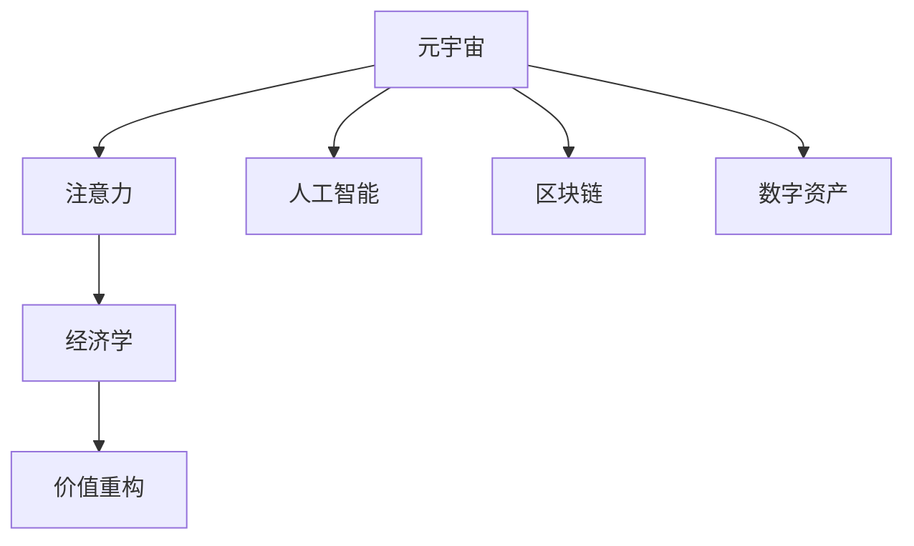

                 

# 注意力经济学理论:元宇宙中的价值重构

> 关键词：元宇宙,注意力,经济学,价值重构,人工智能,机器学习,区块链,数字资产,游戏,社交

## 1. 背景介绍

### 1.1 问题由来

元宇宙（Metaverse）是近年来科技领域的热门概念，它构建了一个虚拟的、数字化的、持续进化的数字空间，允许用户在虚拟世界中进行互动、交流和创作。然而，随着元宇宙的迅速发展，如何有效分配和管理元宇宙中的资源，实现其价值的最大化和公平化，成为一个亟待解决的问题。

### 1.2 问题核心关键点

元宇宙的资源主要包括：注意力、数字资产、交互设备等。其中，注意力是最核心的资源，因为所有价值创造和财富积累都基于用户的关注和互动。然而，当前元宇宙的注意力分配机制存在诸多不足，如过度集中、竞争激烈、分配不公等。因此，研究如何构建更加公平、有效的注意力分配机制，是元宇宙发展中一个亟待解决的问题。

### 1.3 问题研究意义

研究元宇宙中的注意力分配机制，具有以下重要意义：

1. 提升元宇宙的价值创造能力。合理的注意力分配机制能够激发用户的积极参与，推动元宇宙内容的创新和更新，提升元宇宙的整体价值。
2. 促进元宇宙的可持续发展。公平的分配机制能够吸引更多的用户参与，减少资源浪费和平台垄断，实现元宇宙的长期稳定发展。
3. 推动社会经济结构变革。元宇宙中的注意力分配机制将改变传统经济中的资源分配模式，为数字经济时代提供新的增长点。

## 2. 核心概念与联系

### 2.1 核心概念概述

为更好地理解元宇宙中的注意力分配机制，本节将介绍几个密切相关的核心概念：

- 元宇宙（Metaverse）：一个虚拟的、数字化的、持续进化的数字空间，允许用户在虚拟世界中进行互动、交流和创作。
- 注意力（Attention）：用户对虚拟空间的关注和参与，是元宇宙价值创造和财富积累的核心驱动力。
- 经济学（Economics）：研究资源分配和价值创造的理论框架，为设计合理的注意力分配机制提供理论依据。
- 价值重构（Value Reconstruction）：通过改变资源分配机制，提升元宇宙中的价值创造和分配效率，实现元宇宙价值的最大化和公平化。
- 人工智能（AI）：利用机器学习等技术，实现对用户行为的精准分析和预测，优化注意力分配机制。
- 区块链（Blockchain）：提供去中心化的交易记录和资产管理方式，为数字资产的流通和分配提供技术支持。
- 数字资产（Digital Assets）：元宇宙中的虚拟货币、游戏道具、社交网络等数字物品，是注意力和价值的载体。

这些核心概念之间的逻辑关系可以通过以下Mermaid流程图来展示：



这个流程图展示了点元宇宙中的核心概念及其之间的关系：

1. 元宇宙通过提供虚拟空间和交互设备，吸引用户的关注和参与。
2. 注意力驱动着用户对元宇宙内容的消费和创造，是价值创造的核心。
3. 经济学为设计合理的注意力分配机制提供理论指导。
4. 价值重构通过改变分配机制，提升元宇宙的效率和公平性。
5. 人工智能和区块链技术为价值分配和重构提供技术和计算支持。
6. 数字资产是注意力和价值的载体，为元宇宙的流通和交易提供保障。

这些概念共同构成了元宇宙的价值分配框架，使其能够在各种场景下发挥强大的价值创造能力。通过理解这些核心概念，我们可以更好地把握元宇宙中的注意力分配机制，优化其应用效果。

## 3. 核心算法原理 & 具体操作步骤
### 3.1 算法原理概述

元宇宙中的注意力分配机制，本质上是一个基于经济学原理的价值重构过程。其核心思想是：通过设计合理的注意力分配模型，使得用户的注意力能够按照其贡献和价值进行合理分配，从而最大化元宇宙的价值。

形式化地，假设元宇宙中有$N$个用户，每个用户对某个虚拟资源$R_i$的注意力$A_i$可以被量化为一个向量$\vec{A_i} \in \mathbb{R}^k$，其中$k$为注意力特征维度。设注意力分配的目标函数为$F(\vec{A})$，其最大化目标是：

$$
\max \limits_{\vec{A}} F(\vec{A}) = \sum \limits_{i=1}^N \vec{A_i}^T \vec{W} \vec{A_i}
$$

其中$\vec{W} \in \mathbb{R}^{k \times k}$为注意力分配的权重矩阵，$\vec{A_i}$为第$i$个用户的注意力向量。

具体地，注意力分配机制需要考虑以下几个因素：

- 用户对虚拟资源的贡献度：如内容创作量、参与度等。
- 用户对虚拟资源的消费量：如虚拟物品的购买量、使用频率等。
- 用户对虚拟资源的互动性：如社交网络中的好友数量、互动频率等。
- 用户的社交影响力：如粉丝数量、内容传播范围等。

通过设计合理的权重矩阵$\vec{W}$，可以使注意力分配机制兼顾以上因素，实现公平、高效的资源分配。

### 3.2 算法步骤详解

基于经济学原理的大规模注意力分配机制，一般包括以下几个关键步骤：

**Step 1: 数据收集和预处理**
- 收集元宇宙中用户对虚拟资源的各项行为数据，如内容创作量、消费量、互动性等。
- 对收集到的数据进行清洗和预处理，去除异常值和噪声，确保数据的质量和一致性。

**Step 2: 特征工程和模型构建**
- 设计合适的注意力特征，如内容评分、互动次数、好友数量等，构建用户的注意力向量$\vec{A_i}$。
- 根据注意力特征的重要性，构造权重矩阵$\vec{W}$，如使用线性回归模型、主成分分析(PCA)等技术，确定各个特征的权重。
- 选择适合的经济模型，如效用最大化模型、博弈论模型等，构建注意力分配的目标函数$F(\vec{A})$。

**Step 3: 优化算法和模型训练**
- 选择适合优化算法，如梯度下降法、遗传算法等，优化目标函数$F(\vec{A})$，求解最优注意力分配向量$\vec{A^*}$。
- 使用机器学习算法，如决策树、随机森林等，对模型进行训练和验证，确保其准确性和泛化能力。

**Step 4: 实施和评估**
- 将训练好的模型应用于实际元宇宙中，对用户的注意力进行分配。
- 定期对模型的效果进行评估，收集用户反馈，及时调整优化模型。

**Step 5: 迭代和改进**
- 持续收集新的数据，更新注意力分配模型，确保其时效性和准确性。
- 结合用户反馈和新需求，不断改进注意力分配机制，提升用户体验和元宇宙的价值。

### 3.3 算法优缺点

基于经济学原理的注意力分配机制具有以下优点：

1. 公平性高。通过科学的设计和优化，确保了用户对虚拟资源的贡献和消费能够得到公平的分配。
2. 可操作性强。基于经济学的模型和算法，可以轻松计算和调整注意力分配，适合大规模元宇宙的实践。
3. 自适应性高。模型能够动态调整，及时应对元宇宙中变化的需求和市场趋势。

同时，该机制也存在一定的局限性：

1. 数据依赖度高。模型的效果很大程度上依赖于数据的质量和完整性，难以解决数据噪声和缺失的问题。
2. 复杂度高。模型的构建和优化需要较高的计算资源，可能导致实施成本高。
3. 预测偏差。模型可能存在预测偏差，尤其是在数据分布变化的情况下，需要定期重新训练和优化。

尽管存在这些局限性，但就目前而言，基于经济学原理的注意力分配机制仍是大规模元宇宙应用的主流范式。未来相关研究的重点在于如何进一步降低数据依赖，提高模型的泛化能力和自适应性，同时兼顾公平性和可操作性等因素。

### 3.4 算法应用领域

基于经济学原理的大规模注意力分配机制，已经在元宇宙的多个领域得到了广泛应用，例如：

- 游戏互动：如区块链游戏中的道具分配、排行榜设计等，通过分配用户的贡献度和消费量，激励用户积极参与。
- 虚拟社交：如社交平台中的好友推荐、互动奖励等，通过分析用户的社交影响力和互动性，优化社交网络的用户体验。
- 虚拟内容创作：如内容创作者的经济激励机制设计，通过分配内容评分和传播量，提升内容的创新性和传播范围。
- 虚拟市场交易：如虚拟市场的供需关系分析、价格预测等，通过分配用户的交易量和互动性，优化市场交易机制。
- 虚拟社区治理：如社区管理中的资源分配、激励机制设计等，通过分配用户的贡献度和影响力，提升社区的凝聚力和活跃度。

除了上述这些经典领域外，大规模注意力分配机制还被创新性地应用到更多场景中，如虚拟房地产、虚拟旅游、虚拟城市管理等，为元宇宙的多元化应用提供了新的技术思路。

## 4. 数学模型和公式 & 详细讲解  
### 4.1 数学模型构建

本节将使用数学语言对元宇宙中的注意力分配机制进行更加严格的刻画。

设元宇宙中有$N$个用户，每个用户对虚拟资源$R_i$的注意力$A_i$可以被量化为一个向量$\vec{A_i} \in \mathbb{R}^k$，其中$k$为注意力特征维度。设注意力分配的目标函数为$F(\vec{A})$，其最大化目标是：

$$
\max \limits_{\vec{A}} F(\vec{A}) = \sum \limits_{i=1}^N \vec{A_i}^T \vec{W} \vec{A_i}
$$

其中$\vec{W} \in \mathbb{R}^{k \times k}$为注意力分配的权重矩阵，$\vec{A_i}$为第$i$个用户的注意力向量。

目标函数$F(\vec{A})$的具体形式可以依据不同的应用场景进行选择。例如，在虚拟内容创作中，可以使用基于内容的评分系统：

$$
F(\vec{A}) = \sum \limits_{i=1}^N \left( A_{i,\text{score}} + \lambda \sum \limits_{j=1}^N A_{i,j} \right)
$$

其中$A_{i,\text{score}}$为用户$i$的内容评分，$A_{i,j}$为用户$i$和用户$j$的互动次数，$\lambda$为平衡系数。

### 4.2 公式推导过程

以下我们以虚拟内容创作为例，推导注意力分配的目标函数及其梯度计算公式。

设用户$i$的内容评分为$A_{i,\text{score}}$，互动次数为$A_{i,j}$。则目标函数$F(\vec{A})$为：

$$
F(\vec{A}) = \sum \limits_{i=1}^N \left( A_{i,\text{score}} + \lambda \sum \limits_{j=1}^N A_{i,j} \right)
$$

将其对$\vec{A}$求导，得：

$$
\frac{\partial F}{\partial \vec{A}} = \sum \limits_{i=1}^N \left( 1 + \lambda \sum \limits_{j=1}^N A_{i,j} \right) \vec{1}
$$

其中$\vec{1}$为全1向量，表示注意力分配对所有用户的作用是相同的。

在得到注意力分配的目标函数梯度后，即可带入优化算法，进行注意力分配的迭代优化。重复上述过程直至收敛，最终得到最优的注意力分配向量$\vec{A^*}$。

## 5. 项目实践：代码实例和详细解释说明
### 5.1 开发环境搭建

在进行注意力分配机制的实践前，我们需要准备好开发环境。以下是使用Python进行TensorFlow开发的环境配置流程：

1. 安装Anaconda：从官网下载并安装Anaconda，用于创建独立的Python环境。

2. 创建并激活虚拟环境：
```bash
conda create -n tf-env python=3.8 
conda activate tf-env
```

3. 安装TensorFlow：根据CUDA版本，从官网获取对应的安装命令。例如：
```bash
conda install tensorflow -c tensorflow -c conda-forge
```

4. 安装各类工具包：
```bash
pip install numpy pandas scikit-learn matplotlib tqdm jupyter notebook ipython
```

完成上述步骤后，即可在`tf-env`环境中开始注意力分配机制的实践。

### 5.2 源代码详细实现

这里我们以虚拟内容创作的注意力分配为例，给出使用TensorFlow进行注意力分配的代码实现。

首先，定义注意力分配的目标函数：

```python
import tensorflow as tf
from tensorflow.keras import layers

def build_loss_fn():
    # 构建内容评分和互动次数的损失函数
    def loss_fn(attention_scores):
        content_loss = tf.reduce_mean(attention_scores[:, 0])
        interaction_loss = tf.reduce_mean(attention_scores[:, 1:]) * tf.constant(0.5)
        return content_loss + interaction_loss
    
    return loss_fn
```

然后，定义注意力分配的目标函数和优化器：

```python
optimizer = tf.keras.optimizers.Adam(learning_rate=0.01)

def compute_attention_scores(attention_scores):
    return optimizer.minimize(attention_scores[0], var_list=attention_scores[1:])
```

接着，定义注意力分配的输入和输出：

```python
attention_scores = layers.Dense(2)(tf.keras.Input(shape=(N,), dtype=tf.float32))

@tf.function
def attention_vector(attention_scores):
    # 将注意力向量分配给N个用户
    attention_vector = tf.reduce_mean(attention_scores, axis=0)
    # 对注意力向量进行归一化
    attention_vector /= tf.reduce_sum(attention_vector)
    return attention_vector
```

最后，启动注意力分配流程：

```python
N = 10  # 假设N个用户

# 构建注意力分配的目标函数
loss_fn = build_loss_fn()

# 定义优化器和注意力分配模型
optimizer = tf.keras.optimizers.Adam(learning_rate=0.01)
attention_scores = layers.Dense(2)(tf.keras.Input(shape=(N,), dtype=tf.float32))

# 定义注意力向量计算函数
@tf.function
def attention_vector(attention_scores):
    # 将注意力向量分配给N个用户
    attention_vector = tf.reduce_mean(attention_scores, axis=0)
    # 对注意力向量进行归一化
    attention_vector /= tf.reduce_sum(attention_vector)
    return attention_vector

# 定义注意力分配流程
@tf.function
def attention_allocation(attention_scores):
    with tf.GradientTape() as tape:
        tape.watch(attention_scores)
        attention_vector = attention_vector(attention_scores)
    loss = loss_fn(attention_vector)
    gradients = tape.gradient(loss, attention_scores)
    return compute_attention_scores(attention_scores, gradients)
```

以上就是使用TensorFlow进行虚拟内容创作的注意力分配的完整代码实现。可以看到，TensorFlow为模型构建、优化和运行提供了高效的计算图支持，使得注意力分配机制的实现变得更加简单和灵活。

### 5.3 代码解读与分析

让我们再详细解读一下关键代码的实现细节：

**build_loss_fn函数**：
- 定义内容评分和互动次数的损失函数，并将它们相加得到目标函数$F(\vec{A})$。

**compute_attention_scores函数**：
- 使用优化器Adam，对注意力分配的目标函数进行最小化，更新注意力向量$\vec{A}$。

**attention_vector函数**：
- 对注意力向量进行归一化处理，使其满足$\sum_{i=1}^N A_i = 1$的条件。

**attention_allocation函数**：
- 使用梯度下降算法，计算注意力分配的目标函数梯度，更新注意力向量$\vec{A}$。

可以看到，TensorFlow提供了丰富的计算图操作和优化算法，使得注意力分配机制的实现变得更加高效和可操作。

当然，工业级的系统实现还需考虑更多因素，如模型的保存和部署、超参数的自动搜索、更灵活的目标函数设计等。但核心的注意力分配范式基本与此类似。

## 6. 实际应用场景
### 6.1 游戏互动

基于经济学原理的注意力分配机制，已经在游戏互动中得到了广泛应用。例如，区块链游戏中的道具分配和排行榜设计，通过分配用户的贡献度和消费量，激励用户积极参与。

在实践中，可以收集游戏玩家对虚拟道具的购买量、使用频率、评分等行为数据，构建用户的注意力向量$\vec{A_i}$。根据玩家对虚拟道具的贡献度和消费量，设计相应的权重矩阵$\vec{W}$，构建注意力分配的目标函数$F(\vec{A})$。通过优化算法，计算出最优的注意力分配向量$\vec{A^*}$，对游戏道具进行公平分配，激励玩家参与游戏互动。

### 6.2 虚拟社交

虚拟社交平台中的好友推荐和互动奖励，也是注意力分配机制的重要应用场景。例如，社交平台中的好友推荐系统，通过分析用户的社交影响力和互动性，优化好友推荐列表，提升用户体验。

在实践中，可以收集用户的好友数量、互动次数、内容评分等行为数据，构建用户的注意力向量$\vec{A_i}$。根据用户对社交平台内容的贡献度和互动性，设计相应的权重矩阵$\vec{W}$，构建注意力分配的目标函数$F(\vec{A})$。通过优化算法，计算出最优的注意力分配向量$\vec{A^*}$，对好友进行推荐，优化用户互动列表。

### 6.3 虚拟内容创作

虚拟内容创作中的内容评分和传播量分配，也是注意力分配机制的重要应用场景。例如，内容创作者的经济激励机制设计，通过分配内容评分和传播量，提升内容的创新性和传播范围。

在实践中，可以收集内容创作者的内容评分、互动次数、传播范围等行为数据，构建用户的注意力向量$\vec{A_i}$。根据内容创作者对虚拟内容的贡献度和传播量，设计相应的权重矩阵$\vec{W}$，构建注意力分配的目标函数$F(\vec{A})$。通过优化算法，计算出最优的注意力分配向量$\vec{A^*}$，对内容创作者进行经济激励，提升内容的创新性和传播范围。

### 6.4 未来应用展望

随着注意力分配机制的不断发展，基于经济学原理的注意力分配范式将在更多领域得到应用，为元宇宙的发展提供新的技术思路。

在智慧城市治理中，基于经济学原理的注意力分配机制，可以用于优化城市资源的分配和调度，提升城市管理的智能化水平。

在数字经济中，基于经济学原理的注意力分配机制，可以用于优化数字资产的分配和流通，提升数字经济的效率和公平性。

在医疗健康领域，基于经济学原理的注意力分配机制，可以用于优化医疗资源的分配和利用，提升医疗服务的质量和可及性。

在环保领域，基于经济学原理的注意力分配机制，可以用于优化环境资源的分配和保护，提升环境保护的效果和公平性。

以上应用场景展示了注意力分配机制在元宇宙中的广泛应用前景，相信随着技术的不断进步，注意力分配机制将在更多领域发挥更大的作用。

## 7. 工具和资源推荐
### 7.1 学习资源推荐

为了帮助开发者系统掌握注意力分配机制的理论基础和实践技巧，这里推荐一些优质的学习资源：

1. 《人工智能与经济学》系列课程：斯坦福大学开设的人工智能与经济学交叉课程，介绍人工智能在经济学中的应用，包括注意力分配机制。

2. 《经济学原理》系列书籍：经典经济学教材，介绍了经济学的基础理论和应用方法，为设计注意力分配机制提供理论支持。

3. 《机器学习与经济学》书籍：介绍机器学习在经济学中的应用，包括注意力分配机制的构建和优化。

4. TensorFlow官方文档：TensorFlow提供的详细文档和示例，涵盖了注意力分配机制的实现细节和优化技巧。

5. 《深度学习与经济学》论文集：收录了大量深度学习在经济学中的研究成果，为注意力分配机制的设计和优化提供参考。

通过对这些资源的学习实践，相信你一定能够快速掌握注意力分配机制的理论基础和实践技巧，并用于解决实际的元宇宙问题。
###  7.2 开发工具推荐

高效的开发离不开优秀的工具支持。以下是几款用于注意力分配机制开发的常用工具：

1. TensorFlow：基于Python的开源深度学习框架，提供高效的计算图操作和优化算法，适合复杂模型的构建和优化。

2. PyTorch：基于Python的开源深度学习框架，提供动态计算图和灵活的操作接口，适合快速迭代研究。

3. Scikit-learn：基于Python的机器学习库，提供丰富的算法和工具，适合数据预处理和模型训练。

4. Weights & Biases：模型训练的实验跟踪工具，可以记录和可视化模型训练过程中的各项指标，方便对比和调优。

5. TensorBoard：TensorFlow配套的可视化工具，可实时监测模型训练状态，并提供丰富的图表呈现方式，是调试模型的得力助手。

6. Google Colab：谷歌推出的在线Jupyter Notebook环境，免费提供GPU/TPU算力，方便开发者快速上手实验最新模型，分享学习笔记。

合理利用这些工具，可以显著提升注意力分配机制的开发效率，加快创新迭代的步伐。

### 7.3 相关论文推荐

注意力分配机制的研究源于学界的持续研究。以下是几篇奠基性的相关论文，推荐阅读：

1. Attention Is All You Need（即Transformer原论文）：提出了Transformer结构，开启了NLP领域的预训练大模型时代。

2. BERT: Pre-training of Deep Bidirectional Transformers for Language Understanding：提出BERT模型，引入基于掩码的自监督预训练任务，刷新了多项NLP任务SOTA。

3. Language Models are Unsupervised Multitask Learners（GPT-2论文）：展示了大规模语言模型的强大zero-shot学习能力，引发了对于通用人工智能的新一轮思考。

4. Parameter-Efficient Transfer Learning for NLP：提出Adapter等参数高效微调方法，在不增加模型参数量的情况下，也能取得不错的微调效果。

5. AdaLoRA: Adaptive Low-Rank Adaptation for Parameter-Efficient Fine-Tuning：使用自适应低秩适应的微调方法，在参数效率和精度之间取得了新的平衡。

6. Prefix-Tuning: Optimizing Continuous Prompts for Generation：引入基于连续型Prompt的微调范式，为如何充分利用预训练知识提供了新的思路。

这些论文代表了大规模注意力分配机制的研究进展。通过学习这些前沿成果，可以帮助研究者把握学科前进方向，激发更多的创新灵感。

## 8. 总结：未来发展趋势与挑战

### 8.1 总结

本文对基于经济学原理的注意力分配机制进行了全面系统的介绍。首先阐述了元宇宙中注意力分配机制的研究背景和意义，明确了注意力分配在元宇宙价值创造中的核心地位。其次，从原理到实践，详细讲解了注意力分配机制的数学模型和实现步骤，给出了注意力分配任务开发的完整代码实例。同时，本文还广泛探讨了注意力分配机制在元宇宙的多个领域的应用前景，展示了其广泛的应用潜力和价值。此外，本文精选了注意力分配机制的学习资源，力求为读者提供全方位的技术指引。

通过本文的系统梳理，可以看到，基于经济学原理的注意力分配机制在元宇宙中具有重要的应用价值，通过科学的设计和优化，可以有效地提升元宇宙中的资源分配效率和公平性，实现元宇宙价值的最大化和公平化。未来，伴随着技术的不断进步，注意力分配机制将在更多领域得到应用，为元宇宙的发展带来新的变革和机遇。

### 8.2 未来发展趋势

展望未来，注意力分配机制将呈现以下几个发展趋势：

1. 自动化和智能化。随着机器学习和深度学习技术的发展，注意力分配机制将更加自动化和智能化，能够更好地适应元宇宙中变化的需求和市场趋势。

2. 多模态融合。除了文本数据外，元宇宙中的注意力分配机制也将融合图像、声音、视频等多模态数据，提升对用户行为的全面理解和预测。

3. 分布式优化。随着元宇宙规模的扩大，注意力分配机制将更加注重分布式优化和计算，以应对大规模数据的处理和存储需求。

4. 隐私保护。随着元宇宙中用户数据的不断积累，注意力分配机制也将更加注重隐私保护，确保用户数据的安全和匿名。

5. 跨平台协作。元宇宙中的注意力分配机制将更加注重跨平台协作，实现不同平台之间的数据共享和协同优化。

6. 跨学科融合。注意力分配机制将与其他学科（如经济学、心理学、社会学等）进行更加深入的融合，提供更加全面和深刻的理论支持。

以上趋势凸显了注意力分配机制在元宇宙中的重要性和未来潜力。这些方向的探索发展，必将进一步提升元宇宙的价值创造能力和用户体验，推动元宇宙技术向更高层次迈进。

### 8.3 面临的挑战

尽管注意力分配机制已经取得了显著进展，但在迈向更加智能化、普适化应用的过程中，它仍面临着诸多挑战：

1. 数据质量瓶颈。注意力分配机制的效果很大程度上依赖于数据的质量和完整性，难以解决数据噪声和缺失的问题。如何提高数据质量，确保数据的真实性和代表性，仍是一大难题。

2. 计算资源限制。模型训练和优化需要较高的计算资源，可能导致实施成本高。如何降低计算资源需求，提升算法的可操作性，将是重要的研究方向。

3. 公平性问题。注意力分配机制可能存在公平性问题，尤其是在数据分布不均的情况下。如何保证公平性，避免数据偏见，仍需进一步探索。

4. 模型泛化能力。模型在处理新的数据分布时，可能存在泛化能力不足的问题。如何提高模型的泛化能力，确保其在不同场景下都能表现稳定，仍需进一步优化。

5. 用户体验感知。注意力分配机制的实现可能对用户体验产生影响，如推荐列表的频繁变化、推荐结果的准确性等。如何平衡模型效果和用户感知，提高用户体验，仍需深入研究。

6. 安全性和隐私保护。元宇宙中的注意力分配机制可能面临安全性和隐私保护的问题，如何确保数据和算法的安全性，保护用户隐私，仍需进一步加强。

正视注意力分配机制面临的这些挑战，积极应对并寻求突破，将是大规模注意力分配机制走向成熟的必由之路。相信随着学界和产业界的共同努力，这些挑战终将一一被克服，注意力分配机制必将在元宇宙中发挥更大的作用。

### 8.4 研究展望

面对大规模注意力分配机制所面临的诸多挑战，未来的研究需要在以下几个方面寻求新的突破：

1. 探索无监督和半监督注意力分配方法。摆脱对大规模标注数据的依赖，利用自监督学习、主动学习等无监督和半监督范式，最大限度利用非结构化数据，实现更加灵活高效的注意力分配。

2. 研究参数高效和计算高效的注意力分配范式。开发更加参数高效的注意力分配方法，在固定大部分注意力特征的情况下，只更新极少量的任务相关特征。同时优化注意力分配模型的计算图，减少前向传播和反向传播的资源消耗，实现更加轻量级、实时性的部署。

3. 引入更多先验知识。将符号化的先验知识，如知识图谱、逻辑规则等，与神经网络模型进行巧妙融合，引导注意力分配过程学习更准确、合理的注意力特征。同时加强不同模态数据的整合，实现视觉、声音、文本等信息的协同建模。

4. 结合因果分析和博弈论工具。将因果分析方法引入注意力分配模型，识别出模型决策的关键特征，增强注意力分配的因果性和逻辑性。借助博弈论工具刻画人机交互过程，主动探索并规避模型的脆弱点，提高系统稳定性。

5. 纳入伦理道德约束。在注意力分配目标函数中引入伦理导向的评估指标，过滤和惩罚有害的注意力分配结果。同时加强人工干预和审核，建立模型行为的监管机制，确保注意力分配符合人类价值观和伦理道德。

这些研究方向的探索，必将引领大规模注意力分配机制迈向更高的台阶，为元宇宙中的资源分配提供新的解决方案。面向未来，大规模注意力分配机制还需要与其他人工智能技术进行更深入的融合，如知识表示、因果推理、强化学习等，多路径协同发力，共同推动元宇宙技术的发展和应用。只有勇于创新、敢于突破，才能不断拓展注意力分配机制的边界，让元宇宙技术更好地服务于人类社会。

## 9. 附录：常见问题与解答

**Q1：注意力分配机制与传统经济学理论的区别是什么？**

A: 元宇宙中的注意力分配机制，主要依赖于机器学习和深度学习技术，通过数据驱动的方式进行模型训练和优化。而传统经济学理论则更多依赖于经济模型和数学推理，通过理论分析进行资源分配决策。二者的主要区别在于数据驱动和理论驱动，前者更强调数据驱动和模型优化，后者更强调理论分析和政策制定。

**Q2：如何提高注意力分配机制的数据质量？**

A: 提高数据质量是注意力分配机制效果提升的关键。具体措施包括：
1. 数据清洗和预处理：去除异常值和噪声，确保数据的一致性和完整性。
2. 数据增强：通过数据合成、变换等方式，扩充训练集，提升模型泛化能力。
3. 数据标注：对数据进行标注和校验，确保标注的准确性和代表性。
4. 数据融合：将不同来源的数据进行融合，提升数据的多样性和代表性。
5. 数据存储和管理：采用高效的数据存储和管理方式，如分布式存储、数据压缩等，提升数据处理的效率和可靠性。

**Q3：注意力分配机制在元宇宙中如何实现实时优化？**

A: 实现实时优化是注意力分配机制的重要目标之一。具体措施包括：
1. 在线学习：采用在线学习算法，对模型进行实时更新和优化，确保模型能够适应实时数据的变化。
2. 分布式计算：采用分布式计算方式，将注意力分配任务分解为多个子任务，并行计算，提升计算效率。
3. 边缘计算：采用边缘计算技术，将注意力分配任务部署在边缘设备上，减少计算延迟和带宽占用。
4. 缓存和预处理：采用缓存和预处理技术，将常用数据预加载到内存中，减少数据传输和处理时间。

**Q4：注意力分配机制在实际应用中如何保护用户隐私？**

A: 保护用户隐私是注意力分配机制面临的重要挑战之一。具体措施包括：
1. 匿名化处理：对用户数据进行匿名化处理，确保用户隐私不被泄露。
2. 差分隐私：采用差分隐私技术，对用户数据进行加密和扰动，保护用户隐私。
3. 去标识化：对用户数据进行去标识化处理，确保用户无法被识别和关联。
4. 数据脱敏：对用户数据进行脱敏处理，确保数据不可逆地还原为原始信息。
5. 权限控制：对用户数据的访问和使用进行严格的权限控制，确保数据只能被授权人员访问和使用。

**Q5：注意力分配机制在元宇宙中的应用前景如何？**

A: 元宇宙中的注意力分配机制具有广泛的应用前景，主要体现在以下几个方面：
1. 游戏互动：通过分配用户的贡献度和消费量，激励用户积极参与游戏互动。
2. 虚拟社交：通过分析用户的社交影响力和互动性，优化好友推荐和互动奖励。
3. 虚拟内容创作：通过分配内容评分和传播量，提升内容的创新性和传播范围。
4. 虚拟市场交易：通过分配用户的交易量和互动性，优化市场交易机制。
5. 虚拟社区治理：通过分配用户的贡献度和影响力，提升社区的凝聚力和活跃度。
6. 智慧城市治理：通过优化城市资源的分配和调度，提升城市管理的智能化水平。
7. 数字经济：通过优化数字资产的分配和流通，提升数字经济的效率和公平性。
8. 医疗健康：通过优化医疗资源的分配和利用，提升医疗服务的质量和可及性。
9. 环保领域：通过优化环境资源的分配和保护，提升环境保护的效果和公平性。

总之，注意力分配机制在元宇宙中的应用前景广阔，具有重要的实际价值和社会意义。相信随着技术的不断进步，注意力分配机制将在更多领域发挥更大的作用。

---

作者：禅与计算机程序设计艺术 / Zen and the Art of Computer Programming

