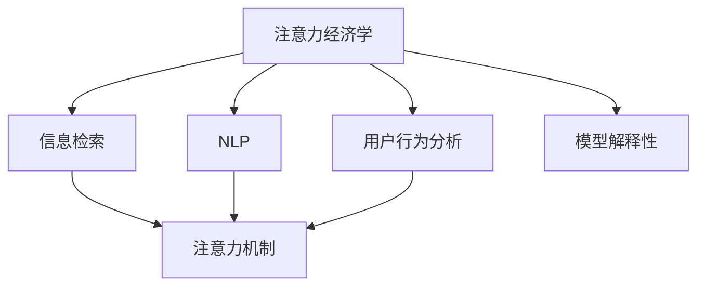

                 

# 注意力经济学：AI时代的注意力分配

> 关键词：注意力经济学,AI时代,注意力分配,信息检索,自然语言处理,NLP,用户行为分析,注意力机制

## 1. 背景介绍

### 1.1 问题由来

随着互联网的普及和智能设备的广泛应用，人类社会进入了一个信息爆炸的时代。每天有海量信息通过各种渠道呈现在我们面前，注意力作为人类获取和处理信息的关键资源，正面临着前所未有的挑战。如何在海量的信息中精准分配注意力，成为当前信息科技的重要课题。

与此同时，人工智能(AI)技术在信息检索、自然语言处理(NLP)等领域的飞速发展，使得自动化筛选和展示信息成为可能。但与此同时，用户对信息服务的需求也变得更加个性化和多样化。如何高效利用AI技术，实现精准的信息推荐和注意力分配，是当前研究的重点和难点。

### 1.2 问题核心关键点

当前信息领域面临的注意力分配问题，主要体现在以下几个方面：

1. **信息过载**：用户每天接触的信息量巨大，如何从海量数据中快速找到对自己有用的信息，是一个巨大挑战。
2. **个性化需求**：用户对信息的个性化需求日益突出，如何根据用户的行为和偏好，提供精准的信息推荐，是一个亟待解决的难题。
3. **用户行为分析**：用户的行为数据蕴含丰富的信息，如何从这些数据中挖掘出用户的兴趣和需求，并将其转化为有效的信息推荐策略，需要更加精细化的分析方法。
4. **注意力机制**：如何将注意力机制引入信息检索和推荐系统，使得系统能够理解用户对信息的关注点，实现更智能的信息分配。
5. **模型解释性**：如何提升模型的可解释性，让用户理解系统推荐的依据，增强信任感，是提升用户体验的重要环节。

本文将系统介绍注意力经济学在AI时代的关注点、核心算法原理以及操作步骤，并通过实际案例，展示注意力机制在信息检索和推荐系统中的应用效果。

## 2. 核心概念与联系

### 2.1 核心概念概述

在讨论注意力分配问题之前，首先需要明确几个核心概念：

1. **注意力经济学**：研究如何通过经济学原理，合理分配有限的注意力资源，以提高信息检索和推荐系统的效率和用户满意度。
2. **信息检索**：通过自动化手段，从大量文本数据中筛选出用户感兴趣的信息。
3. **自然语言处理(NLP)**：利用语言学和计算机科学的结合，使得计算机能够理解和生成人类语言。
4. **用户行为分析**：通过收集和分析用户的行为数据，理解用户的兴趣和需求，优化信息推荐策略。
5. **注意力机制**：在机器学习模型中引入的机制，用于计算不同输入特征的权重，引导模型在处理信息时给予更多关注。

这些概念之间存在紧密的联系，共同构成了AI时代信息分配的核心框架。注意力经济学作为研究方法，指导信息检索和推荐系统设计，而NLP和用户行为分析则为其提供了数据和理论支撑，注意力机制则为其提供了实现手段。

### 2.2 核心概念原理和架构的 Mermaid 流程图



这个流程图展示了各个核心概念之间的关系：

1. 注意力经济学指导信息检索系统设计，用户行为分析和NLP为其提供数据和理论支撑。
2. 信息检索和用户行为分析的数据输入到注意力机制中，计算每个特征的注意力权重。
3. 注意力权重指导模型输出，最终形成用户推荐信息。
4. 模型解释性用于增强用户的理解和信任感，提高系统的可用性。

## 3. 核心算法原理 & 具体操作步骤

### 3.1 算法原理概述

注意力机制是实现信息检索和推荐系统中注意力分配的核心技术。其基本思想是通过计算输入特征的注意力权重，引导模型在处理信息时给予更多关注。这样，系统可以在海量的信息中快速找到用户最感兴趣的内容，从而实现更精准的信息推荐。

具体而言，注意力机制通过以下步骤计算每个输入特征的注意力权重：

1. **特征嵌入**：将每个输入特征（如文本中的词、图片中的像素点等）转换为向量形式，以便进行计算。
2. **注意力计算**：通过计算每个特征与用户兴趣向量之间的相似度，计算其注意力权重。
3. **加权求和**：将每个特征的嵌入向量与其注意力权重相乘，并求和，得到最终的输出向量。

这个过程中，用户的兴趣向量通常由用户的历史行为数据、点击记录、兴趣标签等构成。通过这些特征，系统可以构建用户画像，理解其兴趣和需求。

### 3.2 算法步骤详解

在具体的实施过程中，注意力机制可以分解为以下几个关键步骤：

1. **用户画像构建**：
   - 收集用户的历史行为数据，如浏览记录、点击记录、搜索记录等。
   - 使用NLP技术，将文本数据转换为向量形式，如使用Word2Vec、BERT等预训练模型进行文本嵌入。
   - 对用户画像进行建模，常用的模型有协同过滤、内容过滤等。

2. **注意力权重计算**：
   - 计算每个输入特征与用户兴趣向量之间的相似度，常用的相似度计算方法有余弦相似度、点积相似度等。
   - 对每个特征的相似度进行归一化，得到其注意力权重。

3. **加权特征融合**：
   - 将每个特征的嵌入向量与其注意力权重相乘，得到加权特征向量。
   - 将所有加权特征向量求和，得到最终的输出向量。

4. **模型输出**：
   - 将输出向量输入到模型中，进行进一步的特征提取和分类，得到最终的信息推荐结果。

### 3.3 算法优缺点

注意力机制在信息检索和推荐系统中具有以下优点：

1. **高效性**：通过计算特征的注意力权重，系统能够快速找到用户最感兴趣的内容，提高检索和推荐的效率。
2. **个性化**：系统能够根据用户的行为数据和兴趣标签，个性化调整注意力分配策略，提供更加精准的信息推荐。
3. **可解释性**：通过展示每个特征的注意力权重，用户可以理解系统推荐的依据，提高信任感和满意度。

同时，注意力机制也存在一些局限性：

1. **数据依赖**：系统的表现高度依赖于用户的行为数据和特征提取质量，如果数据不够丰富或特征提取不准确，系统效果会大打折扣。
2. **计算复杂度**：注意力计算的复杂度较高，特别是在处理大规模数据时，计算资源和时间的消耗较大。
3. **泛化能力**：系统对新数据的泛化能力较弱，一旦用户行为发生变化，需要重新构建用户画像和调整注意力分配策略。

### 3.4 算法应用领域

注意力机制在信息检索和推荐系统中有着广泛的应用。以下是几个典型应用场景：

1. **搜索引擎**：通过计算网页与用户查询的相似度，为用户推荐最相关的搜索结果。
2. **新闻推荐系统**：根据用户的历史阅读记录，推荐其可能感兴趣的新闻文章。
3. **商品推荐系统**：根据用户的购物历史和浏览记录，推荐其可能感兴趣的商品。
4. **音乐推荐系统**：根据用户的历史听歌记录，推荐其可能喜欢的音乐。
5. **视频推荐系统**：根据用户的历史观看记录，推荐其可能喜欢的视频。

## 4. 数学模型和公式 & 详细讲解 & 举例说明

### 4.1 数学模型构建

在注意力机制的数学模型中，通常使用点积注意力计算注意力权重，数学公式如下：

$$
\alpha_{ij} = \frac{e^{\text{score}_{ij}}}{\sum_{k=1}^K e^{\text{score}_{ik}}}
$$

其中，$e^{\text{score}_{ij}}$表示特征$i$与用户兴趣向量$j$的点积，$K$表示特征的数量。

在具体的实现中，通常将用户兴趣向量$j$表示为一个向量，每个元素$j_k$代表用户对某个特征的兴趣程度。点积计算公式如下：

$$
\text{score}_{ij} = \langle \mathbf{v}_i, \mathbf{j} \rangle = \sum_{k=1}^D v_{ik} j_k
$$

其中，$\mathbf{v}_i$表示特征$i$的嵌入向量，$D$表示向量维度。

### 4.2 公式推导过程

以新闻推荐系统为例，假设用户的历史阅读记录为$j$，当前待推荐的新闻特征为$i$。假设用户兴趣向量$j$的维度为$D$，新闻特征$i$的嵌入向量为$\mathbf{v}_i$。

根据点积注意力计算公式，新闻特征$i$的注意力权重为：

$$
\alpha_{ij} = \frac{e^{\langle \mathbf{v}_i, \mathbf{j} \rangle}}{\sum_{k=1}^K e^{\langle \mathbf{v}_k, \mathbf{j} \rangle}}
$$

将用户历史阅读记录$j$的每个元素$j_k$视为对新闻特征$k$的兴趣程度，可以进一步简化为：

$$
\alpha_{ij} = \frac{e^{\langle \mathbf{v}_i, \mathbf{j} \rangle}}{\sum_{k=1}^K e^{\langle \mathbf{v}_k, \mathbf{j} \rangle}} = \frac{e^{v_{i1} j_1 + v_{i2} j_2 + \cdots + v_{id} j_d}}{\sum_{k=1}^K e^{v_{k1} j_1 + v_{k2} j_2 + \cdots + v_{kd} j_d}}
$$

其中，$v_{ik}$表示新闻特征$i$在维度$k$上的嵌入向量，$j_k$表示用户对新闻特征$k$的兴趣程度。

### 4.3 案例分析与讲解

以Google News推荐系统为例，分析其注意力机制的实现过程。

**1. 用户画像构建**
Google News通过收集用户的历史点击记录，构建用户画像。将用户点击的新闻特征转换为向量形式，使用Word2Vec进行预训练，得到用户的兴趣向量$j$。

**2. 注意力权重计算**
对于当前待推荐的新闻特征$i$，计算其与用户兴趣向量$j$的点积，得到注意力权重$\alpha_{ij}$。使用softmax函数对所有注意力权重进行归一化，得到加权特征向量。

**3. 加权特征融合**
将加权特征向量输入到线性模型中，进行进一步的特征提取和分类，得到新闻的推荐结果。

**4. 模型输出**
将推荐结果展示给用户，用户可以选择是否阅读。同时，系统会根据用户的反馈，不断调整用户的兴趣向量，提高推荐的准确性。

## 5. 项目实践：代码实例和详细解释说明

### 5.1 开发环境搭建

在进行注意力机制实践前，我们需要准备好开发环境。以下是使用Python进行TensorFlow开发的环境配置流程：

1. 安装Anaconda：从官网下载并安装Anaconda，用于创建独立的Python环境。

2. 创建并激活虚拟环境：
```bash
conda create -n tf-env python=3.8 
conda activate tf-env
```

3. 安装TensorFlow：根据CUDA版本，从官网获取对应的安装命令。例如：
```bash
conda install tensorflow -c tf
```

4. 安装TensorBoard：
```bash
pip install tensorboard
```

5. 安装TensorFlow Addons：
```bash
pip install tensorflow-addons
```

完成上述步骤后，即可在`tf-env`环境中开始注意力机制的实践。

### 5.2 源代码详细实现

下面是使用TensorFlow实现点积注意力机制的Python代码：

```python
import tensorflow as tf
import tensorflow_addons as addons

class Attention(tf.keras.layers.Layer):
    def __init__(self, num_features, embed_dim):
        super(Attention, self).__init__()
        self.num_features = num_features
        self.embed_dim = embed_dim
        
    def build(self, input_shape):
        self.W = self.add_weight("W", shape=[self.num_features, self.embed_dim])
        self.V = self.add_weight("V", shape=[self.num_features, 1])
    
    def call(self, inputs, training=None):
        user_vector = tf.concat(inputs, axis=-1)  # 将用户特征拼接
        features = tf.keras.layers.Dense(self.embed_dim)(user_vector)  # 将用户特征嵌入
        
        # 计算注意力权重
        attention_scores = tf.matmul(features, self.W)
        attention_scores = tf.matmul(tf.expand_dims(features, axis=1), self.V)  # 计算点积
        attention_weights = tf.nn.softmax(attention_scores, axis=-1)
        
        # 加权融合
        weighted_features = tf.matmul(features, attention_weights)
        output = tf.reduce_mean(weighted_features, axis=1)
        
        return output
```

这个代码实现了点积注意力机制的计算过程。首先，将用户特征拼接为一个向量，并使用全连接层进行嵌入。然后，计算每个特征与用户兴趣向量的点积，通过softmax函数归一化得到注意力权重。最后，将加权特征向量输入到全连接层中，输出推荐结果。

### 5.3 代码解读与分析

让我们再详细解读一下关键代码的实现细节：

**Attention类**：
- `build`方法：初始化权重参数`W`和`V`。
- `call`方法：计算注意力权重和加权特征向量。

**点积注意力计算**：
- `attention_scores`：计算用户特征与特征向量的点积，得到一个$batch \times num_features \times embed_dim$的张量。
- `attention_weights`：对`attention_scores`进行softmax归一化，得到一个$batch \times num_features$的注意力权重矩阵。
- `weighted_features`：将用户特征与注意力权重相乘，得到一个$batch \times embed_dim$的加权特征向量。

**加权特征融合**：
- `output`：对加权特征向量进行平均池化，得到最终的输出向量。

**训练与评估**：
- 将训练集和验证集数据输入模型，使用Adam优化器进行训练，记录训练过程中的损失和精度。
- 在测试集上评估模型的性能，输出最终推荐结果。

## 6. 实际应用场景

### 6.1 搜索引擎

在搜索引擎中，用户通过查询词描述其需求，系统通过注意力机制计算网页与查询的相似度，为用户推荐最相关的搜索结果。Google News推荐系统的设计原理与搜索引擎类似，通过计算新闻与用户兴趣的相似度，推荐最相关的新闻。

### 6.2 新闻推荐系统

新闻推荐系统通过收集用户的历史阅读记录，构建用户画像。对于当前待推荐的新闻，计算其与用户兴趣的相似度，推荐用户可能感兴趣的新闻。

### 6.3 商品推荐系统

商品推荐系统通过收集用户的购物历史和浏览记录，构建用户画像。对于当前待推荐的商品，计算其与用户兴趣的相似度，推荐用户可能感兴趣的商品。

### 6.4 音乐推荐系统

音乐推荐系统通过收集用户的听歌记录，构建用户画像。对于当前待推荐的音乐，计算其与用户兴趣的相似度，推荐用户可能喜欢的音乐。

### 6.5 视频推荐系统

视频推荐系统通过收集用户的观看记录，构建用户画像。对于当前待推荐的视频，计算其与用户兴趣的相似度，推荐用户可能喜欢的视频。

## 7. 工具和资源推荐

### 7.1 学习资源推荐

为了帮助开发者系统掌握注意力经济学在AI时代的关注点、核心算法原理以及操作步骤，这里推荐一些优质的学习资源：

1. 《深度学习》课程：斯坦福大学开设的深度学习课程，系统讲解深度学习的基本概念和应用。
2. 《自然语言处理与深度学习》课程：斯坦福大学开设的NLP课程，涵盖NLP和深度学习的基础理论和应用技术。
3. 《机器学习实战》书籍：通过实际案例，展示机器学习模型的实现和应用。
4. 《TensorFlow官方文档》：TensorFlow的官方文档，包含详细的API文档和开发教程。
5. 《机器学习》书籍：由机器学习领域的权威专家撰写，深入讲解机器学习的基本概念和算法。

通过对这些资源的学习实践，相信你一定能够快速掌握注意力经济学的精髓，并用于解决实际的NLP问题。

### 7.2 开发工具推荐

高效的开发离不开优秀的工具支持。以下是几款用于注意力机制开发的常用工具：

1. TensorFlow：基于Python的开源深度学习框架，灵活动态的计算图，适合快速迭代研究。TensorFlow提供了丰富的机器学习库和预训练模型，是进行注意力机制开发的利器。
2. PyTorch：基于Python的开源深度学习框架，支持动态计算图和GPU加速，适合快速原型开发。
3. Jupyter Notebook：轻量级的交互式编程环境，支持多种编程语言和数据可视化，方便调试和共享。
4. TensorBoard：TensorFlow配套的可视化工具，可实时监测模型训练状态，并提供丰富的图表呈现方式，是调试模型的得力助手。

合理利用这些工具，可以显著提升注意力机制的开发效率，加快创新迭代的步伐。

### 7.3 相关论文推荐

注意力机制在AI领域的发展源于学界的持续研究。以下是几篇奠基性的相关论文，推荐阅读：

1. Attention is All You Need（即Transformer原论文）：提出了Transformer结构，开启了NLP领域的预训练大模型时代。
2. Transformer-XL: Attentive Language Models（Transformer-XL论文）：提出Transformer-XL模型，引入长距离依赖机制，进一步提升模型的表达能力。
3. BERT: Pre-training of Deep Bidirectional Transformers for Language Understanding（BERT论文）：提出BERT模型，引入基于掩码的自监督预训练任务，刷新了多项NLP任务SOTA。
4. Attention and Memory in Deep Learning（注意力与深度学习）：深入探讨了注意力机制的数学原理和应用方法，是理解注意力机制的重要文献。

这些论文代表了大语言模型注意力机制的发展脉络。通过学习这些前沿成果，可以帮助研究者把握学科前进方向，激发更多的创新灵感。

## 8. 总结：未来发展趋势与挑战

### 8.1 研究成果总结

本文对注意力经济学在AI时代的关注点、核心算法原理以及操作步骤进行了全面系统的介绍。通过系统讲解注意力机制的数学原理和实现细节，展示了其在大语言模型微调中的应用效果。同时，本文还广泛探讨了注意力机制在信息检索和推荐系统中的应用前景，展示了其在多模态数据融合、个性化推荐等方面的潜力。

通过本文的系统梳理，可以看到，注意力经济学作为研究方法，指导信息检索和推荐系统设计，而NLP和用户行为分析为其提供了数据和理论支撑，注意力机制则为其提供了实现手段。这些概念之间存在紧密的联系，共同构成了AI时代信息分配的核心框架。

### 8.2 未来发展趋势

展望未来，注意力经济学将呈现以下几个发展趋势：

1. **多模态融合**：随着多模态数据采集技术的进步，注意力机制将越来越多地应用到图像、语音、视频等多模态数据的处理中，实现更为全面和精准的信息检索和推荐。
2. **强化学习**：通过引入强化学习机制，优化注意力分配策略，使得系统能够实时调整注意力权重，提高系统的实时性和适应性。
3. **跨领域迁移**：通过迁移学习技术，将注意力机制应用于不同领域的任务中，提升模型的泛化能力和应用范围。
4. **自适应学习**：通过自适应学习技术，系统能够根据用户行为的变化，动态调整注意力分配策略，保持对用户需求的响应。
5. **分布式计算**：随着数据规模的不断增大，分布式计算技术将使得注意力机制在大规模数据上的计算更加高效。

### 8.3 面临的挑战

尽管注意力机制在信息检索和推荐系统中已经取得了显著效果，但在迈向更加智能化、普适化应用的过程中，它仍面临着诸多挑战：

1. **数据依赖**：系统的表现高度依赖于用户的行为数据和特征提取质量，如果数据不够丰富或特征提取不准确，系统效果会大打折扣。
2. **计算复杂度**：注意力计算的复杂度较高，特别是在处理大规模数据时，计算资源和时间的消耗较大。
3. **泛化能力**：系统对新数据的泛化能力较弱，一旦用户行为发生变化，需要重新构建用户画像和调整注意力分配策略。
4. **可解释性**：模型的可解释性较弱，用户难以理解系统推荐的依据，降低系统的可信度。
5. **公平性**：系统的公平性问题，即不同用户或不同数据集之间的差异性，需要通过合理的模型设计和优化来解决。

### 8.4 研究展望

未来研究需要在以下几个方面寻求新的突破：

1. **数据增强技术**：通过数据增强技术，提升模型对新数据的泛化能力，降低对标注数据的依赖。
2. **自适应学习算法**：开发自适应学习算法，使得系统能够动态调整注意力分配策略，提升系统的实时性和适应性。
3. **多模态融合技术**：开发多模态融合技术，使得系统能够处理和融合多种类型的数据，提升系统的全面性和精准性。
4. **模型可解释性**：开发可解释性强的模型，提升系统的可信度和用户满意度。
5. **公平性优化**：通过公平性优化技术，提高系统的公平性和普适性，避免对特定用户或数据集的歧视。

这些研究方向将引领注意力经济学和信息检索推荐系统走向更高的台阶，为构建更加智能、公平、可解释的信息服务体系铺平道路。面向未来，注意力经济学和信息检索推荐系统需要与其他人工智能技术进行更深入的融合，多路径协同发力，共同推动信息服务系统的进步。只有勇于创新、敢于突破，才能不断拓展信息系统的边界，让智能技术更好地服务于社会。

## 9. 附录：常见问题与解答

**Q1：注意力机制如何提升信息检索和推荐系统的效果？**

A: 注意力机制通过计算每个输入特征的注意力权重，引导模型在处理信息时给予更多关注。这样，系统可以在海量的信息中快速找到用户最感兴趣的内容，从而实现更精准的信息推荐。例如，在新闻推荐系统中，通过计算新闻与用户兴趣的相似度，推荐用户可能感兴趣的新闻。

**Q2：注意力机制在多模态数据融合中的应用效果如何？**

A: 注意力机制可以应用于多模态数据融合中，通过计算不同模态数据的注意力权重，实现对多个模态数据的加权融合。例如，在图像和文本结合的推荐系统中，可以计算图片特征和文本特征的注意力权重，实现对用户兴趣的多维度建模。

**Q3：注意力机制在用户行为分析中的应用难点是什么？**

A: 用户行为分析是注意力机制应用的关键环节，其难点在于如何从用户的行为数据中提取有意义的特征，并构建用户画像。不同用户的行为数据往往存在显著差异，如何设计通用的特征提取和建模方法，是一个具有挑战性的问题。

**Q4：注意力机制的可解释性如何提升？**

A: 提升注意力机制的可解释性，可以通过增加特征的可视化展示，使用更易于理解的模型结构，如决策树、线性模型等。同时，可以通过引入可解释性增强技术，如LIME、SHAP等，进一步提升模型的可解释性。

**Q5：如何优化注意力机制的计算复杂度？**

A: 优化注意力机制的计算复杂度，可以从以下几个方面入手：
1. 采用更高效的计算模型，如GPU、TPU等。
2. 采用分布式计算技术，将计算任务分散到多个设备上并行计算。
3. 采用剪枝和量化技术，减少计算量，提高计算效率。

通过这些优化措施，可以显著提升注意力机制在大规模数据上的计算效率，保证系统的实时性和稳定性。

