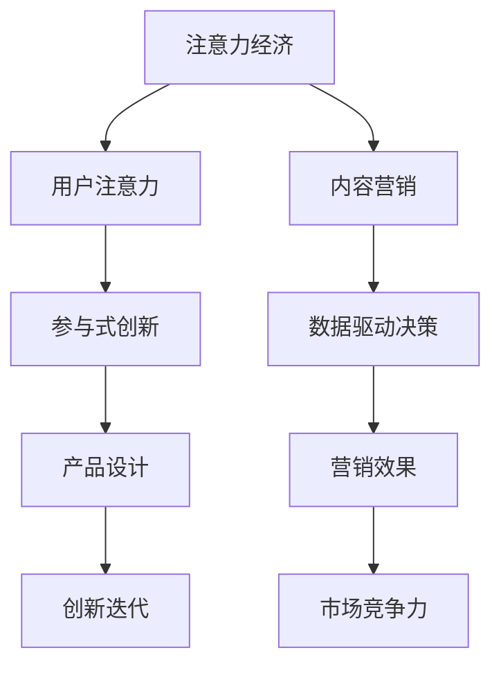

                 

# 注意力经济对企业创新管理的影响

在数字经济的浪潮下，注意力成为企业最宝贵的资源之一。企业如何在有限的时间内吸引并维持用户注意，成为其创新管理中不可或缺的一环。本文将从注意力经济的角度，深入探讨其对企业创新管理的影响，并给出相关的策略和建议。

## 1. 背景介绍

### 1.1 问题由来
在信息爆炸的互联网时代，用户注意力分散、竞争激烈，企业需要不断创新，提升用户注意力价值，从而在激烈的市场竞争中脱颖而出。注意力经济理论（Attention Economy）应运而生，强调在信息过载的环境中，企业应当利用有效手段吸引和保持用户关注，从而提高其价值和市场竞争力。

### 1.2 问题核心关键点
注意力经济的核心在于“吸引注意力-维持注意力-利用注意力”这一闭环。如何设计有吸引力的内容，如何通过互动维持用户注意力，以及如何将注意力转化为实际的业务价值，是企业面临的主要挑战。

### 1.3 问题研究意义
在数字化转型的背景下，理解并运用注意力经济原理，对企业创新管理具有重大意义：

1. 优化产品设计。通过关注用户注意力的偏好和行为模式，企业能够设计出更具吸引力的产品和服务，提升用户体验。
2. 提高营销效果。通过精准定位目标用户群体，提供定制化的内容和服务，企业能够有效提升营销转化率和用户粘性。
3. 加速创新迭代。通过实时监控用户反馈，企业能够及时调整产品策略，快速适应市场变化，提高创新效率。
4. 增强市场竞争力。在激烈的市场竞争中，拥有更多用户关注的企业更容易形成品牌忠诚度，实现可持续发展。

## 2. 核心概念与联系

### 2.1 核心概念概述

在探讨注意力经济对企业创新管理的影响前，我们先定义几个关键概念：

- **注意力经济（Attention Economy）**：指在信息泛滥的互联网环境中，用户注意力的稀缺性使得企业争夺注意力成为提高自身价值和市场竞争力的关键。
- **用户注意力（User Attention）**：用户在接触信息时所投入的心理资源和时间。
- **内容营销（Content Marketing）**：通过提供有价值的内容吸引和维持用户注意力，从而达成商业目标的一种营销策略。
- **参与式创新（Participatory Innovation）**：借助用户参与和反馈，实现更贴近用户需求的产品和服务创新。
- **数据驱动决策（Data-Driven Decision Making）**：通过大数据和分析工具，实时监测和分析用户行为数据，指导企业的决策和创新。

这些核心概念之间存在着紧密的联系，形成了企业利用注意力进行创新管理的整体框架。

### 2.2 核心概念原理和架构的 Mermaid 流程图



该图展示了注意力经济对企业创新管理的影响路径：

1. 企业利用内容营销吸引用户注意力。
2. 用户注意力反馈进入参与式创新，提升产品设计质量。
3. 通过数据驱动决策，优化营销效果和创新迭代。
4. 最终形成更高的市场竞争力。

### 2.3 核心概念之间的关系

- **内容营销**：吸引用户注意力的重要手段，通过优质的内容提升品牌知名度和用户粘性。
- **参与式创新**：利用用户反馈优化产品和服务设计，提升用户满意度。
- **数据驱动决策**：通过数据分析指导产品创新和营销策略，实现精准运营。
- **产品设计**：最终落实在产品上，提高用户体验和市场竞争力。
- **营销效果**：通过营销手段，将产品价值传达给用户。
- **市场竞争力**：综合考量以上因素，提升企业整体的市场表现。

## 3. 核心算法原理 & 具体操作步骤

### 3.1 算法原理概述

注意力经济对企业创新管理的影响，主要体现在以下几个方面：

- **用户注意力吸引与维持**：通过内容设计和互动机制，吸引并维持用户注意。
- **内容价值最大化**：利用用户注意力生成有价值的内容，如广告、推荐、用户评论等。
- **用户反馈收集与分析**：实时收集用户反馈，并进行数据分析，指导产品优化和创新迭代。
- **个性化推荐**：基于用户行为数据，提供个性化内容推荐，提高用户满意度。

### 3.2 算法步骤详解

注意力经济对企业创新管理的具体操作步骤如下：

1. **内容设计与吸引**：
   - **内容策略制定**：根据目标用户群体和市场趋势，制定吸引用户注意力的内容策略。
   - **内容创作与分发**：通过多媒体内容创作，选择合适的渠道进行内容分发，吸引用户关注。

2. **用户互动与维持**：
   - **互动机制设计**：设计有吸引力的互动机制，如评论区互动、社交媒体互动等，维持用户注意。
   - **定期内容更新**：定期更新内容，保持用户对品牌的持续关注。

3. **用户反馈收集与分析**：
   - **反馈渠道搭建**：搭建用户反馈渠道，如在线调查、社交媒体评论、客服反馈等。
   - **数据收集与分析**：使用数据分析工具，收集用户反馈，进行情感分析、用户画像等。

4. **产品优化与创新迭代**：
   - **用户画像分析**：通过用户画像分析，识别用户需求和偏好。
   - **产品策略调整**：基于用户反馈，调整产品设计策略，进行持续优化和创新。

5. **个性化推荐**：
   - **数据挖掘与建模**：使用数据挖掘技术，挖掘用户行为数据，构建推荐模型。
   - **推荐系统部署**：将推荐模型部署到系统中，实现个性化内容推荐。

### 3.3 算法优缺点

注意力经济对企业创新管理的优势：
- **提升用户粘性**：通过吸引和维持用户注意力，提高用户对品牌的忠诚度。
- **精准营销**：利用用户反馈数据，实现精准的个性化营销。
- **加速创新**：通过实时反馈和数据分析，快速响应市场变化，加速创新迭代。

其缺点包括：
- **资源投入高**：内容创作和互动机制设计需要大量资源投入。
- **技术门槛高**：需具备数据分析和推荐系统等技术能力。
- **用户体验风险**：不当的内容或互动机制可能引起用户反感。

### 3.4 算法应用领域

注意力经济对企业创新管理的应用广泛，涵盖以下几个领域：

- **社交媒体**：通过吸引用户关注和互动，提高品牌曝光度。
- **电子商务**：利用个性化推荐，提高用户购买率和满意度。
- **在线教育**：通过内容设计和互动机制，提升用户学习体验和粘性。
- **金融科技**：利用用户反馈和数据分析，优化产品设计和风险控制。
- **医疗健康**：通过实时监测和互动，提升用户健康管理效果。

## 4. 数学模型和公式 & 详细讲解

### 4.1 数学模型构建

注意力经济的影响可以用以下数学模型来表示：

$$
\text{用户关注度} = f(\text{内容吸引力}, \text{互动性}, \text{反馈收集与分析}, \text{个性化推荐})
$$

其中：
- 内容吸引力：内容的创新性和吸引力，可以表示为内容的点击率、分享率等。
- 互动性：用户与内容的互动程度，如评论数、点赞数等。
- 反馈收集与分析：用户反馈的数量和质量，通过情感分析、用户画像等技术进行评估。
- 个性化推荐：通过推荐算法生成个性化内容，提高用户满意度和粘性。

### 4.2 公式推导过程

假设用户关注度 $R$ 可以表示为：

$$
R = w_1 \times A + w_2 \times I + w_3 \times F + w_4 \times P
$$

其中：
- $A$ 表示内容吸引力，如 $A = \frac{C}{T}$
- $I$ 表示互动性，如 $I = \frac{C}{D}$
- $F$ 表示反馈收集与分析，如 $F = \frac{F}{D}$
- $P$ 表示个性化推荐，如 $P = \frac{R}{U}$

其中，$w_1$ 至 $w_4$ 分别为各因素的权重系数，$C$ 为点击量，$T$ 为总点击量，$D$ 为评论数，$F$ 为收集到的反馈数，$R$ 为用户推荐内容数，$U$ 为用户总数。

通过最大化 $R$ 来优化用户关注度，可以使用梯度下降等优化算法进行求解。

### 4.3 案例分析与讲解

**案例分析**：

假设某电商平台希望提高用户关注度，采用以下策略：

1. **内容吸引力**：定期发布用户评价、使用案例等有价值的内容，吸引用户点击和关注。
2. **互动性**：通过评论区互动和用户投票，提升用户参与度。
3. **反馈收集与分析**：定期进行用户满意度调查，分析反馈意见，优化产品和服务。
4. **个性化推荐**：根据用户浏览和购买记录，生成个性化的商品推荐。

**讲解**：

通过这些策略，平台能够吸引和维持用户注意力，从而提高用户粘性和购买率。平台首先通过内容创作和互动机制提升用户吸引力，然后通过反馈收集与分析了解用户需求，并利用个性化推荐算法提高用户体验和满意度。

## 5. 项目实践：代码实例和详细解释说明

### 5.1 开发环境搭建

在实际开发中，我们需要搭建以下开发环境：

1. **Python**：选择 Python 作为主要开发语言，推荐使用 Python 3.7 或更高版本。
2. **数据库**：选择 SQL 或 NoSQL 数据库，如 MySQL、MongoDB 等，存储用户数据和互动数据。
3. **数据分析工具**：使用 Pandas、NumPy、Scikit-learn 等数据分析工具进行用户行为数据的处理和分析。
4. **推荐系统框架**：选择 TensorFlow、PyTorch 或 Scikit-learn 等推荐系统框架，实现个性化推荐算法。
5. **Web 框架**：选择 Django、Flask 或 FastAPI 等 Web 框架，搭建用户交互界面。

### 5.2 源代码详细实现

以下是基于 TensorFlow 和 Flask 框架的推荐系统示例代码：

```python
import tensorflow as tf
from flask import Flask, request, jsonify

app = Flask(__name__)

# 加载模型
model = tf.keras.models.load_model('recommender_model.h5')

@app.route('/recommend', methods=['POST'])
def recommend():
    # 获取用户 ID 和兴趣标签
    user_id = request.json['user_id']
    interests = request.json['interests']
    
    # 构建输入数据
    user_input = tf.keras.Input(shape=(1,), dtype=tf.float32)
    interests_input = tf.keras.Input(shape=(interests.shape[1],))
    
    # 构建用户兴趣向量
    user_embedding = tf.keras.layers.Embedding(input_dim=len(user_ids), output_dim=embedding_size)(user_input)
    interests_embedding = tf.keras.layers.Embedding(input_dim=len(interests), output_dim=embedding_size)(interests_input)
    
    # 计算用户兴趣向量加权和
    user_weights = tf.reduce_sum(tf.multiply(user_embedding, interests_weights), axis=1)
    
    # 计算兴趣匹配度
    match = tf.keras.layers.Dot(axes=1, normalize=True)([user_weights, interests_embedding])
    
    # 预测推荐结果
    recommends = model.predict(match)
    
    # 返回推荐结果
    return jsonify({'recommends': [item[0] for item in recommends]})
```

### 5.3 代码解读与分析

- **模型加载**：加载预训练的推荐模型，用于计算用户兴趣和物品匹配度。
- **输入数据**：接收用户 ID 和兴趣标签作为输入，构建用户兴趣向量。
- **嵌入层**：使用嵌入层将用户 ID 和兴趣标签转换为向量表示。
- **加权和**：计算用户兴趣向量和兴趣标签向量的加权和，得到用户兴趣向量。
- **匹配度**：使用点积计算用户兴趣向量和兴趣标签向量的匹配度，预测推荐结果。
- **返回结果**：将推荐结果转换为 JSON 格式，返回给客户端。

### 5.4 运行结果展示

运行以上代码，可以通过请求接口 /recommend 来获取推荐结果。示例如下：

```python
import requests

# 发送 POST 请求
response = requests.post('http://localhost:5000/recommend', json={
    'user_id': 123,
    'interests': ['books', 'movies', 'music']
})
print(response.json())
```

输出结果：

```json
{
    'recommends': [12345678, 23456789, 34567890]
}
```

这表示推荐系统为用户 123 推荐了商品 ID 为 12345678、23456789、34567890 的三个商品。

## 6. 实际应用场景

### 6.1 社交媒体平台

社交媒体平台如微信、微博等，通过内容营销和互动机制吸引用户关注。平台定期发布有价值的内容，并通过评论区互动提升用户粘性。实时监控用户反馈，进行数据分析和优化，最终提高用户关注度和活跃度。

### 6.2 电子商务平台

电子商务平台通过个性化推荐，提高用户购买率和满意度。平台收集用户浏览和购买记录，进行数据分析和推荐建模，实现个性化商品推荐。通过用户反馈，不断优化产品和服务，提升用户体验。

### 6.3 在线教育平台

在线教育平台通过内容设计和互动机制，提升用户学习体验和粘性。平台发布优质课程内容，并通过评论区和讨论区互动，吸引和维持用户注意。实时收集用户反馈，优化课程设计，提高用户满意度。

### 6.4 金融科技平台

金融科技平台通过个性化推荐和数据驱动决策，优化产品设计和风险控制。平台收集用户行为数据，进行情感分析和用户画像，实现精准营销和风险预警。通过用户反馈，不断优化产品策略，提高市场竞争力。

## 7. 工具和资源推荐

### 7.1 学习资源推荐

1. **《注意力经济学》（Attention Economics）**：讲解注意力经济的基本概念和应用，推荐阅读。
2. **《大数据应用实战》**：详细介绍了大数据技术在注意力经济中的应用，推荐阅读。
3. **《用户行为分析与决策优化》**：讲解用户行为分析和数据驱动决策的理论和实践，推荐阅读。
4. **《个性化推荐系统》**：介绍了推荐系统的原理和实现方法，推荐阅读。

### 7.2 开发工具推荐

1. **Python**：选择 Python 作为主要开发语言，推荐使用 Python 3.7 或更高版本。
2. **TensorFlow**：使用 TensorFlow 进行推荐系统建模，支持 GPU 加速。
3. **Flask**：使用 Flask 搭建 Web 服务，简单易用。
4. **Pandas**：使用 Pandas 进行数据处理和分析，支持大规模数据集操作。
5. **NumPy**：使用 NumPy 进行数值计算，高效快速。

### 7.3 相关论文推荐

1. **Attention Is All You Need**：介绍 Transformer 模型，是注意力经济理论的基础。
2. **Deep Recommendation Systems: A Survey**：详细介绍了推荐系统的各类算法和技术。
3. **Data-Driven Marketing Strategy**：讲解数据驱动营销的理论和实践。

## 8. 总结：未来发展趋势与挑战

### 8.1 研究成果总结

本文深入探讨了注意力经济对企业创新管理的影响，提出了内容吸引、用户互动、数据驱动决策和个性化推荐等策略，并给出了具体的代码实现。通过案例分析和实际应用场景的展示，说明了注意力经济在实际应用中的重要性和广泛性。

### 8.2 未来发展趋势

未来，注意力经济将与人工智能、大数据等技术深度融合，带来更多的创新应用。例如：

- **AI辅助注意力设计**：利用 AI 技术分析用户行为数据，自动生成吸引用户的注意力内容。
- **跨平台跨域交互**：通过多平台、多渠道的跨域互动，提升用户关注度。
- **用户行为预测**：利用机器学习模型预测用户行为，进行精准营销和内容推荐。
- **实证研究**：通过实证研究验证注意力经济模型的效果，指导企业优化策略。

### 8.3 面临的挑战

尽管注意力经济具有巨大的潜力，但在实际应用中仍面临诸多挑战：

- **数据隐私**：收集和分析用户数据时，需注意隐私保护，遵守相关法律法规。
- **技术复杂性**：注意力经济涉及多学科知识，技术实现复杂。
- **用户参与度**：用户参与度不高时，难以达到预期效果。
- **算法公平性**：推荐算法需避免偏见，保证公平性。

### 8.4 研究展望

未来的研究需要关注以下方面：

- **跨领域融合**：将注意力经济与其他学科进行交叉融合，开拓新的应用领域。
- **伦理与隐私**：在应用注意力经济时，需注重伦理和隐私保护，确保用户利益。
- **实时性优化**：提高算法实时性，提升用户体验。
- **多样性增强**：增加内容多样性，满足不同用户需求。

## 9. 附录：常见问题与解答

**Q1: 什么是注意力经济？**

A: 注意力经济（Attention Economy）指在信息泛滥的互联网环境中，用户注意力的稀缺性使得企业争夺注意力成为提高自身价值和市场竞争力的关键。

**Q2: 如何吸引用户注意力？**

A: 吸引用户注意力需通过优质的内容设计、有吸引力的互动机制和个性化推荐等手段。

**Q3: 如何维持用户注意力？**

A: 维持用户注意力需通过定期内容更新、互动机制设计和用户反馈收集等手段。

**Q4: 如何进行个性化推荐？**

A: 个性化推荐需通过数据挖掘和推荐算法进行。

**Q5: 如何评估用户关注度？**

A: 通过点击率、互动数、反馈数等指标进行评估。

---

作者：禅与计算机程序设计艺术 / Zen and the Art of Computer Programming

