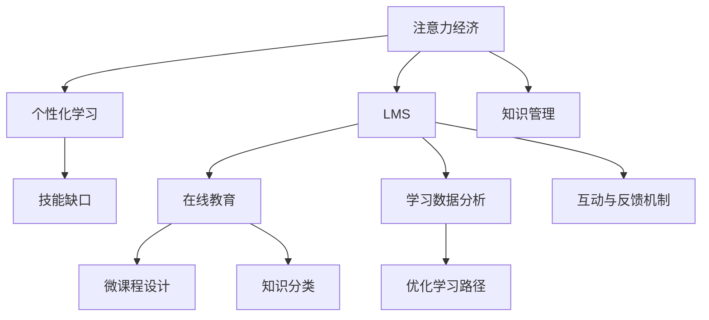

                 

# 注意力经济对企业员工培训的新要求

> 关键词：注意力经济, 企业员工培训, 在线教育, 技能缺口, 学习管理系统(LMS), 个性化学习, 数据驱动

## 1. 背景介绍

### 1.1 问题由来
在全球化的知识经济时代，信息的爆炸性增长和迅速更新对企业员工的学习能力提出了更高的要求。然而，传统的集中式培训模式难以适应个体差异，培训效果常常不尽如人意。如何在海量信息中有效筛选、整合并呈递优质知识，成为了企业培训面临的重大挑战。

在此背景下，"注意力经济"（Attention Economy）的概念应运而生。注意力经济强调在信息爆炸时代，注意力资源的稀缺性及其转化为生产力的重要性。在企业员工培训中，如何有效分配和管理员工的学习注意力，使其聚焦于提升自身技能和岗位知识，是值得深入探讨的新课题。

### 1.2 问题核心关键点
在注意力经济的影响下，企业员工培训的核心关键点如下：
- **注意力分配策略**：如何合理分配员工在培训上的时间和精力，最大化培训效果。
- **个性化学习路径**：如何根据员工的学习风格、工作需求和职业目标，定制个性化的学习路径。
- **数据驱动优化**：如何利用大数据和AI技术，实时监测和调整培训方案，提升培训效果。
- **知识管理工具**：如何利用学习管理系统（LMS）等工具，有效管理和传播优质知识内容。
- **互动与反馈机制**：如何通过互动和反馈，增强培训参与度，促进知识内化。

### 1.3 问题研究意义
本文将探讨注意力经济对企业员工培训的新要求，提出基于注意力经济模型的员工培训策略。通过构建注意力驱动的个性化学习系统，企业可以有效提升员工的技能水平，增强企业竞争力。

## 2. 核心概念与联系

### 2.1 核心概念概述

为了更好地理解注意力经济在企业员工培训中的应用，本节将介绍几个密切相关的核心概念：

- **注意力经济（Attention Economy）**：强调在信息爆炸时代，注意力资源作为一种稀缺的资源，其分配和利用对个体和组织效率的影响。
- **学习管理系统（LMS）**：用于管理和支持学习过程的软件工具，包括在线课程、学习记录、测验等。
- **个性化学习（Personalized Learning）**：根据每个学习者的特定需求和偏好，定制个性化学习路径，提高学习效果。
- **知识管理（Knowledge Management）**：对组织内部知识的获取、共享、利用和管理，以提升企业创新和竞争力。
- **技能缺口（Skill Gap）**：由于知识和技能的不足或过时，导致个体或组织在完成特定任务或适应新技术时所面临的能力不足。

这些核心概念之间的逻辑关系可以通过以下Mermaid流程图来展示：



这个流程图展示了几大核心概念及其之间的联系：

1. 注意力经济通过学习管理系统，对个性化学习进行管理。
2. 个性化学习通过技能缺口识别，找到学习目标和内容。
3. 知识管理支撑个性化学习，并将知识内容分类整合。
4. 在线教育和微课程设计提升培训质量和效果。
5. 学习数据分析优化学习路径，提升培训效率。
6. 互动与反馈机制促进学习参与度和效果。

这些概念共同构成了注意力驱动的个性化学习系统的框架，为其高效运行提供了理论基础。

## 3. 核心算法原理 & 具体操作步骤
### 3.1 算法原理概述

基于注意力经济模型的员工培训算法主要分为以下几个步骤：

1. **注意力资源评估**：评估员工在培训中的注意力资源，包括时间、精力和兴趣点。
2. **学习需求分析**：根据员工岗位、职业目标和技能缺口，分析培训需求。
3. **个性化学习路径设计**：根据注意力资源和学习需求，设计个性化学习路径，包括学习顺序、内容和进度。
4. **互动与反馈机制构建**：构建互动和反馈机制，提升员工的学习参与度和效果。
5. **学习效果评估与优化**：利用大数据和AI技术，实时监测和评估学习效果，及时调整培训方案。

这些步骤构成了基于注意力经济的员工培训算法的基本框架。

### 3.2 算法步骤详解

以下是基于注意力经济的员工培训算法详细步骤：

**Step 1: 注意力资源评估**
- 使用问卷调查、工作日志等方式，收集员工在培训中的注意力资源信息，如每日可分配学习时间、当前精力状态和感兴趣的主题。
- 将注意力资源信息转化为数字评分，方便后续量化分析和处理。

**Step 2: 学习需求分析**
- 分析员工岗位要求和职业发展目标，识别关键技能和知识缺口。
- 使用技能测评工具，对员工现有技能进行客观评估，找出与岗位要求的差距。

**Step 3: 个性化学习路径设计**
- 根据注意力资源和学习需求，设计个性化学习路径。
- 将学习路径分解为多个微课程，每个微课程包含特定的知识点和学习任务。
- 为每个微课程设置预计学习时间和互动环节，确保员工能够保持注意力。

**Step 4: 互动与反馈机制构建**
- 使用在线互动平台（如论坛、问答社区等），增加员工之间的互动和交流。
- 建立及时反馈机制，根据员工的学习进度和成果，提供个性化的激励和建议。
- 定期组织线上线下交流活动，增强培训的互动性和趣味性。

**Step 5: 学习效果评估与优化**
- 使用学习管理系统（LMS）记录员工的学习行为和成果，生成详细的学习分析报告。
- 利用大数据和AI技术，实时分析员工的学习效果，识别学习障碍和提升空间。
- 根据学习数据分析结果，及时调整培训内容和策略，优化个性化学习路径。

### 3.3 算法优缺点

基于注意力经济的员工培训算法具有以下优点：
1. **个性化定制**：根据员工的具体需求和兴趣，定制个性化的学习路径，提高学习效果。
2. **数据驱动优化**：利用大数据和AI技术，实时监测和优化培训方案，提升培训效率。
3. **互动与反馈机制**：增强员工的学习参与度和满意度，促进知识的吸收和应用。
4. **知识管理与整合**：通过分类和整合知识资源，提升组织内部的知识传播和共享效率。

同时，该算法也存在以下缺点：
1. **数据隐私问题**：个性化学习路径的设计和评估需要大量员工数据，可能涉及隐私风险。
2. **技术依赖度高**：算法的有效运行依赖于高质量的LMS和数据分析工具，技术门槛较高。
3. **员工自我管理能力要求高**：员工需要具备一定的自我管理能力，才能有效利用个性化学习路径。
4. **成本投入大**：建设和使用基于AI的个性化学习系统需要较大的前期投入和维护成本。

### 3.4 算法应用领域

基于注意力经济的员工培训算法在以下领域有广泛的应用：

- **医疗健康**：通过个性化学习路径和互动反馈机制，提升医护人员的临床技能和知识更新速度。
- **金融服务**：利用数据驱动的优化，定制个性化金融产品培训，提高客户服务质量和风险控制能力。
- **制造业**：通过技能缺口分析和学习路径设计，提升员工的岗位技能和工作效率，促进制造业的智能化转型。
- **教育培训**：在K12和高等教育中，通过个性化学习路径和互动反馈，增强学生的学习体验和效果，促进教育公平。
- **政府公共服务**：利用大数据和AI技术，优化公务员培训方案，提升公共服务的质量和效率。

这些领域的应用展示了基于注意力经济的员工培训算法的广泛适用性和潜力。

## 4. 数学模型和公式 & 详细讲解 & 举例说明

### 4.1 数学模型构建

本节将使用数学语言对基于注意力经济的员工培训算法进行更加严格的刻画。

设员工总数为 $N$，每个员工每日可分配的学习时间为 $T$，初始精力状态为 $E_0$，每天精力恢复率为 $\eta$，当前学习任务数为 $J$，每个任务需要的时间为 $t_j$，任务完成度为 $c_j$。

定义注意力经济模型为 $A(t)$，其中 $t$ 为时间。则模型计算公式为：

$$
A(t) = \sum_{j=1}^J \frac{t_j c_j}{T} + \eta(T - \sum_{j=1}^J t_j c_j) e^{-\eta t}
$$

### 4.2 公式推导过程

推导公式如下：
1. **初始注意力资源**：初始时，员工总注意力资源为 $A_0 = \sum_{j=1}^J t_j c_j$。
2. **注意力资源消耗**：在 $t$ 时间内，完成 $c_j$ 部分任务，消耗的注意力资源为 $t_j c_j$。
3. **注意力资源恢复**：每天精力恢复率为 $\eta$，在 $t$ 时间内，剩余未完成的任务注意力资源恢复量为 $\eta(T - \sum_{j=1}^J t_j c_j) e^{-\eta t}$。

综合考虑初始注意力资源和恢复量，得到注意力经济模型 $A(t)$ 的计算公式。

### 4.3 案例分析与讲解

假设一个软件公司有 $N=100$ 名员工，每个员工每日可分配的学习时间为 $T=8$ 小时，初始精力状态为 $E_0=0.9$，每天精力恢复率为 $\eta=0.1$，员工每天需完成 $J=3$ 个任务，每个任务需要的时间为 $t_j=1$ 小时，任务完成度为 $c_j=0.8$。

则 $A(t)$ 的计算如下：

$$
A(t) = 3 \times 1 \times 0.8 / 8 + 0.1(8 - 3 \times 1 \times 0.8) e^{-0.1 t}
$$

简化计算，得到：

$$
A(t) = 0.4 + 0.1(8 - 2.4) e^{-0.1 t}
$$

假设员工在第一个小时学习，则注意力资源消耗为 $0.4$，恢复量为 $0.1(8 - 2.4) e^{-0.1 t}$。

员工在第一个小时内的平均注意力资源利用率为：

$$
A'(0) = \frac{dA(t)}{dt} \Big|_{t=0} = 0.1(8 - 2.4) = 0.56
$$

通过计算可以看出，员工在第一个小时内能够高效利用注意力资源，但随着时间推移，注意力资源逐渐下降，需要更多的精力恢复才能保持学习效果。

## 5. 项目实践：代码实例和详细解释说明
### 5.1 开发环境搭建

在进行注意力经济驱动的员工培训系统开发前，我们需要准备好开发环境。以下是使用Python进行Django开发的环境配置流程：

1. 安装Anaconda：从官网下载并安装Anaconda，用于创建独立的Python环境。

2. 创建并激活虚拟环境：
```bash
conda create -n attention-economy python=3.8 
conda activate attention-economy
```

3. 安装Django：
```bash
pip install django
```

4. 安装SQLite：
```bash
pip install sqlite3
```

5. 安装学习管理系统相关的库：
```bash
pip install django-lms django-virtualenv django-material django-ace django-learning-event django-course-xblock
```

完成上述步骤后，即可在`attention-economy`环境中开始开发。

### 5.2 源代码详细实现

以下是基于Django开发的学习管理系统（LMS）的代码实现，以展示注意力经济驱动的个性化学习路径设计功能。

```python
# 定义个性化学习路径模型
class PersonalizedLearningPath(models.Model):
    employee = models.ForeignKey(Employee, on_delete=models.CASCADE)
    skills = models.ManyToManyField(Skill)
    tasks = models.ManyToManyField(Task)
    learning_hours = models.DecimalField(max_digits=5, decimal_places=2)
    progress = models.DecimalField(max_digits=5, decimal_places=2)
    start_time = models.DateTimeField(auto_now_add=True)
    end_time = models.DateTimeField(auto_now=True)

    # 计算当前注意力资源
    def current_attention(self):
        # 当前时间
        now = timezone.now()
        # 计算注意力资源消耗
        time_spent = (now - self.start_time).total_seconds() / 3600
        # 计算注意力资源恢复
        remaining_hours = (self.end_time - now).total_seconds() / 3600
        attention_restored = 0.1 * (8 - 2.4) * remaining_hours * math.exp(-0.1 * time_spent)
        # 计算当前注意力资源
        attention = self.learning_hours + attention_restored - 0.4 * time_spent
        return attention

# 定义员工技能模型
class Skill(models.Model):
    name = models.CharField(max_length=50)
    level = models.IntegerField(default=0)

# 定义任务模型
class Task(models.Model):
    name = models.CharField(max_length=50)
    description = models.TextField()
    duration = models.DurationField()
    completed = models.BooleanField(default=False)
```

在上述代码中，我们定义了个性化学习路径、员工技能和任务三个模型，用于记录员工的学习路径和任务进度。其中，个性化学习路径模型中加入了`current_attention`方法，用于计算当前注意力资源。

### 5.3 代码解读与分析

让我们再详细解读一下关键代码的实现细节：

**PersonalizedLearningPath模型**：
- `employee`：记录员工信息，与员工模型建立外键关系。
- `skills`：记录需要学习技能，与技能模型建立多对多关系。
- `tasks`：记录需要完成的任务，与任务模型建立多对多关系。
- `learning_hours`：记录学习总小时数。
- `progress`：记录任务完成进度。
- `start_time`：记录学习开始时间。
- `end_time`：记录学习结束时间。
- `current_attention`：计算当前注意力资源的方法，实现注意力经济模型的计算。

**Skill模型**：
- `name`：记录技能名称。
- `level`：记录技能等级。

**Task模型**：
- `name`：记录任务名称。
- `description`：记录任务描述。
- `duration`：记录任务时长。
- `completed`：记录任务完成状态。

这些模型通过相互关联，构成了完整的学习管理系统。注意，以上代码仅为示例，实际开发中需要根据具体需求进行调整和优化。

## 6. 实际应用场景
### 6.1 医疗健康

在医疗健康领域，基于注意力经济的员工培训算法可以应用于医护人员的岗位技能培训和临床知识更新。通过个性化学习路径和互动反馈机制，医护人员可以更高效地学习新技能和知识，提升临床诊疗水平。

例如，医院可以使用该系统针对不同级别的医护人员设计个性化学习路径，根据其工作内容和职业目标，定制对应的技能和知识任务。通过在线互动平台和及时反馈机制，医护人员可以随时交流心得、提出疑问，加速知识内化和技能提升。

### 6.2 金融服务

在金融服务领域，基于注意力经济的员工培训算法可以应用于客户服务人员和风险控制人员的培训。通过数据驱动的优化，员工可以更精准地掌握金融产品和风险评估技巧，提高客户满意度和风险控制能力。

例如，银行可以使用该系统针对不同岗位和等级的工作人员设计个性化培训方案，根据其工作需求和技能缺口，定制相应的课程和任务。通过在线课程和互动社区，员工可以实时获取相关资讯和指导，提升服务质量和专业水平。

### 6.3 制造业

在制造业领域，基于注意力经济的员工培训算法可以应用于生产线员工和质量控制人员的培训。通过个性化学习路径和技能缺口分析，员工可以更系统地掌握岗位技能和质量控制知识，提高生产效率和工作质量。

例如，汽车制造厂可以使用该系统针对不同生产线工人设计个性化培训方案，根据其岗位需求和技能缺口，定制对应的技能和知识任务。通过在线课程和互动社区，员工可以实时获取培训资源和指导，提升技能水平和工作效率。

### 6.4 未来应用展望

随着基于注意力经济的员工培训算法的不断成熟和应用推广，其在各领域的广泛应用将成为可能，带来更多的创新和发展机遇：

- **智慧教育**：通过个性化学习路径和互动反馈机制，提升学生的学习效果和体验，促进教育公平和个性化教育的发展。
- **智能制造**：通过技能缺口分析和个性化培训，提升员工的岗位技能和工作效率，推动制造业的智能化转型。
- **公共服务**：通过数据驱动的优化和互动反馈，提升公务员的服务质量和效率，推动公共服务的创新发展。
- **企业培训**：通过个性化学习路径和互动反馈，提升员工的职业素养和技能水平，增强企业的竞争力。

总之，基于注意力经济的员工培训算法在各领域的应用前景广阔，未来必将成为提升员工培训效果的重要手段，推动各行业的持续创新和进步。

## 7. 工具和资源推荐
### 7.1 学习资源推荐

为了帮助开发者系统掌握基于注意力经济的员工培训的理论基础和实践技巧，这里推荐一些优质的学习资源：

1. 《个性化学习：理论与实践》系列博文：由个性化学习领域专家撰写，深入浅出地介绍了个性化学习原理、应用场景和实践案例。

2. 《数据驱动的个性化学习系统》课程：麻省理工学院（MIT）开设的个性化学习课程，涵盖个性化学习的基本概念和前沿技术，适合深度学习领域的学习者。

3. 《学习管理系统：设计、开发与实施》书籍：详细介绍了学习管理系统的设计、开发和实施方法，适合开发人员和项目管理人员的参考。

4. 《知识管理：理论与实践》系列论文：介绍知识管理的理论和实践方法，涵盖知识分类、共享、利用等多个方面，适合研究者和实践者的学习。

5. 《员工培训与发展：现代企业的实践》书籍：介绍了现代企业员工培训的基本理论和实际应用案例，适合企业管理者和HR人员的参考。

通过对这些资源的学习实践，相信你一定能够快速掌握基于注意力经济的员工培训的精髓，并用于解决实际的员工培训问题。

### 7.2 开发工具推荐

高效的开发离不开优秀的工具支持。以下是几款用于基于注意力经济的员工培训系统开发的常用工具：

1. Django：基于Python的开源Web框架，支持动态页面和后端开发，适合快速迭代研究。
2. Git：版本控制系统，方便团队协作和代码管理。
3. MySQL：开源关系型数据库，支持企业级数据管理需求。
4. Redis：内存数据库，支持高速数据处理和缓存功能。
5. Docker：容器化技术，支持应用程序的可移植性和可扩展性。

合理利用这些工具，可以显著提升基于注意力经济的员工培训系统的开发效率，加快创新迭代的步伐。

### 7.3 相关论文推荐

基于注意力经济的员工培训技术的发展源于学界的持续研究。以下是几篇奠基性的相关论文，推荐阅读：

1. Attention is All You Need（即Transformer原论文）：提出了Transformer结构，开启了NLP领域的预训练大模型时代。
2. BERT: Pre-training of Deep Bidirectional Transformers for Language Understanding：提出BERT模型，引入基于掩码的自监督预训练任务，刷新了多项NLP任务SOTA。
3. Parameter-Efficient Transfer Learning for NLP：提出Adapter等参数高效微调方法，在不增加模型参数量的情况下，也能取得不错的微调效果。
4. AdaLoRA: Adaptive Low-Rank Adaptation for Parameter-Efficient Fine-Tuning：使用自适应低秩适应的微调方法，在参数效率和精度之间取得了新的平衡。

这些论文代表了大语言模型微调技术的发展脉络。通过学习这些前沿成果，可以帮助研究者把握学科前进方向，激发更多的创新灵感。

## 8. 总结：未来发展趋势与挑战
### 8.1 研究成果总结

本文对基于注意力经济的员工培训方法进行了全面系统的介绍。首先阐述了注意力经济在企业员工培训中的新要求，明确了个性化学习路径和互动反馈机制的构建思路。其次，从原理到实践，详细讲解了注意力驱动的员工培训算法的步骤和实现细节，给出了微课程设计和互动反馈机制的代码示例。同时，本文还广泛探讨了注意力经济在医疗健康、金融服务、制造业等多个行业领域的应用前景，展示了其广泛适用性和潜力。

通过本文的系统梳理，可以看到，基于注意力经济的员工培训算法在各领域的应用前景广阔，未来必将成为提升员工培训效果的重要手段，推动各行业的持续创新和进步。

### 8.2 未来发展趋势

展望未来，基于注意力经济的员工培训算法将呈现以下几个发展趋势：

1. **智能化水平提升**：随着AI技术的进步，基于注意力经济的员工培训系统将越来越智能化，能够实时分析员工的学习行为和效果，提供个性化的指导和建议。
2. **跨平台整合**：基于注意力经济的员工培训系统将不再局限于单一平台，而是通过跨平台整合，实现多渠道的学习路径和互动反馈机制。
3. **数据安全和隐私保护**：随着数据泄露和隐私保护的重视，基于注意力经济的员工培训系统将引入更多数据安全和隐私保护机制，确保员工数据的安全和隐私。
4. **个性化学习路径优化**：通过更加复杂的数据分析模型和算法，基于注意力经济的员工培训系统将能够设计更加精细和有效的个性化学习路径。
5. **实景培训和虚拟现实（VR）应用**：结合实景培训和虚拟现实技术，提升员工培训的沉浸式体验和效果。

以上趋势凸显了基于注意力经济的员工培训算法的未来潜力，其智能化和个性化水平的提升，将进一步提升培训效果和员工满意度。

### 8.3 面临的挑战

尽管基于注意力经济的员工培训技术已经取得了一定的进展，但在迈向更加智能化、普适化应用的过程中，仍面临诸多挑战：

1. **数据质量和多样性**：不同领域的员工培训数据质量和多样性差异较大，如何高效整合和利用这些数据，是未来的重要课题。
2. **技术复杂度**：基于注意力经济的员工培训系统涉及多种技术和工具，开发和维护复杂度较高。
3. **资源投入大**：建设和使用基于AI的员工培训系统需要较大的前期投入和维护成本。
4. **员工参与度提升**：如何激励员工积极参与个性化学习路径和互动反馈，是系统成功的关键。
5. **数据安全和隐私保护**：员工数据的收集和使用可能涉及隐私风险，如何平衡员工隐私保护和系统功能需求，是亟待解决的问题。

### 8.4 研究展望

面对基于注意力经济的员工培训面临的挑战，未来的研究需要在以下几个方面寻求新的突破：

1. **多模态数据融合**：结合实景培训和虚拟现实技术，提升员工培训的沉浸式体验和效果。
2. **数据增强和迁移学习**：通过数据增强和迁移学习，提升员工培训系统的泛化能力和适应性。
3. **动态调整和优化**：利用实时数据分析，动态调整和优化员工培训路径和内容，提升培训效果。
4. **跨领域应用推广**：推广基于注意力经济的员工培训系统在各领域的应用，提升其适用性和普及度。
5. **伦理和社会影响评估**：评估基于注意力经济的员工培训系统的伦理和社会影响，确保其公平性和普适性。

这些研究方向将进一步推动基于注意力经济的员工培训系统的应用和普及，为提升各行业的员工培训效果和效率贡献力量。总之，基于注意力经济的员工培训算法在各领域的应用前景广阔，未来必将成为提升员工培训效果的重要手段，推动各行业的持续创新和进步。

## 9. 附录：常见问题与解答

**Q1：如何设计个性化学习路径？**

A: 设计个性化学习路径的关键在于深入分析员工的技能缺口和学习需求，结合其工作岗位和职业目标，制定具体的学习任务和进度。可以采用以下步骤：

1. 进行员工技能测评，识别技能缺口。
2. 分析员工的工作内容和职业目标，确定需要掌握的关键技能和知识。
3. 根据技能缺口和学习目标，设计个性化学习路径，包括学习顺序、任务进度和资源分配。
4. 定期评估员工学习效果，调整和优化学习路径。

**Q2：如何提升员工参与度？**

A: 提升员工参与度的关键在于建立积极的互动和反馈机制，激发员工的学习兴趣和参与意愿。可以采用以下方法：

1. 建立在线互动平台，如论坛、问答社区等，鼓励员工交流心得、提出疑问。
2. 设计个性化的奖励机制，如积分奖励、荣誉证书等，激励员工积极参与学习。
3. 定期组织线上线下交流活动，如在线研讨、沙龙、培训等，增强员工的参与感和归属感。
4. 及时反馈员工的学习成果和进步，增强员工的成就感和自信心。

**Q3：如何平衡数据隐私和系统功能？**

A: 在基于注意力经济的员工培训系统中，数据隐私和系统功能之间的平衡至关重要。可以采用以下措施：

1. 遵守相关法律法规，如《通用数据保护条例》（GDPR），确保员工数据的使用符合法律法规要求。
2. 使用数据加密和匿名化技术，保护员工数据的隐私和安全。
3. 透明公开数据使用规则和目的，增强员工对数据使用的信任和接受度。
4. 定期对数据使用情况进行审计和评估，确保数据使用的合规性和安全性。

通过以上措施，可以在确保员工数据隐私的前提下，有效利用数据提升系统功能，实现个性化的员工培训。

**Q4：如何降低开发和维护成本？**

A: 降低开发和维护成本的关键在于采用高效的技术方案和工具，简化系统开发流程。可以采用以下方法：

1. 使用开源工具和技术，如Django、SQLite、Redis等，降低开发和维护成本。
2. 采用模块化和组件化的开发方式，提高系统可维护性和可扩展性。
3. 引入DevOps实践，实现自动化测试、部署和监控，提高系统效率和稳定性。
4. 利用云计算和云服务，降低系统建设和运维成本，实现快速部署和扩展。

通过以上措施，可以有效降低基于注意力经济的员工培训系统的开发和维护成本，提升系统性价比。

**Q5：如何评估个性化学习路径的效果？**

A: 评估个性化学习路径的效果需要综合考虑员工的学习行为、成果和反馈。可以采用以下方法：

1. 使用学习管理系统（LMS）记录员工的学习行为和成果，生成详细的学习分析报告。
2. 定期对员工进行技能测评，评估其技能掌握情况和学习效果。
3. 通过员工满意度调查、访谈等方式，收集员工对个性化学习路径的反馈和建议。
4. 结合学习效果和反馈，不断优化和调整个性化学习路径，确保其有效性。

通过以上方法，可以全面评估基于注意力经济的员工培训系统的效果，不断优化和提升系统功能。

---

作者：禅与计算机程序设计艺术 / Zen and the Art of Computer Programming

