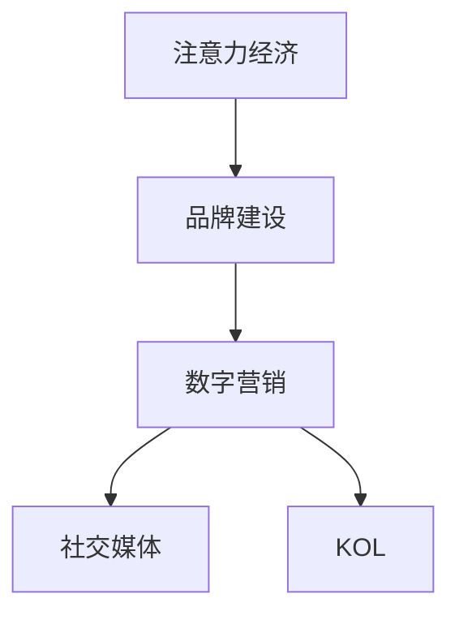

                 

# 注意力经济对企业品牌建设的新挑战

在数字化时代，品牌建设已经从传统的线下营销转向以用户注意力为核心的线上经营。注意力经济成为了企业获取市场份额、提升品牌价值的关键。本文将从注意力经济的角度出发，探讨其在企业品牌建设中的新挑战和应对策略。

## 1. 背景介绍

### 1.1 问题由来
随着互联网和社交媒体的兴起，信息爆炸的时代，用户注意力的争夺变得愈发激烈。企业需要更加精准地吸引和引导用户的注意力，才能在市场中脱颖而出。

### 1.2 问题核心关键点
注意力经济的核心在于如何有效吸引和保持用户注意力，将其转化为品牌忠诚度和商业价值。现代品牌建设需要打破传统思维，利用数字化的手段，更直接、更深入地与用户互动。

### 1.3 问题研究意义
对于企业而言，在注意力经济时代，品牌建设不仅关系到产品的销量，更决定了企业的市场影响力和长期发展。研究注意力经济，有助于企业更好地把握用户行为，制定精准的品牌策略，提升品牌竞争力。

## 2. 核心概念与联系

### 2.1 核心概念概述

为了更好地理解注意力经济在品牌建设中的作用和影响，本节将介绍几个关键概念：

- 注意力经济(Attention Economy)：指在信息过载的时代，企业通过各种手段争夺用户注意力，获取市场竞争优势的经济形态。
- 品牌建设(Branding)：指企业通过一系列策略和活动，建立和提升品牌价值的过程。
- 数字营销(Digital Marketing)：指利用数字技术和平台，开展以用户为中心的营销活动，提升品牌知名度和用户参与度。
- 社交媒体(Social Media)：指用户可发布、交流和分享信息的虚拟平台，如微博、微信、抖音等。
- KOL(Key Opinion Leader)：指在特定领域具有高度影响力的人或机构，如网红、专家等。

这些概念之间的关系可以通过以下Mermaid流程图来展示：



这个流程图展示了注意力经济通过数字营销和社交媒体，与品牌建设之间的联系。企业通过数字营销在社交媒体上与KOL合作，吸引用户注意力，从而提升品牌价值。

## 3. 核心算法原理 & 具体操作步骤
### 3.1 算法原理概述

注意力经济的核心在于如何最大化地利用用户注意力，实现商业价值。企业需要设计出能够吸引用户注意力的内容，并通过数据分析和用户行为预测，进一步提升注意力利用效率。

基于这种原理，注意力经济下的品牌建设可以概括为以下几个关键步骤：

1. **内容创作**：创造与用户兴趣相符的高质量内容，以吸引和保持用户注意力。
2. **用户分析**：通过数据分析，深入了解用户兴趣和行为，进行精准营销。
3. **渠道优化**：选择并优化用户注意力的传播渠道，提升内容传播效率。
4. **效果评估**：定期评估品牌建设的效果，及时调整策略，持续优化。

### 3.2 算法步骤详解

#### 步骤1: 内容创作
内容创作是吸引用户注意力的基础。通过以下步骤，可以创建高质量、有吸引力的内容：

1. **目标设定**：明确品牌建设的目标，制定内容策略。
2. **用户调研**：通过问卷调查、用户访谈等方式，了解目标用户群体的兴趣和需求。
3. **创意设计**：根据用户调研结果，设计内容主题和形式，如短视频、图文、直播等。
4. **内容生产**：组织专业团队进行内容创作，确保内容质量。

#### 步骤2: 用户分析
通过数据分析，深入了解用户行为和兴趣，有助于提升内容的精准度和吸引力。以下步骤详细说明了数据分析的流程：

1. **数据采集**：收集用户在社交媒体、网站等平台上的行为数据，如浏览记录、互动数据等。
2. **数据清洗**：处理和清洗数据，确保数据质量和一致性。
3. **数据分析**：使用机器学习、统计分析等方法，对用户行为进行深入分析，挖掘用户兴趣和偏好。
4. **结果应用**：将分析结果应用到内容创作和营销策略中，提升内容的个性化和精准度。

#### 步骤3: 渠道优化
选择和优化用户注意力的传播渠道，是提升注意力利用效率的关键。以下步骤详细说明了渠道优化的流程：

1. **渠道选择**：根据用户群体特点，选择适合的内容传播渠道，如微博、微信、抖音等。
2. **资源投入**：合理配置人力、物力和财力资源，确保渠道传播效果。
3. **效果监控**：实时监控各渠道的表现，及时调整优化策略。
4. **渠道评估**：定期评估各渠道的传播效果，选择效果最优的渠道。

#### 步骤4: 效果评估
定期评估品牌建设的效果，有助于及时调整策略，持续优化。以下步骤详细说明了效果评估的流程：

1. **指标设定**：根据品牌建设目标，设定效果评估指标，如品牌知名度、用户参与度等。
2. **数据收集**：收集各渠道的效果数据，如访问量、互动量等。
3. **数据分析**：使用数据分析工具，对效果数据进行分析，评估各渠道的表现。
4. **结果应用**：根据评估结果，调整内容策略和渠道选择，持续优化品牌建设。

### 3.3 算法优缺点

#### 优点
1. **提升品牌知名度**：通过精准的数字化营销，提升品牌在目标用户中的知名度。
2. **增强用户参与度**：通过内容创作和数据分析，增强用户对品牌的参与度和忠诚度。
3. **提高营销效率**：优化传播渠道和内容策略，提升营销活动的效率和效果。

#### 缺点
1. **资源消耗大**：内容创作和数据分析需要大量人力和物力资源。
2. **用户注意力分散**：互联网时代，用户注意力容易被分散，品牌建设的难度加大。
3. **数据隐私问题**：用户数据分析涉及用户隐私，需要严格遵守法律法规。

### 3.4 算法应用领域

注意力经济下的品牌建设方法，已经广泛应用于各个行业，包括但不限于以下领域：

1. **电商行业**：通过社交媒体和直播等渠道，吸引用户注意，提升品牌影响力和销售额。
2. **快消行业**：利用KOL和网红效应，通过短视频和直播等方式，推广产品和品牌。
3. **旅游行业**：通过社交媒体和旅游博客等渠道，展示旅游目的地魅力，吸引用户关注和参与。
4. **教育行业**：通过在线课程和社交媒体互动，提升品牌知名度和用户参与度。
5. **金融行业**：利用短视频和直播等方式，向用户普及金融知识，提升品牌信任度。

## 4. 数学模型和公式 & 详细讲解 & 举例说明

### 4.1 数学模型构建

注意力经济下的品牌建设，可以通过数学模型来描述和分析。以下是一个简单的数学模型：

设 $X$ 为用户行为数据，$Y$ 为用户关注度，$W$ 为模型参数。模型的目标是最小化预测误差：

$$
\min_{W} \|Y - f(X,W)\|
$$

其中 $f(X,W)$ 为用户行为数据 $X$ 通过模型 $W$ 预测的用户关注度。

### 4.2 公式推导过程

根据上述模型，可以推导出一个简单的线性回归模型：

$$
Y = \sum_{i=1}^{n} w_i X_i + b
$$

其中 $X_i$ 为第 $i$ 个特征，$w_i$ 为第 $i$ 个特征的权重，$b$ 为截距。

### 4.3 案例分析与讲解

以电商行业为例，可以构建一个用户关注度预测模型。首先，收集用户在社交媒体上的行为数据，如浏览记录、评论等，作为输入特征 $X$。然后，根据用户历史购买记录和品牌互动情况，计算用户对品牌的关注度 $Y$。最后，通过线性回归模型，预测新用户对品牌的关注度。

## 5. 项目实践：代码实例和详细解释说明

### 5.1 开发环境搭建

在进行注意力经济下的品牌建设实践前，我们需要准备好开发环境。以下是使用Python进行Scikit-learn开发的环境配置流程：

1. 安装Anaconda：从官网下载并安装Anaconda，用于创建独立的Python环境。

2. 创建并激活虚拟环境：
```bash
conda create -n attention-env python=3.8 
conda activate attention-env
```

3. 安装Scikit-learn：
```bash
pip install scikit-learn
```

4. 安装各类工具包：
```bash
pip install numpy pandas scikit-learn matplotlib tqdm jupyter notebook ipython
```

完成上述步骤后，即可在`attention-env`环境中开始实践。

### 5.2 源代码详细实现

下面我们以电商行业为例，给出使用Scikit-learn进行用户关注度预测的Python代码实现。

首先，定义模型和数据集：

```python
from sklearn.linear_model import LinearRegression
from sklearn.model_selection import train_test_split
import pandas as pd

# 加载数据
data = pd.read_csv('user_behavior.csv')

# 分离特征和标签
X = data[['浏览时间', '评论数量', '购买次数']]
Y = data['品牌关注度']

# 划分训练集和测试集
X_train, X_test, Y_train, Y_test = train_test_split(X, Y, test_size=0.2, random_state=42)

# 创建模型
model = LinearRegression()
```

接着，进行模型训练和评估：

```python
# 训练模型
model.fit(X_train, Y_train)

# 评估模型
Y_pred = model.predict(X_test)
```

最后，输出模型评估结果：

```python
# 输出模型评估结果
print(model.score(X_test, Y_test))
```

以上就是使用Scikit-learn进行电商行业用户关注度预测的完整代码实现。可以看到，借助Scikit-learn，我们通过线性回归模型实现了对用户关注度的预测，可以进一步优化模型参数，提升预测精度。

### 5.3 代码解读与分析

让我们再详细解读一下关键代码的实现细节：

**用户行为数据**：
- 数据集 `user_behavior.csv` 包含了用户在社交媒体上的行为数据，如浏览时间、评论数量、购买次数等。

**模型训练**：
- 使用 `train_test_split` 方法将数据集划分为训练集和测试集，避免过拟合。
- 创建线性回归模型，并使用 `fit` 方法进行训练。

**模型评估**：
- 使用 `predict` 方法对测试集进行预测，并计算模型的评估指标。

**输出结果**：
- 输出模型的评估指标，如均方误差、R²值等，评估模型性能。

## 6. 实际应用场景

### 6.1 社交媒体品牌推广

社交媒体是注意力经济的重要渠道。企业可以通过社交媒体平台，发布高质量、有吸引力的内容，提升品牌知名度和用户参与度。

以下是一个具体的社交媒体品牌推广案例：

1. **内容创作**：创建一系列与品牌形象和用户兴趣相符的短视频、图文等，通过KOL和网红进行推广。
2. **数据分析**：收集用户在社交媒体上的互动数据，如点赞、评论、分享等，分析用户兴趣和行为。
3. **渠道优化**：选择和优化传播渠道，如微博、抖音等，确保内容有效传播。
4. **效果评估**：定期评估品牌推广效果，及时调整策略，优化品牌建设。

### 6.2 电商平台产品推荐

电商平台是注意力经济的重要应用场景。企业可以通过推荐系统，向用户推荐个性化产品，提升用户满意度和品牌忠诚度。

以下是一个具体的电商平台产品推荐案例：

1. **内容创作**：根据用户浏览记录和购买历史，推荐个性化产品，并展示相关视频、图文等。
2. **数据分析**：收集用户行为数据，如浏览时间、点击率、购买次数等，分析用户偏好和购买倾向。
3. **渠道优化**：在电商平台上优化推荐算法和展示方式，提升用户购买转化率。
4. **效果评估**：定期评估推荐系统的效果，优化推荐策略，提升用户满意度。

### 6.3 旅游行业目的地推广

旅游行业是注意力经济的重要应用领域。企业可以通过社交媒体和旅游博客等渠道，展示旅游目的地的独特魅力，吸引用户关注和参与。

以下是一个具体的旅游行业目的地推广案例：

1. **内容创作**：创建一系列短视频、图文等，展示旅游目的地的自然风光、人文景观等。
2. **数据分析**：收集用户在社交媒体上的互动数据，如点赞、评论、分享等，分析用户兴趣和行为。
3. **渠道优化**：选择和优化传播渠道，如微博、抖音等，确保内容有效传播。
4. **效果评估**：定期评估品牌推广效果，及时调整策略，优化品牌建设。

## 7. 工具和资源推荐
### 7.1 学习资源推荐

为了帮助开发者系统掌握注意力经济在品牌建设中的应用，这里推荐一些优质的学习资源：

1. **《数字营销的艺术》（《The Art of Digital Marketing》）**：介绍了数字营销的基本概念、策略和实践技巧，是学习数字营销的经典入门书籍。

2. **《社交媒体营销秘籍》（《Social Media Marketing Secrets》）**：介绍了社交媒体营销的最新趋势和实用技巧，帮助品牌在社交媒体上获得更多关注和互动。

3. **《KOL营销的力量》（《The Power of KOL Marketing》）**：深入分析了KOL在品牌建设中的作用和影响，提供了KOL营销的实践案例和策略。

4. **Coursera《数字营销专业课程》**：斯坦福大学和加州大学伯克利分校联合开设的数字营销专业课程，涵盖数字营销的各个方面，适合系统学习。

5. **Udemy《社交媒体营销实战》**：Udemy上的社交媒体营销实战课程，通过实际案例讲解社交媒体营销的策略和技巧。

通过对这些资源的学习实践，相信你一定能够快速掌握注意力经济在品牌建设中的应用，并用于解决实际的营销问题。

### 7.2 开发工具推荐

高效的开发离不开优秀的工具支持。以下是几款用于注意力经济品牌建设开发的常用工具：

1. **Jupyter Notebook**：轻量级的交互式编程环境，支持Python、R等多种语言，适合进行数据探索和模型实验。

2. **Google Colab**：免费的云端Jupyter Notebook环境，提供GPU和TPU算力支持，方便开发者进行高性能计算。

3. **Tableau**：数据可视化工具，可以帮助开发者直观地展示和分析数据，进行数据分析和可视化。

4. **SAS Visual Analytics**：商业智能工具，支持复杂的数据分析和报表生成，适用于企业级应用。

5. **Adobe Analytics**：数字营销分析工具，可以全面监控和分析用户行为，优化营销策略。

合理利用这些工具，可以显著提升注意力经济下的品牌建设效率，加快创新迭代的步伐。

### 7.3 相关论文推荐

注意力经济下的品牌建设技术已经得到了广泛的研究。以下是几篇奠基性的相关论文，推荐阅读：

1. **《品牌建设的新趋势》**：探讨了品牌建设在数字化时代的新趋势和挑战，提出了一些创新性的策略。

2. **《注意力经济下的营销策略》**：分析了注意力经济对品牌建设的影响，提出了一些有效的营销策略和实践方法。

3. **《社交媒体对品牌认知的影响》**：通过实证研究，探讨了社交媒体对品牌认知的影响机制和优化策略。

4. **《KOL营销的效果评估》**：通过数据分析，评估了KOL营销的效果，提出了一些优化策略和实践建议。

5. **《电商平台推荐系统的研究》**：介绍了电商平台推荐系统的实现方法和应用效果，为品牌建设提供了数据支持。

这些论文代表了大数据和人工智能技术在品牌建设中的应用方向，有助于进一步理解和实践注意力经济下的品牌建设。

## 8. 总结：未来发展趋势与挑战

### 8.1 总结

本文从注意力经济的角度，探讨了其在企业品牌建设中的新挑战和应对策略。首先阐述了注意力经济在品牌建设中的重要性和研究背景，明确了注意力经济与品牌建设之间的联系。其次，从内容创作、用户分析、渠道优化和效果评估四个方面，详细讲解了注意力经济下的品牌建设流程。最后，通过具体的电商、社交媒体和旅游行业案例，展示了注意力经济在实际应用中的效果和挑战。

通过本文的系统梳理，可以看到，注意力经济在品牌建设中的应用已经变得愈发重要。企业在品牌建设中，需要更加注重用户注意力的争夺和利用，通过高质量的内容创作、深入的用户分析、优化的传播渠道和持续的效果评估，提升品牌的知名度和用户参与度，最终实现商业价值的最大化。

### 8.2 未来发展趋势

展望未来，注意力经济下的品牌建设将呈现以下几个发展趋势：

1. **个性化推荐**：通过精准的数据分析和用户行为预测，实现个性化的品牌推荐，提升用户满意度和忠诚度。
2. **多渠道融合**：整合多种传播渠道，实现多渠道融合营销，提升品牌传播效果。
3. **动态调整**：实时监控品牌建设效果，动态调整策略，优化品牌建设过程。
4. **数据驱动**：通过大数据分析和人工智能技术，驱动品牌建设的各个环节，实现精准化、智能化。
5. **KOL营销**：利用KOL的影响力，提升品牌知名度和用户参与度，成为品牌建设的有效手段。
6. **多模态内容**：结合文字、图片、视频等多模态内容，提升品牌信息的丰富性和吸引力。

这些趋势表明，企业在品牌建设中需要更加注重数据驱动和个性化推荐，通过多渠道融合和动态调整，实现品牌的精准化和智能化。

### 8.3 面临的挑战

尽管注意力经济下的品牌建设已经取得了一定成效，但在实现品牌的精准化和智能化过程中，仍面临诸多挑战：

1. **数据隐私问题**：用户行为数据的收集和使用涉及用户隐私，需要严格遵守法律法规。
2. **数据质量问题**：用户行为数据的质量和一致性对品牌建设的效果影响很大，需要投入大量资源进行数据清洗和处理。
3. **资源消耗问题**：内容创作和数据分析需要大量人力和物力资源，成本较高。
4. **用户注意力分散**：互联网时代，用户注意力容易被分散，品牌建设的难度加大。
5. **效果评估困难**：品牌建设的成效评估涉及多渠道、多指标，需要综合考虑各种因素，难以全面评估。

### 8.4 研究展望

面对注意力经济下的品牌建设所面临的挑战，未来的研究需要在以下几个方面寻求新的突破：

1. **数据隐私保护**：研究数据隐私保护技术，确保用户数据的安全和合规。
2. **数据高效处理**：开发高效的数据处理和分析工具，提升数据质量和利用效率。
3. **多模态内容创作**：探索多模态内容创作技术，提升品牌信息的丰富性和吸引力。
4. **动态调整策略**：研究动态调整策略，实时优化品牌建设过程。
5. **效果评估方法**：研究品牌建设效果的综合评估方法，全面评估品牌建设的效果。

这些研究方向的探索，将有助于克服注意力经济下的品牌建设挑战，推动品牌建设技术的进一步发展。

## 9. 附录：常见问题与解答

**Q1：注意力经济对企业品牌建设有何影响？**

A: 注意力经济对企业品牌建设有着深远的影响。通过数字化手段，企业可以更好地吸引和保持用户注意力，提升品牌知名度和用户参与度，从而实现商业价值的最大化。

**Q2：如何进行注意力经济下的品牌建设？**

A: 注意力经济下的品牌建设需要从内容创作、用户分析、渠道优化和效果评估四个方面入手。具体步骤如下：
1. 内容创作：创建与用户兴趣相符的高质量内容。
2. 用户分析：通过数据分析，深入了解用户兴趣和行为。
3. 渠道优化：选择和优化传播渠道，提升内容传播效率。
4. 效果评估：定期评估品牌建设的效果，及时调整策略，优化品牌建设。

**Q3：如何提升品牌建设的个性化推荐效果？**

A: 提升品牌建设的个性化推荐效果，需要从以下几个方面入手：
1. 收集和处理用户行为数据，确保数据质量和一致性。
2. 使用机器学习算法，进行用户行为预测和推荐模型训练。
3. 结合用户画像和兴趣标签，优化推荐算法和展示方式。
4. 实时监控推荐效果，动态调整推荐策略，提升推荐精度。

**Q4：如何保障数据隐私和安全？**

A: 保障数据隐私和安全，需要从以下几个方面入手：
1. 遵守相关法律法规，如GDPR、CCPA等。
2. 采用数据加密和匿名化技术，保护用户隐私。
3. 定期进行数据安全审计，发现和修复安全漏洞。
4. 使用区块链技术，确保数据溯源和可信性。

**Q5：如何优化品牌建设的渠道选择和效果评估？**

A: 优化品牌建设的渠道选择和效果评估，需要从以下几个方面入手：
1. 选择与用户群体相符的传播渠道，如社交媒体、电商平台等。
2. 合理配置资源，确保渠道传播效果。
3. 实时监控各渠道的表现，及时调整优化策略。
4. 定期评估各渠道的传播效果，选择效果最优的渠道。

---

作者：禅与计算机程序设计艺术 / Zen and the Art of Computer Programming

