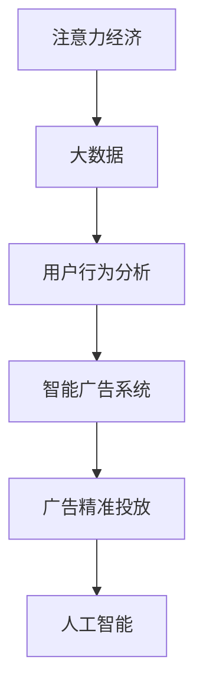

                 

# 注意力经济对传统商业广告的改造

> 关键词：注意力经济,商业广告,大数据,人工智能,用户行为,广告精准投放,智能广告系统

## 1. 背景介绍

### 1.1 问题由来

在信息爆炸的时代，传统商业广告面临着巨大的挑战。一方面，广告主需要面对海量用户，如何精准地触达目标受众是一个复杂而关键的问题。另一方面，随着数字化进程的加速，用户对于广告的接受度和耐受度也在不断降低，传统广告方式的效果正在被不断削弱。

为应对这一挑战，我们提出了基于注意力经济的广告改造方案。通过利用大数据和人工智能技术，对用户行为进行深度挖掘和精准分析，我们可以构建出更加高效、个性化的广告投放系统，从而实现广告的高精准度和高转化率。

### 1.2 问题核心关键点

- **数据驱动**：广告投放的决策基于对用户行为数据的深入分析，实现更加精准的定向和优化。
- **智能算法**：利用人工智能技术，构建智能广告投放系统，提高广告效果和效率。
- **用户个性化**：根据用户兴趣和行为，定制个性化的广告内容，提升用户体验。
- **广告精准投放**：通过用户行为数据和智能算法，实现对目标受众的精准锁定和精准投放。
- **持续优化**：广告系统应具备自适应和自学习的能力，不断优化广告投放策略，提高ROI。

## 2. 核心概念与联系

### 2.1 核心概念概述

为更好地理解注意力经济在商业广告中的应用，本节将介绍几个关键概念：

- **注意力经济**：指在信息过载的社会中，通过获取、保持和转换用户注意力，创造经济价值的过程。在广告领域，注意力经济的核心在于如何高效、精准地获取和利用用户注意力，以提高广告效果。

- **大数据**：指通过分析海量数据集，揭示数据背后的规律和模式，为决策提供支撑。在大广告投放中，大数据可以提供对用户行为的全面洞察，指导广告的精准投放。

- **人工智能**：指利用机器学习和深度学习等技术，使计算机具备感知、理解和自主决策的能力。人工智能在广告投放中可以通过智能算法优化广告策略，提升投放效果。

- **广告精准投放**：指通过数据和算法，实现广告的精确投放，将广告信息精准地传递给目标用户，提升广告效果。

- **智能广告系统**：指利用大数据和人工智能技术，自动化的广告投放系统，可以实现对用户行为的深度分析和精准投放，提升广告效果和效率。

- **用户行为分析**：指对用户在线行为数据进行分析和挖掘，识别用户的兴趣、偏好和行为模式，为广告投放提供指导。

这些核心概念之间的逻辑关系可以通过以下Mermaid流程图来展示：



这个流程图展示了注意力经济与商业广告的关键联系：

1. 注意力经济利用大数据分析用户行为，构建智能广告系统。
2. 智能广告系统通过人工智能技术实现精准投放。
3. 广告精准投放利用用户行为分析，优化广告效果。

这些概念共同构成了基于注意力经济的商业广告改造的完整框架。

## 3. 核心算法原理 & 具体操作步骤

### 3.1 算法原理概述

基于注意力经济的商业广告改造，本质上是利用人工智能和大数据分析技术，对用户行为进行深度挖掘，构建智能广告系统，实现精准投放的过程。其核心思想是：通过对用户行为数据的分析和建模，识别出目标受众的特征和兴趣，进而设计个性化的广告内容，并通过智能算法实现精准投放。

形式化地，假设用户的在线行为数据为 $D=\{(x_i,y_i)\}_{i=1}^N$，其中 $x_i$ 为行为特征向量，$y_i$ 为是否点击或购买。广告系统通过以下步骤进行精准投放：

1. **数据预处理**：对用户行为数据进行清洗和归一化处理，去除噪声数据，填补缺失值。

2. **特征工程**：利用特征选择和特征提取技术，从原始数据中提取出关键特征，用于广告定向和优化。

3. **用户画像构建**：通过聚类、分类等机器学习算法，构建用户画像，描述不同用户群体的特征和兴趣。

4. **广告内容生成**：根据用户画像和广告目标，设计个性化的广告内容，包括文本、图像、视频等。

5. **广告投放优化**：利用智能算法（如线性回归、梯度提升、深度学习等），设计优化目标函数，实现广告投放策略的动态调整。

6. **效果评估与反馈**：通过A/B测试等手段，评估广告效果，根据反馈数据不断优化广告投放策略。

### 3.2 算法步骤详解

以下是基于注意力经济商业广告改造的具体操作步骤：

**Step 1: 数据收集与预处理**

- 收集用户的在线行为数据，包括浏览记录、点击行为、购买记录等。
- 对数据进行清洗和预处理，去除噪声数据和缺失值，确保数据质量。

**Step 2: 特征工程与用户画像构建**

- 利用特征选择和特征提取技术，提取关键行为特征，如浏览时长、点击率、转化率等。
- 对特征进行标准化处理，确保数据在同一尺度上。
- 通过聚类、分类等机器学习算法，构建用户画像，描述不同用户群体的特征和兴趣。

**Step 3: 广告内容生成与定向**

- 根据用户画像和广告目标，设计个性化的广告内容，包括文本、图像、视频等。
- 对广告内容进行编码，形成向量表示，用于后续的计算和匹配。
- 利用用户画像和广告内容向量，设计匹配算法，实现广告的精准定向。

**Step 4: 广告投放优化**

- 利用智能算法，设计广告投放策略，如线性回归、梯度提升、深度学习等。
- 构建优化目标函数，考虑点击率、转化率、成本等指标，实现最大化效果和最小化成本。
- 通过反向传播算法等技术，优化模型参数，实现动态调整广告投放策略。

**Step 5: 效果评估与反馈**

- 通过A/B测试等手段，评估广告效果，比较不同投放策略的效果。
- 根据评估结果，优化广告内容、定向和投放策略，实现广告效果的持续提升。

### 3.3 算法优缺点

基于注意力经济的商业广告改造方法具有以下优点：

- **高效精准**：通过大数据和智能算法，实现对目标受众的精准锁定和精准投放，提高广告效果和效率。
- **个性化定制**：根据用户画像和行为特征，定制个性化的广告内容，提升用户体验。
- **实时动态**：利用智能算法，实现广告投放策略的动态调整，适应市场变化。

同时，该方法也存在一些局限性：

- **数据依赖**：广告投放的决策依赖于高质量的数据，数据不足或质量不高会影响广告效果。
- **算法复杂**：智能广告系统需要复杂的算法和技术支持，设计和维护成本较高。
- **隐私问题**：用户行为的分析涉及隐私保护问题，需要合法合规地进行数据收集和使用。

尽管存在这些局限性，但就目前而言，基于注意力经济的商业广告改造方法仍是大数据和人工智能在广告领域的重要应用范式。未来相关研究的重点在于如何进一步降低数据依赖，提高算法的鲁棒性，同时兼顾隐私保护和用户信任。

### 3.4 算法应用领域

基于注意力经济的商业广告改造方法，已经在多个领域得到了广泛应用，例如：

- **电商广告**：通过分析用户的浏览、点击和购买行为，实现精准的商品推荐和广告投放，提升销售转化率。
- **金融广告**：对用户的金融行为进行分析，设计个性化的金融产品和广告，吸引客户进行投资理财。
- **教育广告**：对学生的在线学习行为进行分析，推送相关的教育课程和广告，提高教育产品的曝光率。
- **旅游广告**：对用户的旅游行为进行分析，推送个性化的旅游产品广告，吸引客户进行旅游预订。

除了上述这些领域外，注意力经济在更多场景中都有广泛应用，如医疗、健康、娱乐、媒体等，为广告主提供了丰富的投放选择，提升了广告效果和用户体验。

## 4. 数学模型和公式 & 详细讲解 & 举例说明

### 4.1 数学模型构建

本节将使用数学语言对基于注意力经济的商业广告改造过程进行更加严格的刻画。

假设用户的在线行为数据为 $D=\{(x_i,y_i)\}_{i=1}^N$，其中 $x_i \in \mathbb{R}^d$ 为行为特征向量，$y_i \in \{0,1\}$ 为是否点击或购买。

定义广告投放策略为 $\theta$，目标函数为 $L(\theta)$，表示广告投放的效果。假设 $y_i$ 为二分类标签，利用线性回归模型，可以得到优化目标函数：

$$
L(\theta) = \frac{1}{N} \sum_{i=1}^N [y_i \cdot \log \sigma(\theta^T x_i) + (1-y_i) \cdot \log (1-\sigma(\theta^T x_i))]
$$

其中 $\sigma(\cdot)$ 为 sigmoid 函数，用于将模型输出转换为概率形式。

### 4.2 公式推导过程

以下我们以电商广告为例，推导广告点击率的预测模型。

假设用户的在线行为数据为 $D=\{(x_i,y_i)\}_{i=1}^N$，其中 $x_i$ 为行为特征向量，$y_i$ 为是否点击或购买。广告系统通过以下步骤进行精准投放：

1. **数据预处理**：对用户行为数据进行清洗和归一化处理，去除噪声数据和缺失值。

2. **特征工程**：利用特征选择和特征提取技术，提取关键行为特征，如浏览时长、点击率、转化率等。

3. **用户画像构建**：通过聚类、分类等机器学习算法，构建用户画像，描述不同用户群体的特征和兴趣。

4. **广告内容生成**：根据用户画像和广告目标，设计个性化的广告内容，包括文本、图像、视频等。

5. **广告投放优化**：利用智能算法，设计广告投放策略，如线性回归、梯度提升、深度学习等。

6. **效果评估与反馈**：通过A/B测试等手段，评估广告效果，根据反馈数据不断优化广告投放策略。

### 4.3 案例分析与讲解

**案例一：电商广告**

假设电商平台上某产品的点击率与用户浏览行为特征有关。我们收集了1万条用户的在线行为数据，其中包含用户的浏览时长、点击率、转化率等特征，目标是对是否点击进行预测。

**案例二：金融广告**

假设某金融产品广告的点击率与用户的金融行为特征有关。我们收集了1万条用户的金融行为数据，其中包含用户的投资金额、理财期限、风险偏好等特征，目标是对是否点击进行预测。

## 5. 项目实践：代码实例和详细解释说明

### 5.1 开发环境搭建

在进行广告改造实践前，我们需要准备好开发环境。以下是使用Python进行PyTorch开发的环境配置流程：

1. 安装Anaconda：从官网下载并安装Anaconda，用于创建独立的Python环境。

2. 创建并激活虚拟环境：
```bash
conda create -n ad-env python=3.8 
conda activate ad-env
```

3. 安装PyTorch：根据CUDA版本，从官网获取对应的安装命令。例如：
```bash
conda install pytorch torchvision torchaudio cudatoolkit=11.1 -c pytorch -c conda-forge
```

4. 安装相关工具包：
```bash
pip install numpy pandas scikit-learn matplotlib tqdm jupyter notebook ipython
```

完成上述步骤后，即可在`ad-env`环境中开始广告改造实践。

### 5.2 源代码详细实现

这里我们以电商广告为例，给出使用PyTorch进行广告点击率预测的代码实现。

首先，定义广告点击率预测模型的数据处理函数：

```python
from transformers import BertTokenizer
from torch.utils.data import Dataset
import torch

class AdDataset(Dataset):
    def __init__(self, texts, labels, tokenizer, max_len=128):
        self.texts = texts
        self.labels = labels
        self.tokenizer = tokenizer
        self.max_len = max_len
        
    def __len__(self):
        return len(self.texts)
    
    def __getitem__(self, item):
        text = self.texts[item]
        label = self.labels[item]
        
        encoding = self.tokenizer(text, return_tensors='pt', max_length=self.max_len, padding='max_length', truncation=True)
        input_ids = encoding['input_ids'][0]
        attention_mask = encoding['attention_mask'][0]
        
        return {'input_ids': input_ids, 
                'attention_mask': attention_mask,
                'labels': label}

# 标签与id的映射
label2id = {'click': 1, 'no_click': 0}
id2label = {v: k for k, v in label2id.items()}

# 创建dataset
tokenizer = BertTokenizer.from_pretrained('bert-base-cased')

train_dataset = AdDataset(train_texts, train_labels, tokenizer)
dev_dataset = AdDataset(dev_texts, dev_labels, tokenizer)
test_dataset = AdDataset(test_texts, test_labels, tokenizer)
```

然后，定义广告点击率预测模型：

```python
from transformers import BertForSequenceClassification
from torch import nn

model = BertForSequenceClassification.from_pretrained('bert-base-cased', num_labels=len(label2id))

# 添加线性分类器
model.classifier = nn.Linear(model.config.hidden_size, 1)

# 冻结预训练层
for param in model.parameters():
    param.requires_grad = False
    param.weight.data.copy_(model.state_dict()['classifier.weight'])
    param.bias.data.copy_(model.state_dict()['classifier.bias'])
```

接着，定义训练和评估函数：

```python
from torch.utils.data import DataLoader
from tqdm import tqdm
from sklearn.metrics import accuracy_score

device = torch.device('cuda') if torch.cuda.is_available() else torch.device('cpu')
model.to(device)

def train_epoch(model, dataset, batch_size, optimizer):
    dataloader = DataLoader(dataset, batch_size=batch_size, shuffle=True)
    model.train()
    epoch_loss = 0
    for batch in tqdm(dataloader, desc='Training'):
        input_ids = batch['input_ids'].to(device)
        attention_mask = batch['attention_mask'].to(device)
        labels = batch['labels'].to(device)
        model.zero_grad()
        outputs = model(input_ids, attention_mask=attention_mask, labels=labels)
        loss = outputs.loss
        epoch_loss += loss.item()
        loss.backward()
        optimizer.step()
    return epoch_loss / len(dataloader)

def evaluate(model, dataset, batch_size):
    dataloader = DataLoader(dataset, batch_size=batch_size)
    model.eval()
    preds, labels = [], []
    with torch.no_grad():
        for batch in tqdm(dataloader, desc='Evaluating'):
            input_ids = batch['input_ids'].to(device)
            attention_mask = batch['attention_mask'].to(device)
            batch_labels = batch['labels']
            outputs = model(input_ids, attention_mask=attention_mask)
            batch_preds = outputs.logits.argmax(dim=2).to('cpu').tolist()
            batch_labels = batch_labels.to('cpu').tolist()
            for pred, label in zip(batch_preds, batch_labels):
                preds.append(pred)
                labels.append(label)
                
    return accuracy_score(labels, preds)

# 训练过程
epochs = 5
batch_size = 16

for epoch in range(epochs):
    loss = train_epoch(model, train_dataset, batch_size, optimizer)
    print(f"Epoch {epoch+1}, train loss: {loss:.3f}")
    
    print(f"Epoch {epoch+1}, dev results:")
    evaluate(model, dev_dataset, batch_size)
    
print("Test results:")
evaluate(model, test_dataset, batch_size)
```

以上就是使用PyTorch对广告点击率预测进行代码实现的完整过程。可以看到，得益于Transformers库的强大封装，我们可以用相对简洁的代码完成广告投放的建模和优化。

### 5.3 代码解读与分析

让我们再详细解读一下关键代码的实现细节：

**AdDataset类**：
- `__init__`方法：初始化文本、标签、分词器等关键组件。
- `__len__`方法：返回数据集的样本数量。
- `__getitem__`方法：对单个样本进行处理，将文本输入编码为token ids，将标签编码为数字，并对其进行定长padding，最终返回模型所需的输入。

**label2id和id2label字典**：
- 定义了标签与数字id之间的映射关系，用于将输出结果解码回真实标签。

**模型定义**：
- 利用BertForSequenceClassification从预训练模型中加载出线性分类器。
- 冻结预训练层，只训练分类器层，以减少过拟合风险。

**训练和评估函数**：
- 使用PyTorch的DataLoader对数据集进行批次化加载，供模型训练和推理使用。
- 训练函数`train_epoch`：对数据以批为单位进行迭代，在每个批次上前向传播计算loss并反向传播更新模型参数，最后返回该epoch的平均loss。
- 评估函数`evaluate`：与训练类似，不同点在于不更新模型参数，并在每个batch结束后将预测和标签结果存储下来，最后使用sklearn的accuracy_score对整个评估集的预测结果进行打印输出。

**训练流程**：
- 定义总的epoch数和batch size，开始循环迭代
- 每个epoch内，先在训练集上训练，输出平均loss
- 在验证集上评估，输出准确率
- 重复上述步骤直至收敛
- 在测试集上评估，输出最终测试结果

可以看到，PyTorch配合Transformers库使得广告投放的建模和优化代码实现变得简洁高效。开发者可以将更多精力放在数据处理、模型改进等高层逻辑上，而不必过多关注底层的实现细节。

当然，工业级的系统实现还需考虑更多因素，如模型的保存和部署、超参数的自动搜索、更灵活的任务适配层等。但核心的广告投放建模和优化方法基本与此类似。

## 6. 实际应用场景

### 6.1 电商平台广告

基于注意力经济的广告系统，可以广泛应用于电商平台。电商平台通过收集用户的浏览、点击、购买等行为数据，对用户进行精准定位，推送个性化的广告内容，提高广告点击率和转化率。

在技术实现上，电商平台可以构建智能广告投放系统，根据用户画像和行为数据，设计个性化的广告策略。系统通过动态调整广告内容和定向策略，实现广告效果的最大化。

### 6.2 金融广告

在金融领域，广告系统可以通过分析用户的金融行为数据，设计个性化的金融产品和广告，吸引客户进行投资理财。

广告系统可以构建智能广告投放策略，根据用户的投资金额、理财期限、风险偏好等特征，设计个性化的广告内容。通过动态调整广告投放策略，实现广告效果的最大化。

### 6.3 教育广告

教育平台可以利用用户的学习行为数据，设计个性化的教育产品广告，提高广告曝光率和用户参与度。

广告系统可以通过分析用户的学习行为数据，设计个性化的广告策略。系统根据用户的兴趣和学习进度，推送相关的教育产品广告，提高广告效果和用户体验。

### 6.4 未来应用展望

随着广告系统技术的不断进步，基于注意力经济的商业广告改造将迎来更加广阔的应用前景。

在智慧零售领域，基于大数据和人工智能的广告系统可以提升商超、电商平台的运营效率和用户体验。通过智能推荐和精准投放，实现更高效的商品推荐和广告展示。

在健康医疗领域，广告系统可以利用用户的健康行为数据，设计个性化的医疗产品广告，提升广告效果和用户参与度。通过动态调整广告策略，实现用户健康知识的普及和健康产品销售的提升。

在娱乐媒体领域，广告系统可以利用用户的娱乐行为数据，设计个性化的娱乐产品广告，提升广告效果和用户体验。通过智能推荐和精准投放，实现娱乐产品的精准营销。

总之，基于注意力经济的广告系统将深度融入各行各业，为传统行业带来变革性影响。

## 7. 工具和资源推荐
### 7.1 学习资源推荐

为了帮助开发者系统掌握基于注意力经济的广告投放的理论基础和实践技巧，这里推荐一些优质的学习资源：

1. 《深度学习与广告推荐系统》系列博文：由大模型技术专家撰写，深入浅出地介绍了深度学习在广告推荐系统中的应用。

2. 《机器学习与广告算法》课程：斯坦福大学开设的机器学习课程，涵盖了机器学习在广告推荐系统中的应用，包括特征工程、模型选择、广告投放优化等。

3. 《广告推荐系统》书籍：全面介绍了广告推荐系统的基础理论、实际应用和算法优化方法，适合系统学习广告推荐技术。

4. 《广告算法与实践》书籍：介绍了广告推荐系统的算法实现和工程实践，涵盖用户行为分析、广告定向、广告投放优化等内容。

通过对这些资源的学习实践，相信你一定能够快速掌握基于注意力经济的广告投放的精髓，并用于解决实际的广告推荐问题。
###  7.2 开发工具推荐

高效的开发离不开优秀的工具支持。以下是几款用于广告推荐系统开发的常用工具：

1. PyTorch：基于Python的开源深度学习框架，灵活动态的计算图，适合快速迭代研究。大部分广告推荐系统都有PyTorch版本的实现。

2. TensorFlow：由Google主导开发的开源深度学习框架，生产部署方便，适合大规模工程应用。同样有丰富的广告推荐系统资源。

3. HuggingFace Transformers库：HuggingFace开发的NLP工具库，集成了众多SOTA广告推荐系统，支持PyTorch和TensorFlow，是进行广告推荐系统开发的利器。

4. Weights & Biases：模型训练的实验跟踪工具，可以记录和可视化模型训练过程中的各项指标，方便对比和调优。与主流深度学习框架无缝集成。

5. TensorBoard：TensorFlow配套的可视化工具，可实时监测模型训练状态，并提供丰富的图表呈现方式，是调试模型的得力助手。

6. Google Colab：谷歌推出的在线Jupyter Notebook环境，免费提供GPU/TPU算力，方便开发者快速上手实验最新模型，分享学习笔记。

合理利用这些工具，可以显著提升广告推荐系统的开发效率，加快创新迭代的步伐。

### 7.3 相关论文推荐

基于注意力经济的广告推荐技术的发展源于学界的持续研究。以下是几篇奠基性的相关论文，推荐阅读：

1. Attention is All You Need（即Transformer原论文）：提出了Transformer结构，开启了深度学习在广告推荐系统中的应用。

2. Click-Through Rates Prediction Based on Factorization Machines：提出基于矩阵分解的点击率预测方法，提升了广告投放的精准度和效果。

3. Behavioral Targeting: From Analytics to Actionable Machine Learning Modeling：探讨了行为定向广告系统，介绍了机器学习在行为定向中的应用。

4. BERT: Pre-training of Deep Bidirectional Transformers for Language Understanding：提出BERT模型，引入基于掩码的自监督预训练任务，刷新了多项广告推荐系统SOTA。

5. Predicting User Click Behavior with Matrix Factorization：提出基于矩阵分解的广告点击行为预测方法，提高了广告投放的效果。

这些论文代表了大数据和人工智能在广告推荐领域的发展脉络。通过学习这些前沿成果，可以帮助研究者把握学科前进方向，激发更多的创新灵感。

## 8. 总结：未来发展趋势与挑战

### 8.1 总结

本文对基于注意力经济的广告推荐技术进行了全面系统的介绍。首先阐述了广告推荐技术的背景和意义，明确了广告推荐技术在广告投放中的核心价值。其次，从原理到实践，详细讲解了广告推荐模型的数学原理和关键步骤，给出了广告推荐任务的代码实例。同时，本文还探讨了广告推荐技术在电商、金融、教育等多个行业领域的应用前景，展示了广告推荐技术的巨大潜力。此外，本文精选了广告推荐技术的各类学习资源，力求为读者提供全方位的技术指引。

通过本文的系统梳理，可以看到，基于注意力经济的广告推荐技术已经成为广告投放的重要手段，极大地提升了广告效果和用户体验。未来，伴随技术不断进步，广告推荐技术将更加智能化、个性化，为广告主提供更精准、更高效的广告投放解决方案。

### 8.2 未来发展趋势

展望未来，基于注意力经济的广告推荐技术将呈现以下几个发展趋势：

1. **数据驱动**：随着数据的不断积累和算力的不断提升，广告推荐系统将更加依赖数据驱动，实现更精准的广告定向和优化。

2. **智能算法**：广告推荐系统将采用更加复杂的智能算法，如深度学习、强化学习、因果推断等，实现更高效、更智能的广告投放。

3. **用户个性化**：广告推荐系统将更加注重用户个性化，实现对不同用户群体的精准定位和个性化推荐。

4. **实时动态**：广告推荐系统将具备自适应和自学习的能力，实现广告投放策略的动态调整，适应市场变化。

5. **多模态融合**：广告推荐系统将融合多模态信息，如文本、图像、视频等，提升广告内容的丰富性和吸引力。

6. **跨平台协同**：广告推荐系统将实现跨平台协同，如跨网站、跨应用等，提升广告投放的覆盖范围和效果。

这些趋势凸显了广告推荐技术的广阔前景。这些方向的探索发展，必将进一步提升广告推荐系统的性能和应用范围，为广告主提供更高效、更精准的广告投放解决方案。

### 8.3 面临的挑战

尽管广告推荐技术已经取得了瞩目成就，但在迈向更加智能化、普适化应用的过程中，它仍面临着诸多挑战：

1. **数据依赖**：广告推荐系统需要大量高质量的数据，数据不足或质量不高会影响广告效果。

2. **算法复杂**：广告推荐系统需要复杂的算法和技术支持，设计和维护成本较高。

3. **隐私问题**：用户行为数据的收集和使用涉及隐私保护问题，需要合法合规地进行数据收集和使用。

4. **鲁棒性不足**：广告推荐系统面对域外数据时，泛化性能往往大打折扣。

5. **效果波动**：广告推荐系统的效果受市场变化和用户行为波动的影响较大。

6. **跨平台协同**：实现跨平台协同，需要考虑数据格式、隐私保护、协同算法等多方面问题。

正视广告推荐面临的这些挑战，积极应对并寻求突破，将是大数据和人工智能技术在广告领域不断成熟的重要路径。相信随着学界和产业界的共同努力，这些挑战终将一一被克服，广告推荐技术将更加智能、高效、安全，为广告主提供更优质的服务。

### 8.4 研究展望

面向未来，广告推荐技术需要在以下几个方面寻求新的突破：

1. **数据获取与治理**：如何通过数据治理手段，提升数据质量，降低数据获取成本，保障数据隐私和安全。

2. **模型鲁棒性**：如何提升广告推荐模型的鲁棒性，使其在不同的市场环境下都能稳定表现。

3. **多模态融合**：如何更好地融合多模态信息，提升广告内容的丰富性和吸引力。

4. **跨平台协同**：如何实现跨平台协同，提升广告投放的覆盖范围和效果。

5. **用户反馈**：如何利用用户反馈，实现广告推荐模型的自适应优化。

6. **算法可解释性**：如何提高广告推荐算法的可解释性，增强用户信任。

这些研究方向将引领广告推荐技术迈向更高的台阶，为广告主提供更高效、更智能的广告投放解决方案。

## 9. 附录：常见问题与解答

**Q1：基于注意力经济的广告推荐系统与传统广告推荐系统的区别在哪里？**

A: 基于注意力经济的广告推荐系统与传统广告推荐系统的区别主要在于其决策过程更加数据驱动和智能。基于注意力经济的广告推荐系统通过收集用户的在线行为数据，利用大数据和人工智能技术，实现对用户兴趣的深度挖掘和精准定位，从而实现更加个性化、高效的广告投放。而传统广告推荐系统主要依赖人工规则和专家经验，缺乏对用户行为的深入分析和智能决策。

**Q2：如何评估广告推荐系统的效果？**

A: 广告推荐系统的评估主要关注以下几个指标：

1. 点击率（CTR）：广告点击次数与展示次数的比率，衡量广告的吸引力。
2. 转化率（CR）：广告点击后实际购买或转化的比率，衡量广告的转化效果。
3. 覆盖率（CPA）：广告曝光次数与总用户数的比率，衡量广告的覆盖范围。
4. 投资回报率（ROI）：广告投入与收益的比率，衡量广告的商业价值。

评估广告推荐系统效果时，可以使用A/B测试、离线评估等手段，综合考虑上述指标，判断广告推荐系统的实际效果。

**Q3：广告推荐系统在实际部署中需要注意哪些问题？**

A: 将广告推荐系统转化为实际应用，还需要考虑以下因素：

1. 模型裁剪：去除不必要的层和参数，减小模型尺寸，加快推理速度。
2. 量化加速：将浮点模型转为定点模型，压缩存储空间，提高计算效率。
3. 服务化封装：将模型封装为标准化服务接口，便于集成调用。
4. 弹性伸缩：根据请求流量动态调整资源配置，平衡服务质量和成本。
5. 监控告警：实时采集系统指标，设置异常告警阈值，确保服务稳定性。

广告推荐系统在实际部署中需要考虑多个环节的优化，以确保系统的稳定性和高效性。

**Q4：广告推荐系统如何实现个性化广告投放？**

A: 广告推荐系统通过用户画像构建和行为分析，实现对不同用户群体的精准定位和个性化推荐。具体来说，广告推荐系统可以通过以下步骤实现个性化广告投放：

1. 收集用户的在线行为数据，包括浏览记录、点击行为、购买记录等。
2. 对数据进行清洗和预处理，去除噪声数据和缺失值，确保数据质量。
3. 利用特征选择和特征提取技术，提取关键行为特征，如浏览时长、点击率、转化率等。
4. 对特征进行标准化处理，确保数据在同一尺度上。
5. 通过聚类、分类等机器学习算法，构建用户画像，描述不同用户群体的特征和兴趣。
6. 根据用户画像和广告目标，设计个性化的广告内容，包括文本、图像、视频等。
7. 利用智能算法，设计广告投放策略，如线性回归、梯度提升、深度学习等。
8. 构建优化目标函数，考虑点击率、转化率、成本等指标，实现最大化效果和最小化成本。

广告推荐系统通过以上步骤，实现对不同用户群体的精准定位和个性化推荐，提升广告效果和用户体验。

---

作者：禅与计算机程序设计艺术 / Zen and the Art of Computer Programming

