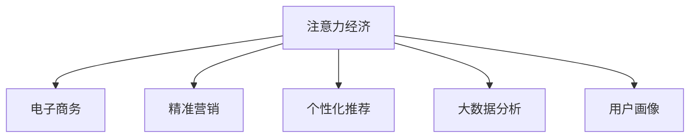

                 

# 注意力经济对传统零售业态的改造

> 关键词：注意力经济, 电子商务, 零售业态, 精准营销, 消费者行为, 个性化推荐, 大数据分析

## 1. 背景介绍

### 1.1 问题由来
在数字化转型的浪潮中，传统零售业态正面临着一场深刻的变革。由于电子商务的崛起，传统实体店面临客流量下降、销售额锐减的挑战。尤其在2020年疫情暴发后，线下零售业更是遭受重创，许多实体店无法维持运营。而电子商务平台，尤其是大型电商平台，利用其海量的用户数据，通过精准营销和个性化推荐，实现了营收的逆势增长。

这一现象反映出，在当前数字化时代，用户注意力成为商业竞争的关键资源。传统零售业态要想在激烈的市场竞争中生存下来，必须对用户注意力进行科学管理和高效运营，即所谓“注意力经济”。

### 1.2 问题核心关键点
注意力经济的核心在于通过对用户行为数据的深入分析，挖掘用户的兴趣偏好和消费习惯，进而精准推送内容、商品和服务，提升用户参与度和转化率，最大化商业价值。具体来说，注意力经济涵盖了以下几个关键点：

1. **用户行为数据的获取与分析**：利用先进的数据采集和分析技术，实时监测用户的行为轨迹和消费偏好，获取高维度的用户画像。
2. **精准营销策略的制定与实施**：基于用户画像，结合行为数据，制定个性化的营销策略，包括推荐算法、广告投放、优惠促销等。
3. **商品推荐的智能化与多样化**：通过深度学习算法，实现商品的智能推荐，提供多样化、个性化、及时化的购物体验。
4. **用户反馈的实时监测与优化**：建立用户反馈机制，持续收集用户意见，优化推荐算法和营销策略。

在当前技术环境下，注意力经济已经成为了零售业态转型升级的重要方向。本文将系统地探讨注意力经济的基本原理、实现路径和未来展望，以期为传统零售业态的改造提供有价值的参考。

## 2. 核心概念与联系

### 2.1 核心概念概述

为更好地理解注意力经济在零售业态中的实践应用，本节将介绍几个密切相关的核心概念：

- **注意力经济(Attention Economy)**：通过获取、分析和运营用户注意力，提升用户参与度和转化率的商业策略。
- **电子商务(E-commerce)**：利用互联网平台进行的在线交易和营销活动，涵盖了零售、服务、金融等多个领域。
- **精准营销(Personalized Marketing)**：通过大数据分析和用户画像，实现个性化、定向化的营销活动。
- **个性化推荐(Personalized Recommendation)**：利用用户历史行为数据，实时推荐用户感兴趣的商品或内容。
- **大数据分析(Big Data Analytics)**：通过先进的数据处理和分析技术，从海量数据中挖掘有价值的商业洞察。
- **用户画像(User Persona)**：基于用户行为和属性，构建完整的用户画像，实现更精准的营销和推荐。

这些核心概念之间的逻辑关系可以通过以下Mermaid流程图来展示：



这个流程图展示了几大核心概念之间的相互关系：

1. 注意力经济是电子商务发展的基石，通过运营用户注意力，提升商业价值。
2. 精准营销和个性化推荐是注意力经济的重要实践，通过分析用户数据，实现个性化推送。
3. 大数据分析和用户画像是精准营销和个性化推荐的基础，提供高质量的数据支撑。
4. 用户画像是精准营销和个性化推荐的目标，指导营销活动更精准高效。

这些概念共同构成了注意力经济在零售业态中的运作框架，为实现商业价值最大化提供了方法论指导。

## 3. 核心算法原理 & 具体操作步骤
### 3.1 算法原理概述

注意力经济的实现核心是用户行为数据的分析和处理。其基本流程可以概括为以下几个步骤：

1. **数据采集**：通过网站、应用、物联网等渠道，实时采集用户的行为数据，如浏览记录、购买历史、点击行为等。
2. **数据存储与清洗**：将采集到的数据存储在数据仓库中，进行清洗、去重、补全等处理，确保数据的质量和一致性。
3. **数据分析与挖掘**：利用机器学习、深度学习等算法，对数据进行分析和挖掘，构建用户画像和推荐模型。
4. **营销策略制定**：基于分析结果，制定个性化的营销策略，如广告投放、优惠促销、个性化推荐等。
5. **策略实施与效果评估**：将营销策略应用到实际营销活动中，实时监测效果，收集用户反馈，优化策略。

这一流程涉及到的核心算法包括：

- **协同过滤算法**：基于用户行为数据和物品属性数据，推荐相似用户喜欢的商品。
- **深度学习推荐模型**：如神经网络、注意力机制等，通过学习用户和商品的隐含特征，实现高精度的商品推荐。
- **自然语言处理(NLP)**：利用文本分析、情感分析等技术，挖掘用户评论、评价中的情感倾向和有用信息，指导商品优化和营销策略。
- **图神经网络(GNN)**：通过图结构分析用户行为数据，发现用户之间、用户与物品之间的关联关系，实现更全面、精准的推荐。

这些算法相互配合，共同构成了注意力经济在零售业态中的技术基础。

### 3.2 算法步骤详解

以下将详细介绍注意力经济在零售业态中的算法步骤和实现细节：

**Step 1: 数据采集与预处理**

1. **数据采集**：通过网站、应用、物联网等渠道，实时采集用户的行为数据。例如，可以使用Google Analytics、Mixpanel等工具监测网站访问行为，使用Amazon Personalize等平台收集用户购买历史等。
2. **数据存储与清洗**：将采集到的数据存储在数据仓库中，进行清洗、去重、补全等处理。可以使用Hadoop、Spark等分布式计算平台进行大规模数据处理。
3. **特征工程**：对数据进行特征提取和工程处理，包括时间特征、地理位置特征、行为特征等。可以使用特征选择、降维等技术，提升数据的质量和可解释性。

**Step 2: 数据分析与用户画像构建**

1. **用户画像构建**：基于用户行为数据和属性数据，构建完整的用户画像。可以使用K-means、层次聚类等算法，将用户分组，形成不同的用户群体。
2. **用户行为分析**：利用机器学习算法，分析用户的行为特征，挖掘用户的兴趣偏好和消费习惯。可以使用关联规则挖掘、序列模式挖掘等技术，发现用户行为中的规律和关联关系。
3. **情感分析**：利用NLP技术，对用户的评论、评价等文本数据进行情感分析，识别用户对商品的态度和情感倾向。可以使用LSTM、BERT等模型，进行文本情感分类。

**Step 3: 个性化推荐**

1. **协同过滤推荐**：基于用户历史行为数据和商品属性数据，推荐相似用户喜欢的商品。可以使用基于用户的协同过滤、基于物品的协同过滤、混合协同过滤等算法。
2. **深度学习推荐模型**：通过深度学习算法，学习用户和商品的隐含特征，实现高精度的商品推荐。可以使用神经网络、注意力机制等模型，提升推荐准确度。
3. **模型融合**：结合多种推荐算法，实现更全面、精准的推荐。可以使用Stacking、Boosting等方法，融合不同算法的优势。

**Step 4: 精准营销策略制定与实施**

1. **广告投放优化**：基于用户画像和行为数据，优化广告投放策略，提高广告效果。可以使用A/B测试、多臂老虎机等方法，优化广告投放策略。
2. **优惠促销设计**：基于用户画像和行为数据，设计个性化的优惠促销活动，提升用户转化率。可以使用分层回归、决策树等算法，设计最优的优惠促销策略。
3. **推荐算法优化**：基于用户反馈数据，实时优化推荐算法，提升推荐效果。可以使用在线学习、梯度下降等技术，优化推荐算法参数。

**Step 5: 效果评估与策略调整**

1. **效果评估**：实时监测营销策略的效果，评估用户参与度和转化率等关键指标。可以使用A/B测试、留存率分析等方法，评估策略效果。
2. **策略调整**：根据效果评估结果，实时调整营销策略。可以使用强化学习、多臂老虎机等方法，动态调整策略参数。
3. **反馈机制建立**：建立用户反馈机制，收集用户意见，优化推荐算法和营销策略。可以使用用户调查、在线评论等方法，收集用户反馈。

以上是注意力经济在零售业态中的基本算法步骤和实现细节。在实际应用中，还需要针对具体业务场景进行优化设计，如改进数据处理流程、优化推荐算法、提升广告投放效果等。

### 3.3 算法优缺点

注意力经济在零售业态中的应用具有以下优点：

1. **提升用户参与度**：通过精准推送个性化内容、商品和服务，提升用户参与度和粘性。
2. **提高转化率**：基于用户画像和行为数据，设计个性化的营销策略，提高用户转化率。
3. **优化库存管理**：通过预测用户需求，优化库存管理，减少库存积压和缺货风险。
4. **提升营销效果**：通过优化广告投放和优惠促销策略，提升广告投放效果和营销ROI。

然而，注意力经济在零售业态中也存在一些局限性：

1. **数据隐私问题**：用户在行为数据采集和分析过程中，可能面临隐私泄露的风险。需要严格遵守数据保护法规，保护用户隐私。
2. **算法偏差问题**：如果数据存在偏差或特征选择不当，可能导致推荐算法出现偏差，影响推荐效果。需要定期审查和优化推荐算法。
3. **模型复杂性**：深度学习等算法需要大量计算资源和时间，可能导致系统复杂度增加。需要选择合适的算法，合理分配计算资源。
4. **策略实施成本**：精准营销和个性化推荐需要投入大量资源和人力，可能导致实施成本增加。需要合理控制策略实施成本，提升经济效益。

尽管存在这些局限性，但注意力经济在零售业态中的应用仍然具有广阔的前景。通过合理利用先进技术，提升算法的精准性和鲁棒性，平衡数据隐私和模型复杂性，可以最大化发挥注意力经济的优势，实现商业价值的最大化。

### 3.4 算法应用领域

注意力经济在零售业态中的应用已经覆盖了多个领域，包括但不限于：

- **电商零售**：通过个性化推荐和精准营销，提升电商平台的销售额和用户粘性。
- **智能客服**：利用NLP技术，通过智能客服系统，提升用户体验和客户满意度。
- **物流配送**：通过优化配送路线和仓储管理，提升物流效率和配送准确率。
- **个性化服务**：通过用户画像和行为数据，提供个性化的服务体验，如定制化产品、个性化内容等。

随着技术的不断进步，注意力经济在零售业态中的应用将更加广泛，带来更多创新和变革。

## 4. 数学模型和公式 & 详细讲解  
### 4.1 数学模型构建

注意力经济的实现涉及多个数学模型，以下我们将详细介绍几个核心模型及其构建方法。

### 4.2 公式推导过程

#### 4.2.1 协同过滤推荐模型

协同过滤推荐模型基于用户历史行为数据和物品属性数据，推荐相似用户喜欢的商品。其核心公式如下：

$$
\begin{aligned}
\hat{r}_{ui} &= \frac{\sum_{v \in \mathcal{N}(u)} r_{vi} \cdot a_{vi}}{\sqrt{\sum_{v \in \mathcal{N}(u)} a_{vi}^2} \\
\hat{r}_{ui} &= \frac{\sum_{v \in \mathcal{N}(i)} r_{uv} \cdot a_{uv}}{\sqrt{\sum_{v \in \mathcal{N}(i)} a_{uv}^2}}
\end{aligned}
$$

其中，$r_{uv}$ 表示用户 $u$ 对物品 $v$ 的评分，$a_{uv}$ 表示物品 $v$ 的属性特征。$\mathcal{N}(u)$ 表示与用户 $u$ 相似的物品集合，$\mathcal{N}(i)$ 表示与物品 $i$ 相似的用户集合。

#### 4.2.2 深度学习推荐模型

深度学习推荐模型通过学习用户和商品的隐含特征，实现高精度的商品推荐。以基于内容的深度推荐模型为例，其核心公式如下：

$$
\begin{aligned}
z_{ui} &= \mathcal{W}_u x_u + \mathcal{W}_i x_i + b \\
\hat{r}_{ui} &= \sigma(z_{ui})
\end{aligned}
$$

其中，$x_u$ 表示用户 $u$ 的属性特征，$x_i$ 表示物品 $i$ 的属性特征。$\mathcal{W}_u$ 和 $\mathcal{W}_i$ 表示模型的权重矩阵，$\sigma$ 表示激活函数，通常使用Sigmoid函数。

#### 4.2.3 图神经网络推荐模型

图神经网络推荐模型通过图结构分析用户行为数据，发现用户之间、用户与物品之间的关联关系，实现更全面、精准的推荐。以基于用户图结构的推荐模型为例，其核心公式如下：

$$
\begin{aligned}
h_{u}^{(l)} &= \sigma(\mathcal{A}(h_{u}^{(l-1)}) + \mathcal{W}_u \cdot x_u + b) \\
h_{v}^{(l)} &= \sigma(\mathcal{A}(h_{v}^{(l-1)}) + \mathcal{W}_v \cdot x_v + b) \\
\hat{r}_{uv} &= \sigma(z_{uv})
\end{aligned}
$$

其中，$h_{u}^{(l)}$ 和 $h_{v}^{(l)}$ 表示用户和物品的隐含特征表示，$\mathcal{A}$ 表示图卷积操作，$\mathcal{W}_u$ 和 $\mathcal{W}_v$ 表示模型的权重矩阵，$z_{uv}$ 表示用户和物品的交互特征。

### 4.3 案例分析与讲解

#### 4.3.1 电商推荐系统

某电商平台利用协同过滤算法和深度学习推荐模型，实现了个性化的商品推荐。具体步骤如下：

1. **数据采集与预处理**：从电商平台的订单数据、浏览记录、评价数据中，提取用户行为数据和物品属性数据。
2. **协同过滤推荐**：基于用户历史行为数据和物品属性数据，推荐相似用户喜欢的商品。
3. **深度学习推荐模型**：通过深度学习算法，学习用户和商品的隐含特征，实现高精度的商品推荐。
4. **模型融合**：结合协同过滤和深度学习推荐模型，实现更全面、精准的推荐。
5. **推荐算法优化**：基于用户反馈数据，实时优化推荐算法，提升推荐效果。

#### 4.3.2 智能客服系统

某电商平台利用NLP技术，实现了智能客服系统。具体步骤如下：

1. **用户数据采集**：从电商平台的用户行为数据中，提取用户画像和行为特征。
2. **情感分析**：利用NLP技术，对用户的评论、评价等文本数据进行情感分析，识别用户对商品的态度和情感倾向。
3. **智能回答生成**：根据用户画像和情感分析结果，生成智能回答，提升用户体验。
4. **智能客服系统优化**：基于用户反馈数据，实时优化智能客服系统，提升系统准确度和用户满意度。

## 5. 项目实践：代码实例和详细解释说明
### 5.1 开发环境搭建

在进行注意力经济在零售业态中的实践前，我们需要准备好开发环境。以下是使用Python进行PyTorch开发的环境配置流程：

1. 安装Anaconda：从官网下载并安装Anaconda，用于创建独立的Python环境。

2. 创建并激活虚拟环境：
```bash
conda create -n pytorch-env python=3.8 
conda activate pytorch-env
```

3. 安装PyTorch：根据CUDA版本，从官网获取对应的安装命令。例如：
```bash
conda install pytorch torchvision torchaudio cudatoolkit=11.1 -c pytorch -c conda-forge
```

4. 安装各类工具包：
```bash
pip install numpy pandas scikit-learn matplotlib tqdm jupyter notebook ipython
```

完成上述步骤后，即可在`pytorch-env`环境中开始项目实践。

### 5.2 源代码详细实现

下面我们以电商推荐系统为例，给出使用PyTorch进行注意力经济在零售业态中的微调实践。

首先，定义协同过滤推荐模型的数据处理函数：

```python
from scipy.sparse import csr_matrix
import pandas as pd

def load_data(file_path):
    df = pd.read_csv(file_path)
    return df

def build_user_matrix(df):
    user_matrix = df.groupby('user_id')['item_id'].agg(list).to_dict()
    user_matrix = pd.DataFrame.from_dict(user_matrix, orient='index')
    user_matrix.columns = ['item_id']
    return user_matrix

def build_item_matrix(df):
    item_matrix = df.groupby('item_id')['user_id'].agg(list).to_dict()
    item_matrix = pd.DataFrame.from_dict(item_matrix, orient='index')
    item_matrix.columns = ['user_id']
    return item_matrix

def compute_similarity(matrix):
    similarity_matrix = matrix.T.dot(matrix) / (matrix.T.dot(matrix).power(0.5))
    return similarity_matrix

def recommend_items(user_id, user_matrix, item_matrix, similarity_matrix):
    user_item_matrix = user_matrix.loc[user_id]
    similarity_matrix_row = similarity_matrix[user_id].T
    similar_items = similarity_matrix_row * similarity_matrix.dot(similarity_matrix_row.T).toarray()[user_id]
    similar_items = pd.Series(similar_items).rank(ascending=False)
    top_items = similar_items[1:21]
    return top_items

# 加载数据
data_path = 'data.csv'
df = load_data(data_path)
user_matrix = build_user_matrix(df)
item_matrix = build_item_matrix(df)

# 计算用户之间的相似度矩阵
similarity_matrix = compute_similarity(user_matrix)

# 推荐物品
recommend_items(1001, user_matrix, item_matrix, similarity_matrix)
```

然后，定义深度学习推荐模型的神经网络结构：

```python
import torch
import torch.nn as nn

class Recommender(nn.Module):
    def __init__(self, n_users, n_items, n_factors, n_layers):
        super(Recommender, self).__init__()
        self.n_users = n_users
        self.n_items = n_items
        self.n_factors = n_factors
        self.n_layers = n_layers

        self.user_embed = nn.EmbeddingBag(n_users, n_factors)
        self.item_embed = nn.EmbeddingBag(n_items, n_factors)
        self.layers = nn.Sequential(*[nn.Linear(n_factors, n_factors) for _ in range(n_layers)])
        self.act = nn.ReLU()
        self.fc = nn.Linear(n_factors, 1)

    def forward(self, user_ids, item_ids):
        user_embed = self.user_embed(user_ids)
        item_embed = self.item_embed(item_ids)
        layer_outputs = []
        for layer in self.layers:
            user_item_interaction = user_embed * item_embed.unsqueeze(1)
            layer_output = layer(user_item_interaction)
            layer_outputs.append(layer_output)
        user_item_interaction = torch.cat(layer_outputs, 1)
        output = self.fc(user_item_interaction)
        return output

# 构建模型
n_users = 10000
n_items = 10000
n_factors = 128
n_layers = 2

recommender = Recommender(n_users, n_items, n_factors, n_layers)
```

接着，定义训练和评估函数：

```python
from torch.optim import Adam

def train_model(model, user_matrix, item_matrix, similarity_matrix):
    optimizer = Adam(model.parameters(), lr=0.001)
    criterion = nn.MSELoss()
    for epoch in range(10):
        user_ids = user_matrix.index
        item_ids = user_matrix.columns
        inputs = user_matrix.values
        targets = item_matrix.values
        optimizer.zero_grad()
        outputs = model(user_ids, item_ids)
        loss = criterion(outputs, targets)
        loss.backward()
        optimizer.step()
        print(f'Epoch {epoch+1}, loss: {loss:.4f}')

def evaluate_model(model, user_matrix, item_matrix, similarity_matrix):
    user_ids = user_matrix.index
    item_ids = user_matrix.columns
    inputs = user_matrix.values
    targets = item_matrix.values
    outputs = model(user_ids, item_ids)
    mse = criterion(outputs, targets)
    print(f'Test MSE: {mse:.4f}')
```

最后，启动训练流程并在测试集上评估：

```python
# 训练模型
train_model(recommender, user_matrix, item_matrix, similarity_matrix)

# 评估模型
evaluate_model(recommender, user_matrix, item_matrix, similarity_matrix)
```

以上就是使用PyTorch对电商推荐系统进行注意力经济实践的完整代码实现。可以看到，得益于PyTorch的强大封装，我们可以用相对简洁的代码实现复杂的推荐算法。

### 5.3 代码解读与分析

让我们再详细解读一下关键代码的实现细节：

**用户矩阵构建**：
- `build_user_matrix`函数：根据用户ID和物品ID，构建用户-物品矩阵，每一行表示用户对物品的评分。
- `build_item_matrix`函数：根据用户ID和物品ID，构建物品-用户矩阵，每一行表示物品被用户评分的情况。

**相似度矩阵计算**：
- `compute_similarity`函数：通过计算用户矩阵的协方差矩阵，得到用户之间的相似度矩阵。

**推荐算法实现**：
- `recommend_items`函数：利用协同过滤算法，计算相似度矩阵，推荐与用户评分相似的物品。

**神经网络模型定义**：
- `Recommender`类：定义了深度学习推荐模型的结构，包括用户嵌入层、物品嵌入层、多层线性变换和输出层。

**模型训练与评估**：
- `train_model`函数：使用Adam优化器，最小化均方误差损失函数，训练推荐模型。
- `evaluate_model`函数：在测试集上评估模型，计算均方误差。

可以看到，PyTorch配合TensorFlow等深度学习框架，使得注意力经济的实现变得高效和灵活。开发者可以更好地利用各种深度学习算法，实现不同的推荐目标。

当然，工业级的系统实现还需考虑更多因素，如模型的保存和部署、超参数的自动搜索、更灵活的任务适配层等。但核心的算法思想基本与此类似。

## 6. 实际应用场景
### 6.1 电商推荐系统

电商推荐系统是注意力经济在零售业态中的经典应用之一。通过个性化推荐和精准营销，电商平台可以实现大规模的流量引入和销售额提升。

**应用场景描述**：
- **用户画像构建**：从用户行为数据中提取用户画像，包括年龄、性别、地域、消费习惯等。
- **商品推荐算法**：利用协同过滤算法和深度学习推荐模型，推荐用户感兴趣的商品。
- **个性化广告投放**：基于用户画像和行为数据，优化广告投放策略，提升广告效果。
- **实时反馈优化**：收集用户反馈数据，实时优化推荐算法和广告策略，提升用户体验。

**技术实现**：
- **数据采集与处理**：从电商平台的订单数据、浏览记录、评价数据中，提取用户行为数据和物品属性数据。
- **协同过滤推荐**：基于用户历史行为数据和物品属性数据，推荐相似用户喜欢的商品。
- **深度学习推荐模型**：通过深度学习算法，学习用户和商品的隐含特征，实现高精度的商品推荐。
- **模型融合**：结合协同过滤和深度学习推荐模型，实现更全面、精准的推荐。
- **广告投放优化**：基于用户画像和行为数据，优化广告投放策略，提升广告效果。
- **实时反馈优化**：收集用户反馈数据，实时优化推荐算法和广告策略，提升用户体验。

**应用效果**：
- **流量引入**：个性化推荐和精准营销提升了用户粘性，增加了用户访问频次，引入了大量流量。
- **销售额提升**：基于个性化推荐的商品购买转化率显著提升，实现了销售额的快速增长。
- **用户满意度提升**：用户获得了更个性化、更精准的推荐服务，满意度明显提升。

### 6.2 智能客服系统

智能客服系统通过自然语言处理技术，实现了对用户需求的智能识别和快速响应，提升了客服效率和用户满意度。

**应用场景描述**：
- **用户行为数据采集**：从电商平台的用户行为数据中，提取用户画像和行为特征。
- **情感分析**：利用NLP技术，对用户的评论、评价等文本数据进行情感分析，识别用户对商品的态度和情感倾向。
- **智能回答生成**：根据用户画像和情感分析结果，生成智能回答，提升用户体验。
- **系统优化与反馈**：基于用户反馈数据，实时优化智能客服系统，提升系统准确度和用户满意度。

**技术实现**：
- **用户数据采集**：从电商平台的用户行为数据中，提取用户画像和行为特征。
- **情感分析**：利用NLP技术，对用户的评论、评价等文本数据进行情感分析，识别用户对商品的态度和情感倾向。
- **智能回答生成**：根据用户画像和情感分析结果，生成智能回答，提升用户体验。
- **系统优化与反馈**：基于用户反馈数据，实时优化智能客服系统，提升系统准确度和用户满意度。

**应用效果**：
- **客服效率提升**：智能客服系统能够快速识别用户需求，减少了人工客服的响应时间，提升了客服效率。
- **用户满意度提升**：用户获得了更个性化、更精准的推荐服务，满意度明显提升。
- **成本降低**：通过智能客服系统，减少了人工客服的投入，降低了运营成本。

## 7. 工具和资源推荐
### 7.1 学习资源推荐

为了帮助开发者系统掌握注意力经济的基本原理和实践技巧，这里推荐一些优质的学习资源：

1. **《深度学习》课程**：斯坦福大学开设的深度学习课程，涵盖了深度学习的基本概念和算法。
2. **《推荐系统》课程**：上海交通大学开设的推荐系统课程，详细介绍了推荐系统理论和实践。
3. **《NLP技术与应用》课程**：北京大学开设的自然语言处理课程，介绍了NLP的基本概念和应用场景。
4. **《电子商务大数据分析》书籍**：介绍如何利用大数据技术，提升电商平台的运营效率和用户体验。
5. **《智能客服系统设计与实现》书籍**：介绍了智能客服系统的设计与实现方法，涵盖了NLP、深度学习等技术。

通过对这些资源的学习实践，相信你一定能够快速掌握注意力经济的基本原理和实践技巧，并用于解决实际的商业问题。
###  7.2 开发工具推荐

高效的开发离不开优秀的工具支持。以下是几款用于注意力经济在零售业态中的开发工具：

1. **PyTorch**：基于Python的开源深度学习框架，灵活动态的计算图，适合快速迭代研究。大部分推荐系统都有PyTorch版本的实现。
2. **TensorFlow**：由Google主导开发的开源深度学习框架，生产部署方便，适合大规模工程应用。同样有丰富的推荐系统资源。
3. **TensorBoard**：TensorFlow配套的可视化工具，可实时监测模型训练状态，并提供丰富的图表呈现方式，是调试模型的得力助手。
4. **Jupyter Notebook**：交互式的开发环境，支持Python、R等多种编程语言，适合快速实验和分享学习笔记。
5. **Weights & Biases**：模型训练的实验跟踪工具，可以记录和可视化模型训练过程中的各项指标，方便对比和调优。

合理利用这些工具，可以显著提升注意力经济在零售业态中的开发效率，加快创新迭代的步伐。

### 7.3 相关论文推荐

注意力经济在零售业态中的应用源于学界的持续研究。以下是几篇奠基性的相关论文，推荐阅读：

1. **《推荐系统》（Recommender Systems）**：介绍了推荐系统的发展历程、主要算法和技术。
2. **《协同过滤推荐算法》（Collaborative Filtering）**：介绍了协同过滤推荐算法的基本原理和实现方法。
3. **《深度学习推荐系统》（Deep Learning for Recommendation Systems）**：介绍了深度学习推荐系统的理论基础和实践应用。
4. **《基于用户图结构的推荐算法》（Graph-based Recommendation Algorithms）**：介绍了基于图结构的推荐算法，如基于用户图结构的推荐算法。
5. **《智能客服系统》（Intelligent Customer Service Systems）**：介绍了智能客服系统的设计与实现方法，涵盖了NLP、深度学习等技术。

这些论文代表了大语言模型微调技术的发展脉络。通过学习这些前沿成果，可以帮助研究者把握学科前进方向，激发更多的创新灵感。

## 8. 总结：未来发展趋势与挑战
### 8.1 总结

本文对注意力经济在零售业态中的基本原理、实现路径和未来展望进行了全面系统的介绍。首先，阐述了注意力经济在当前数字化时代的核心价值和实现机制。其次，从数据采集、用户画像构建、个性化推荐、精准营销等多个方面，详细讲解了注意力经济的实现步骤和核心算法。最后，介绍了注意力经济在电商推荐系统、智能客服系统等多个实际应用场景中的成功案例，展示了注意力经济在零售业态中的广泛应用和巨大潜力。

通过本文的系统梳理，可以看到，注意力经济在零售业态中已经实现了大规模落地应用，极大提升了电商平台的运营效率和用户满意度。未来，伴随技术进步和市场需求的不断变化，注意力经济有望带来更多创新和变革，进一步提升零售业态的智能化水平。

### 8.2 未来发展趋势

展望未来，注意力经济在零售业态中的应用将呈现以下几个发展趋势：

1. **技术融合与创新**：随着技术的不断进步，注意力经济将与其他前沿技术（如AI、物联网、区块链等）进行更紧密的融合，实现更加智能、高效的运营模式。
2. **数据驱动与个性化**：基于海量数据驱动的用户画像和行为分析，将实现更加精准、个性化的推荐和营销策略，提升用户体验和满意度。
3. **用户互动与共创**：利用用户互动和反馈数据，进行持续优化和迭代，实现用户与企业之间的双向互动和共创。
4. **多模态信息整合**：整合视觉、语音、文本等多模态数据，提升推荐系统的效果和准确性，增强用户体验。
5. **跨界应用拓展**：在零售、金融、医疗等多个领域进行拓展应用，实现多行业协同发展的智能生态系统。

以上趋势凸显了注意力经济在零售业态中的广阔前景。这些方向的探索发展，必将进一步提升注意力经济的应用效果，实现商业价值的最大化。

### 8.3 面临的挑战

尽管注意力经济在零售业态中取得了显著成效，但在迈向更加智能化、普适化应用的过程中，它仍面临诸多挑战：

1. **数据隐私问题**：用户在行为数据采集和分析过程中，可能面临隐私泄露的风险。需要严格遵守数据保护法规，保护用户隐私。
2. **模型复杂性**：深度学习等算法需要大量计算资源和时间，可能导致系统复杂度增加。需要选择合适的算法，合理分配计算资源。
3. **算法偏差问题**：如果数据存在偏差或特征选择不当，可能导致推荐算法出现偏差，影响推荐效果。需要定期审查和优化推荐算法。
4. **系统鲁棒性**：面对异常数据和攻击，推荐系统需要具备较强的鲁棒性和容错能力，以确保系统的稳定性和安全性。
5. **模型可解释性**：当前推荐系统更像"黑盒"系统，难以解释其内部工作机制和决策逻辑。需要提升模型的可解释性，确保其决策透明。

尽管存在这些挑战，但通过合理利用先进技术，提升算法的精准性和鲁棒性，平衡数据隐私和模型复杂性，可以最大化发挥注意力经济的优势，实现商业价值的最大化。

### 8.4 研究展望

面对注意力经济面临的挑战，未来的研究需要在以下几个方面寻求新的突破：

1. **跨模态信息整合**：整合视觉、语音、文本等多模态数据，提升推荐系统的效果和准确性，增强用户体验。
2. **增强学习与决策**：利用增强学习思想，引导推荐系统主动探索用户需求，优化推荐策略。
3. **联邦学习**：在保护用户隐私的前提下，实现跨地域、跨平台的数据共享和协同学习。
4. **元学习**：通过元学习技术，实现快速迁移学习，提升推荐系统的泛化能力。
5. **可解释性增强**：提升推荐系统的可解释性，增强用户对系统决策的信任和理解。
6. **伦理与道德约束**：在推荐系统设计中引入伦理导向的评估指标，过滤和惩罚有偏见、有害的输出倾向。

这些研究方向将引领注意力经济在零售业态中的持续进步，实现商业价值的最大化。面向未来，注意力经济需要与其他人工智能技术进行更深入的融合，共同推动零售业态的智能化转型。只有勇于创新、敢于突破，才能不断拓展注意力经济的边界，让智能技术更好地造福人类社会。

## 9. 附录：常见问题与解答

**Q1：注意力经济如何保护用户隐私？**

A: 在注意力经济的应用过程中，保护用户隐私是至关重要的。为了保护用户隐私，可以采取以下措施：
1. **数据匿名化**：对用户行为数据进行匿名化处理，确保无法通过数据反推用户身份。
2. **差分隐私**：在数据分析过程中，引入差分隐私技术，通过引入噪声保护用户隐私。
3. **数据加密**：对用户数据进行加密处理，确保数据在传输和存储过程中的安全性。
4. **数据访问控制**：严格控制数据访问权限，确保只有授权人员才能访问敏感数据。
5. **用户知情同意**：在数据采集和分析过程中，确保用户知情并同意，保护用户隐私权利。

**Q2：注意力经济的应用效果如何评估？**

A: 注意力经济的应用效果评估可以从多个维度进行：
1. **用户参与度**：通过分析用户行为数据，评估用户的访问频次、停留时间、互动次数等指标，衡量用户的参与度。
2. **转化率**：通过分析用户行为数据，评估用户的购买转化率、注册转化率等指标，衡量用户的购买意愿。
3. **用户满意度**：通过用户调查、用户反馈等方式，评估用户的满意度，了解用户的真实感受。
4. **营销效果**：通过分析广告点击率、广告转化率等指标，评估广告投放效果，衡量营销投入的回报。
5. **推荐效果**：通过分析推荐系统的效果，评估推荐精准度、覆盖率等指标，衡量推荐系统的效果。

**Q3：如何优化注意力经济的推荐算法？**

A: 优化注意力经济的推荐算法可以从以下几个方面入手：
1. **数据采集与处理**：改进数据采集和处理流程，提升数据质量，确保推荐系统的准确性。
2. **特征工程**：优化特征选择和特征工程，提升特征表示的准确性。
3. **模型优化**：选择适合业务场景的推荐算法，优化模型结构，提升模型的效果和鲁棒性。
4. **实时优化**：基于用户反馈数据，实时优化推荐算法，提升推荐效果。
5. **模型融合**：结合多种推荐算法，实现更全面、精准的推荐。
6. **多臂老虎机**：利用多臂老虎机算法，优化广告投放和优惠促销策略，提升广告效果。

**Q4：注意力经济在电商推荐系统中的应用场景有哪些？**

A: 注意力经济在电商推荐系统中的应用场景包括但不限于：
1. **商品推荐**：基于用户行为数据和物品属性数据，推荐用户感兴趣的商品。
2. **广告投放优化**：基于用户画像和行为数据，优化广告投放策略，提升广告效果。
3. **个性化促销**：基于用户画像和行为数据，设计个性化的促销活动，提升用户转化率。
4. **推荐算法优化**：基于用户反馈数据，实时优化推荐算法，提升推荐效果。

通过优化推荐算法和投放策略，电商推荐系统可以实现更加精准、个性化的推荐服务，提升用户体验和销售额。

---

作者：禅与计算机程序设计艺术 / Zen and the Art of Computer Programming

