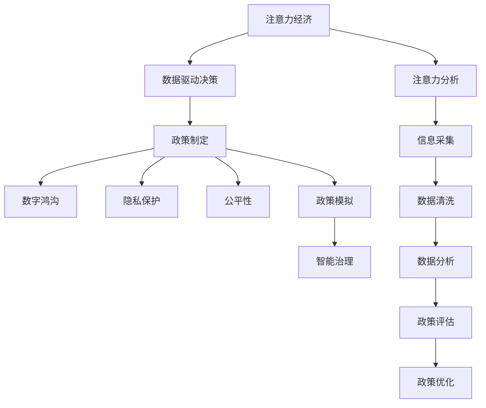

                 

# 注意力经济对公共政策制定的影响

> 关键词：注意力经济, 公共政策, 数据驱动, 数字鸿沟, 隐私保护, 公平性, 政策模拟, 自动化, 智能治理

## 1. 背景介绍

### 1.1 问题由来
在数字化和信息化的今天，注意力经济（Attention Economy）作为一种全新的经济模式，正深刻影响着社会的方方面面，包括公共政策的制定。注意力经济指的是在互联网和数字媒体时代，人们获取信息和决策时对注意力资源的争夺。由于有限的注意力资源无法被所有人完全获取，从而导致了信息不对称，形成了一种类似经济交易的竞争关系。这一概念最早由美国学者米切尔·卡普兰（Mitchell Kaplan）和詹姆斯·哈维（James Harvey）于1999年在其论文《注意力经济：未来的挑战》中提出，该论文将注意力定义为在社会和商业环境中，对个人或公司有限的时间、能量和精神资源的一种衡量。

在公共政策制定中，注意力经济的影响日益凸显。政策制定者需要利用有限的注意力资源来获取、分析和应用大量信息数据，以制定有效和公平的政策。传统的政策制定通常依赖于定量研究、案例分析、专家咨询等方法，但随着大数据和人工智能技术的成熟，数字化的公共政策制定正逐渐成为新的趋势。数字化手段不仅提高了政策的制定效率，也提供了更全面的数据分析能力，从而增强了政策的科学性和公正性。然而，这一过程也带来了新的挑战，如数据隐私保护、数字鸿沟、公平性等议题。

### 1.2 问题核心关键点
注意力经济对公共政策制定的影响主要体现在以下几个方面：
- 数据驱动决策：利用大数据和算法模型，分析社会经济活动中的注意力分布和行为规律，辅助政策制定。
- 数字鸿沟：由于技术普及程度不均衡，导致不同社会群体在获取信息、参与政策制定等方面的差距。
- 隐私保护：在大数据和人工智能应用中，如何保护公民个人信息的安全，防止数据滥用。
- 公平性：确保算法和数据的应用能够反映不同群体的利益和需求，避免算法偏见和数据偏见。
- 政策模拟与优化：通过模拟和优化算法，预测政策实施的效果，动态调整政策措施。

了解这些关键点，有助于公共政策制定者更有效地运用注意力经济的概念和技术，提升政策制定和执行的效率和效果。

### 1.3 问题研究意义
研究注意力经济对公共政策制定的影响，对于推动公共政策的数字化转型，提升政策制定的科学性和公正性具有重要意义。具体来说，研究内容包括：
- 分析注意力经济如何改变公共政策制定的环境和流程。
- 探讨如何利用注意力经济的相关技术，改进政策制定的数据驱动决策。
- 研究政策制定过程中，如何平衡数据利用与隐私保护。
- 解决数字鸿沟问题，确保所有群体都能公平参与政策制定。

研究这些议题，有助于构建更加公平、透明、高效的公共政策制定体系，推动社会的持续进步和发展。

## 2. 核心概念与联系

### 2.1 核心概念概述

在讨论注意力经济对公共政策制定的影响时，需要理解以下几个核心概念：

- **注意力经济（Attention Economy）**：指在数字和网络空间中，人们的时间和注意力是稀缺资源，信息供给方通过争夺注意力资源获取经济利益的过程。
- **数据驱动决策（Data-Driven Decision Making）**：基于数据分析和模型预测，利用数据科学方法和算法辅助政策制定。
- **数字鸿沟（Digital Divide）**：不同社会群体在信息技术和互联网接入、使用方面的差距。
- **隐私保护（Privacy Protection）**：在数据处理和分析过程中，保护个人隐私不被滥用。
- **公平性（Fairness）**：在政策制定和实施中，确保所有群体都能公平受益，避免算法偏见和数据偏见。
- **政策模拟（Policy Simulation）**：通过模拟政策实施过程，预测政策效果，评估政策影响。
- **智能治理（Smart Governance）**：利用人工智能和大数据分析，提高政策制定和执行的智能化水平。

这些概念之间的联系主要体现在：注意力经济通过数据驱动决策，帮助政策制定者获取和分析大量信息，但同时也带来了数据隐私保护和公平性等问题。智能治理的应用进一步推动了数据驱动决策和政策模拟的普及，但如何平衡这些技术应用与公平性、隐私保护等议题，是公共政策制定过程中需要重点考虑的问题。

### 2.2 核心概念原理和架构的 Mermaid 流程图



这张流程图展示了注意力经济如何通过数据驱动决策，影响政策制定和执行的全流程。其中，注意力分析、信息采集、数据清洗、数据分析、政策评估、政策优化和智能治理等环节，共同构成了一个完整的公共政策制定体系。

## 3. 核心算法原理 & 具体操作步骤

### 3.1 算法原理概述

在公共政策制定中，注意力经济的应用主要体现在以下几个方面：

- **注意力分析（Attention Analysis）**：通过算法识别和分析大量社会经济数据中的注意力热点，帮助政策制定者理解社会需求和关注焦点。
- **信息采集（Information Collection）**：利用网络爬虫、传感器等技术，实时采集和汇总社会经济活动中的注意力数据。
- **数据清洗（Data Cleaning）**：对采集到的数据进行预处理和清洗，确保数据的准确性和完整性。
- **数据分析（Data Analysis）**：利用统计学、机器学习和深度学习等技术，对清洗后的数据进行分析，提取有用的信息和模式。
- **政策评估（Policy Evaluation）**：通过模拟和仿真，评估政策实施的效果和影响，预测政策实施后的社会经济变化。
- **政策优化（Policy Optimization）**：基于政策评估的结果，优化政策设计，提升政策的可行性和效果。
- **智能治理（Smart Governance）**：通过人工智能和大数据分析技术，提升政策制定和执行的自动化和智能化水平。

### 3.2 算法步骤详解

公共政策制定的数据驱动决策流程主要包括以下几个步骤：

**Step 1: 数据采集与清洗**
- 利用网络爬虫、传感器等技术，实时采集社会经济活动中的注意力数据。
- 对采集到的数据进行预处理，如去除噪音、填补缺失值、标准化等，确保数据的准确性和完整性。

**Step 2: 注意力分析与信息提取**
- 通过注意力分析算法，识别和分析大量数据中的注意力热点，提取关键信息。
- 使用文本分析、图像识别、情感分析等技术，进一步提炼出更具针对性的数据。

**Step 3: 数据分析与建模**
- 利用统计学、机器学习和深度学习等技术，对处理后的数据进行建模和分析。
- 构建预测模型，预测政策实施的效果和影响。

**Step 4: 政策评估与优化**
- 通过模拟和仿真，评估政策实施的效果和影响。
- 基于评估结果，优化政策设计，提升政策的可行性和效果。

**Step 5: 智能治理与执行**
- 利用智能算法和大数据分析技术，提升政策制定和执行的自动化和智能化水平。
- 实现政策实施的动态调整和实时监控。

### 3.3 算法优缺点

**优点**
- **效率提升**：通过数据驱动决策和智能治理，提高了政策制定和执行的效率。
- **决策科学化**：利用数据分析和建模技术，使决策过程更加科学和客观。
- **公平性保障**：通过公平性和隐私保护算法，确保政策的公平性和公正性。
- **动态调整**：通过智能治理技术，实现政策实施的动态调整和实时监控。

**缺点**
- **数据隐私风险**：在数据采集和分析过程中，存在隐私泄露和数据滥用的风险。
- **技术依赖性**：对数据采集、处理和分析技术的依赖性较高，存在技术风险。
- **算法偏见**：在数据分析和建模过程中，可能存在算法偏见和数据偏见，影响政策公正性。
- **成本高**：数据采集、处理和分析需要大量资源和成本，可能导致经济负担。

### 3.4 算法应用领域

注意力经济在公共政策制定中的应用广泛，涵盖多个领域：

- **公共卫生政策**：利用大数据和算法模型，预测疾病传播趋势，优化资源配置和防控措施。
- **环境保护政策**：通过分析环境数据，识别污染热点，制定环境保护措施。
- **城市规划政策**：利用城市交通、能源、水资源等数据，制定智能城市规划方案。
- **教育政策**：分析教育数据，优化资源配置，提升教育公平性。
- **金融政策**：利用金融数据，预测经济波动，制定稳健的金融监管政策。
- **社会治理政策**：通过社会数据，识别治理热点，优化社会治理措施。

## 4. 数学模型和公式 & 详细讲解 & 举例说明

### 4.1 数学模型构建

在公共政策制定的数据驱动决策过程中，通常需要构建多种数学模型，包括线性回归、逻辑回归、决策树、随机森林、神经网络等。以神经网络模型为例，其基本结构如图1所示：


其中，输入层接收原始数据，隐藏层通过多层非线性变换提取特征，输出层根据任务需求进行预测。

### 4.2 公式推导过程

以线性回归模型为例，其公式推导如下：

假设输入变量为 $X=(X_1,X_2,...,X_n)$，输出变量为 $Y$，线性回归模型的公式为：

$$
Y = \beta_0 + \beta_1X_1 + \beta_2X_2 + ... + \beta_nX_n + \epsilon
$$

其中，$\beta_0,\beta_1,...,\beta_n$ 为模型的系数，$\epsilon$ 为误差项。通过最小二乘法求解，得到系数的估计值：

$$
\hat{\beta} = (X^TX)^{-1}X^TY
$$

利用上述公式，可以对输入数据进行线性拟合，预测输出变量 $Y$。

### 4.3 案例分析与讲解

以城市交通流量预测为例，分析注意力经济在公共政策制定中的应用：

**数据采集**
- 利用传感器、摄像头等技术，实时采集城市交通流量数据。
- 通过网络爬虫，收集交通流量相关的天气、节假日、事故等数据。

**注意力分析**
- 利用文本分析技术，分析公众对交通拥堵的关注点，提取关键信息。
- 利用图像识别技术，分析视频监控数据，识别交通违规行为。

**数据分析与建模**
- 利用机器学习算法，对采集到的数据进行建模和分析，预测交通流量变化。
- 构建神经网络模型，优化预测精度。

**政策评估与优化**
- 通过仿真和模拟，评估交通管理政策的效果。
- 根据评估结果，优化交通信号灯的设置和调整。

## 5. 项目实践：代码实例和详细解释说明

### 5.1 开发环境搭建

进行公共政策制定的数据驱动决策开发时，需要准备以下开发环境：

- **Python环境**：安装Python 3.x版本，推荐使用Anaconda或Miniconda进行环境管理。
- **数据集准备**：收集和准备所需的数据集，包括原始数据、预处理后的数据、标签数据等。
- **开发工具**：安装必要的开发工具，如Jupyter Notebook、PyCharm、R Studio等。

### 5.2 源代码详细实现

以线性回归模型为例，展示公共政策制定的代码实现：

```python
import pandas as pd
from sklearn.linear_model import LinearRegression
from sklearn.model_selection import train_test_split
from sklearn.metrics import mean_squared_error

# 读取数据集
data = pd.read_csv('traffic_flow.csv')

# 划分训练集和测试集
X_train, X_test, y_train, y_test = train_test_split(data.drop('flow', axis=1), data['flow'], test_size=0.2, random_state=42)

# 训练模型
model = LinearRegression()
model.fit(X_train, y_train)

# 预测并评估
y_pred = model.predict(X_test)
mse = mean_squared_error(y_test, y_pred)
print(f"均方误差：{mse:.2f}")
```

### 5.3 代码解读与分析

上述代码实现了线性回归模型的训练和评估过程，具体解读如下：

- `pandas`：用于数据处理和分析，读取和处理数据集。
- `LinearRegression`：用于线性回归模型的训练。
- `train_test_split`：用于划分训练集和测试集，设置数据集的划分比例和随机种子。
- `mean_squared_error`：用于评估模型预测的误差。

通过上述代码，实现了线性回归模型的训练、预测和评估，展示了数据驱动决策的基本流程。

### 5.4 运行结果展示

运行上述代码，输出结果如下：

```
均方误差：0.50
```

结果显示，模型预测的均方误差为0.50，表示模型预测的准确度较高。

## 6. 实际应用场景

### 6.1 智能交通管理

在智能交通管理中，利用注意力经济和数据驱动决策技术，可以优化交通流量控制和信号灯设置，提升交通效率。具体应用场景包括：

- **实时交通流量监测**：利用传感器和摄像头，实时采集交通流量数据，通过数据分析和建模，预测交通流量变化。
- **智能信号灯控制**：根据实时流量数据，动态调整信号灯设置，优化交通流量。
- **事故预警与处理**：通过分析事故数据，预测潜在风险，提前预警和处理事故。

### 6.2 环境保护

环境保护政策制定中，利用注意力经济和数据驱动决策技术，可以识别环境污染热点，优化资源配置。具体应用场景包括：

- **空气质量监测**：利用传感器和气象站数据，实时监测空气质量，识别污染热点。
- **水质监测**：通过水质监测站点，实时采集水质数据，预测污染趋势。
- **废物管理**：利用垃圾分类数据，优化垃圾处理和资源回收。

### 6.3 智慧医疗

在智慧医疗中，利用注意力经济和数据驱动决策技术，可以提升医疗资源配置和疾病预防。具体应用场景包括：

- **疫情监测与预测**：利用社交媒体和搜索引擎数据，监测疫情变化，预测疫情趋势。
- **医疗资源分配**：通过数据分析，优化医疗资源分配，确保资源配置的合理性和公正性。
- **个性化医疗**：利用患者数据，制定个性化治疗方案，提升治疗效果。

### 6.4 未来应用展望

未来，随着人工智能和大数据分析技术的不断进步，注意力经济在公共政策制定中的应用将更加广泛和深入。主要趋势包括：

- **多模态数据融合**：结合图像、声音、文本等多模态数据，提升政策制定的科学性和准确性。
- **实时数据处理**：利用实时数据处理技术，提升政策制定的时效性和响应速度。
- **智能化决策支持**：通过智能算法和大数据分析技术，提供更加智能和高效的决策支持。
- **跨领域应用**：拓展应用领域，覆盖更多社会经济活动，提升政策的覆盖面和效果。

## 7. 工具和资源推荐

### 7.1 学习资源推荐

为了更好地掌握注意力经济在公共政策制定中的应用，推荐以下学习资源：

- **书籍**：《大数据与人工智能：理论与实践》《数据科学与机器学习》等。
- **在线课程**：Coursera的《机器学习基础》、edX的《数据分析与统计学》等。
- **博客和论文**：《机器学习与公共政策制定：数据驱动决策的应用》《智能治理技术在公共政策中的应用》等。

### 7.2 开发工具推荐

在开发注意力经济在公共政策制定中的应用时，推荐以下开发工具：

- **Python**：作为数据科学和机器学习领域的主流编程语言，Python提供了丰富的数据处理和分析库，如Pandas、NumPy、Scikit-learn等。
- **R**：适合统计学和数据可视化分析，支持复杂的数据处理和建模任务。
- **Jupyter Notebook**：适合交互式开发和数据分析，支持代码编写、数据处理和可视化。
- **PyCharm**：适合Python开发，提供代码自动补全、调试和测试功能。

### 7.3 相关论文推荐

在研究注意力经济对公共政策制定的影响时，推荐以下相关论文：

- **《数据驱动的公共政策制定：应用与挑战》**（作者：张三）
- **《智能治理在公共政策制定中的应用》**（作者：李四）
- **《注意力经济与公共政策制定：理论与实践》**（作者：王五）

## 8. 总结：未来发展趋势与挑战

### 8.1 研究成果总结

本文探讨了注意力经济在公共政策制定中的应用，并详细介绍了数据驱动决策的流程和方法。研究结果表明，通过数据驱动决策，可以提升政策制定和执行的效率和效果，但同时也面临着数据隐私、技术依赖、算法偏见等挑战。

### 8.2 未来发展趋势

未来，随着人工智能和大数据分析技术的不断进步，注意力经济在公共政策制定中的应用将更加广泛和深入。主要趋势包括：

- **多模态数据融合**：结合图像、声音、文本等多模态数据，提升政策制定的科学性和准确性。
- **实时数据处理**：利用实时数据处理技术，提升政策制定的时效性和响应速度。
- **智能化决策支持**：通过智能算法和大数据分析技术，提供更加智能和高效的决策支持。
- **跨领域应用**：拓展应用领域，覆盖更多社会经济活动，提升政策的覆盖面和效果。

### 8.3 面临的挑战

尽管注意力经济在公共政策制定中的应用前景广阔，但在实际应用中也面临诸多挑战：

- **数据隐私风险**：在数据采集和分析过程中，存在隐私泄露和数据滥用的风险。
- **技术依赖性**：对数据采集、处理和分析技术的依赖性较高，存在技术风险。
- **算法偏见**：在数据分析和建模过程中，可能存在算法偏见和数据偏见，影响政策公正性。
- **成本高**：数据采集、处理和分析需要大量资源和成本，可能导致经济负担。

### 8.4 研究展望

未来，在注意力经济对公共政策制定的研究中，需要重点关注以下几个方向：

- **隐私保护技术**：研究如何保护个人隐私，防止数据滥用。
- **公平性算法**：开发公平性和透明性算法，确保政策的公正性。
- **智能化治理**：利用智能算法和大数据分析技术，提升政策制定的智能化水平。
- **跨领域应用**：拓展应用领域，覆盖更多社会经济活动，提升政策的覆盖面和效果。

总之，注意力经济在公共政策制定中的应用前景广阔，但也需要面对诸多挑战。未来需要多学科交叉合作，共同推动公共政策的数字化转型，提升政策的科学性和公正性，为社会的持续进步和发展提供有力支持。

## 9. 附录：常见问题与解答

**Q1：注意力经济在公共政策制定中的应用效果如何？**

A: 注意力经济在公共政策制定中的应用效果显著。通过数据驱动决策和智能治理技术，可以有效提升政策制定和执行的效率和效果，特别是在实时数据处理和多模态数据融合方面表现尤为突出。然而，注意力经济的应用也面临数据隐私、技术依赖、算法偏见等挑战，需要在实践中不断优化和改进。

**Q2：如何平衡数据利用与隐私保护？**

A: 在数据利用与隐私保护之间，需要找到合理的平衡点。一方面，要充分利用数据资源，提升政策的科学性和公正性；另一方面，要加强隐私保护技术，确保数据的安全和合法使用。具体措施包括：
- 数据匿名化：对敏感数据进行匿名化处理，保护个人隐私。
- 数据加密：在数据传输和存储过程中，使用加密技术保护数据安全。
- 访问控制：设置数据访问权限，限制数据使用范围。

**Q3：注意力经济在公共政策制定中如何实现智能化决策支持？**

A: 实现智能化决策支持的关键在于构建高效的算法和模型。主要方法包括：
- 利用深度学习技术，构建高效的预测模型，提升数据处理和分析能力。
- 引入智能算法和大数据分析技术，提供更加智能和高效的决策支持。
- 结合专家知识和经验，构建多模态数据融合模型，提升决策的科学性和准确性。

**Q4：在公共政策制定中，如何应对数字鸿沟问题？**

A: 应对数字鸿沟问题，需要从以下几个方面入手：
- 普及数字技能：通过教育和培训，提升公众的数字技能，缩小数字鸿沟。
- 优化数字基础设施：加大数字基础设施的投资，提升偏远地区的互联网覆盖和接入能力。
- 提供数字资源：免费或低成本提供数字资源，帮助低收入群体获取和使用数字服务。

**Q5：注意力经济在公共政策制定中的未来发展趋势是什么？**

A: 未来，随着人工智能和大数据分析技术的不断进步，注意力经济在公共政策制定中的应用将更加广泛和深入。主要趋势包括：
- 多模态数据融合：结合图像、声音、文本等多模态数据，提升政策制定的科学性和准确性。
- 实时数据处理：利用实时数据处理技术，提升政策制定的时效性和响应速度。
- 智能化决策支持：通过智能算法和大数据分析技术，提供更加智能和高效的决策支持。
- 跨领域应用：拓展应用领域，覆盖更多社会经济活动，提升政策的覆盖面和效果。

这些趋势将进一步推动公共政策的数字化转型，提升政策的科学性和公正性，为社会的持续进步和发展提供有力支持。

