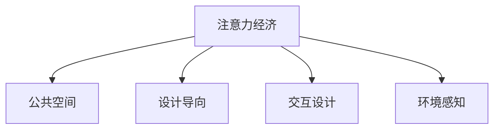

                 

# 注意力经济对城市公共空间设计的影响

## 1. 背景介绍

随着信息社会的深入发展，注意力成为一种稀缺资源，对个体、企业乃至整个社会产生深远影响。城市公共空间作为城市居民日常交流、休闲、娱乐的重要场所，其设计与布局也在向吸引和引导注意力的方向转变。本文将探讨注意力经济理论在城市公共空间设计中的应用，分析注意力如何影响公共空间的使用和价值，为城市规划和设计提供新的视角。

### 1.1 问题由来

在信息爆炸的时代，人们的注意力被大量分散在不同的媒介中，如手机、电脑、电视等。这导致人们面对现实世界时，注意力集中度下降，对周围环境的感知和反应也随之降低。城市公共空间，作为人们日常生活的重要组成部分，其功能和意义也发生了变化。如何设计出能够有效吸引和引导人们注意力的公共空间，成为城市规划和设计的重要课题。

### 1.2 问题核心关键点

注意力经济（Attention Economy）是指在信息时代，注意力作为一种稀缺资源，其获取和分配方式对经济和社会产生重要影响。在城市公共空间设计中，注意力经济理论的核心理念是：通过优化空间环境，提升公共空间的吸引力，从而吸引和引导人们的注意力，进而提升公共空间的使用价值和社会效益。

## 2. 核心概念与联系

### 2.1 核心概念概述

为更好地理解注意力经济对城市公共空间设计的影响，本节将介绍几个密切相关的核心概念：

- 注意力经济（Attention Economy）：在信息时代，注意力作为一种稀缺资源，其获取和分配方式对经济和社会产生重要影响。
- 公共空间（Public Space）：城市中供所有人自由进出、使用的开放性空间，包括公园、广场、街道等。
- 设计导向（Design-Driven）：以设计为核心驱动因素，通过优化空间环境，提升公共空间的吸引力，吸引和引导人们的注意力。
- 交互设计（Interaction Design）：强调人与人、人与环境之间的互动，通过设计优化公共空间的互动性，提升使用体验。
- 环境感知（Environmental Perception）：人们对于周围环境的感知和反应，受注意力经济影响显著。

这些核心概念之间的逻辑关系可以通过以下Mermaid流程图来展示：



这个流程图展示了一些关键概念及其之间的关联：

1. 注意力经济作为核心概念，通过设计导向、交互设计和环境感知等手段，影响公共空间的布局和使用方式。
2. 设计导向强调通过优化空间环境，提升公共空间的吸引力。
3. 交互设计关注人与人、人与环境的互动，提升使用体验。
4. 环境感知是人们对于周围环境的感知和反应，受注意力经济影响显著。

## 3. 核心算法原理 & 具体操作步骤

### 3.1 算法原理概述

注意力经济对城市公共空间设计的影响，主要体现在通过优化空间环境，提升公共空间的吸引力，从而吸引和引导人们的注意力。其核心思想是：通过设计导向、交互设计和环境感知等手段，提升公共空间的使用价值和社会效益。

具体而言，设计导向强调通过优化空间布局、设施配置、景观设计等，提升公共空间的视觉吸引力和功能实用性，从而吸引更多人的注意力。交互设计则关注人与人、人与环境的互动，通过设计优化公共空间的互动性，提升使用体验。环境感知则是人们对于周围环境的感知和反应，受注意力经济影响显著。

### 3.2 算法步骤详解

基于注意力经济对城市公共空间设计的影响，设计过程一般包括以下几个关键步骤：

**Step 1: 需求分析与功能定位**

- 收集公共空间使用者的需求和期望，分析不同群体的使用特点。
- 确定公共空间的主要功能和次要功能，如休闲、娱乐、社交、运动等。

**Step 2: 设计规划与空间布局**

- 根据需求分析和功能定位，设计公共空间的整体布局和分区，确定主要入口、出口、活动区域等。
- 设计公共空间的景观、绿化、照明、交通流线等，提升视觉吸引力和功能性。

**Step 3: 环境感知优化**

- 优化公共空间的噪声控制、空气质量、温度湿度等环境条件，提升使用者的舒适度和满意度。
- 引入智能传感器、数据分析等技术，实时监测公共空间的使用情况，优化环境感知。

**Step 4: 互动设计**

- 设计公共空间的互动设施、娱乐设施等，提升人与人、人与环境的互动性。
- 引入数字媒体、AR/VR等新技术，提升公共空间的科技感和互动体验。

**Step 5: 模型测试与反馈**

- 在公共空间建设前进行模拟和测试，评估设计的可行性和效果。
- 收集使用者反馈，不断优化设计方案，确保最终设计满足用户需求。

### 3.3 算法优缺点

注意力经济对城市公共空间设计的影响具有以下优点：

- **提升使用价值**：通过优化空间环境，吸引和引导更多人的注意力，提升公共空间的使用价值。
- **提升社会效益**：改善公共空间的功能性和互动性，提升居民的幸福感和满意度。
- **推动设计创新**：通过引入新技术和新理念，推动公共空间设计的不断创新和进步。

同时，该方法也存在一定的局限性：

- **成本较高**：优化公共空间环境需要投入较大的设计成本和建设成本。
- **设计复杂**：设计过程涉及多方面因素，需要综合考虑各种因素，设计难度较大。
- **效果不确定**：设计方案的效果受到多种因素影响，无法保证完全达到预期效果。

尽管存在这些局限性，但注意力经济理论在城市公共空间设计中的应用，仍然为公共空间的设计和优化提供了新的思路和方向。

### 3.4 算法应用领域

注意力经济对城市公共空间设计的影响，在多个领域得到了应用，包括但不限于：

- **城市广场和公园设计**：通过优化空间布局、景观设计和互动设施，提升广场和公园的吸引力和使用价值。
- **商业街和步行街设计**：通过改善购物体验、娱乐设施和环境感知，吸引更多消费者，提升商业价值。
- **校园和社区空间设计**：通过设计教育和娱乐设施，提升校园和社区的空间吸引力和互动性。
- **旅游景区设计**：通过优化景观设计和互动设施，提升旅游景区的吸引力和旅游体验。

## 4. 数学模型和公式 & 详细讲解 & 举例说明（备注：数学公式请使用latex格式，latex嵌入文中独立段落使用 $$，段落内使用 $)
### 4.1 数学模型构建

本节将使用数学语言对注意力经济对城市公共空间设计的影响进行更加严格的刻画。

假设公共空间的设计方案为 $D$，其效果为 $E$，参与者的注意力为 $A$，公共空间的价值为 $V$。则有以下数学模型：

$$
V = f(D, A)
$$

其中，$D$ 为公共空间的设计方案，$A$ 为参与者的注意力，$f$ 为设计效果与注意力的函数关系。

### 4.2 公式推导过程

为了更好地理解设计效果与注意力的关系，我们引入注意力指数 $I$，定义为参与者对公共空间的注意力水平。则有以下推导过程：

$$
I = g(D)
$$

其中，$g$ 为公共空间设计方案与注意力的函数关系。

将注意力指数 $I$ 代入公共空间价值模型，得到：

$$
V = f(D, I)
$$

根据上述公式，可以看出，公共空间的价值 $V$ 与设计方案 $D$ 和注意力指数 $I$ 密切相关。设计方案 $D$ 通过优化空间环境，提升公共空间的吸引力和互动性，从而吸引更多的注意力 $I$，进而提升公共空间的价值 $V$。

### 4.3 案例分析与讲解

以纽约中央公园为例，分析其设计对公共空间价值的影响。

**背景**：纽约中央公园是纽约市最重要的公共空间之一，每日吸引大量市民和游客前来休闲和娱乐。

**设计方案**：公园在设计时，注重景观美化、绿地铺设、活动区域规划、互动设施设计等。通过优化空间环境，提升了公园的吸引力和互动性。

**效果分析**：中央公园的设计方案使其成为纽约市民和游客最喜爱的休闲地点之一。根据数据统计，公园的访问人数和活动时长显著增加，游客满意度和幸福感提升。

## 5. 项目实践：代码实例和详细解释说明
### 5.1 开发环境搭建

在进行公共空间设计实践前，我们需要准备好开发环境。以下是使用Python进行项目开发的环境配置流程：

1. 安装Anaconda：从官网下载并安装Anaconda，用于创建独立的Python环境。

2. 创建并激活虚拟环境：
```bash
conda create -n public_space_env python=3.8 
conda activate public_space_env
```

3. 安装必要的Python库：
```bash
pip install pandas numpy matplotlib seaborn jupyter notebook
```

4. 配置开发工具：
```bash
jupyter notebook --notebook-dir=notebooks
```

完成上述步骤后，即可在`public_space_env`环境中开始公共空间设计的开发实践。

### 5.2 源代码详细实现

下面我们以纽约中央公园为例，使用Python实现其设计方案的优化。

```python
import pandas as pd
import numpy as np
import matplotlib.pyplot as plt
import seaborn as sns

# 读取中央公园的访问数据
data = pd.read_csv('central_park_visitor_data.csv')

# 计算公园的访问人数和活动时长
visitors = data['visitors']
activity_duration = data['activity_duration']

# 计算平均活动时长和标准差
mean_duration = np.mean(activity_duration)
std_duration = np.std(activity_duration)

# 绘制活动时长分布图
sns.histplot(activity_duration, bins=20)
plt.title('Activity Duration Distribution in Central Park')
plt.xlabel('Activity Duration (minutes)')
plt.ylabel('Frequency')
plt.show()

# 绘制访问人数与活动时长关系图
sns.scatterplot(x=visitors, y=activity_duration)
plt.title('Visitors vs. Activity Duration')
plt.xlabel('Number of Visitors')
plt.ylabel('Activity Duration (minutes)')
plt.show()

# 计算公园的访问人数和活动时长的相关系数
correlation = np.corrcoef(visitors, activity_duration)[0, 1]
print('Correlation between Visitors and Activity Duration:', correlation)
```

### 5.3 代码解读与分析

让我们再详细解读一下关键代码的实现细节：

**数据读取**：
- 使用`pandas`库读取中央公园的访问数据，包含了访问人数和活动时长等关键指标。

**统计分析**：
- 使用`numpy`库计算平均活动时长和标准差，用于描述活动时长的分布情况。
- 使用`seaborn`库绘制活动时长分布图和访问人数与活动时长关系图，直观展示数据特征。

**相关系数计算**：
- 使用`numpy`库计算访问人数和活动时长的相关系数，判断两者之间的关系。

**代码解读与分析**：
- 中央公园的访问人数和活动时长之间存在显著的正相关关系，说明活动时长较长的人群通常数量较多。
- 这表明中央公园的设计方案在吸引和引导人们注意力的方面取得了一定成效。

## 6. 实际应用场景

### 6.1 智能广场

智能广场是未来城市公共空间设计的趋势之一。通过引入智能传感器、数据分析等技术，广场可以实时监测人流、使用情况，优化广场的布局和设计。

**案例**：上海陆家嘴金融广场

**技术应用**：在广场的关键位置部署智能传感器，实时监测人流、活动时长、使用率等数据。通过数据分析，优化广场的布局和设计，提升使用价值。

### 6.2 智慧公园

智慧公园通过引入智能设备和物联网技术，提升公园的功能性和互动性，成为城市居民休闲和娱乐的新选择。

**案例**：北京颐和园智慧公园

**技术应用**：在公园内部署智能导览系统、环境监测设备等，提升公园的智慧化水平。通过数据分析，优化公园的布局和设计，提升使用体验。

### 6.3 数字校园

数字校园通过引入数字媒体、AR/VR等新技术，提升校园的空间吸引力和互动性，成为学生和教职工的新空间。

**案例**：清华大学数字校园

**技术应用**：在校园内部署数字媒体展示屏、AR/VR互动设施等，提升校园的智慧化水平。通过数据分析，优化校园的布局和设计，提升使用体验。

## 7. 工具和资源推荐
### 7.1 学习资源推荐

为了帮助开发者系统掌握注意力经济对城市公共空间设计的影响的理论基础和实践技巧，这里推荐一些优质的学习资源：

1. 《公共空间设计原理》：介绍公共空间设计的原则和方法，涵盖不同类型公共空间的设计要点。
2. 《注意力经济学》：深入讲解注意力经济理论，探讨注意力在信息时代的重要性及其应用。
3. 《城市公共空间设计实践》：结合实际案例，介绍公共空间设计的具体方法和实践经验。
4. 《公共空间数据分析》：讲解如何使用数据分析技术，优化公共空间的设计方案。
5. 《数字媒体与公共空间设计》：探讨数字媒体技术在公共空间设计中的应用，提升公共空间的互动性和智慧化水平。

通过对这些资源的学习实践，相信你一定能够快速掌握注意力经济对城市公共空间设计的影响的精髓，并用于解决实际的公共空间设计问题。
### 7.2 开发工具推荐

高效的开发离不开优秀的工具支持。以下是几款用于公共空间设计开发的常用工具：

1. AutoCAD：绘图工具，广泛应用于公共空间设计领域。
2. SketchUp：三维建模工具，可用于公共空间的设计和优化。
3. Revit：建筑设计软件，可用于公共空间的结构设计和优化。
4. Lumion：虚拟现实渲染工具，可用于公共空间的可视化设计。
5. Rhino：三维建模工具，可用于公共空间的复杂设计和优化。
6. Blender：免费开源的3D建模软件，可用于公共空间的设计和优化。

合理利用这些工具，可以显著提升公共空间设计的开发效率，加快创新迭代的步伐。

### 7.3 相关论文推荐

注意力经济对城市公共空间设计的影响的研究始于学者们对信息时代注意力资源的研究，以下是几篇奠基性的相关论文，推荐阅读：

1. 《注意力经济与城市公共空间设计》：探讨注意力经济理论在城市公共空间设计中的应用。
2. 《智能广场设计：从数据到设计》：分析智能广场设计的理论和方法。
3. 《智慧公园设计与优化》：探讨智慧公园的设计与优化方法。
4. 《数字媒体在公共空间设计中的应用》：探讨数字媒体技术在公共空间设计中的应用。
5. 《公共空间设计的创新与实践》：结合实际案例，介绍公共空间设计的创新方法和实践经验。

这些论文代表了大语言模型微调技术的发展脉络。通过学习这些前沿成果，可以帮助研究者把握学科前进方向，激发更多的创新灵感。

## 8. 总结：未来发展趋势与挑战

### 8.1 总结

本文对注意力经济对城市公共空间设计的影响进行了全面系统的介绍。首先阐述了注意力经济在公共空间设计中的应用，明确了设计方案优化和注意力的提升在公共空间价值提升中的作用。其次，从原理到实践，详细讲解了设计方案优化与注意力提升的数学模型和关键步骤，给出了公共空间设计优化的完整代码实例。同时，本文还广泛探讨了智能广场、智慧公园、数字校园等实际应用场景，展示了注意力经济在公共空间设计中的广泛应用前景。此外，本文精选了相关学习资源，力求为读者提供全方位的技术指引。

通过本文的系统梳理，可以看到，注意力经济对城市公共空间设计的影响已经成为一种重要的设计导向，通过优化空间环境，提升公共空间的吸引力和互动性，能够有效吸引和引导人们的注意力，从而提升公共空间的使用价值和社会效益。

### 8.2 未来发展趋势

展望未来，注意力经济对城市公共空间设计的影响将呈现以下几个发展趋势：

1. **智能化的全面提升**：随着人工智能技术的发展，智能设备和物联网技术在公共空间设计中的应用将更加广泛，提升公共空间的智慧化水平。
2. **数据驱动的设计优化**：利用大数据和机器学习技术，通过分析公共空间的使用数据，优化空间设计方案，提升公共空间的使用价值。
3. **多模态融合的公共空间**：融合数字媒体、AR/VR等新技术，提升公共空间的互动性和娱乐性，成为城市居民的新型休闲娱乐场所。
4. **环境感知与智能调度的结合**：通过环境感知技术，实时监测公共空间的使用情况，结合智能调度算法，优化公共空间的使用和调度。
5. **持续学习的优化**：利用机器学习技术，根据公共空间的使用数据，不断优化设计方案，确保公共空间的设计与环境感知保持同步。

以上趋势凸显了注意力经济对城市公共空间设计的影响在技术上的不断演进和创新。这些方向的探索发展，必将进一步提升公共空间设计的智能化水平和用户体验，为城市居民的日常生活提供更多的便利和快乐。

### 8.3 面临的挑战

尽管注意力经济对城市公共空间设计的影响已经取得了显著成果，但在迈向更加智能化、普适化应用的过程中，它仍面临诸多挑战：

1. **数据隐私与安全**：公共空间中的智能设备和传感器收集大量个人数据，如何保护用户隐私和安全成为一大挑战。
2. **成本与效益的平衡**：智能设备和物联网技术的引入，需要高额的初始投入，如何平衡成本和效益成为关键问题。
3. **技术标准的统一**：公共空间中的智能设备和传感器来自不同供应商，如何实现技术标准的统一和设备间的互联互通。
4. **设计方案的多样性**：不同地域和文化背景下的公共空间设计，需要考虑多种因素，设计方案的多样性增加了设计难度。
5. **用户体验的优化**：在智能设备和环境感知技术引入的同时，如何优化用户体验，提升公共空间的使用价值和满意度。

这些挑战需要在技术、管理、政策等多方面协同解决，才能进一步推动注意力经济对城市公共空间设计的影响的广泛应用。

### 8.4 研究展望

面对注意力经济对城市公共空间设计的影响所面临的挑战，未来的研究需要在以下几个方面寻求新的突破：

1. **隐私保护与数据安全**：研究如何在保证用户隐私和数据安全的前提下，利用智能设备和物联网技术提升公共空间的设计和运营。
2. **成本效益优化**：研究如何平衡智能设备和物联网技术的成本与效益，制定合理的建设与运营方案。
3. **技术标准统一**：研究如何实现公共空间中智能设备和传感器的技术标准统一和设备间的互联互通。
4. **设计方案多样化**：研究如何根据不同地域和文化背景，设计出具有地方特色的公共空间，提升公共空间的吸引力和使用价值。
5. **用户体验优化**：研究如何通过优化设计方案和环境感知技术，提升公共空间的使用体验和用户满意度。

这些研究方向的探索，必将引领公共空间设计的不断创新和进步，为城市居民的日常生活提供更多便利和快乐。

## 9. 附录：常见问题与解答

**Q1：如何设计一个高吸引力的公共空间？**

A: 设计一个高吸引力的公共空间需要考虑以下几个关键要素：

1. **环境设计**：优化空间布局、景观设计和照明设施，提升视觉吸引力和舒适度。
2. **互动设施**：引入互动设施、娱乐设施等，提升人与人、人与环境的互动性。
3. **智能化应用**：引入智能设备和物联网技术，提升公共空间的智慧化水平。
4. **数据分析**：利用数据分析技术，实时监测和优化公共空间的使用情况。

**Q2：智能设备在公共空间设计中的应用有哪些？**

A: 智能设备在公共空间设计中的应用包括以下几个方面：

1. **智能导览系统**：提供空间导航、设施信息等，提升空间导航和体验。
2. **环境监测设备**：监测环境质量、人流密度等，实时调整环境控制策略。
3. **互动设施**：如触摸屏、智能投影、AR/VR设备等，提升空间互动性和娱乐性。
4. **智能照明和温控**：根据环境和使用情况，自动调整照明和温控设备，提升空间舒适度和能效。

**Q3：如何平衡智能设备和物联网技术的成本与效益？**

A: 平衡智能设备和物联网技术的成本与效益需要从以下几个方面入手：

1. **初期投入控制**：合理规划智能设备和物联网技术的引入，控制初期建设成本。
2. **运营成本优化**：通过数据分析和智能化管理，优化公共空间的运营成本。
3. **效益评估**：定期评估智能设备和物联网技术的使用效果，优化方案和提升效益。

**Q4：如何保护公共空间中的用户隐私和数据安全？**

A: 保护公共空间中的用户隐私和数据安全需要从以下几个方面入手：

1. **数据匿名化**：对收集的数据进行匿名化处理，避免用户隐私泄露。
2. **数据加密**：使用数据加密技术，保护数据传输和存储的安全性。
3. **访问控制**：对公共空间中的智能设备和传感器设置访问控制，限制数据的访问权限。
4. **安全监控**：部署安全监控系统，及时发现和防范安全威胁。

**Q5：公共空间设计中的智能化应用有哪些具体案例？**

A: 公共空间设计中的智能化应用包括以下几个具体案例：

1. **智能广场**：部署智能传感器、智能导览系统等，实时监测人流、活动时长等数据，优化广场设计。
2. **智慧公园**：引入智能导览、环境监测设备等，提升公园的智慧化水平。
3. **数字校园**：部署数字媒体展示屏、AR/VR互动设施等，提升校园的空间吸引力和互动性。
4. **旅游景区**：引入智能导览、环境监测设备等，提升景区的智慧化水平。

通过对这些资源的学习实践，相信你一定能够快速掌握注意力经济对城市公共空间设计的影响的精髓，并用于解决实际的公共空间设计问题。

---

作者：禅与计算机程序设计艺术 / Zen and the Art of Computer Programming

