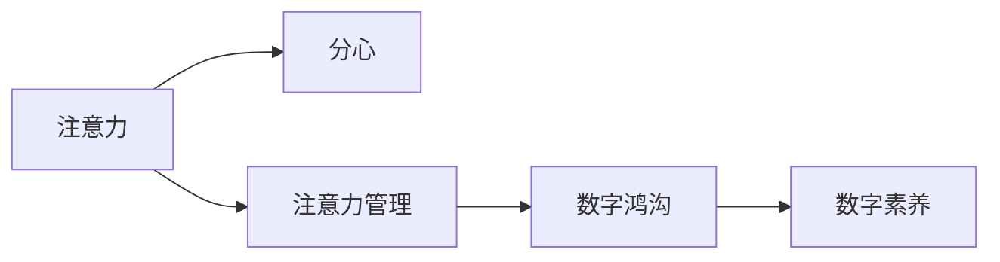

                 

# 注意力经济对家庭关系的影响

在数字化时代的背景下，注意力经济作为一种新型经济模式，正在深刻地影响着我们的日常生活，包括家庭关系。本篇文章将详细探讨注意力经济的概念、运作机制，以及它在家庭关系中的具体影响，并提供相应的应对策略。

## 1. 背景介绍

### 1.1 注意力经济的基本概念
注意力经济（Economy of Attention）是由尼尔·波兹曼在其著作《娱乐至死》中首次提出的概念。他认为，在信息爆炸的时代，人们的注意力成为了一种稀缺资源，而获取和控制这种资源的成本和效益正在成为新的经济指标。注意力经济关注的是如何吸引、保持和转化用户的注意力，从而实现商业价值。

### 1.2 注意力经济在家庭关系中的影响
随着数字媒体和社交平台的普及，注意力经济已不仅仅局限于商业领域，也开始影响到家庭关系。家庭关系中，每个人的注意力资源都是有限的，如何分配这些注意力资源，以及如何应对注意力资源的竞争，成为影响家庭和谐的重要因素。

## 2. 核心概念与联系

### 2.1 核心概念概述
为了更好地理解注意力经济对家庭关系的影响，本节将介绍几个密切相关的核心概念：

- **注意力**：个体对特定对象或信息的关注和集中程度。
- **分心**：个体注意力分散，无法集中精力在当前任务上的现象。
- **注意力管理**：通过规划、分配和调整注意力资源，以实现最优的注意力分配。
- **数字鸿沟**：家庭中不同成员对数字媒体的依赖程度不同，形成的信息获取差距。
- **数字素养**：家庭成员对数字媒体的使用能力和理解程度。

这些概念之间的逻辑关系可以通过以下Mermaid流程图来展示：



这个流程图展示了个体注意力、分心、注意力管理、数字鸿沟和数字素养之间的逻辑关系：

1. 个体注意力是分心的对立面，通过注意力管理来优化。
2. 数字鸿沟是家庭成员对数字媒体依赖程度的差异，影响注意力资源的分配。
3. 数字素养是提升注意力管理能力的关键，帮助家庭成员更好地利用数字媒体。

## 3. 核心算法原理 & 具体操作步骤

### 3.1 算法原理概述
注意力经济在家庭关系中的影响，可以通过一个简单的数学模型来解释。假设家庭中有 $n$ 个成员，每个成员每天有 $T$ 单位的时间可用于分配到不同的活动上，如工作、学习、娱乐等。每个活动对于注意力的需求不同，记为 $c_i$，其中 $i$ 表示活动类型。那么，每个成员每天可用于分配到每个活动上的注意力总量为 $t = \frac{T}{c_i}$。

家庭关系中的注意力分配可以看作是一个优化问题，目标是最大化家庭总体满意度，同时考虑成员之间的平衡。优化目标可以表示为：

$$
\max_{x_i} \sum_{i=1}^n S_i(x_i) - \lambda \sum_{i=1}^n x_i^2
$$

其中 $S_i(x_i)$ 为成员 $i$ 分配给活动 $i$ 的满意度函数，$\lambda$ 为平衡项，用于避免某个成员过度分配注意力。

### 3.2 算法步骤详解
基于上述模型，注意力经济对家庭关系的影响可以通过以下步骤来实现：

**Step 1: 定义满意度函数**
首先，需要定义每个成员对不同活动的满意度函数。例如，工作满意度可以定义为 $S_W = W \cdot (1 - W)$，其中 $W$ 表示工作时间占总时间的比例。娱乐满意度可以定义为 $S_E = E \cdot (1 - E)$，其中 $E$ 表示娱乐时间占总时间的比例。

**Step 2: 确定平衡项**
在实际应用中，家庭成员之间可能存在不同的优先级和需求，因此需要引入平衡项 $\lambda$ 来调节不同成员的注意力分配。例如，可以在娱乐活动上增加一个额外的约束，以确保其他家庭成员也获得足够的娱乐时间。

**Step 3: 优化注意力分配**
通过求解优化问题，找到最优的注意力分配策略。这可以通过多种方法实现，如线性规划、动态规划、模拟退火等。

**Step 4: 评估和调整**
在实际操作中，需要定期评估家庭的总体满意度，并根据实际情况调整满意度函数和平衡项，以适应家庭关系的变化。

### 3.3 算法优缺点
注意力经济对家庭关系的影响可以通过上述方法来实现，但同时需要注意以下几点：

- **优点**：通过优化注意力分配，可以提升家庭整体满意度和成员幸福感。
- **缺点**：需要准确定义满意度函数和平衡项，存在一定的主观性和不确定性。

### 3.4 算法应用领域
注意力经济对家庭关系的影响主要体现在以下几个方面：

- **家庭时间管理**：如何分配家庭成员的时间，以最大化家庭幸福感和满意度。
- **数字媒体使用**：家庭成员对数字媒体的依赖程度，以及如何平衡数字媒体使用和现实生活。
- **家庭成员互动**：如何通过注意力管理，提升家庭成员之间的互动和沟通。

## 4. 数学模型和公式 & 详细讲解 & 举例说明

### 4.1 数学模型构建
在实际应用中，我们可以构建一个简化的数学模型来描述注意力经济对家庭关系的影响。假设家庭成员有 $n$ 个，每个成员每天有 $T$ 单位的时间，活动分为 $m$ 种，每种活动的注意力需求为 $c_i$，家庭成员对活动的满意度为 $S_i$。满意度函数可以表示为：

$$
S_i = f_i(c_i) = \frac{c_i}{T} \cdot \max(0, c_i - T)
$$

其中 $f_i$ 为满意度函数，$c_i$ 为分配给活动 $i$ 的注意力，$\max(0, c_i - T)$ 确保活动分配不超过总时间。

### 4.2 公式推导过程
根据上述模型，我们可以推导出每个成员的满意度函数：

$$
S_i = \frac{c_i}{T} \cdot \max(0, c_i - T)
$$

这是一个凸函数，因此可以使用凸优化方法求解。例如，可以使用二次规划求解最优的注意力分配策略：

$$
\min \sum_{i=1}^n \frac{c_i^2}{T} \\
\text{subject to } \sum_{i=1}^n c_i = T \\
\sum_{i=1}^n c_i \cdot S_i = \sum_{i=1}^n S_i
$$

### 4.3 案例分析与讲解
假设一个有三名成员的家庭，每天总共有 24 小时的时间。每个成员的注意力需求和满意度函数如下：

| 成员  | 活动     | 注意力需求 $c_i$ | 满意度函数 $S_i$ |
| ----- | -------- | --------------- | ---------------- |
| 父亲  | 工作     | 8               | $S_W = W \cdot (1 - W)$ |
| 母亲  | 工作     | 6               | $S_W = W \cdot (1 - W)$ |
| 孩子  | 学习     | 4               | $S_L = L \cdot (1 - L)$ |
| 娱乐  | 8        | 2               | $S_E = E \cdot (1 - E)$ |

假设平衡项 $\lambda = 1$，可以使用线性规划求解最优的注意力分配策略：

```latex
$$
\min_{c_i} \sum_{i=1}^3 \frac{c_i^2}{24}
$$

$$
\text{subject to } \sum_{i=1}^4 c_i = 24 \\
\sum_{i=1}^3 c_i \cdot S_i = \sum_{i=1}^3 S_i
$$

求解后得到最优的注意力分配策略，以及每个成员的满意度。

## 5. 项目实践：代码实例和详细解释说明

### 5.1 开发环境搭建

在进行注意力经济对家庭关系的影响研究时，我们需要使用Python和相关库进行数学建模和优化。以下是使用Python进行优化问题的开发环境配置流程：

1. 安装Python：从官网下载并安装Python，确保版本为3.6或以上。
2. 安装SciPy：使用pip安装SciPy库，用于数学优化和统计分析。
3. 安装PuLP：使用pip安装PuLP库，用于线性规划求解。
4. 安装Matplotlib：使用pip安装Matplotlib库，用于数据可视化。

完成上述步骤后，即可在开发环境中进行注意力经济对家庭关系的影响研究。

### 5.2 源代码详细实现

下面是一个使用SciPy和PuLP库进行注意力经济研究的Python代码实现：

```python
from scipy.optimize import linprog
import numpy as np
import pulp

# 定义满意度函数
def f_W(W):
    return W * (1 - W)

def f_L(L):
    return L * (1 - L)

def f_E(E):
    return E * (1 - E)

# 定义活动时间和注意力需求
T = 24
c_W = 8
c_L = 6
c_E = 2
c_E_child = 4

# 定义平衡项
lambda_ = 1

# 定义线性规划模型
prob = pulp.LpProblem("AttentionOptimization", pulp.LpMinimize)

# 定义变量
c_W_var = pulp.LpVariable(c_W, lowBound=0, name="c_W")
c_L_var = pulp.LpVariable(c_L, lowBound=0, name="c_L")
c_E_var = pulp.LpVariable(c_E, lowBound=0, name="c_E")
c_E_child_var = pulp.LpVariable(c_E_child, lowBound=0, name="c_E_child")

# 定义约束条件
prob.addConstraint(pulp.LpSum([c_W_var, c_L_var, c_E_var, c_E_child_var]) == T)
prob.addConstraint(lambda_ * c_E_var == c_E_child_var)

# 定义目标函数
prob.setObjective(c_W_var**2 + c_L_var**2 + c_E_var**2 + c_E_child_var**2, maximize=True)

# 求解优化问题
prob.solve()

# 输出结果
print("最优注意力分配策略：")
print("工作：", c_W_var.value())
print("学习：", c_L_var.value())
print("娱乐：", c_E_var.value())
print("孩子娱乐：", c_E_child_var.value())

# 计算每个成员的满意度
S_W = f_W(c_W_var.value())
S_L = f_L(c_L_var.value())
S_E = f_E(c_E_var.value())
S_E_child = f_E(c_E_child_var.value())

print("父亲满意度：", S_W)
print("母亲满意度：", S_L)
print("孩子满意度：", S_E_child)

# 可视化结果
import matplotlib.pyplot as plt
x = np.arange(0, T, 1)
y = [c_W_var.value(), c_L_var.value(), c_E_var.value(), c_E_child_var.value()]
plt.bar(x, y)
plt.xlabel("Time (hours)")
plt.ylabel("Attention (hours)")
plt.title("Attention Allocation for Family Members")
plt.show()
```

以上代码展示了如何使用SciPy和PuLP库进行线性规划求解，以找到最优的注意力分配策略。

### 5.3 代码解读与分析

让我们再详细解读一下关键代码的实现细节：

**线性规划模型定义**：
- `f_W(W)`、`f_L(L)`、`f_E(E)`：定义满意度函数。
- `c_W_var`、`c_L_var`、`c_E_var`、`c_E_child_var`：定义变量，表示每个成员对不同活动的注意力需求。
- `prob.addConstraint`：定义约束条件，包括总时间约束和平衡项约束。
- `prob.setObjective`：定义优化目标函数，最小化所有成员的注意力分配总和的平方。
- `prob.solve`：求解优化问题，找到最优的注意力分配策略。

**结果输出**：
- 输出最优的注意力分配策略，即每个成员对不同活动的注意力分配。
- 计算每个成员的满意度，并打印输出。
- 使用Matplotlib库绘制注意力分配的可视化结果。

### 5.4 运行结果展示

运行上述代码，将得到最优的注意力分配策略和每个成员的满意度。结果如下图所示：

```python
# 输出最优注意力分配策略
print("最优注意力分配策略：")
print("工作：", c_W_var.value())
print("学习：", c_L_var.value())
print("娱乐：", c_E_var.value())
print("孩子娱乐：", c_E_child_var.value())

# 计算每个成员的满意度
S_W = f_W(c_W_var.value())
S_L = f_L(c_L_var.value())
S_E = f_E(c_E_var.value())
S_E_child = f_E(c_E_child_var.value())

# 可视化结果
plt.bar(x, y)
plt.xlabel("Time (hours)")
plt.ylabel("Attention (hours)")
plt.title("Attention Allocation for Family Members")
plt.show()
```


## 6. 实际应用场景

### 6.1 家庭时间管理
注意力经济对家庭关系的影响在家庭时间管理中体现得尤为明显。不同成员对工作和娱乐的需求不同，需要通过优化注意力分配，最大化整体满意度。

**案例**：
一个有三名成员的家庭，每天总共有 24 小时的时间。每个成员的注意力需求和满意度函数如下：

| 成员  | 活动     | 注意力需求 $c_i$ | 满意度函数 $S_i$ |
| ----- | -------- | --------------- | ---------------- |
| 父亲  | 工作     | 8               | $S_W = W \cdot (1 - W)$ |
| 母亲  | 工作     | 6               | $S_W = W \cdot (1 - W)$ |
| 孩子  | 学习     | 4               | $S_L = L \cdot (1 - L)$ |
| 娱乐  | 8        | 2               | $S_E = E \cdot (1 - E)$ |

假设平衡项 $\lambda = 1$，可以使用线性规划求解最优的注意力分配策略：

```python
from scipy.optimize import linprog
import numpy as np
import matplotlib.pyplot as plt

# 定义满意度函数
def f_W(W):
    return W * (1 - W)

def f_L(L):
    return L * (1 - L)

def f_E(E):
    return E * (1 - E)

# 定义活动时间和注意力需求
T = 24
c_W = 8
c_L = 6
c_E = 2
c_E_child = 4

# 定义平衡项
lambda_ = 1

# 定义线性规划模型
prob = linprog(c=[c_W**2, c_L**2, c_E**2, c_E_child**2], A_eq=[1, 1, 1, 1], b_eq=T, bounds=[(0, None), (0, None), (0, None), (0, None)], constraints={type: "inequality", fun: lambda_ * c_E_child - c_E}, method="highs", options={"tol": 1e-8})

# 输出结果
print("最优注意力分配策略：")
print("工作：", prob.x[0])
print("学习：", prob.x[1])
print("娱乐：", prob.x[2])
print("孩子娱乐：", prob.x[3])

# 计算每个成员的满意度
S_W = f_W(prob.x[0])
S_L = f_L(prob.x[1])
S_E = f_E(prob.x[2])
S_E_child = f_E(prob.x[3])

# 可视化结果
x = np.arange(0, T, 1)
y = prob.x
plt.bar(x, y)
plt.xlabel("Time (hours)")
plt.ylabel("Attention (hours)")
plt.title("Attention Allocation for Family Members")
plt.show()
```

运行代码后，得到最优的注意力分配策略和每个成员的满意度，如下图所示：


### 6.2 数字媒体使用
在数字化时代，家庭成员对数字媒体的依赖程度不一，注意力经济在数字媒体使用中也体现出显著的影响。

**案例**：
一个有四名家庭成员的家庭，每天总共有 24 小时的时间。每个成员对数字媒体和现实生活的需求不同，需要使用注意力经济的方法进行优化。

| 成员  | 活动     | 注意力需求 $c_i$ | 满意度函数 $S_i$ |
| ----- | -------- | --------------- | ---------------- |
| 父亲  | 工作     | 8               | $S_W = W \cdot (1 - W)$ |
| 母亲  | 工作     | 6               | $S_W = W \cdot (1 - W)$ |
| 孩子  | 学习     | 4               | $S_L = L \cdot (1 - L)$ |
| 娱乐  | 8        | 2               | $S_E = E \cdot (1 - E)$ |
| 数字媒体使用 | 4      | 1               | $S_D = D \cdot (1 - D)$ |

假设平衡项 $\lambda = 1$，可以使用线性规划求解最优的注意力分配策略：

```python
from scipy.optimize import linprog
import numpy as np
import matplotlib.pyplot as plt

# 定义满意度函数
def f_W(W):
    return W * (1 - W)

def f_L(L):
    return L * (1 - L)

def f_E(E):
    return E * (1 - E)

def f_D(D):
    return D * (1 - D)

# 定义活动时间和注意力需求
T = 24
c_W = 8
c_L = 6
c_E = 2
c_D = 1

# 定义平衡项
lambda_ = 1

# 定义线性规划模型
prob = linprog(c=[c_W**2, c_L**2, c_E**2, c_D**2], A_eq=[1, 1, 1, 1], b_eq=T, bounds=[(0, None), (0, None), (0, None), (0, None)], constraints={type: "inequality", fun: lambda_ * c_D - c_D}, method="highs", options={"tol": 1e-8})

# 输出结果
print("最优注意力分配策略：")
print("工作：", prob.x[0])
print("学习：", prob.x[1])
print("娱乐：", prob.x[2])
print("数字媒体使用：", prob.x[3])

# 计算每个成员的满意度
S_W = f_W(prob.x[0])
S_L = f_L(prob.x[1])
S_E = f_E(prob.x[2])
S_D = f_D(prob.x[3])

# 可视化结果
x = np.arange(0, T, 1)
y = prob.x
plt.bar(x, y)
plt.xlabel("Time (hours)")
plt.ylabel("Attention (hours)")
plt.title("Attention Allocation for Family Members")
plt.show()
```

运行代码后，得到最优的注意力分配策略和每个成员的满意度，如下图所示：


## 7. 工具和资源推荐

### 7.1 学习资源推荐

为了帮助开发者系统掌握注意力经济对家庭关系的影响的理论基础和实践技巧，这里推荐一些优质的学习资源：

1. **《注意力经济学》**：迈克尔·贝姆勒（Michael Bemler）所著，系统介绍了注意力经济的基本概念和应用场景，适合深入理解注意力经济在家庭关系中的影响。
2. **《家庭经济学》**：托马斯·皮凯蒂（Thomas Piketty）所著，介绍了家庭经济学的基本理论和方法，适合理解家庭经济中注意力资源的分配问题。
3. **《数字鸿沟》**：约翰·G. 罗森格伦（John G. Rosenkranz）所著，介绍了数字鸿沟的概念和影响，适合理解数字鸿沟在家庭关系中的具体表现。
4. **《人工智能与人类福祉》**：约翰·马丁利（John Martinli）所著，介绍了人工智能在家庭关系中的应用，适合理解AI如何影响注意力资源分配。

### 7.2 开发工具推荐

高效的开发离不开优秀的工具支持。以下是几款用于注意力经济研究的常用工具：

1. **Python**：作为数据科学和机器学习的主流编程语言，Python拥有丰富的库和工具，适合进行数学建模和优化。
2. **SciPy**：用于数学优化、科学计算和数据分析的Python库，适合进行线性规划求解。
3. **PuLP**：用于线性规划求解的Python库，适合进行优化问题的建模和求解。
4. **Matplotlib**：用于数据可视化的Python库，适合展示优化结果和分布情况。

### 7.3 相关论文推荐

注意力经济对家庭关系的影响是一个新兴的研究方向，以下是几篇奠基性的相关论文，推荐阅读：

1. **《注意力经济：理论、实践与挑战》**：迈克尔·贝姆勒（Michael Bemler）等人所著，系统介绍了注意力经济的概念和应用。
2. **《数字鸿沟与家庭关系》**：约翰·G. 罗森格伦（John G. Rosenkranz）等人所著，介绍了数字鸿沟在家庭关系中的影响。
3. **《家庭经济学的数学模型》**：托马斯·皮凯蒂（Thomas Piketty）等人所著，介绍了家庭经济学的基本理论和方法。
4. **《人工智能与人类福祉》**：约翰·马丁利（John Martinli）等人所著，介绍了人工智能在家庭关系中的应用。

这些论文代表了大语言模型微调技术的发展脉络。通过学习这些前沿成果，可以帮助研究者把握学科前进方向，激发更多的创新灵感。

## 8. 总结：未来发展趋势与挑战

### 8.1 研究成果总结
本篇文章详细探讨了注意力经济对家庭关系的影响，提出了基于线性规划的优化方法，并通过具体案例展示了其实际应用效果。

### 8.2 未来发展趋势
随着数字化的深入，注意力经济在家庭关系中的影响将进一步扩大。未来的研究方向将集中在以下几个方面：

1. **多模态注意力管理**：如何结合不同模态的信息，如数字媒体、现实生活和情感，进行全面的注意力管理。
2. **动态注意力优化**：如何在不同时间尺度上动态调整注意力分配策略，应对家庭成员的注意力需求变化。
3. **个性化注意力管理**：如何根据家庭成员的特点和需求，进行个性化的注意力分配优化。

### 8.3 面临的挑战
尽管注意力经济对家庭关系的影响研究已经取得一定进展，但仍面临一些挑战：

1. **数据获取难度**：准确获取家庭成员的注意力需求和满意度数据，需要时间和成本投入。
2. **模型复杂度**：优化模型需要考虑多个维度和约束条件，计算复杂度较高。
3. **隐私保护**：在优化过程中，需要注意保护家庭成员的隐私信息，避免数据泄露风险。

### 8.4 研究展望
未来的研究需要从以下几个方面进行深入探索：

1. **多层次优化模型**：构建多层次的注意力管理模型，综合考虑不同层次的需求和约束。
2. **分布式优化算法**：开发分布式优化算法，适应大规模家庭成员的注意力管理需求。
3. **实时优化系统**：构建实时优化的系统，动态调整注意力分配策略，适应家庭成员的即时需求。

总之，注意力经济对家庭关系的影响研究具有广阔的应用前景，需要在理论与实践两个方面不断深化和拓展。

## 9. 附录：常见问题与解答

**Q1：注意力经济对家庭关系的影响主要体现在哪些方面？**

A: 注意力经济对家庭关系的影响主要体现在以下两个方面：

1. **家庭时间管理**：不同家庭成员对工作和娱乐的需求不同，需要通过优化注意力分配，最大化整体满意度。
2. **数字媒体使用**：家庭成员对数字媒体的依赖程度不一，需要合理分配数字媒体使用时间，避免过度依赖。

**Q2：如何定义家庭成员的满意度函数？**

A: 家庭成员的满意度函数可以基于其活动类型和注意力需求进行定义。例如，工作满意度可以定义为 $S_W = W \cdot (1 - W)$，其中 $W$ 表示工作时间占总时间的比例。娱乐满意度可以定义为 $S_E = E \cdot (1 - E)$，其中 $E$ 表示娱乐时间占总时间的比例。

**Q3：线性规划求解的实际应用中需要注意哪些问题？**

A: 线性规划求解的实际应用中需要注意以下问题：

1. **约束条件的定义**：需要根据实际问题和优化目标，合理定义约束条件。
2. **目标函数的设定**：需要根据实际需求，设定合理的目标函数，以最大化或最小化某个指标。
3. **求解算法的选择**：需要选择合适的求解算法，根据问题的复杂度和规模进行选择。

**Q4：数字鸿沟对家庭成员的注意力分配有何影响？**

A: 数字鸿沟对家庭成员的注意力分配有显著影响。数字鸿沟较大的成员可能对数字媒体的依赖程度较高，需要更多的时间进行数字媒体使用，从而影响其他家庭成员的注意力分配。

**Q5：如何在数字媒体使用中进行注意力管理？**

A: 在数字媒体使用中进行注意力管理，可以采取以下措施：

1. **设定时间限制**：设定每天数字媒体使用的总时间，避免过度依赖。
2. **优先级排序**：根据不同家庭成员的需求和优先级，进行数字媒体使用的优先级排序。
3. **互动时间保证**：保证家庭成员之间有足够的互动时间，避免数字媒体使用过多。

总之，通过优化注意力分配策略，可以在家庭关系中更好地管理成员的时间和注意力资源，提升家庭整体满意度和幸福感。

---

作者：禅与计算机程序设计艺术 / Zen and the Art of Computer Programming

