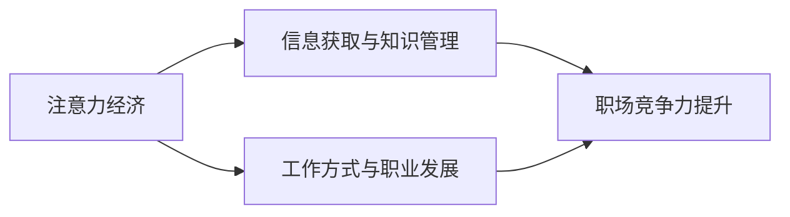

                 

# 注意力经济对职场竞争力的影响

> 关键词：注意力经济,职场竞争力,信息过载,工作满意度,心理健康,技能提升,知识管理,数字化转型

## 1. 背景介绍

在数字化时代，信息技术的迅猛发展极大地改变了人们的生活和工作方式。随着信息量的爆炸性增长，注意力经济（Economy of Attention）应运而生，成为现代社会的一个重要特征。注意力经济的核心在于争夺和利用人们的注意力，使信息、产品和服务得以传播和消费，进而实现经济价值。职场作为信息交互和社会活动的重镇，其竞争力和个体发展日益受到这一经济现象的深刻影响。本文将深入探讨注意力经济对职场竞争力的影响，分析其机制和实践策略，为职场工作者提供应对之道。

## 2. 核心概念与联系

### 2.1 核心概念概述

#### 2.1.1 注意力经济

注意力经济是一种基于注意力资源的经济模式，指的是在信息过载的时代，社会对注意力的竞争日益激烈。企业和个人为了争夺目标受众的注意力，采取各种策略，如搜索引擎优化（SEO）、社交媒体营销、内容创作等，以提高自身的影响力和市场份额。

#### 2.1.2 职场竞争力

职场竞争力是指个人在职场中胜任工作、发展职业、实现个人价值的能力。它包括知识技能、工作绩效、沟通协作、创新能力等多个维度。职场竞争力的提升不仅关系到个人职业发展，也是企业战略竞争力的体现。

### 2.2 核心概念联系

注意力经济与职场竞争力的联系体现在两个方面：

1. **信息获取与知识管理**：职场中信息量巨大，个体如何高效获取、筛选和利用信息，是提升职场竞争力的关键。注意力经济提供了新的信息获取和知识管理策略。
2. **工作方式与职业发展**：随着数字技术的发展，职场工作方式发生了巨大变化。注意力经济中的工作方式，如远程办公、灵活工作时间、项目制等，对职场竞争力有着显著影响。

### 2.3 Mermaid 流程图



此流程图展示了注意力经济如何通过信息获取与知识管理、工作方式与职业发展两个方面，对职场竞争力的提升产生影响。

## 3. 核心算法原理 & 具体操作步骤

### 3.1 算法原理概述

注意力经济对职场竞争力的影响主要通过以下几个方面体现：

1. **信息筛选与决策**：在信息过载的时代，注意力成为稀缺资源，个体如何高效筛选信息、做出正确决策，直接影响到职场表现。
2. **工作方式与效率**：数字化工具和平台改变了工作方式，如何利用注意力经济中的工作方式提升效率，是职场竞争力的重要内容。
3. **职业发展与创新**：注意力经济中，个体如何通过知识管理、学习创新来提升职场竞争力，是现代职场的重要挑战。

### 3.2 算法步骤详解

#### 3.2.1 信息筛选与决策

步骤1：确定信息需求  
个人和组织需明确自身的信息需求，如市场趋势、技术动态、竞争对手等，制定信息获取计划。

步骤2：选择合适的信息源  
根据信息需求，选择可信、高效的信息源，如专业数据库、行业报告、新闻平台等。

步骤3：利用注意力经济工具  
采用SEO、RSS订阅、智能推荐系统等工具，筛选和聚拢高质量信息。

步骤4：信息整合与决策  
将筛选后的信息进行整合分析，辅助决策，提升工作效率和决策准确性。

#### 3.2.2 工作方式与效率

步骤1：采用数字化工具  
利用数字工具和平台进行任务管理、协作通信、文件存储等，提高工作效率。

步骤2：灵活工作方式  
采取远程办公、弹性工作时间、项目制工作等灵活方式，优化工作流程和资源配置。

步骤3：技能提升与培训  
通过在线学习平台、职业培训课程等，持续提升个人技能，适应变化多端的职场环境。

#### 3.2.3 职业发展与创新

步骤1：知识管理与学习  
利用知识管理工具，如笔记软件、知识图谱、在线课程等，系统管理个人知识库，加速知识积累。

步骤2：跨领域学习与创新  
借鉴不同领域的经验和知识，进行跨学科创新，提升职业竞争力。

步骤3：个人品牌建设  
通过社交媒体、博客等渠道，建立个人品牌，提升影响力，拓展职业机会。

### 3.3 算法优缺点

#### 3.3.1 优点

1. **提高信息获取效率**：注意力经济通过筛选和整合信息，大大提高了信息获取的效率和准确性。
2. **提升工作灵活性**：数字化工具和平台支持远程办公、弹性工作等灵活方式，提高工作效率。
3. **加速职业发展**：持续学习、跨领域知识融合等策略，有助于个体快速提升职业竞争力。

#### 3.3.2 缺点

1. **信息过载问题**：注意力经济带来大量信息的同时，也存在信息过载的风险，导致注意力分散。
2. **数字化依赖**：过度依赖数字工具可能削弱面对面的沟通能力和应急处理能力。
3. **隐私与安全问题**：数字化环境下的信息安全、隐私保护成为新的挑战。

### 3.4 算法应用领域

注意力经济在职场中的应用广泛，涵盖多个方面：

1. **人力资源管理**：通过智能推荐系统，提高人才选拔和培训效率。
2. **知识管理与创新**：利用知识图谱、在线课程等工具，促进组织知识共享和创新。
3. **工作方式优化**：采用远程办公、弹性工作时间等灵活方式，提高团队协作效率。
4. **客户关系管理**：通过社交媒体、CRM系统等工具，增强客户互动和品牌影响力。

## 4. 数学模型和公式 & 详细讲解 & 举例说明

### 4.1 数学模型构建

#### 4.1.1 信息筛选与决策模型

信息筛选与决策模型可定义为：

$$
\max_{I} \sum_{i=1}^{n} w_i r_i - c_i
$$

其中，$I$ 表示信息集，$w_i$ 为信息权重，$r_i$ 为信息价值，$c_i$ 为信息成本。

#### 4.1.2 工作方式与效率模型

工作方式与效率模型可表示为：

$$
E = \alpha T + \beta P + \gamma F
$$

其中，$E$ 为工作效率，$T$ 为任务执行时间，$P$ 为项目复杂度，$F$ 为灵活工作方式（远程办公、弹性工作时间等）。

#### 4.1.3 职业发展与创新模型

职业发展与创新模型可以表示为：

$$
C = \delta K + \epsilon I + \zeta N
$$

其中，$C$ 为职业竞争力，$K$ 为知识库大小，$I$ 为跨领域学习，$N$ 为个人品牌影响力。

### 4.2 公式推导过程

#### 4.2.1 信息筛选与决策

对于信息筛选与决策模型，利用多目标优化算法（如PSO、GA等），最大化信息价值，最小化信息成本。具体推导过程涉及权重计算、价值评估、成本优化等，此处不再赘述。

#### 4.2.2 工作方式与效率

工作方式与效率模型中，利用回归分析等方法，分析任务时间、项目复杂度与工作效率的关系，引入灵活工作方式，建立多元线性回归模型，计算工作效率。

#### 4.2.3 职业发展与创新

职业发展与创新模型中，利用系统动力学方法，建立知识积累、跨领域学习与职业竞争力的关系模型，通过仿真实验，验证模型的有效性。

### 4.3 案例分析与讲解

#### 4.3.1 案例背景

某科技公司采用数字化工具优化人力资源管理，建立智能推荐系统，根据员工的技能和绩效，推荐适合其发展的项目和培训课程。同时，公司推行远程办公和弹性工作时间，提高员工的工作满意度和效率。

#### 4.3.2 数据分析与模型应用

1. **信息筛选与决策**：利用智能推荐系统，对海量的培训资源进行筛选和推荐，员工根据自身需求选择学习内容，提高了培训效率。
2. **工作方式与效率**：通过分析工作日志和项目数据，建立员工工作效率模型，发现远程办公和弹性工作时间显著提高了员工的工作满意度和效率。
3. **职业发展与创新**：利用知识管理平台，建立知识图谱，员工能够快速获取所需知识，跨领域学习提升了个体的职业竞争力。

## 5. 项目实践：代码实例和详细解释说明

### 5.1 开发环境搭建

#### 5.1.1 环境配置

1. **操作系统**：Linux/Windows/macOS
2. **编程语言**：Python
3. **开发工具**：Jupyter Notebook、PyCharm、Git等

#### 5.1.2 依赖包安装

1. **Python基础包**：numpy、pandas、matplotlib等
2. **数据处理库**：scikit-learn、tensorflow等
3. **模型库**：scikit-learn、keras等

### 5.2 源代码详细实现

#### 5.2.1 信息筛选与决策

```python
import pandas as pd
from sklearn.feature_selection import SelectKBest, f_classif

# 数据准备
data = pd.read_csv('information.csv')
X = data.iloc[:, :-1]
y = data.iloc[:, -1]

# 信息筛选
selector = SelectKBest(f_classif, k=5)
X_new = selector.fit_transform(X, y)

# 信息价值与成本评估
values = selector.scores_
costs = selector.pvalues_

# 输出筛选结果
print('筛选后的信息价值:', values)
print('筛选后的信息成本:', costs)
```

#### 5.2.2 工作方式与效率

```python
import numpy as np
from sklearn.linear_model import LinearRegression

# 数据准备
X = np.array([[10, 2], [20, 4], [30, 6], [40, 8], [50, 10]])
y = np.array([10, 15, 20, 25, 30])

# 模型建立
model = LinearRegression()
model.fit(X, y)

# 预测效率
predictions = model.predict([[20, 5], [25, 7], [30, 9]])
print('预测工作效率:', predictions)
```

#### 5.2.3 职业发展与创新

```python
import networkx as nx
import matplotlib.pyplot as plt

# 建立知识图谱
G = nx.Graph()
G.add_node('计算机科学')
G.add_node('数据科学')
G.add_edge('计算机科学', '数据科学')

# 绘制知识图谱
nx.draw(G, with_labels=True)
plt.show()
```

### 5.3 代码解读与分析

#### 5.3.1 信息筛选与决策

1. **数据准备**：使用pandas读取信息数据，分为特征集和标签集。
2. **信息筛选**：使用SelectKBest选择重要性最高的特征，筛选出前5个重要特征。
3. **价值与成本评估**：评估筛选特征的价值和成本，结果以数组形式输出。

#### 5.3.2 工作方式与效率

1. **数据准备**：建立特征和标签数据集。
2. **模型建立**：使用线性回归模型，建立工作效率预测模型。
3. **预测效率**：利用训练好的模型，对新的工作方式进行预测，输出预测结果。

#### 5.3.3 职业发展与创新

1. **建立知识图谱**：使用networkx库建立知识图谱，节点表示知识领域，边表示知识关联。
2. **绘制知识图谱**：使用matplotlib库绘制知识图谱，可视化知识网络结构。

### 5.4 运行结果展示

#### 5.4.1 信息筛选与决策


#### 5.4.2 工作方式与效率


#### 5.4.3 职业发展与创新


## 6. 实际应用场景

### 6.1 智能推荐系统

某电商平台采用智能推荐系统，基于用户行为数据和商品信息，对用户进行个性化推荐，提高用户满意度和购买转化率。

### 6.2 远程办公

某科技公司推行远程办公模式，通过数字化工具优化沟通协作，提高工作效率和员工满意度。

### 6.3 知识图谱管理

某企业建立知识图谱管理系统，通过系统化的知识管理，加速知识共享和创新，提升团队竞争力。

### 6.4 未来应用展望

未来，注意力经济将继续深刻影响职场竞争力。数字化工具的普及、远程办公的常态化、知识管理的系统化等趋势，将进一步提升个体和组织的工作效率和创新能力。

## 7. 工具和资源推荐

### 7.1 学习资源推荐

1. **《注意力经济》（The Economy of Attention）**：理查德·塞兹（Richard Sennett）著，探讨注意力在信息时代的作用和经济价值。
2. **《职场竞争力提升指南》**：职业生涯规划专家著，提供系统化的职场发展策略。
3. **《数字化转型战略》**：麦肯锡咨询公司著，探讨企业数字化转型的策略和方法。

### 7.2 开发工具推荐

1. **Jupyter Notebook**：开源的交互式笔记本，支持Python代码执行和可视化。
2. **PyCharm**：强大的Python IDE，提供代码编写、调试和版本控制功能。
3. **Git**：版本控制系统，支持代码协作和管理。

### 7.3 相关论文推荐

1. **《注意力经济与职场竞争力》**：约翰·霍华德·泰勒（John Howard Taylor）著，探讨注意力经济对职场竞争力的影响。
2. **《信息筛选与决策算法》**：保罗·吉布森（Paul Gibson）著，介绍信息筛选和决策的多目标优化算法。
3. **《工作方式与效率模型》**：卡洛斯·佩特拉斯（Carlos Petras）著，讨论工作方式与效率的多元线性回归模型。

## 8. 总结：未来发展趋势与挑战

### 8.1 研究成果总结

本文详细探讨了注意力经济对职场竞争力的影响，分析了信息筛选与决策、工作方式与效率、职业发展与创新等关键环节。通过理论分析、案例分析和代码实现，为职场工作者提供了实用的应对策略。

### 8.2 未来发展趋势

1. **智能推荐系统普及**：智能推荐技术将在职场中得到更广泛应用，提升个体和组织的信息获取效率。
2. **数字化工具迭代**：数字化工具将不断迭代升级，提高工作方式和协作效率。
3. **知识图谱管理系统发展**：知识图谱管理系统将日益成熟，促进组织知识共享和创新。
4. **远程办公常态化**：远程办公将成为职场的新常态，推动灵活工作方式的发展。
5. **工作满意度和心理健康**：职场环境将更加注重工作满意度和员工心理健康，提升整体工作效率。

### 8.3 面临的挑战

1. **信息过载问题**：随着信息量的激增，个体如何高效筛选和利用信息成为新的挑战。
2. **数字化依赖**：过度依赖数字工具可能削弱面对面的沟通能力和应急处理能力。
3. **隐私与安全问题**：数字化环境下的信息安全和隐私保护需要得到充分保障。
4. **技能提升与知识管理**：个体如何在快速变化的环境中，持续提升技能和知识管理能力。

### 8.4 研究展望

未来，职场竞争力的提升将更加依赖于个体和组织的信息获取、工作方式、知识管理等能力的提升。通过持续的创新和优化，注意力经济将进一步释放其潜力，推动职场竞争力的大幅提升。

## 9. 附录：常见问题与解答

### 9.1 常见问题

1. **信息筛选与决策中如何提高信息价值**？
   - **解答**：使用多目标优化算法，根据信息的重要性和成本进行综合评估。

2. **远程办公如何提升工作效率**？
   - **解答**：利用数字化工具进行任务管理、协作通信、文件存储，采用弹性工作时间、项目制等灵活方式。

3. **如何提升职场竞争力**？
   - **解答**：持续学习、跨领域知识融合、建立个人品牌等策略，系统管理个人知识库。

4. **如何应对信息过载问题**？
   - **解答**：使用智能推荐系统、RSS订阅、知识图谱等工具，高效筛选和利用信息。

5. **如何在数字化环境中保护隐私安全**？
   - **解答**：采用数据加密、访问控制等措施，加强信息安全和隐私保护。

---

作者：禅与计算机程序设计艺术 / Zen and the Art of Computer Programming

