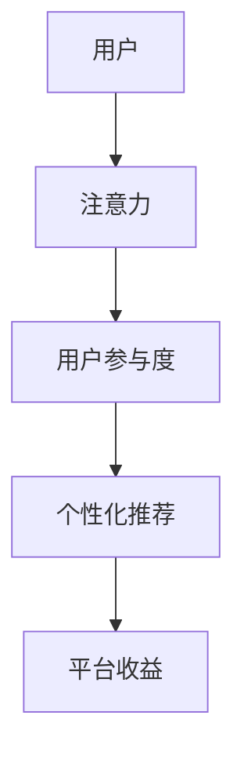

                 

# 注意力经济对阅读习惯的影响

在数字化时代的浪潮中，人类获取信息的方式发生了翻天覆地的变化。注意力经济，即如何争夺和利用人们的注意力，成为数字化平台和内容创作者的必修课。本文将从注意力经济的角度，探讨其对人类阅读习惯的影响，并分析这一趋势背后的技术驱动因素。

## 1. 背景介绍

### 1.1 数字化革命的浪潮

数字化时代的到来，极大地改变了人类获取信息的方式。互联网、移动互联网、社交媒体等技术的迅猛发展，使得信息传播的速度和广度达到了前所未有的高度。人们不再受时间和空间的限制，随时随地可以接触到海量的信息内容。

### 1.2 注意力经济的兴起

注意力经济，是指在数字化时代，如何有效吸引和利用人们的注意力，进行内容分发、广告投放、市场推广等活动。在信息过载的背景下，注意力成为稀缺资源，各大平台纷纷通过算法优化、个性化推荐等方式，争夺用户注意力。

## 2. 核心概念与联系

### 2.1 核心概念概述

注意力经济的核心概念包括注意力、用户参与度、个性化推荐等。这些概念之间存在紧密联系，共同构成了数字化平台的内容分发和市场推广策略。

- **注意力**：指用户在接触信息时的注意力持续时间。注意力越持久，信息的影响力越大。
- **用户参与度**：指用户与内容的互动程度，包括点击、评论、分享等行为。高参与度的内容更能引发用户的情感共鸣，提升品牌忠诚度。
- **个性化推荐**：指根据用户的历史行为和偏好，智能推荐用户感兴趣的内容。个性化推荐能够显著提升用户满意度，增加平台的粘性。

### 2.2 核心概念原理和架构的 Mermaid 流程图



这个流程图展示了注意力经济的主要过程：

1. 用户接触到信息内容。
2. 信息内容吸引用户的注意力。
3. 用户通过互动行为参与到内容中。
4. 平台根据用户行为进行个性化推荐，提升用户满意度。
5. 平台获得收益，实现商业变现。

## 3. 核心算法原理 & 具体操作步骤

### 3.1 算法原理概述

注意力经济的核心在于通过算法优化，提升内容的吸引力和用户的参与度。其中，个性化推荐算法是关键技术之一。个性化推荐的核心在于构建用户兴趣模型，通过学习用户行为数据，预测用户对内容的偏好，从而进行精准推荐。

### 3.2 算法步骤详解

个性化推荐算法的主要步骤包括：

1. **数据采集**：采集用户的浏览历史、点击记录、评论、评分等行为数据。
2. **数据预处理**：对采集到的数据进行清洗、归一化等预处理操作，提取有价值的用户特征。
3. **特征工程**：利用统计方法、机器学习等技术，构建用户兴趣模型。常见的特征工程方法包括协同过滤、矩阵分解等。
4. **模型训练**：基于用户兴趣模型，训练推荐模型。常用的推荐算法包括协同过滤、矩阵分解、基于深度学习的推荐系统等。
5. **推荐策略**：根据推荐模型，制定推荐策略。常用的推荐策略包括基于内容的推荐、基于协同过滤的推荐、混合推荐等。

### 3.3 算法优缺点

个性化推荐算法的优点包括：

- **提升用户体验**：根据用户的历史行为和偏好，智能推荐相关内容，提升用户满意度。
- **增加平台粘性**：通过个性化推荐，增加用户使用频率，提高平台用户留存率。
- **商业价值高**：个性化推荐能够显著提升平台的广告点击率、购买转化率等商业指标。

缺点则主要包括：

- **数据隐私问题**：个性化推荐依赖大量用户行为数据，可能引发隐私泄露风险。
- **推荐质量问题**：个性化推荐算法可能会过度拟合用户行为数据，导致推荐结果偏差。
- **冷启动问题**：对于新用户或新内容，个性化推荐算法可能无法提供有效的推荐。

### 3.4 算法应用领域

个性化推荐算法广泛应用于各大数字平台，如电商平台、社交媒体、视频平台等。在这些平台上，个性化推荐已经成为吸引用户注意力、提升用户参与度的重要手段。

## 4. 数学模型和公式 & 详细讲解 & 举例说明

### 4.1 数学模型构建

本文以基于协同过滤的个性化推荐算法为例，介绍推荐模型的构建。协同过滤是一种基于用户行为相似度的推荐方法，主要包括以下步骤：

1. **用户兴趣表示**：将用户的行为数据转换为向量表示，形成用户兴趣模型。
2. **物品相似度计算**：根据物品之间的相似度，计算物品向量之间的距离。
3. **推荐计算**：根据用户兴趣模型和物品相似度，计算推荐分数，选择高分数的物品进行推荐。

### 4.2 公式推导过程

**用户兴趣表示**：

设用户 $u$ 的行为数据为 $\{(r_{ui}, i)\}$，其中 $r_{ui}$ 表示用户 $u$ 对物品 $i$ 的评分，$i$ 为物品ID。将用户行为数据转换为向量表示 $x_u \in \mathbb{R}^n$，其中 $n$ 为物品数量。

**物品相似度计算**：

物品 $i$ 和 $j$ 的相似度定义为：

$$
\text{similarity}_{ij} = \frac{\langle x_i, x_j \rangle}{\|x_i\|\|x_j\|}
$$

其中 $\langle x_i, x_j \rangle$ 为向量点积，$\|x_i\|$ 为向量的欧几里得范数。

**推荐计算**：

假设用户 $u$ 对物品 $i$ 的评分向量为 $y_u$，物品 $j$ 的评分向量为 $y_j$，则物品 $j$ 对用户 $u$ 的推荐分数为：

$$
\text{score}_{uj} = y_u^T \text{similarity}_{ij} y_j
$$

**综合排序**：

根据推荐分数对物品进行排序，选择高分数的物品进行推荐。

### 4.3 案例分析与讲解

以Netflix推荐系统为例，分析其个性化推荐算法。Netflix 的推荐系统主要依赖于协同过滤算法，通过对用户历史观影记录的分析，推荐用户感兴趣的电影和电视剧。Netflix 通过收集用户的观看历史、评分数据、搜索记录等行为数据，构建用户兴趣模型，再根据相似度计算和推荐计算，生成个性化推荐列表，显著提升了用户满意度。

## 5. 项目实践：代码实例和详细解释说明

### 5.1 开发环境搭建

在进行推荐系统开发前，需要先搭建好开发环境。本文以Python环境为例，进行推荐系统的实现。

首先，安装必要的Python包：

```bash
pip install numpy pandas scikit-learn
```

### 5.2 源代码详细实现

以下是一个简单的基于协同过滤的推荐系统实现代码：

```python
import numpy as np
from sklearn.metrics.pairwise import cosine_similarity

# 构建用户兴趣向量
user_data = np.array([[1, 1, 0, 0], [0, 0, 1, 1], [1, 0, 1, 0]])
item_data = np.array([[1, 0, 1, 0], [1, 1, 0, 0], [0, 0, 1, 1]])

# 计算物品相似度
similarity_matrix = cosine_similarity(item_data, item_data)

# 计算推荐分数
user_interest = np.array([1, 0, 0])
score_matrix = user_interest @ similarity_matrix

# 综合排序
top_n = 2
top_indices = np.argsort(score_matrix)[:top_n]
top_items = item_data[top_indices]

# 输出推荐结果
print(top_items)
```

这段代码实现了基于协同过滤的推荐系统，对用户兴趣进行表示，计算物品相似度，生成推荐分数，并综合排序输出推荐结果。

### 5.3 代码解读与分析

**用户兴趣表示**：

代码中使用用户行为数据构建用户兴趣向量 $x_u$。对于用户 $u$，其兴趣向量 $x_u$ 由用户对物品的评分 $r_{ui}$ 组成。

**物品相似度计算**：

使用cosine_similarity函数计算物品相似度，得到相似度矩阵 $similarity_{ij}$。

**推荐计算**：

计算推荐分数 $score_{uj}$，根据用户兴趣向量 $x_u$ 和物品相似度矩阵 $similarity_{ij}$，计算推荐分数。

**综合排序**：

选择推荐分数最高的物品进行排序，输出推荐结果。

## 6. 实际应用场景

### 6.1 电商平台

电商平台通过个性化推荐算法，提升用户体验和平台粘性。电商平台可以收集用户的浏览历史、购买记录、评分等行为数据，构建用户兴趣模型，再根据相似度计算和推荐计算，生成个性化推荐列表，显著提升用户满意度。

### 6.2 社交媒体

社交媒体平台通过个性化推荐算法，增加用户粘性和互动频率。社交媒体可以收集用户的点赞、评论、分享等行为数据，构建用户兴趣模型，再根据相似度计算和推荐计算，生成个性化推荐内容，增加用户的互动频率。

### 6.3 视频平台

视频平台通过个性化推荐算法，提升用户观看体验和留存率。视频平台可以收集用户的观看历史、评分、搜索记录等行为数据，构建用户兴趣模型，再根据相似度计算和推荐计算，生成个性化推荐视频，提升用户观看体验和留存率。

### 6.4 未来应用展望

未来，随着技术的不断进步，个性化推荐算法将更加智能和精准，能够更好地服务用户。

1. **跨领域推荐**：将用户的兴趣模型扩展到多模态数据，如文本、图片、音频等，实现跨领域推荐。
2. **实时推荐**：通过流式计算等技术，实时生成个性化推荐内容，满足用户即时需求。
3. **联合学习**：利用分布式技术，在多个平台间进行联合学习，提升推荐模型的泛化能力。
4. **可解释性**：增强推荐算法的可解释性，使用户能够理解推荐依据，提升信任度。

## 7. 工具和资源推荐

### 7.1 学习资源推荐

为了帮助开发者掌握个性化推荐算法，以下是一些优质的学习资源：

1. 《推荐系统实战》书籍：深入讲解了推荐系统的工作原理和实际应用，涵盖协同过滤、矩阵分解、深度学习等多种推荐算法。
2. Coursera《推荐系统》课程：斯坦福大学开设的推荐系统课程，详细介绍了推荐系统的理论基础和应用技术。
3. Kaggle推荐系统竞赛：通过参加推荐系统竞赛，实践推荐算法，提升算法水平。
4. arXiv推荐系统论文：阅读最新推荐系统论文，了解前沿技术进展。

### 7.2 开发工具推荐

为了提升推荐系统开发效率，以下是一些常用的开发工具：

1. Python：推荐系统主要使用Python实现，Python语言简单易懂，生态丰富，适合进行开发。
2. TensorFlow/PyTorch：深度学习框架，支持多种深度学习算法实现，适合进行推荐系统的深度学习部分。
3. Spark：大数据处理框架，适合处理大规模数据，支持分布式计算。
4. Hadoop：大数据处理框架，适合处理海量数据，支持分布式计算。

### 7.3 相关论文推荐

以下是几篇代表性推荐系统论文，推荐阅读：

1. MIR-10：首个10篇推荐系统综述论文，涵盖了推荐系统的主要算法和技术。
2. Factorization Machines：介绍了基于矩阵分解的推荐算法，适合处理大规模稀疏数据。
3. Matrix Factorization Techniques for Recommender Systems：介绍了矩阵分解方法，适合处理稠密矩阵数据。
4. Deep Neural Networks for Recommendation Systems：介绍了基于深度学习的推荐算法，适合处理复杂非线性数据。

## 8. 总结：未来发展趋势与挑战

### 8.1 总结

本文详细探讨了注意力经济对阅读习惯的影响，并分析了个性化推荐算法的原理和应用。个性化推荐算法通过构建用户兴趣模型，进行智能推荐，显著提升了用户体验和平台粘性。未来，随着技术的不断发展，推荐算法将更加智能和精准，实现更高效的用户推荐。

### 8.2 未来发展趋势

1. **跨领域推荐**：将用户的兴趣模型扩展到多模态数据，实现跨领域推荐。
2. **实时推荐**：通过流式计算等技术，实时生成个性化推荐内容，满足用户即时需求。
3. **联合学习**：利用分布式技术，在多个平台间进行联合学习，提升推荐模型的泛化能力。
4. **可解释性**：增强推荐算法的可解释性，使用户能够理解推荐依据，提升信任度。

### 8.3 面临的挑战

个性化推荐算法虽然取得了不少成功，但还面临一些挑战：

1. **数据隐私问题**：个性化推荐依赖大量用户行为数据，可能引发隐私泄露风险。
2. **推荐质量问题**：个性化推荐算法可能会过度拟合用户行为数据，导致推荐结果偏差。
3. **冷启动问题**：对于新用户或新内容，个性化推荐算法可能无法提供有效的推荐。

### 8.4 研究展望

未来，推荐算法需要不断提升算法的泛化能力和解释性，同时确保数据隐私和安全。

1. **隐私保护**：使用差分隐私等技术，保护用户数据隐私，确保数据安全。
2. **公平性**：提升推荐算法的公平性，确保不同用户、不同内容之间的推荐公平。
3. **可解释性**：增强推荐算法的可解释性，使用户能够理解推荐依据，提升信任度。

## 9. 附录：常见问题与解答

### Q1: 什么是个性化推荐算法？

A: 个性化推荐算法是指通过学习用户历史行为数据，构建用户兴趣模型，再根据模型进行智能推荐。个性化推荐能够显著提升用户体验和平台粘性。

### Q2: 如何提升推荐算法的效果？

A: 提升推荐算法的效果可以从以下几个方面入手：

1. **数据质量**：确保数据采集的全面性和准确性，减少数据偏差。
2. **算法优化**：使用先进的算法和技术，提升推荐准确率。
3. **反馈机制**：根据用户的反馈数据，实时优化推荐策略。
4. **多样性**：推荐算法不仅要考虑用户兴趣，还需要考虑推荐内容的多样性。

### Q3: 推荐算法有哪些类型？

A: 推荐算法主要分为以下几种类型：

1. **协同过滤**：基于用户行为相似度进行推荐。
2. **基于内容的推荐**：根据物品属性和用户兴趣进行推荐。
3. **混合推荐**：结合多种推荐算法，提升推荐效果。
4. **深度学习推荐**：使用深度学习模型进行推荐。

### Q4: 推荐算法有哪些优缺点？

A: 推荐算法的优点包括：

1. **提升用户体验**：根据用户历史行为，推荐相关内容，提升用户满意度。
2. **增加平台粘性**：通过个性化推荐，增加用户使用频率，提高平台留存率。
3. **商业价值高**：推荐算法能够提升平台广告点击率、购买转化率等商业指标。

缺点主要包括：

1. **数据隐私问题**：个性化推荐依赖大量用户行为数据，可能引发隐私泄露风险。
2. **推荐质量问题**：推荐算法可能会过度拟合用户行为数据，导致推荐结果偏差。
3. **冷启动问题**：对于新用户或新内容，推荐算法可能无法提供有效的推荐。

### Q5: 如何处理冷启动问题？

A: 冷启动问题是指对于新用户或新内容，推荐算法无法提供有效的推荐。针对冷启动问题，可以采取以下几种方法：

1. **基于内容的推荐**：根据物品属性和用户兴趣进行推荐，缓解冷启动问题。
2. **社交网络推荐**：利用社交网络关系，推荐用户感兴趣的内容。
3. **混合推荐**：结合多种推荐算法，提升推荐效果，缓解冷启动问题。

---

作者：禅与计算机程序设计艺术 / Zen and the Art of Computer Programming

