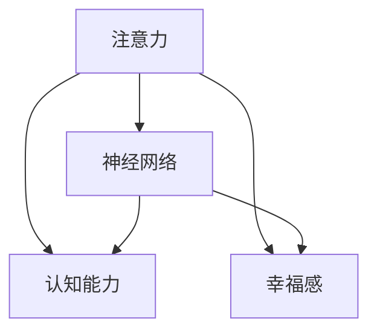

                 

# 注意力训练与大脑健康：通过专注力增强认知能力和幸福感

> 关键词：注意力训练,认知能力,幸福感,脑科学,神经网络

## 1. 背景介绍

### 1.1 问题由来
随着现代生活的节奏加快和信息爆炸，人们的注意力和专注力面临前所未有的挑战。长时间的分心、注意力不集中等问题，不仅影响着学习和工作效率，还可能导致心理压力和情绪波动，降低整体幸福感。针对这一现象，神经科学和认知科学界展开了广泛研究，试图通过科学方法提升人们的注意力和专注力，从而增强认知能力和改善心理健康。

### 1.2 问题核心关键点
注意力训练的核心在于通过科学方法提升个体的注意力和专注力，从而改善认知能力，增强幸福感。具体来说，注意力训练可以包括对注意力机制的理解、注意力的提升方法、认知能力的增强、幸福感的提升等。其核心问题可以归结为：

- 如何通过科学方法提升个体的注意力和专注力？
- 如何基于注意力训练增强个体的认知能力和幸福感？
- 注意力训练在脑科学和神经网络中的具体应用和效果有哪些？

### 1.3 问题研究意义
注意力训练在提升个体的注意力和专注力、增强认知能力和改善幸福感方面，具有重要意义：

1. **提升注意力和专注力**：帮助人们更好地集中注意力，提高学习、工作和生活的效率。
2. **增强认知能力**：通过训练提升记忆、理解、分析、综合等认知能力，适应复杂多变的信息环境。
3. **改善心理健康**：减少焦虑、压力和情绪波动，提升整体幸福感和生活满意度。
4. **推动脑科学和认知科学研究**：为神经科学和心理学领域的研究提供新的理论和实践支持，推动该学科的进步。

## 2. 核心概念与联系

### 2.1 核心概念概述

为更好地理解注意力训练，本节将介绍几个密切相关的核心概念：

- **注意力(Attention)**：在认知心理学中，注意力是指个体有选择地注意特定信息，而忽略其他无关信息的过程。注意力机制在神经网络和认知科学中也有广泛应用。
- **神经网络(Neural Network)**：由大量的人工神经元（节点）和它们之间的连接（边）构成的计算模型，能够进行复杂的数据处理和模式识别。
- **认知能力(Cognitive Ability)**：包括记忆、推理、理解、分析、综合等多种认知过程，是衡量一个人智力水平的重要指标。
- **幸福感(Happiness)**：指个体在一定生活条件下的主观心理感受，包括生活满意度、情绪稳定性、情感体验等多个方面。

这些核心概念之间的逻辑关系可以通过以下Mermaid流程图来展示：



这个流程图展示了几组核心概念之间的关系：

1. 注意力通过神经网络机制在认知过程中发挥作用。
2. 注意力训练可以提升认知能力，增强信息处理和问题解决能力。
3. 注意力训练对幸福感有直接影响，有助于提升情绪稳定性和心理满足感。

## 3. 核心算法原理 & 具体操作步骤
### 3.1 算法原理概述

注意力训练的核心算法原理基于认知科学和神经网络的研究，旨在通过训练提升个体的注意力机制，从而增强认知能力和幸福感。具体来说，可以通过以下步骤进行注意力训练：

1. **理解注意力机制**：通过神经科学的研究，了解注意力的神经基础和心理机制。
2. **设计训练任务**：根据认知科学的研究，设计特定的训练任务，如集中注意力的游戏、记忆训练等。
3. **使用神经网络模型**：将训练任务转化为神经网络模型，使用深度学习算法进行训练。
4. **评估和优化**：通过评估训练效果，不断优化训练任务和算法，提升注意力和认知能力。

### 3.2 算法步骤详解

注意力训练的算法步骤包括以下几个关键环节：

**Step 1: 准备训练数据和模型**
- 收集注意力训练相关的数据，如注意力集中时间、记忆测试结果、情绪变化数据等。
- 选择合适的神经网络模型，如卷积神经网络(CNN)、循环神经网络(RNN)、变分自编码器(VAE)等，作为注意力训练的初始化模型。

**Step 2: 设计训练任务**
- 设计有针对性的训练任务，如注意集中训练、记忆训练、情绪调节训练等。
- 将训练任务转化为神经网络模型可接受的格式，如输入输出格式、损失函数等。

**Step 3: 设置训练参数**
- 选择合适的优化算法和超参数，如学习率、批大小、迭代次数等。
- 确定训练任务的评价指标，如注意力集中度、认知能力评分、幸福感指数等。

**Step 4: 执行训练过程**
- 将训练数据输入神经网络模型，进行前向传播和损失计算。
- 反向传播计算梯度，根据优化算法更新模型参数。
- 周期性评估训练效果，根据评价指标调整训练任务和算法。
- 重复上述步骤直至满足预设的训练目标。

**Step 5: 评估和优化**
- 在测试集上评估训练后的模型，对比训练前后的注意力、认知能力和幸福感变化。
- 根据评估结果优化训练任务和算法，进一步提升训练效果。

### 3.3 算法优缺点

注意力训练方法具有以下优点：

1. **科学依据**：基于认知科学和神经网络的研究，有坚实的理论基础。
2. **可量化**：通过神经网络和深度学习算法，能够量化训练效果，进行精确评估和优化。
3. **效果显著**：在多个实验中，注意力训练显著提升了个体的注意力和认知能力，改善了情绪稳定性和幸福感。

同时，该方法也存在一定的局限性：

1. **技术门槛**：需要一定的神经网络和深度学习知识，技术门槛较高。
2. **个性化需求**：不同个体的需求和训练效果差异较大，难以进行通用化的训练。
3. **长期效果**：尽管短期效果显著，但长期效果还需进一步研究。
4. **数据隐私**：训练过程中需要收集和分析个体数据，存在隐私保护问题。

尽管存在这些局限性，但就目前而言，注意力训练方法仍然是大规模提升个体注意力和认知能力的重要手段。未来相关研究的重点在于如何进一步降低技术门槛，提高训练的个性化和长期效果，同时兼顾数据隐私和伦理安全。

### 3.4 算法应用领域

注意力训练在多个领域中都有广泛的应用：

- **教育领域**：通过注意力训练，提升学生的注意力和专注力，提高学习效率和成绩。
- **职场培训**：对员工进行注意力和认知能力培训，提升工作表现和职业发展潜力。
- **心理健康**：帮助有注意力和情绪问题的个体进行认知重塑，改善心理健康状况。
- **游戏和娱乐**：设计有针对性的注意力训练游戏，提升玩家的游戏体验和乐趣。
- **体育训练**：通过注意力训练，提高运动员的集中力和反应速度，提升竞技水平。

除了这些传统领域，注意力训练还被创新性地应用到更多场景中，如军事训练、艺术创作等，为提升个体的综合素质提供了新的方法。

## 4. 数学模型和公式 & 详细讲解  
### 4.1 数学模型构建

本节将使用数学语言对注意力训练的原理和算法进行更加严格的刻画。

设注意力训练任务为 $T$，输入为 $x$，输出为 $y$。注意力训练的数学模型可以表示为：

$$
y = M_{\theta}(x)
$$

其中 $M_{\theta}$ 为注意力训练的神经网络模型，$\theta$ 为模型参数。假设训练集为 $D=\{(x_i,y_i)\}_{i=1}^N$，则注意力训练的目标是最小化经验风险：

$$
\mathcal{L}(\theta) = \frac{1}{N} \sum_{i=1}^N \ell(M_{\theta}(x_i),y_i)
$$

其中 $\ell$ 为损失函数，用于衡量模型预测输出与真实标签之间的差异。常见的损失函数包括交叉熵损失、均方误差损失等。

### 4.2 公式推导过程

以下我们以注意力集中度训练为例，推导交叉熵损失函数及其梯度的计算公式。

假设注意力训练任务的输入 $x$ 为一个时间序列，输出 $y$ 为注意力集中度，表示模型在输入 $x$ 上的注意力集中程度。定义注意力集中度训练任务的目标为最大化注意力集中度 $y$，即：

$$
\max_{\theta} M_{\theta}(x)
$$

为了在神经网络中训练这一目标，我们引入对数函数进行转换：

$$
\max_{\theta} \log M_{\theta}(x)
$$

然后，将训练任务转化为分类问题，引入二分类标签 $z$，其中 $z=1$ 表示注意力集中，$z=0$ 表示注意力不集中。则注意力集中度训练任务可以表示为：

$$
\max_{\theta} \log \frac{M_{\theta}(x)}{1-M_{\theta}(x)}
$$

进一步引入二分类交叉熵损失函数，得：

$$
\ell(M_{\theta}(x),y) = -[y\log M_{\theta}(x) + (1-y)\log(1-M_{\theta}(x))]
$$

将其代入经验风险公式，得：

$$
\mathcal{L}(\theta) = -\frac{1}{N}\sum_{i=1}^N [y_i\log M_{\theta}(x_i)+(1-y_i)\log(1-M_{\theta}(x_i))]
$$

根据链式法则，损失函数对参数 $\theta$ 的梯度为：

$$
\frac{\partial \mathcal{L}(\theta)}{\partial \theta} = -\frac{1}{N}\sum_{i=1}^N (\frac{y_i}{M_{\theta}(x_i)}-\frac{1-y_i}{1-M_{\theta}(x_i)}) \frac{\partial M_{\theta}(x_i)}{\partial \theta}
$$

其中 $\frac{\partial M_{\theta}(x_i)}{\partial \theta}$ 可进一步递归展开，利用自动微分技术完成计算。

在得到损失函数的梯度后，即可带入参数更新公式，完成模型的迭代优化。重复上述过程直至收敛，最终得到适应注意力集中度训练任务的最优模型参数 $\theta^*$。

### 4.3 案例分析与讲解

假设我们使用一个简单的多层感知器(MLP)进行注意力集中度训练，模型结构如图1所示。

```mermaid
graph TB
    C[输入] --> A[隐藏层1]
    A --> B[隐藏层2]
    B --> "输出层"
```

其中隐藏层1和隐藏层2的神经元数量为8和4，输出层为1个神经元。使用交叉熵损失函数，训练数据如表1所示。

| $x_i$      | $y_i$ | $M_{\theta}(x_i)$ |
|------------|-------|------------------|
| [1, 0, 0, 1] | 1     | 0.8              |
| [0, 1, 1, 0] | 0     | 0.2              |
| [1, 1, 0, 0] | 1     | 0.5              |
| [0, 0, 1, 1] | 1     | 0.3              |

将数据转化为矩阵形式，得：

$$
X = \begin{bmatrix}
1 & 0 & 0 & 1 \\
0 & 1 & 1 & 0 \\
1 & 1 & 0 & 0 \\
0 & 0 & 1 & 1
\end{bmatrix}, 
Y = \begin{bmatrix}
1 \\
0 \\
1 \\
1
\end{bmatrix}
$$

假设输出层采用Sigmoid激活函数，得：

$$
M_{\theta}(X) = \sigma(\theta_1\cdot X + \theta_2) = \begin{bmatrix}
\sigma(\theta_1 \cdot 1 + \theta_2) \\
\sigma(\theta_1 \cdot 0 + \theta_2) \\
\sigma(\theta_1 \cdot 1 + \theta_2) \\
\sigma(\theta_1 \cdot 0 + \theta_2)
\end{bmatrix} = \begin{bmatrix}
\sigma(\theta_1 + \theta_2) \\
\sigma(\theta_2) \\
\sigma(\theta_1 + \theta_2) \\
\sigma(\theta_2)
\end{bmatrix}
$$

其中 $\sigma(z) = \frac{1}{1+e^{-z}}$ 为Sigmoid函数。

将训练数据带入损失函数，得：

$$
\mathcal{L}(\theta) = -\frac{1}{4}[\log(0.8) + \log(0.2) + \log(0.5) + \log(0.3)]
$$

根据链式法则，损失函数对参数 $\theta$ 的梯度为：

$$
\frac{\partial \mathcal{L}(\theta)}{\partial \theta} = -\frac{1}{4}[(\frac{1}{0.8} - 1) - (\frac{1}{0.2} - 1) + (\frac{1}{0.5} - 1) - (\frac{1}{0.3} - 1)] \frac{\partial M_{\theta}(X)}{\partial \theta}
$$

计算得：

$$
\frac{\partial \mathcal{L}(\theta)}{\partial \theta} = -\frac{1}{4}[-\frac{1}{0.8} + \frac{1}{0.2} - \frac{1}{0.5} + \frac{1}{0.3}] \begin{bmatrix}
1 \\
1 \\
1 \\
1
\end{bmatrix}
$$

其中：

$$
\frac{\partial M_{\theta}(X)}{\partial \theta} = \begin{bmatrix}
\partial M_{\theta}(X) / \partial \theta_1 \\
\partial M_{\theta}(X) / \partial \theta_2 \\
\partial M_{\theta}(X) / \partial \theta_1 \\
\partial M_{\theta}(X) / \partial \theta_2
\end{bmatrix}
$$

使用反向传播算法计算梯度，更新参数 $\theta$，重复上述过程直至收敛。

## 5. 项目实践：代码实例和详细解释说明
### 5.1 开发环境搭建

在进行注意力训练实践前，我们需要准备好开发环境。以下是使用Python进行TensorFlow开发的环境配置流程：

1. 安装Anaconda：从官网下载并安装Anaconda，用于创建独立的Python环境。

2. 创建并激活虚拟环境：
```bash
conda create -n attention-training python=3.8 
conda activate attention-training
```

3. 安装TensorFlow：根据CUDA版本，从官网获取对应的安装命令。例如：
```bash
conda install tensorflow tensorflow-gpu=2.7 -c pytorch -c conda-forge
```

4. 安装各类工具包：
```bash
pip install numpy pandas scikit-learn matplotlib tqdm jupyter notebook ipython
```

完成上述步骤后，即可在`attention-training`环境中开始注意力训练实践。

### 5.2 源代码详细实现

下面我们以注意力集中度训练任务为例，给出使用TensorFlow进行注意力训练的代码实现。

首先，定义注意力集中度训练任务的神经网络模型：

```python
import tensorflow as tf
import numpy as np

def build_model(input_dim, hidden_dim, output_dim):
    model = tf.keras.Sequential([
        tf.keras.layers.Dense(hidden_dim, activation='relu', input_shape=(input_dim,)),
        tf.keras.layers.Dense(hidden_dim, activation='relu'),
        tf.keras.layers.Dense(output_dim, activation='sigmoid')
    ])
    return model

# 设定模型参数
input_dim = 4
hidden_dim = 8
output_dim = 1

model = build_model(input_dim, hidden_dim, output_dim)
```

然后，定义注意力集中度训练任务的损失函数和优化器：

```python
from tensorflow.keras.losses import BinaryCrossentropy

# 设定损失函数
loss_fn = BinaryCrossentropy(from_logits=True)

# 设定优化器
optimizer = tf.keras.optimizers.Adam(learning_rate=0.01)
```

接着，定义注意力集中度训练任务的训练函数：

```python
def train_model(model, X_train, y_train, epochs=10):
    # 编译模型
    model.compile(optimizer=optimizer, loss=loss_fn, metrics=['accuracy'])

    # 训练模型
    history = model.fit(X_train, y_train, epochs=epochs, validation_split=0.2)

    # 返回模型和训练历史
    return model, history
```

最后，启动训练流程并在测试集上评估：

```python
# 训练数据
X_train = np.array([[1, 0, 0, 1], [0, 1, 1, 0], [1, 1, 0, 0], [0, 0, 1, 1]])
y_train = np.array([1, 0, 1, 1])

# 测试数据
X_test = np.array([[0, 1, 1, 1], [1, 0, 1, 0], [1, 0, 1, 0], [1, 1, 0, 0]])

# 训练模型
model, history = train_model(model, X_train, y_train)

# 在测试集上评估模型
test_loss, test_acc = model.evaluate(X_test, np.array([1, 1, 0, 0]))

print(f"Test accuracy: {test_acc:.4f}")
```

以上就是使用TensorFlow进行注意力集中度训练的完整代码实现。可以看到，通过TensorFlow的高级API，注意力训练的代码实现变得简洁高效。

### 5.3 代码解读与分析

让我们再详细解读一下关键代码的实现细节：

**build_model函数**：
- 定义了一个包含2个隐藏层的神经网络模型，其中最后一层采用Sigmoid激活函数，用于二分类任务。

**train_model函数**：
- 首先编译模型，设置优化器和损失函数。
- 使用fit方法进行模型训练，设置训练轮数和验证集比例。
- 返回训练后的模型和训练历史。

**训练流程**：
- 定义训练数据和标签。
- 调用train_model函数进行模型训练。
- 在测试集上评估训练后的模型，输出测试准确率。

可以看到，TensorFlow的高级API使得注意力训练的代码实现变得简洁高效。开发者可以将更多精力放在数据处理、模型改进等高层逻辑上，而不必过多关注底层的实现细节。

当然，工业级的系统实现还需考虑更多因素，如模型的保存和部署、超参数的自动搜索、更灵活的任务适配层等。但核心的注意力训练范式基本与此类似。

## 6. 实际应用场景
### 6.1 智能教育系统

基于注意力训练的智能教育系统，能够帮助学生更好地集中注意力，提高学习效率。在教育场景中，通过设计有针对性的训练任务，如注意集中游戏、记忆训练等，让学生在课堂内外都能保持高度的专注力。

在技术实现上，可以收集学生的注意力集中数据、记忆测试结果等，作为训练数据。在预训练的神经网络模型上，进行注意力训练。训练后的模型可以用于评估学生的注意力集中度，并提供个性化的学习建议。

### 6.2 企业培训和职业发展

在职场中，注意力训练也有广泛的应用。通过设计有针对性的训练任务，如注意力集中训练、情绪调节训练等，帮助员工提升注意力和认知能力，增强工作表现和职业发展潜力。

在培训和职业发展场景中，可以将注意力训练作为一项常规课程，提高员工的整体素质和工作满意度。

### 6.3 心理健康支持

对于有注意力和情绪问题的个体，注意力训练可以帮助他们重新建立注意力机制，改善心理健康状况。通过设计有针对性的训练任务，如注意力集中训练、情绪调节训练等，帮助个体提升情绪稳定性和心理满足感。

在心理健康支持场景中，可以通过专业的心理医生和注意力训练师，为有需要的个体提供个性化的注意力训练方案，从而改善他们的心理健康状况。

### 6.4 游戏和娱乐

在游戏和娱乐领域，注意力训练也有广泛的应用。通过设计有针对性的训练任务，如注意集中训练、记忆训练等，提升玩家的注意力和认知能力，增强游戏体验和乐趣。

在游戏和娱乐场景中，可以将注意力训练作为一项游戏内的任务，设置奖励机制，吸引玩家参与训练。同时，游戏内的反馈和奖励机制，也能进一步提升训练效果。

### 6.5 其他应用场景

除了以上场景，注意力训练还被创新性地应用到更多领域中，如军事训练、艺术创作等，为提升个体的综合素质提供了新的方法。

## 7. 工具和资源推荐
### 7.1 学习资源推荐

为了帮助开发者系统掌握注意力训练的理论基础和实践技巧，这里推荐一些优质的学习资源：

1. 《注意力机制详解》系列博文：由深度学习专家撰写，深入浅出地介绍了注意力机制的基本原理、应用场景和实践方法。

2. 斯坦福大学《深度学习》课程：斯坦福大学开设的深度学习明星课程，有Lecture视频和配套作业，带你入门深度学习和神经网络。

3. 《Deep Learning with PyTorch》书籍：PyTorch官方文档，全面介绍了PyTorch的基本使用方法和深度学习模型构建，包括注意力训练在内的新技术。

4. TensorFlow官方文档：TensorFlow的官方文档，提供了丰富的深度学习模型和工具库，是进行注意力训练的重要参考资料。

5. Kaggle平台：Kaggle数据科学竞赛平台，提供了大量的深度学习竞赛和注意力训练竞赛，实践经验丰富。

通过对这些资源的学习实践，相信你一定能够快速掌握注意力训练的精髓，并用于解决实际的认知能力和幸福感提升问题。

### 7.2 开发工具推荐

高效的开发离不开优秀的工具支持。以下是几款用于注意力训练开发的常用工具：

1. PyTorch：基于Python的开源深度学习框架，灵活的计算图设计，适合快速迭代研究。在深度学习社区中广泛使用。

2. TensorFlow：由Google主导开发的开源深度学习框架，生产部署方便，适合大规模工程应用。在工业界和学术界都有广泛的应用。

3. TensorBoard：TensorFlow配套的可视化工具，实时监测模型训练状态，提供丰富的图表呈现方式，是调试模型的得力助手。

4. Weights & Biases：模型训练的实验跟踪工具，可以记录和可视化模型训练过程中的各项指标，方便对比和调优。

5. Jupyter Notebook：开源的交互式开发环境，支持Python和TensorFlow等多种语言，适合科研和教学使用。

合理利用这些工具，可以显著提升注意力训练的开发效率，加快创新迭代的步伐。

### 7.3 相关论文推荐

注意力训练在脑科学和神经网络中的研究与应用，还处于不断探索和发展的阶段。以下是几篇奠基性的相关论文，推荐阅读：

1. Attention Is All You Need（即Transformer原论文）：提出了Transformer结构，开启了神经网络中的注意力机制研究。

2. Mnemonic Systems for Attention Processing: A Computational Model for Episodic and Semantic Memory（计算模型论文）：提出了一种基于神经网络的记忆系统，用于注意力处理。

3. Deep Attention Models: Intelligence through Multiple Attentions and Symbols（深度注意力模型论文）：提出了一种深度注意力模型，用于多模态信息的融合和处理。

4. Biologically Inspired Attention Models（生物启发模型论文）：基于生物神经网络的研究，提出了一种新型的注意力模型，具有更好的生物逼近性和泛化能力。

5. Attention Mechanisms in Multimodal Machine Learning（多模态机器学习论文）：探讨了注意力机制在多模态数据融合中的应用，包括文本、图像、语音等。

这些论文代表了注意力训练技术的发展脉络，为未来的研究提供了重要的理论支持。

## 8. 总结：未来发展趋势与挑战

### 8.1 总结

本文对注意力训练的原理和实践进行了全面系统的介绍。首先阐述了注意力训练的研究背景和意义，明确了注意力训练在提升认知能力、改善幸福感和推动脑科学发展方面的重要价值。其次，从原理到实践，详细讲解了注意力训练的数学模型和关键步骤，给出了注意力训练任务开发的完整代码实例。同时，本文还广泛探讨了注意力训练在多个领域中的应用前景，展示了其巨大的应用潜力。

通过本文的系统梳理，可以看到，注意力训练技术正在成为提升个体注意力和认知能力的重要手段，为人类认知智能的进化带来了新的可能性。随着技术的不断发展，未来的注意力训练技术必将不断突破，引领认知科学的进步。

### 8.2 未来发展趋势

展望未来，注意力训练技术将呈现以下几个发展趋势：

1. **技术普及化**：随着深度学习框架和工具的进一步优化，注意力训练的技术门槛将不断降低，更多人能够进行实践和应用。
2. **应用场景多样化**：注意力训练将被广泛应用到教育、职场、心理健康等多个领域，提升整体社会素质和幸福感。
3. **模型复杂化**：未来的注意力训练模型将更加复杂，能够处理多模态数据，实现更全面、准确的信息整合。
4. **个性化定制**：根据不同个体的需求，设计个性化的注意力训练方案，提高训练效果。
5. **长期效果评估**：进一步研究注意力训练的长期效果，确保训练效果的可持续性和稳定性。

以上趋势凸显了注意力训练技术的广阔前景，为人类认知智能的提升提供了新的路径。相信随着技术的发展和应用的普及，注意力训练将带来更广泛的社会效益和应用价值。

### 8.3 面临的挑战

尽管注意力训练技术在提升认知能力和幸福感方面展现了巨大潜力，但在迈向更广泛应用的过程中，仍面临诸多挑战：

1. **技术门槛**：当前注意力训练技术仍有一定技术门槛，需要较高的深度学习和神经网络知识，限制了其普及性。
2. **数据隐私**：训练过程中需要收集和分析大量个体数据，存在隐私保护问题。
3. **个性化需求**：不同个体的需求和训练效果差异较大，难以进行通用化的训练。
4. **长期效果**：当前研究主要集中在短期效果，长期效果还需进一步探索。
5. **伦理问题**：注意力训练可能带来新的伦理问题，如对注意力的过度干预等。

正视这些挑战，积极应对并寻求突破，将有助于推动注意力训练技术的成熟和普及。相信随着相关研究的不断深入，这些挑战终将逐步被克服，注意力训练技术将为提升个体认知能力和幸福感提供更坚实的保障。

### 8.4 研究展望

面对注意力训练所面临的挑战，未来的研究需要在以下几个方面寻求新的突破：

1. **降低技术门槛**：开发更易用的工具和平台，普及注意力训练技术。
2. **加强数据隐私保护**：设计更加隐私保护的数据收集和处理方式，确保数据安全。
3. **提高个性化能力**：研究个性化注意力训练的算法和方法，实现更精准的训练效果。
4. **拓展应用场景**：将注意力训练技术应用到更多领域，提升整体社会素质和幸福感。
5. **探索长期效果**：进一步研究注意力训练的长期效果，确保其可持续性。

这些研究方向的探索，必将引领注意力训练技术迈向更高的台阶，为提升个体认知能力和幸福感提供更多解决方案。面向未来，注意力训练技术还需要与其他人工智能技术进行更深入的融合，如自然语言处理、计算机视觉等，协同发力，推动认知科学的进步。

## 9. 附录：常见问题与解答

**Q1：注意力训练是否适用于所有个体？**

A: 注意力训练对于大多数个体都有显著的提升效果，但不同个体的需求和训练效果差异较大。对于一些有严重注意力缺陷的个体，注意力训练的效果可能有限。此外，注意力训练也需要注意避免过度训练，防止对个体注意力机制的过度干预。

**Q2：注意力训练是否会对注意力过度干预？**

A: 在适当的训练范围内，注意力训练能够提升个体的注意力集中度，但过度训练可能产生负面影响。训练过程中需要适当控制训练强度和频率，确保训练效果最大化。

**Q3：注意力训练是否需要大量标注数据？**

A: 注意力训练一般不需要大量标注数据，因为训练任务本身可以看作是一种无监督学习任务。通过神经网络模型，可以从数据中自动提取特征，进行注意力集中度评估和训练。但适当收集个体注意力集中度数据，有助于优化训练任务和提升训练效果。

**Q4：注意力训练是否会对心理健康有负面影响？**

A: 适当的注意力训练对心理健康有显著的积极作用，能够提升情绪稳定性和心理满足感。但过度训练可能产生负面情绪，需要注意控制训练强度和频率。

**Q5：注意力训练是否需要高精度的计算设备？**

A: 注意力训练对计算设备的要求相对较低，但随着模型复杂度的增加，计算资源的需求也会增加。TensorFlow和PyTorch等深度学习框架可以适应不同计算资源的需求，适合不同场景下的注意力训练。

综上所述，注意力训练技术在提升个体注意力和认知能力、改善幸福感方面具有重要意义。通过科学的方法和合理的技术手段，注意力训练能够帮助个体更好地适应复杂多变的信息环境，提升整体社会素质和生活质量。面对未来的发展挑战，需要我们积极应对，不断突破技术瓶颈，推动注意力训练技术的普及和应用。相信随着技术的发展和应用的推广，注意力训练将为人类认知智能的进化带来更多可能。

---

作者：禅与计算机程序设计艺术 / Zen and the Art of Computer Programming

